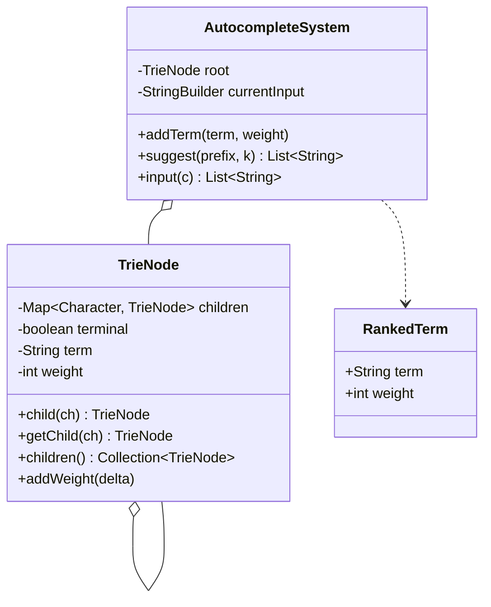
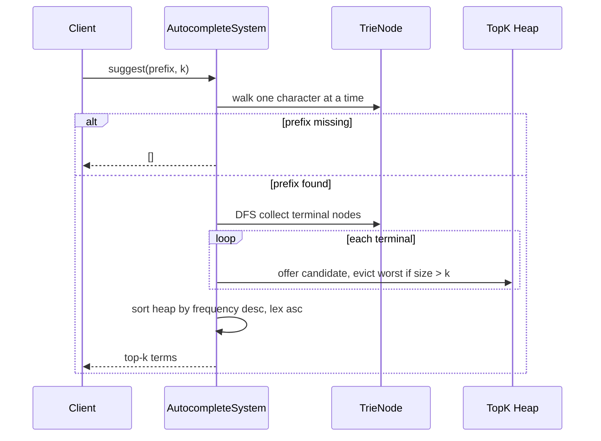

# Trie Autocomplete System — LLD Machine Coding (Java)

An end-to-end MVP of a Search Autocomplete / Typeahead system, built for an SDE2 machine-coding
round. It demonstrates Trie modelling, prefix lookup, top-k ranking with a heap, and the LC642-style
interactive `input(char)` flow.

> A parallel Python implementation lives in `../python` with its own README. Both produce identical
> demo output.

---

## 1. Why this MVP?

A machine-coding interviewer looks for: clean domain modelling, the right data structure, a correct
ranking rule, and working tests — delivered in ~45 minutes. So the MVP is the **smallest system that
still exercises all of those**:

**In scope**
- Trie storing historical terms/sentences and their frequencies
- `addTerm(term, weight)` to ingest or update the corpus
- `suggest(prefix, k)` returning top-k matches by **frequency desc, lexicographic asc**
- Heap-based top-k collection after a prefix walk
- LC642-style `input(char)` where `#` commits the buffered sentence with weight `1`

**Deliberately out of scope** (extension points, not core learning value): distributed indexing,
persistence/DB, personalization, fuzzy matching, typo tolerance, caching, and REST/UI layers. Each is
noted below under *Extending*.

---

## 2. UML

### Class diagram


### Suggest sequence


---

## 3. Design decisions

| Decision | Reasoning |
| --- | --- |
| **Trie over a hash-map scan** | Prefix lookup is `O(len(prefix))` before collecting only the matching subtree. |
| **Terminal node stores `term + weight`** | The node itself is the source of truth for frequency; duplicate ingests increment weight. |
| **`TreeMap` children** | Deterministic traversal order, useful for tests and predictable demos. |
| **Min-heap of worst candidate first** | Keeps memory at `O(k)` while scanning the subtree; when size exceeds `k`, evict the lowest-ranked item. |
| **Final sort of heap contents** | Heap internals are not ordered, so the result is sorted by the public ranking rule before returning. |
| **Single-threaded MVP** | LC642-style object is stateful because `input` owns a mutable buffer. A production version would guard updates with a read/write lock or shard by prefix. |

### Ranking model (the key part)
Candidates are better when they have a higher frequency. If frequencies tie, the lexicographically
smaller term is better. The heap comparator intentionally puts the **worst** candidate first
(lowest frequency, then lexicographically largest), so overflowing the heap removes exactly the item
that cannot belong in the top `k`.

---

## 4. Code flow

```
Main → AutocompleteSystem.addTerm → TrieNode.child per char → mark terminal + add weight
Main → AutocompleteSystem.suggest
        → walk prefix characters from root
        → DFS matching subtree
        → maintain bounded heap → final ranking sort → return terms
AutocompleteSystem.input → append char, suggest(buffer, 3)
AutocompleteSystem.input('#') → addTerm(buffer, 1) → clear buffer → []
```

Package layout:
```
com.example.autocomplete
├── model/      TrieNode, RankedTerm
├── service/    AutocompleteSystem
└── Main.java   runnable demo
```

---

## 5. How to run

Prerequisites: JDK 17+ and Maven.

```powershell
cd java

# run the test suite (5 tests incl. a realistic corpus test)
mvn test

# run the demo
mvn -q compile exec:java "-Dexec.mainClass=com.example.autocomplete.Main"
```

Expected demo output:
```
Suggestions for 'i': [i love you, island, i love leetcode]
Suggestions for 'i ': [i love you, i love leetcode]
Interactive input 'i': [i love you, island, i love leetcode]
Interactive input ' ': [i love you, i love leetcode]
Interactive input 'a': []
Interactive input '#': []
Suggestions for 'i a': [i a]
```

---

## 6. Tests

`AutocompleteSystemTest` covers:
- prefix suggestions ranked by frequency descending, then lexicographic ascending
- `k` limit respected
- prefix with no matches returns empty
- updating an existing term changes ranking
- longer realistic corpus with product/search phrases and LC642 interactive commit flow

---

## 7. Extending (what a follow-up would add)
- **Thread-safety**: guard `addTerm`/`suggest` with a `ReadWriteLock`; keep `input` buffers per user/session.
- **Persistence**: snapshot terminal nodes to a repository or event log.
- **Personalization**: combine global frequency with per-user/session scores.
- **Fuzzy search**: add edit-distance traversal or a BK-tree for typo tolerance.
