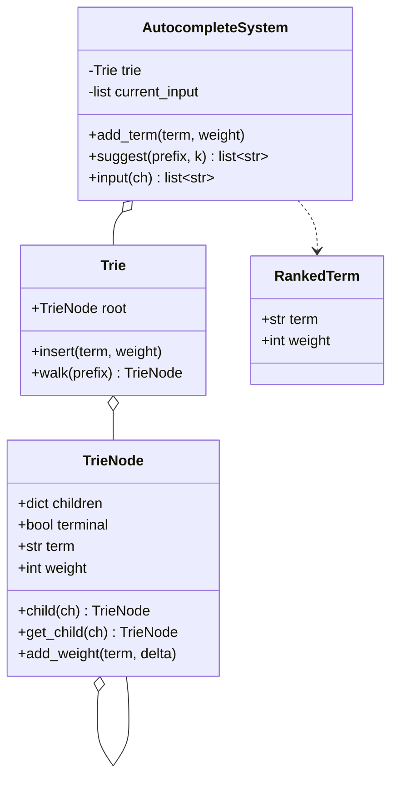
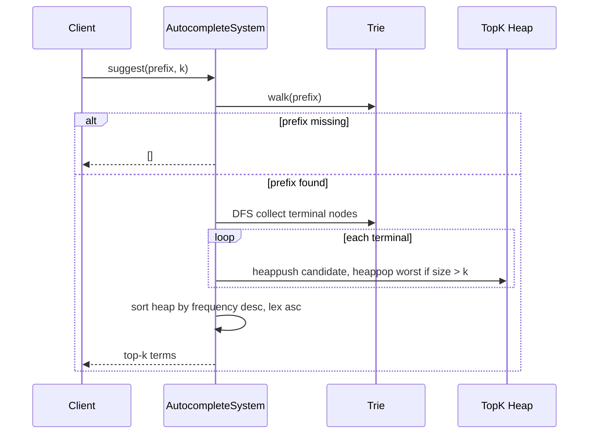

# Trie Autocomplete System — LLD Machine Coding (Python)

An end-to-end MVP of a Search Autocomplete / Typeahead system, built for an SDE2 machine-coding
round. It demonstrates Trie modelling, prefix lookup, top-k ranking with a heap, and the LC642-style
interactive `input(char)` flow.

> A parallel Java implementation lives in `../java` with its own README. Both produce identical
> demo output. The class structure is intentionally 1:1 between the two languages.

---

## 1. Why this MVP?

A machine-coding interviewer looks for clean modelling, the right data structure, correct ranking,
and working tests — in ~45 minutes. The MVP is the **smallest system that still exercises all of
those**:

**In scope**
- Trie storing historical terms/sentences and their frequencies
- `add_term(term, weight)` to ingest or update the corpus
- `suggest(prefix, k)` returning top-k matches by **frequency desc, lexicographic asc**
- Heap-based top-k collection after a prefix walk
- LC642-style `input(ch)` where `#` commits the buffered sentence with weight `1`

**Deliberately out of scope** (extension points): distributed indexing, persistence/DB,
personalization, fuzzy matching, typo tolerance, caching, REST/UI layer. See *Extending* below.

---

## 2. UML

### Class diagram


### Suggest sequence


---

## 3. Design decisions

| Decision | Reasoning |
| --- | --- |
| **Trie over a dict scan** | Prefix lookup is `O(len(prefix))` before collecting only the matching subtree. |
| **Terminal node stores `term + weight`** | The node itself is the source of truth for frequency; duplicate ingests increment weight. |
| **Plain `dict` children** | Python 3.7+ preserves insertion order; result ordering is still controlled by ranking, not traversal. |
| **Min-heap with worst candidate first** | Keeps memory at `O(k)` while scanning the subtree; overflow evicts the item that cannot be in top-k. |
| **Final sort of heap contents** | Heap internals are not ordered, so the public result is sorted by the ranking rule. |
| **Single-threaded MVP** | LC642-style object is stateful because `input` owns a mutable buffer. Production would use locks and per-session buffers. |

### Ranking model (the key part)
Candidates are better when they have a higher frequency. If frequencies tie, the lexicographically
smaller term is better. The heap stores an inverted lexical key so the **worst** candidate is popped
first: lowest frequency, then lexicographically largest.

---

## 4. Code flow

```
main → AutocompleteSystem.add_term → Trie.insert → TrieNode.child per char → terminal + weight
main → AutocompleteSystem.suggest
        → Trie.walk prefix characters
        → DFS matching subtree
        → maintain bounded heap → final ranking sort → return terms
AutocompleteSystem.input → append char, suggest(buffer, 3)
AutocompleteSystem.input('#') → add_term(buffer, 1) → clear buffer → []
```

Module layout:
```
autocomplete/
├── trie.py          TrieNode + Trie insertion/prefix walk
├── autocomplete.py  AutocompleteSystem + ranking/top-k heap
├── __init__.py      package exports
└── main.py          runnable demo
tests/
└── test_autocomplete.py
```

---

## 5. How to run

Prerequisites: Python 3.10+.

```powershell
cd python

# install the test runner (only dependency)
python -m pip install pytest

# run the suite (5 tests incl. a realistic corpus test)
python -m pytest -q

# run the demo
python -m autocomplete.main
```

Expected demo output:
```
Suggestions for 'i': [i love you, island, i love leetcode]
Suggestions for 'i ': [i love you, i love leetcode]
Interactive input 'i': [i love you, island, i love leetcode]
Interactive input ' ': [i love you, i love leetcode]
Interactive input 'a': []
Interactive input '#': []
Suggestions for 'i a': [i a]
```

---

## 6. Tests

`tests/test_autocomplete.py` covers:
- prefix suggestions ranked by frequency descending, then lexicographic ascending
- `k` limit respected
- prefix with no matches returns empty
- updating an existing term changes ranking
- longer realistic corpus with product/search phrases and LC642 interactive commit flow

---

## 7. Extending (what a follow-up would add)
- **Thread-safety**: guard `add_term`/`suggest` with an `RLock`; keep `input` buffers per user/session.
- **Persistence**: snapshot terminal nodes to a repository or event log.
- **Personalization**: combine global frequency with per-user/session scores.
- **Fuzzy search**: add edit-distance traversal or a BK-tree for typo tolerance.
