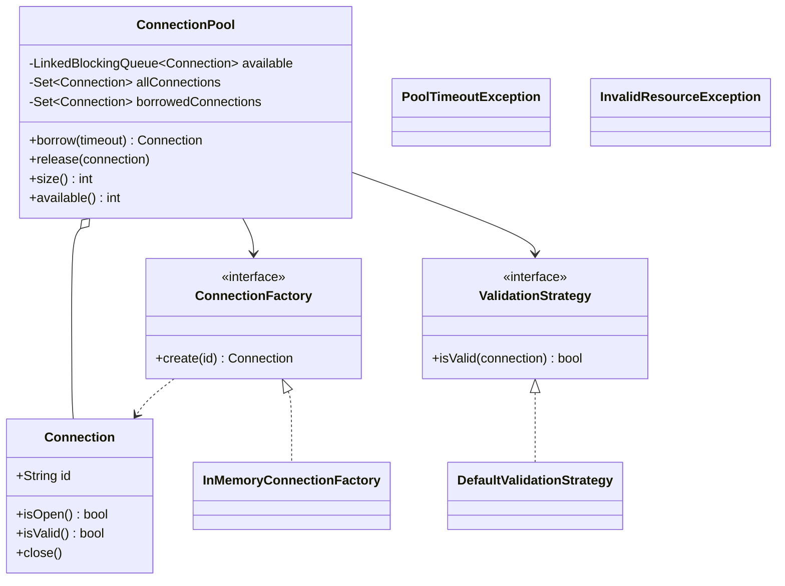
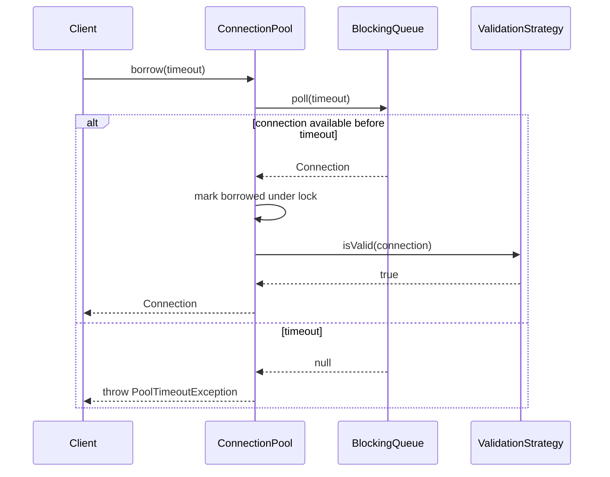

# Connection Pool — LLD Machine Coding (Java)

An end-to-end MVP of a bounded Generic Object / Connection Pool, built for an SDE2 machine-coding
round. It demonstrates the **Factory** and **Strategy** patterns plus **thread-safe** blocking
borrow/release with no over-allocation or double hand-out.

> A parallel Python implementation lives in `../python` with its own README. Both produce identical
> demo output.

---

## 1. Why this MVP?

A machine-coding interviewer looks for clean OOP, one or two design patterns applied for a real
reason, correct concurrency, and working tests — delivered in ~45 minutes. The MVP is the **smallest
system that still exercises all of those**:

**In scope**
- Bounded pool of fake in-memory `Connection` resources
- `borrow(timeout)` → block until available or throw `PoolTimeoutException`
- `release(connection)` → return to pool; reject foreign/double release
- `size` and `available` snapshots
- **Factory** for connection creation
- **Strategy** for validation-on-borrow
- Concurrent borrow/release proof: more threads than capacity all complete, pool never exceeds max

**Deliberately out of scope** (extension points): real DB/network connections, health-check pings,
idle eviction, metrics, async APIs, persistence/config service.

---

## 2. UML

### Class diagram


### Borrow sequence


---

## 3. Design decisions

| Decision | Reasoning |
| --- | --- |
| **Eager fixed-size creation** | Capacity is proven at construction; the factory is called exactly `maxSize` times. |
| **`LinkedBlockingQueue` for free resources** | Gives blocking borrow + timeout without hand-written wait/notify logic. |
| **Identity ownership sets** | Rejects foreign objects and double releases even if ids accidentally match. |
| **Factory for creation** | Pool depends on `ConnectionFactory`, not concrete constructors or real infrastructure. |
| **Validation strategy** | Borrow health policy is swappable without editing pool logic. |
| **Small ownership lock** | Queue handles availability; one lock makes check-and-mark/check-and-remove atomic. |

### Concurrency model (the key part)
`borrow` removes one connection from the blocking queue, so no other thread can receive that same
object. `release` verifies ownership under a lock, appends the connection back to the queue, and
wakes a waiter. The concurrency test starts 50 workers for 5 connections; all workers eventually
borrow/release, max active connections never exceeds 5, and final availability returns to capacity.

---

## 4. Code flow

```
Main → new ConnectionPool(max)
     → factory.create conn-1..conn-N → BlockingQueue
Client.borrow(timeout) → queue.poll(timeout) → mark borrowed → validation strategy → Connection
Client.release(conn) → ownership checks → queue.offer(conn) → next waiter wakes
```

Package layout:
```
com.example.pool
├── model/       Connection
├── factory/     ConnectionFactory, InMemoryConnectionFactory
├── strategy/    ValidationStrategy, DefaultValidationStrategy
├── service/     ConnectionPool
├── exception/   PoolTimeoutException, InvalidResourceException
└── Main.java    runnable demo
```

---

## 5. How to run

Prerequisites: JDK 17+ and Maven.

```powershell
cd java

# run the test suite (5 tests incl. the concurrency borrow/release test)
mvn test

# run the demo
mvn -q compile exec:java "-Dexec.mainClass=com.example.pool.Main"
```

Expected demo output:
```
Pool size: 2
Available at start: 2
Borrowed conn-1
Available after first borrow: 1
Borrowed conn-2
Available after second borrow: 0
Released conn-1
Available after release: 1
Borrowed again conn-1
Available at end: 2
```

---

## 6. Tests

`ConnectionPoolTest` covers:
- borrow up to capacity, then next borrow times out
- release makes one connection available again
- double-release → `InvalidResourceException`
- foreign release → `InvalidResourceException`
- **concurrency**: 50 threads share 5 connections; every thread completes, no active duplicate ids,
  factory calls stay at capacity, final available == capacity

---

## 7. Extending (what a follow-up would add)
- **Lazy creation**: create up to max only when demand appears.
- **Eviction**: close idle/expired resources and replace them safely.
- **Metrics**: wait time, timeout count, utilization, validation failures.
- **Real resources**: swap `InMemoryConnectionFactory` with a DB/socket factory.
