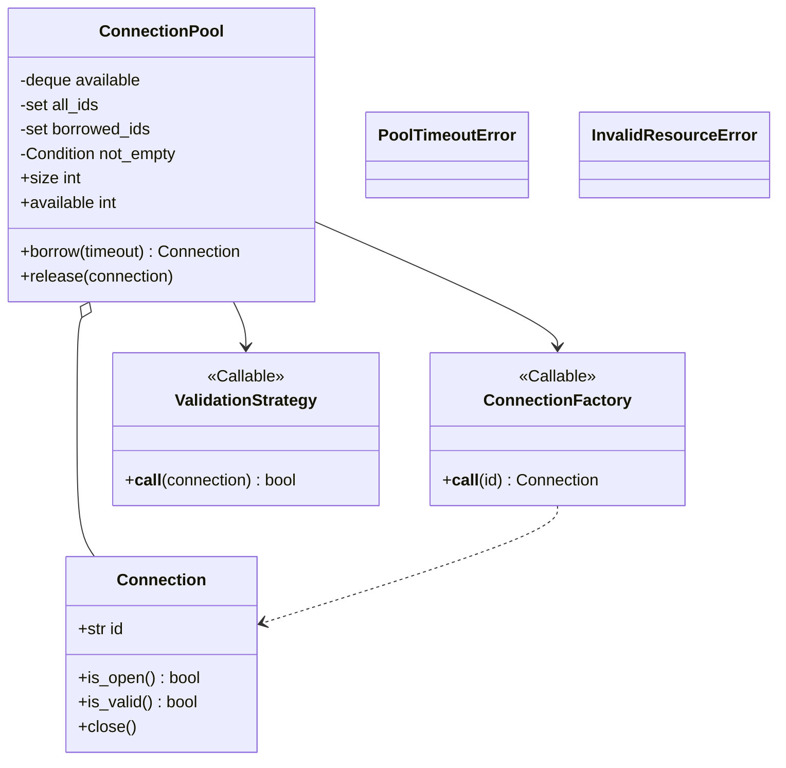
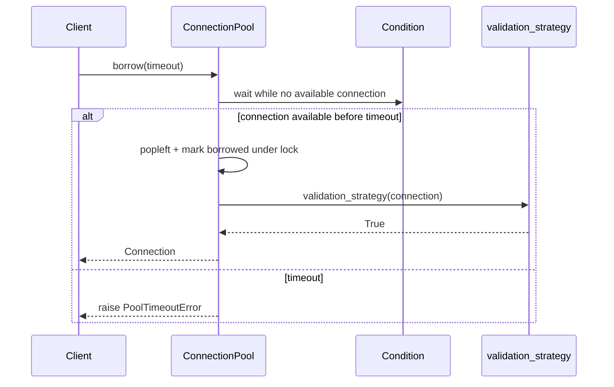

# Connection Pool — LLD Machine Coding (Python)

An end-to-end MVP of a bounded Generic Object / Connection Pool, built for an SDE2 machine-coding
round. It demonstrates the **Factory** and **Strategy** patterns plus **thread-safe** blocking
borrow/release with no over-allocation or double hand-out.

> A parallel Java implementation lives in `../java` with its own README. Both produce identical
> demo output. The class structure is intentionally 1:1 between the two languages.

---

## 1. Why this MVP?

A machine-coding interviewer looks for clean OOP, one or two design patterns applied for a real
reason, correct concurrency, and working tests — in ~45 minutes. The MVP is the **smallest system
that still exercises all of those**:

**In scope**
- Bounded pool of fake in-memory `Connection` resources
- `borrow(timeout)` → block until available or raise `PoolTimeoutError`
- `release(connection)` → return to pool; reject foreign/double release
- `size` and `available` snapshots
- **Factory** callable for connection creation
- **Strategy** callable for validation-on-borrow
- Concurrent borrow/release proof: more threads than capacity all complete, pool never exceeds max

**Deliberately out of scope** (extension points): real DB/network connections, health-check pings,
idle eviction, metrics, async APIs, persistence/config service.

---

## 2. UML

### Class diagram


### Borrow sequence


---

## 3. Design decisions

| Decision | Reasoning |
| --- | --- |
| **Eager fixed-size creation** | Capacity is proven at construction; the factory is called exactly `max_size` times. |
| **`Condition` + `deque`** | Implements blocking borrow with timeout and precise wake-up on release. |
| **Identity ownership sets** | Rejects foreign objects and double releases even if ids accidentally match. |
| **Factory callable** | Pool depends on a creation function, not concrete constructors or real infrastructure. |
| **Validation strategy callable** | Borrow health policy is swappable without editing pool logic. |
| **One lock for queue + ownership** | Popping, marking borrowed, releasing, and notifying are atomic and easy to reason about. |

### Concurrency model (the key part)
`borrow` waits on a condition until `_available` has an object, then pops and marks it borrowed under
the same lock. `release` verifies ownership, appends the connection back, and notifies one waiter.
The concurrency test starts 50 workers for 5 connections; all workers eventually borrow/release, max
active connections never exceeds 5, and final availability returns to capacity.

---

## 4. Code flow

```
main → ConnectionPool(max_size)
     → factory conn-1..conn-N → deque
client.borrow(timeout) → condition wait → popleft → mark borrowed → validation strategy → Connection
client.release(conn) → ownership checks → append → notify waiter
```

Module layout:
```
pool/
├── connection.py       fake Connection resource
├── connection_pool.py  ConnectionPool, factory/validation callables, exceptions
├── __init__.py
└── main.py             runnable demo
tests/
└── test_pool.py
```

---

## 5. How to run

Prerequisites: Python 3.10+.

```powershell
cd python

# install the test runner (only dependency)
python -m pip install pytest

# run the suite (5 tests incl. the concurrency borrow/release test)
python -m pytest -q

# run the demo
python -m pool.main
```

Expected demo output:
```
Pool size: 2
Available at start: 2
Borrowed conn-1
Available after first borrow: 1
Borrowed conn-2
Available after second borrow: 0
Released conn-1
Available after release: 1
Borrowed again conn-1
Available at end: 2
```

---

## 6. Tests

`tests/test_pool.py` covers:
- borrow up to capacity, then next borrow times out
- release makes one connection available again
- double-release → `InvalidResourceError`
- foreign release → `InvalidResourceError`
- **concurrency**: 50 threads share 5 connections; every thread completes, no active duplicate ids,
  factory calls stay at capacity, final available == capacity

---

## 7. Extending (what a follow-up would add)
- **Lazy creation**: create up to max only when demand appears.
- **Eviction**: close idle/expired resources and replace them safely.
- **Metrics**: wait time, timeout count, utilization, validation failures.
- **Real resources**: swap `default_factory` with a DB/socket factory.
