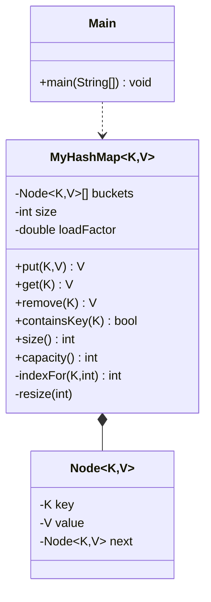
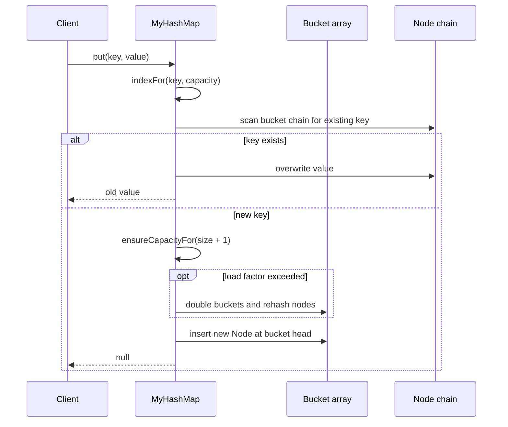

# Custom HashMap — LLD Machine Coding (Java)

A from-scratch generic hash map for the LeetCode 706 / machine-coding flavor. It demonstrates
hashing, bucket indexing, separate chaining, and dynamic resizing without wrapping
`java.util.HashMap`.

> A parallel Python implementation lives in `../python` with its own README. Both produce identical
> demo output.

---

## 1. Why this MVP?

A machine-coding interviewer looks for a clear API, collision handling, resizing, and tests that
prove correctness after rehashing. The MVP is the **smallest complete map** that still exercises all
of those:

**In scope**
- Generic `MyHashMap<K,V>`
- `put`, `get`, `remove`, `containsKey`, `size`
- Separate chaining with linked-list bucket nodes
- Dynamic resizing at load factor `0.75`
- Deterministic demo and JUnit tests, including forced collisions and 2+ resizes

**Deliberately out of scope** (extension points): tree bins, iterators/views, serialization,
concurrent access, and full `java.util.Map` compatibility. See *Extending* below.

---

## 2. UML

### Class diagram


### Put sequence


---

## 3. Design decisions

| Decision | Reasoning |
| --- | --- |
| **Array of bucket heads** | Gives O(1) average access while keeping storage explicit and interview-friendly. |
| **Separate chaining** | Colliding keys are stored in a linked list instead of overwriting each other. |
| **Power-of-two capacity** | Makes bucket calculation fast: `hash & (capacity - 1)`. |
| **Hash spreading** | `h ^ (h >>> 16)` mixes high bits into low bits before masking. |
| **Resize before inserting new keys** | Keeps `size / capacity <= 0.75` after every new insertion. |
| **Overwrite does not resize** | Updating an existing key does not change load factor. |
| **Null key support** | `null` hashes to bucket `0`, mirroring common map behavior. |

### Hashing model (the key part)
Capacity is always rounded to a power of two. Because of that, `index = spreadHash & (capacity - 1)`
is equivalent to modulo for bucket selection but faster and never negative. During resize, capacity
doubles, so every node is re-indexed and moved to the correct new bucket.

---

## 4. Code flow

```
Main → new MyHashMap<>(4)
put → scan chain for key → maybe resize → prepend Node into bucket
get → hash to bucket → scan linked list → value or null
remove → hash to bucket → unlink matching Node → old value or null
resize → double bucket array → rehash every existing Node
```

Package layout:
```
com.example.hashmap
├── MyHashMap.java   generic map, bucket nodes, chaining, resize, hash/index logic
└── Main.java        runnable deterministic demo
```

---

## 5. How to run

Prerequisites: JDK 17+ and Maven.

```powershell
cd java
$mvn = "$env:USERPROFILE\tools\apache-maven-3.9.9\bin\mvn.cmd"

# run the test suite (7 tests incl. collisions and 2+ resizes)
& $mvn -o test

# run the demo after compile/test
java -cp target\classes com.example.hashmap.Main
```

Expected demo output:
```
Initial capacity: 4
After put(1, Alice): Alice
After put(2, Bob): Bob
After overwrite put(1, Alicia): Alicia
Contains key 2: true
Remove key 2: Bob
Contains key 2: false
Size after remove: 1
Capacity after resizing demo: 16
All resize keys retrievable: true
```

---

## 6. Tests

`MyHashMapTest` covers:
- `put` + `get`
- overwrite existing key without increasing size
- `remove`
- absent key behavior
- `containsKey` when the stored value is `null`
- forced hash collisions via same-`hashCode` keys
- dynamic resizing through 2+ doublings with all keys still retrievable

---

## 7. Extending (what a follow-up would add)
- **Concurrency**: a synchronized wrapper or striped locks per bucket for concurrent operations.
- **Iteration**: key/value/entry iterators with fail-fast modification tracking.
- **Tree bins**: convert very long chains to balanced trees under adversarial hashes.
- **Map interface**: implement `java.util.Map<K,V>` once the MVP behavior is stable.
