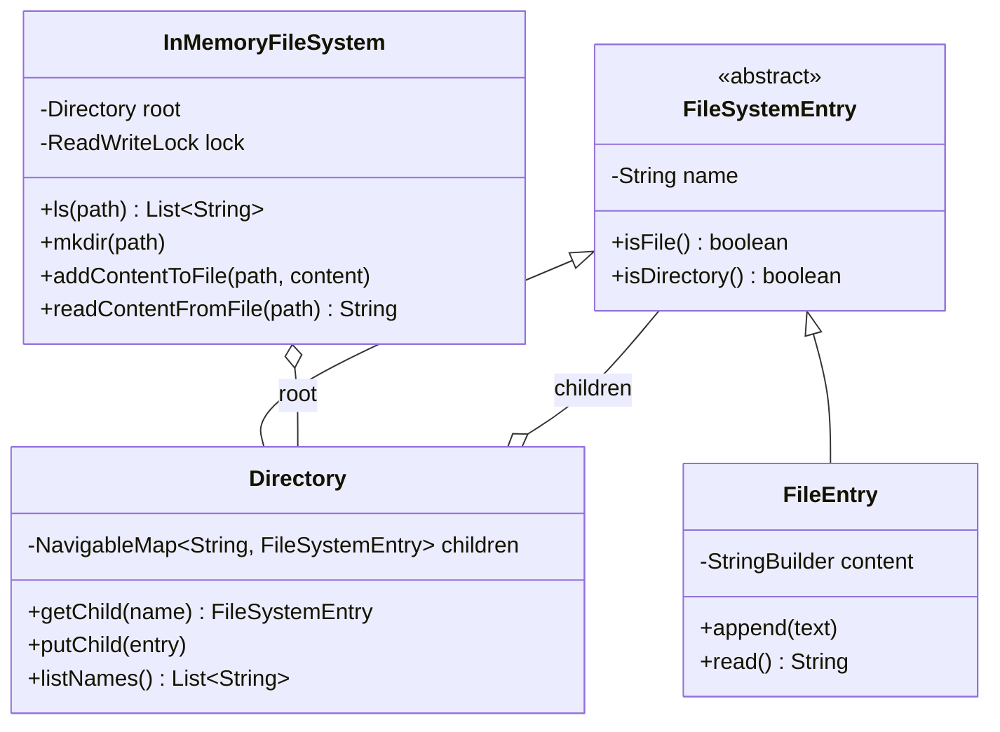
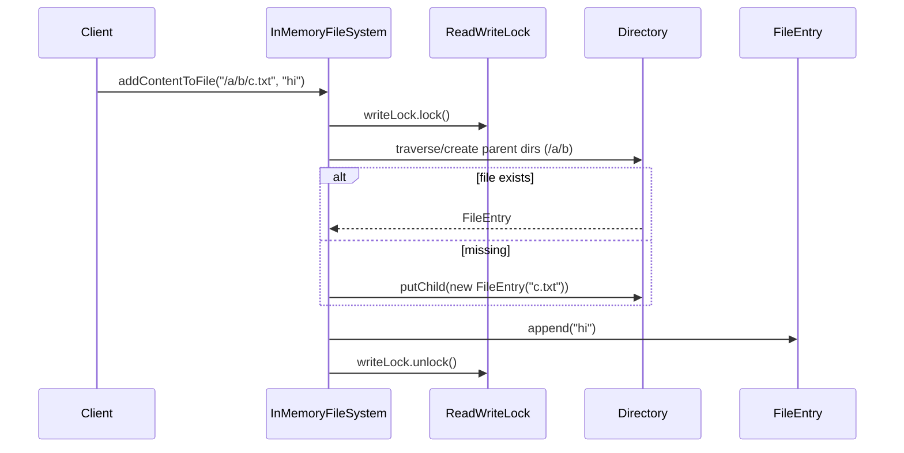

# In-Memory File System — LLD Machine Coding (Java)

An end-to-end MVP of a LeetCode-588-style in-memory file system, built for an SDE2 machine-coding round. It demonstrates OOP modelling, the **Composite** pattern, deterministic tree traversal, and **thread-safe** file-system operations.

> A parallel Python implementation lives in `../python` with its own README. Both produce identical demo output.

---

## 1. Why this MVP?

A machine-coding interviewer looks for clean OOP, a design pattern applied for a real reason, correct concurrency, and working tests — delivered in ~45 minutes. The MVP is the **smallest system that still exercises all of those**:

**In scope**
- `ls(path)` → file name for files, sorted child names for directories
- `mkdir(path)` → recursively creates missing directories
- `addContentToFile(path, content)` → create-or-append
- `readContentFromFile(path)` → returns full file content
- **Composite** model: directories and files share a `FileSystemEntry` abstraction
- Thread-safe tree operations with a `ReadWriteLock`

**Deliberately out of scope** (extension points): persistence/DB, permissions, quotas, symbolic links, streaming large files, REST/UI layer.

---

## 2. UML

### Class diagram


### Add content sequence


---

## 3. Design decisions

| Decision | Reasoning |
| --- | --- |
| **`FileSystemEntry` base class** | Files and directories are treated uniformly while preserving specialized behavior. |
| **Composite `Directory`** | A directory owns child `FileSystemEntry` objects, exactly matching a file-system tree. |
| **`TreeMap` children** | `ls` is naturally lexicographic and deterministic without sorting on every read. |
| **Path parser normalizes `/`** | One traversal path handles root, nested paths, and repeated slashes. |
| **Create parent dirs in file writes** | Matches LeetCode 588 behavior: `addContentToFile` creates missing directories/file. |
| **Read/write lock on tree ops** | Multiple `ls/read` calls can run together; `mkdir/add` are exclusive mutations. |
| **Whole-tree lock for MVP** | Simpler and less bug-prone for interviews; can evolve to per-directory locks later. |

### Concurrency model (the key part)
Every public operation acquires either the read lock (`ls`, `readContentFromFile`) or write lock (`mkdir`, `addContentToFile`). That makes traversal plus mutation atomic from the caller's view, so concurrent writers to different paths cannot corrupt parent-child links or file contents.

---

## 4. Code flow

```
Main → InMemoryFileSystem.mkdir
Main → InMemoryFileSystem.addContentToFile
       → parentDirectory(path, create=true) → Directory.putChild(FileEntry) → append
Main → InMemoryFileSystem.ls
       → traverse(path) → directory.listNames OR singleton(file.name)
Main → InMemoryFileSystem.readContentFromFile
       → traverse(path) → FileEntry.read
```

Package layout:
```
com.example.filesystem
├── model/                  FileSystemEntry, Directory, FileEntry
├── service/                 InMemoryFileSystem
└── Main.java                runnable demo
```

---

## 5. How to run

Prerequisites: JDK 17+ and Maven.

```powershell
cd java

# run the test suite (6 tests incl. a concurrent-writers test)
mvn test

# run the demo after compiling
mvn -q compile
java -cp target/classes com.example.filesystem.Main
```

Expected demo output:
```
ls / -> [docs]
ls /docs/projects -> [notes.txt]
read /docs/projects/notes.txt -> Hello, FileSystem!
ls /docs/projects/notes.txt -> [notes.txt]
```

---

## 6. Tests

`FileSystemTest` covers:
- `mkdir` + `ls` on nested directories
- create + append + read file contents
- root listing is lexicographic
- `ls` on a file returns just the file name
- nested path creation/read behavior
- **concurrency**: many writers create different files under the same tree without corrupting entries

---

## 7. Extending (what a follow-up would add)
- **`rm`**: remove a file or directory subtree under the write lock.
- **`find`**: DFS/BFS by glob or predicate using the read lock.
- **Permissions**: owner/mode metadata on `FileSystemEntry`.
- **Fine-grained locking**: lock per directory for higher write throughput.
