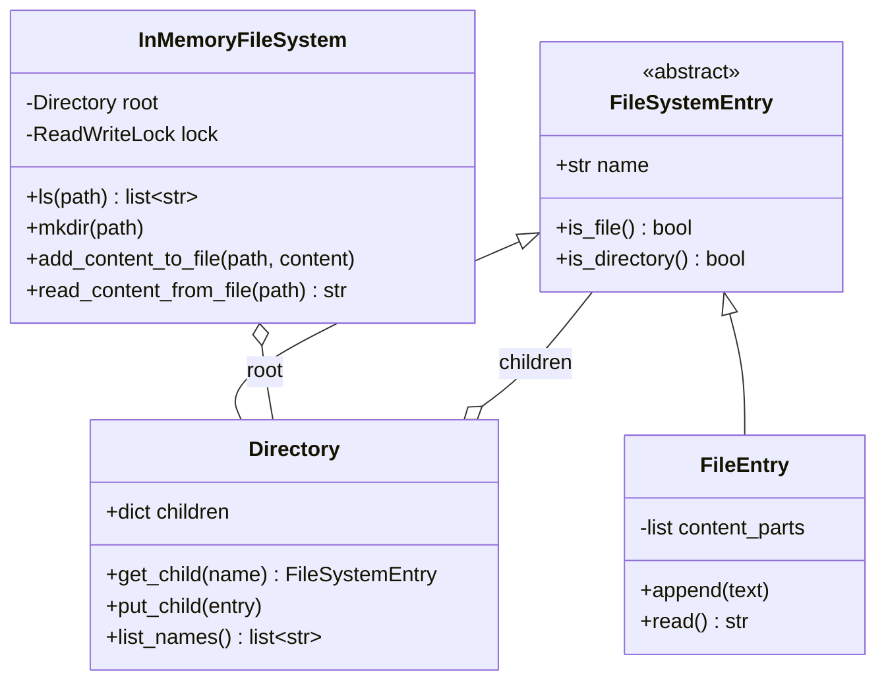
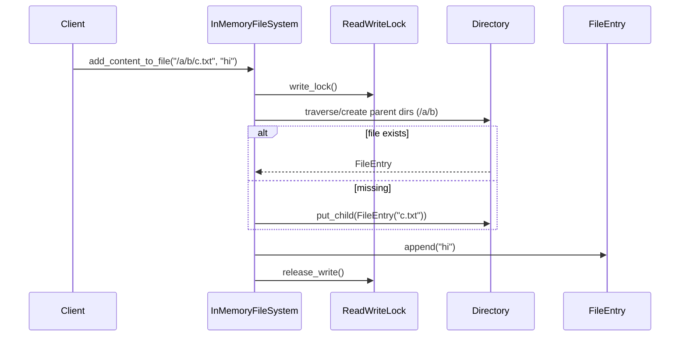

# In-Memory File System — LLD Machine Coding (Python)

An end-to-end MVP of a LeetCode-588-style in-memory file system, built for an SDE2 machine-coding round. It demonstrates OOP modelling, the **Composite** pattern, deterministic tree traversal, and **thread-safe** file-system operations.

> A parallel Java implementation lives in `../java` with its own README. Both produce identical demo output. The class structure is intentionally 1:1 between the two languages.

---

## 1. Why this MVP?

A machine-coding interviewer looks for clean OOP, a design pattern applied for a real reason, correct concurrency, and working tests — in ~45 minutes. The MVP is the **smallest system that still exercises all of those**:

**In scope**
- `ls(path)` → file name for files, sorted child names for directories
- `mkdir(path)` → recursively creates missing directories
- `add_content_to_file(path, content)` → create-or-append
- `read_content_from_file(path)` → returns full file content
- **Composite** model: directories and files share a `FileSystemEntry` abstraction
- Thread-safe tree operations with a reader/writer lock

**Deliberately out of scope** (extension points): persistence/DB, permissions, quotas, symbolic links, streaming large files, REST/UI layer.

---

## 2. UML

### Class diagram


### Add content sequence


---

## 3. Design decisions

| Decision | Reasoning |
| --- | --- |
| **`FileSystemEntry` ABC** | Files and directories are treated uniformly while preserving specialized behavior. |
| **Composite `Directory`** | A directory owns child `FileSystemEntry` objects, exactly matching a file-system tree. |
| **Sorted `dict` keys on listing** | Keeps writes simple while returning deterministic lexicographic `ls` results. |
| **Path parser normalizes `/`** | One traversal path handles root, nested paths, and repeated slashes. |
| **Create parent dirs in file writes** | Matches LeetCode 588 behavior: `addContentToFile` creates missing directories/file. |
| **Reader/writer lock on tree ops** | Multiple `ls/read` calls can run together; `mkdir/add` are exclusive mutations. |
| **Whole-tree lock for MVP** | Simpler and less bug-prone for interviews; can evolve to per-directory locks later. |

### Concurrency model (the key part)
Every public operation acquires either the read lock (`ls`, `read_content_from_file`) or write lock (`mkdir`, `add_content_to_file`). That makes traversal plus mutation atomic from the caller's view, so concurrent writers to different paths cannot corrupt parent-child links or file contents.

---

## 4. Code flow

```
main → InMemoryFileSystem.mkdir
main → InMemoryFileSystem.add_content_to_file
       → _directory_for(path, create=True) → Directory.put_child(FileEntry) → append
main → InMemoryFileSystem.ls
       → _traverse(path) → directory.list_names OR [file.name]
main → InMemoryFileSystem.read_content_from_file
       → _traverse(path) → FileEntry.read
```

Module layout:
```
filesystem/
├── __init__.py      public exports
├── models.py        FileSystemEntry, Directory, FileEntry
├── fs.py            InMemoryFileSystem + ReadWriteLock
└── main.py          runnable demo
tests/
└── test_fs.py
```

---

## 5. How to run

Prerequisites: Python 3.10+.

```powershell
cd python

# install the test runner (only dependency)
python -m pip install pytest

# run the suite (6 tests incl. the concurrent-writers test)
python -m pytest -q

# run the demo
python -m filesystem.main
```

Expected demo output:
```
ls / -> [docs]
ls /docs/projects -> [notes.txt]
read /docs/projects/notes.txt -> Hello, FileSystem!
ls /docs/projects/notes.txt -> [notes.txt]
```

---

## 6. Tests

`tests/test_fs.py` covers:
- `mkdir` + `ls` on nested directories
- create + append + read file contents
- root listing is lexicographic
- `ls` on a file returns just the file name
- nested path creation/read behavior
- **concurrency**: many writers create different files under the same tree without corrupting entries

---

## 7. Extending (what a follow-up would add)
- **`rm`**: remove a file or directory subtree under the write lock.
- **`find`**: DFS/BFS by glob or predicate using the read lock.
- **Permissions**: owner/mode metadata on `FileSystemEntry`.
- **Fine-grained locking**: lock per directory for higher write throughput.
