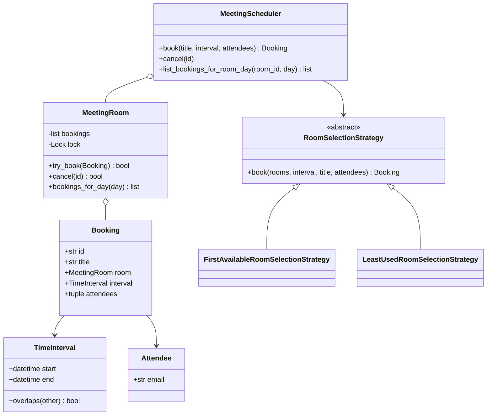
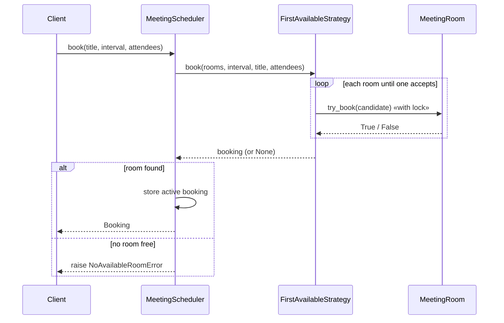

# Meeting Scheduler — LLD Machine Coding (Python)

An end-to-end MVP of a meeting room scheduler/calendar, built for an SDE2 machine-coding round. It
demonstrates OOP modelling, the **Strategy** pattern, a sweep-line calendar utility, and
**thread-safe** concurrent booking with no overlapping meetings in the same room.

> A parallel Java implementation lives in `../java` with its own README. Both produce identical
> demo output. The class structure is intentionally 1:1 between the two languages.

---

## 1. Why this MVP?

A machine-coding interviewer looks for clean OOP, one design pattern applied for a real reason,
correct concurrency, and working tests — in ~45 minutes. The MVP is the **smallest system that still
exercises all of those**:

**In scope**
- Rooms with independent calendars
- `book` → find a free room for a requested [start, end) interval → return `Booking`
- `cancel` → remove the booking and free that interval
- Query bookings for a room/day
- Meeting Rooms II minimum-room-count utility
- Pluggable **RoomSelectionStrategy**
- Thread-safe concurrent booking

**Deliberately out of scope**: recurring meetings, calendar invites, user auth, persistence/DB,
REST/UI layer, time-zone conversion.

---

## 2. UML

### Class diagram


### Book sequence


---

## 3. Design decisions

| Decision | Reasoning |
| --- | --- |
| **Half-open `TimeInterval`** | `[start,end)` matches calendars: a 10:00 end does not conflict with a 10:00 start. |
| **Room owns its bookings** | Calendar invariants live with the resource they protect. |
| **Strategy for room selection (ABCs)** | First-available and least-used policies can swap without touching the service. |
| **Concurrency at the room, not the scheduler** | Per-room `threading.Lock` prevents double-booking while allowing different rooms to proceed in parallel. |
| **Dict + lock for active bookings** | Atomic `pop` ensures cancellation consumes a booking exactly once. |
| **Sweep-line utility** | `minimum_rooms_required` is independent of scheduler state and easy to test. |

### Concurrency model (the key part)
`MeetingRoom.try_book` holds a `threading.Lock`, so the overlap scan and calendar insert are a single
atomic step. The selection strategy simply iterates rooms and calls `try_book`; when 50 threads race
for the same slot across 5 rooms, exactly 5 win and no room id is claimed twice.

---

## 4. Code flow

```
main → MeetingScheduler.book
        → RoomSelectionStrategy.book → MeetingRoom.try_book (atomic overlap check + insert)
        → store Booking in dict (under lock)
MeetingScheduler.cancel → pop booking (under lock) → MeetingRoom.cancel
minimum_rooms_required → sort starts/ends → sweep active count
```

Module layout:
```
scheduler/
├── models.py       Attendee, TimeInterval, MeetingRoom, Booking
├── strategies.py   RoomSelectionStrategy + FirstAvailable + LeastUsed
├── scheduler.py    MeetingScheduler, errors, minimum_rooms_required
└── main.py         runnable demo
tests/
└── test_scheduler.py
```

---

## 5. How to run

Prerequisites: Python 3.10+.

```powershell
cd python

# install the test runner (only dependency)
python -m pip install pytest

# run the suite (5 tests incl. the concurrency race test)
python -m pytest -q

# run the demo
python -m scheduler.main
```

Expected demo output:
```
Rooms at open: 3
Booked Planning in Room-A [2024-01-01T09:00, 2024-01-01T10:00)
Booked Standup  in Room-B [2024-01-01T09:30, 2024-01-01T10:00)
Bookings in Room-A on 2024-01-01: 1
Minimum rooms needed for sample: 2
Cancelled Planning; Room-A bookings now: 0
```

---

## 6. Tests

`tests/test_scheduler.py` covers:
- booking success allocates the first free room
- overlapping interval rejected when no room is free
- cancel frees the room for the same interval
- Meeting Rooms II utility correctness for half-open intervals
- **concurrency**: 50 threads race for 5 rooms → exactly 5 succeed, 0 duplicate room ids

---

## 7. Extending (what a follow-up would add)
- **Recurring meetings**: expand into intervals and reuse the same overlap checks.
- **Invites/notifications**: publish an event after `book`/`cancel`.
- **Capacity-aware selection**: filter rooms by attendee count before applying strategy.
- **Persistence**: replace the in-memory dict/list with repository abstractions.
