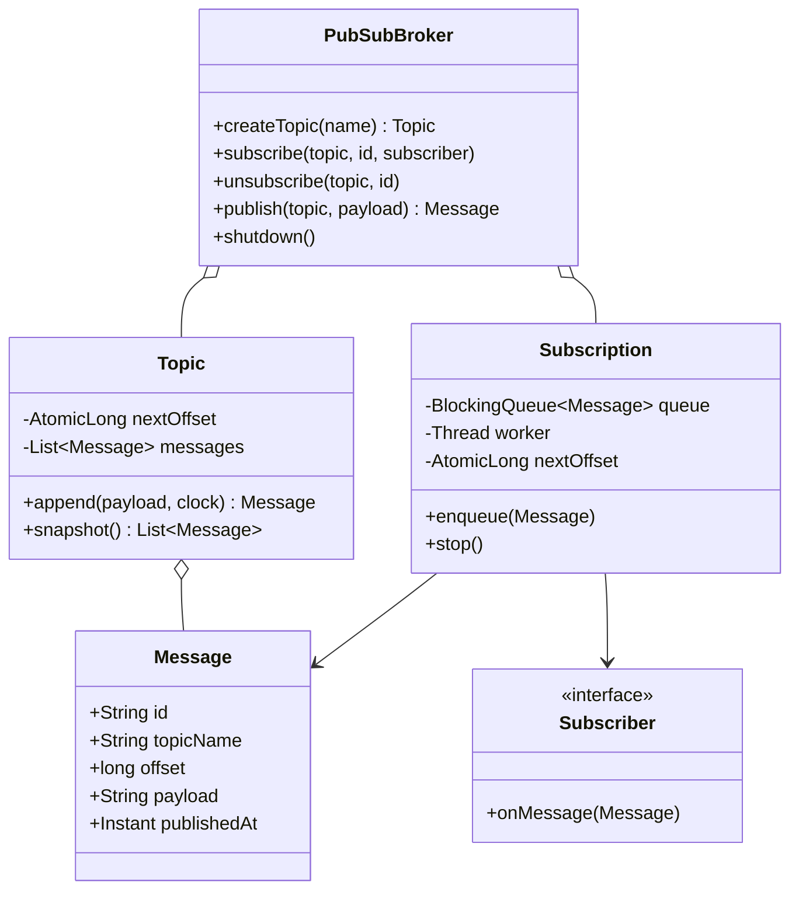
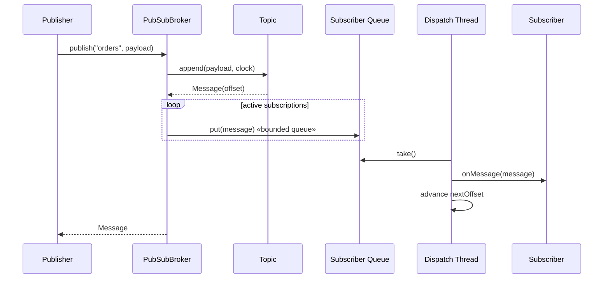

# In-Memory Pub-Sub Message System — LLD Machine Coding (Java)

An end-to-end MVP of an in-memory publish/subscribe message broker, built for an SDE2
machine-coding round. It demonstrates OOP modelling, the **Observer** pattern, and **thread-safe**
asynchronous delivery with per-subscriber offsets.

> A parallel Python implementation lives in `../python` with its own README. Both produce identical
> demo output.

---

## 1. Why this MVP?

A machine-coding interviewer looks for clean OOP, a design pattern applied for a real reason,
correct concurrency, and working tests — delivered in ~45 minutes. So the MVP is the **smallest
system that still exercises all of those**:

**In scope**
- Create topics dynamically
- `subscribe` / `unsubscribe` consumers from a topic
- `publish` immutable messages with monotonically increasing offsets
- Bounded per-subscriber queues and background dispatch threads
- Per-subscriber offset tracking so every active subscriber gets each message once
- Thread-safe concurrent publishers

**Deliberately out of scope** (extension points): durable storage, replay after restart, network
protocols, consumer groups, partitioning, authentication, metrics, and dead-letter queues.

---

## 2. UML

### Class diagram


### Publish sequence


---

## 3. Design decisions

| Decision | Reasoning |
| --- | --- |
| **Immutable `Message`** | Consumers cannot mutate shared broker state; tests can safely compare ids/offsets. |
| **`Topic.append` owns offsets** | A single `AtomicLong` per topic gives monotonic offsets even with concurrent publishers. |
| **Observer pattern via `Subscriber`** | Publishers do not know consumers; adding/removing observers does not change publish logic. |
| **Bounded queue per subscriber** | A slow subscriber creates backpressure only for its own queue instead of sharing one global lock. |
| **Background dispatch thread** | `publish` enqueues work; subscriber callbacks run outside publisher threads. |
| **Per-subscriber `nextOffset`** | The worker advances after a successful callback, giving each active subscriber each message once. |
| **`ConcurrentHashMap` + topic locks** | Topic/subscription maps are safe for concurrent reads/writes without a coarse broker lock. |
| **Injected `Clock`** | Demo/tests can be deterministic without sleeping. |

### Concurrency model (the key part)
`Topic.append` uses an `AtomicLong` to reserve a unique offset and a synchronized history list to
store messages. `PubSubBroker` keeps topics and subscriptions in `ConcurrentHashMap`s. Each
`Subscription` has one bounded `ArrayBlockingQueue` and one worker thread, so messages for a single
subscriber are delivered sequentially while different subscribers can run independently.

---

## 4. Code flow

```
Main → PubSubBroker.createTopic → PubSubBroker.subscribe
PubSubBroker.publish → Topic.append → Subscription.enqueue (bounded queue)
Subscription worker → Subscriber.onMessage → advance nextOffset
PubSubBroker.unsubscribe → remove subscription → stop worker
```

Package layout:
```
com.example.pubsub
├── model/      Message, Topic
├── service/    PubSubBroker, Subscriber, Subscription
└── Main.java   runnable demo
```

---

## 5. How to run

Prerequisites: JDK 17+ and Maven.

```powershell
cd java

# run the test suite (4 tests incl. concurrent publishers)
mvn test

# run the demo
mvn -q compile exec:java "-Dexec.mainClass=com.example.pubsub.Main"
```

Expected demo output:
```
Created topic orders
Subscribed email-service to orders
Subscribed analytics-service to orders
Published orders#0: order-1-created
email-service received orders#0 -> order-1-created
analytics-service received orders#0 -> order-1-created
Published orders#1: order-2-paid
email-service received orders#1 -> order-2-paid
analytics-service received orders#1 -> order-2-paid
Unsubscribed analytics-service
Published orders#2: order-3-shipped
email-service received orders#2 -> order-3-shipped
```

---

## 6. Tests

`PubSubBrokerTest` covers:
- publish → deliver to multiple subscribers
- unsubscribe stops future delivery
- each subscriber receives each message exactly once
- **concurrency**: many publisher threads publish to one topic and all messages reach all subscribers

---

## 7. Extending (what a follow-up would add)
- **Durable log**: replace in-memory topic history with an append-only repository.
- **Replay**: subscribe from a requested offset instead of only new messages.
- **Consumer groups**: one delivery per group instead of per subscriber.
- **Dead-letter queue**: route messages that repeatedly fail subscriber callbacks.
