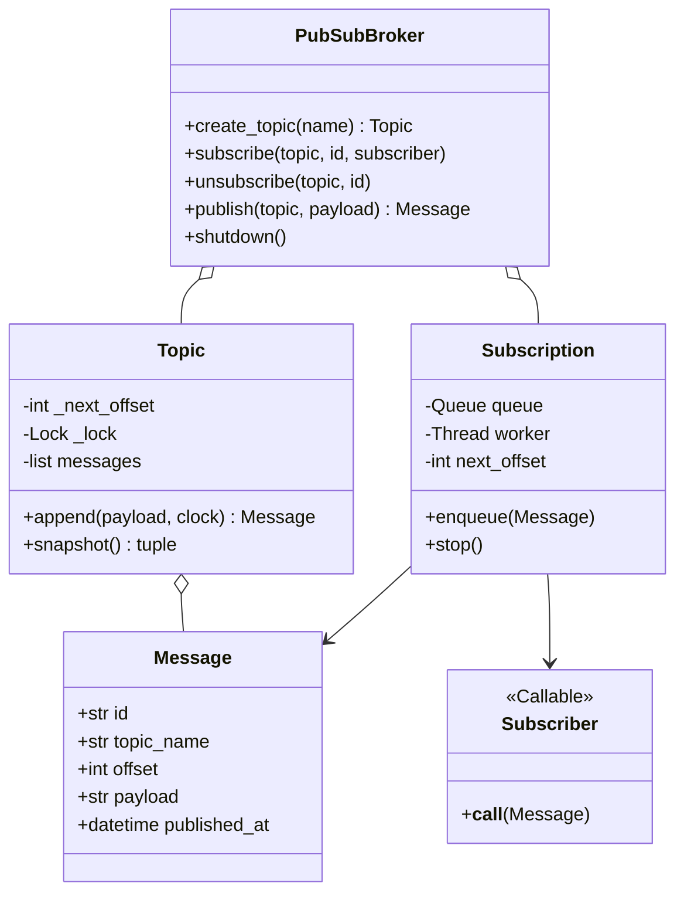
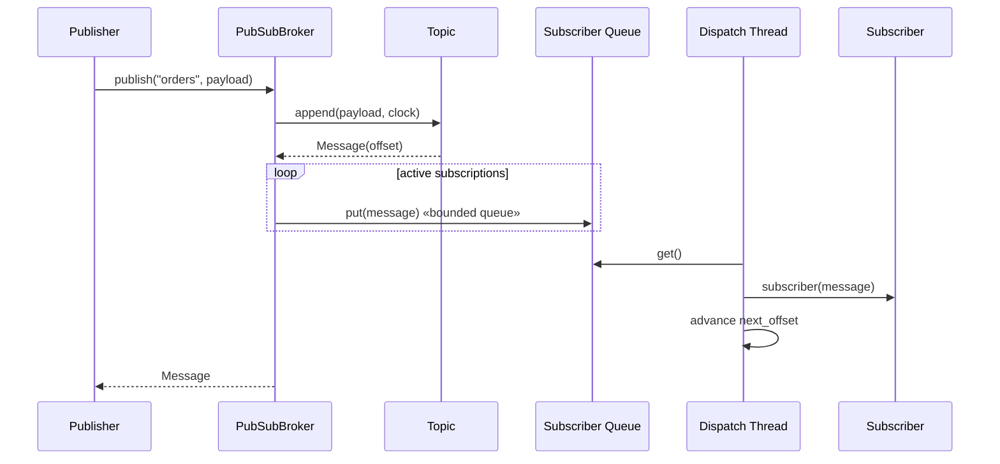

# In-Memory Pub-Sub Message System — LLD Machine Coding (Python)

An end-to-end MVP of an in-memory publish/subscribe message broker, built for an SDE2
machine-coding round. It demonstrates OOP modelling, the **Observer** pattern, and **thread-safe**
asynchronous delivery with per-subscriber offsets.

> A parallel Java implementation lives in `../java` with its own README. Both produce identical
> demo output. The class structure is intentionally 1:1 between the two languages.

---

## 1. Why this MVP?

A machine-coding interviewer looks for clean OOP, a design pattern applied for a real reason,
correct concurrency, and working tests — in ~45 minutes. The MVP is the **smallest system that
still exercises all of those**:

**In scope**
- Create topics dynamically
- `subscribe` / `unsubscribe` consumers from a topic
- `publish` immutable messages with monotonically increasing offsets
- Bounded per-subscriber queues and background dispatch threads
- Per-subscriber offset tracking so every active subscriber gets each message once
- Thread-safe concurrent publishers

**Deliberately out of scope** (extension points): durable storage, replay after restart, network
protocols, consumer groups, partitioning, authentication, metrics, and dead-letter queues.

---

## 2. UML

### Class diagram


### Publish sequence


---

## 3. Design decisions

| Decision | Reasoning |
| --- | --- |
| **Frozen `Message` dataclass** | Consumers cannot mutate shared broker state; tests can safely compare ids/offsets. |
| **`Topic.append` owns offsets** | A short lock gives monotonic offsets even with concurrent publishers. |
| **Observer pattern via callable subscriber** | Publishers do not know consumers; adding/removing observers does not change publish logic. |
| **Bounded queue per subscriber** | A slow subscriber creates backpressure only for its own queue instead of sharing one global lock. |
| **Background dispatch thread** | `publish` enqueues work; subscriber callbacks run outside publisher threads. |
| **Per-subscriber `next_offset`** | The worker advances after a successful callback, giving each active subscriber each message once. |
| **Broker lock only for maps** | Topic/subscription maps are updated safely without holding the lock during callbacks. |
| **Injected clock callable** | Demo/tests can be deterministic without sleeping. |

### Concurrency model (the key part)
`Topic.append` holds a small lock while assigning the next offset and appending to history. The
broker uses a lock only around topic/subscription map mutations. Each `_Subscription` owns one
bounded `queue.Queue` and one daemon worker thread, so one subscriber sees ordered messages while
different subscribers can run independently.

---

## 4. Code flow

```
main → PubSubBroker.create_topic → PubSubBroker.subscribe
PubSubBroker.publish → Topic.append → _Subscription.enqueue (bounded queue)
_Subscription worker → subscriber(message) → advance next_offset
PubSubBroker.unsubscribe → remove subscription → stop worker
```

Module layout:
```
pubsub/
├── models.py       Message and Topic
├── broker.py       PubSubBroker and per-subscriber _Subscription
├── __init__.py     public exports
└── main.py         runnable demo
tests/
└── test_pubsub.py
```

---

## 5. How to run

Prerequisites: Python 3.10+.

```powershell
cd python

# install the test runner (only dependency)
python -m pip install pytest

# run the suite (4 tests incl. concurrent publishers)
python -m pytest -q

# run the demo
python -m pubsub.main
```

Expected demo output:
```
Created topic orders
Subscribed email-service to orders
Subscribed analytics-service to orders
Published orders#0: order-1-created
email-service received orders#0 -> order-1-created
analytics-service received orders#0 -> order-1-created
Published orders#1: order-2-paid
email-service received orders#1 -> order-2-paid
analytics-service received orders#1 -> order-2-paid
Unsubscribed analytics-service
Published orders#2: order-3-shipped
email-service received orders#2 -> order-3-shipped
```

---

## 6. Tests

`tests/test_pubsub.py` covers:
- publish → deliver to multiple subscribers
- unsubscribe stops future delivery
- each subscriber receives each message exactly once
- **concurrency**: many publisher threads publish to one topic and all messages reach all subscribers

---

## 7. Extending (what a follow-up would add)
- **Durable log**: replace in-memory topic history with an append-only repository.
- **Replay**: subscribe from a requested offset instead of only new messages.
- **Consumer groups**: one delivery per group instead of per subscriber.
- **Dead-letter queue**: route messages that repeatedly fail subscriber callbacks.
