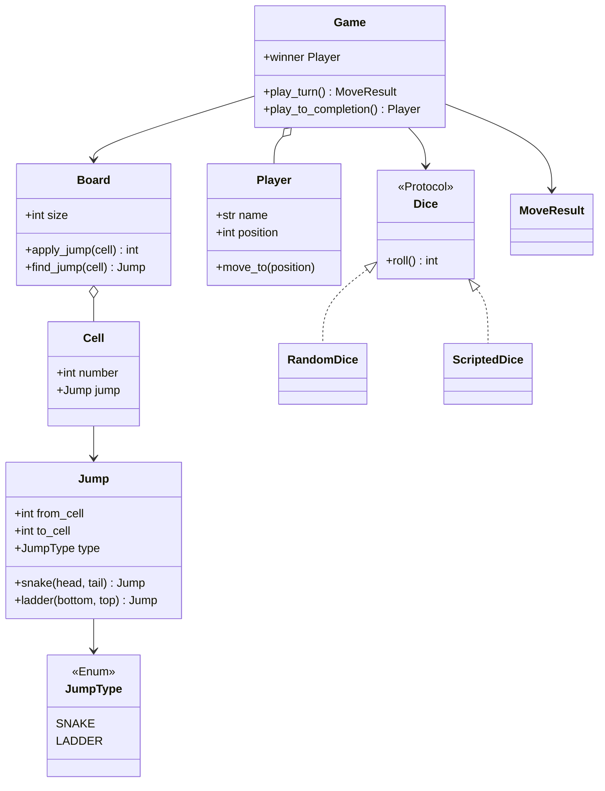
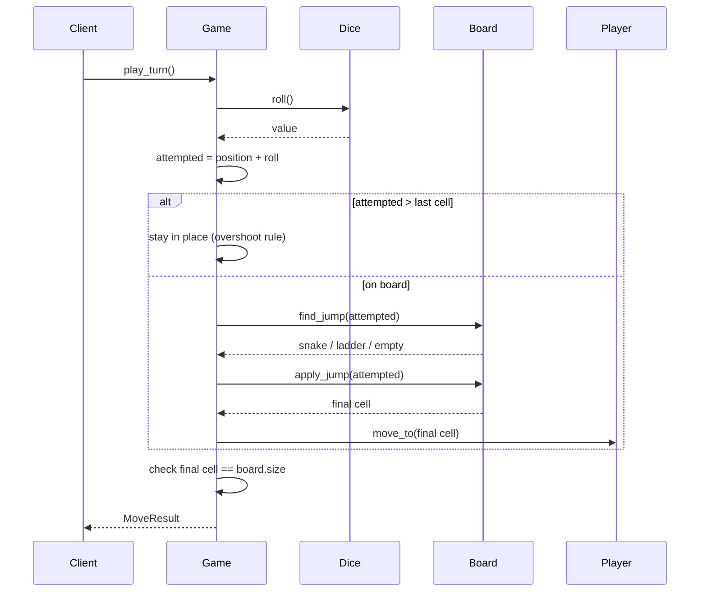

# Snake & Ladder — LLD Machine Coding (Python)

An end-to-end MVP of Snake & Ladder, built for an SDE2 machine-coding round. It demonstrates clean
OOP modelling, a Strategy-style **Dice** abstraction, deterministic tests, and a focused turn-based
game loop.

> A parallel Java implementation lives in `../java` with its own README. Both produce identical
> demo output. The class structure is intentionally 1:1 between the two languages.

---

## 1. Why this MVP?

A machine-coding interviewer looks for clean entities, simple APIs, validation, deterministic tests,
and well-explained trade-offs. The MVP is the **smallest playable system that still exercises all of
those**:

**In scope**
- Configurable board (default 100 cells)
- Snakes (`head -> tail`, downward) and ladders (`bottom -> top`, upward)
- Validation that no two jumps start on the same cell
- Multiple players in fixed turn order
- `play_turn()` → roll → move → apply jump → exact last-cell win detection
- Overshoot rule: if a roll exceeds the last cell, the player stays in place
- Pluggable **Dice** strategy: random for production, scripted/seeded for deterministic tests

**Deliberately out of scope** (extension points): variable dice rules, multiple dice, configurable
exact-roll-to-win toggle, GUI/network play, persistence/DB.

Thread-safety is not required here: a single game is turn-based and driven by one caller. Adding
locking would make the teaching surface noisier without improving this MVP.

---

## 2. UML

### Class diagram


### Turn sequence


---

## 3. Design decisions

| Decision | Reasoning |
| --- | --- |
| **`Board` owns validation** | Invalid snakes/ladders fail fast before a game starts, keeping `play_turn()` readable. |
| **`Cell` + `Jump` split** | A cell is a square; a jump is a directed edge. This mirrors the real board and teaches composition. |
| **`Jump.snake` / `Jump.ladder` factories** | Direction rules live beside construction, so callers cannot accidentally create an inverted snake/ladder. |
| **`Dice` protocol** | Strategy pattern: random dice in real runs, `ScriptedDice` in tests/demos, seeded random if needed. |
| **Players start at cell 1** | Simple MVP convention; every roll moves from a real board cell. |
| **Exact-roll overshoot rule** | Common rule variant and easy to reason about: too-large rolls leave the token in place. |
| **No locking** | One game is turn-based and single-driver; thread-safety is unnecessary scope for this problem. |

---

## 4. Code flow

```
main → Board(snakes/ladders) → Game(board, dice, players)
Game.play_turn → Dice.roll → compute attempted cell
               → Board.find_jump/apply_jump → Player.move_to
               → check winner → MoveResult
Game.play_to_completion → repeat play_turn until winner exists
```

Module layout:
```
snakeladder/
├── models.py       Board, Cell, Jump, JumpType, Player
├── game.py         Dice protocol, RandomDice, ScriptedDice, Game, MoveResult
├── exceptions.py   InvalidBoardError, GameAlreadyOverError
└── main.py         runnable deterministic demo
tests/
└── test_snakeladder.py
```

---

## 5. How to run

Prerequisites: Python 3.10+.

```powershell
cd python

# install the test runner (only dependency)
python -m pip install pytest

# run the suite (5 deterministic tests)
python -m pytest -q

# run the demo
python -m snakeladder.main
```

Expected demo output:
```
Turn 1: Alice rolled 3 and moved 1 -> 4, ladder to 8
Turn 2: Bob rolled 4 and moved 1 -> 5
Turn 3: Alice rolled 2 and moved 8 -> 10 and won
Winner: Alice
```

---

## 6. Tests

`tests/test_snakeladder.py` covers:
- ladder moves a player up when the scripted roll lands exactly on the ladder bottom
- snake moves a player down when the scripted roll lands exactly on the snake head
- full deterministic two-player game produces Alice as the winner
- overshoot rule: a too-large roll leaves the player in place
- invalid board: two jumps starting from the same cell are rejected

---

## 7. Extending (what a follow-up would add)
- **Variable dice rules**: swap or decorate `Dice` without editing `Game`.
- **Multiple dice**: introduce a dice-set strategy returning the total and roll details.
- **Rule toggles**: inject a win-rule function for exact-roll vs clamp-to-last-cell variants.
- **GUI/REST**: keep `Game` as the domain service and add controllers/adapters around it.
