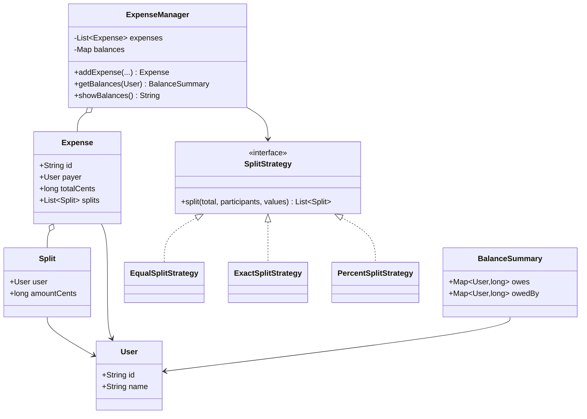
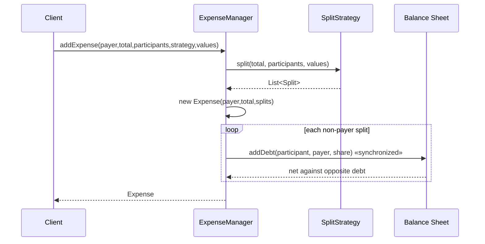

# Splitwise — LLD Machine Coding (Java)

An end-to-end MVP of Splitwise, built for an SDE2 machine-coding round. It demonstrates OOP
modelling, the **Strategy** pattern, exact money arithmetic, and **thread-safe** concurrent expense
recording.

> A parallel Python implementation lives in `../python` with its own README. Both produce identical
> demo output.

---

## 1. Why this MVP?

A machine-coding interviewer looks for clean object modelling, one central pattern applied for a real
reason, correctness under edge cases, and working tests. This MVP is the **smallest system that still
exercises all of those**:

**In scope**
- Users, expenses, computed splits, and a net balance sheet
- `addExpense` → run a `SplitStrategy` → net debtor/creditor balances
- EQUAL, EXACT, and PERCENT split algorithms
- `getBalances(user)` plus `showBalances()` overview
- Thread-safe concurrent `addExpense`

**Deliberately out of scope** (extension points): groups UI, debt simplification/minimization,
multi-currency, persistence, settlements history. Debt simplification is useful but not needed for
this MVP because the balance sheet already nets every pair.

**Money choice:** all amounts are `long` cents. We never use `double` for business arithmetic, so
rounding bugs cannot corrupt balances.

---

## 2. UML

### Class diagram


### addExpense sequence


---

## 3. Design decisions

| Decision | Reasoning |
| --- | --- |
| **Strategy for splitting** | Split algorithms change independently from balance-sheet mutation. |
| **Immutable models** | `Expense` and `Split` are safe snapshots after validation. |
| **Integer cents (`long`)** | Exact money math; no floating-point rounding drift. |
| **Normalized directed balances** | Store only one net direction for each pair: `debtor -> creditor`. |
| **Pairwise netting on write** | `A owes B` then `B owes A` collapses immediately, making reads simple. |
| **`synchronized addExpense`** | One mutation touches expenses and balances; locking prevents lost updates. |

---

## 4. Code flow

```
Main → ExpenseManager.addExpense
        → SplitStrategy.split (Equal / Exact / Percent)
        → new Expense
        → for each non-payer Split: addDebt(debtor, payer, cents)
        → getBalances / showBalances read normalized balances
```

Package layout:
```
com.example.splitwise
├── model/      User, Split, Expense, BalanceSummary
├── strategy/   SplitStrategy + Equal/Exact/Percent implementations
├── service/    ExpenseManager
├── exception/  InvalidSplitException
└── Main.java   runnable demo
```

---

## 5. How to run

Prerequisites: JDK 17+ and Maven.

```powershell
cd java

# run the test suite (5 tests incl. concurrent addExpense)
mvn test

# run the demo
mvn -q compile exec:java "-Dexec.mainClass=com.example.splitwise.Main"
```

Expected demo output:
```
Recorded expenses: 3
Balances:
Bob owes Alice $50.00
Charlie owes Alice $75.00
```

---

## 6. Tests

`SplitwiseTest` covers:
- EQUAL split: A pays 300 for A/B/C → B and C each owe A 100
- EXACT split validation: bad sum rejected; valid exact shares update balances
- PERCENT split validation: bad percent sum rejected; valid percentages update balances
- pairwise netting across multiple expenses
- **concurrency**: 80 threads add equal expenses → final balance equals sequential result

---

## 7. Extending (what a follow-up would add)
- **Debt simplification/minimization**: reduce many pairwise debts into fewer settlement edges.
- **Groups**: reusable participant sets and group-level views.
- **Multi-currency**: currency per expense plus FX-rate strategy.
- **Settlements history**: record payments separately from expense creation.
- **Persistence/API**: repository abstraction and REST/UI layer.
