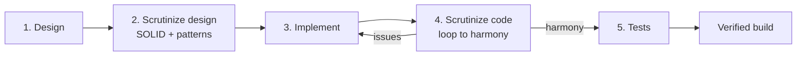

# Design & Orchestrator Pipeline Notes

This app was generated by walking it through the **coding-orchestrator** master–worker pipeline.
Because no LLM API keys were configured in the environment, the orchestrator's worker roles were
executed deterministically (the same stages it automates), producing the artifacts below.

## Pipeline stages applied



### 1. Design
A classic **layered architecture** was chosen for teaching clarity:

```
HTTP ─► Controller ─► Service (interface) ─► Repository ─► H2
                          ▲
                       DTOs / Mapper isolate the API from the entity
```

### 2. Design scrutiny (SOLID + design patterns)

| Principle / Pattern            | How the design honors it                                            |
| ------------------------------ | ------------------------------------------------------------------- |
| **S**ingle Responsibility      | Controller = HTTP, Service = logic, Repository = persistence, Mapper = conversion |
| **O**pen/Closed                | New behavior via new beans/implementations, not editing existing classes |
| **L**iskov Substitution        | Any `ProductService` implementation is interchangeable              |
| **I**nterface Segregation      | Small, focused `ProductService` contract                            |
| **D**ependency Inversion       | Controller depends on the `ProductService` **interface**, not the impl |
| Repository pattern             | `ProductRepository` abstracts data access                           |
| DTO pattern                    | `ProductRequest`/`ProductResponse` decouple API from the entity     |
| Mapper pattern                 | `ProductMapper` centralizes entity↔DTO translation                  |
| Front controller / Advice      | `GlobalExceptionHandler` centralizes error handling                 |

### 3. Implementation
Constructor injection everywhere; DTOs + Bean Validation at the edges; `@Transactional` service
methods; consistent `ApiError` responses.

### 4. Code scrutiny → harmony
Review points raised and resolved:
- Entity has no `setId` (JPA-managed) → tests set it via `ReflectionTestUtils` instead of exposing
  a setter that would leak persistence concerns.
- `update` relies on Hibernate dirty-checking within the transaction; `save` kept for clarity.
- Search endpoint guards against `null`/blank fragments.

### 5. Tests
Four complementary layers — full-context smoke test, JPA slice, pure Mockito unit test, and web
slice — all green (**8/8**) on JDK 25 with Spring Boot 3.5.16.

## Verified outcome
`mvn test` → **BUILD SUCCESS**, `Tests run: 8, Failures: 0, Errors: 0`.
