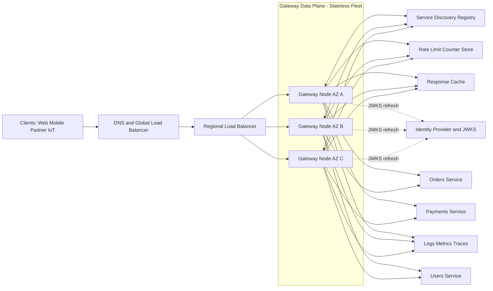
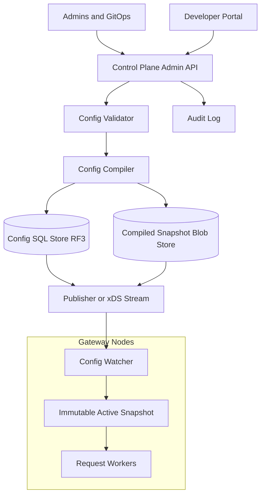
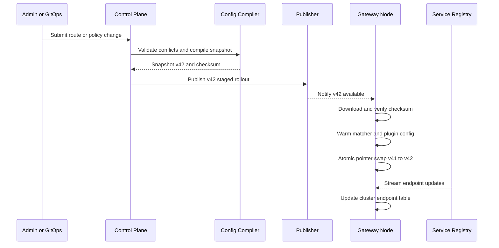
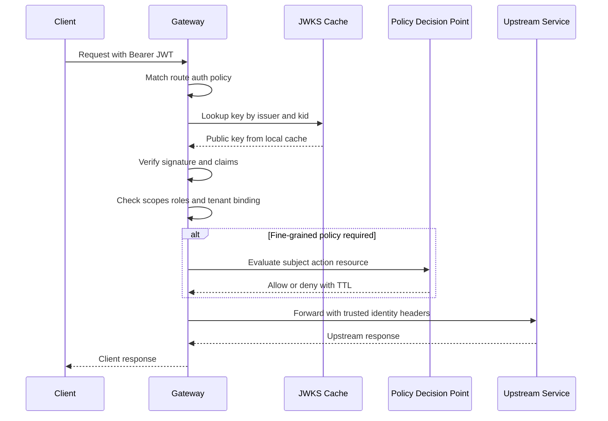
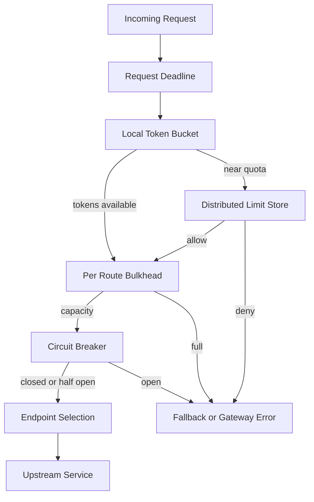
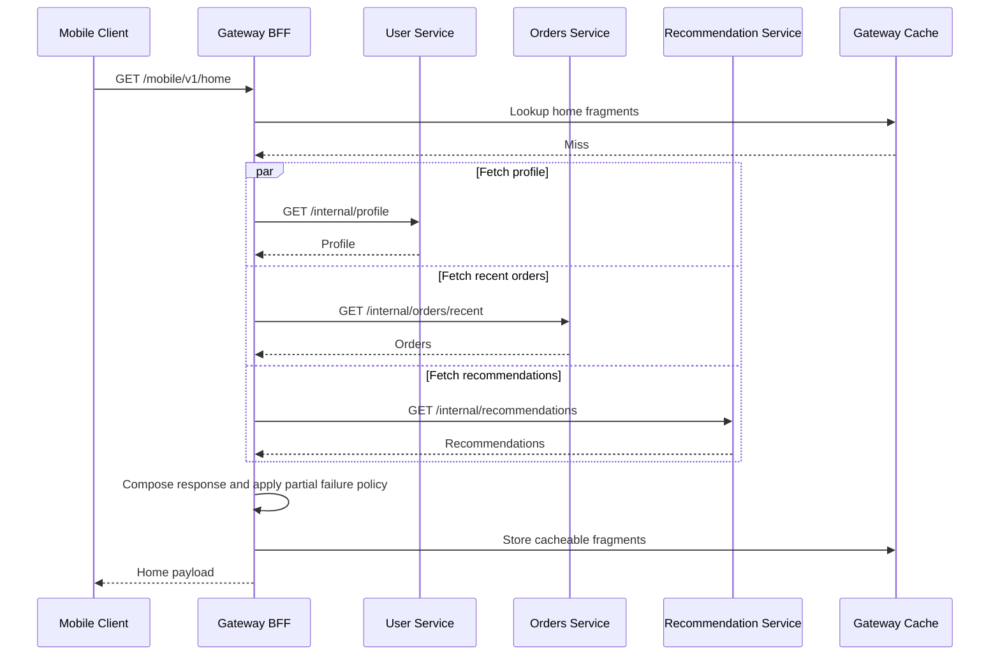

# API Gateway — High-Level Design
> SDE2 interview-style HLD for an API Gateway that fronts a large microservices platform.
## 1. Problem Statement & Scope
Design an API Gateway that provides a single, secure, observable, and scalable entry point for clients calling many backend microservices.
The gateway terminates public traffic, authenticates and authorizes callers, applies rate limits and quotas, routes requests to upstream services, performs protocol and payload transformations, and optionally aggregates multiple upstream calls into client-friendly responses.
The design must handle very high throughput, low added latency, safe configuration rollout, and graceful degradation when dependencies such as the identity provider, rate-limit store, service registry, or observability pipeline are unhealthy.
### In scope
- Single entry point for web, mobile, partner, IoT, and internal clients.
- Request routing by host, path, HTTP method, header, query parameter, tenant, and version.
- Authentication with JWT/OAuth2 bearer tokens and API keys.
- Authorization using scopes, roles, tenant binding, and external policy hooks where required.
- Rate limiting and quota enforcement by route, user, client, tenant, and API plan.
- TLS termination at the edge.
- mTLS from gateway to upstream services.
- Load balancing across healthy upstream instances.
- Response caching for safe, explicitly cacheable APIs.
- Request and response transformations for backward compatibility.
- Protocol translation for HTTP, gRPC, gRPC-web, and WebSocket upgrades.
- Request aggregation and optional BFF or GraphQL-style composition.
- CORS handling and preflight responses.
- Canary, traffic splitting, route shadowing, and blue-green backend deployment support.
- Observability through logs, metrics, traces, and audit events.
- Control plane for route, plugin, certificate, and policy management.
### Out of scope
- Implementing business logic that belongs inside product microservices.
- Implementing the identity provider itself.
- Implementing a full service mesh for all east-west traffic.
- Long-term log analytics and dashboarding beyond exporting telemetry.
- Owning backend databases or source-of-truth domain data.
- Running arbitrary unbounded custom code in the gateway hot path.
### Key assumptions
- Peak load is 1M requests per second.
- Peak is about 2.5× average because public APIs have bursty traffic.
- Gateway nodes are deployed across three availability zones per active region.
- Data-plane nodes are stateless and can be added or removed quickly.
- Service instances are discovered through Kubernetes Endpoints, Consul, or an xDS-style registry.
- Route and policy configuration is managed by a separate control plane.
- The data plane keeps serving with the last known good configuration if the control plane is unavailable.
- 1 day is rounded to 10^5 seconds for interview math.
## 2. Functional Requirements
### P0 requirements
- Accept client traffic on public API domains.
- Terminate TLS and enforce modern cipher policies.
- Normalize headers and generate or propagate request IDs.
- Match incoming requests to configured routes deterministically.
- Route requests to the correct upstream service cluster.
- Validate JWT signatures using cached JWKS keys.
- Validate token issuer, audience, expiry, not-before time, and scopes.
- Support OAuth2 opaque-token introspection for selected clients.
- Support API key authentication for partner and server-to-server clients.
- Enforce authorization at route level.
- Remove spoofable identity headers from external requests.
- Add trusted internal identity headers only after successful authentication.
- Apply rate limits and quotas.
- Load balance among healthy upstream endpoints.
- Enforce request deadlines and upstream timeouts.
- Return consistent gateway error responses.
- Emit access logs for completed requests.
- Emit metrics for RPS, latency, status codes, auth failures, rate-limit decisions, and upstream health.
- Propagate distributed tracing context.
### P1 requirements
- Support request header, query, and body transformations.
- Support response header and body transformations.
- Support REST-to-gRPC and gRPC-web-to-gRPC translation.
- Support WebSocket upgrade and long-lived connection policies.
- Support CORS preflight handling.
- Support API versioning by path, header, or host.
- Support response caching for safe methods with explicit TTL.
- Support request aggregation for mobile and web BFF endpoints.
- Support route-level retries with retry budgets.
- Support circuit breakers and outlier detection.
- Support bulkheads per route or upstream cluster.
- Support canary routing by percentage, header, tenant, or cohort.
- Support blue-green backend traffic switching.
- Support route shadowing for validating new services.
- Support hot reload of configuration without dropping active connections.
- Validate route conflicts before publishing configuration.
- Audit all control-plane mutations.
### Non-goals
- The gateway should not store durable per-request business state.
- The gateway should not synchronously call the control plane on every request.
- The gateway should not hide all backend failures; clients still need correct error semantics.
- The gateway should not become a dumping ground for product-specific domain workflows.
## 3. Non-Functional Requirements
| Requirement | Target | Reasoning |
|---|---:|---|
| Peak throughput | 1,000,000 RPS | Public multi-tenant platform target |
| Average throughput | 400,000 RPS | 1,000,000 / 2.5 peak multiplier |
| Gateway added latency | p50 < 1 ms, p99 < 5 ms | Gateway must not dominate service latency |
| Availability | 99.99% monthly | Single entry point is critical |
| Config propagation | p50 < 2 s, p99 < 30 s | Fast operational changes |
| Config correctness | Atomic immutable snapshots per node | Avoid partial config reads |
| Auth decision latency | p99 < 1 ms for JWT | Local key validation on hot path |
| Rate-limit latency | p99 < 2 ms local, < 10 ms distributed | Limiter must not dominate p99 |
| TLS security | TLS 1.2+, prefer TLS 1.3 | Internet-facing security baseline |
| Upstream security | mTLS with workload identity | Prevent identity-header spoofing |
| Telemetry freshness | Metrics < 10 s, logs < 60 s | Operational visibility |
| Data durability | Config RF=3, logs in external pipeline | Durable audit and rollback |
| Scalability | Horizontal stateless data plane | Add nodes for RPS and connections |
### Latency budget
| Step | p50 | p99 | Notes |
|---|---:|---:|---|
| TLS/session handling | 0.10 ms | 0.50 ms | Assumes connection reuse |
| Header normalization | 0.05 ms | 0.20 ms | Bounded parsing |
| Route lookup | 0.02 ms | 0.20 ms | Radix tree or compiled matcher |
| JWT validation | 0.10 ms | 1.00 ms | Local JWKS cache |
| API key lookup | 0.10 ms | 1.00 ms | Local or regional cache |
| Rate-limit decision | 0.20 ms | 2.00 ms | Local fast path |
| Plugin overhead | 0.20 ms | 1.00 ms | Bounded chain |
| Load-balancer choice | 0.02 ms | 0.10 ms | In-memory endpoint table |
| Total gateway overhead | ~0.79 ms | < 5.00 ms | Excludes upstream time |
### Availability target intuition
- 99.99% monthly availability allows about 4.32 minutes of downtime per month.
- One gateway node failure must not be visible to clients.
- One AZ failure should be survivable without dropping below peak capacity.
- A control-plane outage should block new configuration changes, not runtime traffic.
- A telemetry outage should degrade observability, not the request path.
## 4. Back-of-the-Envelope Estimation
### Traffic assumptions
| Item | Value | Arithmetic |
|---|---:|---|
| Peak RPS | 1,000,000 | Given |
| Peak multiplier | 2.5× | Public API bursts |
| Average RPS | 400,000 | 1,000,000 / 2.5 |
| Daily requests | 40,000,000,000 | 400,000 × 10^5 |
| HTTP traffic | 900,000 RPS peak | 1,000,000 × 90% |
| gRPC traffic | 80,000 RPS peak | 1,000,000 × 8% |
| WebSocket message equivalent | 20,000 msg/s peak | 1,000,000 × 2% |
| Authenticated traffic | 950,000 RPS peak | 1,000,000 × 95% |
| Cacheable reads | 200,000 RPS peak | 1,000,000 × 20% |
| Aggregation traffic | 50,000 RPS peak | 1,000,000 × 5% |
### Gateway node count
Assume one optimized gateway node safely handles 25,000 simple requests per second while leaving CPU headroom for TLS, auth, rate limiting, transformations, and telemetry.
| Calculation | Value |
|---|---:|
| Required peak throughput | 1,000,000 RPS |
| Safe throughput per node | 25,000 RPS |
| Base nodes | 1,000,000 / 25,000 = 40 |
| Headroom for deploys and uneven load | 50% |
| Nodes with headroom | 40 × 1.5 = 60 |
| Nodes per AZ across 3 AZs | 60 / 3 = 20 |
If one AZ is lost, 40 nodes remain. Capacity is 40 × 25,000 = 1,000,000 RPS, so the region can still serve peak traffic while autoscaling adds replacement capacity.
### Connection count
| Item | Value | Arithmetic |
|---|---:|---|
| Peak RPS | 1,000,000 | Given |
| Requests per HTTP keep-alive connection | 20 RPS | Assumption |
| Active HTTP connections | 50,000 | 1,000,000 / 20 |
| Long-lived WebSocket connections | 2,000,000 | Product assumption |
| WebSocket connections per node | ~33,334 | 2,000,000 / 60 |
| HTTP connections per node | ~834 | 50,000 / 60 |
| Total client connections per node | ~34,200 | 33,334 + 834 |
WebSocket scale is driven by file descriptors, memory, heartbeat handling, and connection draining. A dedicated streaming pool may be useful at high connection counts.
### Upstream fan-out
| Item | Value | Arithmetic |
|---|---:|---|
| Non-aggregated traffic | 950,000 RPS | 1,000,000 × 95% |
| Aggregated traffic | 50,000 RPS | 1,000,000 × 5% |
| Average aggregation fan-out | 4 calls | Mobile home or product page |
| Aggregated upstream calls | 200,000 RPS | 50,000 × 4 |
| Total upstream calls | 1,150,000 RPS | 950,000 + 200,000 |
| Amplification | 15% | 1,150,000 / 1,000,000 - 1 |
Even a small amount of aggregation increases upstream load. Aggregation endpoints need strict fan-out caps, deadlines, bulkheads, and partial response policies.
### Bandwidth
Assume average request size is 2 KB and average response size is 10 KB.
| Direction | Arithmetic | Peak bandwidth |
|---|---:|---:|
| Client inbound | 1,000,000 × 2 KB | 2 GB/s ≈ 16 Gbps |
| Client outbound | 1,000,000 × 10 KB | 10 GB/s ≈ 80 Gbps |
| Gateway-to-upstream outbound | 1,150,000 × 2 KB | 2.3 GB/s ≈ 18.4 Gbps |
| Upstream-to-gateway inbound | 1,150,000 × 8 KB | 9.2 GB/s ≈ 73.6 Gbps |
| Edge total with 30% overhead | (16 + 80) × 1.3 | ~125 Gbps |
| Per-node edge bandwidth | 125 / 60 | ~2.1 Gbps |
The bandwidth is feasible when distributed across 60 nodes, but large response transformations should be streaming to avoid excessive memory copies.
### Route table memory
Assume 100,000 configured routes across tenants, APIs, versions, canaries, and environments.
| Component | Per route | Count | Memory |
|---|---:|---:|---:|
| Route match metadata | 1 KB | 100,000 | 100 MB |
| Plugin chain config | 2 KB | 100,000 | 200 MB |
| Upstream references | 0.5 KB | 100,000 | 50 MB |
| Compiled trie overhead | 1 KB | 100,000 | 100 MB |
| Canary/version metadata | 0.5 KB | 100,000 | 50 MB |
| Active snapshot total | ~5 KB | 100,000 | ~500 MB |
| Active + previous snapshot | 2× | - | ~1 GB |
Each node should reserve about 1 GB for active and previous route snapshots so it can atomically swap configuration and roll back quickly.
### Auth cache memory
| Cache | Entry size | Entries per node | Memory | TTL |
|---|---:|---:|---:|---:|
| JWKS keys | 5 KB | 1,000 issuers | 5 MB | 5 min |
| API key metadata | 1 KB | 16,667 hot keys | ~17 MB | 5 min |
| Token introspection | 1 KB | 250,000 tokens | 250 MB | min(token exp, 5 min) |
| Authorization decisions | 0.5 KB | 500,000 decisions | 250 MB | 30-120 s |
| Negative auth cache | 0.2 KB | 100,000 entries | 20 MB | 10-30 s |
| Total | - | - | ~542 MB | - |
JWT validation is preferred because it avoids an IdP call on every request. Opaque token introspection must be cached and limited.
### Rate limiter capacity
| Item | Value | Arithmetic |
|---|---:|---|
| Requests needing a decision | 1,000,000/s | Every request |
| Local fast-path decisions | 900,000/s | 1,000,000 × 90% |
| Distributed decisions | 100,000/s | 1,000,000 × 10% |
| Safe Redis primary shard throughput | 50,000 ops/s | Conservative Lua/counter assumption |
| Base primary shards | 2 | 100,000 / 50,000 |
| With 3× headroom | 6 primaries | 2 × 3 |
| With one replica each | 12 Redis nodes | 6 × 2 |
Strict global limits are expensive. The design uses local token preallocation for most requests and falls back to distributed checks near quota or for strict plans.
### Telemetry volume
| Telemetry | Arithmetic | Volume |
|---|---:|---:|
| Access logs | 1,000,000 × 500 B | 500 MB/s |
| Raw access logs per day | 500 MB/s × 10^5 | 50 TB/day |
| Traces at 1% sample | 1,000,000 × 1% | 10,000 traces/s |
| Metrics | 60 nodes × 10,000 series / 10 s | Manageable |
| Audit events | 0.1% of requests | 1,000 events/s |
Full-fidelity access logging is costly. The gateway should support sampling, field redaction, route-specific logging, and emergency log shedding.
### Config storage
| Item | Value | Arithmetic |
|---|---:|---|
| Compiled snapshot | 500 MB | Route table estimate |
| Snapshots retained | 100 | Rollback and audit |
| Raw snapshot storage | 50 GB | 500 MB × 100 |
| Replication factor | 3 | README convention |
| Durable storage | 150 GB | 50 GB × 3 |
Storage size is not the hard part. The hard parts are validation, rollout safety, auditability, and deterministic runtime behavior.
## 5. API Design
The gateway exposes product APIs to clients and a separate administrative API to platform teams.
### Runtime API example
```http
GET /v1/orders/ord_123 HTTP/1.1
Host: api.example.com
Authorization: Bearer <jwt>
X-Request-Id: 01JABCDEF123
X-Tenant-Id: tenant_123
Accept: application/json
```
The gateway preserves the public product contract. It should not force clients to know internal service names.
### Common runtime headers
| Header | Direction | Meaning |
|---|---|---|
| `X-Request-Id` | Client to gateway or gateway generated | Request correlation |
| `Traceparent` | Both | W3C distributed trace context |
| `X-RateLimit-Limit` | Gateway to client | Effective limit |
| `X-RateLimit-Remaining` | Gateway to client | Remaining tokens when safe to reveal |
| `X-RateLimit-Reset` | Gateway to client | Reset or refill hint |
| `Retry-After` | Gateway to client | Backoff for 429 or 503 |
| `Via` | Gateway to client | Diagnostic gateway marker |
| `X-Forwarded-For` | Gateway to upstream | Sanitized client IP chain |
| `X-Authenticated-Subject` | Gateway to upstream | Trusted subject after auth |
### Standard error response
```json
{
  "error": {
    "code": "RATE_LIMITED",
    "message": "Too many requests for this API plan.",
    "requestId": "01JABCDEF123",
    "retryAfterSeconds": 2,
    "details": {
      "limit": 1000,
      "windowSeconds": 60
    }
  }
}
```
### Admin API examples
```http
POST /admin/v1/routes
Content-Type: application/json
Idempotency-Key: create-orders-route-v1
```
```json
{
  "name": "orders-v1",
  "match": { "hosts": ["api.example.com"], "pathPrefix": "/v1/orders", "methods": ["GET", "POST"] },
  "upstream": { "cluster": "orders-service", "protocol": "HTTP2", "timeoutMs": 300 },
  "plugins": ["jwt-auth", "rate-limit", "cors"],
  "trafficPolicy": { "stableWeight": 95, "canaryCluster": "orders-service-v2", "canaryWeight": 5 }
}
```
```http
POST /admin/v1/config-versions/{versionId}/publish
POST /admin/v1/api-keys
```
- Publish requests include target regions, one-AZ-then-region rollout strategy, bake time, and auto-rollback thresholds.
- API key creation requests include tenant ID, client ID, scopes, plan, and expiry.
- All mutating admin APIs are idempotent and audited.
### Admin API semantics
| Concern | Design |
|---|---|
| Idempotency | Mutating APIs accept `Idempotency-Key` |
| Pagination | `limit` plus opaque `pageToken` |
| Versioning | Admin APIs use `/admin/v1`; product APIs keep their own versions |
| Authorization | Admin APIs require strong operator identity and RBAC |
| Validation | Config is compiled and checked before publish |
| Audit | Every mutation creates immutable audit events |
| Rollback | Publish previous compiled snapshot |
### WebSocket and gRPC behavior
- WebSocket upgrade is allowed only on routes configured for streaming.
- Long-lived connections use connection quotas separately from request RPS limits.
- gRPC deadlines are propagated to upstream services.
- gRPC errors are mapped to consistent external error responses when translated to HTTP.
- gRPC-web can be translated for browsers.
- Streaming routes opt into specialized timeout, drain, and observability policies.
## 6. Data Model & Schema
The data plane stores hot configuration and caches in memory. Durable state belongs to control-plane stores, counter stores, and observability systems.
### Storage choices
| Data | Store | Why |
|---|---|---|
| Route and policy source of truth | SQL database with RF=3 | Transactions, constraints, audit |
| Compiled config snapshots | Object/blob store | Immutable distribution and rollback |
| Service discovery state | Kubernetes, Consul, or xDS registry | Live endpoint source |
| Rate-limit counters | Redis Cluster or counter service | Atomic low-latency operations |
| API key metadata | SQL source plus encrypted KV/cache | Durable and fast lookup |
| JWKS and auth decisions | In-memory per node | Avoid hot-path IdP calls |
| Response cache | CDN, regional Redis, local cache | Match privacy and TTL needs |
| Access logs | Kafka/PubSub/Event Hubs | High-throughput append |
| Metrics | Time-series DB | Aggregation and alerting |
| Traces | Tracing backend | Distributed request reconstruction |
### Logical schema summary
| Entity | Primary key | Important fields | Indexes / notes |
|---|---|---|---|
| `routes` | `route_id` | tenant, host pattern, path prefix, methods, headers, version strategy, upstream cluster, priority, enabled | Unique host/path/priority; indexed by tenant and host/path |
| `upstream_clusters` | `cluster_id` | discovery type/ref, protocol, LB policy, timeouts, mTLS policy, health policy | Name unique; watched by active routes |
| `plugin_bindings` | `binding_id` | route ID, plugin name, phase, order, config JSON, enabled | Unique route/phase/order |
| `auth_policies` | `policy_id` | issuer, audience, JWKS URI, required scopes, API-key flag, PDP ref, cache TTL | Referenced by auth plugins |
| `rate_limit_policies` | `policy_id` | scope, algorithm, RPS, burst, quota period, quota limit, exactness | Referenced by limiter plugins |
| `config_versions` | `version_id` | status, compiled blob URI, checksum, creator, publish time, rollback source | Immutable snapshots for rollback |
| `api_keys` | `key_id` | tenant, client, key hash, scopes, plan, expiry, status | Store salted hash only |
| `certificates` | `certificate_id` | SNI names, secret ref, expiry, rotation status | Never store private key plaintext |
### SQL-style example
```sql
CREATE TABLE routes (
  route_id VARCHAR(64) PRIMARY KEY,
  tenant_id VARCHAR(64),
  host_pattern VARCHAR(255) NOT NULL,
  path_prefix VARCHAR(1024) NOT NULL,
  methods JSON NOT NULL,
  upstream_cluster VARCHAR(255) NOT NULL,
  priority INT NOT NULL,
  enabled BOOLEAN NOT NULL DEFAULT TRUE,
  UNIQUE(host_pattern, path_prefix, priority)
);
CREATE INDEX idx_routes_tenant ON routes(tenant_id);
CREATE INDEX idx_routes_host_path ON routes(host_pattern, path_prefix);
```
### Redis key patterns
| Key | Value | TTL | Purpose |
|---|---|---:|---|
| `rl:{tenant}:{route}:{window}` | Token bucket/counter | 2× window | Distributed rate limit |
| `quota:{tenant}:{plan}:{period}` | Consumed quota | Period + grace | Billing quota |
| `apikey:{hash}` | Client metadata | 5 min | API key auth |
| `introspect:{tokenHash}` | Token claims | min(exp, 5 min) | Opaque token cache |
| `authz:{subject}:{route}:{scope}` | Allow/deny decision | 30-120 s | PDP result cache |
| `resp:{route}:{cacheKey}` | Compressed response | Route TTL | Private response cache |
### In-memory structures
- Host map from SNI/Host to a path matcher.
- Radix tree or trie for path-prefix route matching.
- Predicate arrays for methods, headers, query parameters, and tenant conditions.
- Immutable active config snapshot.
- Previous config snapshot for rollback and draining in-flight requests.
- Endpoint table per upstream cluster with health, locality, weight, and EWMA latency.
- Local token buckets keyed by tenant, route, client, and user.
- LRU caches for JWKS, API keys, introspection, authorization, and responses.
- Ring buffers for asynchronous telemetry export.
## 7. High-Level Architecture

### Control plane and data plane

### Request lifecycle
1. Client resolves an API host through DNS and the global load balancer.
2. Regional load balancer selects a healthy gateway node.
3. Gateway terminates TLS and enforces connection policies.
4. Gateway normalizes headers and creates a request context.
5. Gateway matches the route using the active immutable snapshot.
6. Gateway runs authentication and authorization filters.
7. Gateway applies local and distributed rate limits.
8. Gateway checks response cache for safe cacheable requests.
9. Gateway applies request transformation or protocol translation.
10. Gateway selects an upstream endpoint using service discovery and load balancing.
11. Gateway forwards with mTLS, trace context, timeout, and retry budget.
12. Gateway transforms the response if needed.
13. Gateway records logs, metrics, traces, and audit events.
14. Gateway returns the response to the client.
### Component responsibilities
| Component | Responsibility |
|---|---|
| DNS/GLB | Global routing, regional failover, latency steering |
| Regional LB | Connection distribution to gateway nodes |
| Gateway data plane | Hot-path request processing |
| Control plane | CRUD, validation, compilation, publication, audit |
| Service registry | Live endpoint and health information |
| Rate-limit store | Shared counters and strict quotas |
| Identity provider | Token issuance, JWKS, optional introspection |
| Response cache | Offload repeated safe reads |
| Observability pipeline | Async telemetry ingestion |
### Design rationale
- The data plane is stateless and horizontally scalable.
- The control plane can be strongly consistent without affecting request latency.
- Compiled snapshots prevent partial route updates.
- Gateway nodes do not need a database call for every request.
- Service discovery updates are independent from route configuration updates.
- Each node can continue with the last known good snapshot.
- Rollout can be staged by node, AZ, region, tenant, or route.
## 8. Deep Dives
### 8.1 Routing and service discovery
Routing must be deterministic, fast, and safe to update. Configuration is compiled into immutable snapshots that contain host maps, path tries, method predicates, header predicates, plugin chains, and upstream cluster references.

#### Route resolution order
1. Exact host match before wildcard host match.
2. Longer path prefix before shorter path prefix.
3. More specific method match before wildcard method match.
4. Header and query predicates after host/path narrowing.
5. Tenant and version predicates after basic route match.
6. Explicit priority breaks remaining ties.
7. Ambiguous routes are rejected at config compile time.
#### Service discovery approach
- Gateway subscribes only to clusters referenced by active routes.
- Endpoint records contain IP, port, protocol, locality, weight, health, and metadata.
- Health combines registry state, active probes, and passive outlier detection.
- Endpoint updates can be applied without route config rollout.
- Gateway keeps the last known endpoint set during registry failures.
- If no healthy endpoint exists, the route returns 503 or a configured fallback.
#### Load balancing choices
- Locality-aware weighted routing by default.
- Power-of-two choices with EWMA latency for high-QPS HTTP routes.
- Least-request for uneven request durations.
- Ring-hash or consistent hashing for sticky tenant/cache-locality routes.
- Passive outlier detection to eject endpoints with abnormal failures.
- Panic threshold only when too many endpoints are marked unhealthy.
### 8.2 Authentication and authorization
The gateway should make auth decisions locally for the common case. JWT signature validation with JWKS caching is the default path. Opaque token introspection and external policy decisions are supported but cached and bounded.

#### JWT validation flow
1. Require TLS before accepting credentials.
2. Extract the bearer token.
3. Decode header and identify `kid` and `alg`.
4. Reject `none` and disallowed algorithms.
5. Look up issuer configuration from route policy.
6. Look up JWKS key by issuer and `kid`.
7. Refresh JWKS asynchronously if the key is unknown.
8. Verify signature.
9. Validate expiry, not-before, issued-at, issuer, and audience.
10. Validate tenant claim against requested tenant.
11. Validate required scopes or roles.
12. Optionally call PDP for resource-level decisions.
13. Strip client-supplied internal identity headers.
14. Add trusted identity headers for upstream services.
#### API key handling
- Store only salted hashes of API keys.
- Prefix keys with a public key identifier for efficient lookup.
- Cache API key metadata by hash.
- Enforce expiration, tenant, scopes, and plan.
- Support rotation with overlapping active keys.
- Audit key creation, revocation, and suspicious use.
- Never log raw API keys.
#### Defense in depth
- Gateway performs common coarse-grained auth consistently.
- Services still enforce sensitive domain-level authorization.
- Internal identity headers are trusted only over mTLS.
- Services should reject direct external traffic.
- High-risk write APIs may require both gateway policy and service-side checks.
### 8.3 Resiliency, rate limiting, and backpressure
The gateway protects upstreams using admission control, timeouts, bounded retries, circuit breakers, bulkheads, and rate limits.

#### Timeout policy
- Every route has a hard request timeout.
- Gateway propagates gRPC deadlines.
- Aggregation routes split parent deadlines into child deadlines.
- Long-polling and streaming routes opt into separate policies.
- Timeout defaults are conservative, such as 300 ms for low-latency APIs.
- Timeouts include retry attempts, not just a single upstream call.
#### Retry policy
- Retry safe idempotent requests by default.
- Retry writes only with explicit idempotency keys and route opt-in.
- Retry connect failures, refused streams before body transfer, 502, 503, and 504.
- Use jittered backoff.
- Enforce a retry budget per route.
- Stop retrying when the remaining client deadline is too small.
- Do not retry streaming calls after bytes are committed unless resume is supported.
#### Circuit breaker policy
| Breaker | Signal | Action |
|---|---|---|
| Consecutive failures | N failures per endpoint | Temporarily eject endpoint |
| Error rate | 5xx ratio over sliding window | Open route-cluster breaker |
| Latency | p99 above threshold | Reduce traffic or eject outliers |
| Connection failures | Connect timeout/refused | Mark endpoint unhealthy |
| Saturation | Bulkhead queue full | Shed or fail fast |
#### Rate limiter design
- Local token buckets provide sub-millisecond decisions.
- Regional Redis/counter store handles strict distributed decisions.
- Token preallocation gives each node a slice of tenant capacity.
- Nodes reconcile consumed tokens periodically.
- Near quota, nodes switch to synchronous distributed checks.
- Low-risk read routes can fail-open if the counter store is down.
- Paid quotas and sensitive write routes should fail-closed or use emergency local caps.
### 8.4 Plugin/filter chain architecture
The gateway must be extensible without compromising latency or safety. A plugin framework supports common cross-cutting behavior through bounded filters.

#### Filter phases
| Phase | Examples | Constraint |
|---|---|---|
| Connection | TLS, SNI, client cert | No route yet; keep cheap |
| Pre-routing | Request ID, CORS preflight | Must not call upstream |
| Routing | Host/path/version match | Deterministic and side-effect free |
| Pre-upstream | Auth, rate limit, WAF, cache lookup | Bounded CPU and memory |
| Upstream | Proxy, translate, aggregate | Enforce deadlines |
| Post-upstream | Response transform, cache store | Handle partial failures |
| Completion | Logs, metrics, traces | Prefer async export |
#### Plugin safety
- Plugins have explicit CPU and memory budgets.
- Plugins cannot perform unbounded blocking I/O.
- Plugin order is compiled and validated.
- Unsafe plugins are disabled on high-QPS routes by default.
- Plugin config is versioned with route config.
- Fail-open and fail-closed behavior is explicit.
- A plugin crash must not crash the gateway node.
- Hot plugin rollout follows the same staged publish process as routes.
### 8.5 Request aggregation and GraphQL-BFF
Aggregation reduces client round trips but increases gateway complexity and upstream load. It should be limited to read composition and client-specific views.

#### Aggregation rules
- Cap maximum fan-out per endpoint.
- Allocate a sub-deadline to every child call.
- Apply child-call circuit breakers independently.
- Apply child-call bulkheads independently.
- Allow optional fragments to degrade gracefully.
- Fail the whole response only when required fragments fail.
- Surface partial-data metadata when clients can handle it.
- Avoid embedding domain workflows in gateway aggregation.
#### GraphQL-BFF option
- Use persisted queries rather than arbitrary client-generated queries.
- Enforce query depth and cost limits.
- Enforce response size limits.
- Cache at query or field level only when safe.
- Keep schema ownership with product teams.
- Use gateway as orchestration layer, not source of truth.
## 9. Scaling/Caching/Bottlenecks
### Scaling strategy
| Layer | Scaling method | Notes |
|---|---|---|
| DNS/GLB | Add healthy regional endpoints | Regional failover |
| Regional LB | Managed autoscaling | Avoid appliance bottleneck |
| Gateway data plane | Horizontal stateless nodes | Scale on CPU, RPS, p99, connections |
| Route config | In-memory snapshots | No request-time DB call |
| Service discovery | Watch active clusters only | Avoid huge watch fan-out |
| Rate limiter | Sharded counter store | Strict global limits are hardest |
| Response cache | CDN, Redis, local cache | Match privacy and freshness |
| Observability | Async exporters | Never block request path |
### Response caching
- Prefer CDN for public cacheable responses.
- Use local gateway cache for tiny hot responses with short TTL.
- Use regional Redis for private tenant-shared responses.
- Cache only GET and HEAD by default.
- Respect upstream `Cache-Control`, `ETag`, and `Vary`.
- Include tenant, scope class, route, version, normalized path, query, and vary headers in cache key.
- Do not cache sensitive user-specific data unless explicitly configured.
- Support stale-while-revalidate for resilient reads.
- Support short negative caching for selected 404s.
### Cache key
```text
cacheKey = hash(routeId, tenantId, apiVersion, method, normalizedPath, normalizedQuery, varyHeaders, authScopeClass)
```
### Cache invalidation
| Pattern | Use case | Trade-off |
|---|---|---|
| TTL-only | Most public reads | Simple but stale |
| Explicit purge | Admin-triggered invalidation | Requires key tracking |
| Tag-based purge | Product/category data | More metadata |
| Event-driven invalidation | Entity updates | Coupled to domain events |
| Stale-while-revalidate | High availability reads | Bounded staleness |
### Bottlenecks and mitigations
| Bottleneck | Symptom | Mitigation |
|---|---|---|
| TLS CPU | Handshake latency, high CPU | Session resumption, TLS 1.3, autoscale |
| Rate-limit store | Redis saturation, p99 spike | Local preallocation, sharding, approximate limits |
| Identity provider | Auth latency spike | JWT local validation, JWKS cache |
| Route table size | Slow reload, memory growth | Compact tries, incremental config, host sharding |
| Config rollout | Fleet-wide errors | Validation, staged rollout, auto rollback |
| WebSocket connections | FD/memory pressure | Dedicated streaming pool |
| Aggregation fan-out | Upstream overload | Fan-out cap, child budgets |
| Observability | Log pipeline backpressure | Async buffer, sampling, drop low-priority logs |
| Large payload transforms | Memory copies | Streaming transforms, size limits |
| Hot tenants | Uneven load | Tenant-aware routing and autoscale |
### Canary routing
- Use weighted clusters, for example 95% stable and 5% canary.
- Use hash-based splitting to keep users sticky.
- Use header-based routing for internal testing.
- Compare error rate, p99 latency, saturation, and business guardrails.
- Auto rollback when canary violates configured thresholds.
### Blue-green routing
- Maintain blue and green upstream clusters.
- Health-check green before shifting traffic.
- Shift in steps such as 1%, 5%, 25%, 50%, and 100%.
- Keep blue warm until rollback window expires.
- Gateway traffic switching does not remove the need for backend schema compatibility.
### Multi-region considerations
- Active-active regions reduce latency and improve availability.
- Prefer region-local gateway-to-upstream calls.
- Fail over through global load balancer health checks.
- Approximate rate limits regionally when possible.
- Strict global quotas require home-region routing or globally replicated counters.
- Data residency rules may force tenant-specific regional routing.
## 10. Reliability & Consistency
### Reliability principles
- Gateway data-plane nodes are stateless and disposable.
- Nodes serve traffic with the last known good configuration.
- Configuration rollout is versioned, staged, and rollbackable.
- Control-plane failure should not stop data-plane forwarding.
- Observability sink failure should not block request processing.
- Rate-limit store failure follows route policy.
- Optional upstream failures can degrade aggregation responses.
- Required upstream failures return clear timeout or 5xx errors.
### Multi-AZ design
- Deploy 20 nodes per AZ for the 60-node regional estimate.
- Load balancer removes unhealthy nodes.
- Nodes become ready only after loading and warming a config snapshot.
- Deploys use connection draining.
- WebSocket nodes need longer drain windows.
- Pod disruption budgets or equivalent prevent too many simultaneous restarts.
- Remaining AZs can absorb traffic during one AZ failure.
### Config consistency
| Aspect | Choice | Reason |
|---|---|---|
| Source writes | Strong consistency in SQL | Avoid conflicting routes |
| Data-plane config | Eventually consistent snapshots | Low latency and independence |
| Snapshot activation | Atomic per node | No partial config |
| Global rollout | Staged propagation | Low blast radius |
| Rollback | Previous immutable snapshot | Fast recovery |
A request is evaluated against one snapshot for its lifetime. A config update may affect the next request, but not half of the current request.
### Rate-limit consistency
- Local buckets are eventually reconciled with regional counters.
- Temporary overage is possible during bursts.
- For abuse prevention, approximate enforcement is acceptable.
- For billing quotas, switch to exact distributed checks near quota.
- For global tenant quotas, choose home-region routing or globally replicated counters.
### Graceful degradation
| Failure | Behavior |
|---|---|
| Control plane down | Continue with last known good config |
| JWKS endpoint down | Use cached known keys until grace expires |
| Unknown JWT key ID | Reject or retry refresh based on policy |
| IdP introspection down | Fail-closed for sensitive routes |
| Rate-limit store down | Use local emergency buckets or fail-closed |
| Response cache down | Bypass cache |
| Observability pipeline down | Buffer briefly, then sample/drop low priority |
| One AZ down | Serve from remaining AZs |
| One region down | GLB shifts traffic to healthy regions |
### Security reliability
- Rotate public TLS certificates automatically with overlap.
- Rotate mTLS service certificates using workload identity.
- Store secrets in a managed secret store.
- Never store secrets in route config plaintext.
- Strip and reissue trusted identity headers.
- Enforce request header and body size limits.
- Apply WAF or threat filters before expensive processing.
- Redact logs and traces by route policy.
- Audit admin changes and sensitive runtime decisions.
### Operational runbooks
- Bad config: freeze rollout, roll back previous snapshot, compare diff, replay samples.
- Upstream outage: open circuit breaker, shift traffic, enable fallback cache.
- Rate-limit saturation: increase local allocation, add shards, disable exact mode for low-risk routes.
- IdP issue: extend grace for known keys, reject unknown issuers, alert identity owners.
- Gateway overload: shed low-priority traffic, reduce log volume, scale out, isolate streaming traffic.
## 11. Trade-offs & Alternatives
| Decision | Option A | Option B | Choice | Why |
|---|---|---|---|---|
| Gateway placement | Central gateway | Public endpoints per service | Central gateway | Consistent edge policy |
| Gateway vs service mesh | North-south gateway | Sidecar mesh | Use both | Different traffic scopes |
| Gateway vs library | Central enforcement | Client SDK | Gateway | Cannot trust all clients to upgrade |
| Build vs buy | Custom proxy | Envoy/Kong/Nginx base | Proven proxy plus custom control plane | L7 correctness is hard |
| Auth enforcement | Gateway only | Service only | Gateway plus service defense | Common edge policy and sensitive domain checks |
| Token validation | Local JWT | Introspection every request | Local JWT | Low latency and IdP protection |
| API keys | Gateway validates | Services validate | Gateway validates | Central partner policy and quota |
| Rate limiting | Exact global | Approx local | Hybrid | Fast path plus exact near quota |
| Config updates | Polling | Push/watch | Push with pull fallback | Fast and resilient |
| Config activation | Strong global barrier | Staged eventual | Staged eventual | Lower blast radius |
| Load balancing | Round robin | P2C/EWMA | P2C/EWMA | Better tail latency |
| Caching | Cache broadly | Explicit per route | Explicit | Avoid leaks and unsafe staleness |
| Aggregation | Gateway BFF | Clients call services | Limited BFF | Lower client latency with bounded complexity |
| Protocol translation | Gateway translates | Services expose all protocols | Selective gateway translation | Client simplicity |
| Retries | Aggressive | Budgeted | Budgeted | Avoid retry storms |
| Limiter failure | Fail-open | Fail-closed | Policy-based | Different risk by route |
| Observability | Sync logs | Async export | Async export | Protect latency |
| WebSockets | Same fleet | Dedicated pool | Dedicated at scale | Avoid starving short APIs |
| Global quotas | Strict global | Regional approximate | Depends on plan | Strictness costs latency |
| Plugins | Arbitrary code | Sandboxed bounded | Sandboxed bounded | Extensible and safe |
## 12. Future Improvements
- Add adaptive concurrency limits based on measured upstream latency.
- Add automatic per-route capacity recommendations.
- Add ML-assisted abuse and bot detection.
- Add self-service developer portal onboarding.
- Add OpenAPI and protobuf schema registry integration.
- Add contract tests that replay sampled traffic against candidate configs.
- Add automated route shadowing for new service versions.
- Add global tenant-aware traffic steering.
- Add cost attribution by tenant, route, and upstream service.
- Add WASM plugins with strict sandboxing.
- Add streaming request body transformations.
- Add per-field log and trace redaction.
- Add persisted GraphQL query governance.
- Add chaos tests for control-plane outage.
- Add chaos tests for service-registry outage.
- Add chaos tests for Redis saturation.
- Add chaos tests for identity-provider failures.
- Add automatic certificate inventory and expiry forecasting.
- Add region evacuation drills.
- Add policy simulation for auth and rate-limit changes.
- Add tenant-level SLO dashboards from route metadata.
- Add data-residency-aware routing.
- Add richer partial-response semantics for BFF routes.
- Add edge compute support for safe lightweight transforms.
- Add automated unused-route detection.
- Add route ownership metadata and on-call escalation integration.
- Add automatic rollback based on synthetic canary probes.
- Add client-specific API compatibility reports.
- Add safer admin approval workflows for high-risk route changes.
- Add audit export to compliance systems.
- Add policy templates for common product patterns.
- Add route-level carbon or cost-aware routing when business allows it.
### Final summary
- The data plane is stateless, horizontally scalable, and optimized for local decisions.
- The control plane owns validation, compilation, versioning, audit, and safe rollout.
- JWT/JWKS validation, local route matching, and local token buckets keep the hot path fast.
- Distributed counters, service discovery, and telemetry integrate without becoming hard dependencies for every request.
- Reliability comes from multi-AZ deployment, last-known-good config, bounded retries, circuit breakers, and graceful degradation.
