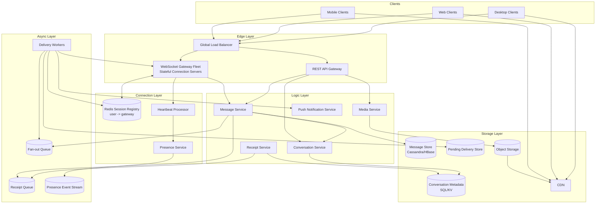
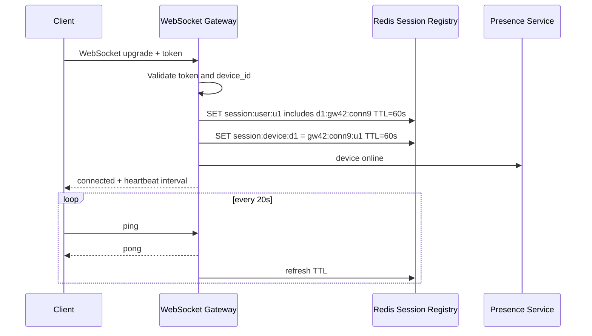
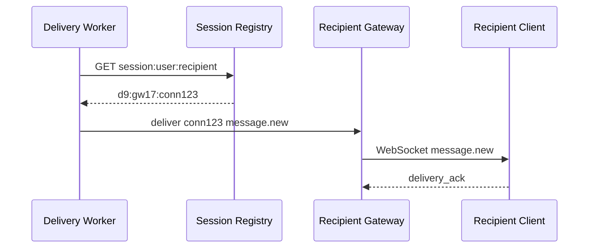
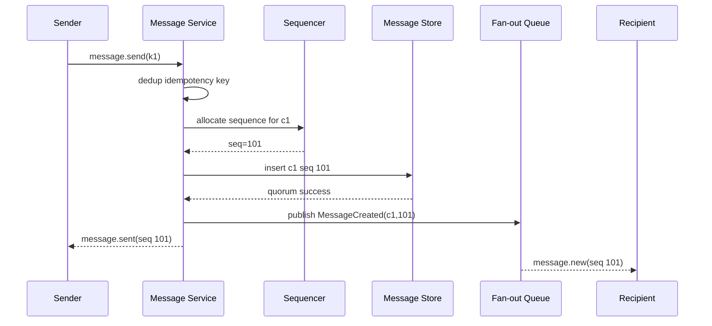
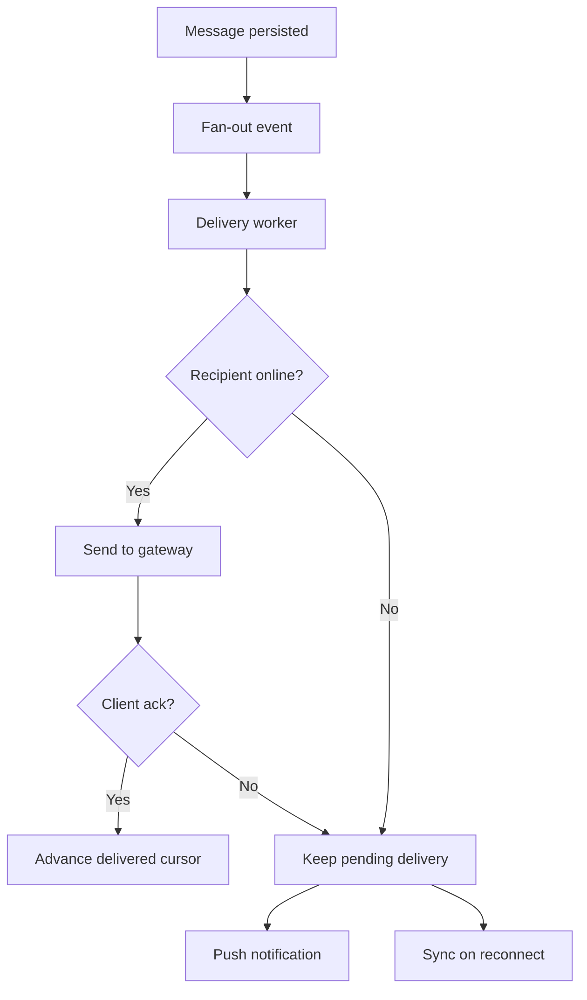
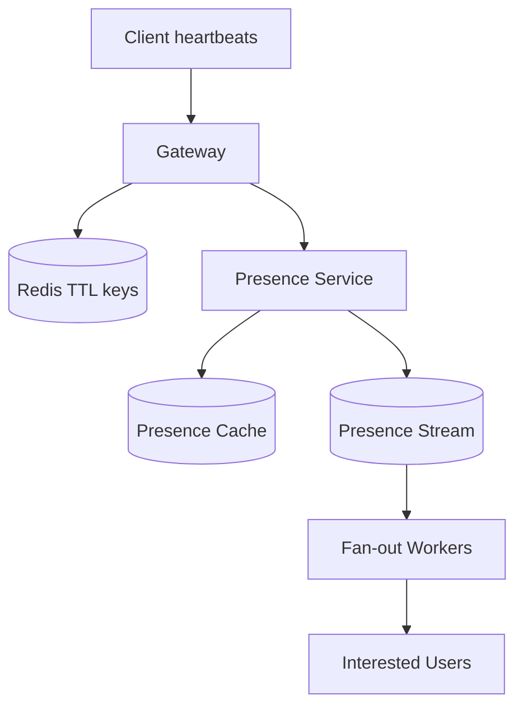
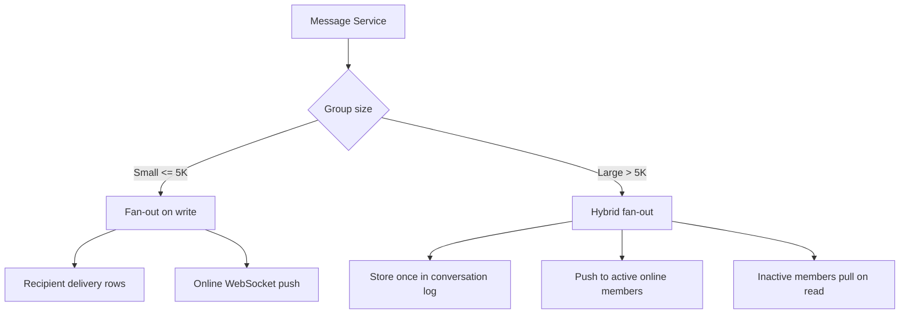
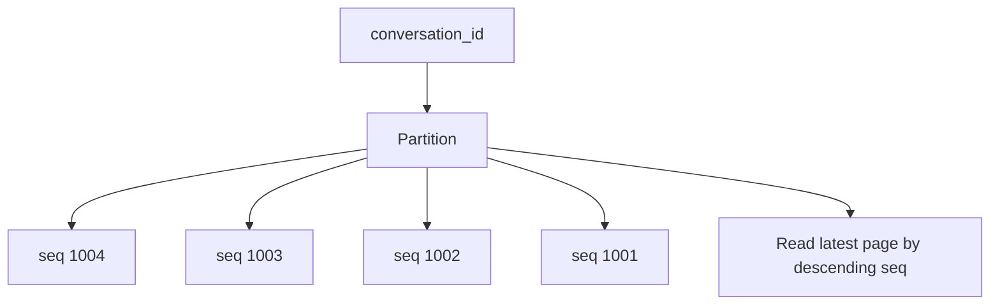
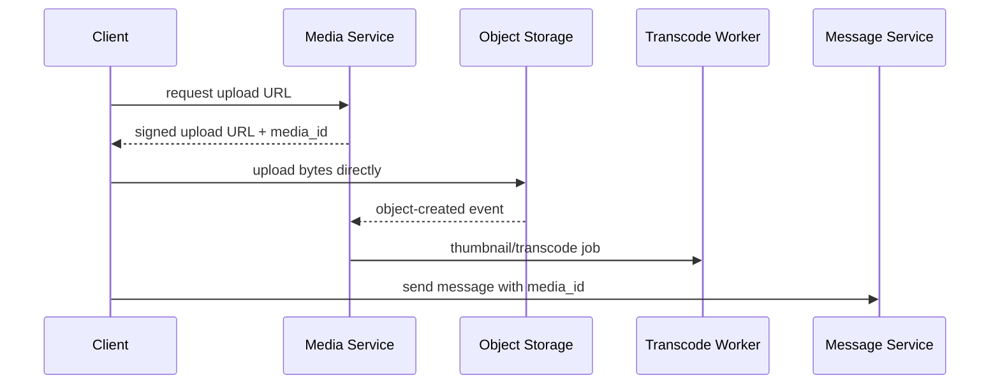

# Chat / Messaging System — High-Level Design
## 1. Problem Statement & Scope
Design a large-scale chat system like WhatsApp, Messenger, or Slack.
The system supports real-time one-to-one and group messaging across mobile, web, and desktop clients.
It must provide low-latency online delivery, durable history, offline delivery, receipts, presence, typing indicators, media messages, push notifications, and optional end-to-end encryption.
The key design challenge is mixing stateful WebSocket gateways with mostly stateless business services.
A message service can decide that a recipient should get a message, but only the gateway holding that recipient's socket can write to the client.
So the design uses a session registry mapping `user_id/device_id -> gateway_id/connection_id`.
### In scope
- 1:1 messaging.
- Group messaging.
- Persistent WebSocket connections.
- Message send, receive, and history retrieval.
- Offline delivery and reconnect sync.
- Sent, delivered, and read receipts.
- Per-conversation ordering.
- Online presence and last-seen.
- Typing indicators.
- Media messages through object storage and CDN.
- Push notifications through APNS/FCM.
- Multiple devices per user.
- Optional E2E encryption.
- Multi-region reliability model.
### Out of scope
- Voice/video calls.
- Full-text search ranking.
- Spam/abuse ML internals.
- Payments and commerce.
- Complete cryptographic protocol design.
- Client UI implementation.
### Success criteria
- Sender receives `sent` only after durable persistence.
- Online recipients receive messages in near real time.
- Offline recipients can later sync all missed messages.
- Duplicate retries do not create duplicate visible messages.
- Ordering is deterministic within one conversation.
- Presence and typing are best-effort.
---
## 2. Functional Requirements
### P0 requirements
- Users can send text messages to another user.
- Users can send text messages to a group.
- Users can receive messages over WebSocket when online.
- Users can fetch paginated message history.
- Users can receive messages sent while offline.
- System durably stores accepted messages.
- System supports message states: sent, delivered, read.
- System preserves ordering within a conversation.
- System supports reconnect and resume.
- System supports idempotent send retries.
- System supports multiple devices per user.
### P1 requirements
- Users can see online/offline presence.
- Users can see last-seen if privacy settings allow.
- Users can see typing indicators.
- Users can send media messages.
- System sends push notifications for offline/backgrounded users.
- System supports group membership changes.
- System supports per-user read cursors in groups.
- System supports mute and notification preferences.
### P2 requirements
- End-to-end encrypted message bodies.
- Message reactions.
- Message edits and deletes.
- Disappearing messages.
- Search for non-E2E deployments.
- Bots, webhooks, and workspace integrations.
### Core flow
1. Client authenticates.
2. Client opens WebSocket.
3. Gateway validates token.
4. Gateway registers session in Redis.
5. Sender sends `message.send` with idempotency key.
6. Message service validates membership.
7. Message service allocates per-conversation sequence number.
8. Message service writes message to durable storage.
9. Sender receives `message.sent`.
10. Message service publishes fan-out event.
11. Delivery workers route to online gateways.
12. Offline recipients get pending delivery state and push notification.
13. Recipient client sends delivery ack.
14. Recipient client advances read cursor when message is visible.
15. Sender receives receipt deltas.
### Message states
| State | Meaning | Producer |
|---|---|---|
| `created` | Local pending message | Sender client |
| `sent` | Server durably stored message | Message service |
| `delivered` | Recipient device received message | Recipient client |
| `read` | Recipient viewed message | Recipient client |
| `failed` | Terminal failure | Client/server |
---
## 3. Non-Functional Requirements
### Scale
- 500M DAU.
- 40 messages/user/day.
- 20B messages/day.
- 600K peak send QPS.
- 1.8M peak recipient delivery events/s.
- 100M concurrent WebSocket connections.
- Groups from 2 to 100K members.
- Tens of PB/year of replicated message storage.
### Latency
| Operation | p50 | p99 |
|---|---:|---:|
| Send ack | 50 ms | 250 ms |
| Online delivery | 100 ms | 500 ms |
| Receipt propagation | 100 ms | 1 s |
| History page read | 100 ms | 400 ms |
| Presence update | 1 s | 5 s |
| Push enqueue | 500 ms | 5 s |
### Availability and consistency
- Message send and history target 99.99% availability.
- WebSocket gateway fleet targets 99.95% availability.
- Message persistence is durable before sender ack.
- Message ordering is strong within a conversation.
- Conversation membership checks are strongly enforced.
- Receipts are eventually consistent.
- Presence is eventually consistent.
- Typing indicators are lossy.
- Push delivery is best-effort.
### Security
- TLS for all client-server communication.
- Service identity/mTLS for internal RPC.
- Short-lived access tokens on WebSocket upgrade.
- Signed URLs for media upload/download.
- Authorization based on conversation membership.
- Optional E2E mode stores ciphertext only.
- Message bodies are excluded from logs.
---
## 4. Back-of-the-Envelope Estimation
### Assumptions
| Parameter | Value | Notes |
|---|---:|---|
| DAU | 500M | Active users/day |
| Messages/user/day | 40 | Sent messages |
| Avg stored message | 1.5 KB | Body + metadata |
| Seconds/day | 100K | README convention |
| Peak multiplier | 3x | Daily peak |
| Replication factor | 3 | Durable storage/queue |
| Concurrent WebSockets | 100M | Peak connections |
| Connections/server | 100K | Tuned gateway |
| Avg fan-out | 3 recipients | Weighted DMs/groups |
| Large group threshold | 5K | Hybrid fan-out |
### Message QPS
| Calculation | Arithmetic | Result |
|---|---:|---:|
| Messages/day | 500M × 40 | 20B/day |
| Average send QPS | 20B / 100K | 200K/s |
| Peak send QPS | 200K × 3 | 600K/s |
### Fan-out QPS
| Calculation | Arithmetic | Result |
|---|---:|---:|
| Recipient events/day | 20B × 3 | 60B/day |
| Average fan-out QPS | 60B / 100K | 600K/s |
| Peak fan-out QPS | 600K × 3 | 1.8M/s |
### WebSocket gateways
| Calculation | Arithmetic | Result |
|---|---:|---:|
| Required gateways | 100M / 100K | 1,000 |
| With 60% utilization | 1,000 / 0.6 | 1,667 |
| Rounded fleet | headroom + failover | ~1,700 |
### Message storage
| Calculation | Arithmetic | Result |
|---|---:|---:|
| Raw/day | 20B × 1.5 KB | 30 TB/day |
| Raw/year | 30 TB × 365 | 10.95 PB/year |
| Replicated/year | 10.95 PB × 3 | 32.85 PB/year |
| With overhead | 32.85 PB × 1.3 | ~42.7 PB/year |
### Receipts
| Calculation | Arithmetic | Result |
|---|---:|---:|
| Receipt events/day | 60B deliveries × 2 states | 120B/day |
| Raw/day | 120B × 100 B | 12 TB/day |
| Replicated/year | 12 TB × 365 × 3 | 13.1 PB/year |
Cursor-based receipts are preferred because permanent per-message per-user receipts are too expensive.
### Bandwidth
| Calculation | Arithmetic | Result |
|---|---:|---:|
| Avg send ingress | 200K × 1.5 KB | 300 MB/s |
| Peak send ingress | 600K × 1.5 KB | 900 MB/s |
| Avg delivery egress | 600K × 1.5 KB | 900 MB/s |
| Peak delivery egress | 1.8M × 1.5 KB | 2.7 GB/s |
### Session registry memory
| Calculation | Arithmetic | Result |
|---|---:|---:|
| Active sessions | given | 100M |
| Entry size | user + device + gateway + TTL | 200 B |
| Raw memory | 100M × 200 B | 20 GB |
| With overhead | 20 GB × 4 | 80 GB |
### Large group fan-out
| Scenario | Arithmetic | Result |
|---|---:|---:|
| Group size | given | 100K |
| One fan-out-on-write message | 1 × 100K | 100K writes |
| 100 messages/s | 100 × 100K | 10M writes/s |
| Hybrid fan-out | store once + active push | O(active online) |
---
## 5. API Design
### API style
- WebSocket: send, receive, receipts, typing, presence.
- REST: history, sync, media upload URLs, group management.
- gRPC: internal service calls.
- Kafka/Pulsar: async fan-out and receipts.
### WebSocket connect
```http
GET /ws/v1/connect?device_id=d_123&client_version=9.2.1
Authorization: Bearer <access_token>
```
Server validates token, enforces connection limits, registers session, and starts heartbeat.
### Common WebSocket envelope
```json
{
  "event_id": "evt_01H...",
  "type": "message.send",
  "client_ts": "2026-08-05T00:52:07.298+05:30",
  "idempotency_key": "device123-000042",
  "payload": {}
}
```
### Send message
```json
{
  "type": "message.send",
  "idempotency_key": "d_123:send:908172",
  "payload": {
    "conversation_id": "c_456",
    "client_message_id": "m_local_789",
    "message_type": "text",
    "body": "hello",
    "media_refs": []
  }
}
```
### Send acknowledgement
```json
{
  "type": "message.sent",
  "payload": {
    "client_message_id": "m_local_789",
    "message_id": "msg_01H...",
    "conversation_id": "c_456",
    "sequence_number": 9311882,
    "server_ts": "2026-08-04T19:22:07.100Z",
    "state": "sent"
  }
}
```
### Delivery acknowledgement
```json
{
  "type": "message.delivery_ack",
  "idempotency_key": "d_999:delivery:msg_01H",
  "payload": {
    "conversation_id": "c_456",
    "message_id": "msg_01H...",
    "device_id": "d_999"
  }
}
```
### Read receipt
```json
{
  "type": "conversation.read",
  "idempotency_key": "d_999:read:c_456:9311882",
  "payload": {
    "conversation_id": "c_456",
    "read_upto_sequence_number": 9311882
  }
}
```
### History API
```http
GET /v1/conversations/c_456/messages?before_seq=9311882&limit=50
Authorization: Bearer <access_token>
```
Pagination uses sequence numbers rather than offsets.
### Sync API
```http
POST /v1/sync
Content-Type: application/json
{
  "device_id": "d_123",
  "conversation_cursors": [
    { "conversation_id": "c_1", "last_seen_sequence_number": 1001 }
  ]
}
```
### Media upload API
```http
POST /v1/media/uploads
Content-Type: application/json
{
  "content_type": "image/jpeg",
  "size_bytes": 850000,
  "sha256": "..."
}
```
Response returns `media_id` and a signed upload URL.
The message later references `media_id`.
### API rules
- Sender must be a conversation member.
- Every send requires an idempotency key.
- Same key and same request returns original ack.
- Same key with different payload returns conflict.
- Client timestamp is not ordering authority.
- Server sequence number is ordering authority.
- Typing indicators are not persisted.
- Push payloads avoid plaintext in E2E mode.
---
## 6. Data Model & Schema
### Storage choices
| Data | Store | Reason |
|---|---|---|
| Messages | Cassandra/HBase | High write throughput and ordered partition reads |
| Conversation metadata | Sharded SQL/strong KV | Smaller transactional metadata |
| Session registry | Redis Cluster | Low-latency user-to-gateway lookup |
| Presence | Redis + stream | Ephemeral state and transitions |
| Fan-out | Kafka/Pulsar | Durable replayable delivery pipeline |
| Media | Object storage + CDN | Large blobs and edge delivery |
| Receipts | Cassandra/KV | High-volume cursor updates |
### Message table
```sql
CREATE TABLE messages_by_conversation (
  conversation_id text,
  sequence_number bigint,
  message_id text,
  sender_user_id text,
  sender_device_id text,
  message_type text,
  body_ciphertext blob,
  body_plaintext text,
  media_refs list<text>,
  membership_version int,
  server_ts timestamp,
  edited_ts timestamp,
  deleted_ts timestamp,
  PRIMARY KEY ((conversation_id), sequence_number)
) WITH CLUSTERING ORDER BY (sequence_number DESC);
```
### Conversation metadata
```sql
CREATE TABLE conversations (
  conversation_id text PRIMARY KEY,
  conversation_type text,
  title text,
  created_by_user_id text,
  current_membership_version int,
  large_group boolean,
  message_retention_days int,
  created_at timestamp
);
```
### Membership
```sql
CREATE TABLE conversation_members (
  conversation_id text,
  user_id text,
  role text,
  joined_at timestamp,
  left_at timestamp,
  membership_version int,
  notification_setting text,
  last_read_sequence_number bigint,
  last_delivered_sequence_number bigint,
  PRIMARY KEY ((conversation_id), user_id)
);
```
### Pending deliveries
```sql
CREATE TABLE pending_deliveries_by_user (
  user_id text,
  conversation_id text,
  sequence_number bigint,
  message_id text,
  delivery_state text,
  created_at timestamp,
  expires_at timestamp,
  PRIMARY KEY ((user_id), conversation_id, sequence_number)
);
```
### Receipt cursors
```sql
CREATE TABLE receipt_cursors (
  conversation_id text,
  user_id text,
  delivered_upto_sequence_number bigint,
  read_upto_sequence_number bigint,
  updated_at timestamp,
  PRIMARY KEY ((conversation_id), user_id)
);
```
### Idempotency
```sql
CREATE TABLE message_idempotency (
  sender_user_id text,
  sender_device_id text,
  idempotency_key text,
  request_hash text,
  message_id text,
  conversation_id text,
  sequence_number bigint,
  created_at timestamp,
  PRIMARY KEY ((sender_user_id, sender_device_id), idempotency_key)
);
```
### Session registry keys
```text
session:user:{user_id} -> set(device_id:gateway_id:connection_id)
session:device:{device_id} -> gateway_id:connection_id:user_id
presence:user:{user_id} -> online/last_seen/device_count
gateway:{gateway_id}:sessions -> set(connection_id)
```
### Data model notes
- E2E mode stores ciphertext only.
- Message rows are append-first and mostly immutable.
- Edits/deletes are metadata updates or tombstones.
- Large conversations can partition by `(conversation_id, bucket_id)`.
- Receipt cursors advance monotonically.
- Media bytes stay out of the message store.
---
## 7. High-Level Architecture

### Component responsibilities
- Global load balancer routes clients to nearby healthy regions.
- WebSocket gateways own long-lived client sockets.
- Gateways register sessions but do not own durable messages.
- Session registry maps online users/devices to gateways.
- Presence service processes heartbeats and state transitions.
- Message service validates, sequences, persists, and publishes events.
- Conversation service owns metadata and membership.
- Fan-out workers deliver to gateways or offline queues.
- Push service talks to APNS/FCM for offline/background notifications.
- Message store supports append-heavy ordered conversation reads.
- Object storage and CDN handle media bytes.
### Send path
1. Client sends `message.send` over WebSocket.
2. Gateway forwards command to message service.
3. Message service validates membership and idempotency.
4. Message service allocates `message_id` and sequence number.
5. Message service writes the message to message store.
6. Message service returns `message.sent` to sender.
7. Message service publishes fan-out event.
8. Delivery workers route to online gateways or pending delivery storage.
### Receive path
1. Delivery worker consumes fan-out event.
2. Worker expands recipients using membership snapshot.
3. Worker queries session registry.
4. Worker calls target gateway by `gateway_id`.
5. Gateway writes event to recipient WebSocket.
6. Recipient client sends delivery ack.
7. Receipt service updates delivered cursor.
8. Sender devices receive receipt delta.
---
## 8. Deep Dives
### 8.1 Connection management
Millions of persistent WebSockets make the connection layer central.
A socket is tied to one gateway process, so online delivery requires routing to the gateway holding the recipient's connection.

Gateway responsibilities:
- Hold WebSocket connections.
- Authenticate handshake tokens.
- Maintain user/device connection context.
- Register and refresh session registry entries.
- Forward client commands to backend services.
- Write server events to client sockets.
- Apply bounded-buffer backpressure.
Session registry entries:
| Key | Value | TTL | Purpose |
|---|---|---:|---|
| `session:user:{user_id}` | active device sessions | 60-90s | find user devices |
| `session:device:{device_id}` | gateway and connection ID | 60-90s | route to one device |
| `gateway:{gateway_id}:sessions` | connection IDs | 60-90s | cleanup/observability |
| `presence:user:{user_id}` | state and last seen | 60-120s | presence reads |
Routing to an online recipient:

Failure behavior:
- Clean disconnect deletes session keys immediately.
- Unclean disconnect relies on TTL expiry.
- Gateway crash disconnects clients and stale registry entries expire.
- Clients reconnect with exponential backoff and jitter.
- Reconnected clients sync from last known sequence cursors.
- Slow clients are disconnected after sustained outbound buffer growth.
- Typing and presence are dropped before durable message events.
### 8.2 Message delivery and ordering
Ordering is total within a conversation and undefined across conversations.

Ordering rules:
- Every conversation has monotonically increasing sequence numbers.
- Clients render by server sequence, not arrival time.
- If `N+2` arrives before `N+1`, client performs gap sync.
- History APIs page by sequence number.
- Receipts advance by sequence cursor.
Sequencer choices:
| Option | Description | Assessment |
|---|---|---|
| DB atomic counter | Increment one row | Simple, hot-key risk |
| Sequencer shard | Hash conversation to owner | Good default |
| Kafka offset | Use partition offset | Elegant but partition-limited |
| Snowflake only | Timestamp-like IDs | Not strict enough |
Recommended: hash `conversation_id` to a sequencer shard; hot conversations can receive preallocated ranges.
The message is persisted with sequence number before sender ack.
At-least-once delivery is intentional.
Workers, gateways, networks, and clients can fail independently, so idempotency is required.
| Layer | Dedup key | Behavior |
|---|---|---|
| Send API | sender + device + key | return original ack |
| Message store | conversation + sequence | prevent duplicate row |
| Client display | message_id | render once |
| Delivery ack | recipient + message + device | idempotent update |
| Read ack | recipient + conversation + cursor | monotonic max |
### 8.3 Offline delivery and ack protocol

Ack meanings:
- `message.sent` means durable server acceptance.
- Gateway socket write means bytes were queued to a socket.
- Delivery ack means recipient device received and locally persisted the message.
- Read ack means recipient viewed the message.
- Read ack implies delivered ack.
- Cursors never move backward.
Offline delivery uses durable conversation history plus pending delivery/inbox state.
If pending rows are compacted or lost, the client can still recover from the conversation log using sequence cursors.
### 8.4 Presence
Presence is best-effort because mobile connectivity and app lifecycle are noisy.

Presence rules:
- Online means at least one active device heartbeat is fresh.
- Offline is inferred from disconnect or TTL expiry.
- Last seen is updated on meaningful activity or disconnect.
- Multiple devices collapse to one user-level state.
- Privacy settings can hide exact state.
Why eventually consistent:
- Mobile apps are backgrounded.
- Networks change frequently.
- Heartbeats can be delayed.
- Gateway crashes leave stale state until TTL expiry.
- Broadcasting every heartbeat is too expensive.
Fan-out strategy:
- Emit state transitions, not every heartbeat.
- Coalesce flapping online/offline events.
- Fan out to active conversation participants.
- Fetch contact-list presence in batches.
- Avoid full member presence in large groups.
- Drop presence before message events under load.
### 8.5 Group fan-out
Group chat is a write-amplification problem.
A single message can require delivery to many users and devices.

Small groups:
- Fetch member list.
- Create recipient delivery tasks.
- Send to online devices.
- Create pending rows for offline users.
- Update unread counters.
- Send push according to settings.
Large groups:
- Store message once.
- Push only to active online subscribers.
- Avoid one pending row per inactive member.
- Use per-user read cursors.
- Compute some unread state lazily.
- Push selectively for mentions or priority messages.
Membership versioning:
- Membership changes increment conversation version.
- Each message stores current membership version.
- Fan-out uses the matching membership snapshot.
- History reads validate the user's membership interval.
### 8.6 Storage design

Cassandra/HBase fits because message history is append-heavy and naturally partitioned by conversation.
```text
normal partition_key = conversation_id
normal clustering_key = sequence_number
large partition_key = (conversation_id, bucket_id)
bucket_id = sequence_number / 10000
```
Storage rules:
- Write message before sender ack.
- Use local quorum in the primary region.
- Avoid in-place body updates.
- Represent edits/deletes as metadata or events.
- Use retention and compaction for old messages.
- Move old media/messages to cold storage when policy allows.
### 8.7 Media handling

Media principles:
- Message service stores only `media_id` and metadata.
- Client uploads directly to object storage.
- CDN serves downloads through signed URLs.
- Thumbnail/transcode jobs are asynchronous.
- E2E media can be encrypted client-side before upload.
---
## 9. Scaling/Caching/Bottlenecks
### Scaling table
| Component | Scale key | Bottleneck | Mitigation |
|---|---|---|---|
| WebSocket gateway | active connections | FDs, memory, TLS | event loop, autoscale, TLS resumption |
| Message service | send QPS | membership, sequencing | stateless scale-out, caches |
| Sequencer | conversation_id | hot groups | ranges, dedicated shard |
| Message store | conversation/bucket | hot partitions | bucketing, retention |
| Fan-out workers | queue partitions | delivery amplification | partitioning, autoscale |
| Redis registry | user_id | memory, hot keys | cluster sharding, TTLs |
| Presence | user_id | heartbeat volume | coalescing, transitions only |
| Push service | provider | APNS/FCM quotas | batching, retries, DLQ |
### Caching strategy
| Cache | Data | TTL | Invalidation |
|---|---|---:|---|
| Gateway local | token claims | token expiry | natural expiry |
| Message service | membership | 1-5 min | membership version bump |
| Redis registry | sessions | 60-90s | heartbeat/disconnect/TTL |
| Presence cache | online state | 60-120s | state transition |
| Recent page cache | latest messages | 10-60s | new append |
| CDN | media objects | hours-days | signed URL expiry |
### Hot conversation mitigations
- Switch to large-group mode.
- Bucket message partitions.
- Assign dedicated sequencer shard.
- Batch fan-out events.
- Rate limit sends per group.
- Cache latest pages.
- Avoid per-member unread writes.
### Hot user mitigations
- Limit active devices.
- Batch receipt updates.
- Coalesce push notifications.
- Cap presence subscriptions.
- Compact pending deliveries.
- Protect inbox partitions from too many large groups.
### Queue partitioning
| Partition key | Pros | Cons |
|---|---|---|
| conversation_id | preserves conversation processing order | hot groups can overload one partition |
| recipient_user_id | smooth recipient delivery | client handles sequence ordering |
| message_id | balanced | weaker ordering locality |
| conversation_id + bucket | helps hot groups | more complex |
Recommended: partition initial `MessageCreated` by conversation and recipient delivery events by recipient user.
Sequence numbers plus gap sync preserve display order.
### Common bottlenecks
- Gateway file descriptors and TCP memory.
- TLS handshake CPU.
- Mobile network churn.
- Redis registry hot keys.
- Hot group sequencer shards.
- Cassandra compaction debt.
- Tombstone accumulation.
- Push provider throttling.
---
## 10. Reliability & Consistency
### Guarantees
- After `message.sent`, the message is durably stored.
- Recipient delivery is at-least-once.
- User-visible rendering is exactly-once through deduplication.
- Per-conversation ordering is deterministic.
- Cross-conversation ordering is not guaranteed.
- Receipts are eventually consistent.
- Presence and typing are best-effort.
### Failure handling
| Failure | Impact | Mitigation |
|---|---|---|
| Sender gateway crashes before forwarding | No server ack | client retries same key |
| Message service crashes before write | No server ack | client retry |
| Message service crashes after write before ack | duplicate retry | idempotency returns original result |
| Fan-out worker crashes | delayed delivery | queue redelivery |
| Recipient gateway crashes | online delivery fails | TTL expiry and sync |
| Redis registry unavailable | routing degraded | retry, fallback to pending delivery |
| Message replica down | higher latency | quorum replication and repair |
| Push provider down | notifications delayed | backoff and DLQ |
| Primary region down | sends pause for owned conversations | promote secondary with fencing |
### Retry and dedup
- Clients retry sends until ack or terminal error.
- Retries use the same idempotency key.
- Services use exponential backoff with jitter.
- Queue consumers are idempotent.
- Poison events move to DLQ.
- Receipt writes are monotonic max operations.
### Consistency table
| Data | Consistency | Reason |
|---|---|---|
| Message durability | strong after ack | user trust |
| Message order | strong per conversation | correct UX |
| Membership authorization | strong | security |
| Receipts | eventual | staleness acceptable |
| Presence | eventual | high churn |
| Typing | best-effort | ephemeral |
| Push | best-effort | external dependency |
### Multi-region model
- Users connect to nearest healthy region.
- Each conversation has a primary sequencing region.
- Local gateways forward sends to the conversation primary if needed.
- Messages replicate asynchronously to other regions.
- Reads can be local when replication lag is acceptable.
- Failover promotes a secondary only after fencing the old primary.
- This favors ordering correctness over write availability during failover.
### Backpressure
- Gateways reject new connections near capacity.
- Message service returns retryable `SERVER_BUSY`.
- Queues absorb short bursts.
- Presence and typing are dropped first.
- Push notifications are coalesced.
- Hot groups are rate limited.
### E2E considerations
- Server stores ciphertext only.
- Metadata still supports routing, ordering, and receipts.
- Push payloads contain generic text such as `New message`.
- Search and server-side moderation are limited.
- Multi-device key management is a separate subsystem.
---
## 11. Trade-offs & Alternatives
| Decision | Option A | Option B | Chosen | Rationale |
|---|---|---|---|---|
| Client transport | WebSocket | Long-polling | WebSocket | full-duplex low-latency active chat |
| Delivery model | Store-and-forward | Online-only | Store-and-forward | required for offline and history |
| Group fan-out | Fan-out on write | Fan-out on read | Hybrid | fast small groups, scalable large groups |
| Message store | Cassandra/HBase | Sharded SQL | Cassandra/HBase | append-heavy PB-scale history |
| Semantics | At-least-once + dedup | Exactly-once | At-least-once + dedup | practical across clients and queues |
| Ordering | Per-conversation sequence | Global sequence | Per-conversation | global order unnecessary |
| Presence | Strong state | Best-effort | Best-effort | high churn, low criticality |
| Media path | Through message service | Direct object upload | Direct upload | keeps send path lightweight |
| Multi-region | Single primary | Active-active | Single primary per conversation | simpler ordering |
| Receipts | Per-message rows | User cursors | Cursors | lower storage/write volume |
| Session routing | Redis registry | Broadcast to gateways | Redis registry | avoids fleet-wide broadcast |
| Queue | Durable log | In-memory queue | Durable log | replay and recovery |
---
## 12. Future Improvements
- Message search pipeline.
- Reactions and compact reaction counters.
- Message edit history.
- Delete-for-me and delete-for-everyone.
- Disappearing messages.
- Abuse detection and spam throttling.
- Enterprise compliance export and legal hold.
- Formal E2E key transparency.
- Encrypted client backups.
- Slack-style channels and workspace administration.
- Bots and webhooks.
- Adaptive fan-out thresholds.
