# CI/CD Deployment Platform — HLD

## 1. Problem Statement & Scope

Design a CI/CD deployment platform like Jenkins, GitHub Actions, GitLab CI, and Spinnaker.

The platform lets teams define pipeline-as-code workflows that build, test, scan, package, and deploy software from git repositories.

The core challenge is reliably orchestrating a pipeline DAG while running untrusted build workloads on an elastic fleet of isolated runners.

The control plane owns triggers, config parsing, run state, dependency scheduling, approvals, deployment coordination, secrets, policy, and audit logs.

The data plane owns runner execution, live logs, artifacts, dependency caches, and integration with deployment targets.

### In scope

- Repository integration with SCM providers.
- Signed webhook triggers for push, pull request, tag, release, and merge events.
- Manual pipeline dispatch with parameters.
- Scheduled pipeline triggers.
- Pipeline YAML stored with code and resolved at a commit SHA.
- DAG of stages and jobs, for example build -> test -> scan -> deploy.
- Fan-out parallel jobs and fan-in gates.
- Matrix builds.
- Job retry, cancellation, timeout, and conditional execution.
- Hosted autoscaled runners.
- Self-hosted customer runners.
- Runner labels for OS, architecture, GPU, region, trust level, and custom capabilities.
- Container, microVM, or VM based job isolation.
- Live log streaming to browsers.
- Durable log persistence.
- Artifact upload, download, retention, and cleanup.
- Dependency and build caching.
- Deployment environments with approvals.
- Rolling, blue-green, and canary deployment strategies.
- Health checks and automated rollback.
- Secret management and scoped secret injection.
- Audit logging for pipeline, secret, runner, approval, and deployment actions.

### Out of scope

- Source-code hosting internals.
- Git object storage.
- Full package registry design.
- Full Kubernetes scheduler implementation.
- Billing and marketplace details.
- Detailed UI mockups.
- Enterprise SSO internals beyond auth hooks.
- ML-based test selection except as a future improvement.

### Assumptions

- Each repository can contain one or more pipeline YAML files.
- Pipeline config is immutable for a run because it is fetched at a specific commit SHA.
- Build and test jobs are at-least-once tasks.
- User scripts should be idempotent where possible.
- Deployment jobs require stronger idempotency, locks, and reconciliation.
- Hosted runners are ephemeral by default.
- Self-hosted runners may be persistent and customer-managed.
- Object storage is available for logs, artifacts, and caches.
- Metadata storage supports transactions for run and job state.
- Queueing infrastructure supports leases and visibility timeouts.
- Secrets are never persisted in plaintext by platform services.

### Design goals

- Provide fast feedback after commits.
- Correctly schedule DAG dependencies under retries and failures.
- Keep hosted runner environments clean and isolated.
- Stream logs with low latency while storing them cheaply.
- Store artifacts durably without sending bytes through API servers.
- Make production deployments auditable, gated, and reversible.
- Keep tenants fair when one monorepo fans out thousands of jobs.
- Support both hosted and self-hosted execution.
- Degrade gracefully when notifications or live log fanout fail.

### Core entities

- Organization owns repositories, users, runner pools, environments, policies, secrets, and quotas.
- Repository owns pipeline definitions and run history.
- Pipeline definition is pipeline-as-code YAML plus derived metadata.
- Pipeline run is one execution of one config at one git ref and commit SHA.
- Job run is one schedulable node in the pipeline DAG.
- Runner is an execution host with labels, capacity, trust level, and heartbeat.
- Artifact is immutable output produced by a job.
- Cache entry is evictable reusable content.
- Environment is a deployment target with approvals, locks, and secrets.
- Deployment is an attempt to move an environment to a target version.

## 2. Functional Requirements

### P0 requirements

- Users can connect repositories to the platform.
- Users can define pipelines in repository YAML.
- System validates pipeline YAML before execution.
- System triggers runs from push events.
- System triggers runs from pull request events.
- System triggers runs from tag events.
- Users can manually trigger a pipeline run.
- Users can pass manual parameters to a run.
- System expands config into a DAG of jobs.
- System schedules jobs only after dependencies complete successfully.
- System supports parallel jobs when dependencies allow fan-out.
- System supports fan-in gates before later stages.
- System runs jobs on hosted runners.
- System runs jobs on self-hosted runners.
- System matches jobs to runners by labels and capacity.
- Users can cancel running pipelines and jobs.
- Users can retry failed jobs.
- Users can view run, stage, job, and step status.
- Users can stream job logs live.
- Users can view historical logs after completion.
- Jobs can upload artifacts.
- Later jobs can download artifacts from prior jobs.
- Jobs can restore and save dependency caches.
- System injects scoped secrets into authorized jobs.
- System masks known secrets in logs.
- Users can define deployment environments.
- Production deployments can require approvals.
- System supports rolling deployments.
- System supports blue-green deployments.
- System supports canary deployments.
- System can rollback failed deployments.
- System records audit events for runs, approvals, secrets, runners, and deployments.

### P1 requirements

- Scheduled pipelines using cron-like expressions.
- Branch, path, and tag filters for triggers.
- Matrix builds that expand one logical job into many variants.
- Conditional job execution based on expressions.
- Job-level timeouts.
- Pipeline-level concurrency groups.
- Cancel-in-progress for superseded branch runs.
- Required SCM status checks for pull requests.
- Reusable pipeline templates.
- Organization-level policies for runners and secrets.
- Runner autoscaling by queue depth and latency.
- Warm runner pools for common images.
- OIDC token issuance for cloud deployments.
- Artifact retention policies.
- Cache eviction policies.
- Environment deployment locks.
- Manual approval comments and audit trail.
- Webhook callbacks for status changes.
- Email, chat, and SCM notifications.
- Deployment freeze windows.
- Per-repository concurrency limits.

### P2 requirements

- Test result visualization.
- Code coverage dashboards.
- Flaky test detection.
- Dynamic test splitting.
- Policy-as-code for deployment rules.
- Preview environments per pull request.
- Release train orchestration.
- Cross-repository pipeline dependencies.
- Advanced supply-chain provenance visualization.
- Cost attribution per organization and repository.
- Multi-cloud runner placement.
- Edge deployments.

### Core user flow

1. Developer pushes code to a branch.
2. SCM sends a signed webhook to the platform.
3. Trigger service verifies the signature and deduplicates the event.
4. Config service fetches the pipeline YAML at the commit SHA.
5. Parser validates YAML and expands templates and matrices.
6. Orchestrator stores a run and job DAG.
7. Ready jobs are enqueued by runner label.
8. Scheduler assigns jobs to matching runners.
9. Runner checks out code and executes steps in isolation.
10. Runner streams logs to log gateway.
11. Runner uploads artifacts and cache entries to object storage.
12. Runner reports job completion to the control plane.
13. Orchestrator unlocks dependent jobs.
14. Deployment jobs wait for environment approval if required.
15. Deployment controller performs rollout and health checks.
16. System updates SCM commit status and sends notifications.

### Non-goals clarified

- We do not guarantee deterministic user scripts.
- We do not make non-idempotent deployment scripts automatically safe.
- We do not execute untrusted hosted jobs on persistent shared machines.
- We do not expose long-lived cloud credentials to jobs.
- We do not require every runner to be Kubernetes based.

## 3. Non-Functional Requirements

### Scale

- 50M registered developers.
- 5M daily active developers.
- 2M connected repositories.
- 100K pipeline runs per day initially.
- 1M pipeline runs per day at growth scale.
- Average 8 jobs per run.
- Average 6 job-minutes per job.
- 20% of jobs produce artifacts.
- 80% of jobs produce logs only.
- 5% of runs include deployment jobs.
- 1% of runs target production environments.
- 15K hosted runners at initial peak capacity.
- 125K hosted runners at growth peak capacity.
- 50K self-hosted runner registrations.

### Latency targets

| Operation | p50 | p99 | Notes |
|---|---:|---:|---|
| Webhook acknowledgement | 50 ms | 300 ms | Persist event then return |
| Pipeline config validation | 200 ms | 2 s | Larger YAML may be slower |
| Run creation | 100 ms | 500 ms | Metadata transaction |
| Ready job enqueue | 100 ms | 1 s | After dependency completion |
| Job scheduling delay | 5 s | 60 s | Depends on runner capacity |
| Live log delivery | 300 ms | 2 s | Runner to browser |
| Artifact metadata lookup | 50 ms | 300 ms | Object redirect follows |
| Approval submission | 100 ms | 500 ms | Strong audit write |
| Deployment state update | 200 ms | 2 s | Includes environment lock |
| SCM status update | 1 s | 10 s | External dependency |

### Availability targets

- Public API and UI: 99.95% monthly availability.
- Pipeline orchestration: 99.95% monthly availability.
- Hosted runner fleet: 99.9% monthly availability.
- Log streaming: 99.9% monthly availability.
- Artifact download: 99.99% monthly availability.
- Secret retrieval service: 99.99% availability for authorized jobs.
- Deployment controller: 99.95% monthly availability.

### Durability targets

- Run metadata: no acknowledged state transition lost.
- Audit log: append-only and immutable for compliance window.
- Logs: retained according to policy with object-store durability.
- Artifacts: retained according to policy with object-store durability.
- Caches: best effort and safe to evict.
- Webhooks: durable event before acknowledgement.

### Consistency targets

- Pipeline run state is strongly consistent per run.
- Job dependency state is strongly consistent per run.
- Runner heartbeats are eventually consistent with short leases.
- Logs are ordered per job stream by sequence number.
- Artifacts are immutable after finalization.
- Cache entries are content-addressed and immutable.
- Deployment environment lock is strongly consistent.
- Approvals require read-after-write consistency.
- SCM status updates are eventually consistent.
- Notifications are at-least-once.

### Security targets

- TLS everywhere.
- Signed SCM webhooks with replay protection.
- OAuth or app-based SCM integration.
- Encryption at rest for metadata and objects.
- Secrets encrypted with envelope encryption.
- Secrets scoped by organization, repository, environment, and branch.
- Short-lived job tokens.
- No plaintext secrets in metadata databases.
- Log masking for configured secrets.
- Ephemeral hosted runners with clean disks.
- Network egress controls for restricted environments.
- Least-privilege deployment identities.
- Auditability for privileged actions.
- Supply-chain provenance for artifacts.

## 4. Back-of-the-Envelope Estimation

Use README conventions: 1 day ≈ 100,000 seconds, peak ≈ 3× average unless otherwise stated, and replication factor 3 for durable storage unless noted.

### Run and job traffic

| Metric | Assumption / arithmetic | Result |
|---|---:|---:|
| Pipeline runs/day | given | 100,000 |
| Seconds/day | README convention | 100,000 s |
| Avg runs/sec | 100,000 / 100,000 | 1 run/s |
| Peak multiplier | bursty workday traffic | 3× |
| Peak runs/sec | 1 × 3 | 3 runs/s |
| Avg jobs/run | given | 8 |
| Jobs/day | 100,000 × 8 | 800,000 |
| Avg jobs/sec | 800,000 / 100,000 | 8 jobs/s |
| Peak jobs/sec | 8 × 3 | 24 jobs/s |

### Runner capacity

| Metric | Assumption / arithmetic | Result |
|---|---:|---:|
| Avg job duration | 6 minutes × 60 | 360 s |
| Avg concurrent jobs | 8 jobs/s × 360 s | 2,880 jobs |
| Peak concurrent jobs | 24 jobs/s × 360 s | 8,640 jobs |
| Utilization target | given | 70% |
| Runners needed at peak | 8,640 / 0.70 | 12,343 ≈ 12.5K |
| Warm spare buffer | 12.5K × 20% | 2.5K |
| Provisioned hosted capacity | 12.5K + 2.5K | 15K runners |

If a runner executes two small jobs concurrently, machine count drops, but tenant isolation and performance predictability are weaker.

For hosted untrusted workloads, assume one job per ephemeral VM or one job per microVM/container sandbox.

### Growth-scale runner estimate

| Metric | Assumption / arithmetic | Result |
|---|---:|---:|
| Growth runs/day | given | 1,000,000 |
| Avg growth runs/sec | 1,000,000 / 100,000 | 10 runs/s |
| Jobs/day | 1,000,000 × 8 | 8,000,000 |
| Avg jobs/sec | 8,000,000 / 100,000 | 80 jobs/s |
| Peak jobs/sec | 80 × 3 | 240 jobs/s |
| Peak concurrent jobs | 240 × 360 | 86,400 jobs |
| Runners at 70% utilization | 86,400 / 0.70 | 123,429 ≈ 125K |

### Log volume

| Metric | Assumption / arithmetic | Result |
|---|---:|---:|
| Jobs/day | 100K runs × 8 | 800K |
| Avg raw logs/job | given | 5 MB |
| Raw logs/day | 800K × 5 MB | 4,000,000 MB = 4 TB/day |
| Compression ratio | gzip/zstd | 3:1 |
| Compressed logs/day | 4 TB / 3 | 1.33 TB/day |
| Retention | default | 90 days |
| Compressed active log storage | 1.33 TB/day × 90 | 119.7 TB |
| RF=3 durable log storage | 119.7 TB × 3 | 359.1 TB |
| Peak running jobs | from runner estimate | 8,640 |
| Avg live log rate/job | given | 15 KB/s |
| Peak ingest bandwidth | 8,640 × 15 KB/s | 129,600 KB/s ≈ 130 MB/s |
| Internal replicated fanout | 130 MB/s × 2 | 260 MB/s |

### Artifact storage

| Metric | Assumption / arithmetic | Result |
|---|---:|---:|
| Jobs/day | from above | 800K |
| Artifact-producing jobs | 20% | 160K/day |
| Avg artifact size | given | 100 MB |
| Raw artifacts/day | 160K × 100 MB | 16,000,000 MB = 16 TB/day |
| Compression/dedup savings | 20% | 16 TB × 0.80 = 12.8 TB/day |
| Retention | default | 30 days |
| Active artifact storage | 12.8 TB/day × 30 | 384 TB |
| RF=3 durable storage | 384 TB × 3 | 1.15 PB |

### Cache storage

| Metric | Assumption / arithmetic | Result |
|---|---:|---:|
| Active repositories/day | given | 200K |
| Avg cache entries/repo | given | 5 |
| Avg cache entry size | given | 500 MB |
| Logical cache footprint | 200K × 5 × 500 MB | 500 TB |
| Content dedup savings | 30% | 500 TB × 0.70 = 350 TB |
| RF=2 cache durability | 350 TB × 2 | 700 TB |

Caches are evictable, so they should not use the same durability tier as release artifacts.

### Metadata storage

| Entity | Count/day | Size/entity | Storage/day |
|---|---:|---:|---:|
| Pipeline runs | 100K | 5 KB | 500 MB |
| Job runs | 800K | 4 KB | 3.2 GB |
| State transitions | 8M | 1 KB | 8 GB |
| Artifact metadata | 160K | 2 KB | 320 MB |
| Audit events | 2M | 1 KB | 2 GB |
| Total raw metadata | - | - | ~14 GB/day |

| Metric | Arithmetic | Result |
|---|---:|---:|
| Raw metadata/year | 14 GB/day × 365 | 5.11 TB/year |
| Index overhead | 5.11 TB × 2 | 10.22 TB/year |
| RF=3 durable metadata | 10.22 TB × 3 | 30.66 TB/year |

### API QPS

| API family | Arithmetic | Avg QPS | Peak QPS |
|---|---:|---:|---:|
| Webhook events | 100K runs/day / 100K s | 1 | 3 |
| Job lease requests | 800K jobs/day / 100K s | 8 | 24 |
| Job heartbeats | 2,880 running jobs / 15 s | 192 | 576 |
| Log append batches | 2,880 jobs × 1 batch/s | 2,880 | 8,640 |
| UI status reads | 5M DAU × 20/day / 100K s | 1,000 | 3,000 |
| Artifact downloads | 300K/day / 100K s | 3 | 9 |

The hottest path is logs and heartbeats, not pipeline creation.

### Server estimate

| Component | Load | Capacity assumption | Instances |
|---|---:|---:|---:|
| API servers | 3K peak QPS | 500 QPS/instance | 10 |
| Trigger workers | 3 events/s | 50 events/s/worker | 4 for HA |
| Orchestrators | 24 transitions/s + scans | 100 transitions/s | 6 |
| Schedulers | 24 leases/s + 576 heartbeats/s | 1K ops/s | 6 |
| Log gateways | 130 MB/s ingest | 25 MB/s/instance | 10 |
| Artifact metadata service | low byte QPS | 200 QPS/instance | 4 |
| Deployment controllers | low QPS, critical | HA workers | 3/region |

## 5. API Design

### API style

- REST for public control-plane APIs.
- WebSocket for live run and log subscriptions.
- gRPC for runner-to-platform APIs.
- Webhooks for SCM events and outbound notifications.
- Object-store pre-signed URLs for artifact/cache upload and download.
- Idempotency keys for mutating APIs.
- Cursor pagination for list APIs.

### Authentication and authorization

- Users authenticate through OAuth/OIDC.
- Repositories authenticate through installed SCM application credentials.
- Runners authenticate with short-lived runner registration tokens.
- Jobs authenticate with short-lived job tokens scoped to one run and one job.
- Deployment jobs use OIDC federation or scoped environment credentials.
- Authorization checks include organization, repository, branch, environment, role, and runner trust level.

### Trigger a manual run

```http
POST /v1/repos/{repo_id}/pipelines/{pipeline_id}/runs
Authorization: Bearer <user_token>
Idempotency-Key: manual-run-2026-08-05-001
Content-Type: application/json

{
  "ref": "refs/heads/main",
  "commit_sha": "b7f8...",
  "inputs": {
    "environment": "staging",
    "run_e2e": "true"
  }
}
```

Response:

```json
{
  "run_id": "run_01J7R8",
  "status": "QUEUED",
  "dag_version": 3,
  "created_at": "2026-08-05T00:56:28Z"
}
```

### Receive SCM webhook

```http
POST /v1/webhooks/scm/{installation_id}
X-SCM-Signature: sha256=...
Content-Type: application/json
```

Behavior:

- Verify signature.
- Check replay timestamp.
- Persist raw event with event_id.
- Deduplicate by provider_event_id.
- Acknowledge quickly.
- Process asynchronously.

### Get run status

```http
GET /v1/runs/{run_id}
Authorization: Bearer <user_token>
```

```json
{
  "run_id": "run_01J7R8",
  "repo_id": "repo_123",
  "commit_sha": "b7f8...",
  "status": "RUNNING",
  "jobs": [
    { "job_id": "job_build", "name": "build", "status": "SUCCEEDED", "attempt": 1 },
    { "job_id": "job_test_linux", "name": "test-linux", "status": "RUNNING", "attempt": 1 }
  ]
}
```

### Runner lease API

```protobuf
service RunnerService {
  rpc PollForJob(PollForJobRequest) returns (PollForJobResponse);
  rpc AcceptJob(AcceptJobRequest) returns (AcceptJobResponse);
  rpc Heartbeat(JobHeartbeatRequest) returns (JobHeartbeatResponse);
  rpc CompleteJob(CompleteJobRequest) returns (CompleteJobResponse);
  rpc AppendLogs(stream LogChunk) returns (AppendLogsResponse);
}
```

Poll response:

```json
{
  "job_id": "job_test_linux",
  "run_id": "run_01J7R8",
  "lease_id": "lease_456",
  "lease_expires_at": "2026-08-05T01:02:00Z",
  "container_image": "ubuntu:24.04",
  "steps": [
    { "name": "checkout", "uses": "actions/checkout@v4" },
    { "name": "test", "run": "npm test" }
  ]
}
```

### Log streaming API

```http
GET /v1/runs/{run_id}/jobs/{job_id}/logs/stream
Upgrade: websocket
Authorization: Bearer <user_token>
```

```json
{
  "job_id": "job_test_linux",
  "attempt": 1,
  "sequence": 1187,
  "timestamp": "2026-08-05T01:00:01Z",
  "stream": "stdout",
  "data": "test suite passed\n"
}
```

### Artifact and cache APIs

| API | Purpose | Idempotency |
|---|---|---|
| POST /v1/artifacts:initiate | Create artifact upload and URL | job_id + attempt + name |
| POST /v1/artifacts/{id}:finalize | Verify checksum and mark available | artifact_id + sha256 |
| GET /v1/artifacts/{id} | Return authorized download URL | read-only |
| POST /v1/caches:restore | Find exact or prefix cache key | read-only |
| POST /v1/caches:save | Reserve cache key and URL | repo + scope + key |

### Deployment approval API

```http
POST /v1/deployments/{deployment_id}/approvals
Authorization: Bearer <user_token>
Idempotency-Key: approve-prod-run-01J7R8
```

```json
{
  "decision": "APPROVED",
  "comment": "Change window open and checks are green."
}
```

### Idempotency rules

- Manual run creation is idempotent by repository, user, and idempotency key.
- Cancel requests are idempotent by run_id.
- Job completion is idempotent by job_id, attempt, and lease_id.
- Artifact finalization is idempotent by artifact_id and checksum.
- Deployment actions are idempotent by deployment_id and rollout step.
- External SCM status updates use provider-specific idempotency keys where available.

## 6. Data Model & Schema

### Storage choices

| Data | Store | Why |
|---|---|---|
| Organizations, repos, pipelines | Relational DB | Transactions, relationships, access control |
| Runs and jobs | Relational DB / strongly consistent document DB | State transitions and DAG queries |
| Job DAG edges | Relational DB | Dependency joins and correctness |
| Pending job queues | Partitioned durable queue | Scheduling throughput and leases |
| Runner heartbeat state | Redis/KV plus DB registry | Fast liveness checks, persistent registration |
| Logs | Object store plus hot stream buffer | Cheap durable append blobs and live tail |
| Artifacts | Object store | Large immutable blobs |
| Cache objects | Object store with KV metadata | Content-addressed and evictable |
| Audit events | Append-only log plus searchable index | Compliance and investigations |
| Secrets | KMS-backed secret store | Envelope encryption and access policy |
| Metrics | Time-series DB | Runner utilization and deployment health |

### pipeline_runs

| Column | Type | Notes |
|---|---|---|
| run_id | varchar PK | Run ID |
| pipeline_id | varchar FK | Pipeline definition |
| repo_id | varchar FK | Repository |
| trigger_type | varchar | PUSH, PR, TAG, MANUAL, SCHEDULE |
| provider_event_id | varchar nullable | Webhook dedupe |
| ref | varchar | Git ref |
| commit_sha | varchar | Immutable source revision |
| status | varchar | QUEUED, RUNNING, WAITING, SUCCEEDED, FAILED, CANCELED |
| dag_version | int | Expanded DAG version |
| created_by | varchar nullable | User or system |
| created_at | timestamp | Creation time |
| started_at | timestamp nullable | First job start |
| completed_at | timestamp nullable | Terminal time |
| cancel_requested_at | timestamp nullable | Cancellation marker |

Indexes:

- Unique index on provider_event_id where non-null.
- Index on repo_id, created_at desc.
- Index on pipeline_id, created_at desc.
- Index on status, created_at.
- Index on commit_sha.

### job_runs

| Column | Type | Notes |
|---|---|---|
| job_id | varchar PK | Job run ID |
| run_id | varchar FK | Parent run |
| logical_name | varchar | YAML job name |
| attempt | int | Retry attempt |
| status | varchar | PENDING, QUEUED, LEASED, RUNNING, SUCCEEDED, FAILED, CANCELED, SKIPPED |
| required_labels | json | Matching constraints |
| timeout_seconds | int | Maximum runtime |
| priority | int | Scheduling priority |
| runner_id | varchar nullable | Assigned runner |
| lease_id | varchar nullable | Current lease |
| lease_expires_at | timestamp nullable | Lease expiry |
| queued_at | timestamp nullable | Queue time |
| started_at | timestamp nullable | Start time |
| completed_at | timestamp nullable | Completion time |
| exit_code | int nullable | Runner exit code |
| log_object_key | varchar nullable | Persisted log object |

Indexes:

- Index on run_id.
- Index on status and required label class.
- Index on lease_expires_at where status in LEASED/RUNNING.
- Unique index on run_id, logical_name, attempt.

### job_dependencies

| Column | Type | Notes |
|---|---|---|
| run_id | varchar FK | Parent run |
| upstream_job_id | varchar FK | Dependency |
| downstream_job_id | varchar FK | Dependent |
| dependency_type | varchar | SUCCESS, ALWAYS, FAILURE |

Primary key: run_id, upstream_job_id, downstream_job_id.

### runner_registry

| Column | Type | Notes |
|---|---|---|
| runner_id | varchar PK | Runner ID |
| org_id | varchar nullable | Owner for self-hosted |
| runner_pool_id | varchar | Hosted pool or customer pool |
| runner_type | varchar | HOSTED_EPHEMERAL, SELF_HOSTED |
| labels | json | Capabilities |
| trust_level | varchar | HOSTED, ORG, REPO |
| max_concurrency | int | Slots |
| status | varchar | ONLINE, OFFLINE, DRAINING |
| last_heartbeat_at | timestamp | Liveness |
| registered_at | timestamp | Registration time |
| version | varchar | Agent version |

### artifacts

| Column | Type | Notes |
|---|---|---|
| artifact_id | varchar PK | Artifact ID |
| run_id | varchar FK | Producing run |
| job_id | varchar FK | Producing job |
| name | varchar | Artifact name |
| object_key | varchar | Object storage key |
| sha256 | varchar | Integrity |
| size_bytes | bigint | Size |
| retention_until | timestamp | Expiration |
| status | varchar | UPLOADING, AVAILABLE, DELETED |
| created_at | timestamp | Creation time |

### cache_entries

| Column | Type | Notes |
|---|---|---|
| cache_id | varchar PK | Cache ID |
| repo_id | varchar FK | Repository scope |
| branch_scope | varchar | Branch or fallback scope |
| cache_key | varchar | User key |
| content_hash | varchar | Content-addressed object |
| object_key | varchar | Object storage key |
| size_bytes | bigint | Size |
| created_at | timestamp | Creation time |
| last_accessed_at | timestamp | LRU eviction |
| status | varchar | AVAILABLE, EVICTING |

### environments and deployments

| Table | Key fields | Notes |
|---|---|---|
| environments | environment_id, repo_id, name, required_approvals, allowed_branches, deployment_strategy, current_version, lock_version | One row per deployment target |
| deployments | deployment_id, run_id, job_id, environment_id, strategy, target_version, previous_version, status, idempotency_key | One rollout attempt |
| approvals | approval_id, deployment_id, approver_user_id, decision, comment, created_at | Unique per deployment and approver |
| secrets_metadata | secret_id, scope_type, scope_id, name, encrypted_value_ref, allowed_branches | Value lives in encrypted secret store |
| audit_events | audit_id, org_id, actor_id, action, resource_type, resource_id, metadata, created_at | Append-only compliance stream |

## 7. High-Level Architecture

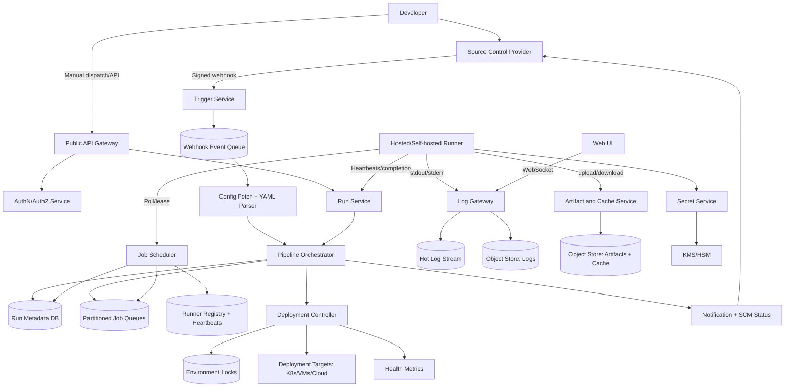

### Component responsibilities

- API Gateway handles authentication, rate limits, routing, and idempotency headers.
- Trigger Service validates SCM webhooks and persists events before acknowledgement.
- Config Service fetches YAML at the exact commit SHA and expands templates and matrices.
- Pipeline Orchestrator is the durable state machine for runs and job dependencies.
- Job Queue stores ready jobs partitioned by label group, tenant, and priority.
- Scheduler matches pending jobs to runner capacity and grants leases.
- Runner Registry tracks runner capabilities, trust level, heartbeat, and version.
- Hosted Runner Autoscaler creates ephemeral runners based on queue depth and image demand.
- Runner Agent executes job steps, streams logs, uploads artifacts, and reports completion.
- Log Gateway accepts ordered chunks, fans out live logs, and persists compressed segments.
- Artifact Service manages object-store URLs, metadata, checksums, and retention.
- Cache Service implements content-addressed dependency caches.
- Secret Service decrypts and injects secrets only for authorized jobs.
- Deployment Controller coordinates approvals, locks, rollout, health checks, and rollback.
- Notification Service updates SCM checks and sends email/chat/webhook notifications.

### Control plane vs data plane

- Control plane needs correctness for metadata, DAG state, approvals, and deployment locks.
- Data plane handles high-volume bytes such as logs, artifacts, and caches.
- Keeping bytes out of the metadata DB prevents operational coupling.
- Runners can be globally distributed while a run has one home control-plane region.
- Compromised runners cannot mutate DAG state directly; they can only report signed lease-scoped results.

## 8. Deep Dives

### 8.1 Pipeline DAG orchestration

Example pipeline:

```yaml
on:
  push:
    branches: [main]
jobs:
  build:
    runs-on: [linux, x64]
  test:
    needs: [build]
    strategy:
      matrix:
        node: [20, 22]
  scan:
    needs: [build]
  deploy:
    needs: [test, scan]
    environment: production
```

The parser expands this into concrete nodes, for example `test[node=20]` and `test[node=22]`.

The orchestrator stores the expanded DAG, not just the YAML, so retries are independent of later repository changes.

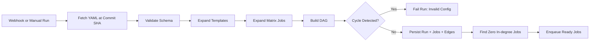

DAG rules:

- Every job has zero or more dependencies.
- A job becomes ready when all required upstream dependencies are terminal and satisfy dependency policy.
- Default dependency policy is upstream success.
- `always()` dependencies can run even if upstream failed.
- Failed required dependencies mark downstream jobs as skipped unless overridden.
- Canceled upstream jobs cancel or skip downstream jobs.
- A pipeline reaches terminal state when all jobs are terminal.

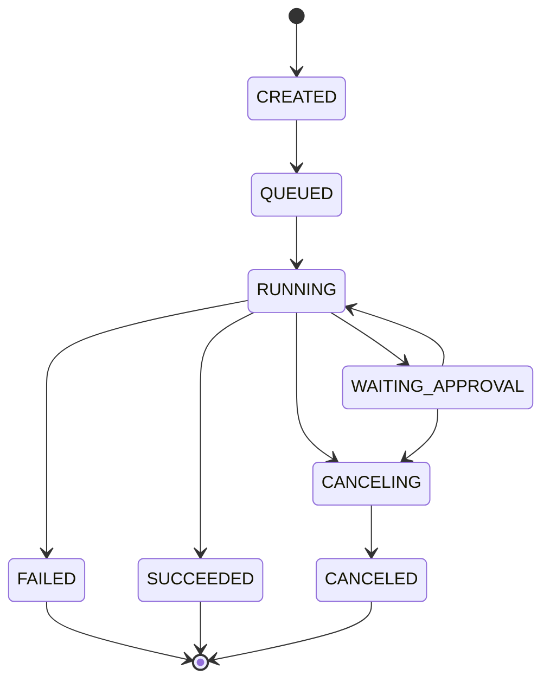

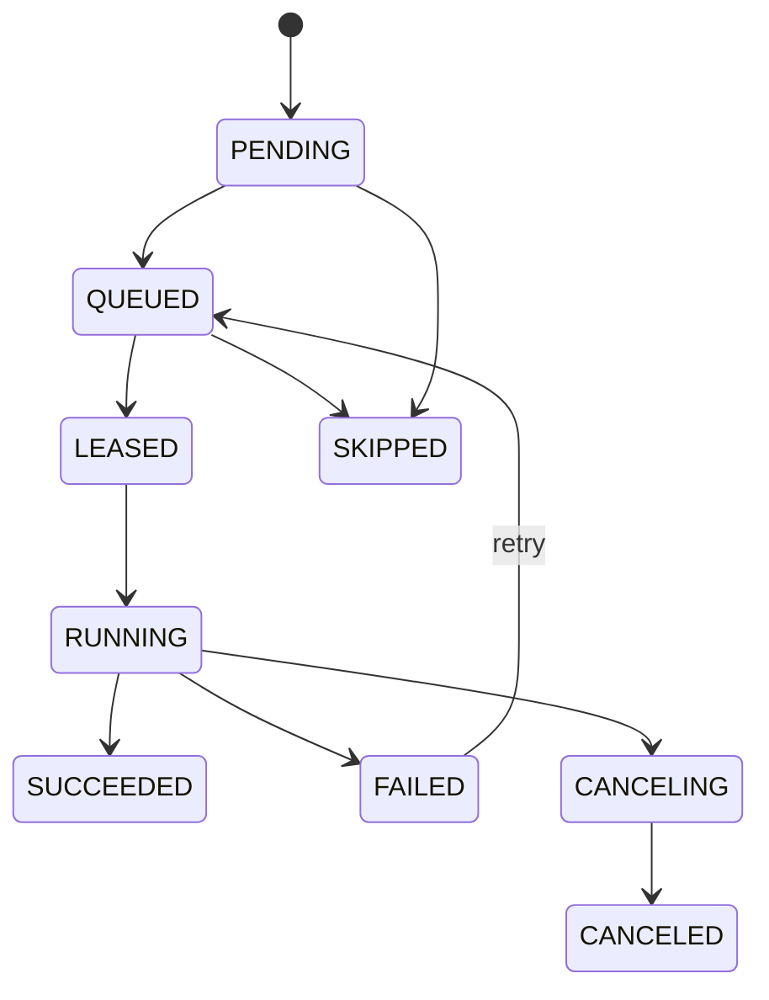

Scheduling implementation:

- Use a database transaction for terminal job state and downstream readiness.
- Use dependency counters to avoid scanning large DAGs on every completion.
- Keep the edge table for correctness, observability, and debugging.
- Publish queue messages with the outbox pattern after commit.
- Deduplicate enqueue events by job_id and attempt.
- Use optimistic concurrency on job version.
- Completion must include job_id, attempt, and lease_id.
- Stale runner completions are rejected.
- A reconciler periodically scans stuck jobs and missed outbox events.
- User cancellation marks queued jobs canceled and signals running jobs through heartbeat response.

### 8.2 Runner fleet and job scheduling

Hosted runners should be ephemeral because build jobs execute untrusted code.

A clean environment prevents cross-job contamination, cached credentials, filesystem residue, and dependency poisoning.

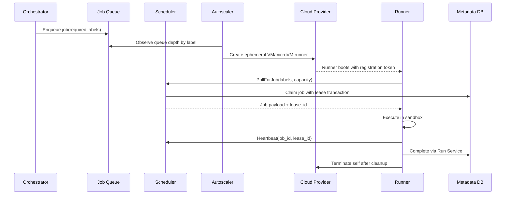

Scheduler matching inputs:

- Required labels from job YAML.
- Runner labels and version.
- Runner trust level.
- Organization and repository scope.
- Runner pool quota.
- Job priority.
- Estimated job duration.
- Current runner capacity.
- Regional constraints.
- Specialized hardware constraints.

Queue partitioning:

- Partition by coarse label class such as linux-x64, windows-x64, macos-arm64, and gpu.
- Within a partition, prioritize by organization quota and job priority.
- Use fair scheduling to avoid tenant starvation.
- Use separate queues for self-hosted runners scoped to org/repo.
- Keep deployment jobs in higher-priority queues when they unblock release windows.

Lease model:

- Runner receives a lease for one job attempt.
- Lease has a short expiry, such as five minutes.
- Runner heartbeats extend the lease every 15 seconds.
- If heartbeat stops, lease expires and job becomes retryable.
- Completion must include job_id, attempt, and lease_id.
- Stale completions from old leases are rejected.

Isolation choices:

- Ephemeral VM per job for strongest hosted isolation.
- MicroVM per job for faster boot with strong boundary.
- Container per job for trusted pools or lower-cost tiers.
- Dedicated host pools for regulated customers.
- Network namespace per job.
- No host Docker socket exposed to untrusted jobs.
- Runner binary uses signed updates.

### 8.3 Log streaming and artifact storage

Logs have two paths: live tail and durable archive.

The live path optimizes for low latency.

The archive path optimizes for cheap retention and later viewing.

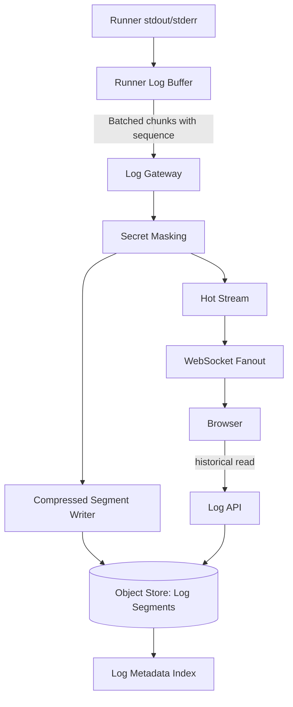

Log chunk schema:

| Field | Purpose |
|---|---|
| run_id | Parent run |
| job_id | Job stream |
| attempt | Retry attempt |
| sequence | Monotonic sequence assigned by runner |
| timestamp | Runner timestamp |
| stream | stdout or stderr |
| payload | UTF-8 bytes |
| checksum | Corruption detection |

Log handling rules:

- Runner assigns sequence numbers before sending.
- Gateway accepts idempotent retransmission of chunks.
- Browser renders by sequence and can request missing ranges.
- Object segments store sequence range metadata.
- Cross-job ordering is not guaranteed.
- Per-job and per-tenant rate limits prevent log storms.
- Excessive logs are truncated with a visible marker.
- Archive persistence is prioritized over live fanout.

Artifact flow:

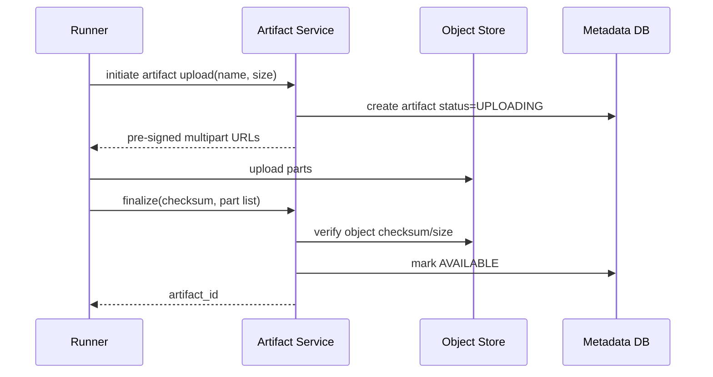

Artifact and cache rules:

- Artifacts are immutable after finalization.
- Object key includes org/repo/run/job/artifact IDs.
- Checksums are mandatory.
- Multipart upload supports large artifacts.
- Retention policy is applied at creation time.
- Downloads require authorization and short-lived URLs.
- Caches are keyed by repo, branch scope, and user-provided key.
- Cache content is addressed by content hash.
- Save is write-once for a key to avoid races.
- Cache miss must never fail the job.

### 8.4 Deployment strategies

Deployment jobs are different from build jobs because external side effects matter.

The platform front-loads approvals before rollout begins.

Once rollout starts, the deployment controller uses locks and idempotency to avoid duplicate deploys.

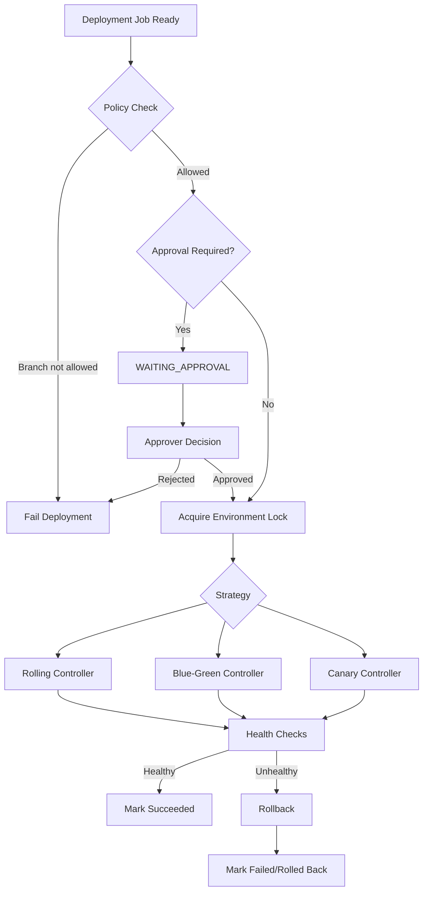

Deployment strategy details:

- Rolling replaces instances in batches and uses less extra capacity.
- Rolling is riskier when health checks are weak.
- Blue-green deploys to an inactive color and flips traffic after smoke tests.
- Blue-green gives quick rollback but needs roughly double capacity during rollout.
- Canary routes a small percentage to the target version.
- Canary gradually increases traffic if health is good.
- Canary automatically rolls back when error rate, latency, saturation, or business KPIs regress.

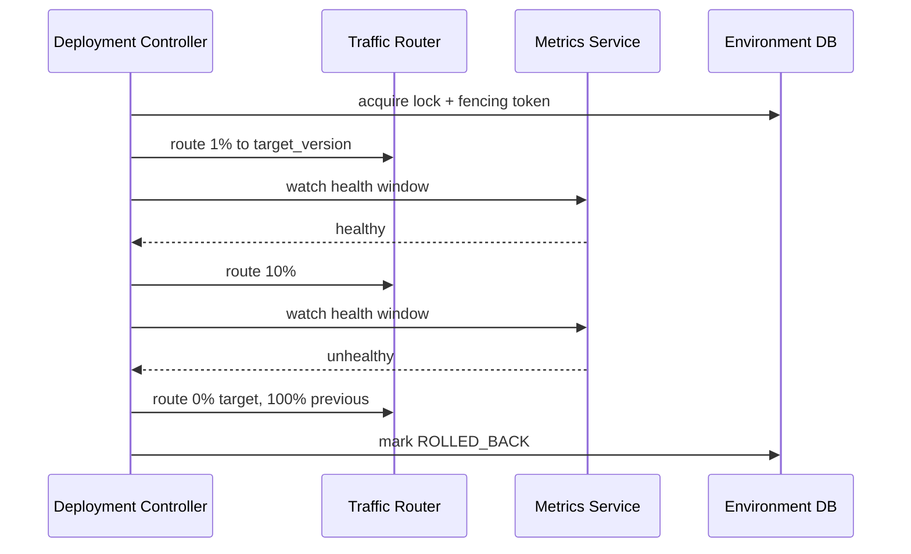

Exactly-once deployment intent:

- Store desired deployment state durably before acting.
- Serialize changes with environment locks.
- Use fencing tokens for controller leases.
- Deduplicate by deployment_id, environment_id, target_version, and idempotency key.
- Prefer declarative target systems where apply is idempotent.
- On recovery, read actual target state and reconcile.

### 8.5 Secrets and security

Secrets are high-value and must not be handled like normal variables.

Secret access should be explicit, scoped, audited, and short-lived.

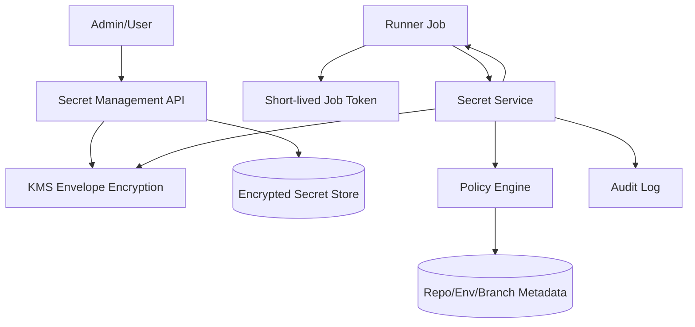

Secret injection flow:

1. Orchestrator determines which secrets a job may request.
2. Runner receives secret names, not values, in the job payload.
3. Runner calls Secret Service using a short-lived job token.
4. Secret Service validates job_id, run_id, repository, branch, event type, runner trust, and environment.
5. Secret Service decrypts using KMS.
6. Secret values are sent over TLS to the runner.
7. Runner injects secrets into environment variables or files.
8. Runner registers secret values with the log masker.
9. Audit event records secret access without value.
10. Secret memory is cleared after job completion where feasible.

Security restrictions:

- Forked pull request jobs do not receive repository secrets by default.
- Production environment secrets require approved deployment jobs.
- Self-hosted runners can be restricted from sensitive secrets.
- Secrets are not available during YAML parsing.
- Secret rotation invalidates future retrieval.
- Cloud deployments should use OIDC federation and short-lived credentials.
- Artifacts are signed and deployed by immutable digest, not mutable tag.

Threat table:

| Threat | Mitigation |
|---|---|
| Malicious PR exfiltrates secrets | No secrets for untrusted fork events; manual approval for elevated runs |
| Runner escape | Ephemeral VM/microVM isolation, patched hosts, no privileged Docker socket |
| Poisoned cache | Cache scoped by repo/branch/trust, checksum validation, write-once keys |
| Artifact tampering | Object-store immutability, checksum, signatures, provenance |
| Webhook spoofing | Signature verification and replay window |
| Compromised self-hosted runner | Scope runner access, least privilege, customer warnings, audit trail |
| Log secret leak | Masking, restricted log access, secret scanning, retention policies |

## 9. Scaling/Caching/Bottlenecks

### Scaling dimensions

- Number of repositories.
- Number of pipeline runs per day.
- Number of jobs per run.
- Job duration.
- Runner boot time.
- Log volume per job.
- Number of live log viewers.
- Artifact size.
- Runner image diversity.
- Deployment environment count.

### Horizontal scaling approach

- API servers are stateless behind load balancers.
- Trigger workers scale by webhook event queue depth.
- Config parsers scale by run creation backlog.
- Orchestrators scale by run_id partition ownership.
- Schedulers scale by queue partition and runner pool.
- Log gateways scale by ingest bandwidth and WebSocket connections.
- Artifact service scales by metadata QPS while bytes go directly to object storage.
- Deployment controllers scale by environment partition but serialize per environment.

### Partitioning strategy

| Component | Partition key | Reason |
|---|---|---|
| Run metadata | repo_id or run_id hash | Balance and locality |
| Job queues | label class + priority + tenant | Matching and fairness |
| Log streams | job_id hash | Ordered per job |
| Artifact metadata | run_id or repo_id | Common query patterns |
| Cache metadata | repo_id + cache_key | Scoped lookup |
| Runner registry | runner_pool_id | Pool-level scheduling |
| Deployment locks | environment_id | Serialize target changes |
| Audit events | org_id + time | Compliance queries |

### Caching layers

- Pipeline YAML validation cache keyed by repo, path, commit_sha, and config_hash.
- Reusable template cache keyed by template version.
- Runner image cache in warm pools.
- Dependency cache restored by jobs.
- Artifact CDN cache for public or broadly accessed artifacts.
- SCM metadata cache for branch/ref lookups.
- Permission cache for UI reads with short TTL.

### Cache invalidation

- Pipeline config cache is immutable per commit SHA.
- Template cache invalidates by template version.
- Runner image cache invalidates by image digest, not tag.
- Dependency cache entries are immutable and evicted by LRU/quota.
- Permission cache invalidates on membership changes or short TTL expiry.
- Artifact CDN cache expires when artifact retention deletes metadata.

### Bottleneck: runner cold start

- VM startup may take 30-120 seconds.
- Users perceive this as slow CI feedback.
- Maintain warm pools for common images.
- Predict capacity from historical repository schedules.
- Pre-pull popular container images.
- Use microVMs or containers where isolation allows.

### Bottleneck: monorepo fan-out

- One commit can expand into thousands of jobs.
- It can starve smaller repositories.
- Enforce per-repository concurrency limits.
- Use organization quota and fair scheduling.
- Cap matrix expansion.
- Use path filters to skip irrelevant jobs.
- Provide cancel-in-progress for superseded commits.

### Bottleneck: log storms

- A failed command can print gigabytes of logs.
- Live fanout can overload gateways and browsers.
- Apply per-job log size limits.
- Apply per-second log rate limits.
- Compress chunks and segments.
- Use browser virtualized rendering.
- Fall back to archive-first mode when WebSocket fanout is degraded.

### Bottleneck: artifact hot downloads

- Popular release artifacts can generate high egress.
- Serve through CDN when authorization permits.
- Use regional object-store replication for hot artifacts.
- Require range downloads for large files.
- Generate pre-signed URLs instead of proxying bytes through API servers.

### Backpressure strategy

- Reject or delay low-priority runs when tenant quota is exhausted.
- Put runs in QUEUED rather than failing under temporary runner shortage.
- Apply queue TTL for obsolete commits when superseded by newer commits.
- Let repositories configure cancel-in-progress for the same branch.
- Shed live log viewers before dropping log persistence.
- Prefer delaying cache saves over blocking job completion.

## 10. Reliability & Consistency

### Reliability principles

- Durable state before side effects.
- At-least-once execution for build/test jobs.
- Idempotent completion and deployment APIs.
- Short leases for runners and controllers.
- Reconciliation loops for missed events.
- Outbox pattern for publishing after database commits.
- Separate critical metadata path from best-effort notification path.

### Failure scenarios

| Failure | Detection | Recovery |
|---|---|---|
| Trigger worker crashes | Queue visibility timeout | Event is retried |
| Orchestrator crashes | Health check and lease loss | Another orchestrator resumes from DB |
| Queue message duplicated | Job status check | Duplicate ignored |
| Queue message lost | Reconciler scans QUEUED jobs | Re-enqueue |
| Runner crashes | Heartbeat timeout | Lease expires, job requeued |
| Runner completes after lease expiry | Lease mismatch | Stale completion rejected |
| Log gateway unavailable | Runner retries buffered chunks | Fallback to alternate gateway |
| Object store upload fails | Runner retry/multipart resume | Job fails after retry budget |
| Secret service unavailable | Job waits/retries | Job fails closed |
| Deployment controller crashes | Controller lease timeout | New controller reconciles target state |
| SCM status update fails | Retry with backoff | User still sees platform state |

### Job retry semantics

- Automatic retry can be configured for infrastructure failures.
- User script failures are not retried by default unless configured.
- Retry creates a new attempt for the same logical job.
- Downstream jobs depend on the latest successful required attempt.
- Artifacts are scoped by job attempt.
- Logs are scoped by job attempt.
- Cache writes from failed attempts can be disabled to avoid poisoning.

### Runner crash and rescheduling

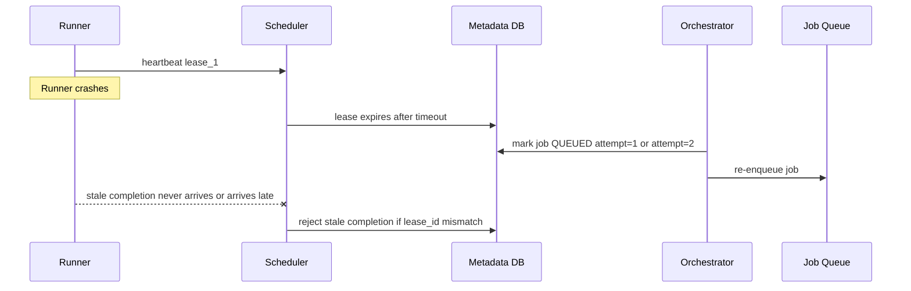

### Exactly-once versus at-least-once

Build/test jobs:

- Platform provides at-least-once execution.
- Duplicate execution is acceptable if scripts are idempotent.
- Artifacts and logs are attempt-scoped.
- Cache saves are write-once and content-addressed.

Deployment jobs:

- Platform provides exactly-once deployment intent per environment and target version.
- Environment locks serialize rollout.
- Idempotency keys deduplicate external operations.
- Controller reconciles desired state with actual target state.
- Fencing tokens prevent stale controllers from writing after lease loss.

### Consistency model by subsystem

| Subsystem | Consistency | Reason |
|---|---|---|
| Run/job metadata | Strong per run | Correct DAG transitions |
| Pending queues | At-least-once | Throughput and retry |
| Runner registry | Eventual with leases | Liveness is time-based |
| Logs | Ordered per job, eventual persistence | Live streaming can tolerate delay |
| Artifacts | Read-after-finalize | Consumers need stable downloads |
| Caches | Eventual and best-effort | Cache miss is safe |
| Secrets | Strong policy check | Security-sensitive |
| Deployment locks | Strong | Avoid conflicting rollouts |
| Notifications | Eventual | External systems can lag |

### Multi-region strategy

- A given run has one home region to avoid cross-region DAG coordination.
- Run control plane can be active-active by organization or repository shard.
- Metadata DB uses regional primary with cross-region replicas.
- Object storage uses multi-region replication for logs, artifacts, and audit data.
- Runners prefer the run home region for lower log latency.
- Deployment controller runs near target environment when possible.
- DR can fail organization shards to another region with RPO minutes and RTO under one hour.

### Data retention and cleanup

- Logs retained by repository policy, default 90 days.
- Artifacts retained by policy, default 30 days.
- Audit logs retained longer, such as 1-7 years for enterprise.
- Caches evicted by quota and LRU.
- Runner temporary disks destroyed after job.
- Secret access tokens expire within minutes.
- Completed run metadata can be compacted after long retention.

## 11. Trade-offs & Alternatives

| Decision | Option A | Option B | Choice | Rationale |
|---|---|---|---|---|
| Runner model | Self-hosted persistent runners | Hosted ephemeral autoscaled runners | Hosted ephemeral default, self-hosted optional | Ephemeral is safer for untrusted code; self-hosted supports private networks/custom hardware |
| SCM trigger | Push webhooks | Poll SCM | Webhooks primary, polling fallback | Webhooks are low-latency and efficient; polling recovers missed events |
| Orchestration | Central control-plane orchestrator | Distributed runner-driven orchestration | Control-plane orchestrator | DAG correctness, approvals, and retries are easier with durable central state |
| Queue semantics | Exactly-once queue | At-least-once queue with idempotency | At-least-once | Simpler and scalable; job leasing handles duplicates |
| Runner isolation | Container per job | VM/microVM per job | VM/microVM for hosted untrusted, container for trusted pools | Stronger tenant isolation justifies overhead |
| Logs | Store in relational DB | Store in object storage with stream buffer | Object storage | Logs are large append blobs; DB is too expensive |
| Artifacts | Proxy bytes through API | Pre-signed object-store URLs | Pre-signed URLs | Keeps API stateless and reduces bandwidth cost |
| Cache keys | Mutable cache objects | Immutable content-addressed cache | Immutable content-addressed | Prevents corruption and enables dedup |
| Deployment safety | Rolling only | Rolling, blue-green, canary | Support all three | Different services optimize for speed, cost, or safety |
| Blue-green vs canary | Instant switch with spare capacity | Gradual traffic ramp | Both | Blue-green is fast rollback; canary reduces blast radius |
| Environment lock | No lock, rely on scripts | Strong per-environment lock | Strong lock | Prevents conflicting production rollouts |
| Secret delivery | Store secrets in job payload | Fetch secrets just-in-time | Just-in-time fetch | Better auditing and smaller exposure window |
| Monorepo support | Unlimited expansion | Quotas and path filters | Quotas and filters | Prevents runaway fan-out and tenant starvation |
| Metadata DB | NoSQL eventual store | Relational/strongly consistent store | Strong metadata store | DAG and deployment state need transactions |
| Pipeline config | UI-defined pipelines | Pipeline-as-code YAML | YAML primary, UI helpers optional | Versioned with code and reviewable |

### Rejected alternatives

- Running all hosted jobs on long-lived shared workers was rejected due to security and reproducibility risk.
- Storing logs in Kafka forever was rejected because Kafka is expensive for long retention.
- Having runners directly unlock downstream jobs was rejected because compromised runners could corrupt orchestration state.
- Passing cloud provider static credentials into jobs was rejected in favor of short-lived OIDC tokens.
- Holding environment locks while waiting for human approvals was rejected because it blocks unrelated safe deployments.

## 12. Future Improvements

- Predictive runner autoscaling based on repository history and known release windows.
- Dynamic test selection using changed files and historical coverage.
- Flaky test quarantine and automatic retry classification.
- Native distributed test sharding service.
- Policy-as-code for organization-wide deployment controls.
- Signed and reproducible runner images.
- Stronger SLSA provenance integration.
- Built-in software bill of materials generation.
- Cross-repository dependency graph for coordinated releases.
- Preview environments for pull requests.
- Cost dashboards by repository, branch, workflow, and team.
- Carbon-aware runner scheduling.
- Fine-grained network sandbox policies per job.
- Confidential computing runners for sensitive builds.
- Improved log search with indexing and query language.
- Artifact promotion across environments without rebuild.
- Regional artifact mirrors for faster downloads.
- First-class Kubernetes progressive delivery integration.
- Automated rollback using business metrics and anomaly detection.
- Safer self-hosted runner posture scoring.
- AI-assisted pipeline optimization suggestions.
