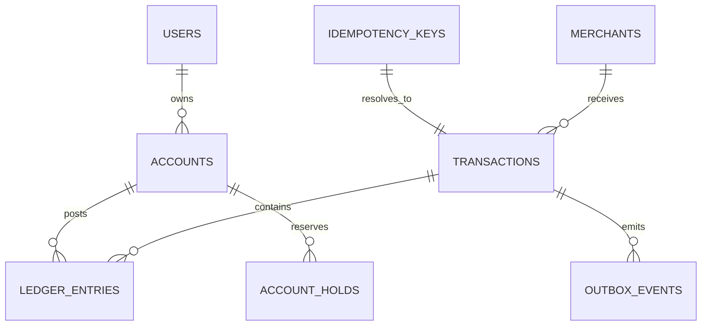
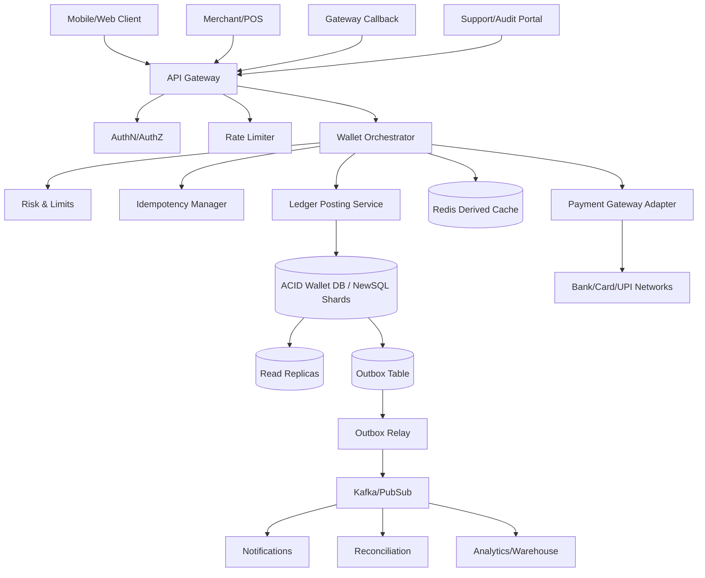
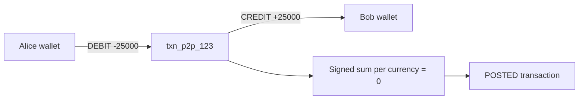
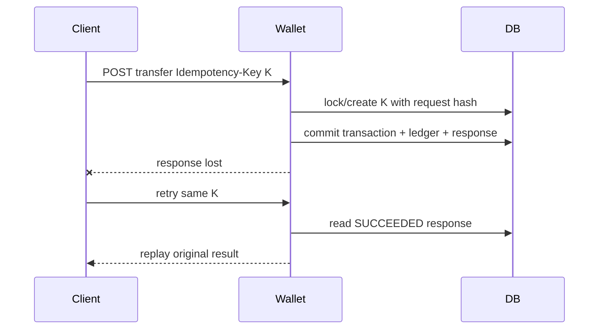
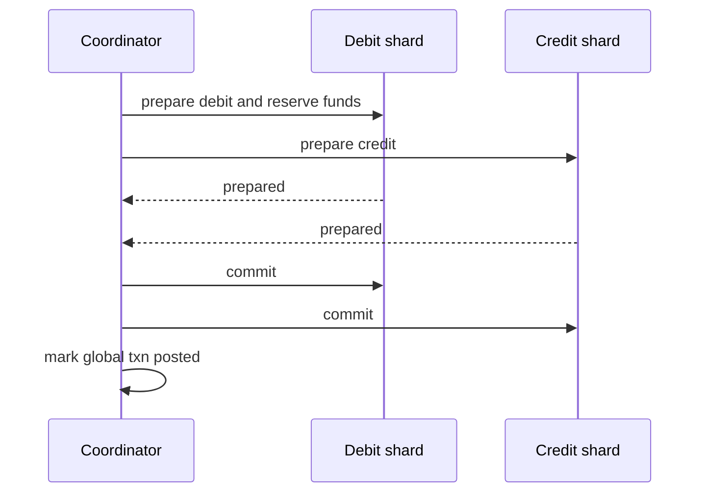
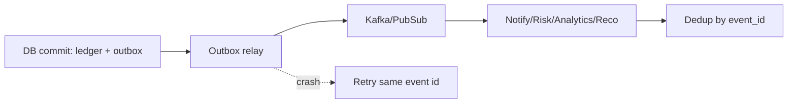

# Digital Wallet — High-Level Design

> SDE2-style HLD for a Paytm/PayPal-like stored-value wallet: hold balance, top up, P2P transfer, pay merchants, refund, audit, and reconcile money movement.

## 1. Problem Statement & Scope

Build a digital wallet where users keep an internal monetary balance and can move funds to other users or merchants. The system must be correct before it is clever: every debit and credit is durably recorded, balanced, idempotent, and auditable. The design chooses strong consistency for balances, a double-entry ledger as source of truth, cached balances only as projections, and asynchronous events only after the ACID commit.

### In scope
- Wallet account per user and currency.
- Add money/top-up from external payment instruments after trusted confirmation.
- P2P transfers between wallet accounts.
- Merchant payments and merchant refunds.
- Transaction history with cursor pagination.
- Double-entry append-only ledger and audit trail.
- Idempotent write APIs and duplicate gateway callback handling.
- Reconciliation across ledger, cached balances, gateway files, and settlement accounts.
- Outbox event publication for notifications, analytics, risk, and statements.
- Admin/support read-only audit tooling plus controlled adjustment workflows.

### Out of scope
- Full KYC/AML onboarding UI; we integrate with identity/risk services.
- PCI storage, card vaulting, and acquiring network details.
- FX conversion and international remittance in v1.
- Offline serverless spend authorization.
- Loans, interest, BNPL, and rewards accounting beyond extension points.
- Merchant payout rail implementation; we model payable and settlement ledgers.

### Core invariants
- For each transaction and currency, sum of signed ledger entries is exactly zero.
- No user account may have negative available balance.
- Ledger entries are append-only; fixes use reversal/adjustment entries.
- A retry with the same idempotency key never posts a second transaction.
- Balance shown for spending decisions comes from the primary/leader or a version-safe projection.
- All money amounts are integer minor units, never floating point.
- Every transaction state transition is durable, monotonic, and attributable.

## 2. Functional Requirements

### P0 requirements
- Create and activate wallet accounts after eligibility checks.
- Return balance by account with available, held, currency, and version fields.
- Initiate top-up and credit wallet only after gateway success is verified.
- Transfer funds from one user wallet to another atomically.
- Pay registered merchants from a user wallet atomically.
- Refund merchant payments, including partial refunds, with reference to original transaction.
- List transaction history sorted by stable sequence/time cursor.
- Expose transaction status lookup by transaction ID and idempotency key.
- Reject insufficient funds under concurrency.
- Persist audit metadata: actor, request hash, source IP/device, timestamps, and reason.

### P1 requirements
- Holds/reservations for pending cross-shard transfers and risk review.
- Daily/monthly velocity limits by account, user tier, merchant, and channel.
- Gateway callback deduplication by external reference.
- Statement export and older history search.
- Admin investigation view for transaction, ledger entries, idempotency state, and events.
- Merchant settlement ledger and payout-ready balances.
- Risk step-up hooks before high-value transfers.
- Operational replay tooling for account balance reconstruction.

### P2 requirements
- Multi-currency wallets and FX quote locking.
- Scheduled transfers and recurring merchant mandates.
- Cashback/rewards as separate liability ledgers.
- Wallet-to-bank withdrawals.
- Graph-based fraud detection and AML reports.
- Cryptographic ledger sealing for tamper evidence.

### Key flows
| Flow | Happy path | Correctness note |
|---|---|---|
| Top-up | Create pending txn, call gateway, post credit after signed success | Unique gateway ref prevents duplicate credits |
| P2P | Lock two accounts, debit payer, credit payee, commit ledger | Both sides commit or none do |
| Merchant pay | Debit user and credit merchant payable/clearing | Merchant hot account can be sharded |
| Refund | Create new refund txn and reverse direction entries | Cumulative refund <= original amount |
| History | Read transaction summaries by account cursor | Ledger remains accounting source |
| Adjustment | Approved ops transaction posts explicit entries | Never mutate old ledger rows |

## 3. Non-Functional Requirements

| Category | Target |
|---|---|
| Balance read latency | p50 <= 30 ms, p99 <= 150 ms in primary region |
| Transfer latency | p50 <= 80 ms, p99 <= 300 ms excluding external risk challenges |
| History latency | p50 <= 100 ms, p99 <= 500 ms for recent pages |
| Write availability | 99.95% for core wallet writes with controlled failover |
| Durability | Ledger retained 7-10 years with RF=3 and backups |
| Consistency | Strong for balance-changing operations; eventual only for projections/events |
| Security | Authenticated, authorized, encrypted, rate-limited, and signed callbacks |
| Auditability | Every monetary change reconstructable from immutable ledger entries |

### Detailed NFR notes
- Use ACID transactions for account row, transaction row, ledger rows, idempotency row, and outbox row.
- Use row-level locks or serializable transactions to prevent lost updates.
- Do not call external services while holding DB money locks.
- Expose deterministic terminal failures for invalid amount, unauthorized account, and insufficient funds.
- Separate business failures from system failures in metrics.
- Encrypt data at rest and in transit; avoid logging PII or payment instrument secrets.
- Backups must support point-in-time recovery and regular restore drills.
- Reconciliation mismatches page immediately and freeze affected accounts when needed.
- Read replicas may serve old history but not spend authorization.
- All services propagate trace IDs and transaction IDs.

## 4. Back-of-the-Envelope Estimation

Conventions: 1 day ≈ 86,400 s ≈ 10^5 s, peak ≈ 3× average, storage replication factor = 3.

| Input | Assumption | Rationale |
|---|---|---|
| Registered users | 100M | Country-scale wallet |
| MAU | 50M | Half of registered users monthly active |
| DAU | 20M | Habitual payment product |
| Transactions/day | 20M | P2P + merchant + top-up + refund |
| Balance reads/day | 200M | Users check balance frequently |
| History reads/day | 40M | Receipts and statements |
| Ledger entries/txn | 2.2 avg | Two normal entries plus some fee/refund/cashback entries |
| Transaction row | 1 KB | Status, refs, metadata |
| Ledger row | 350 B | Entry fields before heavy index overhead |
| Index/MVCC overhead | 1.5× | B-trees and versions |
| RF | 3 | Durability convention |

| Workload | Daily volume | Arithmetic | Average | Peak 3× |
|---|---|---|---|---|
| Wallet writes | 20M/day | 20,000,000 / 100,000 | 200 TPS | 600 TPS |
| Balance reads | 200M/day | 200,000,000 / 100,000 | 2,000 QPS | 6,000 QPS |
| History reads | 40M/day | 40,000,000 / 100,000 | 400 QPS | 1,200 QPS |
| Idempotency lookups | 20M/day | 1 per mutation | 200 QPS | 600 QPS |
| Outbox events | 20M/day | ~1 per txn | 200 EPS | 600 EPS |
| Gateway callbacks | 5M/day | 5,000,000 / 100,000 | 50 QPS | 150 QPS |

| Transaction type | Share | Arithmetic | Count/day |
|---|---|---|---|
| Merchant payments | 55% | 20M × 0.55 | 11.0M |
| P2P transfers | 25% | 20M × 0.25 | 5.0M |
| Top-ups | 15% | 20M × 0.15 | 3.0M |
| Refunds/reversals | 5% | 20M × 0.05 | 1.0M |

| Storage quantity | Arithmetic | Result |
|---|---|---|
| Transactions/year | 20M × 365 | 7.3B rows/year |
| Ledger entries/year | 7.3B × 2.2 | 16.06B rows/year |
| Transaction raw/year | 7.3B × 1 KB | 7.3 TB/year |
| Ledger raw/year | 16.06B × 350 B | 5.62 TB/year |
| Raw source/year | 7.3 + 5.62 | 12.92 TB/year |
| With overhead | 12.92 × 1.5 | 19.38 TB/year |
| With RF=3 | 19.38 × 3 | 58.14 TB/year |
| 10-year retention | 58.14 × 10 | 581.4 TB |

| Capacity area | Arithmetic / heuristic | Estimate |
|---|---|---|
| Accounts | 100M × ~1 KB effective | ~100 GB raw, ~300 GB RF=3 |
| Hot balance cache | 20M DAU × 100 B payload × overhead | ~6 GB replicated payload; provision 50+ GB |
| API servers | 7.8K peak mixed QPS ÷ 500-1000 req/s/node | 15-25 nodes/region |
| DB shards | Keep shard <= 2-4 TB and <=100-200 write TPS | 16-32 primary shards initially |
| Read replicas | History/balance reads dominate writes | 2-3 replicas/shard |
| Outbox brokers | 600 peak EPS small messages with margin | 3+ Kafka brokers |

### Write amplification per P2P transaction
- 1 idempotency row lock/read.
- 2 account rows locked.
- 1 transaction row inserted.
- 2 ledger rows inserted.
- 2 account balance/version updates.
- 1 outbox row inserted.
- 1 idempotency response update.
- At 600 peak TPS this is roughly 4,200 logical row writes/s before indexes and replication.

## 5. API Design

### API principles
- REST externally; gRPC internally is acceptable.
- Every mutation requires `Idempotency-Key`.
- Amounts are integer minor units with ISO currency.
- A client timeout is unknown outcome; retry same key or query status.
- Responses include transaction ID, status, and version when balance changes.

### Create account
```http
POST /v1/wallet/accounts
Authorization: Bearer <token>
Idempotency-Key: <client-generated-uuid>
Content-Type: application/json

{ "user_id":"u_123", "currency":"INR" }
```
Response:
```json
{ "account_id":"acct_789", "status":"ACTIVE", "available_balance":0 }
```

### Get balance
```http
GET /v1/wallet/accounts/{account_id}/balance
Authorization: Bearer <token>
```
Response:
```json
{ "account_id":"acct_789", "available_balance":125000, "held_balance":0, "balance_version":43891 }
```

### P2P transfer
```http
POST /v1/wallet/transfers
Authorization: Bearer <token>
Idempotency-Key: <client-generated-uuid>
Content-Type: application/json

{ "from_account_id":"acct_a", "to_account_id":"acct_b", "amount":25000, "currency":"INR" }
```
Response:
```json
{ "transaction_id":"txn_p2p_123", "status":"POSTED" }
```

### Merchant payment
```http
POST /v1/wallet/merchant-payments
Authorization: Bearer <token>
Idempotency-Key: <client-generated-uuid>
Content-Type: application/json

{ "payer_account_id":"acct_a", "merchant_id":"m_7", "order_id":"o_9", "amount":120000, "currency":"INR" }
```
Response:
```json
{ "transaction_id":"txn_pay_555", "status":"POSTED", "receipt_id":"rcpt_555" }
```

### Refund
```http
POST /v1/wallet/refunds
Authorization: Bearer <token>
Idempotency-Key: <client-generated-uuid>
Content-Type: application/json

{ "original_transaction_id":"txn_pay_555", "amount":30000, "reason":"PARTIAL_RETURN" }
```
Response:
```json
{ "transaction_id":"txn_ref_1", "status":"POSTED" }
```

### History
```http
GET /v1/wallet/accounts/{account_id}/transactions?limit=20&cursor=...
Authorization: Bearer <token>
```
Response:
```json
{ "items":[...], "next_cursor":"..." }
```

| HTTP | Code | Meaning | Retry |
|---|---|---|---|
| 400 | INVALID_AMOUNT | Bad amount/currency | Do not retry unchanged |
| 401/403 | UNAUTHORIZED | Caller cannot use account | Do not retry |
| 409 | INSUFFICIENT_FUNDS | Debit rejected under lock | Retry only after balance changes |
| 409 | IDEMPOTENCY_CONFLICT | Same key, different payload | Use original payload or new key for new operation |
| 423 | ACCOUNT_LOCKED | Risk/compliance lock | Retry after resolution |
| 429 | RATE_LIMITED | Velocity or API limit | Backoff |
| 500/503 | UNKNOWN_OR_UNAVAILABLE | Outcome may be unknown | Retry same idempotency key |

## 6. Data Model & Schema

- Primary store: ACID RDBMS or NewSQL (PostgreSQL shards, CockroachDB, Spanner).
- Reason: transactions, locks, unique constraints, indexes, backups, auditability.
- Redis is a derived cache only, never source of truth.
- Kafka/PubSub carries committed outbox events, not pre-commit money commands.
- Warehouse/search projections support analytics and support search.



### `accounts`
- account_id PK
- user_id, account_type, currency
- available_balance BIGINT CHECK >= 0
- held_balance BIGINT CHECK >= 0
- balance_version BIGINT
- status ACTIVE/BLOCKED/CLOSED
- shard_key, created_at, updated_at
- UNIQUE(user_id,currency,account_type)
- INDEX(user_id,currency)
- INDEX(shard_key)

### `transactions`
- transaction_id PK
- transaction_type TOPUP/P2P/MERCHANT_PAYMENT/REFUND/REVERSAL
- status INITIATED/PENDING/POSTED/FAILED/REVERSED
- amount BIGINT CHECK > 0, currency
- payer_account_id, payee_account_id, merchant_id
- original_transaction_id for refunds/reversals
- external_reference_id for gateway dedupe
- idempotency_key, request_hash
- metadata_json, created_at, posted_at
- INDEX(account_id,created_at DESC)
- UNIQUE(idempotency_key) where scoped appropriately

### `ledger_entries`
- ledger_entry_id PK
- transaction_id FK
- account_id FK
- direction DEBIT/CREDIT
- amount BIGINT CHECK > 0
- signed_amount: credit positive, debit negative
- entry_type PRINCIPAL/FEE/TAX/CASHBACK/REVERSAL
- account_balance_after
- sequence_no per account
- created_at, created_by_service
- INDEX(account_id,sequence_no DESC)
- INDEX(transaction_id)

### `idempotency_keys`
- PRIMARY KEY(scope,idempotency_key)
- request_hash
- status IN_PROGRESS/SUCCEEDED/FAILED_RETRYABLE/FAILED_FINAL
- transaction_id
- response_json
- locked_until
- expires_at
- INDEX(expires_at)

### `outbox_events`
- outbox_id PK
- aggregate_type, aggregate_id
- event_type
- payload_json
- status PENDING/PUBLISHED/FAILED
- attempts
- created_at, published_at
- INDEX(status,created_at)

### `account_holds`
- hold_id PK
- account_id
- transaction_id
- amount, currency
- status ACTIVE/CAPTURED/RELEASED/EXPIRED
- expires_at
- INDEX(account_id,status)

| Table | Partitioning | Why |
|---|---|---|
| accounts | hash(account_id/user_id) | Account-centric mutations |
| ledger_entries | account shard + time partitions | History and reconciliation |
| transactions | payer account shard + global ID | Authorization starts from payer |
| idempotency_keys | scope hash | Retry lookup colocates with owner |
| outbox_events | source shard | Commit-local event relay |
| history projections | account_id | Cursor pages by account |

## 7. High-Level Architecture



| Component | Responsibility |
|---|---|
| API Gateway | TLS, auth forwarding, request limits, trace ID |
| Wallet Orchestrator | Use-case flow for top-up, transfer, payment, refund, history |
| Risk & Limits | Velocity, eligibility, device trust, step-up decisions |
| Idempotency Manager | Request hash validation and response replay |
| Ledger Posting | Double-entry construction and ACID commit |
| Wallet DB | Source of truth for accounts, ledger, txns, idempotency, outbox |
| Redis | Fast balance/recent-history projection |
| Outbox Relay | Reliable event publication after commit |
| Reconciliation | Continuous invariant and external file checks |
| Gateway Adapter | External payment protocol isolation |

### Write path
- Authenticate and authorize account ownership.
- Validate amount, currency, user/merchant status, and limits.
- Create or lock idempotency key.
- Lock involved account rows in deterministic order.
- Validate available funds under lock.
- Insert transaction and balanced ledger entries.
- Update cached balance columns and versions.
- Insert outbox event and idempotency response.
- Commit; then update/invalidate Redis and publish outbox asynchronously.

### Read path
- Balance uses Redis if version-safe; strong mode falls back to primary.
- Recent history uses account transaction index/projection.
- Older history and statements use replicas or warehouse projections.
- Admin/audit can drill from transaction to immutable ledger entries.

## 8. Deep Dives

### Deep dive A. Double-entry ledger
- Every business movement has debit and credit entries.
- Signed amounts for a transaction sum to zero per currency.
- Balance can be derived as SUM(signed_amount) for an account.
- Cached balance is a projection updated in the same ACID transaction.
- Corrections are reversals, not UPDATE/DELETE.
- Fees, taxes, cashback, and settlement use internal system accounts.

### Deep dive B. ACID and concurrency
- Transfer locks payer and payee accounts in sorted order.
- Lost update is prevented because concurrent debits serialize on the payer row.
- Insufficient funds check runs after acquiring the lock.
- External calls never occur inside the lock-holding DB transaction.
- Serializable isolation is ideal; row locks plus constraints are practical.
- Deadlocks are avoided by deterministic lock ordering and short transactions.

### Deep dive C. Idempotency
- Client supplies key for every mutation.
- Server stores request hash and terminal response.
- Same key and same hash returns original response.
- Same key and different hash returns conflict.
- Gateway callbacks dedupe on external reference.
- Retention is 24-72h for user APIs and longer for gateway references.

### Deep dive D. Strong consistency
- Wallet balances are CP, not AP.
- A partition returns unavailable rather than guessing spendable balance.
- Leader/primary per account shard accepts writes.
- Read-your-writes uses primary or version-aware cache.
- History and notifications may lag because they do not authorize spend.
- Eventual consistency for balances can double-spend and is rejected.

### Deep dive E. Sharding money
- Shard by account/user to colocate hot account data.
- Cross-shard transfer uses NewSQL distributed txn, 2PC, or saga with reservations.
- 2PC writes durable prepare records and recovery completes decisions.
- Saga exposes pending state and releases/captures holds.
- High-volume merchants use sharded clearing accounts.
- Reconciliation closes any stuck prepared or pending states.



```mermaid
sequenceDiagram
    participant T1 as Transfer 1
    participant DB as DB account row
    participant T2 as Transfer 2
    T1->>DB: SELECT payer FOR UPDATE
    T2->>DB: waits on same row
    T1->>DB: validate funds, insert ledger, update balance, commit
    DB-->>T2: lock acquired with new balance
    T2->>DB: validate latest funds; approve or reject
```





| Scenario | Debit | Credit | Balanced |
|---|---|---|---|
| Top-up | Gateway clearing -50000 | User wallet +50000 | Yes |
| P2P | Alice -25000 | Bob +25000 | Yes |
| Merchant pay | User -120000 | Merchant payable +120000 | Yes |
| Fee | Merchant payable -2000 | Platform fee revenue +2000 | Yes |
| Refund | Merchant payable -30000 | User wallet +30000 | Yes |
| Cashback | Marketing expense -500 | User wallet +500 | Yes |

## 9. Scaling/Caching/Bottlenecks

### Scaling strategy
- Scale reads first with replicas, Redis, and history projections.
- Partition ledger by account shard and time.
- Keep secondary indexes minimal on append-heavy ledger tables.
- Use account-home routing so all debits for an account hit one leader.
- Use UUIDv7/ULID/Snowflake IDs for global uniqueness and cursor locality.
- Archive cold partitions to cheaper immutable storage while retaining audit access.
- Use admission control when DB lock wait or replication lag grows.
- Run reconciliation from snapshots/replicas to avoid OLTP interference.

| Cache | Key | Value | Invalidation | Source of truth |
|---|---|---|---|---|
| Balance | balance:{account_id} | available, held, version | write-through/delete after commit | No |
| Recent history | history:{account_id} | last 20-50 summaries | append after commit + TTL | No |
| Account metadata | acctmeta:{id} | status/currency/tier | TTL + event | No |
| Idempotency hot | idem:{scope}:{key} | terminal response pointer | TTL; DB authoritative | No |
| Risk counters | limits:{user} | velocity snapshot | short TTL/stream update | Mixed; hard limits in DB |

### Bottlenecks and mitigations
- Payer row lock contention: serialize by account and keep transaction short.
- Merchant hot credit row: use merchant clearing sub-accounts per shard/terminal.
- Ledger index bloat: partition and avoid unnecessary secondary indexes.
- Cross-shard tail latency: prefer account colocation and reserve distributed txns for required paths.
- Outbox lag: scale relay workers and monitor oldest pending row age.
- Gateway callback bursts: idempotent queueing and backpressure.
- History scans: cursor pagination over indexed summaries, never OFFSET over large tables.
- Cache stampede: singleflight refresh and short negative-cache TTLs.
- Shard skew: virtual shards and online split/rebalance.
- Reconciliation cost: incremental checkpoints per account/shard.

## 10. Reliability & Consistency

### Outbox and event reliability


| Failure | Risk | Mitigation |
|---|---|---|
| Client timeout after commit | Duplicate retry | Replay response by idempotency key |
| Crash mid-transaction | Partial money movement | DB rollback |
| Crash after commit before response | Unknown outcome | Stored idempotent response/status lookup |
| DB leader failure | Split brain/downtime | Consensus failover; one leader |
| Gateway duplicate callback | Double top-up | Unique external reference |
| Outbox relay crash | Missing notification | Pending row retry |
| 2PC coordinator crash | Prepared funds stuck | Durable journal and recovery worker |
| Reconciliation mismatch | Possible corruption | Freeze, page, investigate, adjustment txn |
| Cache stale | Wrong display | Versioned entries and DB fallback |
| Deadlock | Failed transfer | Deterministic locking and safe retry |

### Reconciliation checks
- Per transaction: SUM(signed_amount)=0 by currency.
- Per account: cached available+held equals ledger-derived balance at checkpoint.
- Per gateway ref: success amount/currency equals top-up ledger entry.
- Per merchant settlement: payable ledger equals payout minus fees/refunds.
- Per outbox: every posted transaction has an eventually published event.
- Per shard: no negative balances except approved system accounts.
- Per hold: expired holds are released and captured holds have posted debit entries.
- Per idempotency key: terminal succeeded keys map to exactly one transaction.

### DR and consistency boundaries
- Synchronous replication inside primary region/zone set.
- Continuous WAL/binlog archive for point-in-time recovery.
- Cross-region replica is async unless using multi-region NewSQL consensus.
- Failover runbook must prevent two primaries for same account shard.
- RPO near zero in primary consensus group; cross-region RPO depends on lag.
- Debit authorization is strongly consistent; notifications and analytics are eventual.
- Balance display is strong after write or explicitly marked as possibly stale.
- History projections can lag because ledger remains authoritative.

## 11. Trade-offs & Alternatives

| Decision | Option A | Option B | Choice | Why |
|---|---|---|---|---|
| Balance source | Mutable balance only | Double-entry ledger + cache | Ledger + cache | Audit and conservation with fast reads |
| Balance read | Always SUM ledger | Cached account balance | Cached + reconcile | SUM over billions is too slow |
| Database | Single ACID DB | Sharded/NewSQL | Start single, evolve | Simpler first, scale path clear |
| Cross-shard | 2PC/NewSQL | Saga | 2PC/NewSQL for posted money; saga for pending | Atomicity matters |
| Concurrency | Pessimistic locks | Optimistic versions | Pessimistic for debits | Less retry and clear funds check |
| Consistency | Strong | Eventual | Strong | Avoid double-spend |
| Events | Direct publish | Outbox | Outbox | Avoid dual-write bug |
| Cache | Source of truth | Projection | Projection | Redis loss must not lose money |
| Merchant account | Single row | Sharded clearing | Sharded for hot merchants | Avoid credit contention |
| Refund | Mutate original | New refund txn | New txn | Immutable audit |
| Top-up timing | Credit on initiation | Credit after gateway success | After success | Avoid unfunded liability |
| IDs | Auto increment | Global sortable IDs | UUIDv7/ULID/Snowflake | Works across shards |

### Alternatives rejected
- Eventually consistent NoSQL balance document because conflict repair is unacceptable for money.
- Queue-first ledger posting because queues cannot be the only atomic source of truth.
- Async payee credit after payer debit because it creates lost-money windows.
- Updating posted ledger entries because audit history must be immutable.
- Client-trusted payment completion because server must verify external money movement.

## 12. Future Improvements

### Product
- Multi-currency wallets with FX quote locking.
- Wallet-to-bank withdrawals and payout failures.
- Scheduled transfers and merchant mandates.
- Family wallets and delegated limits.
- Rewards/cashback liability ledger.

### Risk/compliance
- Real-time fraud graph and device intelligence.
- Adaptive MFA for risky transfers.
- AML monitoring for mule and structuring patterns.
- Regulatory reports and evidence packages.
- Dual-control approval for manual adjustments.

### Scale
- NewSQL distributed transactions if cross-shard volume dominates.
- Merchant clearing sub-ledgers per store/terminal/region.
- Incremental ledger checkpoints and Merkle sealing.
- Cold partition archive to immutable object storage.
- Adaptive online shard splitting.

### Reliability
- Chaos tests for duplicate callbacks, deadlocks, and coordinator crashes.
- Automated failover drills and reconciliation game days.
- Formal invariant tests for ledger construction.
- Multi-region account-home evacuation.
- Tamper-evident ledger archive hashes.

### Developer experience
- Ledger posting library that rejects unbalanced transactions.
- Golden fixtures for top-up, P2P, merchant pay, refund, fee, and reversal.
- Replay tooling to rebuild balances from ledger.
- Self-serve transaction/idempotency/outbox debug dashboards.
- Large-table migration playbooks.

