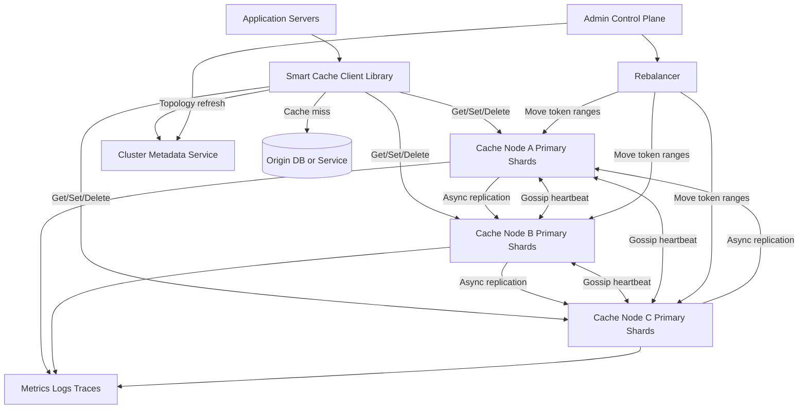
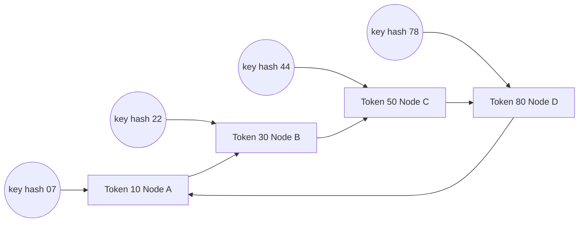
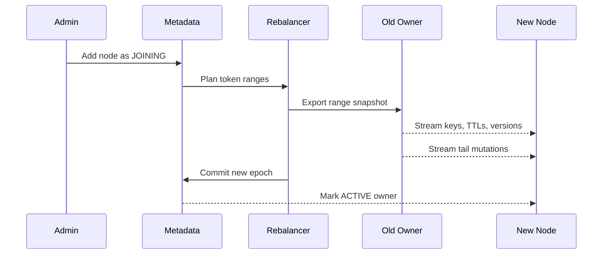
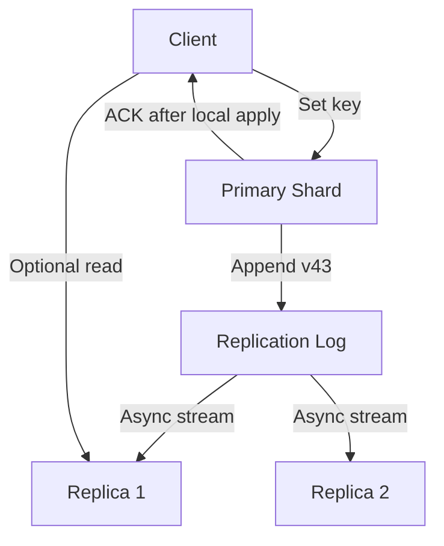
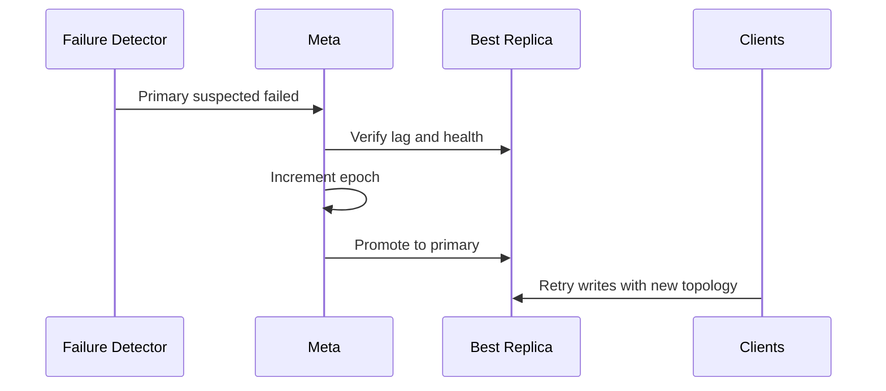
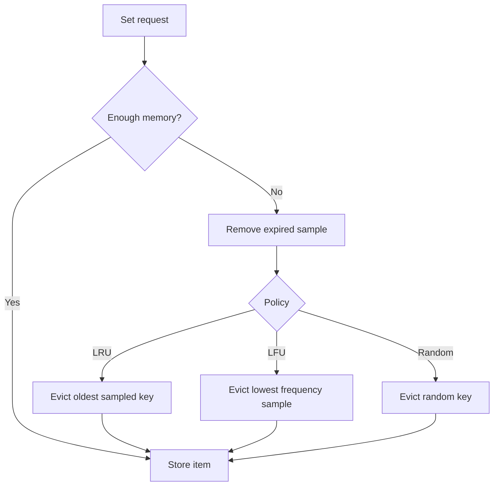
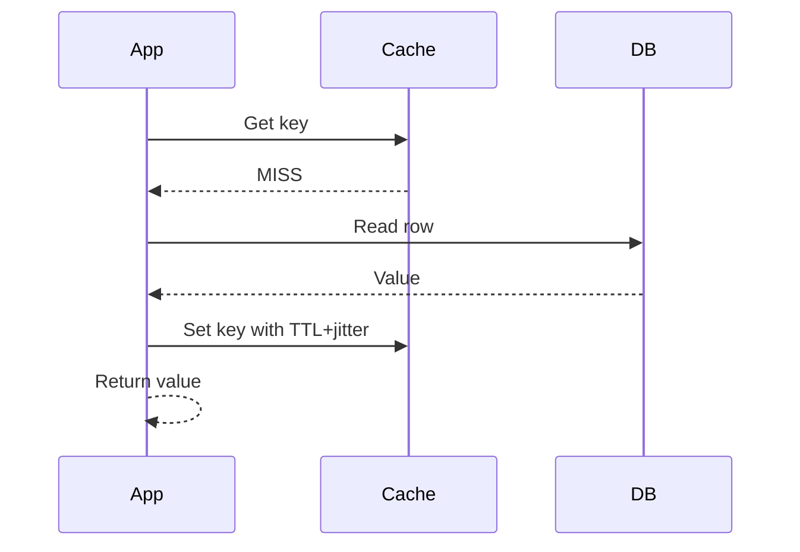
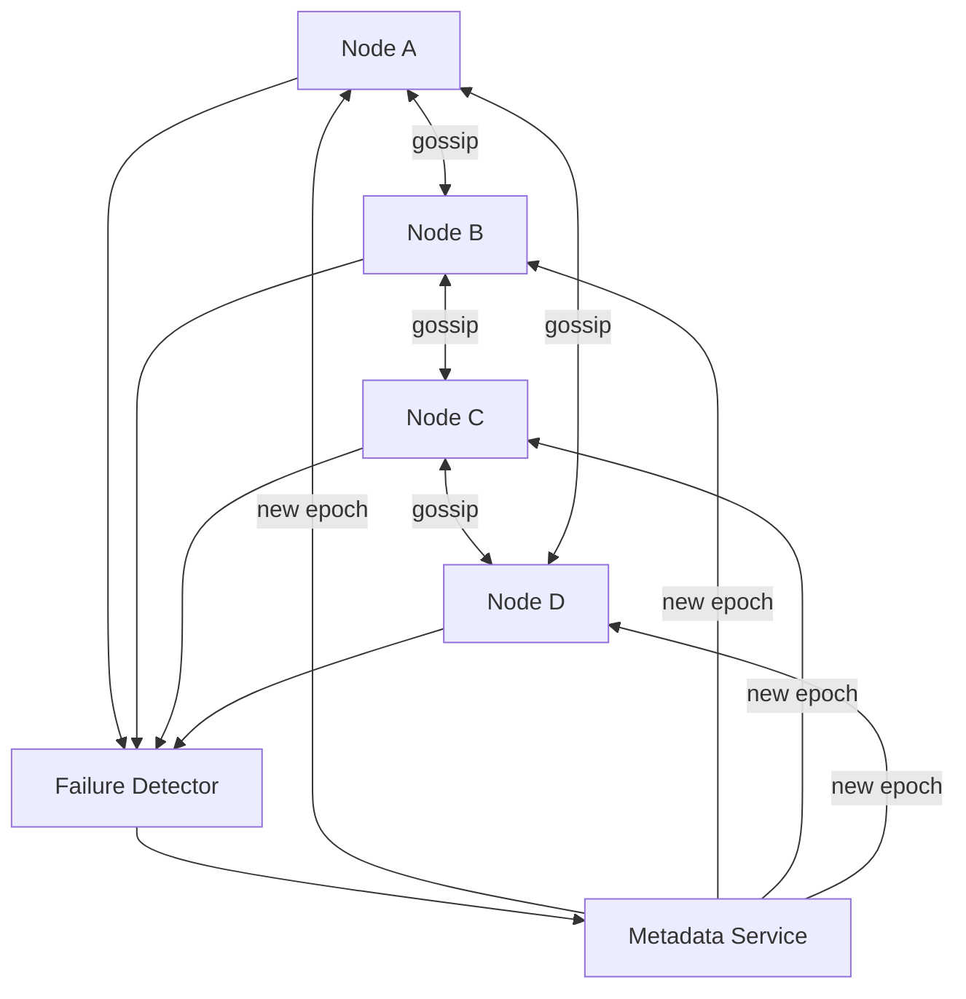
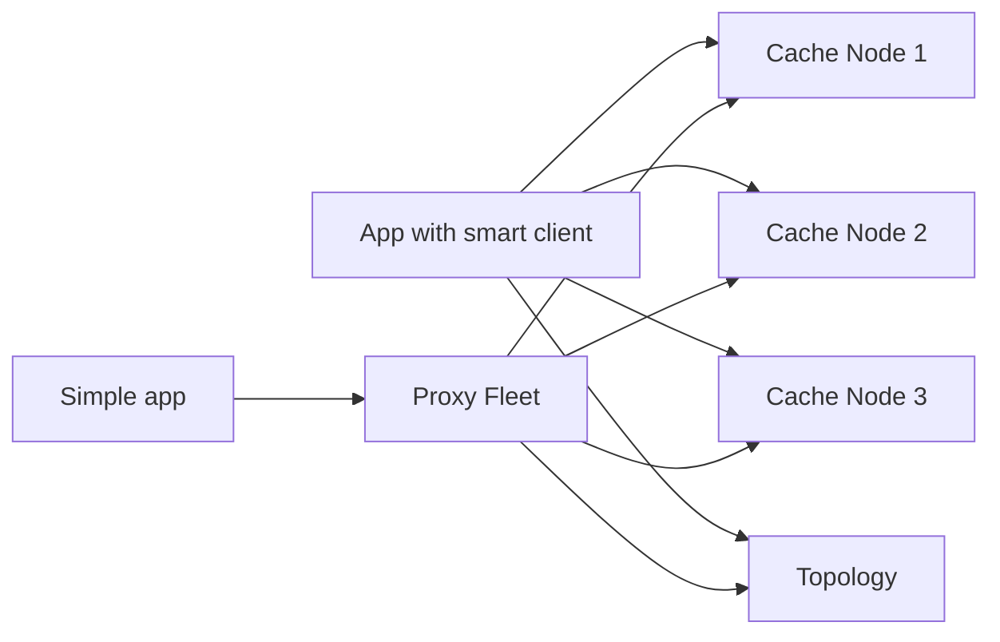

# Distributed Cache — High-Level Design

## 1. Problem Statement & Scope

Design a horizontally scalable distributed cache similar to Redis Cluster or Memcached at scale.
The system stores ephemeral key-value data across many machines and provides get, put, delete, TTL, eviction, replication, failover, and a production-grade client library.
It is the HLD counterpart of a single-node LRU/LFU cache: the data-structure problem becomes a distributed systems problem around partitioning, membership, consistency, and operations.
The cache accelerates reads to authoritative databases and services; it is not the system of record.
Therefore the design favors low latency and high availability over strict durability.
Base scope is one region across three availability zones, with optional persistence only for warm restart.

**In scope**

- Binary-safe key-value operations with optional TTL.
- Huge keyspace spread across many nodes.
- Consistent-hashing based partitioning with virtual nodes.
- Primary-replica replication and automatic failover.
- Low-latency client routing with topology awareness.
- Eviction policies: TTL, approximate LRU, approximate LFU, random, no-eviction.
- Cache coherence patterns with databases: cache-aside, write-through, write-back.
- Stampede prevention, hot-key handling, and request coalescing.
- Cluster membership, gossip, rebalancing, and failure detection.
- Metrics, logs, admin APIs, and operational safety guardrails.

**Out of scope**

- Using the cache as a strongly durable database.
- Distributed transactions across arbitrary keys.
- Full SQL queries, secondary indexes, or search.
- Global active-active coherence in the first version.
- Arbitrary server-side scripting in the base design.
- Exact global LRU across the full cluster.

**Assumptions**

- Values are usually small: p50 around 1 KB, p95 below 8 KB, hard cap around 1 MB.
- Applications can reload data from origin on cache miss.
- Sub-millisecond p50 is expected when client and cache node are in the same region.
- Occasional stale reads from replicas are acceptable for many namespaces.
- Critical source-of-truth state remains in databases, not in cache memory.
- Operators can add and remove nodes without planned downtime.

## 2. Functional Requirements

**P0 core operations**

- Get a value by namespace and key.
- Set or update a value by namespace and key.
- Set a TTL per key and expire keys automatically.
- Delete a key idempotently.
- Reject values or keys above configured size limits.
- Shard keys across many cache nodes.
- Expose topology so clients can route directly.
- Replicate each primary shard to one or more replicas.
- Detect failed nodes and promote healthy replicas.
- Evict keys under memory pressure according to policy.
- Track QPS, latency, hit rate, memory, evictions, expirations, replication lag, and failures.

**P1 production features**

- Multi-get with scatter-gather across shards.
- Touch/expire API to update TTL without rewriting values.
- Compare-and-set for optional optimistic conditional updates.
- Increment/decrement for cache counters with best-effort semantics.
- Namespace quotas and per-tenant eviction accounting.
- Smart client with topology cache, retries, jitter, and request coalescing.
- Online node drain, add-node, remove-node, and controlled rebalancing.
- Optional snapshots or append-only logs for warm restart.

**P2 extensions**

- Cross-region warm cache seeding.
- Server-side compression for large values.
- Hot-key automatic read replication.
- Keyspace notifications for invalidation subscribers.
- ACLs per namespace and per operation.
- Richer Redis-like data structures after the base KV design is stable.

| Operation | Behavior | Notes |
|---|---|---|
| Get(key) | Return value, version, expiry, or miss | Fastest path; can read primary or replica |
| MGet(keys) | Return per-key hit/miss list | Client groups keys by shard |
| Set(key,value,ttl) | Upsert value and TTL | Primary handles writes |
| Delete(key) | Remove if present | Idempotent |
| Touch(key,ttl) | Update expiry | Avoids value rewrite |
| CAS(key,version,value) | Conditional update | Optional P1 |
| Stats() | Return node or cluster metrics | Admin-only |

**TTL rules**

- TTL may be absent; the key then expires only by eviction or delete.
- Expired keys must never be returned.
- Expiration is lazy on reads and active through sampled background sweeps.
- Large synchronized TTLs should be jittered by clients to avoid expiry storms.
- Delete and expiry replicate as tombstones or versioned deletes to avoid stale resurrection.

## 3. Non-Functional Requirements

| Area | Target |
|---|---|
| Latency | Get p50 < 0.5 ms server-side; get p99 < 2-5 ms in-region |
| Throughput | Millions of operations per second cluster-wide |
| Availability | Survive one node failure per shard group; multi-AZ placement |
| Consistency | Primary writes; eventual replica consistency by default |
| Durability | Best-effort cache durability; origin DB remains authoritative |
| Scalability | Add nodes to scale memory and QPS linearly |
| Security | TLS/mTLS, authentication, namespace ACLs, admin audit logs |
| Operability | Safe rebalancing, dashboards, alerting, slow-command logs |

**Latency budget**

- Client hashing and routing: 10-50 microseconds.
- Network RTT in region: 0.2-1 ms depending on AZ placement.
- Server hash-table lookup: tens of microseconds for small values.
- Serialization/deserialization: workload dependent and often client-side.
- Replica reads can reduce tail latency if same-AZ replicas are available.
- Large values, compression, and overloaded nodes dominate p99 latency.

**Availability posture**

- The design is AP-leaning because this is a cache.
- Reads can continue from replicas during failover when freshness allows.
- Writes require an unambiguous current primary for the shard.
- If ownership is ambiguous, reject writes rather than create split-brain.
- Cold cache is acceptable but must not stampede origin databases.

**Consistency posture**

- Async replication is default for lowest write latency.
- Primary reads provide the freshest value on the current primary.
- Replica reads can be stale by replication lag.
- Semi-sync writes are optional for namespaces needing lower data-loss windows.
- Quorum writes are possible but not the default for an ephemeral cache.

## 4. Back-of-the-Envelope Estimation

### Traffic assumptions

| Metric | Assumption / arithmetic | Result |
|---|---|---|
| Active users/services | 100M daily active users or equivalent service calls | 100M |
| Ops per active entity per day | 1,000 cache operations | 100B ops/day |
| Seconds per day | README convention | ~100,000 s |
| Average QPS | 100M * 1,000 / 100,000 | 1,000,000 QPS |
| Peak multiplier | 3x average | 3,000,000 QPS |
| Read ratio | 90% of peak | 2,700,000 read QPS |
| Write/delete ratio | 10% of peak | 300,000 write QPS |

### Working set and key count

| Item | Assumption | Arithmetic |
|---|---|---|
| Logical working set | 1 TB | Given target |
| Average value | 1 KB | Typical serialized object |
| Average key | 64 B | Namespace + identifier |
| Metadata | 64 B | TTL, version, flags, pointers |
| Allocator overhead | 25% | Slabs/fragments/object headers |
| Effective item size | (1,024 + 64 + 64) * 1.25 | 1,440 B |
| Key count | 1 TB / 1,440 B | ~694M keys, round to 700M |
| RF=2 memory | 1 TB * 2 | 2 TB copies |
| RF=3 memory | 1 TB * 3 | 3 TB copies |

### Node sizing

| Item | Assumption | Arithmetic |
|---|---|---|
| RAM per node | 128 GB | Memory-optimized host |
| OS/process reserve | 16 GB | Kernel, daemon, buffers |
| Fragmentation headroom | 20% | Avoid using all remaining RAM |
| Usable cache RAM | (128 - 16) * 0.80 | ~90 GB/node |
| Primary-only nodes | 1,000 / 90 | 12 nodes |
| RF=2 minimum | 2,000 / 90 | 23 nodes |
| RF=2 with 30% headroom | 23 / 0.70 | 33 nodes; choose 36 |
| RF=3 with 30% headroom | 34 / 0.70 | 49 nodes; choose 54 |

Baseline cluster: 36 nodes, RF=2, spread as 12 nodes per AZ.
Each node stores about 2 TB / 36 = 55.6 GB, leaving ~34 GB usable headroom.

### QPS and bandwidth

| Metric | Arithmetic | Result |
|---|---|---|
| Per-node average QPS | 3,000,000 / 36 | 83,333 QPS/node |
| Per-node with 2x skew | 83,333 * 2 | 166,666 QPS/node |
| Read QPS per node | 2,700,000 / 36 | 75,000 reads/s |
| Write QPS per node | 300,000 / 36 | 8,333 writes/s |
| Read egress | 2.7M * 1.2 KB | 3.24 GB/s cluster |
| Write ingress | 300K * 1.2 KB | 360 MB/s cluster |
| RF=2 replication | 300K * 1.2 KB | 360 MB/s extra |
| Total bandwidth | 3.24 + 0.36 + 0.36 | ~3.96 GB/s cluster |
| Per-node bandwidth | 3.96 GB/s / 36 | ~110 MB/s/node |

A 10 Gbps NIC provides about 1.25 GB/s theoretical bandwidth, so the baseline is feasible even with skew, protocol overhead, and rebalancing throttles.

### Rebalancing arithmetic

| Scenario | Arithmetic | Result |
|---|---|---|
| Add one node to 36 | 1 / 37 | ~2.7% of keys move |
| Primary data moved | 1 TB * 2.7% | 27 GB |
| Including RF=2 | 2 TB * 2.7% | 54 GB |
| Safe migration budget | 200 MB/s cluster-wide | Protects user traffic |
| Move time | 54 GB / 200 MB/s | 270 s, about 4.5 min |

Modulo sharding would remap most keys when N changes, causing widespread misses and huge data movement.
Consistent hashing makes elasticity practical.

## 5. API Design

Use a binary TCP protocol or gRPC-like service.
Applications normally call a language-specific smart client rather than hand-crafting requests.
A Redis RESP or Memcached-compatible adapter can be added for compatibility.

| API | Request fields | Response fields | Semantics |
|---|---|---|---|
| Get | namespace, key, readPreference | status, value, version, expiresAt | Hit/miss lookup |
| MGet | namespace, keys, readPreference | per-key result list | Scatter-gather |
| Set | namespace, key, value, ttlMs, mode | status, version | Upsert or NX/XX |
| Delete | namespace, key | status | Idempotent delete |
| Touch | namespace, key, ttlMs | status | Update TTL only |
| CAS | namespace, key, expectedVersion, value, ttlMs | status, newVersion | Optimistic conditional write |
| GetTopology | clientVersion | topology, version | Client routing map |
| Stats | scope, shardId | metrics | Admin introspection |

| Status | Meaning | Client action |
|---|---|---|
| OK | Succeeded | Return result |
| MISS | Absent or expired | Load origin if cache-aside |
| MOVED | Shard moved | Refresh topology and retry |
| NOT_OWNER | Node no longer owns range | Refresh topology |
| TRY_AGAIN | Transient overload/failover | Retry with jittered backoff |
| VALUE_TOO_LARGE | Payload limit exceeded | Do not retry unchanged |
| RATE_LIMITED | Tenant quota exceeded | Backoff or fail closed |
| UNAUTHORIZED | Auth failed | Do not retry blindly |

**Client responsibilities**

- Hash namespace + key with the cluster-approved hash function.
- Maintain topology map with epoch/version.
- Route writes to current primary.
- Route reads to primary, nearest replica, or any replica based on readPreference.
- Pipeline or multiplex requests to reduce connection overhead.
- Handle MOVED/NOT_OWNER by refreshing topology.
- Retry only safe operations within the caller deadline.
- Coalesce concurrent cache misses for the same key.
- Apply TTL jitter helpers and origin rate limits.

**Idempotency**

- Get is idempotent.
- Delete is idempotent.
- Set is idempotent only when the same value/TTL or idempotency token is reused.
- CAS is safe to retry with the same expectedVersion.
- Retried replication events are version-checked on replicas.

## 6. Data Model & Schema

The node storage engine is an in-memory key-value engine with hash-table lookup and auxiliary structures for TTL, eviction, replication, and migration.
Persistence, when enabled, writes snapshots or compacted append-only logs to local SSD for warm restart.
Cluster metadata is small and stores node membership, token ranges, epochs, namespace policy, and migrations.

| Field | Type | Description |
|---|---|---|
| namespace | string/id | Tenant or application domain |
| keyHash | uint64/uint128 | Placement and lookup hash |
| keyBytes | bytes | Original key for collision resolution |
| valueBytes | bytes | Opaque serialized value |
| valueLength | int | Memory accounting |
| flags | bitset | Compression, tombstone, encoding |
| version | uint64 | Per-key or per-shard logical version |
| createdAt | timestamp | Debug and policy metadata |
| updatedAt | timestamp | Last mutation time |
| expiresAt | timestamp/null | TTL deadline |
| lastAccessAt | approx timestamp | Approximate LRU |
| frequencyCounter | small int | Approximate LFU |

| Structure | Purpose | Complexity |
|---|---|---|
| Main hash table | keyHash + keyBytes to item pointer | O(1) average |
| Expiry timing wheel | Bucket keys by expiry time | O(1) amortized |
| LRU/LFU metadata | Choose eviction candidates | Approximate O(1) |
| Slab/arena allocator | Reduce fragmentation | O(1) by size class |
| Replication log | Stream ordered mutations | Append sequential |
| Migration table | Track imported/exported ranges | O(1) routing check |
| Hot-key sketch | Sample heavy hitters | Approximate |

| Metadata entity | Fields | Notes |
|---|---|---|
| Cluster | clusterId, epoch, policyVersion | Epoch changes on topology update |
| Node | nodeId, host, port, AZ, state, capacity | Joining/active/draining/failed/fenced |
| VirtualNode | tokenStart, tokenEnd, primary, replicas | Ownership range |
| Namespace | quotaBytes, defaultTTL, maxValueBytes, policy | Tenant controls |
| Migration | range, source, target, status, checkpoint | Online rebalancing state |

**Storage engine decision**

- Choose in-memory KV for the p50/p99 latency target.
- Use local SSD snapshots only for warm restart.
- Do not choose SQL/NoSQL as the serving store because index/query features are unnecessary and slower.
- Reject or offload very large values because they harm latency and memory fairness.

## 7. High-Level Architecture



| Component | Responsibility |
|---|---|
| Smart client | Hashing, routing, topology refresh, retry, coalescing |
| Cache node | Store entries, enforce TTL, evict, replicate, serve requests |
| Metadata service | Authoritative topology and epoch management |
| Gossip subsystem | Fast liveness and load dissemination |
| Failure detector | Suspect/failed decisions and promotion triggers |
| Rebalancer | Online token-range migration |
| Admin plane | Policy, maintenance, quotas, ACLs |
| Observability | Metrics, logs, traces, alerts, hot-key insight |
| Origin DB/service | Authoritative source on cache miss |

**Read path**

- Client hashes namespace + key.
- Client finds owning vnode in topology map.
- Client sends Get to primary or eligible replica.
- Node checks hash table and expiry.
- Expired entry is removed lazily and returned as MISS.
- Hit returns value, version, and expiry metadata.
- Application loads origin only on MISS.

**Write path**

- Client routes Set/Delete/Touch to primary owner.
- Primary validates size, quota, and memory.
- Primary applies local mutation and assigns version.
- Primary appends to replication log.
- Async mode ACKs after local apply.
- Replicas apply ordered mutations if version is newer.
- Eviction runs when memory crosses maxmemory threshold.

## 8. Deep Dives

### A. Data partitioning via consistent hashing

Each key hashes to a point on a ring.
The owner is the first virtual-node token clockwise from that point.
Physical nodes own many virtual nodes to smooth distribution and support weighted capacity.
Adding one node to 36 moves about 1 / 37 = 2.7% of keys instead of remapping most keys.



| Choice | Formula | Membership-change effect |
|---|---|---|
| Modulo hashing | hash(key) % N | Most keys move when N changes |
| Consistent hashing | first token clockwise | Only neighboring ranges move |
| Rendezvous hashing | highest score(key,node) | Minimal movement, but range migration is less natural |

- Use 64-bit or 128-bit MurmurHash/xxHash/SipHash depending on adversarial risk.
- Use 128-512 virtual nodes per physical node.
- Weight larger nodes by assigning more virtual nodes.
- During migration, source streams snapshot then tail mutations.
- Cutover increments topology epoch; old owner returns MOVED.
- Version checks prevent old tail mutations from overwriting newer writes.



### B. Replication and consistency

Each range has one primary and one or more replicas.
Writes go to primary; replicas receive ordered mutation streams.
Async replication is default because cache latency matters more than durable acknowledgement.



| Mode | Ack condition | Latency | Data-loss window |
|---|---|---|---|
| Async | Primary local apply | Lowest | Primary crash before replica receives mutation |
| Semi-sync | Primary plus one replica | Medium | Smaller |
| Quorum | Majority ack | Highest | Smallest, CP-like |

- Primary reads are freshest on current owner.
- Replica reads can be stale by replication lag.
- Clients can request primary reads after writes for read-your-write.
- Tombstones prevent deleted keys from reappearing from stale replicas.
- Epoch fencing prevents old primaries from accepting writes after promotion.
- Semi-sync is optional for namespaces with more important cached data.



### C. Eviction, TTL, and memory management

Memory is the real capacity limit.
Eviction is local to each node because exact global LRU would require cross-node coordination and would violate latency goals.



| Policy | Use | Trade-off |
|---|---|---|
| allkeys-lru | General workloads | Good recency, approximate bookkeeping |
| allkeys-lfu | Stable skewed workloads | Better hot retention, slower adaptation |
| volatile-ttl | TTL-only caches | May evict useful hot keys |
| noeviction | Critical namespaces | Rejects writes when full |
| random | Very low overhead | Lower hit rate |

- Use lazy expiry on access plus active sampled sweeps.
- Use timing wheels for coarse expiry buckets.
- Apply TTL jitter of about ±10% to avoid synchronized expiry.
- Use slab or arena allocation to reduce fragmentation.
- Track RSS/logical memory fragmentation ratio.
- Reserve memory for replication buffers and migration.
- Per-namespace quotas prevent noisy-neighbor eviction.

### D. Cache coherence, stampede, and hot keys

The origin database remains authoritative.
The cache must be filled and invalidated using explicit application patterns.



| Pattern | How it works | When to use |
|---|---|---|
| Cache-aside | App reads cache, loads DB on miss, then sets cache | Default; simple and resilient |
| Write-through | Write goes through cache to DB synchronously | Fresh reads, slower writes |
| Write-back | Cache ACKs then flushes DB asynchronously | Derived/best-effort data only |
| Delete-on-write | After DB commit, delete cache key | Common invalidation approach |
| Versioned keys | Embed data version in key | Avoids delete races, uses more memory |

```mermaid
sequenceDiagram
    participant C1 as Caller 1
    participant C2 as Caller 2
    participant Lib as Client Library
    participant Cache
    participant DB
    C1->>Lib: GetOrLoad hotKey
    C2->>Lib: GetOrLoad hotKey
    Lib->>Cache: Get hotKey
    Cache-->>Lib: MISS
    Lib->>Lib: Elect one loader; coalesce waiters
    Lib->>DB: Single origin load
    DB-->>Lib: Value
    Lib->>Cache: Set TTL+jitter
    Lib-->>C1: Value
    Lib-->>C2: Value
```

- Mitigate stampedes with request coalescing, per-key locks, soft TTL, stale-while-revalidate, and negative caching.
- Protect DB with origin rate limits and circuit breakers during cache outages.
- Detect hot keys with sampled heavy-hitter sketches.
- Replicate hot keys to additional read nodes rather than moving a whole shard.
- Use process-local L1 cache for immutable ultra-hot keys.
- Split or offload large hot values to blob/CDN-style storage.

### E. Cluster membership, gossip, and failure detection

The control plane owns authoritative topology epochs.
Gossip spreads liveness and load quickly without sending every heartbeat to a central coordinator.



| Node state | Meaning | Behavior |
|---|---|---|
| JOINING | Starting/warming | No primary traffic |
| ACTIVE | Healthy owner/replica | Serves normally |
| DRAINING | Planned removal | Avoid new assignments |
| SUSPECT | Missed heartbeats | Avoid replica reads if possible |
| FAILED | Declared unavailable | Promote replicas |
| FENCED | Old owner after epoch change | Reject writes until resync |

- Use suspicion before failure to avoid flapping.
- Promote only after checking replica lag and metadata epoch.
- Throttle rebalancing so it does not compete with user traffic.
- Pause migration if p99 latency or error rate rises.
- Clients handle MOVED and refresh topology lazily.

### F. Smart client versus proxy



| Model | Pros | Cons |
|---|---|---|
| Smart client | No extra hop, best latency, shard-aware batching | Requires libraries in each language |
| Proxy | Simple clients, centralized routing, legacy support | Extra hop, proxy bottleneck, another HA fleet |

## 9. Scaling/Caching/Bottlenecks

**Scaling plan**

- Add nodes to increase memory and QPS.
- Assign virtual nodes proportional to node capacity.
- Keep 20-30% memory headroom for failover and migration.
- Spread replicas across AZs.
- Keep CPU below 60-70% at peak.
- Use rolling drain for maintenance.
- Use autoscaling based on memory, QPS, p99, and eviction rate.

| Bottleneck | Cause | Mitigation |
|---|---|---|
| Hot shard | Uneven key distribution | More vnodes, split ranges, weighted tokens |
| Hot key | One key dominates QPS | Hot-key replication, L1 cache, coalescing |
| Large values | Bandwidth and CPU spikes | Size cap, compression, blob offload |
| Rebalancing | Streaming competes with traffic | Throttle and schedule migrations |
| Metadata refresh storm | Many clients update at once | Jitter refresh and cache topology |
| Connection explosion | Many app instances connect to all nodes | Pooling or proxy for small clients |
| Fragmentation | Variable value sizes | Slabs, arenas, defrag, memory alerts |
| Origin overload | Mass misses after outage | Stale serving, rate limits, warmup |

**Caching layers**

| Layer | Purpose | Freshness |
|---|---|---|
| L1 in-process | Ultra-hot immutable values | Very short TTL |
| Distributed cache | Shared low-latency cache | TTL/invalidation |
| CDN/edge | Public static content | Purge/long TTL |
| DB buffer cache | Database acceleration | DB-managed |

**Multi-get scaling**

- Group keys by shard.
- Send bounded parallel requests.
- Use per-shard deadlines.
- Return per-key status.
- Retry failed shards only.
- Cap maximum batch size to avoid head-of-line blocking.

**Network and CPU scaling**

- Use binary protocol and pipelining.
- Keep connections warm.
- Avoid compression for tiny values.
- Separate network and worker threads.
- Shard hash tables inside a node to reduce locks.
- Batch replication writes.
- Avoid exact LRU metadata updates on every read.

## 10. Reliability & Consistency

| Failure | Impact | Mitigation |
|---|---|---|
| Primary crash | Shard writes fail briefly | Promote best replica and refresh clients |
| Replica crash | Reduced redundancy | Rebuild replica elsewhere |
| AZ loss | Capacity and replicas reduced | AZ-aware placement and headroom |
| Network partition | Stale reads or ownership ambiguity | Epoch fencing and conservative writes |
| Metadata outage | No topology changes | Data plane uses cached map |
| Rebalance interruption | Partial migration | Checkpoint and restart migration |
| Memory pressure | Evictions or rejected writes | Quotas and maxmemory policy |
| Origin DB outage | Misses cannot refill | Serve stale and rate-limit loaders |
| Client retry storm | Amplified load | Backoff, jitter, deadlines, rate limits |

**AP versus CP decision**

- Because this is a cache, the system leans AP for reads and most operations.
- It should serve available stale data rather than fail all requests during minor partitions.
- It still fences writes with epochs to avoid split-brain owners.
- If ownership cannot be established safely, reads may continue but writes should fail fast.
- Origin systems remain responsible for strong correctness.

**Data loss window**

- Async replication can lose writes acknowledged only by the failed primary.
- For cache-aside data, the next miss reloads origin.
- Semi-sync reduces the loss window by waiting for one replica.
- Quorum mode reduces it further but increases latency and lowers availability.
- Deletes replicate tombstones to avoid old values reappearing after promotion.

| Operation | Default guarantee | Stronger option |
|---|---|---|
| Get primary | Latest on current primary | Read with minVersion |
| Get replica | Eventual consistency | Wait for lag threshold |
| Set | Primary local commit | Semi-sync or quorum |
| Delete | Eventual tombstone replication | Semi-sync tombstone |
| Rebalance | Epoch-based cutover | Brief write pause for range |

**Operational reliability**

- Backpressure with TRY_AGAIN when queues are full.
- Retries bounded by caller deadlines.
- Replication buffers capped; lagging replicas are rebuilt.
- Admin actions are audited.
- Chaos tests cover crashes, partitions, slow disks, and packet loss.
- Dashboards alert on hit-rate drops, p99 spikes, memory, evictions, lag, and failed nodes.

## 11. Trade-offs & Alternatives

| Decision area | Option A | Option B | Chosen | Rationale |
|---|---|---|---|---|
| Partitioning | Consistent hashing | Modulo hashing | Consistent hashing | Minimal key movement on membership change |
| Hashing alternative | Consistent hashing | Rendezvous hashing | Consistent hashing | Token ranges are operationally convenient |
| Routing | Smart client | Proxy | Smart client | Lowest latency and no proxy bottleneck |
| Legacy support | Smart only | Proxy adapter | Optional proxy | Useful for simple clients |
| Replication | Async | Sync/quorum | Async default | Cache favors low latency |
| Stronger writes | Async only | Semi-sync option | Semi-sync optional | Reduces data-loss window for special namespaces |
| Reads | Primary only | Replica reads | Both | Freshness versus latency choice |
| Persistence | In-memory only | Snapshots/AOF | In-memory default | Origin is authoritative; snapshots help warm restart |
| Eviction | Exact LRU | Approx LRU/LFU | Approximate | Avoids global mutation on every read |
| Expiration | Full scan | Lazy + sampling | Lazy + sampling | Avoids scanning huge keyspace |
| Metadata | Pure central | Pure gossip | Hybrid | Authoritative epochs plus scalable liveness |
| Coherence | Cache-aside | Write-through/write-back | Cache-aside | Simple and keeps DB authoritative |
| Hot key | Move shard | Replicate key | Replicate key | Shard movement does not fix single-key skew |
| Large values | Allow arbitrary | Cap/compress/offload | Cap/offload | Protects p99 and memory fairness |
| Consistency | CP | AP-leaning | AP-leaning | Cache should remain available |

**Rejected alternatives**

- Modulo sharding is too disruptive during node changes.
- Exact global LRU is too expensive across nodes.
- Using the cache as source of truth changes the problem into database design.
- Write-back is unsafe for critical data because cache failures can lose acknowledged writes.
- Pure proxy routing adds latency and creates a fleet that can bottleneck high-QPS applications.

## 12. Future Improvements

- Cross-region warm standby seeded from snapshots.
- Active-active regional caches with versioned invalidation streams.
- Automatic hot-key replication using heavy-hitter detection.
- Adaptive eviction policy per namespace.
- Disk-backed cold tier for less frequently accessed entries.
- Server-side Redis-like structures after KV reliability is proven.
- Hash-tag based colocated multi-key operations.
- Keyspace notifications for invalidation subscribers.
- Formal verification of epoch and promotion state machines.
- Chaos testing for node loss, AZ loss, packet loss, and slow replicas.
- Client SDK conformance suite across languages.
- Self-service dashboards for quota, TTL, and policy tuning.
- Adaptive compression based on value size and CPU headroom.
- Large-object offload to blob storage with cache pointers.
- Hardware-aware placement for NUMA and NIC queues.
- Autoscaling forecasts from hit rate, eviction rate, and memory trends.
- Stale-if-error and stale-while-revalidate controls per namespace.
- eBPF-based latency attribution for kernel and network bottlenecks.
- Per-tenant ACLs with stronger audit and billing.
- Safer automated rebalancing simulations before topology commits.
