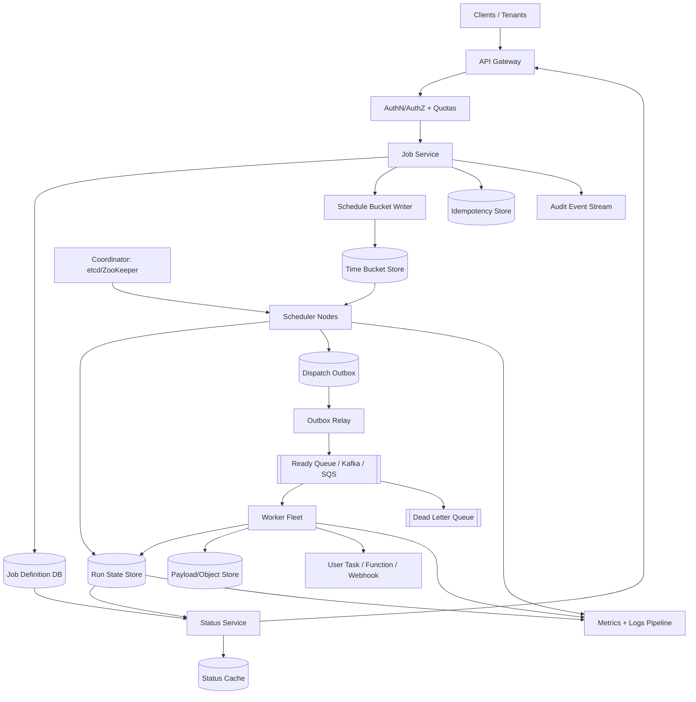
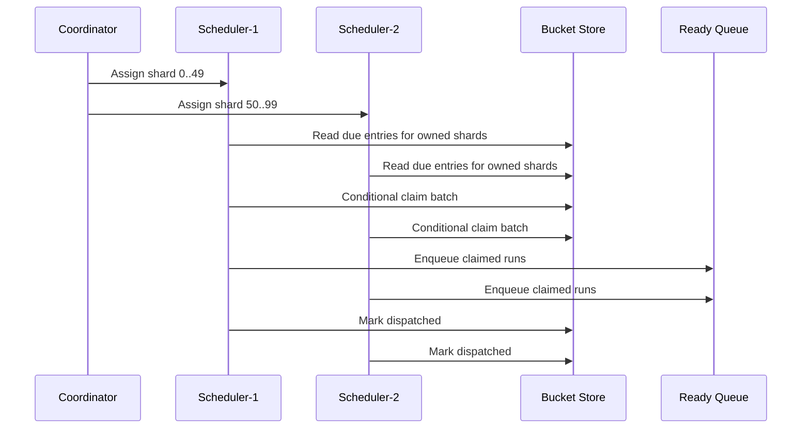
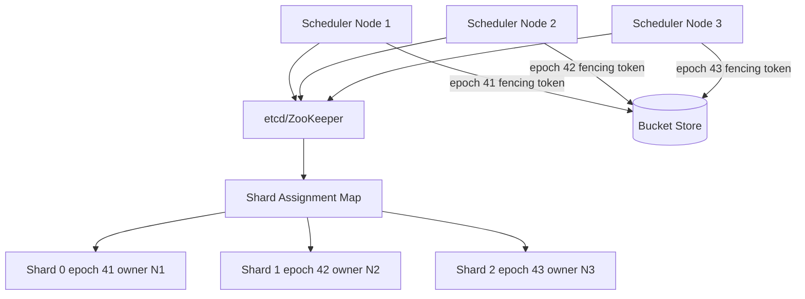
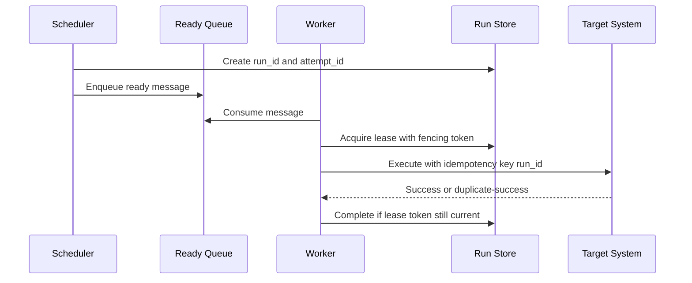
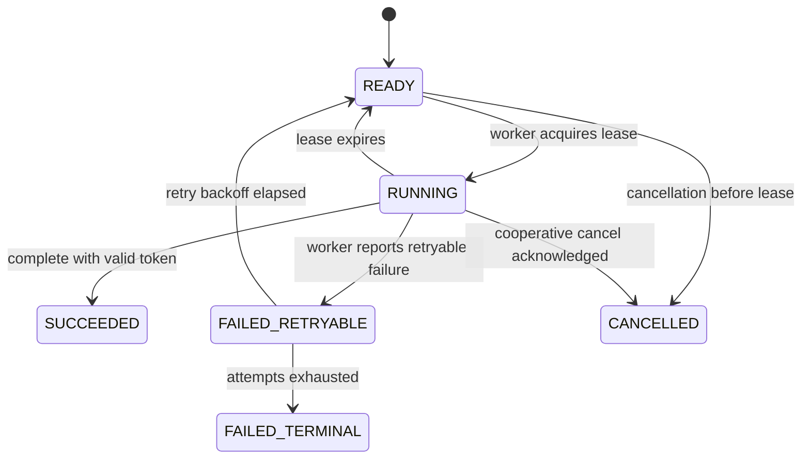
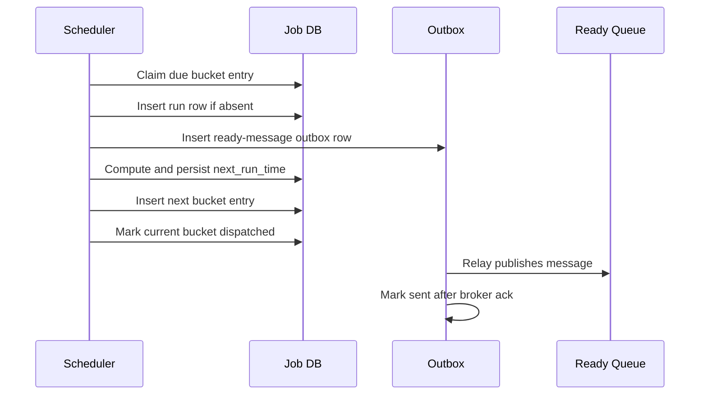

# Distributed Job Scheduler — High-Level Design

## 1. Problem Statement & Scope

Design a distributed, fault-tolerant job scheduling service similar to cloud cron, Airflow triggers, or a managed task scheduler.
The system stores one-shot and recurring schedules, finds jobs whose `next_run_time` is due, dispatches them to a worker fleet, tracks execution, retries failures, and exposes visibility and control APIs.
The HLD counterpart to an in-process LLD job scheduler is a control plane that can manage millions of timers across many scheduler nodes without missing jobs or creating uncontrolled duplicate dispatch.

### Goals
- Support one-shot jobs that run at a specified timestamp.
- Support recurring jobs using cron expressions or fixed intervals.
- Dispatch due jobs to a horizontally scalable worker fleet.
- Provide at-least-once execution by default with idempotency support.
- Provide retries, exponential backoff, max-attempt limits, and dead-letter handling.
- Provide visibility into job status, run history, attempts, latency, and errors.
- Support cancellation, pausing, resuming, manual triggering, and priority-based dispatch.
- Survive scheduler, queue, database, and worker failures with bounded recovery time.
- Enforce tenant isolation, quotas, and fair use in a multi-tenant service.

### Non-goals
- Do not execute arbitrary untrusted code directly inside scheduler nodes.
- Do not build a full DAG workflow engine in the first version.
- Do not guarantee globally exactly-once side effects for arbitrary user code.
- Do not provide microsecond precision or hard real-time guarantees.
- Do not store large job payloads in the hot scheduling database.
- Do not make every schedule globally ordered with every other schedule.

### Assumptions
- Tenants submit job definitions with schedule, target, payload reference, priority, retry policy, and idempotency key.
- Worker code is either a registered platform task, container/function, or callback endpoint invoked by workers.
- Most jobs tolerate a few seconds of jitter, while high-priority jobs need lower jitter.
- Jobs are usually short to medium duration, but long-running jobs are supported through leases and heartbeats.
- Clocks are synchronized with NTP, but clock skew still exists and must be tolerated.
- The service is multi-tenant and must defend against noisy-neighbor bursts.

## 2. Functional Requirements

### P0 requirements
- Create a one-shot job with an execution timestamp.
- Create a recurring job using cron syntax or fixed interval syntax.
- Persist job definitions durably before acknowledging creation.
- Compute and store the next run time for every active schedule.
- Continuously find due jobs and dispatch them to workers.
- Execute each due run at least once unless cancelled before dispatch.
- Record each run attempt with start time, end time, result, and error summary.
- Retry failed attempts according to a configured retry policy.
- Move exhausted jobs or runs to a dead-letter queue for operator inspection.
- Allow users to cancel active or pending jobs.
- Provide job, run, and attempt status APIs.
- Enforce tenant quotas for active jobs, due rate, payload size, and worker concurrency.

### P1 requirements
- Pause and resume recurring schedules.
- Support priority classes such as high, normal, and low.
- Support misfire policies for missed recurring runs.
- Support delayed retry with exponential backoff and jitter.
- Support idempotency keys for create, update, manual trigger, and dispatch operations.
- Support worker heartbeats and visibility timeout extension.
- Support tenant-level rate limiting and per-tenant concurrency limits.
- Support audit logs for create, update, pause, resume, cancel, and manual trigger.
- Support manual run now for a recurring job without changing future schedule.

### P2 requirements
- Support calendar-aware schedules and timezone-specific cron behavior.
- Support schedule versioning and rollback.
- Support job dependencies and simple fan-out workflows.
- Support multi-region active-active scheduling for regional tenants.
- Support SLA classes with different jitter and availability targets.
- Support webhook notifications on success, failure, retry, and DLQ.

### Core job states
- `ACTIVE`: schedule is eligible for dispatch.
- `PAUSED`: schedule exists but no future runs are dispatched.
- `CANCELLED`: schedule and pending runs are cancelled.
- `COMPLETED`: one-shot job or finite recurring job has no more runs.
- `DLQ`: schedule or run requires manual intervention after repeated failure.

### Core run states
- `SCHEDULED`: run exists but is not due yet.
- `READY`: run is due and claimable by a scheduler partition.
- `DISPATCHED`: run has been placed on the ready queue.
- `RUNNING`: a worker has leased the run.
- `SUCCEEDED`: worker completed successfully.
- `FAILED_RETRYABLE`: attempt failed and another retry is scheduled.
- `FAILED_TERMINAL`: attempts exhausted or non-retryable error.
- `CANCELLED`: run was cancelled before successful completion.

## 3. Non-Functional Requirements

### Scale
- 100M active scheduled jobs.
- 10M tenants, with a small number of very large tenants.
- Average 10K due runs per second.
- Peak 30K due runs per second, using 3× average.
- 100K due runs per second during rare top-of-hour bursts after smoothing.
- 1B execution history rows retained online for recent visibility.
- Older execution history moves to cold object storage.

### Latency
- Job creation API p50 < 50 ms and p99 < 300 ms.
- Due job dispatch jitter p50 < 1 s and p99 < 10 s for normal priority.
- High-priority dispatch jitter p99 < 3 s under nominal load.
- Status read p50 < 30 ms and p99 < 200 ms.
- Cancellation is best-effort before dispatch and cooperative after worker lease.

### Availability
- Control plane API availability target: 99.95%.
- Scheduling and dispatch availability target: 99.99%.
- Worker execution availability depends on tenant worker code, but platform delivery should remain highly available.
- No single scheduler node should own all due-job discovery.
- A single availability-zone failure should not stop scheduling.

### Durability
- Acknowledged job definitions must not be lost.
- A due run should survive process crashes once it is persisted or enqueued.
- Execution history should use replication factor 3 before being considered durable.
- Queue messages must be durable enough to survive broker or node loss.
- Payloads and historical logs should be stored in object storage with lifecycle policy.

### Consistency
- Job creation and updates require strong consistency per job ID.
- Dispatch is at-least-once; duplicate dispatch is possible and handled through idempotency.
- Status reads may be slightly stale if served from replicas or caches.
- Per-job ordering of recurring runs is configurable: allow overlap or enforce non-overlap.
- Metrics and audit projections are eventually consistent.

### Security and isolation
- Authenticate every API request using tenant credentials.
- Authorize job operations by tenant and project scope.
- Encrypt payload references and secrets at rest.
- Avoid storing secrets in job payloads; store secret-manager references.
- Apply quotas so one tenant cannot consume all scheduler or worker capacity.

## 4. Back-of-the-Envelope Estimation

### Traffic assumptions

| Input | Value | Reasoning |
|---|---:|---|
| Active scheduled jobs | 100M | Large managed cloud scheduler scale |
| New/updated jobs per day | 10M/day | 10% of active set changes daily |
| Due executions per day | 1B/day | Recurring jobs dominate one-shot jobs |
| Seconds per day | 10^5 s | README convention |
| Average due executions | 1B / 10^5 = 10K/s | Baseline dispatch rate |
| Peak due executions | 3 × 10K/s = 30K/s | README peak convention |
| Top-of-hour burst before smoothing | 300K/s | Many cron jobs at minute 0 |
| Smoothed burst target | 100K/s | Jitter and bucket spreading |
| Average status reads | 200K/s | Dashboards and polling |
| Peak status reads | 3 × 200K/s = 600K/s | Read-heavy visibility plane |

### API write QPS

| Operation | Arithmetic | Average QPS | Peak QPS |
|---|---:|---:|---:|
| Create/update/cancel jobs | 10M/day / 10^5 s | 100/s | 300/s |
| Execution state writes | 1B runs/day × 3 writes/run / 10^5 s | 30K/s | 90K/s |
| Attempt heartbeats | 30K running × 1 heartbeat/30s | 1K/s | 3K/s |
| Audit events | 10M/day / 10^5 s | 100/s | 300/s |
| Metrics events | 1B/day × 5 events/run / 10^5 s | 50K/s | 150K/s |

Execution state dominates writes, so execution storage and event pipelines must be append-friendly and partitioned.

### Scheduler throughput

| Quantity | Arithmetic | Result |
|---|---:|---:|
| Average dispatch | 1B/day / 10^5 s | 10K/s |
| Peak dispatch | 3 × 10K/s | 30K/s |
| Burst dispatch target | after jitter/bucketing | 100K/s |
| Per scheduler shard capacity | conservative target | 1K dispatch/s |
| Shards for peak | 30K / 1K | 30 shards |
| Shards for burst | 100K / 1K | 100 shards |
| HA factor | 2 active candidates per shard | 200 scheduler slots |

A scheduler node can own multiple time or hash partitions, but ownership must be explicit so every node does not scan the same rows.

### Worker sizing

| Input | Arithmetic | Result |
|---|---:|---:|
| Peak due rate | 30K jobs/s | 30K jobs/s |
| Average execution duration | 2 s | Assumed short task |
| Required concurrent tasks | 30K/s × 2 s | 60K concurrent tasks |
| Per worker process capacity | 20 concurrent tasks | Async worker/container |
| Worker processes at peak | 60K / 20 | 3K workers |
| Burst concurrency | 100K/s × 2 s | 200K concurrent tasks |
| Burst workers | 200K / 20 | 10K workers |
| Headroom | 30% | 13K burst-capable workers |

For CPU-heavy jobs, capacity should be computed from CPU seconds instead of task count.

### Storage estimate

| Data | Per row | Count | Raw size | RF=3 size |
|---|---:|---:|---:|---:|
| Job definition | 2 KB | 100M | 200 GB | 600 GB |
| Schedule index metadata | 200 B | 100M | 20 GB | 60 GB |
| Execution run row | 1 KB | 1B/day × 30 days | 30 TB | 90 TB |
| Attempt row | 700 B | 1.2B/day × 30 days | 25.2 TB | 75.6 TB |
| Audit log | 500 B | 10M/day × 365 days | 1.8 TB | 5.4 TB |
| Metrics events | 200 B | 5B/day × 7 days hot | 7 TB | 21 TB |

Hot OLTP storage is dominated by recent execution history.
Job definitions and next-run indexes require strong consistency, while older history can be exported to object storage.

### Queue sizing

| Quantity | Arithmetic | Result |
|---|---:|---:|
| Ready message size | payload pointer + metadata | 1 KB |
| Peak queue ingress | 30K/s × 1 KB | 30 MB/s |
| Burst ingress | 100K/s × 1 KB | 100 MB/s |
| Queue retention for replay | 1B/day × 1 KB | 1 TB/day raw |
| RF=3 queue storage | 1 TB/day × 3 | 3 TB/day |
| Kafka partitions at 1K msg/s each | 100K/s / 1K | 100 partitions minimum |
| Practical partitions | operational headroom | 256–512 partitions |

### Bandwidth and cache sizing

| Item | Arithmetic | Result |
|---|---:|---:|
| Scheduler to queue peak | 30K/s × 1 KB | 30 MB/s |
| Scheduler to queue burst | 100K/s × 1 KB | 100 MB/s |
| Worker result writes peak | 30K/s × 1 KB | 30 MB/s |
| Status reads peak | 600K/s × 2 KB | 1.2 GB/s |
| Tenant config cache | 10M tenants × 10% hot × 2 KB | 2 GB |
| Recent job status cache | 10M hot jobs × 1 KB | 10 GB |
| Recent run summary cache | 100M hot runs × 500 B | 50 GB |
| Cron parse cache | 5M expressions × 200 B | 1 GB |

A Redis or Memcached cluster with roughly 100–200 GB usable memory covers hot status, quota, and cron parse caches with headroom.
## 5. API Design

Use REST for external control-plane APIs and gRPC internally between schedulers, dispatchers, and workers.
All write APIs accept `Idempotency-Key` so clients can safely retry after timeouts.
All list APIs are paginated with opaque `next_page_token` values.

### Create one-shot job

```http
POST /v1/tenants/{tenant_id}/jobs
Idempotency-Key: create-job-123
Content-Type: application/json

{
  "name": "send-invoice-reminder",
  "schedule_type": "ONE_SHOT",
  "run_at": "2026-08-05T12:00:00Z",
  "timezone": "UTC",
  "priority": "NORMAL",
  "payload_ref": "blob://jobs/payloads/abc",
  "target": { "type": "WORKER_TASK", "task_name": "InvoiceReminder" },
  "retry_policy": { "max_attempts": 5, "initial_backoff_seconds": 30, "max_backoff_seconds": 3600 },
  "execution_policy": { "overlap": "DISALLOW", "timeout_seconds": 600 },
  "client_dedup_key": "invoice-123-reminder-1"
}
```

Response:

```json
{
  "job_id": "job_01HZX...",
  "status": "ACTIVE",
  "next_run_time": "2026-08-05T12:00:00Z",
  "created_at": "2026-08-05T00:54:24Z"
}
```

### Create recurring job

```http
POST /v1/tenants/{tenant_id}/jobs
Idempotency-Key: recurring-job-456
Content-Type: application/json

{
  "name": "daily-report",
  "schedule_type": "CRON",
  "cron": "0 9 * * MON-FRI",
  "timezone": "Asia/Kolkata",
  "priority": "HIGH",
  "misfire_policy": "RUN_ONCE_NOW",
  "payload_ref": "blob://jobs/payloads/report",
  "retry_policy": { "max_attempts": 3, "initial_backoff_seconds": 60 },
  "execution_policy": { "overlap": "SKIP_IF_PREVIOUS_RUNNING", "timeout_seconds": 1800 }
}
```

### Get job

```http
GET /v1/tenants/{tenant_id}/jobs/{job_id}
```

Response includes schedule definition, status, version, next run time, recent run summary, retry policy, and cancellation state.

### Update job

```http
PATCH /v1/tenants/{tenant_id}/jobs/{job_id}
If-Match: version_17
Idempotency-Key: update-job-789
Content-Type: application/json

{
  "cron": "*/15 * * * *",
  "priority": "NORMAL",
  "misfire_policy": "SKIP_MISSED"
}
```

Use optimistic concurrency through `If-Match` so concurrent updates do not silently overwrite schedules.

### Pause, resume, cancel

```http
POST /v1/tenants/{tenant_id}/jobs/{job_id}:pause
POST /v1/tenants/{tenant_id}/jobs/{job_id}:resume
POST /v1/tenants/{tenant_id}/jobs/{job_id}:cancel
```

Cancellation changes job state and prevents future dispatch.
If a run is already leased by a worker, the platform sends a cooperative cancellation signal and marks the run cancelled only after worker acknowledgement or timeout.

### List runs

```http
GET /v1/tenants/{tenant_id}/jobs/{job_id}/runs?status=FAILED&page_size=50&page_token=...
```

The response is ordered by `scheduled_time DESC` and includes run IDs, attempt counts, timings, final status, and error summaries.

### Manual trigger

```http
POST /v1/tenants/{tenant_id}/jobs/{job_id}:runNow
Idempotency-Key: run-now-123
Content-Type: application/json

{ "reason": "operator-request" }
```

Manual triggers create an execution run without changing the recurring job's next scheduled run.

### Worker lease protocol

Internal workers usually consume from the ready queue, but the platform can expose a lease API for pull-based workers.

```http
POST /internal/v1/worker/leases:acquire
Content-Type: application/json

{ "worker_id": "worker-17", "max_items": 20, "capabilities": ["InvoiceReminder"] }
```

```http
POST /internal/v1/worker/leases/{lease_id}:heartbeat
POST /internal/v1/worker/leases/{lease_id}:complete
POST /internal/v1/worker/leases/{lease_id}:fail
```

Lease completion includes a fencing token so stale workers cannot overwrite newer attempt results.

### API semantics
- Client write idempotency keys are scoped by tenant, endpoint, and request hash.
- Duplicate create requests return the original `job_id` and response body.
- Dispatch idempotency is scoped by `run_id` and `attempt_id`.
- Worker completion is accepted only if `(run_id, attempt_id, lease_token)` matches the active lease.
- Pagination tokens encode a stable sort key and expiry.
- Strong reads can be served from the primary store; normal reads can use replicas/cache.

## 6. Data Model & Schema

The design uses multiple stores because a single database shape is not ideal for all access patterns.

### Storage choices

| Store | Data | Why |
|---|---|---|
| Strongly consistent SQL or distributed SQL | Job definitions, schedule index, idempotency records | Per-job transactions, secondary indexes, constraints |
| Kafka/Pulsar/SQS-like durable queue | Ready runs | Decouple dispatch from execution, backpressure, replay |
| Partitioned NoSQL / wide-column store | Run and attempt history | High write throughput and time-range queries |
| Redis/Memcached | Hot status, tenant quota, cron parse cache | Low-latency reads and rate limiting |
| Object storage | Large payloads, old history exports | Cheap durable storage |
| Time-series DB | Metrics | Aggregations, alerts, dashboards |

### jobs table

```sql
CREATE TABLE jobs (
  tenant_id            TEXT NOT NULL,
  job_id               TEXT NOT NULL,
  name                 TEXT NOT NULL,
  schedule_type        TEXT NOT NULL, -- ONE_SHOT, CRON, INTERVAL
  cron_expression      TEXT NULL,
  interval_seconds     BIGINT NULL,
  timezone             TEXT NOT NULL DEFAULT 'UTC',
  payload_ref          TEXT NOT NULL,
  target_type          TEXT NOT NULL,
  target_name          TEXT NOT NULL,
  priority             SMALLINT NOT NULL DEFAULT 5,
  status               TEXT NOT NULL,
  next_run_time        TIMESTAMP NULL,
  last_run_time        TIMESTAMP NULL,
  misfire_policy       TEXT NOT NULL DEFAULT 'RUN_ONCE_NOW',
  overlap_policy       TEXT NOT NULL DEFAULT 'ALLOW',
  max_attempts         INT NOT NULL DEFAULT 3,
  initial_backoff_sec  INT NOT NULL DEFAULT 30,
  max_backoff_sec      INT NOT NULL DEFAULT 3600,
  timeout_seconds      INT NOT NULL DEFAULT 600,
  schedule_version     BIGINT NOT NULL DEFAULT 1,
  created_at           TIMESTAMP NOT NULL,
  updated_at           TIMESTAMP NOT NULL,
  PRIMARY KEY (tenant_id, job_id)
);
```

Important indexes:
- `(status, next_run_time, priority)` for due-job discovery in smaller deployments.
- `(tenant_id, status, next_run_time)` for tenant-specific listing and quota checks.
- `(tenant_id, name)` if job names must be unique per tenant.
- A partial index on active jobs: `WHERE status = 'ACTIVE' AND next_run_time IS NOT NULL`.

### schedule_buckets table

For large scale, due-job discovery uses time buckets rather than scanning the global `jobs` index.

```sql
CREATE TABLE schedule_buckets (
  bucket_start_time    TIMESTAMP NOT NULL,
  shard_id             INT NOT NULL,
  priority             SMALLINT NOT NULL,
  tenant_id            TEXT NOT NULL,
  job_id               TEXT NOT NULL,
  next_run_time        TIMESTAMP NOT NULL,
  schedule_version     BIGINT NOT NULL,
  status               TEXT NOT NULL DEFAULT 'READY_IN_BUCKET',
  claim_owner          TEXT NULL,
  claim_token          BIGINT NULL,
  claim_until          TIMESTAMP NULL,
  inserted_at          TIMESTAMP NOT NULL,
  PRIMARY KEY (bucket_start_time, shard_id, priority, tenant_id, job_id)
);
```

Bucket design:
- Bucket width is 1 minute for normal priority and 5 seconds for high priority near execution time.
- `shard_id = hash(tenant_id, job_id) % N` spreads jobs within the same time bucket.
- Scheduler nodes own `(bucket_start_time, shard_id, priority)` ranges through a coordinator.
- The bucket row is deleted or marked dispatched only after the ready message is durably enqueued.

### job_runs table

```sql
CREATE TABLE job_runs (
  tenant_id            TEXT NOT NULL,
  job_id               TEXT NOT NULL,
  run_id               TEXT NOT NULL,
  scheduled_time       TIMESTAMP NOT NULL,
  status               TEXT NOT NULL,
  priority             SMALLINT NOT NULL,
  attempt_count        INT NOT NULL DEFAULT 0,
  current_attempt_id   TEXT NULL,
  current_lease_token  BIGINT NULL,
  lease_owner          TEXT NULL,
  lease_until          TIMESTAMP NULL,
  first_dispatched_at  TIMESTAMP NULL,
  started_at           TIMESTAMP NULL,
  completed_at         TIMESTAMP NULL,
  error_code           TEXT NULL,
  error_message        TEXT NULL,
  created_at           TIMESTAMP NOT NULL,
  updated_at           TIMESTAMP NOT NULL,
  PRIMARY KEY (tenant_id, run_id)
);
```

Indexes:
- `(tenant_id, job_id, scheduled_time DESC)` for job run history.
- `(status, lease_until)` for expired lease recovery.
- `(tenant_id, status, updated_at DESC)` for tenant dashboards.
- Unique `(tenant_id, job_id, scheduled_time, schedule_version)` to deduplicate recurring occurrences.

### job_attempts table

```sql
CREATE TABLE job_attempts (
  tenant_id            TEXT NOT NULL,
  run_id               TEXT NOT NULL,
  attempt_id           TEXT NOT NULL,
  worker_id            TEXT NOT NULL,
  lease_token          BIGINT NOT NULL,
  status               TEXT NOT NULL,
  started_at           TIMESTAMP NOT NULL,
  heartbeat_at         TIMESTAMP NULL,
  completed_at         TIMESTAMP NULL,
  duration_ms          BIGINT NULL,
  error_code           TEXT NULL,
  error_message        TEXT NULL,
  PRIMARY KEY (tenant_id, run_id, attempt_id)
);
```

### idempotency_keys table

```sql
CREATE TABLE idempotency_keys (
  tenant_id            TEXT NOT NULL,
  endpoint             TEXT NOT NULL,
  idempotency_key      TEXT NOT NULL,
  request_hash         TEXT NOT NULL,
  response_body        JSONB NOT NULL,
  status_code          INT NOT NULL,
  expires_at           TIMESTAMP NOT NULL,
  created_at           TIMESTAMP NOT NULL,
  PRIMARY KEY (tenant_id, endpoint, idempotency_key)
);
```

### ready queue message

```json
{
  "message_id": "msg_01HZ...",
  "tenant_id": "tenant_123",
  "job_id": "job_456",
  "run_id": "run_789",
  "scheduled_time": "2026-08-05T12:00:00Z",
  "attempt": 1,
  "priority": "NORMAL",
  "payload_ref": "blob://jobs/payloads/abc",
  "target": { "type": "WORKER_TASK", "task_name": "InvoiceReminder" },
  "lease_timeout_seconds": 600,
  "dispatch_token": 982734
}
```
## 7. High-Level Architecture



### Component responsibilities
- API Gateway terminates TLS, authenticates clients, applies coarse rate limits, and routes requests.
- Job Service validates schedules, stores job definitions, computes `next_run_time`, and writes schedule bucket entries.
- Bucket Writer materializes future schedule positions into a bucketed store.
- Coordinator assigns bucket shards or hash partitions to scheduler nodes.
- Scheduler Nodes find due entries for their owned partitions and durably enqueue ready run messages through an outbox.
- Ready Queue decouples due-job discovery from worker execution and absorbs bursts.
- Worker Fleet consumes ready messages, leases runs, executes tasks, heartbeats, and reports results.
- Run State Store tracks run and attempt lifecycle.
- Status Service serves read-heavy status and history APIs with cache assistance.
- Metrics Pipeline powers alerts, SLO dashboards, and capacity planning.
- DLQ stores messages or runs that cannot be executed after retry exhaustion or invalid payload errors.

### Request path
1. Client creates or updates a schedule through the API.
2. Job Service validates cron syntax, quota, target, payload reference, and idempotency key.
3. Job Service writes the job definition transactionally.
4. Job Service computes the first or next run time and inserts the corresponding bucket row.
5. Scheduler nodes own bucket shards and scan only assigned due buckets.
6. Scheduler claims a bucket entry, creates a run record, and writes a dispatch outbox record.
7. Outbox relay publishes the ready message to the queue.
8. Workers consume ready messages and atomically acquire a run lease.
9. Workers execute the target and update run state.
10. Recurring jobs are rescheduled durably according to their schedule and misfire policy.

### Deployment view
- API and Job Service are stateless and run behind load balancers.
- Scheduler nodes are stateful only in their current shard ownership and cursors; durable state lives in stores.
- Coordinator runs as a consensus-backed service such as etcd or ZooKeeper.
- Queue brokers are partitioned and replicated across availability zones.
- Workers are grouped by capability, priority, tenant isolation class, and resource type.

## 8. Deep Dives

### 8.1 Finding due jobs at scale

The naive design is to run this query every second:

```sql
SELECT * FROM jobs
WHERE status = 'ACTIVE' AND next_run_time <= now()
ORDER BY next_run_time
LIMIT 1000;
```

This works for a small scheduler but fails at 100M jobs because many scheduler nodes repeatedly scan the same hot range, top-of-minute jobs create massive index contention, and claiming rows becomes the bottleneck.

#### Option A: DB polling with indexed next_run_time
- Maintain an index on `(status, next_run_time)`.
- Scheduler nodes claim rows using `SELECT ... FOR UPDATE SKIP LOCKED` or atomic conditional updates.
- Good for small to medium scale and operational simplicity.
- Risk: hot index pages around current time and heavy write amplification when rescheduling recurring jobs.

#### Option B: Time-bucketed queue/store
- Precompute `next_run_time` and insert a row into `schedule_buckets` keyed by bucket start time.
- Partition each bucket by hash shard and priority.
- Scheduler nodes own bucket shards instead of racing on a global index.
- Near-term buckets are scanned frequently; far-future buckets are just stored.
- This is the recommended primary design for the stated scale.

#### Option C: Hierarchical timing wheel
- Maintain multiple wheels such as seconds, minutes, hours, and days.
- Jobs move from coarse buckets to finer buckets as their execution time approaches.
- Efficient for very high-cardinality timers and avoids scanning far-future rows.
- More complex to persist, rebalance, and recover after scheduler restarts.

```mermaid
graph LR
  JobCreate[Create/Update Job] --> Compute[Compute next_run_time]
  Compute --> Far[Far Future Bucket: day/hour]
  Far -->|approaches| Minute[Minute Bucket]
  Minute -->|last minute| Second[Second/5s Bucket]
  Second --> Claim[Scheduler claims shard]
  Claim --> Enqueue[Enqueue ready run]
  Enqueue --> Worker[Worker executes]
```



#### Recommended due-job discovery
- Use a persistent time-bucketed store as the source of truth for next dispatch.
- Use 1-minute buckets for normal priority and smaller buckets for high priority.
- Use `shard_id = hash(tenant_id, job_id) % shard_count` to spread top-of-minute jobs.
- Use deterministic jitter for flexible schedules; for example spread `0 * * * *` jobs across the first 60 seconds when tenant policy allows.
- Use coordinator-assigned shard ownership so one scheduler owns each active bucket shard.
- Use claim leases so ownership can transfer after node failure.
- Keep a DB-poll fallback for small tenants, emergency recovery, and reconciliation scans.

#### Claiming a bucket entry

A scheduler node should not simply read a row and enqueue it, because another scheduler could do the same after failover or clock skew.
Instead, claim with a conditional update:

```sql
UPDATE schedule_buckets
SET claim_owner = :scheduler_id,
    claim_token = claim_token + 1,
    claim_until = :now + interval '30 seconds',
    status = 'CLAIMED'
WHERE bucket_start_time = :bucket
  AND shard_id = :shard
  AND tenant_id = :tenant_id
  AND job_id = :job_id
  AND status IN ('READY_IN_BUCKET', 'CLAIM_EXPIRED')
  AND (claim_until IS NULL OR claim_until < :now);
```

If exactly one row is updated, the scheduler owns the dispatch attempt for that bucket entry.
The claim token becomes a fencing token for later state transitions.

### 8.2 Avoiding scheduler thundering herd

A thundering herd happens when every scheduler node wakes up at the same time and scans the same due range.
At 100 scheduler nodes and 30K due jobs/s, even a perfect index can see 100× repeated reads and lock attempts.

Mitigations:
- Partition ownership: each scheduler owns specific `(bucket, shard, priority)` keys.
- Randomized poll offsets: schedulers do not all poll at second boundaries.
- Cursor-based bucket reads: each scheduler maintains progress inside owned shards.
- Batch claims: claim up to N rows in one transaction, but keep N small enough to avoid long locks.
- Adaptive polling: poll faster when backlog exists and slower when buckets are empty.
- Jitter schedule creation: spread flexible jobs within a bucket at creation time.
- Backpressure: if ready queue lag is high, stop claiming new low-priority entries temporarily.



### 8.3 Coordination and leader election

There are three common coordination strategies.

#### Single leader
- One scheduler leader scans all due jobs.
- Simple but creates a throughput bottleneck and a large failover blast radius.
- Useful only for small installations or control tasks.

#### Partitioned ownership through etcd/ZooKeeper
- Scheduler nodes register ephemeral sessions.
- A coordinator assigns shard ranges to live sessions.
- If a scheduler dies, its session expires and shards are reassigned.
- Ownership is coarse-grained and efficient.
- Requires careful fencing so an old owner cannot keep writing after a pause.

#### Atomic DB claims
- Scheduler nodes race using conditional updates or `FOR UPDATE SKIP LOCKED`.
- Simpler operationally because the DB provides coordination.
- Can become the hot bottleneck under high contention.
- Works well as an additional safety layer even when partition ownership exists.

Recommended approach:
- Use partitioned ownership for scale.
- Use DB conditional claims for correctness.
- Use fencing tokens from the coordinator epoch and claim version.
- Treat leadership as ownership of partitions, not as one global leader.



### 8.4 Exactly-once vs at-least-once execution

Exactly-once is hard because the scheduler, queue, worker, run store, and external side effect cannot all participate in one atomic transaction.
A worker might charge a card, send an email, or call a tenant endpoint and then crash before recording success.
The platform cannot know whether the side effect happened unless the target system is also idempotent or transactional with us.

Therefore the default contract is at-least-once execution with strong duplicate controls:
- Every run has a stable `run_id`.
- Every attempt has an `attempt_id`.
- Worker completion requires a current lease token.
- User tasks receive an idempotency key such as `tenant_id/job_id/run_id`.
- Target systems should store processed idempotency keys.
- The scheduler deduplicates dispatch records before enqueuing a new attempt.
- Stale workers are fenced from updating run state after lease expiry.



Exactly-once can be approximated only when:
- The target operation is idempotent.
- The target supports transactional outbox/inbox semantics.
- The worker writes side effects and completion in the same transactional boundary.
- Or the job is purely internal and all state changes occur in a single database transaction.
### 8.5 Visibility timeout and worker crash recovery

Workers lease runs rather than permanently owning them.
A lease has an expiration time and a monotonically increasing token.
Workers heartbeat to extend the lease while making progress.
If a worker crashes, the lease expires and the recovery scanner or queue visibility timeout makes the run eligible for retry.

Recovery logic:
- Queue message visibility timeout hides the message while a worker processes it.
- Run store lease timeout prevents stale completions.
- Heartbeat extension is bounded by max execution timeout.
- Expired `RUNNING` runs move to `FAILED_RETRYABLE` or directly to `READY` for the next attempt.
- A retry attempt receives a new `attempt_id` and lease token.
- The old worker may still finish, but its completion is rejected because the token is stale.



### 8.6 Decoupling dispatch from execution

The scheduler should not directly invoke workers synchronously for every due job.
A durable queue between dispatch and execution provides isolation and backpressure.

Benefits:
- Scheduler remains focused on due-job discovery.
- Worker fleet can scale independently.
- Queue lag is an explicit backpressure signal.
- Worker crashes do not block scheduler threads.
- Retry and DLQ behavior can leverage broker features.
- Priority lanes can be separate topics or queues.

Backpressure policy:
- If high-priority queue lag is low, dispatch high-priority jobs normally.
- If normal queue lag exceeds threshold, reduce normal batch claim size.
- If low-priority queue lag is high, stop claiming low-priority bucket entries.
- If tenant-specific lag is high, apply tenant fairness and concurrency limits.
- If all queues are saturated, schedulers keep bucket entries unclaimed or extend claim slowly.

### 8.7 Recurring reschedule durability and misfires

Recurring schedules require a durable decision after each run is dispatched or completed.
If we enqueue a run but crash before computing the next run, the schedule may stop forever.
If we compute the next run before enqueueing the current run, the current run may be skipped.

Recommended transaction boundary:
1. Claim the current bucket entry.
2. Create a `job_runs` row for the scheduled occurrence if it does not exist.
3. Write an outbox record for the ready queue message.
4. Compute and store the next run time for the job.
5. Insert the next bucket entry for recurring jobs.
6. Mark the current bucket entry as dispatched.
7. A relay publishes the outbox record to the ready queue and marks it sent.

This avoids losing either the current run or the next schedule position.
The outbox makes database-to-queue publishing recoverable.

Misfire policies:
- `SKIP_MISSED`: if the system was down, compute the next future time and skip old occurrences.
- `RUN_ONCE_NOW`: collapse all missed occurrences into one immediate run.
- `CATCH_UP_ALL`: create every missed occurrence, bounded by a maximum catch-up count.
- `CATCH_UP_WINDOW`: create missed occurrences only inside a configured lookback window.

For most tenants, `RUN_ONCE_NOW` is a safe default because it avoids unbounded storms after outages.



### 8.8 Priority and fairness

Priority must not become a global bypass that lets one tenant starve everyone else.
The scheduler combines priority queues with tenant fairness.

Approach:
- Maintain separate high, normal, and low lanes.
- Assign tenants dispatch tokens per priority class.
- Use weighted fair queuing across tenants within the same priority lane.
- Reserve a small fraction of capacity for low priority so it eventually drains.
- Allow high-priority jobs to borrow unused capacity but not exceed abuse thresholds.
- Rate-limit tenants whose jobs repeatedly fail and retry.

### 8.9 Reconciliation

Even with outbox and leases, distributed systems need repair loops.
A reconciliation service periodically checks for inconsistent states.

Examples:
- Job is `ACTIVE` but has no future bucket entry.
- Bucket entry is `CLAIMED` but `claim_until` expired.
- Outbox row is unsent for longer than threshold.
- Queue message exists but run row is missing.
- Run is `RUNNING` but lease expired.
- Recurring job's `next_run_time` is far in the past due to missed reschedule.

The repair loop uses idempotent writes and rate limits so it does not create a recovery storm.

## 9. Scaling/Caching/Bottlenecks

### Sharding strategy
- Primary sharding dimension for schedules is time bucket plus hash shard.
- Primary sharding dimension for job definitions is `(tenant_id, job_id)`.
- Run history is partitioned by tenant and time, often `(tenant_id, scheduled_date)`.
- Queue partitions use priority and hash of tenant/job to balance ordering and throughput.
- Large tenants may receive dedicated shards or reserved queue partitions.

### Scheduler scaling
- Add scheduler nodes by increasing partition ownership count.
- Use rebalance protocol with epochs to transfer shard ownership safely.
- Keep scheduler operations batch-oriented but bounded.
- Store per-shard cursors so restart does not require rescanning entire buckets.
- Use autoscaling based on due backlog, claim latency, queue lag, and CPU.

### Worker scaling
- Worker fleet scales on queue lag, task duration, and per-tenant concurrency.
- Separate worker pools by capability, priority, and isolation class.
- Use work stealing only within safe capability boundaries.
- Apply circuit breakers for targets that are failing or rate-limiting.
- Autoscaling must consider cold-start time for containerized workers.

### Caching
- Cache tenant quota and configuration for API and scheduler checks.
- Cache hot job status for dashboards with short TTLs such as 5–30 seconds.
- Cache parsed cron expressions and next-run calculators.
- Cache permission checks where allowed by security policy.
- Do not cache due-job ownership decisions without fencing.

### Bottlenecks
- Hot top-of-minute schedule buckets.
- Global secondary index on `next_run_time` if using pure DB polling.
- Queue partitions receiving one giant tenant's jobs.
- Run history write amplification from attempts and heartbeats.
- Status dashboards polling too aggressively.
- Cron expressions with timezones and daylight saving transitions.
- Worker cold starts after sudden bursts.

### Hot bucket mitigation
- Increase shard count for specific hot buckets.
- Use priority-specific bucket width.
- Spread flexible cron schedules with deterministic jitter.
- Use tenant fairness to prevent one tenant from consuming the whole bucket.
- Pre-split future buckets based on historical load.
- Use adaptive scheduling where low-priority jobs tolerate additional delay.

### Read-path scaling
- Serve job definitions from replicas when strict freshness is not required.
- Serve status summaries from Redis or materialized views.
- Store detailed attempt logs in object storage or log search rather than OLTP rows.
- Use pagination and time filters for run history.
- Offer push notifications or webhooks to reduce dashboard polling.

### Write-path scaling
- Use append-only execution event streams and materialize current state asynchronously where possible.
- Batch heartbeat updates or suppress heartbeats for very short jobs.
- Partition run history by time to support retention and compaction.
- Use outbox pattern for DB-to-queue reliability.
- Keep payloads out of hot databases; store references to blob/object storage.

## 10. Reliability & Consistency

### Failure scenarios

| Failure | Detection | Recovery |
|---|---|---|
| Scheduler node crash | Coordinator session expiry or missed heartbeat | Reassign owned shards; expired claims are retried |
| Scheduler crashes after DB claim before queue publish | Outbox row or claim timeout | Relay publishes unsent outbox; expired claim is reclaimed |
| Queue broker partition failure | Broker health and ISR metrics | Replicated broker elects new leader; producers retry idempotently |
| Worker crash | Missing heartbeat or queue visibility timeout | Lease expires; run becomes retryable |
| Worker finishes after lease expiry | Fencing token mismatch | Reject stale completion |
| Job DB primary failure | DB replication/failover | Promote replica; schedulers pause affected shards briefly |
| Region outage | Regional health checks | Fail over tenants according to DR policy |
| Clock skew | NTP monitoring and skew bounds | Use DB/server time for claims; add grace windows |

### Consistency model
- Job definition writes are strongly consistent per job.
- Schedule bucket insertion is transactional with job creation or update.
- Dispatch is at-least-once and may duplicate under retries or failover.
- Worker completion is conditionally consistent through lease tokens.
- Status reads can be eventually consistent unless the caller requests strongly consistent reads.
- Metrics and logs are eventually consistent.

### Idempotency and deduplication
- Client write APIs use idempotency records.
- Scheduler creates run rows with unique `(tenant_id, job_id, scheduled_time, schedule_version)` constraints.
- Ready queue messages include deterministic `run_id` and `attempt_id`.
- Workers pass `run_id` as idempotency key to target systems.
- Completion updates require a matching lease token.
- DLQ replay preserves original run identity unless the operator explicitly clones it.

### Retries
- Retry only for classified retryable errors.
- Use exponential backoff with jitter: `delay = min(max_backoff, initial_backoff * 2^(attempt-1)) + random_jitter`.
- Respect tenant-level retry budgets to avoid failure amplification.
- Stop retrying after `max_attempts` or after a configured deadline.
- Send terminal failures to DLQ with error summary and payload reference.

### Backpressure
- Queue lag slows scheduler claims for lower priorities.
- Worker pool saturation lowers per-tenant dispatch tokens.
- Downstream target failures open circuit breakers.
- API quota prevents tenants from creating unbounded future bursts.
- Recovery scans run at controlled rates to avoid cascading overload.

### Clock and timezone handling
- Store all timestamps in UTC.
- Store the schedule timezone separately for cron evaluation.
- Use a trusted server-side time source for due checks and leases.
- Account for daylight saving gaps and repeats with explicit policy.
- Add small grace windows so minor clock skew does not skip jobs.
- Monitor node clock skew and remove badly skewed nodes from scheduling.

### Disaster recovery
- Replicate job definitions and schedule buckets across availability zones.
- Use queue replication with durable acknowledgements.
- Export execution history to object storage continuously.
- Define RPO near zero for job definitions and schedule buckets.
- Define RTO minutes for regional failover unless active-active is required.
- On failover, run a reconciliation scan for jobs whose `next_run_time` is behind current time.
- Apply misfire policies during failover catch-up to avoid stampedes.

### Observability
- Track due-to-dispatch latency by priority and tenant.
- Track queue lag, claim latency, claim conflicts, and expired claims.
- Track worker lease expirations and stale completion rejections.
- Track retry rate, DLQ rate, and failure classification.
- Track cron evaluation errors and timezone edge cases.
- Alert when p99 dispatch jitter violates SLO.
- Alert when outbox unsent rows exceed threshold.
## 11. Trade-offs & Alternatives

| Decision area | Option A | Option B | Option C | Choice | Rationale |
|---|---|---|---|---|---|
| Due-job discovery | DB polling on `next_run_time` | Time-bucketed queue/store | Hierarchical timing wheel | Time-bucketed store | Scales better than global index and simpler to persist than full timing wheel |
| Scheduler coordination | Single leader | Partition ownership | Pure DB `SKIP LOCKED` | Partition ownership + DB claims | Avoids herd while keeping correctness guardrails |
| Dispatch semantics | Exactly-once | At-least-once + idempotency | At-most-once | At-least-once + idempotency | Exactly-once side effects are not generally possible; at-most-once may lose jobs |
| Dispatch/execution coupling | Scheduler invokes worker directly | Scheduler enqueues to queue | Workers poll DB directly | Queue decoupling | Queue absorbs bursts and isolates worker failures |
| Recurring reschedule | Compute next after success | Compute next at dispatch with outbox | Pre-expand all future runs | Dispatch-time with outbox | Durable without creating unbounded future rows |
| Queue technology | Kafka/Pulsar | SQS-like queue | Redis streams | Kafka/Pulsar or managed durable queue | Need durable high-throughput partitions and replay/DLQ |
| Run history store | Same SQL DB as jobs | Wide-column/NoSQL | Object storage only | Hot NoSQL + cold object storage | High write volume and time-range queries need partitioning |
| Priority handling | One global queue | Separate priority queues | Priority in DB only | Separate lanes plus scheduler policy | Prevents low-priority backlog from blocking high priority |
| Tenant isolation | Shared everything | Dedicated clusters for all tenants | Shared with dedicated shards for large tenants | Hybrid | Efficient for small tenants, safer for large tenants |
| Misfire default | Catch up all | Skip all | Run once now | Run once now | Limits outage recovery storms while preserving intent |
| Worker model | Push RPC | Pull queue | Pull DB | Pull queue | Durable broker gives visibility timeout and scaling |
| Lease storage | Queue visibility only | DB lease only | Both queue visibility and DB lease | Both | Broker retries messages; DB fencing protects state correctness |
| Payload storage | Inline in job row | Object storage reference | Queue message body | Object storage reference | Keeps hot DB and broker messages small |
| Status reads | Read primary DB | Cache/materialized views | Read queue logs | Cache + materialized views | Status QPS can exceed write QPS significantly |

### Why not pure database polling?
Pure DB polling is attractive for simplicity and may be the right first implementation.
However, at 100M active jobs and large top-of-minute bursts, the current-time index range becomes hot.
Adding more scheduler nodes increases contention unless ownership is partitioned.
A bucketed design makes ownership explicit and lets us scale by bucket shard.

### Why not a pure in-memory timing wheel?
A timing wheel is efficient but dangerous as the only source of truth.
Schedulers crash, partitions move, and millions of timers must be reconstructed quickly.
A persistent bucket store gives recoverability, while an in-memory wheel can still be used as a per-node optimization for near-term buckets.

### Why not exactly-once?
Exactly-once across arbitrary user side effects is not enforceable by the scheduler alone.
The scheduler can guarantee durable scheduling, unique run IDs, fencing, and deduplication, but the target system must cooperate for exactly-once side effects.
The honest interview answer is at-least-once plus idempotent user jobs.

### Why not workers polling the jobs table?
Workers polling the job table merges scheduling and execution concerns.
It also creates many more actors racing on due rows and makes priority, backpressure, and tenant fairness harder.
A scheduler-to-queue architecture centralizes due-time decisions and lets workers focus on execution.

## 12. Future Improvements

- Add a hybrid persistent bucket plus in-memory hierarchical timing wheel for lower jitter at very high scale.
- Add active-active multi-region scheduling with tenant home regions and conflict-free failover rules.
- Add workflow/DAG support for dependencies, fan-out, joins, and conditional branches.
- Add stronger exactly-once integrations for targets that support transactional inbox/outbox semantics.
- Add predictive autoscaling based on future bucket load rather than current queue lag only.
- Add tenant-facing schedule simulation to preview future run times and DST behavior.
- Add adaptive jitter recommendations for tenants with large top-of-minute bursts.
- Add richer misfire policies with per-job catch-up budgets.
- Add cost-aware scheduling so low-priority jobs can run when worker capacity is cheaper.
- Add per-tenant dedicated worker pools for stronger isolation.
- Add formal SLO reporting for due-to-start latency and completion latency.
- Add anomaly detection for sudden retry storms, DLQ spikes, and cron misconfigurations.
- Add policy-based cancellation for jobs running longer than expected.
- Add UI features for timeline visualization, run comparison, and replay from DLQ.
- Add schema evolution tooling for payload versions and worker target versions.
- Add capacity reservation APIs for tenants with predictable bursts.
- Add chaos testing scenarios for scheduler failover, queue partition loss, and clock skew.
- Add a reconciliation service that continuously compares jobs, buckets, outbox, queue, and run state.
- Add per-priority SLA classes with separate storage and queue isolation.
- Add programmable policies for retry classification and backoff.

---

This design favors a practical managed-cloud contract: durable schedules, scalable due-job discovery, queue-decoupled execution, at-least-once delivery, and strong idempotency/fencing rather than unrealistic global exactly-once guarantees.
