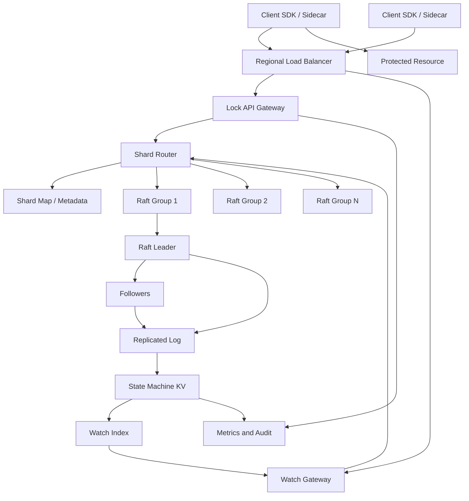
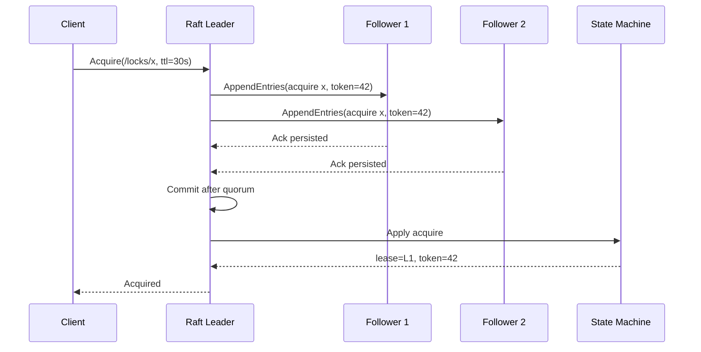
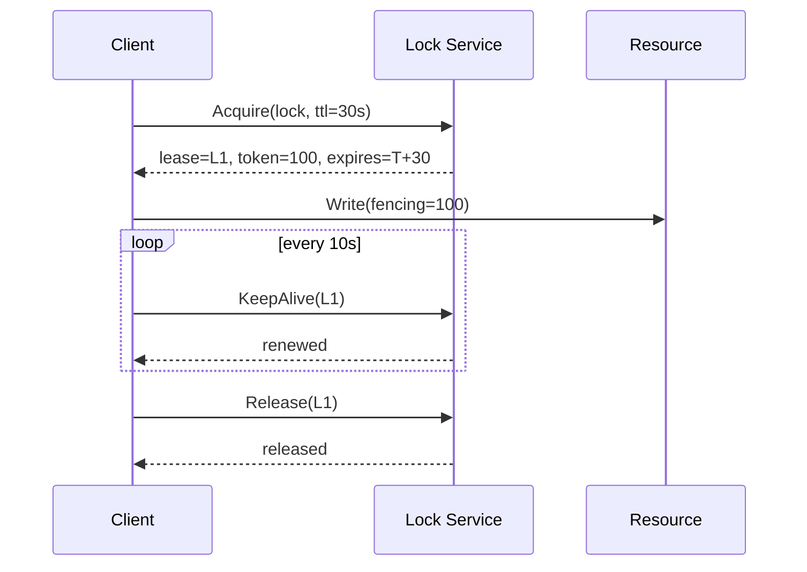
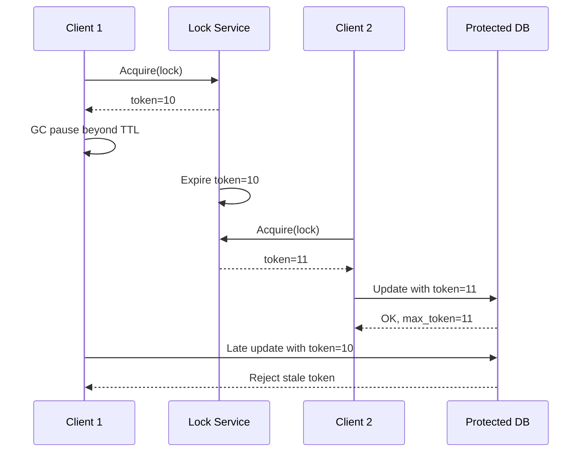
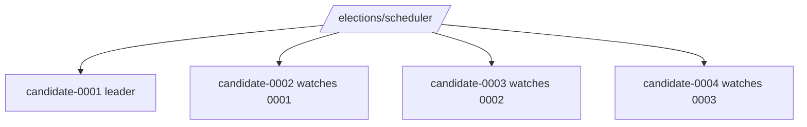
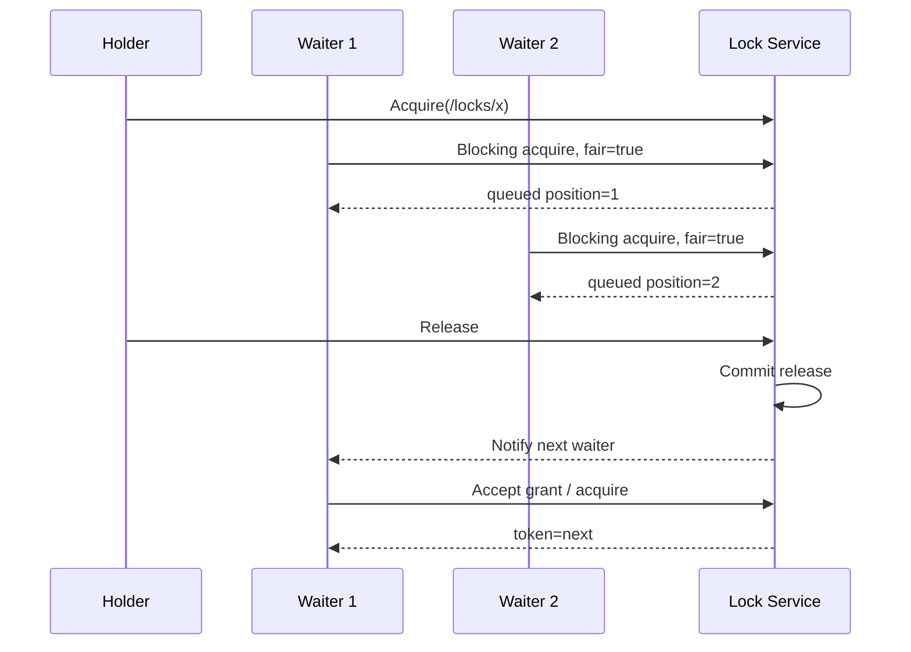
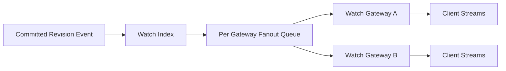

# Distributed Lock Service (Chubby / ZooKeeper / etcd) — HLD

## 1. Problem Statement & Scope

Design a distributed lock service used by many applications to coordinate work across processes and hosts.

Clients acquire a named lock before entering a critical section.

Clients release the lock after completing the protected operation.

The service guarantees at most one committed owner for a lock at a time.

The guarantee is meaningful only when clients also use leases correctly and protected resources validate fencing tokens.

This is a CP coordination system.

When the system cannot prove correctness, it returns an error instead of granting a conflicting lock.

The design is similar to Chubby, ZooKeeper, and etcd lock recipes.

Lock state is stored in a replicated state machine backed by Raft or Paxos.

### In scope

- Named exclusive locks with path-style names.
- Try-lock and blocking lock acquisition.
- Lease TTLs and server-side auto-expiry.
- Client heartbeats / keepalives for lease renewal.
- Mutual exclusion through quorum-committed state.
- Monotonically increasing fencing tokens.
- Watch notifications for release, expiry, and owner changes.
- Fair acquisition mode for contended locks.
- Leader election built on locks or ephemeral sequential nodes.
- Multi-tenant namespaces and ACLs.
- Per-tenant quotas and rate limits.
- Admin inspection of owners, waiters, expiry, and tokens.
- Operational metrics and audit events.

### Out of scope

- Distributed transactions over arbitrary user data.
- Making an unsafe downstream resource safe if it ignores fencing tokens.
- Global active-active locks with low cross-continent latency.
- Running arbitrary user callbacks inside the lock service.
- Full service discovery and configuration management.
- Application-level deadlock prevention across many locks.
- Exact FIFO fairness under every crash, timeout, and reconnection edge case.

### Assumptions

- Clients use an official SDK or sidecar.
- The SDK handles sessions, retries, renewals, watch reconnects, and cancellation.
- A regional deployment has many Raft groups.
- Each Raft group has 3 or 5 replicas across availability zones.
- Each lock maps to exactly one shard / Raft group.
- Client wall clocks are not trusted for correctness.
- Server-side committed state decides lease expiry.
- Clients may pause due to GC, CPU starvation, VM suspension, or OS scheduling.
- Network partitions and packet loss are expected.
- Protected resources can store the highest fencing token accepted.

### Design goals

- Linearizable acquire, release, renew, and token generation.
- No split-brain lock ownership under node failure or network partition.
- Bounded recovery from crashed clients through TTL leases.
- Fast uncontended acquisition within one region.
- Low handoff latency for blocking waiters.
- No busy polling for waiters.
- Correctness over raw throughput.
- Explicit failure semantics.
- Operationally simple primitives that application teams can understand.

## 2. Functional Requirements

### P0 requirements

- Client can open a session.
- Client can acquire a named lock if it is free.
- Client can release a lock it currently owns.
- Client can renew an active lease before expiry.
- Client can issue try-lock and receive immediate success or conflict.
- Client can issue blocking acquire with timeout.
- System guarantees one committed owner per exclusive lock.
- System auto-releases locks after lease expiry.
- System returns a fencing token on every successful acquisition.
- System increments fencing tokens monotonically per lock.
- System supports watch notifications for lock state changes.
- System rejects release by non-owners.
- System rejects stale renewals.
- System preserves idempotent retry results.
- System survives minority replica failures.
- System exposes current lock metadata for debugging.

### P1 requirements

- Fair acquisition using FIFO queue or predecessor watch.
- Leader election helper API.
- Ephemeral sequential node primitive.
- Reentrant lock option scoped to the same session.
- Read/write lock option for shared readers and exclusive writers.
- Namespace-level ACLs.
- Per-tenant QPS quotas.
- Per-lock waiter caps.
- Administrative forced unlock with audit trail.
- Batch keepalive API.
- Client SDK metrics.
- Watch stream backpressure.

### P2 requirements

- Cross-region read-only dashboards.
- Manual disaster recovery failover.
- Deadlock diagnostics for multi-lock clients.
- Priority wait queues.
- Kubernetes Lease API compatibility.
- Formal model checking of the core protocol.

### Core flow

1. Client opens a session.
2. Client calls Acquire with lock name, TTL, mode, and idempotency key.
3. Gateway authenticates and normalizes the lock path.
4. Router maps the lock to a Raft group.
5. Raft leader proposes an acquire command.
6. Followers persist the command.
7. Leader commits after quorum acknowledgement.
8. State machine creates lease and increments fencing token.
9. Client receives lease id, expiry, token, and revision.
10. Client passes the token to the protected resource.
11. Client sends keepalive every TTL / 3.
12. Client releases the lock or the lease expires.
13. Waiters are notified through watches.

### Non-goals clarified

- The service cannot physically stop a paused process from writing to a database.
- The protected resource must validate fencing tokens.
- Blocking acquire is not a tight polling loop.
- Fairness is best effort when clients crash or sessions expire.
- Lease TTLs improve liveness but can cause false expiry.

## 3. Non-Functional Requirements

### Scale

- Peak lock operations: 100,000 ops/s.
- Average lock operations: 40,000 ops/s.
- Connected client sessions: 1,000,000.
- Concurrently held locks: 500,000.
- Active lock names per day: 5,000,000.
- Registered watches at peak: 2,000,000.
- Tenants / services: 10,000.

### Latency targets

| Operation | p50 | p99 | Notes |
|---|---:|---:|---|
| Try acquire uncontended | 10 ms | 50 ms | Single-region quorum write |
| Release | 10 ms | 50 ms | Quorum write |
| KeepAlive batch | 5 ms | 30 ms | Many leases per request |
| Blocking acquire wakeup | 20 ms | 150 ms | After release commit |
| Linearizable read | 5 ms | 30 ms | ReadIndex or quorum |
| Stale admin read | 2 ms | 10 ms | Explicitly marked stale |
| Watch delivery | 20 ms | 200 ms | Best effort after commit |
| Leader failover | 1 s | 5 s | No conflicting owner |

### Availability targets

- 99.95% monthly availability for a regional cluster.
- 3-node consensus group tolerates 1 failure.
- 5-node consensus group tolerates 2 failures.
- Minority partitions cannot make progress.
- Gateway failures should not lose lock state.
- Watch failures should be recoverable by revision replay.

### Consistency targets

- Acquire is linearizable.
- Release is linearizable.
- KeepAlive is linearizable for the lease being renewed.
- Fencing token generation is linearizable.
- Correctness-sensitive reads are linearizable.
- Watch events are ordered by cluster revision.
- Clients must re-read state after watch reconnect if history compacted.

### Durability targets

- No acknowledged acquire is lost after quorum commit.
- No acknowledged release is lost after quorum commit.
- Consensus log is persisted before acknowledgement.
- Snapshots reconstruct current lock state.
- Fencing counters survive leader failover and restore.

### Security targets

- Mutual TLS between clients and service.
- Workload identity for service authentication.
- Namespace ACLs for acquire, release, watch, and admin operations.
- Audit log for forced unlock and ACL changes.
- No secrets stored in lock metadata.

## 4. Back-of-the-Envelope Estimation

### Traffic assumptions

| Input | Value | Rationale |
|---|---:|---|
| Peak operations | 100,000 ops/s | Target peak |
| Average operations | 40,000 ops/s | Peak is 2.5× average |
| Connected clients | 1,000,000 | Large fleet |
| Concurrent locks | 500,000 | Active leases |
| Average TTL | 30 s | Balanced default |
| KeepAlive interval | 10 s | TTL / 3 |
| Watches | 2,000,000 | Waiters and elections |
| Request size | 1 KB | Metadata only |
| Response size | 1 KB | Metadata plus token |
| Replication factor | 3 | Default durability |

### QPS split

| Operation | Percent | Peak QPS | Consensus path |
|---|---:|---:|---|
| Acquire / try-acquire | 25% | 25,000 | Write |
| Release | 20% | 20,000 | Write |
| KeepAlive / renew | 35% | 35,000 | Write, batched |
| Watch registration | 10% | 10,000 | Mixed |
| Linearizable reads | 5% | 5,000 | ReadIndex/quorum |
| Admin / metrics | 5% | 5,000 | Usually stale |
| Total | 100% | 100,000 | - |

### KeepAlive arithmetic

| Quantity | Arithmetic | Result |
|---|---:|---:|
| Concurrent locks | given | 500,000 |
| TTL | given | 30 s |
| KeepAlive interval | 30 s / 3 | 10 s |
| Raw renewals | 500,000 / 10 | 50,000 renewals/s |
| Batch size | assumed | 10 leases/request |
| Network KeepAlive QPS | 50,000 / 10 | 5,000 req/s |
| Burst safety factor | 5,000 × 7 | 35,000 req/s budget |

### Consensus write amplification

| Step | Arithmetic | Peak |
|---|---:|---:|
| Quorum writes | 25k acquire + 20k release + 35k renew | 80,000 writes/s |
| Leader log appends | 80,000 × 1 | 80,000 appends/s |
| Follower sends in 5-node group | 80,000 × 4 | 320,000 messages/s |
| Persisted copies in 5-node group | 80,000 × 5 | 400,000 log records/s |
| Quorum size | floor(5 / 2) + 1 | 3 nodes |

### Shard sizing

| Quantity | Arithmetic | Result |
|---|---:|---:|
| Target writes per Raft group | engineering target | 2,000 writes/s |
| Peak consensus writes | from QPS split | 80,000 writes/s |
| Required groups | 80,000 / 2,000 | 40 groups |
| Headroom | 40 × 2 | 80 groups |
| Replicas per group | 3 default | 240 logical replicas |
| Groups per physical node | 6 to 10 | 40-60 storage nodes |

### Storage arithmetic

| Item | Arithmetic | Result |
|---|---:|---:|
| Active lock records | 500,000 × 256 B | 128 MB |
| Waiter records | 2,000,000 × 128 B | 256 MB |
| Session records | 1,000,000 × 128 B | 128 MB |
| Core in-memory state | 128 + 256 + 128 MB | 512 MB |
| Index/headroom multiplier | 512 MB × 4 | ~2 GB |
| Average log/day | 40,000 × 512 B × 86,400 | 1.77 TB/day |
| RF=3 log/day | 1.77 TB × 3 | 5.31 TB/day before compaction |

### Bandwidth arithmetic

| Traffic | Arithmetic | Result |
|---|---:|---:|
| Client inbound | 100,000 × 1 KB | 100 MB/s |
| Client outbound | 100,000 × 1 KB | 100 MB/s |
| Raft leader egress | 80,000 × 512 B × 4 | ~164 MB/s |
| Watch fanout | 50,000 changes/s × 2 watchers × 1 KB | 100 MB/s |
| Regional total | sum + headers + TLS + headroom | 400-700 MB/s |

### Server estimate

| Component | Target per instance | Peak load | Instances |
|---|---:|---:|---:|
| API gateways | 10,000 req/s | 100,000 req/s | 20 |
| Watch gateways | 100,000 streams | 2,000,000 streams | 40 |
| Raft groups | 2,000 writes/s | 80,000 writes/s | 80 |
| Storage nodes | 6-10 replicas/node | 240 replicas | 40-60 |
| Metrics workers | 20,000 events/s | 150,000 events/s | 12 |

## 5. API Design

Use gRPC for low-latency service-to-service calls and streaming watches.

Expose REST as a thin admin and debugging gateway.

Every mutating API includes `client_request_id`.

Every response includes `cluster_revision`.

### Protobuf sketch

```proto
service LockService {
  rpc OpenSession(OpenSessionRequest) returns (OpenSessionResponse);
  rpc Acquire(AcquireRequest) returns (AcquireResponse);
  rpc Release(ReleaseRequest) returns (ReleaseResponse);
  rpc KeepAlive(stream KeepAliveRequest) returns (stream KeepAliveResponse);
  rpc Watch(WatchRequest) returns (stream WatchEvent);
  rpc GetLock(GetLockRequest) returns (GetLockResponse);
  rpc Campaign(CampaignRequest) returns (CampaignResponse);
  rpc Resign(ResignRequest) returns (ResignResponse);
}
```

### Open session

`POST /v1/sessions`

```json
{
  "tenant_id": "payments",
  "client_id": "host-17-worker-4",
  "requested_timeout_ms": 45000
}
```

```json
{
  "session_id": "sess_9b4",
  "session_timeout_ms": 45000,
  "cluster_revision": 991201
}
```

### Acquire lock

`POST /v1/locks/{name}:acquire`

```json
{
  "session_id": "sess_9b4",
  "client_request_id": "uuid-1",
  "mode": "BLOCKING",
  "lease_ttl_ms": 30000,
  "wait_timeout_ms": 10000,
  "fair": true
}
```

```json
{
  "acquired": true,
  "lock_name": "/jobs/daily-report",
  "lease_id": "lease_123",
  "fencing_token": 88219,
  "expires_at_ms": 1785862618333,
  "cluster_revision": 991260
}
```

### Try-lock conflict response

```json
{
  "acquired": false,
  "reason": "LOCK_HELD",
  "current_owner": "sess_abc",
  "current_fencing_token": 88218,
  "retry_after_ms": 200,
  "cluster_revision": 991260
}
```

### Release

```json
{
  "session_id": "sess_9b4",
  "lease_id": "lease_123",
  "fencing_token": 88219,
  "client_request_id": "uuid-2"
}
```

### KeepAlive batch

```json
{
  "session_id": "sess_9b4",
  "lease_ids": ["lease_123", "lease_456"],
  "client_request_id": "uuid-3"
}
```

### Watch event

```json
{
  "type": "LOCK_RELEASED",
  "lock_name": "/jobs/daily-report",
  "previous_fencing_token": 88219,
  "cluster_revision": 991301
}
```

### Leader election campaign

```json
{
  "session_id": "sess_9b4",
  "election_name": "/elections/scheduler",
  "lease_ttl_ms": 30000,
  "candidate_value": "host-17:9090"
}
```

### Idempotency and errors

- `(session_id, client_request_id)` maps to the committed response.
- Retrying a committed acquire returns the same lease and token.
- Retrying release returns success if the same lease already released.
- Blocking acquire preserves queue position for the same request id.
- Common errors are `NOT_LEADER`, `NO_QUORUM`, `LOCK_HELD`, `LEASE_EXPIRED`, `STALE_TOKEN`, `SESSION_EXPIRED`, `UNAUTHORIZED`, and `RESOURCE_EXHAUSTED`.

## 6. Data Model & Schema

The source of truth is a replicated log plus embedded KV state machine per shard.

RocksDB, BoltDB, or another embedded engine stores compacted state.

The storage engine is not the consistency mechanism.

Consensus over state transitions is the consistency mechanism.

### Core records

| Record | Primary key | Important fields | Indexes |
|---|---|---|---|
| Lock | `(tenant_id, lock_name)` | owner_session_id, lease_id, lease_expires_at_ms, fencing_token, mode, version | owner_session_id, expiry, modified_revision |
| Lease | `(tenant_id, lease_id)` | session_id, lock_name, ttl_ms, expires_at_ms, state | session_id, expires_at_ms |
| Session | `(tenant_id, session_id)` | client_id, principal, expires_at_ms, state | principal, expires_at_ms |
| Waiter | `(tenant_id, lock_name, enqueue_revision, waiter_id)` | session_id, request_id, deadline_ms, mode | session_id, deadline_ms |
| Idempotency | `(session_id, client_request_id)` | operation, result_blob, expires_at_ms | expires_at_ms |
| Watch | `watch_id` | tenant_id, lock_name/prefix, from_revision, gateway_id | lock_name, gateway_id |
| Audit | `event_id` | event_type, lock_name, token, revision, timestamp | tenant_id + revision |

### Lock state transitions

| Current | Event | Next | Notes |
|---|---|---|---|
| unlocked | acquire | locked | Increment fencing token |
| locked | release by owner | unlocked | Notify waiters |
| locked | lease expiry | unlocked | Committed expiry command |
| locked | acquire by other | locked | Conflict or enqueue |
| locked | renew by owner | locked | Extend expiry |
| locked | renew by stale holder | locked | Reject |

### Partitioning

- Canonical key is `(tenant_id, normalized_lock_name)`.
- `shard_id = rendezvous_hash(tenant_id + lock_name) % shard_count`.
- All state for one lock lives in one Raft group.
- Cross-lock atomic acquire is supported only within one shard.
- Per-lock token counters scale better than one global token.

## 7. High-Level Architecture



### Component responsibilities

- Client SDK owns session lifecycle, leader redirects, retry backoff, keepalive batching, and cancellation on lease uncertainty.
- API gateway authenticates requests, enforces quotas, validates names, and forwards writes to the shard leader.
- Watch gateway owns long-lived streams and decouples slow clients from Raft leaders.
- Shard router maps lock names to Raft groups and tracks shard-map revisions.
- Raft group commits all state transitions for its key range.
- State machine stores locks, leases, sessions, waiters, idempotency records, and revisioned change events.
- Metrics and audit pipeline consumes committed events asynchronously.

### Request path

1. Client sends Acquire to gateway.
2. Gateway validates auth, TTL bounds, path, and quota.
3. Router locates owning Raft group and leader.
4. Leader checks idempotency.
5. Leader proposes acquire command to the log.
6. Followers persist and acknowledge.
7. Leader commits after quorum.
8. State machine creates lease and increments token.
9. Gateway returns lease id, token, expiry, and revision.

## 8. Deep Dives

### A. Consensus for correctness

A single node lock service is a SPOF.

If it crashes, clients cannot acquire or renew locks.

If it loses state, it may release locks incorrectly.

Multiple nodes without consensus are worse.

During a network partition, two independent nodes can both grant the same lock.

Therefore lock transitions must be stored in a replicated state machine.

Every acquire, release, renew, and expiry is an ordered log entry.

The leader returns success only after quorum commit.

Any two quorums intersect, so conflicting ownership cannot both commit.



| Replicas | Quorum | Failures tolerated | Comment |
|---:|---:|---:|---|
| 3 | 2 | 1 | Default |
| 5 | 3 | 2 | Critical namespaces |
| 7 | 4 | 3 | Higher latency, rarely needed |

Correctness reads use leader read, Raft ReadIndex, or quorum read.

Follower-local reads are only for explicitly stale metrics and debugging.

### B. Leases and liveness

Without leases, a crashed holder can deadlock the lock forever.

A lease bounds ownership duration.

The client must renew before server-side expiry.

The leader maintains a timer heap or timer wheel of lease expiries.

When a lease reaches expiry, the leader proposes an `ExpireLease` command.

Followers apply expiry only after that command commits.

If the leader fails, the new leader rebuilds timers from committed lease records.



GC pause scenario:

1. Client acquires token 10 with TTL 30 seconds.
2. Client pauses for 90 seconds.
3. Keepalives stop.
4. Lock service expires token 10.
5. Another client acquires token 11.
6. The old client resumes and may still execute.
7. The protected resource must reject token 10.

Network partition scenario:

- A client partitioned away from quorum cannot renew.
- The cluster may expire its lease and grant a newer token.
- The client must stop work when renewals are uncertain.
- If it continues anyway, fencing protects the resource.

| TTL | Benefit | Cost | Use |
|---|---|---|---|
| 5 s | Fast crash recovery | More false expiry and renew load | Short tasks |
| 30 s | Balanced default | Moderate recovery delay | Most services |
| 5 m | Tolerates long pauses | Slow crash recovery | Rare long critical sections |

### C. Fencing token problem

A lease does not physically stop an old process.

A paused client may believe it still owns a lock after the service has expired it.

The classic Kleppmann argument is that lease-based locks are incomplete without fencing.

A fencing token is a monotonically increasing number returned on successful acquire.

The protected resource stores the highest token accepted.

It rejects operations with lower tokens.



```sql
UPDATE protected_resource
SET value = :value,
    max_fencing_token = :token
WHERE id = :id
  AND :token >= max_fencing_token;
```

Token rules:

- Tokens are generated by the consensus state machine.
- Tokens are not generated by clients.
- Per-lock monotonicity is usually sufficient.
- Tokens survive snapshots and failover.
- Every protected write should include the token.
- A resource that ignores tokens can still be corrupted.

### D. Leader election

Leader election is a common locking use case.

Candidates acquire `/elections/name`.

The holder is leader while its lease is valid.

Followers watch the leader lock.

When the lease expires, another candidate campaigns.

The leader must include its fencing token in downstream commands.

ZooKeeper-style ephemeral sequential nodes avoid herd wakeups.



### E. Watches and herd effect

Blocking acquire should not busy poll.

A watch is a notification hint, not the source of truth.

Each event includes a revision.

After disconnect, the client resumes from `from_revision`.

If history compacted, the client performs a fresh linearizable read.

Notifying every waiter on a hot lock creates a thundering herd.

Fair queues and predecessor watches notify only the next eligible waiter.



Watch fanout path:



### F. Leader failover and ambiguous responses

The old leader may commit an acquire and crash before responding.

The client retries with the same request id.

The new leader reads the replicated idempotency record.

It returns the same lease and fencing token.

If the first command did not commit, retrying is safe.

Clients should not change request id for ambiguous retries.

### G. Fairness model

Fair mode orders waiters by committed enqueue revision.

Queue entries are tied to session and deadline.

Expired sessions remove their queue entries.

Timed-out waiters are skipped.

A notified waiter gets a short grant window.

If it disappears, the next waiter is considered.

Non-fair mode is faster and acceptable for low-contention locks.

## 9. Scaling/Caching/Bottlenecks

### Scaling principles

- Scale writes by sharding lock names across many Raft groups.
- Scale connections with stateless API gateways.
- Scale long-lived streams with dedicated watch gateways.
- Spread Raft leaders evenly across storage nodes.
- Keep lock records small.
- Batch keepalives.
- Avoid cross-shard transactions.
- Protect the cluster with quotas and backpressure.

### Caching rules

| Cache | Safe use | Invalidation |
|---|---|---|
| Shard-map cache | Routing | Shard map revision |
| ACL cache | Authorization | ACL revision or short TTL |
| Leader hint cache | Faster retry | `NOT_LEADER` response |
| Follower read cache | Metrics/admin only | TTL and revision label |
| Watch subscription map | Fanout | Stream disconnect |
| Client ownership cache | Never source of truth | Renewal state only |

### Bottlenecks and mitigations

| Bottleneck | Symptom | Mitigation |
|---|---|---|
| Single hot lock | Huge wait queue | Partition work or use predecessor watches |
| Raft fsync latency | High commit p99 | Fast SSDs and batching |
| Leader network egress | Replication lag | More shards and leader balancing |
| KeepAlive storm | Renew QPS spike | Batch, jitter, TTL bounds |
| Watch fanout | Gateway lag | Bounded queues and replay by revision |
| Snapshot compaction | I/O spike | Incremental snapshots and scheduling |

### Hot lock handling

A single exclusive lock is inherently serialized.

No sharding allows two owners for one lock.

If many clients fight for one lock, the correct answer may be redesigning the application.

Options include partitioned locks, work queues with leases, leader election, or idempotent duplicate work.

### Backpressure

- Reject non-critical stale reads before consensus writes.
- Enforce per-tenant QPS limits.
- Enforce per-session outstanding request limits.
- Enforce per-lock waiter caps.
- Drop slow watch streams and force re-read.
- Use SDK exponential backoff with jitter.
- Preserve consensus health over admin convenience.

## 10. Reliability & Consistency

### Consistency model

The service is linearizable within one region and shard.

If Acquire succeeds at revision R, every later linearizable read observes that owner until release or expiry commits.

If Release succeeds at revision R, later operations cannot observe that lease as active.

Fencing tokens extend ordering to external resources when those resources enforce token checks.

### CP partition behavior

The system is CP.

During a network partition, only the quorum side can commit.

Minority clients receive timeouts, `NO_QUORUM`, or `NOT_LEADER`.

The system becomes unavailable rather than incorrect.

This prevents split-brain lock ownership.

### Failure handling

| Failure | Behavior | Safety outcome |
|---|---|---|
| Client crash | Lease expires after TTL | Safe after expiry |
| Client GC pause | Lease may expire while process resumes | Safe only with fencing |
| Gateway crash | Client reconnects | No lock state loss |
| Watch gateway crash | Client resumes from revision | Recoverable until compaction |
| Follower crash | Quorum continues | Safe |
| Leader crash | New leader elected | Safe, brief outage |
| Minority partition | No commits | Unavailable but safe |
| Disk failure | Replica rebuilt from snapshot/log | Safe if quorum remains |

### Split-brain prevention

Quorum intersection prevents two conflicting committed owners.

A stale leader that loses quorum cannot commit.

Followers do not grant locks locally.

Clients treat success as valid only after the service returns a committed response.

### Lease safety details

A client should consider ownership lost when KeepAlive returns `LEASE_EXPIRED`.

A client should consider ownership uncertain when it cannot contact quorum before its safety deadline.

A client should stop protected work on session expiry.

A client should stop protected work when the protected resource rejects its token.

### Disaster recovery

A regional lock service is latency sensitive.

Active-active global locking is avoided in the base design.

Use one active region per namespace.

Replicate snapshots and logs asynchronously to standby.

Failover requires fencing the old primary region.

RPO may be seconds.

RTO may be minutes.

### Observability

- Acquire QPS and latency by shard.
- Release QPS and latency by shard.
- KeepAlive success and failure rate.
- Lease expiry count.
- Fencing token rejection count.
- Watch stream count.
- Watch delivery lag.
- Wait queue length per hot lock.
- Raft leader changes.
- Raft commit latency.
- Quorum availability.
- Disk fsync latency.
- Snapshot duration.

## 11. Trade-offs & Alternatives

| Decision | Option A | Option B | Choice | Reason |
|---|---|---|---|---|
| Consistency model | CP consensus | AP eventual | CP consensus | Mutual exclusion cannot tolerate split-brain |
| Backend | ZooKeeper/etcd style | Custom Redis cluster | ZooKeeper/etcd style | Mature quorum and watch semantics |
| Protocol | Raft | Paxos | Raft | Easier to explain and operate; Paxos also valid |
| Replica count | 3 | 5 | 3 default, 5 critical | Cost/latency vs failure tolerance |
| Recovery | Manual cleanup | TTL leases | TTL leases | Prevents permanent deadlock |
| Stale holder defense | Trust clients | Fencing tokens | Fencing tokens | Required under pause/partition |
| Acquire style | Try only | Try + blocking | Try + blocking | Blocking avoids polling |
| Fairness | Random retry | FIFO/predecessor | Configurable | Fairness costs throughput |
| Reads | Follower reads | Linearizable reads | Mixed | Correct reads need quorum |
| Regions | Active-active | Single active + DR | Single active + DR | Global consensus latency is expensive |

### CP ZooKeeper/etcd vs AP Redis Redlock

| Aspect | CP ZooKeeper/etcd lock | Redis Redlock-style lock |
|---|---|---|
| Core mechanism | Quorum consensus log | Time-based writes to several Redis masters |
| Split-brain behavior | Minority cannot commit | Depends on timing assumptions |
| Linearizability | Yes when configured correctly | Not generally guaranteed |
| GC pause safety | Needs fencing token | Also needs fencing token |
| Operational complexity | Higher | Lower initially |
| Throughput | Lower per shard | Higher simple ops |
| Correctness confidence | High | Controversial for correctness locks |
| Recommended use | Critical locks | Best-effort duplicate-work reduction |

Redis Redlock is controversial because clock, pause, and partition assumptions can break under real failures.

For correctness-critical locking, choose a CP system and use fencing tokens.

Redis can be acceptable when duplicate work is tolerable.

### Lease TTL long vs short

| Choice | Pros | Cons | Use |
|---|---|---|---|
| Short TTL | Fast failover | False expiry and high renew load | Short critical sections |
| Medium TTL | Balanced | Moderate deadlock duration | Default |
| Long TTL | Survives pauses | Slow recovery after crash | Rare long operations |

### Self-hosted consensus vs DB lock

| Alternative | Pros | Cons | Fit |
|---|---|---|---|
| Dedicated Raft service | Strong semantics, watches, leases | Operational complexity | Platform-wide locks |
| SQL `SELECT FOR UPDATE` | Simple and transactional | Tied to one DB | App-local low scale |
| DB advisory lock | Familiar | Connection/session semantics tricky | Internal jobs |
| Queue lease | Natural for work items | Not a general mutex | Task processing |
| Object conditional write | Simple | Weak watch and latency model | Rare low-QPS locks |

### Rejected designs

- Single lock server because it is a SPOF.
- Multi-master lock servers without consensus because they can split brain.
- Client-side-only locks because they cannot coordinate hosts.
- Poll-only blocking acquire because it creates load and slow handoff.
- Client wall-clock expiry because clocks skew and processes pause.
- Global total ordering for every lock because it limits scale.

## 12. Future Improvements

- Publish a TLA+ model for acquire, renew, expire, release, and fencing invariants.
- Provide ready-made fencing integrations for SQL, object stores, Kafka, and schedulers.
- Add SDK linting that warns when callers ignore fencing tokens.
- Add adaptive TTL recommendations based on observed GC pauses and network jitter.
- Add hot-lock diagnostics with suggestions to shard work or use queues.
- Add priority queues for break-glass leadership changes.
- Add starvation-resistant read/write locks.
- Add hierarchical lock APIs with explicit deadlock guidance.
- Add same-shard multi-lock acquire with deterministic ordering.
- Add tenant dashboards for contention and failed renewals.
- Add automated shard rebalancing based on write QPS and leader CPU.
- Add regular chaos tests for partitions, leader crashes, disk stalls, and watch disconnects.
- Add standby-region failover game days and old-primary fencing runbooks.
- Add Kubernetes Lease compatibility.
- Add OpenTelemetry conventions for lock operations.
- Add event export to Kafka for audit analytics.
- Add policy controls for maximum lock hold time.
- Add safe migration tooling from Redis or DB-based locks to CP locks with fencing tokens.
