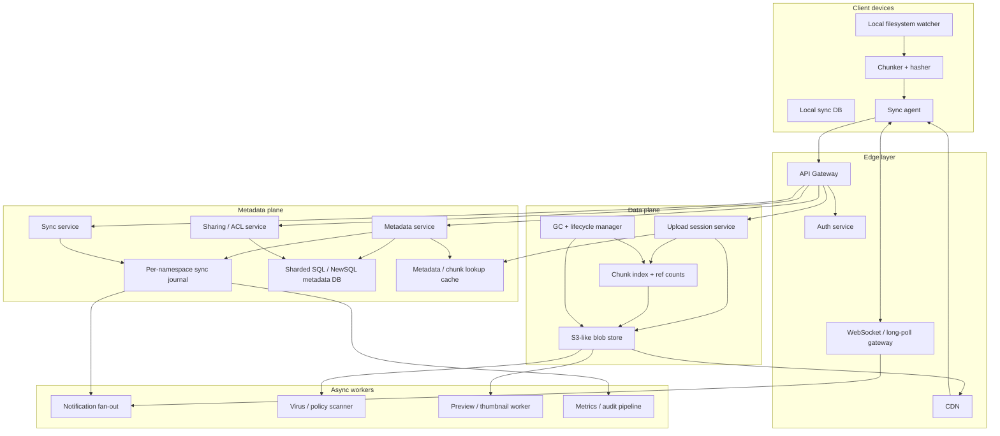
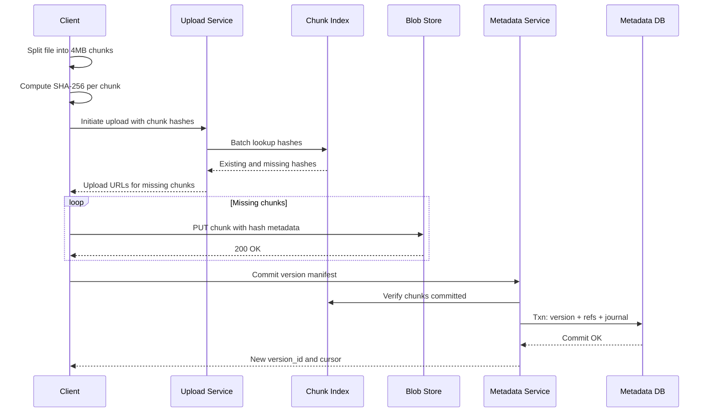
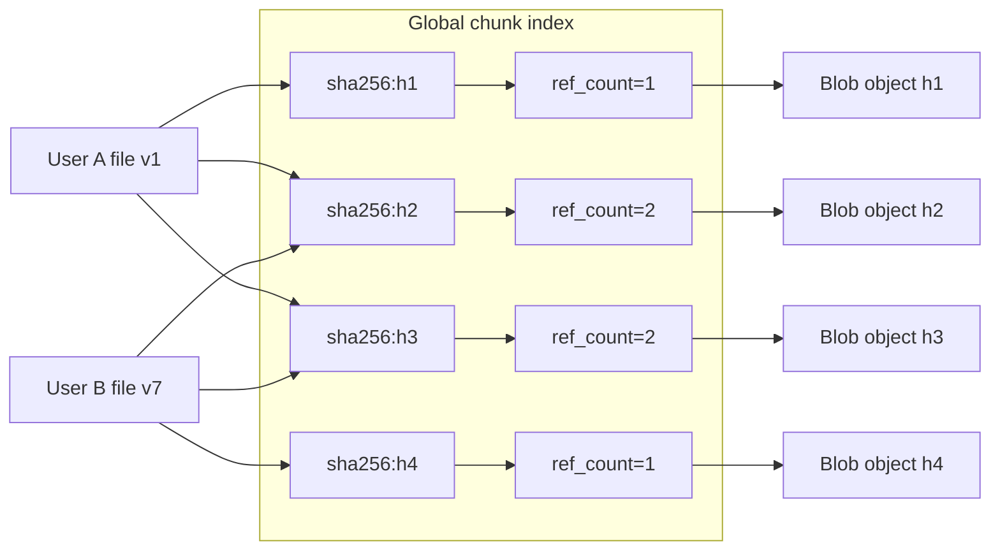
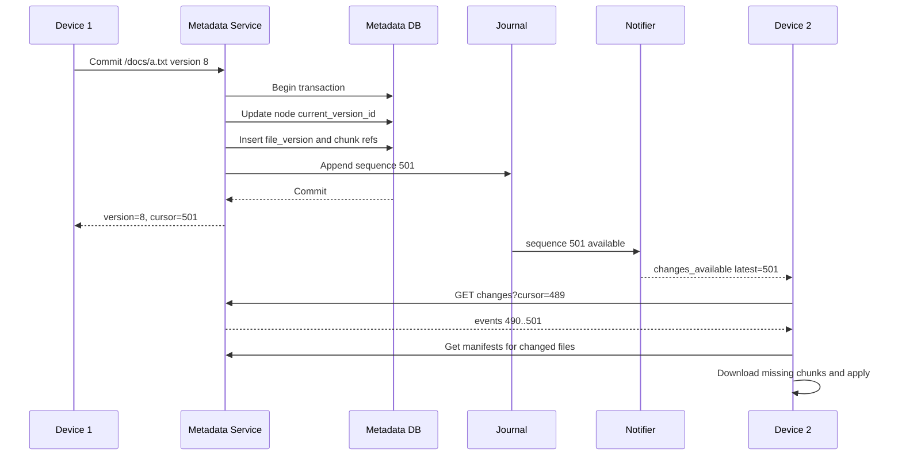
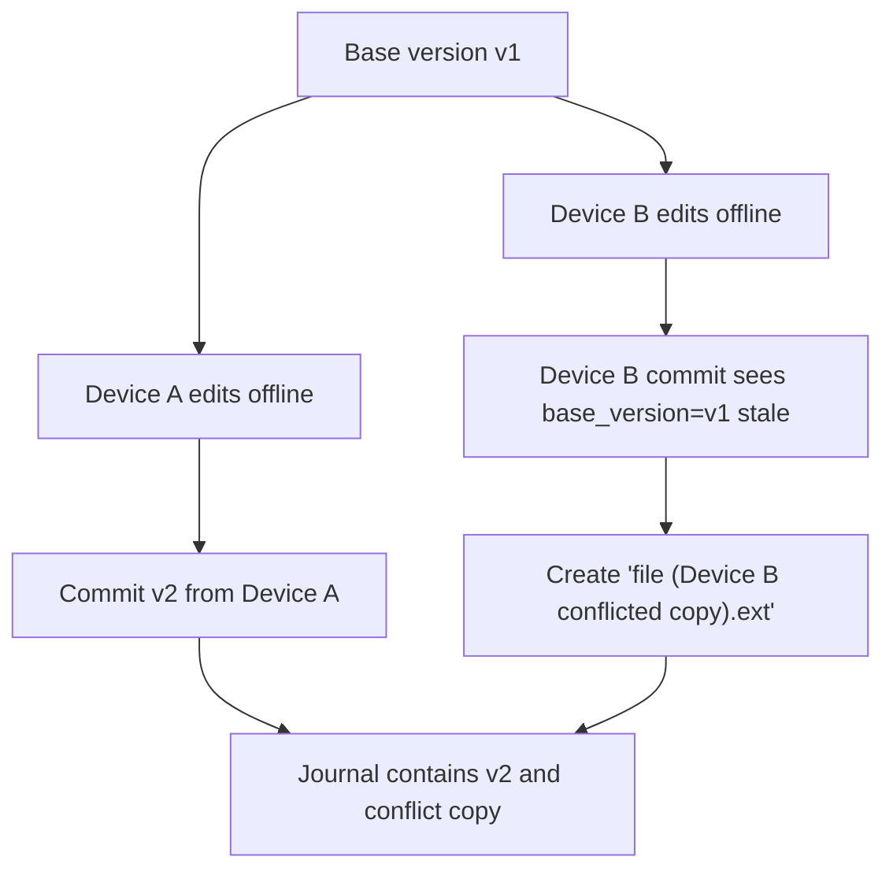
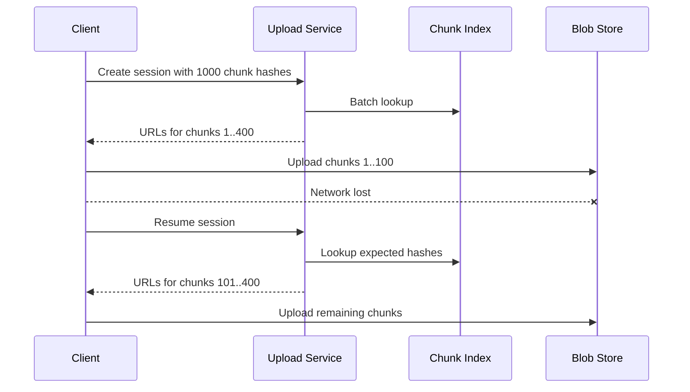
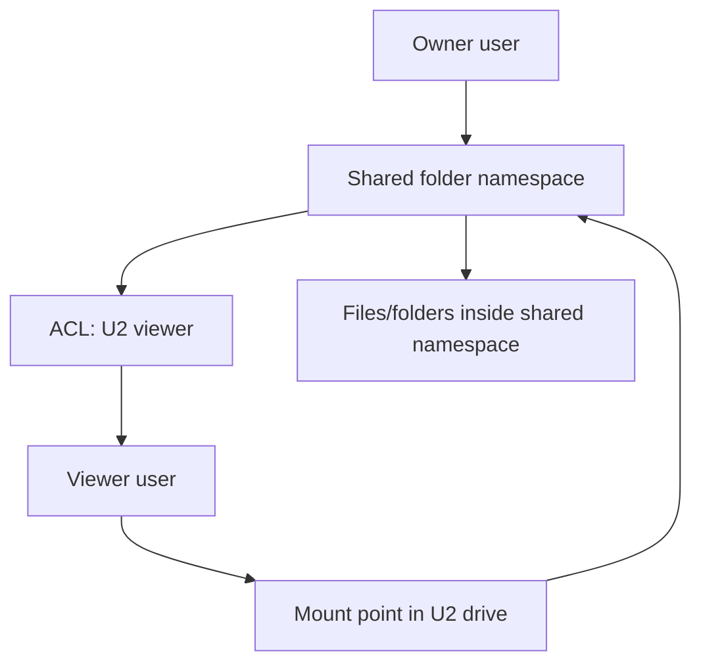

# File Storage & Sync Service (Dropbox / Google Drive) — HLD
## 1. Problem Statement & Scope
Design a cloud file storage and sync service like Dropbox or Google Drive. The system lets users upload, download, organize, share, and synchronize files across devices. The core challenge is not only storing bytes durably, but keeping file trees, versions, and permissions consistent while minimizing bandwidth through chunking, delta sync, and deduplication. We will separate the **metadata plane** from the **data plane**. The metadata plane owns users, namespaces, folders, versions, permissions, and change logs. The data plane owns immutable file chunks stored in an S3-like blob store and served through CDN where possible.
### In scope
- User-owned file and folder hierarchy; Upload and download of small and large files; Resumable chunked uploads; Sync across desktop, mobile, and web clients; Offline edits and eventual reconciliation; Sharing files and folders with permissions; Version history and restore; Conflict detection and conflict copies; Block-level deduplication; Change notifications through WebSocket or long polling; Multi-region durability and disaster recovery.
### Out of scope
- Real-time collaborative document editing like Google Docs operational transforms; Full-text search over file contents; Antivirus / DLP scanning internals; Enterprise admin console details; Billing, quotas beyond basic checks; Media transcoding and previews beyond thumbnail hooks.
### Assumptions
- Files are immutable at the chunk/block layer; File metadata is mutable and versioned; Each logical file has versions; Each version points to an ordered list of content-addressed chunks; Folder sharing can recursively grant access; Users can install multiple clients that maintain a local sync database; Metadata consistency matters more than blob read-after-write consistency.
### Design goals
- Make uploads resumable and efficient; Upload only changed chunks for edited large files; Deduplicate chunks across users; Keep metadata strongly consistent; Keep blob storage highly durable and cost-efficient; Notify clients quickly about remote changes; Support offline-first clients; Degrade gracefully under notification or indexing failures.
## 2. Functional Requirements
### P0 requirements
- Users can upload a file; Users can download a file; Users can create, move, rename, and delete folders; Users can list folder contents; Users can sync changes across devices; Users can resume interrupted uploads; Users can download only missing chunks; Users can share a file or folder with another user; Users can set permissions: owner, editor, viewer; Users can view version history; Users can restore an older file version; Clients can detect remote changes since a cursor; Clients can work offline and replay local changes; System detects conflicting concurrent edits; System preserves both copies when conflict cannot be auto-merged.
### P1 requirements
- Block-level deduplication across all users; Delta sync for large files; CDN-backed public or authorized downloads for hot files; Expiring pre-signed upload and download URLs; Quota enforcement per account; Soft delete and trash restore window; Batch metadata APIs for efficient sync; Upload progress and commit status; File locking or edit leases for optional conflict reduction; Audit log for sharing and permission changes.
### P2 requirements
- Thumbnail and preview generation hooks; Offline selective sync; Team folders; Legal hold and retention policies; Client-side encryption for advanced plans; Regional data residency.
### Core user flows
1. User edits a local file; Desktop watcher sees modified timestamp or filesystem event; Client chunks the file and hashes chunks; Client asks server which chunks already exist; Client uploads missing chunks; Client commits a new file version referencing chunk hashes; Metadata DB appends a journal entry; Notification service wakes other devices; Other devices fetch changes since their cursor; Other devices download only missing chunks.
### Non-goals clarified
- We will not design an editor for simultaneous character-level edits; We will not guarantee instant propagation under partitions; We will not expose raw object store paths to clients; We will not mutate chunks in place.
## 3. Non-Functional Requirements
### Scale
- 100M registered users; 30M DAU; 300M active devices; Average 3 devices per active user; 1B files in metadata; 50PB logical user data initially; 20PB logical new data per year.
### Latency targets
| Operation | p50 | p99 | Notes |
|---|---:|---:|---|
| Folder list | 50 ms | 250 ms | Metadata only |
| Commit metadata | 80 ms | 500 ms | Strongly consistent write |
| Check existing chunks | 80 ms | 400 ms | Batched hash lookup |
| Generate pre-signed URL | 50 ms | 200 ms | Control plane |
| Small file download start | 100 ms | 500 ms | Metadata + CDN redirect |
| Sync change fetch | 100 ms | 700 ms | Cursor based |
| Push notification delivery | 1 s | 10 s | Best effort |
### Availability targets
- Metadata APIs: 99.95% monthly availability; Blob upload/download: 99.99% monthly availability; Notification service: 99.9% monthly availability; Sync should still work by polling when push is unavailable.
### Durability targets
- Blob durability: 11 nines through multi-AZ replication and erasure coding; Metadata durability: no acknowledged metadata commit lost; Journal durability: no committed file change omitted from sync.
### Consistency targets
- Metadata is strongly consistent per namespace; File version commits are atomic; Sharing permission checks are strongly consistent; Blob chunks are immutable and can be eventually visible after upload; A file version is committed only after all referenced chunks are durable; Notifications are at-least-once and may be duplicated; Sync journal is ordered per user namespace.
### Security targets
- TLS for all client-server communication; Encryption at rest for metadata and blobs; Scoped pre-signed URLs; Short-lived access tokens; ACL checks at metadata service before issuing download URLs; Auditability for shares and permission changes.
### Cost targets
- Use object storage rather than database storage for bytes; Use block-level dedup to reduce physical storage; Use CDN for hot downloads; Use erasure coding for cold chunks; Avoid fan-out-heavy persistent push for inactive clients.
## 4. Back-of-the-Envelope Estimation
### User assumptions
| Metric | Assumption |
|---|---:|
| Registered users | 100M |
| Daily active users | 30M |
| Monthly active users | 70M |
| Devices per DAU | 3 |
| Active devices/day | 30M × 3 = 90M |
| Connected sync clients at peak | 10M |
### Storage assumptions
| Metric | Assumption |
|---|---:|
| Avg logical storage per registered user | 500GB |
| Total logical storage | 100M × 500GB = 50,000,000,000GB |
| GB to PB conversion | 1PB = 1,000,000GB |
| Logical storage in PB | 50,000,000,000GB / 1,000,000 = 50,000PB |
| Dedup/compression savings | 30% |
| Physical before durability overhead | 50,000PB × 0.70 = 35,000PB |
| Replication factor equivalent | 3× for hot, 1.5× EC for cold |
| Assume blended overhead | 1.8× |
| Physical durable storage | 35,000PB × 1.8 = 63,000PB |
This is intentionally large because consumer drives accumulate photos and videos. In interviews, we can also state a smaller launch scale, but the architecture should survive hyperscale growth.
### Daily upload assumptions
| Metric | Assumption |
|---|---:|
| DAU | 30M |
| Users uploading per day | 30M × 20% = 6M |
| Avg uploaded logical data/uploader/day | 1GB |
| Daily logical upload | 6M × 1GB = 6PB/day |
| Dedup savings on new upload | 30% |
| Daily physical new chunk data | 6PB × 0.70 = 4.2PB/day |
| Seconds/day | 10^5 |
| Avg upload bandwidth | 4.2PB/day / 10^5s = 42GB/s |
| Peak upload bandwidth | 3 × 42GB/s = 126GB/s |
### Download assumptions
| Metric | Assumption |
|---|---:|
| DAU downloading/syncing | 30M × 50% = 15M |
| Avg downloaded data/downloader/day | 500MB |
| Daily logical download | 15M × 0.5GB = 7.5PB/day |
| Avg download bandwidth | 7.5PB/day / 10^5s = 75GB/s |
| Peak download bandwidth | 3 × 75GB/s = 225GB/s |
| CDN offload | 60% |
| Origin download bandwidth | 225GB/s × 40% = 90GB/s peak |
### File and metadata assumptions
| Metric | Assumption |
|---|---:|
| Avg files per user | 10,000 |
| Total file records | 100M × 10,000 = 1T records |
| Active files touched per uploader/day | 20 |
| Daily metadata writes | 6M × 20 = 120M/day |
| Avg metadata write QPS | 120M / 10^5 = 1,200 QPS |
| Peak metadata write QPS | 3 × 1,200 = 3,600 QPS |
| Folder/list/sync reads per DAU/day | 100 |
| Daily metadata reads | 30M × 100 = 3B/day |
| Avg metadata read QPS | 3B / 10^5 = 30,000 QPS |
| Peak metadata read QPS | 3 × 30,000 = 90,000 QPS |
Metadata QPS is manageable, but the metadata table count is huge and must be sharded by namespace/user.
### Chunk assumptions
| Metric | Assumption |
|---|---:|
| Fixed chunk size | 4MB |
| Daily logical upload | 6PB = 6,000,000GB |
| Chunks/day before dedup | 6,000,000GB × 1024MB/GB / 4MB |
| Chunks/day before dedup result | 1,536,000,000 chunks/day |
| Unique chunks after 30% dedup | 1.536B × 0.70 = 1.075B/day |
| Avg chunk lookup QPS | 1.536B / 10^5 = 15,360 QPS |
| Peak chunk lookup QPS | 3 × 15,360 = 46,080 QPS |
Chunk lookup is a hot path and should use a batched API plus cache.
### Metadata storage sizing
| Entity | Count | Size | Raw size |
|---|---:|---:|---:|
| File/folder rows | 1T | 500B | 500TB |
| Version rows | 3T | 300B | 900TB |
| Version chunk refs | 50,000PB / 4MB = 12.8T refs | 40B | 512TB |
| ACL rows | 5B | 200B | 1TB |
| Journal rows/year | 120M/day × 365 = 43.8B | 300B | 13TB/year |
Indexes and replication can make metadata several PB at mature scale. This justifies sharded SQL/NewSQL rather than a single relational cluster.
### Server estimate
| Component | Peak load | Per-node capacity | Nodes |
|---|---:|---:|---:|
| API gateway | 100k req/s | 10k req/s | 10 + headroom = 30 |
| Metadata service | 90k read QPS + 4k write QPS | 5k QPS | 20 + headroom = 60 |
| Chunk lookup service | 46k QPS | 10k QPS | 5 + headroom = 20 |
| Notification gateway | 10M connections | 100k conns/node | 100 + headroom = 150 |
| Journal consumers | 120M events/day | 1k events/s/node | 2 avg, 10 peak |
The real bottleneck is storage capacity, object-store throughput, and long-lived connection management.
### Bandwidth summary
| Path | Avg | Peak |
|---|---:|---:|
| Upload to origin | 42GB/s | 126GB/s |
| Download logical | 75GB/s | 225GB/s |
| Download origin after CDN | 30GB/s | 90GB/s |
| Metadata traffic | Small | 100k QPS-class |
## 5. API Design
### API style
- REST for external client control plane; gRPC between internal services; WebSocket or long polling for sync notifications; Pre-signed URLs for direct chunk upload/download to object storage; Idempotency keys for mutation APIs; Cursor-based pagination for listing and sync.
### Auth conventions
- `Authorization: Bearer <access_token>`; Token maps to user ID and device ID; Permission checks are done by metadata service; Pre-signed URLs are scoped to chunk hash, operation, expiry, and account.
### Upload initiation
```http
POST /v1/upload-sessions
Idempotency-Key: 4e6e...
Content-Type: application/json
```
```json
{
  "path": "/photos/trip/video.mp4",
  "parent_id": "fld_123",
  "client_file_id": "local-inode-abc",
  "size_bytes": 734003200,
  "mtime_ms": 1785852000000,
  "chunk_size": 4194304,
  "chunk_hashes": ["sha256:a1", "sha256:b2"],
  "base_version_id": "ver_456"
}
```
```json
{
  "upload_session_id": "ups_789",
  "missing_chunks": [
    {
      "hash": "sha256:a1",
      "size_bytes": 4194304,
      "upload_url": "https://blob/upload/..."
    }
  ],
  "already_present_chunks": ["sha256:b2"],
  "expires_at": "2026-08-05T01:05:00Z"
}
```
### Upload chunk
```http
PUT https://blob/upload/{upload_token}
Content-Length: 4194304
Content-SHA256: a1...
```
The blob layer stores the chunk under content hash only after validating bytes match the declared hash.
### Commit uploaded file version
```http
POST /v1/upload-sessions/{upload_session_id}/commit
Idempotency-Key: 88d2...
Content-Type: application/json
```
```json
{
  "path": "/photos/trip/video.mp4",
  "parent_id": "fld_123",
  "base_version_id": "ver_456",
  "chunks": [
    { "hash": "sha256:a1", "offset": 0, "size_bytes": 4194304 },
    { "hash": "sha256:b2", "offset": 4194304, "size_bytes": 4194304 }
  ],
  "client_mutation_id": "dev1-000001"
}
```
```json
{
  "file_id": "fil_111",
  "version_id": "ver_999",
  "rev": 1042,
  "conflict": false,
  "journal_sequence": 981234
}
```
### Download file
```http
GET /v1/files/{file_id}/download?version_id=ver_999
```
```json
{
  "file_id": "fil_111",
  "version_id": "ver_999",
  "size_bytes": 734003200,
  "chunks": [
    {
      "hash": "sha256:a1",
      "offset": 0,
      "size_bytes": 4194304,
      "download_url": "https://cdn/download/..."
    }
  ],
  "expires_at": "2026-08-05T01:05:00Z"
}
```
### List folder
```http
GET /v1/folders/{folder_id}/children?page_size=200&page_token=...
```
```json
{
  "items": [
    {
      "id": "fil_111",
      "type": "file",
      "name": "video.mp4",
      "current_version_id": "ver_999",
      "size_bytes": 734003200,
      "updated_at": "2026-08-05T00:50:00Z"
    }
  ],
  "next_page_token": "..."
}
```
### Get sync changes
```http
GET /v1/sync/changes?cursor=981000&limit=1000
```
```json
{
  "changes": [
    {
      "sequence": 981234,
      "type": "file_version_committed",
      "file_id": "fil_111",
      "parent_id": "fld_123",
      "path": "/photos/trip/video.mp4",
      "version_id": "ver_999",
      "actor_device_id": "dev_a",
      "timestamp": "2026-08-05T00:50:00Z"
    }
  ],
  "next_cursor": 981234,
  "has_more": false
}
```
### Sync notification channel
```http
GET /v1/sync/connect
Upgrade: websocket
```
Server message:
```json
{
  "type": "changes_available",
  "namespace_id": "ns_123",
  "latest_sequence": 981234
}
```
The notification is a hint, not the source of truth. Clients must call `/sync/changes` using their durable cursor.
### Share file or folder
```http
POST /v1/shares
Idempotency-Key: share-123
Content-Type: application/json
```
```json
{
  "resource_id": "fld_123",
  "resource_type": "folder",
  "principal": { "type": "user", "email": "friend@example.com" },
  "role": "viewer",
  "inherit": true
}
```
```json
{
  "share_id": "shr_777",
  "effective_role": "viewer",
  "created_at": "2026-08-05T00:52:00Z"
}
```
### Restore version
```http
POST /v1/files/{file_id}/restore
Idempotency-Key: restore-123
Content-Type: application/json
```
```json
{
  "version_id": "ver_100",
  "client_mutation_id": "dev1-000002"
}
```
### Error model
| HTTP | Code | Meaning |
|---:|---|---|
| 400 | invalid_request | Bad path, hash, or chunk order |
| 401 | unauthenticated | Missing or invalid token |
| 403 | permission_denied | No ACL permission |
| 404 | not_found | Resource does not exist or is hidden |
| 409 | conflict | Base version is stale |
| 413 | quota_exceeded | User or team quota exceeded |
| 429 | rate_limited | Client should back off |
| 500 | internal | Retry with idempotency key |
| 503 | unavailable | Retry with exponential backoff |
## 6. Data Model & Schema
### Storage engines
| Data | Store | Reason |
|---|---|---|
| Users/accounts | SQL/NewSQL | Transactions, uniqueness |
| Namespace/file tree | Sharded SQL/NewSQL | Strong consistency and indexes |
| Versions/chunk refs | Sharded SQL/NewSQL + cold archive | Atomic commits |
| Chunk index | Distributed KV / SQL table | Hash lookup and ref counts |
| Blob chunks | S3-like object store | Cheap durable bytes |
| Sync journal | Partitioned log + SQL materialization | Ordered replay |
| Sessions/connections | Redis/KV | Ephemeral state |
| CDN cache | CDN edge | Hot downloads |
### Core entities
#### users
| Column | Type | Notes |
|---|---|---|
| user_id | UUID | Primary key |
| email | string | Unique |
| status | enum | active, suspended, deleted |
| quota_bytes | bigint | Storage quota |
| used_logical_bytes | bigint | Logical current usage |
| created_at | timestamp |  |
Indexes:
- `UNIQUE(email)`.
#### namespaces
| Column | Type | Notes |
|---|---|---|
| namespace_id | UUID | Primary key |
| owner_user_id | UUID | Root owner |
| type | enum | personal, shared_folder, team |
| root_folder_id | UUID | Root folder |
| region | string | Home region |
| journal_sequence | bigint | Monotonic sequence |
Shard key:
- `namespace_id`.
#### nodes
Represents files and folders in a namespace.
| Column | Type | Notes |
|---|---|---|
| node_id | UUID | Primary key |
| namespace_id | UUID | Shard key |
| parent_id | UUID nullable | Null for root |
| name | string | Name within parent |
| type | enum | file, folder |
| current_version_id | UUID nullable | Files only |
| deleted_at | timestamp nullable | Soft delete |
| created_by | UUID | User |
| updated_at | timestamp | Last metadata change |
| metadata_rev | bigint | Optimistic concurrency |
Indexes:
- `UNIQUE(namespace_id, parent_id, name, deleted_at_null_marker)`; `INDEX(namespace_id, parent_id, name)`; `INDEX(namespace_id, node_id)`; `INDEX(namespace_id, updated_at)`.
#### file_versions
| Column | Type | Notes |
|---|---|---|
| version_id | UUID | Primary key |
| file_id | UUID | Node ID |
| namespace_id | UUID | Shard key |
| version_number | bigint | Monotonic per file |
| size_bytes | bigint | Logical size |
| content_hash | string | Hash of chunk manifest |
| base_version_id | UUID nullable | Parent version |
| created_by | UUID | User |
| created_device_id | UUID | Device |
| created_at | timestamp |  |
| conflict_group_id | UUID nullable | Related conflict set |
Indexes:
- `UNIQUE(namespace_id, file_id, version_number)`; `INDEX(namespace_id, file_id, created_at DESC)`.
#### version_chunks
| Column | Type | Notes |
|---|---|---|
| version_id | UUID | Primary key part |
| namespace_id | UUID | Shard key |
| ordinal | int | Chunk order |
| offset | bigint | Byte offset |
| chunk_hash | string | SHA-256 |
| size_bytes | int | Usually 4MB |
Indexes:
- `PRIMARY KEY(version_id, ordinal)`; `INDEX(chunk_hash)` for ref cleanup jobs.
#### chunks
Global content-addressed chunk index.
| Column | Type | Notes |
|---|---|---|
| chunk_hash | string | SHA-256 primary key |
| size_bytes | int | Validate length |
| storage_class | enum | hot, warm, cold |
| object_key | string | Blob object location |
| ref_count | bigint | Logical references |
| state | enum | pending, committed, gc_pending |
| created_at | timestamp | First seen |
| last_referenced_at | timestamp | Lifecycle |
Indexes:
- `PRIMARY KEY(chunk_hash)`; `INDEX(state, last_referenced_at)`.
#### acl_entries
| Column | Type | Notes |
|---|---|---|
| acl_id | UUID | Primary key |
| resource_id | UUID | Node or namespace |
| resource_type | enum | file, folder, namespace |
| principal_type | enum | user, group, link |
| principal_id | string | User ID, group ID, link ID |
| role | enum | owner, editor, viewer |
| inherited | bool | From parent folder |
| created_by | UUID | User |
| created_at | timestamp |  |
Indexes:
- `INDEX(resource_id, principal_type, principal_id)`; `INDEX(principal_id)`.
#### sync_journal
Append-only per namespace log.
| Column | Type | Notes |
|---|---|---|
| namespace_id | UUID | Partition key |
| sequence | bigint | Monotonic per namespace |
| event_id | UUID | Idempotency |
| event_type | enum | create, update, delete, move, share |
| node_id | UUID | Changed node |
| version_id | UUID nullable | File version |
| payload | JSON | Compact event details |
| actor_user_id | UUID | User |
| actor_device_id | UUID | Device |
| created_at | timestamp |  |
Indexes:
- `PRIMARY KEY(namespace_id, sequence)`; `UNIQUE(namespace_id, event_id)`.
#### upload_sessions
| Column | Type | Notes |
|---|---|---|
| upload_session_id | UUID | Primary key |
| namespace_id | UUID |  |
| user_id | UUID |  |
| target_parent_id | UUID |  |
| target_name | string |  |
| base_version_id | UUID nullable | Conflict detection |
| expected_chunks | JSON | Hash list |
| uploaded_chunks | JSON | Small sessions only or side table |
| status | enum | open, committed, expired |
| expires_at | timestamp | Cleanup |
### Data model invariants
- A committed file version references only committed chunks; Chunks are immutable and addressed by hash; Metadata commit and journal append happen in one transaction; Ref counts are incremented before version commit becomes visible; Ref counts are decremented asynchronously after deletes and retention expiry; Journal sequence is monotonic within a namespace; Client cursor is opaque but maps to journal sequence.
## 7. High-Level Architecture

### Metadata plane
The metadata plane handles small, strongly consistent operations. It owns the namespace tree, file versions, permissions, quota, conflict checks, and journal. The metadata service is stateless and horizontally scalable. The database is sharded by `namespace_id`. Large personal namespaces and team folders can be split into sub-shards by folder subtree if needed.
### Data plane
The data plane handles large byte movement. Clients upload and download chunks directly to object storage through pre-signed URLs. Application servers do not proxy file bytes except for small files or policy-restricted downloads. Chunks are immutable and content-addressed by SHA-256. The chunk index maps hash to object key, state, size, and reference count.
### Sync plane
The sync plane combines:
- Durable journal for source of truth; Push notifications as low-latency hints; Cursor-based pull to fetch ordered changes; Client local database to compare remote and local state.
Notification delivery can be dropped because clients periodically poll.
### Request path summary
Upload path:
1. Client chunks file; Client sends chunk hashes to upload service; Upload service returns upload URLs for missing chunks; Client uploads missing chunks to blob store; Client commits metadata; Metadata transaction writes version, chunk refs, node update, and journal entry; Notification service tells other devices that changes are available.
Download path:
1. Client asks metadata service for version manifest; Metadata service checks permissions; Metadata service returns chunk list and signed CDN URLs; Client downloads chunks in parallel; Client verifies chunk hashes locally; Client reconstructs file.
## 8. Deep Dives
### Deep dive A: Chunking and content-addressed storage
Large files are split into chunks before upload. The default chunk size is 4MB. Each chunk hash is `SHA-256(bytes)`. The version manifest is an ordered list of `(offset, size, hash)`. For an edited file, only chunks whose hashes changed are uploaded.

#### Why chunks are immutable
- Safe to cache forever by hash; Safe to share across users; Easy to verify integrity; Supports dedup and reference counting; Avoids in-place overwrite races.
#### Fixed chunking
With fixed 4MB chunks, offsets are deterministic. This is simple and CPU-light. However, inserting bytes at the beginning shifts all following chunks. That reduces delta sync effectiveness for some file types.
#### Content-defined chunking
Content-defined chunking uses a rolling hash and chooses boundaries based on byte patterns. It handles insertions better because boundaries realign after a short distance. It costs more CPU and creates variable-size chunks. For SDE2 interview scope, fixed chunking is a good default. For advanced clients, we can support content-defined chunking later with manifest versioning.
#### Upload safety
- Client declares chunk hash and size; Blob store or upload service verifies hash before marking chunk committed; A pending chunk not referenced by a committed version can be garbage collected; The commit endpoint checks all chunks are committed; Idempotency prevents duplicate version commits.
### Deep dive B: Deduplication and reference counting
Block-level deduplication avoids storing identical chunks repeatedly. This helps with common OS installers, shared media, copied folders, and repeated file versions. Dedup happens at chunk granularity, not whole-file granularity.

#### Dedup workflow
1. Client sends chunk hashes; Upload service checks chunk index; Existing hashes do not need upload; Missing hashes receive pre-signed upload URLs; On commit, metadata service increments logical references; Chunk ref count is updated transactionally or through an idempotent ref event.
#### Ref count correctness
Reference counts at hyperscale are tricky. We should not depend on a single global strongly consistent counter for every chunk on the hot path. Options:
- Maintain exact ref count in a strongly consistent chunk index; Maintain per-shard reference deltas and compact asynchronously; Use reachability scans for garbage collection.
Preferred approach:
- On commit, write immutable `version_chunks`; Emit idempotent `chunk_ref_added` events; Chunk index applies events with idempotency keys; Garbage collection waits beyond retention windows; Periodic mark-and-sweep validates ref counts before deleting blobs.
#### Security consideration
Cross-user dedup can leak whether a user has a known file if upload responses reveal existence too directly. Mitigations:
- Require client to upload first occurrence per account for sensitive modes; Use private per-tenant dedup for enterprise encrypted spaces; Do not expose global popularity; Rate limit hash probing; Consider convergent encryption only with careful threat modeling.
### Deep dive C: Metadata model and sync journal
The sync journal is the backbone of cross-device consistency. Every metadata mutation appends a journal entry in the same transaction. Clients store the last applied cursor. Clients fetch all changes after the cursor.

#### Client local sync database
Each client maintains:
- Local path to node ID mapping; Last known remote version per file; Last uploaded local content hash; Pending local mutations; Last applied journal cursor; Conflict state.
#### Sync algorithm
1. Watch filesystem events; Debounce noisy events; Scan changed files and compute content hash/chunk hashes; Compare local base version with remote current version; If base is current, upload/commit; If remote changed, classify as conflict or mergeable metadata change; Pull remote journal entries since cursor; Apply remote changes in journal order; Download missing chunks; Advance cursor only after durable local apply.
#### Cursor semantics
- Cursor is monotonically increasing per namespace; Cursor may be encoded and signed; Cursor does not require clients to understand shard topology; If cursor is too old and journal retention expired, client performs full tree reconciliation.
#### Full reconciliation
Full reconciliation is needed when:
- Client was offline beyond journal retention; Local database is corrupted; User restores from backup; Namespace is moved between shards.
The client lists folder tree pages and compares node IDs, metadata revisions, and version IDs.
### Deep dive D: Conflict resolution
Conflicts happen when two devices edit the same base version while offline or concurrently. The system should never silently discard user data. Default behavior is conflict copy.

#### Conflict detection inputs
- `base_version_id` sent by client; Current file `version_id` in metadata DB; Optional version vector per device for richer causality; File path and node ID; Client mutation ID.
#### Simple strategy
Use optimistic concurrency on `base_version_id`. If `base_version_id == current_version_id`, commit normally. If not, create a conflict copy unless the mutation is mergeable. Mergeable examples:
- Local rename and remote content update may be merged; Folder move and child file update may be merged if no path collision; Permission change and content update may be merged.
Non-mergeable examples:
- Two content updates to same file; Two renames to different names; Delete versus edit.
#### Conflict copy naming
Example:
- `report.docx`; `report (Arya's conflicted copy 2026-08-05).docx`.
Conflict copies are normal files with their own versions. Users can manually merge and delete one.
#### Version vectors
Version vectors can represent causality across devices:
- Device A has counter 10; Device B has counter 7; A version vector `{A:10, B:7}` means the version includes those histories.
Pros:
- Better detection of concurrent edits; Useful for distributed offline scenarios.
Cons:
- More metadata; Harder to explain and debug; Still cannot auto-merge arbitrary binary files.
Preferred interview answer:
- Use optimistic base-version check for MVP; Add version vectors for advanced clients and shared folders; Always preserve data through conflict copies.
### Deep dive E: Consistency model
Metadata and blobs have different consistency needs. Metadata is the source of truth for what a user sees. Blobs are immutable content referenced by metadata.
```mermaid
flowchart LR
    C["Client"]
    B["Blob Store"]
    CI["Chunk Index"]
    M["Metadata Service"]
    DB["Strong Metadata DB"]
    J["Journal"]
    C --> B
    B --> CI
    C --> M
    M --> CI
    M --> DB
    DB --> J
    B -.eventual visibility.-> C
    DB --strong commit.-> M
```
#### Strong metadata operations
- Create file node; Rename folder; Move file; Update current version pointer; Add share permission; Restore version; Append journal sequence.
These require transactions.
#### Eventually consistent blob operations
- Uploaded chunk replication; Chunk lifecycle class transition; CDN propagation; Ref count compaction; Thumbnail generation.
These can lag because the file version is not visible until metadata commit succeeds.
#### Commit ordering
1. Upload chunks to blob store; Validate chunk hashes; Mark chunks committed in chunk index; Begin metadata transaction; Verify permissions and quota; Insert file version and chunk refs; Update file current version; Append journal row; Commit transaction; Emit notification after commit.
If notification fails, sync still works through polling. If metadata commit fails, unreferenced uploaded chunks are later garbage collected.
### Deep dive F: Large file upload and resume
Large files may take minutes or hours to upload. The upload session tracks intended chunks and completion. Clients can resume after network failure by re-querying missing chunks.

#### Resume properties
- Upload session has expiry; Chunk uploads are idempotent by hash; Already uploaded chunks are never re-uploaded; Commit is idempotent by session and mutation ID; Client can parallelize chunk uploads with bounded concurrency.
### Deep dive G: Sharing and permissions
Sharing is metadata-only but must be strongly consistent. For shared folders, permissions may be inherited by descendants. Computing inherited ACLs recursively at read time can be expensive. Options:
- Store ACL only at shared root and walk ancestors on access; Materialize effective ACLs for descendants; Use namespace boundaries for shared folders.
Preferred approach:
- Treat a shared folder as a namespace mount; Store explicit ACL on namespace root; Check namespace membership for common operations; Use materialized permission cache with short TTL; Invalidate cache on ACL journal events.

### Deep dive H: Garbage collection and retention
Deletes should not immediately delete chunks. Reasons:
- Users expect trash restore; Version history may reference old chunks; Ref count updates can lag; Object-store deletion is irreversible.
GC stages:
1. User deletes file; Node marked deleted and journaled; File remains in trash for retention period; After retention, versions are marked expired; Chunk references are decremented through events; Chunk enters `gc_pending` if no references; Mark-and-sweep verifies no live version references chunk; Blob object is deleted or moved to deep archive first.
## 9. Scaling/Caching/Bottlenecks
### Sharding strategy
Metadata is sharded by `namespace_id`. This keeps file tree transactions local for most operations. Personal drive operations stay within one namespace. Shared folders are separate namespaces and mounted into user trees. For very large team namespaces:
- Split by top-level folder; Use directory partition IDs; Keep cross-partition moves as transactional saga or disallow huge atomic moves; Maintain global namespace routing table.
### Metadata cache
Cache candidates:
- User account and quota; Namespace routing; Folder listings for hot folders; Permission evaluation; Chunk existence lookups; File version manifests for hot downloads.
Invalidation:
- Journal event invalidates node and parent folder cache; ACL event invalidates permission cache; Manifest cache immutable by version ID and can use long TTL; Current file pointer cache must be short TTL or write-through invalidated.
### CDN strategy
CDN caches immutable chunks by hash. A chunk URL can include a signed token and expiry. Since chunk content never changes, cache invalidation is easy. Hot public/shared files benefit heavily from CDN. For private files:
- Use signed CDN URLs; Keep short expiry; Enforce permission before URL generation; Optionally use tokenized cookies for batch download.
### Hot chunk problem
Popular chunks can be downloaded by millions of users. Examples:
- Public shared file; Common installer; Viral video.
Mitigations:
- CDN edge caching; Multi-origin object-store replicas; Request coalescing at CDN; Adaptive pre-warming for trending shares; Rate limit abusive downloads.
### Hot folder problem
Large shared folders with many active collaborators can create metadata hot shards. Mitigations:
- Namespace sharding by subtree; Folder listing pagination; Separate write journal partitions for subtrees; Cache immutable historical versions; Batch sync changes; Collapse frequent notifications into latest-sequence hints.
### Notification scaling
10M concurrent connections cannot be handled by metadata service. Use stateless notification gateways with connection state in memory. Route user/device connections by consistent hashing. Notifier publishes `namespace_id/latest_sequence` events. Gateway maps subscribed devices and sends hints. If a gateway fails, clients reconnect and fetch changes by cursor.
### Upload bottlenecks
Potential bottlenecks:
- Client CPU hashing large files; Chunk existence lookup QPS; Object-store PUT throughput; Commit transaction size for huge files.
Mitigations:
- Parallel hashing with bounded CPU; Batch hash lookup; Bloom filter or cache for popular chunks; Multipart upload to object store; Store large manifests in pages; Limit chunks per commit request and use manifest object if needed.
### Metadata bottlenecks
Potential bottlenecks:
- Folder with millions of children; Many clients syncing same shared namespace; Global chunk ref count contention; Cross-region writes.
Mitigations:
- Paginated folder lists; Secondary indexes on `(parent_id, name)`; Journal compaction snapshots; Local leader per namespace; Eventual ref count aggregation; Regional home for each namespace.
### Backpressure
- API gateway rate limits per user and device; Upload service caps concurrent chunk uploads per client; Metadata service rejects large batch commits over limits; Notification service drops low-priority hints under overload; Clients use exponential backoff with jitter.
## 10. Reliability & Consistency
### Blob durability
Blob chunks are stored across multiple availability zones. Hot chunks can use 3-way replication for low latency. Cold chunks can use erasure coding, such as 10 data + 4 parity. Lifecycle manager moves chunks based on age and access frequency. Target durability is 11 nines.
### Metadata durability
Metadata DB uses synchronous replication within a region. For NewSQL, consensus groups replicate shards. A metadata transaction is acknowledged only after quorum commit. Journal append is part of the same transaction or same consensus log. Backups and point-in-time recovery are required.
### Multi-region design
Each namespace has a home region. Writes route to the home region to preserve ordering. Reads can be served from local read replicas when slightly stale views are acceptable. Permission checks and commits go to the leader. Blobs are replicated or lazily cached across regions. Disaster recovery can promote a secondary region.
### Failover behavior
| Failure | Behavior |
|---|---|
| API gateway node dies | Load balancer routes around it |
| Metadata service node dies | Stateless retry on another node |
| Metadata DB shard leader dies | Consensus elects new leader |
| Blob store AZ fails | Read from another replica or EC reconstruct |
| CDN unavailable | Fallback to origin signed URLs |
| Notification gateway dies | Clients reconnect and poll |
| Journal consumer lag | Notifications delayed, source journal intact |
| Chunk index lag | Commit waits or retries verification |
### Idempotency
Idempotency is critical because clients retry under flaky networks. Idempotent keys:
- Upload session creation uses `Idempotency-Key`; Chunk upload is idempotent by content hash; Commit uses `client_mutation_id`; Share creation uses idempotency key; Restore uses idempotency key; Journal event has unique event ID.
### Retry rules
- Retry 429 and 503 with exponential backoff and jitter; Retry idempotent 500 responses; Do not retry 403; Re-query upload session after network failure; Re-fetch sync changes after reconnect.
### Consistency choices
| Area | Model | Reason |
|---|---|---|
| File tree metadata | Strong per namespace | Avoid lost updates and path ambiguity |
| File version pointer | Strong | User must see correct latest version |
| ACL changes | Strong | Security-sensitive |
| Blob chunk storage | Eventual after upload | Immutable and referenced only after commit |
| CDN cache | Eventual | Versioned immutable URLs |
| Notifications | At-least-once best effort | Cursor pull is source of truth |
| Ref count cleanup | Eventual | Deletion can be delayed safely |
### Data loss prevention
- Never overwrite old versions immediately; Keep version history and trash retention; Create conflict copies for concurrent writes; Verify chunk hash on upload and download; Advance client cursor only after local durable apply; Use periodic reconciliation.
### Monitoring
Key metrics:
- Upload success rate; Commit latency p50/p99; Chunk dedup hit rate; Chunk hash lookup QPS; Blob PUT/GET error rate; Sync cursor lag; Notification delivery lag; Metadata DB leader failovers; Journal append latency; Ref count mismatch rate; CDN hit ratio.
Alerts:
- Commit error rate above threshold; Journal lag above minutes; Blob durability repair backlog growing; Metadata shard CPU hot; CDN origin bandwidth spike; Chunk index lookup latency high.
## 11. Trade-offs & Alternatives
| Decision | Option A | Option B | Choice | Reason |
|---|---|---|---|---|
| Blob durability | 3-way replication | Erasure coding | Hybrid | Replication for hot latency, EC for cold cost |
| Chunking | Fixed 4MB | Content-defined | Fixed initially | Simple, predictable, lower CPU |
| Delta sync | Whole-file upload | Block-level upload | Block-level | Saves bandwidth for large edited files |
| Storage address | Path-based blobs | Content hash blobs | Content hash | Enables dedup and integrity checks |
| Metadata store | NoSQL KV | SQL/NewSQL | SQL/NewSQL | Strong transactions for tree and ACLs |
| Metadata consistency | Strong | Eventual | Strong per namespace | Prevents lost updates and security bugs |
| Blob consistency | Strong | Eventual | Eventual | Immutable chunks tolerate lag |
| Sync delivery | Push fan-out | Poll only | Hybrid | Push for latency, poll for reliability |
| Notification payload | Full change | Hint cursor | Hint cursor | Reduces fan-out payload and duplicates are safe |
| Conflict resolution | Last-writer-wins | Conflict copies | Conflict copies | Preserves user data |
| Version causality | Base version only | Version vectors | Base first, vectors later | Good MVP with path to richer sync |
| Sharing model | Recursive ACL rows | Namespace mounts | Namespace mounts | Easier shared folder isolation |
| Ref counting | Synchronous global counter | Event + sweep | Event + sweep | Avoids hot counter bottleneck |
| Upload path | Proxy through app | Direct to blob | Direct to blob | Avoids app bandwidth bottleneck |
| Download path | App streaming | CDN signed URLs | CDN signed URLs | Scales hot downloads |
| Large manifest | DB rows only | Manifest object | DB rows + page large | Queryable normal case, scalable large case |
| Multi-region writes | Active-active | Home-region leader | Home-region leader | Simpler ordering and conflict semantics |
| Encryption | Server-side only | Client-side optional | Server-side default | Preserves dedup and usability |
### Replication vs erasure coding
Replication is faster to read and repair. It costs roughly 3× storage. Erasure coding is cheaper for cold data. It costs more CPU and can increase tail latency. A mature storage service uses both.
### Fixed vs content-defined chunking
Fixed chunking is easy to implement and debug. Content-defined chunking improves dedup after insertions. However, variable chunks complicate manifests, caching, and client CPU. For an interview MVP, fixed chunking is acceptable. For a storage-heavy product, content-defined chunking may be added later.
### Strong vs eventual metadata
Strong metadata simplifies user experience and security. Eventual metadata could increase availability under partitions. But file tree operations and permissions are correctness-sensitive. We choose CP behavior for metadata within a namespace.
### Fan-out push vs polling
Push gives near-real-time sync. Polling is simpler and robust. Push at massive connection scale is expensive. Hybrid design uses push as a hint and cursor polling as truth.
## 12. Future Improvements
- Add content-defined chunking for better delta sync after insertions; Add binary diffing for specific formats such as VM images; Add end-to-end encryption with per-folder keys; Add tenant-local dedup for encrypted enterprise accounts; Add file content indexing and search; Add ML-based photo and document classification; Add richer sharing policies and admin controls; Add legal hold and retention workflows; Add regional residency controls per namespace; Add offline selective sync policies; Add bandwidth-aware client scheduling; Add LAN sync for devices on the same network; Add peer-assisted downloads for enterprise LANs; Add adaptive chunk size based on file size and type; Add CRDT metadata for selected collaborative folders; Add real-time co-authoring as a separate document service; Add stronger version-vector-based conflict UI; Add preview generation for images, videos, PDFs, and Office docs; Add ransomware detection using unusual change patterns; Add bulk restore to a timestamp; Add audit export for enterprise customers; Add customer-managed keys; Add automated cold data archival; Add per-file popularity tracking for CDN pre-warming; Add namespace migration tooling for hot shards; Add chaos testing for blob store and metadata failover; Add formal SLO dashboards per plane; Add client health diagnostics and sync repair tools; Add differential privacy for aggregate dedup metrics; Add quota forecasting and user cleanup recommendations.
