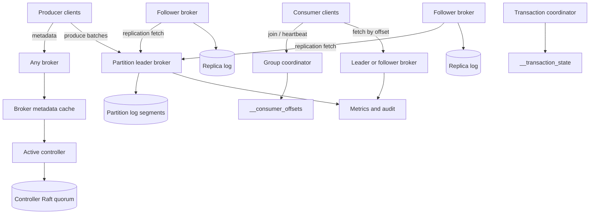
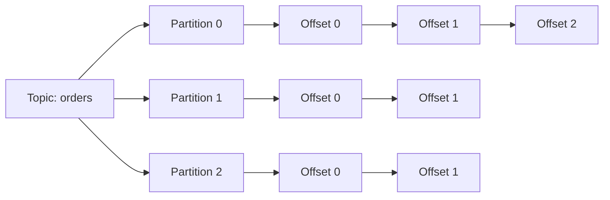
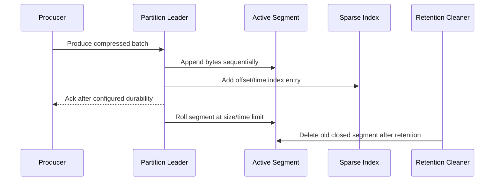
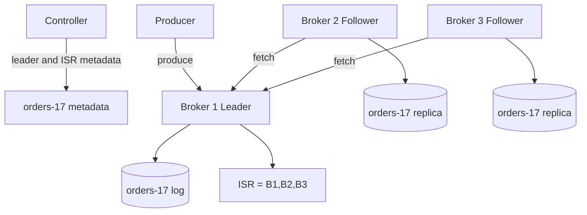
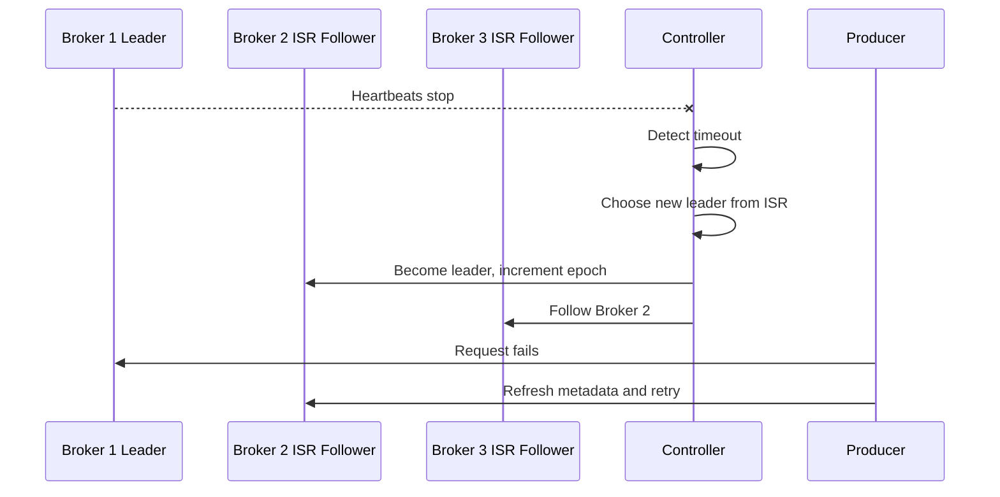
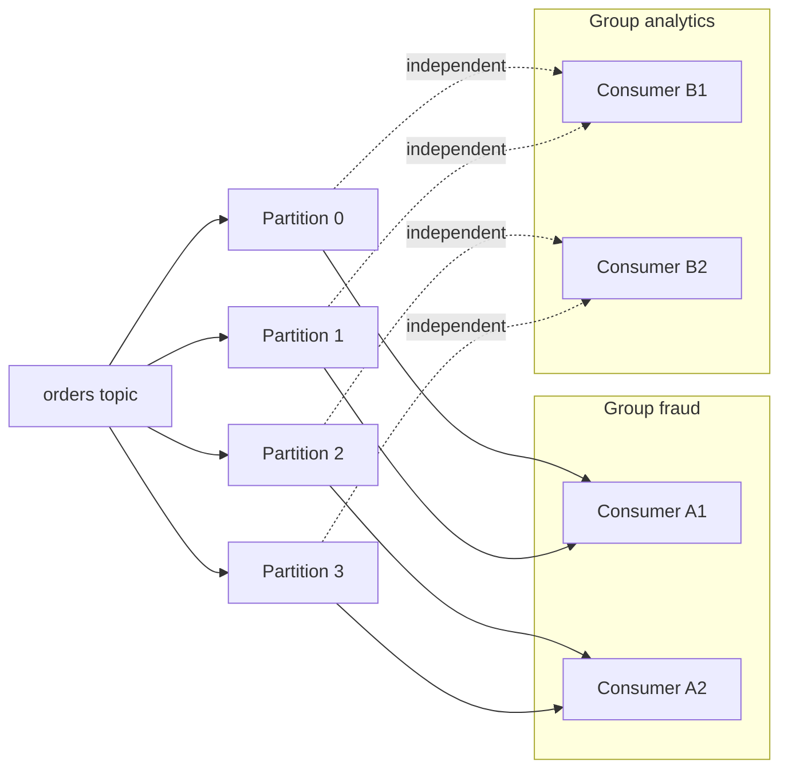
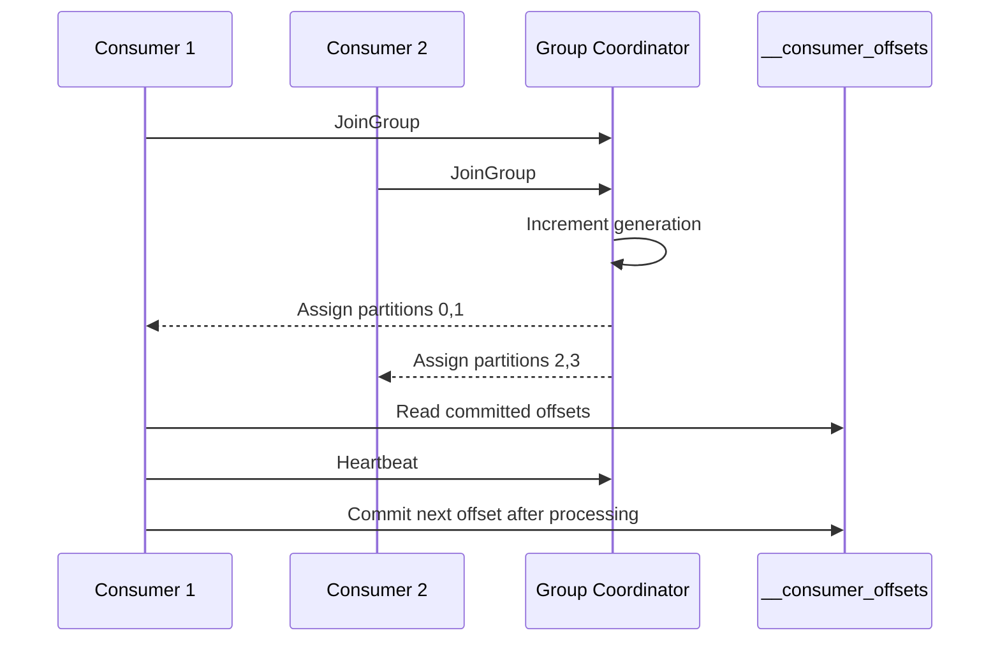
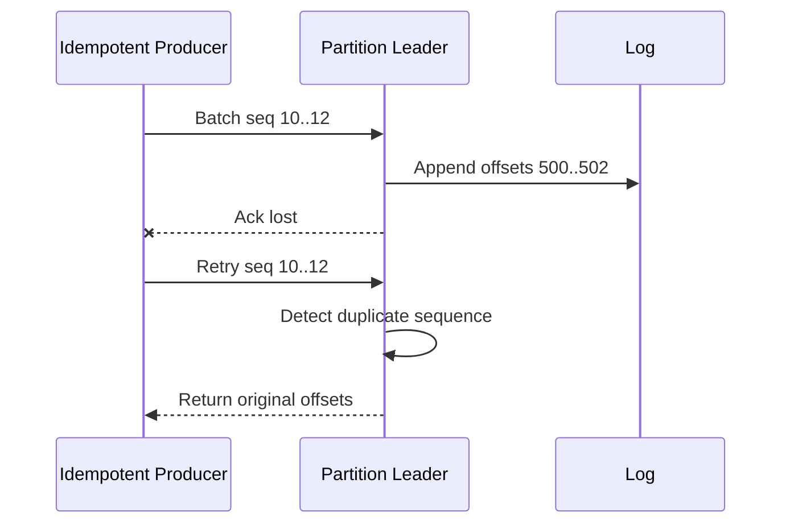
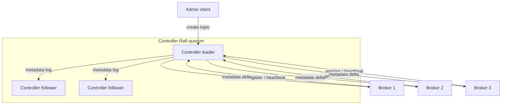
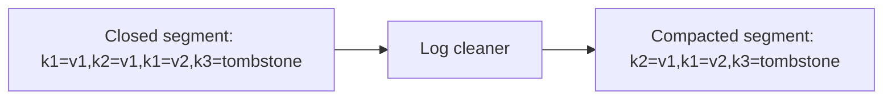

# Kafka-like Distributed Messaging System — High-Level Design
## 1. Problem Statement & Scope
Design a Kafka-like distributed messaging system: a partitioned, replicated, durable commit-log broker for high-throughput publish/subscribe workloads. The platform should let producers append records to topics, let consumers read and replay records by offset, and let independent consumer groups process the same data at different speeds.
Core model:
- A topic is a named stream.
- A topic is split into partitions.
- A partition is an ordered immutable append-only log.
- Each record has a monotonically increasing offset within one partition.
- Producers write to partition leaders.
- Consumers pull records from assigned partitions.
- Consumer offsets are independent from log retention.
In scope:
- Topic creation, metadata discovery, and config changes.
- Producer publish path, batching, compression, retries, and idempotence.
- Durable partition logs with segment files and sparse indexes.
- Leader/follower replication, ISR, high watermark, and leader election.
- Consumer groups, offset commits, heartbeats, and rebalances.
- Retention by time/size and optional log compaction.
- At-most-once, at-least-once, and broker-level exactly-once options.
- Controller/metadata quorum, observability, quotas, ACLs, and failure handling.
Out of scope:
- Full stream SQL or complex stream processing APIs.
- Arbitrary updates to old records.
- Global total order across all topic partitions.
- Managed SaaS billing and tenant onboarding UX.
- Complete schema registry implementation.
- Exactly-once side effects in external systems that do not provide idempotency or transactions.
Success criteria:
- Sustain 1M messages/s average ingest and 3M messages/s peak ingest.
- Preserve per-partition ordering and replayability within retention.
- Survive one broker failure without losing committed records for RF=3, min.insync.replicas=2, and acks=all.
- Scale producers and consumers horizontally through partitions.
- Let operators choose durability/latency trade-offs per topic and producer.
## 2. Functional Requirements
P0 producer requirements:
- Publish records to topics as single records or batches.
- Include optional key, value, headers, timestamp, partition, compression, and transactional ID.
- Route the same key to the same partition while partition count is stable.
- Use round-robin or sticky partitioning for keyless records.
- Return topic, partition, base offset, last offset, and leader epoch on success.
- Support acks=0, acks=1, and acks=all.
- Support idempotent retries using producer ID, epoch, and sequence numbers.
- Support transactional writes across partitions for exactly-once broker pipelines.
- Discover partition leaders from metadata available through any broker.
P0 consumer requirements:
- Subscribe to one or more topics.
- Join named consumer groups.
- Poll records from assigned partitions by offset.
- Seek to earliest, latest, timestamp-derived, or explicit offset.
- Commit offsets after processing.
- Replay retained records independently from other consumer groups.
- Rebalance partition assignments when group membership changes.
- Support read_uncommitted and read_committed isolation.
P0 topic/log requirements:
- Create, describe, alter, and delete topics.
- Configure partition count, replication factor, retention.ms, retention.bytes, cleanup.policy, segment.bytes, and min.insync.replicas.
- Store each partition as immutable segment files with sparse indexes.
- Guarantee ordering within a partition only.
- Retain records independent of consumer progress.
- Delete old closed segments by time/size retention.
- Compact keyed topics by keeping latest value per key and tombstones.
P0 replication and coordination requirements:
- Each partition has one leader and multiple follower replicas.
- Producers write only to leaders.
- Followers replicate by fetching from leaders.
- Track ISR, the in-sync replica set.
- Advance high watermark when records are replicated to required ISR members.
- Elect new leaders from ISR when leaders fail.
- Use leader epochs to fence stale leaders.
- Store cluster metadata in a strongly consistent controller quorum.
P1 operational requirements:
- Metrics for bytes in/out, p50/p99 latency, request errors, consumer lag, disk usage, ISR changes, and controller health.
- Partition reassignment and leader balancing.
- Broker draining and rolling upgrades.
- TLS, authentication, ACLs, audit logs, and quotas.
- Alerts for offline partitions, under-replication, disk fullness, and lag near retention.
## 3. Non-Functional Requirements
| Category | Target | Notes |
|---|---:|---|
| Average ingest | 1M msg/s | Primary sizing target |
| Peak ingest | 3M msg/s | 3× average burst |
| Message size | 1KB | Payload plus small headers |
| Compression | 2:1 | Batch-level compression |
| Hot retention | 7 days | Local broker disks |
| Availability | 99.95% | Single-region broker API |
| Produce latency | p50 5–10ms, p99 50–100ms | Depends on acks and ISR health |
| Fetch latency | p50 5–20ms | When data is available |
| Durability | Survive one broker loss | RF=3, min ISR=2, acks=all |
| Metadata consistency | Linearizable | Controller quorum |
Performance requirements:
- Sequential disk I/O for the hot append path.
- Batching to reduce request, syscall, and replication overhead.
- Compression to reduce network, disk, and page-cache pressure.
- OS page cache as the primary log cache.
- Zero-copy sendfile-style fetch where possible.
- Pull-based consumers for natural backpressure.
- Partition-level parallelism for horizontal scale.
Security requirements:
- TLS for client-broker and broker-broker traffic.
- SASL/OAuth or mutual TLS authentication.
- ACLs for topic read/write, group access, cluster admin, and transactional IDs.
- Per-client and per-topic quotas.
- Audit trail for admin operations.
Consistency requirements:
- One leader serializes appends for each partition.
- Offsets define total order only within a partition.
- Consumers normally read up to high watermark.
- read_committed consumers read only committed transactional data.
- Exactly-once is limited to broker-coordinated read-process-write flows.
## 4. Back-of-the-Envelope Estimation
README conventions used: 1 day ≈ 86,400s ≈ 10^5s, peak ≈ 2–3× average, replication factor 3 for durable storage.
| Input | Value | Notes |
|---|---:|---|
| Average ingest rate | 1,000,000 msg/s | Given target |
| Peak ingest rate | 3,000,000 msg/s | 3× average |
| Average record size | 1KB | Rounded payload + headers |
| Compression ratio | 2:1 | Stored as compressed batches |
| Replication factor | 3 | Default durability |
| Hot retention | 7 days | Local broker disks |
| Avg consumer fan-out | 3 groups | Same topic read by multiple apps |
| Usable disk per broker | 8TB | After reserve |
| Safe broker write throughput | 500MB/s | Sustained sequential budget |
| Safe broker network throughput | 1GB/s | 10Gbps class with headroom |
Ingest arithmetic:
```text
Average uncompressed ingest = 1,000,000 msg/s × 1KB/msg
                            = 1,000,000KB/s ≈ 1GB/s
Average compressed leader writes = 1GB/s ÷ 2 = 0.5GB/s
Average physical replica writes = 0.5GB/s × RF 3 = 1.5GB/s
Peak uncompressed ingest = 3,000,000 msg/s × 1KB/msg = 3GB/s
Peak compressed leader writes = 3GB/s ÷ 2 = 1.5GB/s
Peak physical replica writes = 1.5GB/s × RF 3 = 4.5GB/s
```
Storage arithmetic:
```text
Compressed logical data/day = 0.5GB/s × 10^5s = 50,000GB/day = 50TB/day
Physical data/day with RF=3 = 50TB/day × 3 = 150TB/day
7-day hot retention = 150TB/day × 7 = 1,050TB ≈ 1.05PB
Add 25% headroom = 1.05PB × 1.25 ≈ 1.31PB provisioned
Exact-second sanity check:
0.5GB/s × 86,400s = 43.2TB/day logical
43.2TB/day × 3 × 7 = 907.2TB physical before headroom
```
Broker count:
| Driver | Arithmetic | Result |
|---|---:|---:|
| Capacity with 8TB brokers | 1,310TB ÷ 8TB | ~164 brokers |
| Capacity with 16TB brokers | 1,310TB ÷ 16TB | ~82 brokers |
| Peak write throughput | 4.5GB/s ÷ 0.5GB/s | 9 brokers |
| Write throughput with 3× headroom | 9 × 3 | 27 brokers |
| Avg network | 0.5 ingest + 1.0 replication + 1.5 fetch | 3GB/s |
| Peak network | 3GB/s × 3 | 9GB/s |
| Network with 3× headroom | 9GB/s ÷ 1GB/s × 3 | 27 brokers |
Capacity dominates for 7-day local retention, so choose about 80–165 brokers depending on disk SKU.
Partition count:
```text
Assume one partition can safely sustain 10MB/s leader writes.
Peak compressed leader writes = 1.5GB/s = 1,500MB/s.
Partitions by bytes = 1,500 ÷ 10 = 150 partitions.
Assume one partition handles ~10K msg/s.
Partitions by messages = 3,000,000 ÷ 10,000 = 300 partitions.
Add 3× headroom for skew and growth:
max(150, 300) × 3 = 900 partitions.
Choose ~1,000 partitions for the largest high-throughput topic.
```
Replica and consumer sizing:
| Item | Arithmetic | Result |
|---|---:|---:|
| Replicas for 1K partitions | 1,000 × 3 | 3,000 replicas |
| Replicas/broker at 100 brokers | 3,000 ÷ 100 | 30 |
| Replicas/broker at 160 brokers | 3,000 ÷ 160 | ~19 |
| One group read bandwidth | 0.5GB/s | 500MB/s |
| Consumers at 5MB/s each | 500MB/s ÷ 5MB/s | 100 consumers/group |
| Max active consumers | 1 per partition | 1,000/group |
Summary:
| Dimension | Estimate | Design choice |
|---|---:|---|
| Logical ingest avg | 1GB/s | Producer batching + compression |
| Compressed leader writes avg | 0.5GB/s | Sequential append logs |
| Physical writes peak | 4.5GB/s | RF=3 |
| Hot physical storage | ~1PB | 7-day retention |
| Provisioned hot storage | ~1.31PB | Includes headroom |
| Broker fleet | 80–165 | Capacity driven |
| Large-topic partitions | ~1,000 | Parallelism + skew headroom |
| Controller quorum | 3 or 5 nodes | Raft/KRaft metadata |
## 5. API Design
Production systems use a compact binary protocol over TCP. The following HTTP-like shape captures the public contract.
Produce records:
```http
POST /v1/topics/{topic}/records
Idempotency-Key: optional-client-request-id
```
```json
{
  "records": [
    {
      "key": "customer-123",
      "value": "base64-encoded-bytes",
      "headers": { "schemaId": "order-created-v4", "traceId": "abc" },
      "timestampMs": 1796400000000
    }
  ],
  "partition": null,
  "requiredAcks": "all",
  "compression": "zstd",
  "transactionalId": "billing-pipeline-7"
}
```
```json
{
  "topic": "orders",
  "partition": 17,
  "baseOffset": 88120092,
  "lastOffset": 88120123,
  "leaderEpoch": 44,
  "error": null
}
```
Producer behavior:
- If partition is specified, send to that partition leader.
- If key is specified, choose hash(key) mod partition_count.
- If no key is specified, use sticky partitioning for better batches.
- Idempotent retries include producerId, producerEpoch, and sequence numbers.
- Duplicate sequences return the original offsets without a second append.
Fetch records:
```http
POST /v1/fetch
```
```json
{
  "consumerGroup": "fraud-detectors",
  "memberId": "consumer-22",
  "isolationLevel": "read_committed",
  "maxBytes": 10485760,
  "maxWaitMs": 50,
  "partitions": [{ "topic": "orders", "partition": 17, "offset": 88120092 }]
}
```
```json
{
  "responses": [
    {
      "topic": "orders",
      "partition": 17,
      "highWatermark": 88150000,
      "lastStableOffset": 88148000,
      "records": [{ "offset": 88120092, "key": "customer-123", "value": "base64" }]
    }
  ]
}
```
Consumer group APIs:
```http
POST /v1/groups/{groupId}/join
POST /v1/groups/{groupId}/heartbeat
POST /v1/groups/{groupId}/offsets:commit
```
Join request:
```json
{
  "memberId": null,
  "instanceId": "host-a-process-3",
  "topics": ["orders", "payments"],
  "protocols": ["range", "roundRobin", "sticky"],
  "sessionTimeoutMs": 30000,
  "heartbeatIntervalMs": 3000
}
```
Offset commit request:
```json
{
  "generationId": 128,
  "memberId": "member-abc",
  "offsets": [
    { "topic": "orders", "partition": 17, "offset": 88120124, "metadata": "processed batch 44" }
  ]
}
```
Admin APIs:
```http
POST /v1/topics
GET /v1/topics/{topic}
PATCH /v1/topics/{topic}/configs
POST /v1/partitions:reassign
DELETE /v1/topics/{topic}
```
Create topic request:
```json
{
  "name": "orders",
  "partitions": 1000,
  "replicationFactor": 3,
  "configs": {
    "retention.ms": "604800000",
    "cleanup.policy": "delete",
    "min.insync.replicas": "2",
    "segment.bytes": "1073741824"
  }
}
```
Transaction APIs:
```http
POST /v1/transactions/{transactionalId}:begin
POST /v1/transactions/{transactionalId}/offsets
POST /v1/transactions/{transactionalId}:commit
POST /v1/transactions/{transactionalId}:abort
```
Error model:
| Error | Meaning | Client action |
|---|---|---|
| UNKNOWN_TOPIC_OR_PARTITION | Missing metadata | Refresh metadata |
| NOT_LEADER_FOR_PARTITION | Broker is stale | Refresh and retry |
| NOT_ENOUGH_REPLICAS | ISR below min ISR | Retry/backoff or lower durability |
| REQUEST_TIMED_OUT | Ack not received | Retry if idempotent |
| OFFSET_OUT_OF_RANGE | Offset expired/invalid | Reset by policy |
| REBALANCE_IN_PROGRESS | Group changing | Rejoin group |
| PRODUCER_FENCED | Old epoch invalid | Stop old producer |
## 6. Data Model & Schema
Logical metadata:
| Entity | Key | Important fields |
|---|---|---|
| Topic | topic_id/name | partition_count, replication_factor, configs, created_at |
| Partition | topic_id + partition_id | leader, leader_epoch, replicas, ISR, high_watermark, log_start_offset, log_end_offset |
| Broker | broker_id | host, rack, endpoints, state, capacity |
| Consumer group | group_id | generation_id, protocol, members, state |
| Committed offset | group_id + topic + partition | offset, metadata, commit_timestamp |
| Producer state | producer_id + partition | producer_epoch, last_sequence, transactional_id |
On-disk partition layout:
```text
/data/broker-5/topics/orders/partition-17/
  00000000000000000000.log
  00000000000000000000.index
  00000000000000000000.timeindex
  00000000000000000000.txnindex
  leader-epoch-checkpoint
  producer-state-snapshot
  partition.metadata
```
File purposes:
| File | Purpose |
|---|---|
| .log | Segment data starting at base offset |
| .index | Sparse offset-to-byte-position index |
| .timeindex | Timestamp-to-offset index |
| .txnindex | Aborted transaction ranges |
| leader-epoch-checkpoint | Epoch-to-start-offset map |
| producer-state-snapshot | Recent sequence state for dedup recovery |
Record batch fields:
| Field | Type | Purpose |
|---|---|---|
| base_offset | long | Offset of first record |
| batch_length | int | Bytes in batch |
| leader_epoch | int | Stale replica detection |
| crc | int | Batch checksum |
| attributes | bitset | Compression and transactional flags |
| last_offset_delta | int | Record count minus one |
| producer_id | long | Idempotence |
| producer_epoch | short | Fencing |
| base_sequence | int | Duplicate detection |
| records | array | Delta-encoded records |
Internal topics:
| Internal topic | Cleanup policy | Purpose |
|---|---|---|
| __consumer_offsets | compact | Group offsets and group metadata |
| __transaction_state | compact | Transactional producer state |
| __cluster_metadata | log/compact | Controller metadata event log |
| __dead_letters | delete | Optional failed-record convention |
Storage engine choice:
- Custom append-only local log for broker records.
- Sparse indexes for efficient offset and timestamp seek.
- Raft metadata log for controller state.
- Compacted internal topics for offsets and transactions.
- SQL is rejected for the hot path because secondary indexes create random writes and write amplification.
- Object storage is useful for cold tiered segments, not hot low-latency appends.
## 7. High-Level Architecture

Main components:
- Producers batch, compress, choose partitions, retry, and track sequence numbers.
- Brokers host partition replicas and serve produce/fetch requests.
- Leaders serialize appends and assign offsets.
- Followers replicate leader logs through fetch loops.
- Controller manages broker liveness, topic metadata, ISR, and leader election.
- Controller quorum stores metadata durably with consensus.
- Group coordinators manage membership, partition assignment, heartbeats, and offset commits.
- Transaction coordinators manage producer IDs, epochs, transaction markers, and fencing.
Write path:
1. Producer refreshes metadata from any broker.
2. Producer chooses partition by key hash, explicit partition, or sticky partitioner.
3. Producer sends compressed batch to leader.
4. Leader validates ACL, epoch, sequence, and checksum.
5. Leader appends batch sequentially and assigns offsets.
6. Followers replicate the batch.
7. Leader advances high watermark after ISR requirements are met.
8. Leader responds according to acks setting.
Read path:
1. Consumer joins group and receives partition assignment.
2. Consumer resolves committed offsets or reset policy.
3. Consumer sends fetch request with offset and max bytes.
4. Broker reads from page cache or disk segment.
5. Broker returns records up to high watermark or last stable offset.
6. Consumer processes records.
7. Consumer commits next offset after processing for at-least-once.
## 8. Deep Dives
### 8.1 Partitioned append-only log
A topic is divided into partitions. Each partition is an immutable ordered log stored as segment files.

Key properties:
- Offsets are monotonically increasing per partition.
- Records are immutable after append.
- Consumers store positions instead of removing records.
- Retention deletes closed segments independent of consumer progress.
- Replay is reading from an older offset.
- Ordering is guaranteed only inside one partition.
Why sequential I/O is the crux:
- Appends avoid random writes and B-tree page splits.
- Disks and SSDs stream sequential writes efficiently.
- Batching reduces syscalls, checksums, and network packets per record.
- Batch compression reduces bytes on disk and network.
- Recently written records stay in OS page cache for hot consumers.
- Zero-copy fetch can send page-cache bytes to sockets without user-space copies.
Segment lifecycle:

Partition key rule:
```text
partition = hash(record_key) mod partition_count
```
This preserves per-key order while partition count is stable. A hot key can overload one partition; salting or splitting the key improves throughput but weakens ordering.
Important offsets:
| Offset | Meaning |
|---|---|
| log_start_offset | Earliest retained offset |
| log_end_offset | Next offset to assign |
| high_watermark | Highest committed replicated offset |
| last_stable_offset | Highest offset excluding open transactions |
| committed_consumer_offset | Next offset a group will consume |
Append algorithm:
1. Validate topic, partition, ACL, checksum, and leader epoch.
2. Validate producer epoch and sequence for idempotence.
3. Assign base offset from log end offset.
4. Append batch bytes to active segment.
5. Update sparse offset/time indexes when needed.
6. Replicate to followers.
7. Advance high watermark when ISR rule is satisfied.
8. Complete producer response based on acks.
### 8.2 Replication and ISR
Each partition has one leader and multiple followers. Followers continuously fetch from the leader and append identical batches locally.

Replication terms:
- Replica: one copy of a partition log.
- Leader: replica that accepts writes.
- Follower: replica that copies the leader log.
- ISR: in-sync replicas eligible for clean committed writes and leader election.
- High watermark: highest offset safe for consumers.
- Leader epoch: version used to fence stale leaders and repair divergence.
| acks | Response condition | Durability | Latency |
|---|---|---|---|
| 0 | Producer does not wait | Lowest | Lowest |
| 1 | Leader appends locally | Medium | Low |
| all | min.insync.replicas have record | Highest | Higher |
For RF=3, min.insync.replicas=2, and acks=all, a write succeeds only when the leader plus at least one follower have the batch.
Leader failure:

Clean election chooses only ISR replicas and preserves committed data. Unclean election can choose an out-of-sync replica when no ISR is alive; it improves availability but can lose acknowledged records, so critical topics disable it.
### 8.3 Consumer groups and offset management
A consumer group shares partitions across members. One partition is assigned to at most one active member in a group, while different groups read independently.

Rebalance flow:

Offset commit lifecycle:
- Fetch records starting at offset X.
- Process through offset Y.
- Commit offset Y+1, meaning the next record to consume.
- If crash happens before commit, replacement reprocesses records.
- Lag = partition_high_watermark - committed_consumer_offset.
| Mode | Commit timing | Failure result | Use case |
|---|---|---|---|
| At-most-once | Before processing | Possible loss | Low-value metrics |
| At-least-once | After processing | Possible duplicates | Most business events |
| Exactly-once | Offsets and output in one transaction | No duplicate broker output | Stream pipelines |
### 8.4 Delivery semantics and deduplication
Producer timeouts are ambiguous: the broker may have appended the batch but the ack may have been lost. Idempotent producers make retries safe.

Idempotent producer design:
- Broker assigns producer_id.
- Producer has producer_epoch.
- Each producer-partition stream uses monotonically increasing sequence numbers.
- Broker stores last accepted sequence range.
- Duplicate sequence is acknowledged without append.
- Out-of-order sequence is rejected.
- New epoch fences zombie producers.
Transactions:
- A transaction can include appends to multiple partitions.
- Consumed offsets can be committed in the same transaction as output records.
- Commit markers make records visible to read_committed consumers.
- Abort markers hide records from read_committed consumers.
- External side effects still need idempotent sinks or sink transactions.
### 8.5 Cluster coordination
Metadata must be strongly consistent to avoid split-brain leaders. A new design uses a KRaft/Raft-style controller quorum rather than a separate ZooKeeper dependency.

Controller responsibilities:
- Broker registration and fencing.
- Topic and partition metadata.
- Replica placement and partition reassignment.
- Leader election and ISR updates.
- ACL and config changes.
- Metadata snapshots and deltas to brokers.
The controller is not on the record data path. Brokers serve produce/fetch using cached metadata, while the controller serializes smaller metadata changes.
### 8.6 Retention and compaction

Delete retention:
- Removes old closed segments by time or size.
- Best for event history and logs.
- Simple because cleanup deletes whole files.
- Slow consumers can hit OFFSET_OUT_OF_RANGE.
Log compaction:
- Keeps the latest value for each key.
- Useful for changelog topics and state snapshots.
- Tombstones delete keys after delete.retention.ms.
- Asynchronous compaction must not block active appends.
- Compaction preserves offset ordering but may remove older values from compacted view.
## 9. Scaling/Caching/Bottlenecks
Scaling levers:
- Increase partitions for producer and consumer parallelism.
- Add brokers and reassign replicas for storage/network capacity.
- Balance leaders so write load is even.
- Increase producer batch size and linger time for throughput-sensitive topics.
- Increase consumer fetch size for scan-heavy workloads.
- Use static membership and cooperative rebalancing for large groups.
- Throttle reassignments and compaction to protect foreground traffic.
Caching strategy:
- Use OS page cache as the main broker log cache.
- Avoid duplicating log bytes in application heap.
- Producers and consumers cache topic leader metadata.
- Refresh metadata on leader errors, epoch mismatch, or TTL expiry.
- Group coordinators cache hot offsets, but __consumer_offsets remains durable source.
- Brokers maintain local metadata images from controller deltas.
Bottlenecks:
| Bottleneck | Symptom | Mitigation |
|---|---|---|
| Hot partition | One partition has high latency | Better key, salting, split topic, custom partitioner |
| Too few partitions | Parallelism capped | Increase partitions carefully |
| Too many partitions | High metadata and recovery cost | Enforce partition limits, consolidate tiny topics |
| Slow follower | ISR shrinks | Fix disk/network, tune replica fetch, throttle producers |
| Disk full | Writes rejected | Retention, quotas, tiered storage, alerts |
| Controller overload | Slow elections/topic ops | Reduce churn, batch metadata, stronger quorum nodes |
| Rebalance storm | Consumers pause repeatedly | Static membership, cooperative rebalance |
| Consumer lag | Lag grows | Add consumers, optimize sink, increase partitions |
| Network saturation | Timeouts | Compression, quotas, follower reads, larger NICs |
| Page cache misses | High disk reads | More memory, isolate cold replay, tier old data |
| Compaction backlog | Disk growth | More cleaners, throttling, separate compacted topics |
Hot-key strategy:
- Prefer high-cardinality keys.
- Avoid low-cardinality tenant/status keys for very hot topics.
- Salt keys only when strict per-key order is not required.
- Put extremely hot tenants in dedicated topics or partitions.
- Monitor bytes in/out and lag at partition granularity.
Partition count trade-off:
- Too few partitions cap throughput and group parallelism.
- Too many partitions increase file handles, indexes, metadata, recovery time, and rebalance cost.
- Choose enough partitions for 2–3 years of expected growth.
- Be careful increasing partitions for keyed topics because key mapping changes.
Backpressure:
- Pull consumers control their own read rate.
- Slow consumers accumulate lag instead of blocking producers.
- Producer quotas and full buffers slow noisy clients.
- acks=all slows when replicas lag, protecting durability.
- Brokers throttle replication, reassignment, and compaction during stress.
## 10. Reliability & Consistency
Recommended defaults for critical topics:
- replication.factor=3.
- min.insync.replicas=2.
- producer acks=all.
- unclean.leader.election=false.
- Rack/zone-aware replica placement.
- Controller quorum of 3 or 5 nodes.
Consistency model:
- One leader serializes appends for each partition.
- Offsets provide total order within that partition.
- Consumers read up to high watermark by default.
- read_committed consumers read up to last stable offset.
- Controller quorum serializes metadata updates.
- External side effects are exactly-once only if the sink is idempotent or transactional.
Failure handling:
| Failure | Behavior |
|---|---|
| Follower slow | Remove from ISR; continue if min ISR is met |
| Leader crash | Controller elects ISR follower |
| Controller crash | Quorum elects new controller |
| Consumer crash | Coordinator rebalances; replacement starts from committed offset |
| Disk failure | Fence broker/log directory; rebuild replicas elsewhere |
| Network partition | Quorum and leader epochs prevent split brain |
Data loss scenarios:
| Scenario | Risk | Mitigation |
|---|---|---|
| acks=0 | Producer never verifies append | Use acks=1/all |
| acks=1 | Leader dies before replication | Use acks=all |
| min ISR=1 | Only leader may contain acknowledged record | Use min ISR=2 for RF=3 |
| Unclean election | Out-of-sync replica becomes leader | Disable for critical topics |
| Correlated replica loss | All copies lost | Rack/zone spread, backups, mirroring |
| Retention expiry | Slow consumer reads too late | Size retention and alert on lag |
Retry and idempotency:
- Producers retry with exponential backoff and jitter.
- Idempotent producers make duplicate produce retries safe.
- Clients refresh metadata on leader errors.
- Consumers retry transient downstream failures.
- Consumers pause partitions when dependencies are down.
- Poison records go to dead-letter topics after bounded retries.
Disaster recovery:
| Mode | RPO | RTO | Cost/latency |
|---|---|---|---|
| Single region RF=3 | Near zero for broker failures | Seconds-minutes | Medium |
| Async mirror to DR region | Seconds-minutes | Minutes | Higher cost |
| Sync cross-region quorum | Near zero | Seconds-minutes | Very high latency |
Observability:
- Produce/fetch request rate and p50/p99 latency.
- Bytes in/out by broker, topic, and partition.
- Under-replicated and offline partitions.
- ISR expand/shrink rate.
- Leader election rate.
- Consumer lag by group/topic/partition.
- Disk usage and disk latency.
- Controller queue latency.
- Rebalance count and duration.
- Transaction commit/abort rate.
## 11. Trade-offs & Alternatives
| Decision | Option A | Option B | Chosen | Rationale |
|---|---|---|---|---|
| Consumer delivery | Pull | Push | Pull | Backpressure, batching, replay, independent pace |
| Ordering | Per-partition | Global | Per-partition | Global order creates sequencer/consensus bottleneck |
| Producer durability | acks=all | acks=1 | Configurable; all for critical | Durability versus latency |
| Minimum ISR | 2 for RF=3 | 1 | 2 for critical | Survives one replica loss but may reject writes |
| Leader election | Clean | Unclean | Clean default | Prevents committed data loss |
| Coordination | ZooKeeper | KRaft/Raft | KRaft/Raft | Fewer dependencies and native metadata log |
| Retention | Delete | Compaction | Both per topic | History window versus latest state by key |
| Storage | Append log | SQL/LSM | Append log | Sequential I/O and zero-copy fit workload |
| Reads | Leader only | Follower reads | Leader default; follower optional | Simplicity with optional locality optimization |
| Exactly-once | Transactions | Sink dedup | Both | Broker EOS for pipelines; sink dedup for effects |
| Partitioning | Hash key | Sticky/round-robin | Key when order needed, sticky otherwise | Order versus batching |
| Rebalance | Eager | Cooperative sticky | Cooperative for large groups | Reduces stop-the-world movement |
| Cold data | Local disk | Object tier | Local hot + optional cold | Hot latency plus cheaper retention |
Alternatives considered:
- RabbitMQ-style queues: strong routing and per-message ack, weaker replayable high-throughput log semantics.
- Pulsar-style separated storage: elastic but adds bookie/object-store complexity.
- Managed cloud pub/sub: simpler operations but less control over log internals.
- SQL event table: convenient at small scale, poor for GB/s append and replay fan-out.
## 12. Future Improvements
- Tiered storage: move old closed segments to object storage while keeping hot tails local.
- Native multi-region replication with explicit RPO/RTO per topic.
- Elastic partitioning with virtual buckets to reduce key remapping pain.
- Automatic hot-partition detection and leader balancing.
- Static membership and cooperative rebalancing by default.
- Transaction-aware database and object-store sink connectors.
- Schema registry integration with compatibility checks and required schema ID headers.
- Per-topic encryption keys and field-level encryption in producer libraries.
- Policy-as-code for ACLs, quotas, retention, and PII classification.
- Lag prediction before retention breach.
- Automated disk exhaustion forecasting.
- Local single-binary broker for integration tests.
- CLI workflows for topic admin, offset reset, replay debugging, and partition reassignment.
Final design takeaway:
- The heart of the system is a replicated partitioned log, not a destructive queue.
- Sequential append makes writes fast.
- Page cache and zero-copy make reads cheap.
- ISR replication makes committed data durable.
- Consumer-owned offsets make replay and independent fan-out possible.
- Partitioning is the core scalability and ordering boundary.
