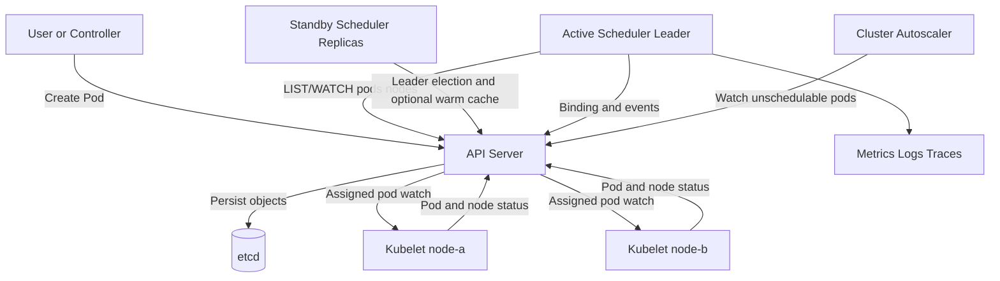
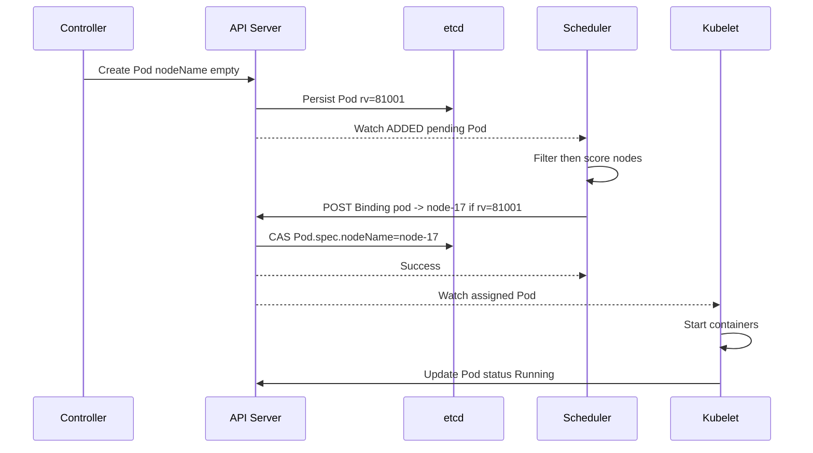
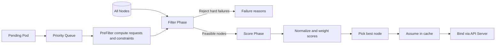
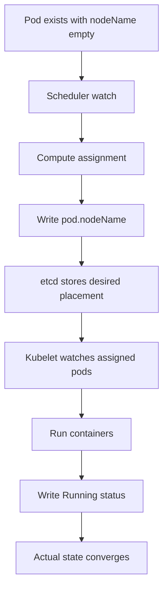
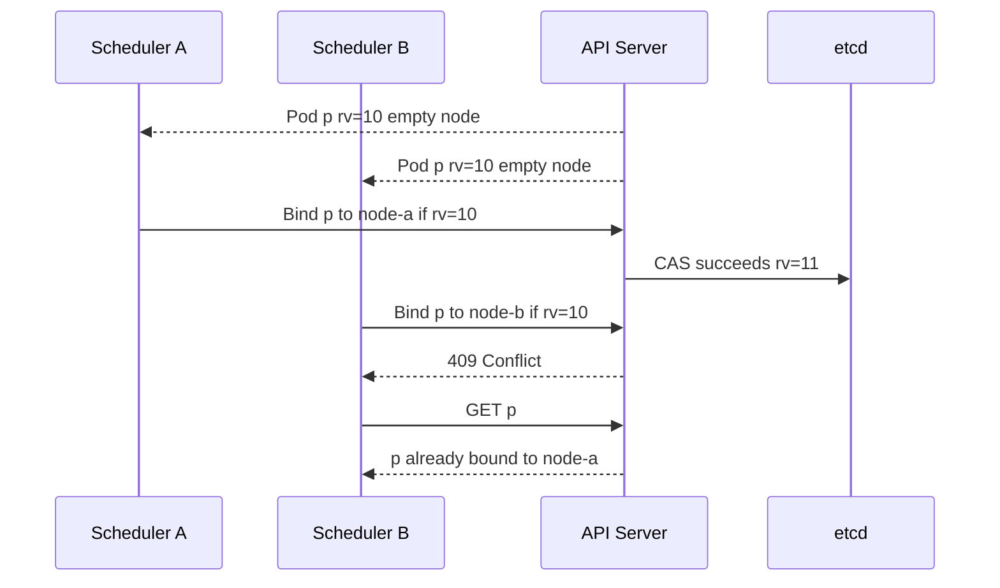
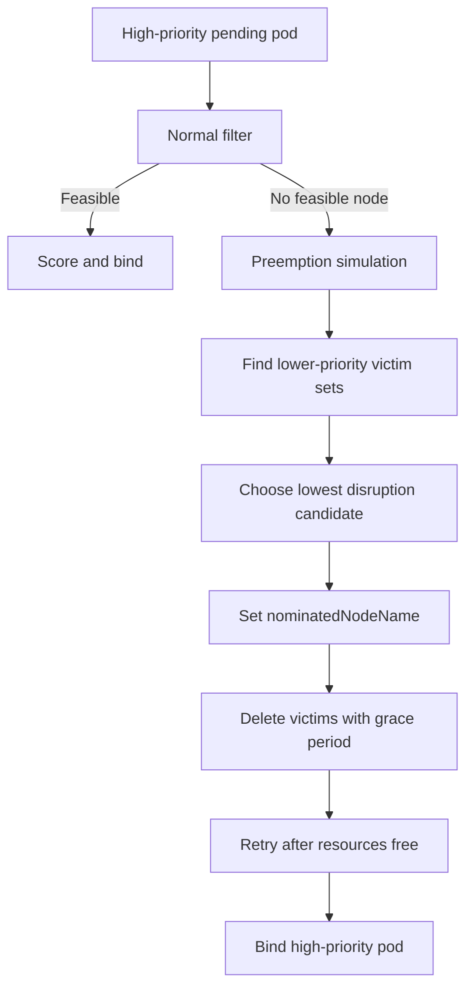
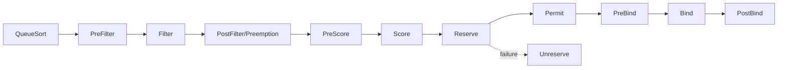
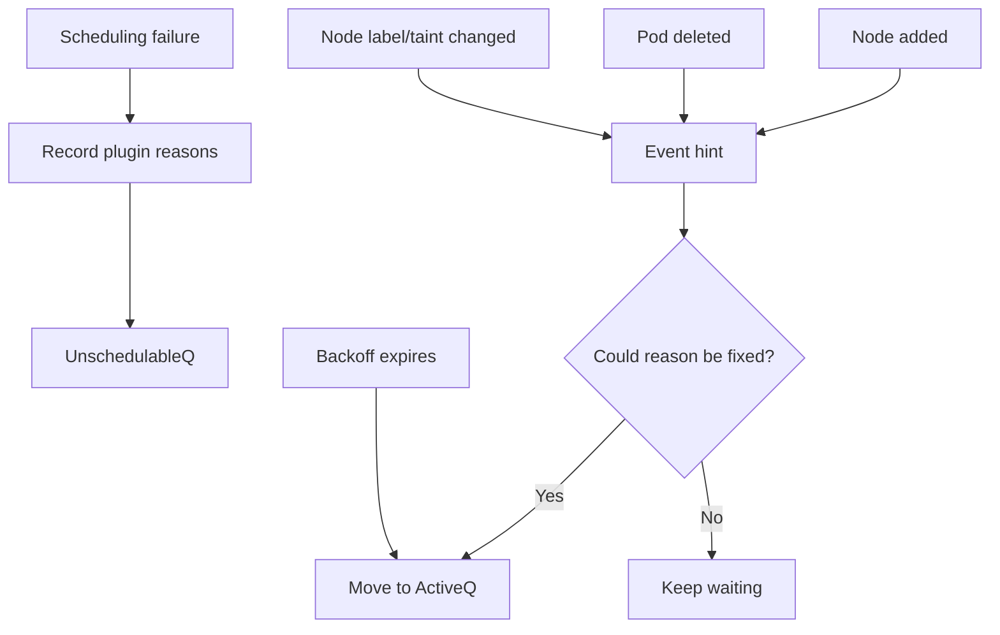

# Kubernetes-style Container Scheduler — High-Level Design

## 1. Problem Statement & Scope

Design a Kubernetes-style scheduler that places pending pods onto a cluster of nodes. The scheduler watches desired state from the API server, keeps a local cache of nodes and pods, evaluates hard placement constraints, ranks feasible nodes, and writes a pod-to-node binding. Kubelet on the selected node then reconciles actual execution. The scheduler is mostly stateless; etcd behind the API server is the source of truth.

### In scope
- Scheduling pods with empty `spec.nodeName`.
- CPU, memory, pod-count, and extended-resource fit.
- Node selectors, required/preferred affinity, anti-affinity, topology spread, taints, and tolerations.
- Priority ordering and preemption of lower-priority pods.
- Filter-then-score scheduling framework with plugins.
- Leader election, crash recovery, stale-cache handling, and optimistic concurrency.
- Metrics, events, and debuggable unschedulable reasons.

### Out of scope
- Container runtime, image pulling, and kubelet internals.
- Full API server, etcd, CNI, CSI, or autoscaler implementation.
- Billing, admission webhooks, and quota systems except as inputs.
- Global multi-cluster federation, covered only as a future improvement.

### Assumptions
- All durable reads and writes go through the API server.
- etcd provides strongly consistent object storage and watchable resource versions.
- Scheduler cache can be stale and must tolerate conflicts.
- Pods are immutable with respect to node assignment after successful binding.
- Workload controllers create replacement pods rather than moving running pods.

## 2. Functional Requirements

### P0 requirements
- Watch unscheduled pods for the configured `schedulerName`.
- Maintain node and pod cache from LIST/WATCH streams.
- Reject nodes that violate hard constraints.
- Score feasible nodes and choose the best node.
- Bind pod to node through the API server.
- Avoid double assignment under multiple schedulers or retries.
- Requeue unschedulable pods when relevant cluster state changes.
- Emit `Scheduled` and `FailedScheduling` events.

### P1 requirements
- Order queue by priority and creation time.
- Support preemption for high-priority pods.
- Choose victims while minimizing disruption and respecting PDBs where possible.
- Support scheduling-framework plugins for queue sort, filter, score, reserve, permit, bind, and post-bind.
- Support multiple profiles and custom schedulers via `spec.schedulerName`.
- Run active/standby replicas with leader election.

### P2 requirements
- Topology-aware spreading across zones, racks, and hosts.
- Dry-run scheduling and detailed diagnostics.
- Backoff queues to avoid hot retry loops.
- Nominated-node tracking during preemption.
- Autoscaler-friendly unschedulable signals.

| Actor | Action | Result |
|---|---|---|
| Controller | Creates Pod with no nodeName | Pod enters pending queue |
| Scheduler | Filters and scores nodes | Selects one node or records failure |
| API server | Applies binding conditionally | etcd stores assignment |
| Kubelet | Watches assigned pod | Starts containers and reports status |
| Autoscaler | Watches unschedulable pods | Adds nodes when capacity is truly missing |

## 3. Non-Functional Requirements

| Category | Requirement | Rationale |
|---|---|---|
| Scale | 5,000 nodes and 150,000 pods | Large production cluster |
| Throughput | 100 avg and 300 peak decisions/s; provision 600 attempts/s | Burst headroom |
| Latency | p50 <100 ms, p99 <500 ms for normal pod scheduling | Control-plane responsiveness |
| Availability | 99.9% scheduler deployment | Pending pods survive scheduler downtime |
| Consistency | Strong final binding; eventual local cache | Fast reads with safe writes |
| Durability | Only API server/etcd durable | Scheduler can rebuild |
| Security | Least-privileged service account | No secret access required |

Observability must include queue depth, scheduling latency, plugin latency, bind errors, preemption attempts, watch reconnects, and per-plugin failure counts.

The scheduler should favor predictable bounded work over globally optimal placement. It should degrade by sampling nodes, backing off unschedulable pods, and rate-limiting events rather than overloading the API server.

## 4. Back-of-the-Envelope Estimation

README convention: 1 day ≈ 86,400 s ≈ 10^5 s, and peak ≈ 2–3× average unless a burstier workload is justified.

| Input | Value | Arithmetic / note |
|---|---|---|
| Nodes | 5,000 | Given target cluster |
| Pods per node | 30 | Mixed services and sidecars |
| Total pods | 150,000 | 5,000 × 30 |
| Average pod churn | 100 pods/s | Creates, deletes, replacements |
| Peak pod churn | 300 pods/s | 3 × 100 |
| Provisioned attempts | 600/s | 300 peak × 2 safety factor |
| Pending rollout burst | 10,000 pods | Large deployment or node failure |

### Throughput arithmetic

```text
Average decisions = 100 pods/s
Peak decisions = 3 × 100 = 300 pods/s
Provisioned attempts = 2 × 300 = 600 attempts/s
Drain 10,000-pod burst at 600/s = 10,000 / 600 ≈ 17 s
Minimum for <60 s drain = 10,000 / 60 ≈ 167/s; with 3× headroom ≈ 501/s, round to 600/s
```

### Control-plane watch load

```text
Node updates = 5,000 nodes × 1 update/10 s = 500 events/s
Pod status updates = 150,000 pods × 1 update/60 s = 2,500 events/s
Pod create/delete average = 100 pods/s × 2 ≈ 200 events/s
Pod create/delete peak = 300 pods/s × 2 ≈ 600 events/s
Bind writes average = 100/s; provisioned = 600/s
```

| Stream | Average events/s | Peak events/s | Scheduler handling |
|---|---|---|---|
| Node watch | 500 | 1,000 | Update readiness, taints, labels, allocatable |
| Pod status watch | 2,500 | 5,000 | Update pod cache and node requests |
| Pod create/delete | 200 | 600 | Enqueue pending pods or free resources |
| Binding results | 100 | 600 | Confirm assumed pods |
| Total | 3,300 | 7,200 | Incremental cache updates, not full recompute |

### Memory arithmetic

```text
Node cache ≈ 5,000 nodes × 6 KB = 30,000 KB ≈ 30 MB
Pod cache ≈ 150,000 pods × 4 KB = 600,000 KB ≈ 600 MB
Index overhead ≈ 50% × (30 + 600) MB = 315 MB
Pending/backoff queues ≈ 10,000 × 2 KB = 20 MB
Total ≈ 30 + 600 + 315 + 20 = 965 MB
Round up for runtime overhead and plugin state = 2–4 GB per scheduler instance
```

### CPU arithmetic

```text
Naive node evaluations = 5,000 nodes × 600 attempts/s = 3,000,000 evaluations/s
If one evaluation costs 10 μs: 3,000,000 × 10 μs = 30 CPU-s/s ≈ 30 cores
With percentageOfNodesToScore = 30%: 5,000 × 0.30 = 1,500 nodes/attempt
1,500 × 600 = 900,000 evaluations/s
900,000 × 10 μs = 9 CPU-s/s; with scoring/plugin overhead, provision 16–24 cores
```

### Storage and bandwidth arithmetic

```text
Live pod data ≈ 150,000 × 6 KB = 900 MB
With MVCC/compaction overhead ≈ 2× = 1.8 GB logical
With replication factor 3 = 1.8 × 3 = 5.4 GB physical
Scheduling events/day = 100/s × 86,400 ≈ 8.64 million/day
At 1 KB/event raw = 8.64 GB/day, so event TTL and aggregation are mandatory
Average watch bandwidth = 3,300 × 2 KB = 6.6 MB/s per scheduler
Peak watch bandwidth = 7,200 × 2 KB = 14.4 MB/s per scheduler
```

| Resource | Estimate | Provisioning choice |
|---|---|---|
| Scheduler memory | ~1 GB computed | 4 GB for large cluster |
| Scheduler CPU | 16–24 cores peak | 16 cores request, tune by plugin cost |
| Attempts | 600/s | Parallel workers and node sampling |
| API writes | Up to 1,200/s including events | Rate-limit events; never drop binds |
| Watch bandwidth | 14.4 MB/s peak per watcher | Efficient watches and bookmarks |

## 5. API Design

The scheduler's public contract is the API server object model. Users create pods; scheduler writes bindings; kubelets watch assigned pods.

### Create Pod
```http
POST /api/v1/namespaces/{namespace}/pods
Content-Type: application/json
```

```json
{"metadata":{"name":"checkout-7d9f","namespace":"prod","labels":{"app":"checkout"}},
 "spec":{"schedulerName":"default-scheduler","containers":[{"resources":{"requests":{"cpu":"500m","memory":"1Gi"},"limits":{"cpu":"1","memory":"2Gi"}}}],
 "nodeSelector":{"disk":"ssd"},"tolerations":[{"key":"dedicated","operator":"Equal","value":"payments","effect":"NoSchedule"}],
 "affinity":{"nodeAffinity":{},"podAffinity":{},"podAntiAffinity":{}}}}
```

### Watch pending pods
```http
GET /api/v1/pods?watch=true&fieldSelector=spec.nodeName=&resourceVersion={rv}
```

The scheduler lists current pending pods, starts a watch from the returned resourceVersion, and enqueues only pods matching its schedulerName.

### Bind Pod
```http
POST /api/v1/namespaces/{namespace}/pods/{podName}/binding
Content-Type: application/json
```

```json
{"kind":"Binding","metadata":{"name":"checkout-7d9f","namespace":"prod","uid":"pod-123","resourceVersion":"81001"},
 "target":{"kind":"Node","name":"node-17"}}
```

| Response | Meaning | Scheduler action |
|---|---|---|
| 201/200 Success | Binding persisted | Forget assumed pod after watch confirmation |
| 409 Conflict | Pod changed or already bound | Re-read pod; drop or requeue |
| 404 NotFound | Pod deleted | Drop work item |
| 5xx/timeout | Transient control-plane issue | Retry with backoff and resourceVersion validation |

### Events
```json
{"type":"Warning","reason":"FailedScheduling",
 "message":"0/5000 nodes are available: 3910 insufficient memory, 800 taint mismatch, 290 affinity mismatch",
 "involvedObject":{"kind":"Pod","namespace":"prod","name":"checkout-7d9f"}}
```

### Scheduler plugin interfaces
```go
type FilterPlugin interface { Filter(ctx Context, state CycleState, pod Pod, node NodeInfo) Status }
type ScorePlugin interface { Score(ctx Context, state CycleState, pod Pod, node NodeInfo) (int, Status); NormalizeScore(ctx Context, state CycleState, pod Pod, scores NodeScoreList) Status }
type BindPlugin interface { Bind(ctx Context, state CycleState, pod Pod, nodeName string) Status }
```

## 6. Data Model & Schema

| Data | Storage engine | Why |
|---|---|---|
| Pods, Nodes, PriorityClasses | etcd via API server | Strong consistency, validation, watch API |
| Binding | Pod spec update in etcd | Single source of truth |
| Events | API objects with TTL/aggregation | Short-lived diagnostics |
| Scheduler cache | In-memory maps/indexes | Low latency |
| Metrics | Time-series store | Operational queries |
| Logs | Log aggregation | Debugging and audit |

### Pod schema
```yaml
Pod:
  metadata: {namespace, name, uid, resourceVersion, labels, annotations}
  spec:
    schedulerName: string
    nodeName: string
    priority: int
    containers[].resources.requests: {cpuMilli, memoryBytes, extended}
    containers[].resources.limits: {cpuMilli, memoryBytes}
    nodeSelector: map<string,string>
    affinity: {nodeAffinity, podAffinity, podAntiAffinity}
    tolerations: []Toleration
    topologySpreadConstraints: []TopologySpreadConstraint
  status: {phase, nominatedNodeName}
```

### Node schema
```yaml
Node:
  metadata: {name, uid, resourceVersion, labels, annotations}
  spec: {unschedulable, taints}
  status:
    allocatable: {cpuMilli, memoryBytes, pods, extended}
    capacity: {cpuMilli, memoryBytes, pods}
    conditions: [{type: Ready, status: True|False|Unknown}]
```

### Scheduler cache
```text
nodesByName: map[nodeName]NodeInfo
podsByKey: map[namespace/name]PodInfo
podsByNode: map[nodeName]set[podKey]
activeQ: priority queue(priority desc, timestamp asc)
backoffQ: heap(retryAfter)
unschedulableQ: map[podKey]failure reasons
labelIndex: map[labelKey,labelValue]set[objectKey]
topologyIndex: map[topologyKey,topologyValue]set[nodeName]
```

| Index | Used by |
|---|---|
| pods by nodeName | Resource accounting |
| nodes by labels | Node selector and affinity |
| pods by labels | Pod affinity and anti-affinity |
| nodes by topology | Topology spread |
| pods by priority | Queueing and victim selection |
| nodes by resource bucket | Early fit pruning |

`NodeInfo.requested` is derived from pod requests, not observed usage. Requests are stable scheduling commitments; observed usage can be noisy and is safer as a soft scoring input than as a hard fit rule.

## 7. High-Level Architecture



| Component | Responsibility |
|---|---|
| API server | Authn/authz, validation, admission, object writes, watch API |
| etcd | Durable strongly consistent state |
| Scheduler | Placement decisions and binding |
| Scheduler cache | Fast local view and derived resources |
| Kubelet | Runs assigned pods and reports status |
| Controllers | Create desired pods and replace failed pods |
| Autoscaler | Adds capacity for true shortages |



The scheduler has no durable work queue. etcd objects are the durable queue: if a scheduler crashes, the next leader lists pods with empty nodeName and resumes.

## 8. Deep Dives

### A. Scheduling algorithm — Filter then Score



| Filter plugin | Hard constraint |
|---|---|
| NodeReady | Node condition Ready=True |
| NodeUnschedulable | Node is not cordoned |
| NodeResourcesFit | CPU, memory, pod slots, devices fit |
| NodeSelector | Required labels match |
| NodeAffinity | Required expressions match |
| TaintToleration | No untolerated NoSchedule taint |
| InterPodAffinity | Required co-location is satisfied |
| PodAntiAffinity | No forbidden co-location |
| VolumeBinding | Storage topology and attach rules fit |
| NodePorts | Host ports do not conflict |

```text
schedule(pod):
  state = runPreFilterPlugins(pod)
  feasible = []
  for node in candidateNodes:
    for plugin in filterPlugins:
      if plugin.Filter(state, pod, node).failed:
        recordFailure(node, plugin)
        continue nodeLoop
    feasible.append(node)
    if enoughFeasibleNodes(feasible): break
  if feasible.empty: return postFilterOrUnschedulable(pod)
  scores = runScorePlugins(pod, feasible)
  node = highestWeightedScore(scores)
  assumeThenBind(pod, node)
```

| Node | ResourceFit | TopologySpread | Affinity | Weighted total |
|---|---|---|---|---|
| node-a | 90×2=180 | 40×3=120 | 100×1=100 | 400 |
| node-b | 60×2=120 | 90×3=270 | 80×1=80 | 470 |
| node-c | 95×2=190 | 30×3=90 | 50×1=50 | 330 |

Score formula: `finalScore(node) = Σ pluginWeight[i] × normalizedScore[i][node]`. Node-b wins above even though node-a has better raw resource fit, because spread is weighted higher.

### B. Control-loop and declarative reconciliation





ResourceVersion is optimistic concurrency. The scheduler avoids distributed locks and lets the API server serialize final state. Local assumed pods reduce self-conflicts while waiting for watch confirmation.

### C. Resource accounting and the fit problem

| Concept | Meaning | Scheduler use |
|---|---|---|
| CPU request | Guaranteed scheduling amount | Hard fit |
| Memory request | Guaranteed memory amount | Hard fit |
| CPU limit | Runtime ceiling/throttle | Usually not hard fit |
| Memory limit | Runtime OOM boundary | Usually not hard fit |
| Observed usage | Current metrics | Optional soft scoring |

```text
CPU example:
node allocatable = 32,000m
existing requests = 27,500m
incoming request = 2,000m
remaining = 32,000 - 27,500 - 2,000 = 2,500m => fits

Memory example:
node allocatable = 128 GiB
existing requests = 124 GiB
incoming request = 8 GiB
remaining = 128 - 124 - 8 = -4 GiB => reject
```

| Node | Free CPU | Free memory |
|---|---|---|
| node-a | 8 cores | 2 GiB |
| node-b | 2 cores | 32 GiB |
| node-c | 4 cores | 8 GiB |
| Total | 14 cores | 42 GiB |

A pod needing 6 cores and 16 GiB cannot fit despite total free capacity. This is fragmentation. Multidimensional bin packing is NP-hard, so the scheduler uses greedy heuristics and later descheduling instead of exact global optimization.

### D. Priority and preemption



| Victim criterion | Prefer |
|---|---|
| Number of victims | Fewer |
| Highest victim priority | Lower |
| Sum of victim priorities | Lower |
| PDB violations | Fewer |
| Grace-period cost | Lower |
| Topology result | More balanced |

```text
preempt(pod):
  for node in nodes:
    victims = lowerPriorityPods(node)
    remove victims in ascending priority until pod fits
    if filtersPass after removals:
      candidate = victim set and node
  pick candidate with minimum disruption
  nominate node and delete victims
  re-run normal scheduling before final bind
```

Preemption is not atomic. Victims may take time to terminate, other pods may race for the node, and final filters must run again before binding.

### E. Scale and extensibility



| Extension point | Examples |
|---|---|
| QueueSort | PrioritySort |
| Filter | NodeResourcesFit, TaintToleration, NodeAffinity |
| Score | BalancedAllocation, ImageLocality, TopologySpread |
| Reserve | Volume or gang reservation |
| Permit | Gang scheduling wait gate |
| Bind | Default API bind or custom binder |
| PostBind | Metrics and events |

Multiple schedulers can coexist by schedulerName: default-scheduler, gpu-scheduler, batch-scheduler, and latency-scheduler. They share API state and rely on optimistic concurrency. For one scheduler, parallelism is mainly inside node evaluation and async binding.

### F. Unschedulable requeueing



| Failure reason | Useful requeue event |
|---|---|
| Insufficient CPU/memory | Pod deleted, node added, allocatable increased |
| Untolerated taint | Taint removed or pod toleration changed |
| Node affinity mismatch | Node label changed |
| Pod anti-affinity conflict | Conflicting pod deleted or relabeled |
| Volume topology conflict | PV/PVC or node topology changed |

## 9. Scaling/Caching/Bottlenecks

| Bottleneck | Symptom | Mitigation |
|---|---|---|
| O(nodes) filtering | High CPU | Indexes, parallel filtering, node sampling |
| Affinity evaluation | Slow plugin latency | Precomputed label/topology indexes |
| API watch load | API server CPU/network | Efficient informers and bookmarks |
| etcd event writes | Write pressure | Aggregate and rate-limit events |
| Single active leader | Queue backlog | Increase CPU, parallelism, or shard by schedulerName |
| Stale cache | Bind conflicts | ResourceVersion checks and relist |
| Large unschedulableQ | Retry storms | Backoff and event-driven hints |

Cache updates are incremental: added bound pods increase requested resources on their node, deleted pods subtract resources, node updates replace labels/taints/allocatable values, and watch gaps trigger relist.

```text
Node sampling example:
nodes = 5,000
percentageOfNodesToScore = 30%
nodes evaluated = 5,000 × 0.30 = 1,500
Benefit = lower CPU and p99 latency
Cost = may miss globally best node; rotate start index to reduce bias
```

| Shard key | Benefit | Problem |
|---|---|---|
| schedulerName | Simple workload isolation | Requires pod opt-in |
| namespace | Smaller queues | Cross-namespace affinity/fairness harder |
| node pool | Smaller node search | Pods must target pools |
| priority class | Protects critical pods | Starvation risk |
| zone | Locality | Cross-zone spreading harder |

Backpressure includes limiting scheduling workers, limiting concurrent binds, event rate limiting, exponential backoff, and priority-aware queueing. The active scheduler is usually vertically scaled first; horizontal scaling increases throughput only with sharding or active-active designs.

## 10. Reliability & Consistency

```mermaid
sequenceDiagram
participant S1 as Scheduler 1
participant S2 as Scheduler 2
participant A as API Server
participant L as Lease in etcd
S1->>A: Acquire lease
A->>L: holder=S1 ttl=15s
S1->>A: Renew every 5s
S2->>A: Try acquire
A-->>S2: Lease held
S1--xA: Crash
S2->>A: Lease expires; acquire
A->>L: holder=S2
S2->>A: Start scheduling
```

Crash recovery steps:
- Lose in-memory queues and assumed pods.
- New leader lists pods and nodes from API server.
- Pods with nodeName are treated as scheduled.
- Pods with empty nodeName are re-enqueued.
- Watches restart from current resourceVersion.

| Operation | Consistency choice | Reason |
|---|---|---|
| Pod binding | Strong CAS through API server/etcd | Prevent double assignment |
| Scheduler cache | Eventual | Fast local reads |
| Events | At-least-once aggregated | Diagnostics only |
| Metrics | Eventually consistent | Observability |
| Kubelet execution | Eventually reconciled | Node converges after assignment |

| Failure | Handling |
|---|---|
| API 5xx/timeout | Retry with exponential backoff |
| Bind 409 | Re-read pod; drop if bound or requeue if still pending |
| Watch disconnect | Reconnect from last resourceVersion |
| Watch compacted | Full relist |
| No feasible nodes | UnschedulableQ until relevant event |
| Plugin transient error | Backoff and retry |

Leader election prevents normal double-active operation, but correctness does not rely only on the lease. Even if two schedulers race, conditional binding prevents two different node assignments for one pod. Node resource over-assumption is reduced by fast binds, assumed-pod cache, and reconciliation from pod watches.

Preemption reliability requires re-running filters after victims terminate. `nominatedNodeName` communicates intent but is not a lock. Alerts should cover queue depth, p99 latency, bind error rate, watch reconnects, leader flapping, and growing unschedulable pods.

## 11. Trade-offs & Alternatives

| Decision | Option A | Option B | Option C | Choice | Why |
|---|---|---|---|---|---|
| Architecture | Two-level Mesos offers | Monolithic Kubernetes | Shared-state Omega | Monolithic shared control plane | Simpler API and good single-cluster scale |
| Placement | Dense bin-pack | Even spread | Weighted hybrid | Weighted hybrid | Balances cost and resilience |
| Concurrency | Pessimistic locks | Optimistic CAS | Serialized queue | Optimistic CAS | Avoids locks; API server resolves conflicts |
| Deployment | Single pod | Leader active/standby | Fully active-active | Leader active/standby | Simple correctness and fast failover |
| Scaling | Bigger leader | Shard schedulers | Exact optimizer | Vertical first, shard later | Lowest complexity first |
| Preemption | Evict lower priority | Wait | Always autoscale | Preemption plus autoscaler | Protects critical workloads |
| State | Scheduler DB | API server/etcd | Message queue | API server/etcd | One source of truth |
| Node eval | All nodes | Sample nodes | Perfect index | Sample with indexes | Predictable p99 latency |
| Extensibility | Hard-code | Plugin framework | External only | Plugin framework | Policy evolution without forking |

Two-level scheduling gives frameworks autonomy but can waste offer cycles and complicate global constraints. Omega-style shared-state scheduling improves parallelism but increases conflicts and debugging complexity. Kubernetes-style monolithic scheduling is easier to reason about for an interview design and can be extended with profiles and plugins.

Bin-packing lowers cost and helps scale-down, but increases blast radius. Spreading improves resilience but wastes capacity. A weighted hybrid is the best default, with workload-specific profiles for batch, GPU, and latency-sensitive services.

## 12. Future Improvements

- Gang scheduling for distributed ML and batch jobs.
- Capacity reservation objects for planned launches.
- NUMA-aware, GPU-aware, and device-topology-aware scoring.
- Descheduler integration to reduce long-term fragmentation.
- Scheduler simulation and dry-run policy testing service.
- Richer explanations grouped by failed plugin and topology domain.
- Per-namespace fairness and scheduling budgets.
- Active-active sharding with measured conflict-rate controls.
- Predictive image pre-warming on likely target nodes.
- Autoscaler feedback that distinguishes temporary contention from true capacity shortage.
- WASM or sandboxed third-party scheduling plugins.
- Policy versioning for auditable scheduler decisions.
- Energy-aware and carbon-aware placement.
- Cross-cluster federation scheduler.
- Formal verification of binding idempotency and preemption invariants.

### Interview framing
- State the scheduler does not run containers; kubelet does.
- Call out that the hard part is fast constraint evaluation under stale state.
- Emphasize that requests, not observed usage, drive safe placement.
- Explain that bin packing is NP-hard and heuristics are intentional.
- Mention that exact optimality is less valuable than predictable convergence.

### Operational checks
- Track feasible-node count per scheduling cycle.
- Track top failed filter plugins.
- Track conflict rate on binding writes.
- Track scheduling attempts that required preemption.
- Track cache freshness and watch lag.

### Design invariants
- A pod UID must not be bound to two nodes.
- A node's assumed requested resources must eventually match watched bound pods.
- Unschedulable pods must be recoverable after scheduler restart.
- Plugin failures must not corrupt scheduler cache.
- Preemption must never evict equal-or-higher-priority pods for a lower-priority pod.

