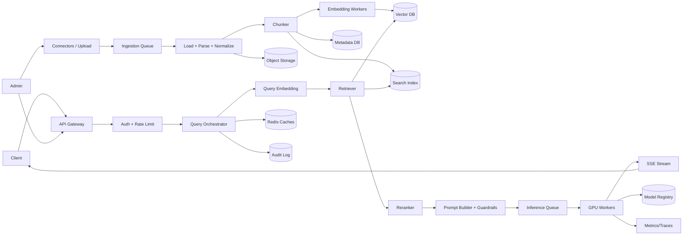
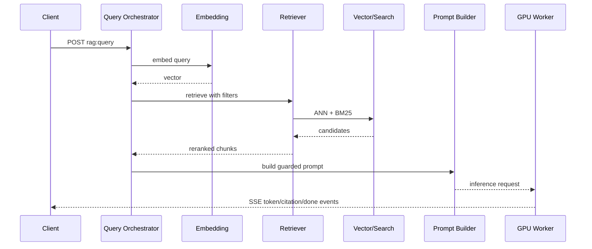
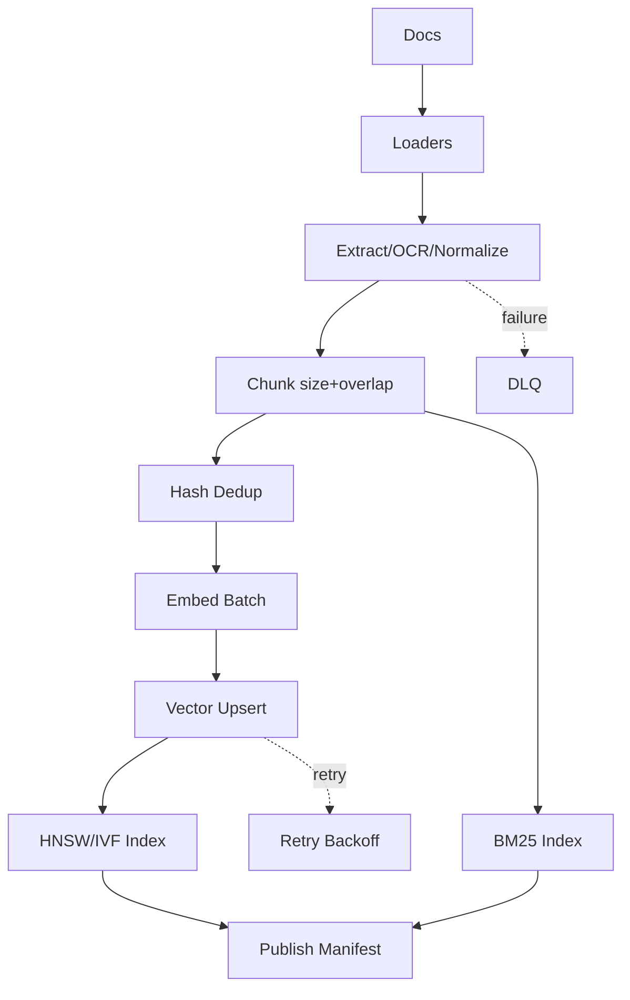
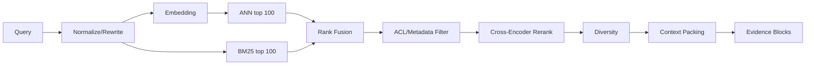
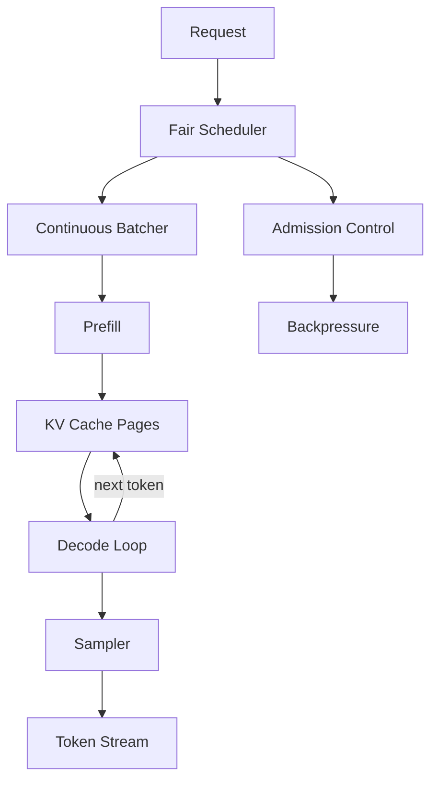
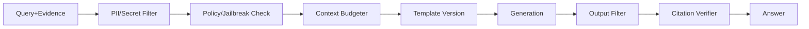
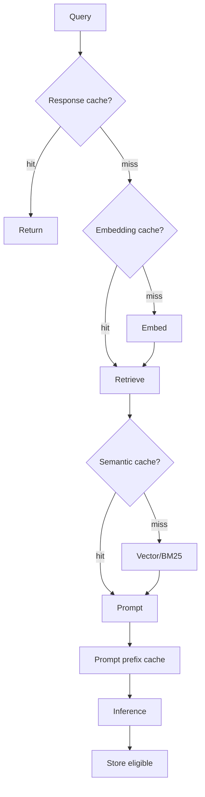

# LLM Inference / RAG Platform — High-Level Design

Serve LLM completions grounded on a private knowledge base using Retrieval-Augmented Generation (RAG), with GPU inference, vector search, streaming, citations, and tenant controls.

## 1. Problem Statement & Scope

- Build a multi-tenant platform where users ask questions and receive streamed, cited answers from private documents.
- In scope: ingestion, chunking, embeddings, vector/BM25 indexing, retrieval, reranking, prompt construction, GPU inference, SSE streaming, caches, quotas, audit logs.
- Out of scope: training a foundation model, full enterprise content management, IdP implementation, and RLHF annotation tooling.
- Assume 7B/13B model initially, larger models later via tensor parallelism.
- Assume document sources include PDFs, wiki pages, tickets, runbooks, HTML, markdown, and code snippets.

- Scope driver 1: optimize for tenant isolation without leaking private data across tenants.
- Scope driver 2: optimize for low first-token latency without leaking private data across tenants.
- Scope driver 3: optimize for high GPU throughput without leaking private data across tenants.
- Scope driver 4: optimize for fresh private indexes without leaking private data across tenants.
- Scope driver 5: optimize for grounded answers with citations without leaking private data across tenants.
- Scope driver 6: optimize for safe prompt/output handling without leaking private data across tenants.
- Scope driver 7: optimize for cost-aware scheduling without leaking private data across tenants.
- Scope driver 8: optimize for observable operations without leaking private data across tenants.


## 2. Functional Requirements

- Accept a natural-language query and stream tokens back to the client.
- Embed the query, retrieve top-K relevant chunks, rerank them, and assemble context.
- Return citations with document ID, chunk ID, title, URI, page/section, and score.
- Ingest documents from upload and connectors, then parse, normalize, chunk, embed, and index them.
- Support incremental create/update/delete, tombstones, and re-embedding by model version.
- Enforce tenant, user, ACL, metadata, retention, and source filters on every read.
- Expose ingestion job status, query usage, audit events, and model availability.
- Provide cancellation, rate limiting, idempotency, timeout, retry, and fallback behavior.
- Apply PII, secret, jailbreak, and output safety checks.
- Allow admins to configure connectors, chunk policy, model choice, quotas, retention, and prompt templates.

- P1: Hybrid vector + BM25 retrieval.
- P2: Cross-encoder reranking.
- P3: Semantic and response caches.
- P4: Prompt template versioning.
- P5: Feedback capture.
- P6: Smaller-model fallback.
- P7: Per-tenant spend budgets.
- P8: Evaluation datasets.
- P9: Index rebuild controls.
- P10: Model rollout controls.


## 3. Non-Functional Requirements

| Dimension | Target | Reason |
|---|---|---|
| Availability | 99.9% query, 99.5% ingestion | query path is user-facing |
| First-token latency | p50 < 800 ms, p99 < 3 s | streaming UX |
| Answer latency | p50 < 5 s, p99 < 15 s | depends on output length |
| Retrieval latency | p50 < 150 ms, p99 < 700 ms | leaves room for inference |
| Freshness | p50 < 5 min, p99 < 30 min | docs update asynchronously |
| Durability | no acknowledged document loss | raw docs are source of truth |
| Consistency | strong auth, eventual search | index build is async |
| Security | TLS, encryption, audit | private enterprise data |
| Throughput | 1M queries/day | baseline scale |
| GPU utilization | >55% avg | cost efficiency |

| Step | p50 | p99 | Notes |
|---|---|---|---|
| Auth/rate limit | 20 ms | 80 ms | Redis/local cache |
| Query embedding | 40 ms | 150 ms | batched model |
| Vector/BM25 retrieval | 80 ms | 350 ms | ANN + filters |
| Rerank | 120 ms | 500 ms | top 50 to top 8 |
| Prompt/guardrails | 40 ms | 200 ms | budget + filters |
| Queue to first token | 300 ms | 1500 ms | batch wait + prefill |
| Decode stream | 3-8 s | 15 s | output tokens |


## 4. Back-of-the-Envelope Estimation

Convention: 1 day ≈ 86,400 s ≈ 10^5 s; peak ≈ 3× average. Arithmetic is intentionally rounded for interview speed.

| Metric | Assumption | Arithmetic | Result |
|---|---|---|---|
| Queries/day | 1,000,000 | given | 1M/day |
| Avg QPS | 1M / 10^5 | 1,000,000 ÷ 100,000 | 10 QPS |
| Peak QPS | 3 × avg | 3 × 10 | 30 QPS |
| Avg stream duration | 8 s | generation + network | 8 s |
| Open streams peak | 30 × 8 | peak QPS × duration | 240 |
| Docs/day ingested | 100,000 | connector + upload | 100k/day |
| Peak ingest | 3 × avg | (100k/100k)×3 | 3 docs/s |

| Token bucket | Arithmetic | Tokens/query |
|---|---|---|
| Question | direct | 150 |
| System/template | policies + format | 300 |
| Context | 8 chunks × 350 | 2,800 |
| History summary | last turns | 500 |
| Prompt total | 150+300+2,800+500 | 3,750 |
| Completion | average answer | 500 |
| Processed total | 3,750+500 | 4,250 |

| Inference metric | Arithmetic | Result |
|---|---|---|
| Prompt tokens/day | 1M×3,750 | 3.75B |
| Output tokens/day | 1M×500 | 0.5B |
| Prompt tokens/s avg | 3.75B/100k | 37.5k/s |
| Output tokens/s avg | 0.5B/100k | 5k/s |
| Prompt tokens/s peak | 37.5k×3 | 112.5k/s |
| Output tokens/s peak | 5k×3 | 15k/s |
| Decode capacity/GPU | conservative optimized runtime | 800 tok/s |
| Decode GPUs | 15k/800 | 18.75≈19 |
| Prefill capacity/GPU | conservative | 12k tok/s |
| Prefill GPUs | 112.5k/12k | 9.4≈10 |
| Headroom | max(19,10)×1.5 | 29 |
| AZ/N+1 rounding | round 29 | 36 GPUs |

| Vector metric | Arithmetic | Result |
|---|---|---|
| Documents | given | 5M |
| Avg doc tokens | assume | 3,000 |
| Chunk stride | 500 size - 100 overlap | 400 tokens |
| Chunks/doc | ceil(3,000/400) | 8 |
| Total chunks | 5M×8 | 40M |
| Vector bytes | 1,536 dims×4 bytes | 6,144B≈6KB |
| Raw vectors | 40M×6KB | 240GB |
| HNSW overhead | 1.5×raw | 360GB |
| Metadata | 40M×1KB | 40GB |
| RF=3 vector store | (360+40)×3 | 1.2TB |

| Storage/Bandwidth | Arithmetic | Result |
|---|---|---|
| Raw docs | 5M×1MB | 5TB |
| Raw docs RF=3 | 5TB×3 | 15TB |
| Chunk text | 40M×2KB | 80GB |
| Audit/year | 1M×2KB×365 | 730GB |
| Prompt logs sampled | 1%×1M×10KB×365 | 36.5GB/year |
| Client output/day | 1M×500 tok×4 chars | ~2GB text |
| Upload/day | 100k×1MB | 100GB/day |

| Component | Sizing | Initial |
|---|---|---|
| API gateway | SSE + 30 peak QPS | 3-6 nodes |
| Query orchestrator | CPU workflow | 6-12 nodes |
| Embedding online | 30 QPS batched | 2-4 nodes |
| Reranker | 30×50 candidates | 4-8 nodes |
| GPU inference | calculation above | 36 GPUs |
| Vector DB | 1.2TB replicated | 9-15 data nodes |
| Redis | quota/cache | 3 primaries + replicas |
| Queue | ingest/inference buffers | 3-5 brokers |


## 5. API Design

REST is used for admin and ingestion; SSE is used for query token streaming; internal model calls use gRPC.

```http
POST /v1/tenants/{tenant_id}/rag:query
Authorization: Bearer <token>
Idempotency-Key: <uuid>
Accept: text/event-stream
Content-Type: application/json
{ "conversation_id":"conv_123", "query":"How do we rotate database credentials?", "model":"gen-13b", "retrieval":{"top_k":8,"hybrid":true,"rerank":true}, "max_output_tokens":700, "temperature":0.2 }
```

```http
event: retrieval_complete
data: {"chunks":[{"chunk_id":"chk_9","score":0.82,"title":"Credential Rotation"}]}

event: token
data: {"text":"To rotate"}

event: citation
data: {"chunk_id":"chk_9","uri":"https://kb/runbook/12","page":3}

event: done
data: {"finish_reason":"stop","usage":{"prompt_tokens":3750,"completion_tokens":421}}
```

- POST /documents:upload accepts multipart upload and returns ingestion job ID.
- POST /connectors/{id}:sync starts full or incremental connector sync.
- GET /ingestion-jobs/{job_id} returns discovered, parsed, chunked, embedded, indexed, failed counts.
- PATCH /quotas updates QPS, token, and spend budgets.
- POST /indexes/{index_id}:rebuild triggers re-indexing from durable raw documents.
- DELETE /v1/requests/{request_id} cancels queued or running generation.
- All mutating APIs accept Idempotency-Key and return request_id/job_id for retry safety.


## 6. Data Model & Schema

| Data | Store | Reason |
|---|---|---|
| Raw documents | Object storage | cheap durable blobs |
| Document metadata | Relational DB | transactions and admin queries |
| Chunks | NoSQL/document store | point lookup by chunk ID |
| Embeddings | Vector DB | ANN + metadata filters |
| Keyword index | Search engine | BM25 and phrases |
| Model registry | Relational DB | strong rollout metadata |
| Caches | Redis/KV | low latency TTL |
| Audit | Append log + analytics | immutable compliance |
| Metrics | Time-series DB | high-cardinality telemetry |

```sql
CREATE TABLE tenants (tenant_id TEXT PRIMARY KEY, name TEXT, kms_key_ref TEXT, qps_limit INT, daily_token_limit BIGINT, created_at TIMESTAMP);
CREATE TABLE documents (tenant_id TEXT, document_id TEXT, source TEXT, source_uri TEXT, title TEXT, content_hash TEXT, acl_hash TEXT, version BIGINT, status TEXT, raw_blob_uri TEXT, updated_at TIMESTAMP, PRIMARY KEY (tenant_id, document_id));
CREATE INDEX idx_documents_source ON documents (tenant_id, source, updated_at);
CREATE TABLE ingestion_jobs (tenant_id TEXT, job_id TEXT, connector_id TEXT, mode TEXT, status TEXT, total_docs BIGINT, succeeded_docs BIGINT, failed_docs BIGINT, started_at TIMESTAMP, completed_at TIMESTAMP, PRIMARY KEY (tenant_id, job_id));
CREATE TABLE model_versions (model_id TEXT, version TEXT, model_type TEXT, artifact_uri TEXT, context_tokens INT, max_batch_tokens INT, status TEXT, created_at TIMESTAMP, PRIMARY KEY (model_id, version));
```

- Chunk record: tenant_id, document_id, chunk_id, version, text, token_count, source_uri, page, heading_path, ACL groups, metadata, embedding_model.
- Vector record: id=tenant:chunk:model, embedding bytes, tenant_id, document_id, chunk_id, metadata, deleted flag, version.
- Cache key embed:{model}:{text_hash} stores deterministic embeddings.
- Cache key semantic:{tenant}:{query_hash}:{filter_hash}:{index_version} stores candidate chunk IDs.
- Cache key response:{tenant}:{prompt_hash}:{model}:{params}:{acl_hash} stores eligible answers only.
- Partition metadata and chunks by tenant_id; dedicate collections for huge tenants.
- Partition audit by tenant_id and event_date; retain by policy.


## 7. High-Level Architecture



- Ingestion path is asynchronous, durable, and idempotent.
- Query path is latency-sensitive and bounded by strict budgets.
- Vector DB and BM25 are both consulted for hybrid retrieval.
- GPU workers are stateless except in-memory model weights and KV cache.
- Caches are versioned by tenant, model, index, prompt template, and ACL state.




## 8. Deep Dives

### 8.1 Ingestion & Indexing Pipeline



- Use 500-token chunks with 100-token overlap initially; tune by retrieval recall and context waste.
- Semantic splitters respect headings, paragraphs, tables, code symbols, and sentence boundaries.
- Content hash avoids reprocessing unchanged documents; ACL hash allows metadata-only updates.
- Document updates create new versions; old chunks are tombstoned and compacted later.
- Re-embedding stores old and new embedding_model versions until tenant cutover completes.
- HNSW gives high recall and low latency but high memory; IVF/PQ gives lower memory with recall tuning.
- Metadata filtering must occur before/during ANN, not only after, to avoid empty authorized results.

### 8.2 Retrieval, Reranking & Context Assembly



- Use reciprocal rank fusion for ANN and BM25 scores.
- Rerank top 50 candidates to final 8-12 evidence chunks.
- Apply maximum marginal relevance to reduce duplicate chunks from same document.
- Budget context: 300 system, 150 query, 500 history, 2,800 evidence, 200 citations, 700 output.
- If retrieval confidence is low, answer that evidence is insufficient rather than hallucinating.
- Track recall@K, no-answer rate, cited-source distribution, filter drop rate, and faithfulness.

### 8.3 GPU Inference Serving



- Continuous batching admits new sequences as others finish, improving utilization over static batches.
- Batching window is small, typically 5-30 ms, to preserve first-token latency.
- KV cache stores attention keys/values for previous tokens; paged attention reduces fragmentation.
- Separate prefill and decode pools when long prompts make prefill dominate.
- Tensor parallelism is needed for 70B models; 7B/13B can often fit on one high-memory GPU with quantization.
- Cancellation must free KV pages immediately and remove the sequence from active batches.
- Autoscaling requires warm pools because model load can take minutes.

### 8.4 Prompt Construction & Guardrails



- Prompt tells the model to answer only from supplied context unless policy allows general knowledge.
- Evidence blocks include stable chunk IDs so citations can be verified.
- Low temperature, no-answer threshold, and citation verification reduce hallucinations.
- Unsafe prompts can be blocked, redacted, downgraded, escalated, or annotated.
- Prompt templates are versioned and included in audit/evaluation records.

### 8.5 Caching



| Cache | TTL | Invalidation | Risk |
|---|---|---|---|
| Embedding | 7-30d | model version | low |
| Semantic retrieval | 5-60m | index version | medium |
| Response | 1-15m | document/ACL/template | high |
| Prompt prefix | runtime | prefix hash | medium |
| ACL | 30-300s | ACL event | high |


## 9. Scaling/Caching/Bottlenecks

| Bottleneck | Symptom | Mitigation |
|---|---|---|
| GPU decode | queue delay | continuous batching, fallback model |
| KV cache | OOM/admission reject | paged attention, context limits |
| Vector memory | ANN p99 spikes | shard split, quantization |
| Filtering | low authorized recall | tenant collections, prefilters |
| Reranker | retrieval p99 high | reduce candidates, batch rerank |
| Prompt size | slow prefill | top-K tuning, compression |
| Connector bursts | ingest lag | queue/backpressure |
| Redis hot keys | CPU high | L1 cache, key sharding |
| SSE connections | gateway memory | limits and streaming pool |
| Audit writes | tail latency | async batched append |

- Scale gateways by active streams, query orchestrators by workflow count, vector DB by memory/p99, and GPUs by queue delay/KV pressure.
- Use weighted fair queuing by tenant and separate queues for interactive, batch, evaluation, and admin traffic.
- Every cache key includes tenant_id plus model, index, template, and ACL versions.
- Rate limits, max context tokens, max output tokens, and spend budgets are enforced server-side.
- Large tenants receive dedicated vector shards or GPU quotas to avoid noisy neighbors.


## 10. Reliability & Consistency

| Failure | Impact | Handling |
|---|---|---|
| GPU crash before token | delay | requeue if budget remains |
| GPU crash mid-stream | partial answer | error event and retry option |
| Vector shard down | lower recall | replica or keyword fallback |
| Embedding down | retrieval degraded | cached embeddings or keyword only |
| Reranker down | lower quality | skip rerank |
| Redis down | higher cost | bypass cache/local limits |
| Parser poison doc | job partial fail | DLQ |
| Connector throttled | freshness lag | checkpoint/backoff |
| Metadata failover | brief errors | multi-AZ primary failover |

- Upload acknowledgment means raw document and metadata are durable, not searchable.
- Search is eventually consistent; status APIs expose searchable state.
- Deletes and ACL revocations are high priority tombstones before physical compaction.
- Vector and BM25 snapshots are published through version manifests.
- Ingestion is at-least-once with idempotent chunk/vector upserts.
- Online retries are bounded; never silently retry after partial streamed output.
- GPU workers are replaceable because persistent state lives in queues, DBs, object storage, and indexes.
- Audit events are append-only and should degrade to durable buffering rather than silent loss.


## 11. Trade-offs & Alternatives

| Decision | Option A | Option B | Chosen | Why |
|---|---|---|---|---|
| Grounding | RAG | fine-tuning | RAG | freshness and citations |
| Hosting | self-host GPUs | managed API | self-host baseline | data control/cost at scale |
| ANN | HNSW | IVF/PQ | HNSW first | high recall/simple ops |
| Retrieval | vector only | hybrid | hybrid | IDs/acronyms need BM25 |
| Batching | static | continuous | continuous | higher GPU utilization |
| Response | sync | streaming | streaming | lower perceived latency |
| Chunking | small | large | medium overlap | precision vs cost |
| Isolation | dedicated | shared | hybrid | cost plus compliance |
| Indexing | sync | async | async | avoid blocking uploads |
| Caching | aggressive | conservative | conservative | private ACL risk |
| Model | large only | tiered | tiered | cost/quality balance |
| Region | active-active day1 | regional+DR | regional+DR | simpler launch |

- Pure extractive QA is safer but weaker for synthesis.
- Global vector indexes simplify ops but complicate tenant isolation.
- Managed APIs are useful fallback but may not satisfy data residency.
- Fine-tuning can improve tone but does not replace retrieval freshness.
- Keyword-only search is explainable but misses semantic paraphrases.


## 12. Future Improvements

- Continuous offline evaluation with golden question sets per tenant.
- Prompt regression tests and canary rollout for template changes.
- Graph retrieval over entities, owners, relationships, and lineage.
- Multimodal ingestion for images, diagrams, scanned PDFs, audio, and video.
- Adaptive chunking based on observed recall and citation quality.
- Tenant-specific LoRA adapters for high-value domains.
- Speculative decoding with a smaller draft model.
- Disaggregated prefill/decode pools for long-context workloads.
- Quantized KV cache and larger context windows after quality validation.
- Active-active regional serving with data-residency-aware routing.
- Automated cost optimizer choosing model, top-K, and max tokens by intent.
- Stronger citation verification with entailment models.
- Personalized retrieval that preserves strict ACL guarantees.
- Self-service dashboards for quality, freshness, cost, and safety.
- The core launch path is: durable ingestion, hybrid retrieval, guarded prompts, efficient GPU streaming, and tight tenant controls.

### Additional operational checklist
- Checklist 001: define owner and SLO for each component.
- Checklist 002: prefer versioned manifests over in-place index mutation.
- Checklist 003: treat ACL revocation as more urgent than normal indexing.
- Checklist 004: make token budget visible to clients.
- Checklist 005: include request_id in every log and stream event.
- Checklist 006: sample prompts only after redaction.
- Checklist 007: alert on retrieval empty-result spikes.
- Checklist 008: alert on GPU KV cache fragmentation.
- Checklist 009: audit cache hits for sensitive tenants.
- Checklist 010: test re-embedding rollback per tenant.
- Checklist 011: run load tests with long-tail prompt sizes.
- Checklist 012: separate online and batch embedding capacity.
- Checklist 013: reserve GPU warm pool for failover.
- Checklist 014: use circuit breakers around reranker and vector DB.
- Checklist 015: document fallback answer semantics.
- Checklist 016: cap max_output_tokens by tenant plan.
- Checklist 017: measure cost per successful answer.
- Checklist 018: track citations per answer.
- Checklist 019: track unsupported-claim feedback.
- Checklist 020: review DLQ poison documents daily.
- Checklist 021: define owner and SLO for each component.
- Checklist 022: prefer versioned manifests over in-place index mutation.
- Checklist 023: treat ACL revocation as more urgent than normal indexing.
- Checklist 024: make token budget visible to clients.
- Checklist 025: include request_id in every log and stream event.
- Checklist 026: sample prompts only after redaction.
- Checklist 027: alert on retrieval empty-result spikes.
- Checklist 028: alert on GPU KV cache fragmentation.
- Checklist 029: audit cache hits for sensitive tenants.
- Checklist 030: test re-embedding rollback per tenant.
- Checklist 031: run load tests with long-tail prompt sizes.
- Checklist 032: separate online and batch embedding capacity.
- Checklist 033: reserve GPU warm pool for failover.
- Checklist 034: use circuit breakers around reranker and vector DB.
- Checklist 035: document fallback answer semantics.
- Checklist 036: cap max_output_tokens by tenant plan.
- Checklist 037: measure cost per successful answer.
- Checklist 038: track citations per answer.
- Checklist 039: track unsupported-claim feedback.
- Checklist 040: review DLQ poison documents daily.
- Checklist 041: define owner and SLO for each component.
- Checklist 042: prefer versioned manifests over in-place index mutation.
- Checklist 043: treat ACL revocation as more urgent than normal indexing.
- Checklist 044: make token budget visible to clients.
- Checklist 045: include request_id in every log and stream event.
- Checklist 046: sample prompts only after redaction.
- Checklist 047: alert on retrieval empty-result spikes.
- Checklist 048: alert on GPU KV cache fragmentation.
- Checklist 049: audit cache hits for sensitive tenants.
- Checklist 050: test re-embedding rollback per tenant.
- Checklist 051: run load tests with long-tail prompt sizes.
- Checklist 052: separate online and batch embedding capacity.
- Checklist 053: reserve GPU warm pool for failover.
- Checklist 054: use circuit breakers around reranker and vector DB.
- Checklist 055: document fallback answer semantics.
- Checklist 056: cap max_output_tokens by tenant plan.
- Checklist 057: measure cost per successful answer.
- Checklist 058: track citations per answer.
- Checklist 059: track unsupported-claim feedback.
- Checklist 060: review DLQ poison documents daily.
- Checklist 061: define owner and SLO for each component.
- Checklist 062: prefer versioned manifests over in-place index mutation.
- Checklist 063: treat ACL revocation as more urgent than normal indexing.
- Checklist 064: make token budget visible to clients.
- Checklist 065: include request_id in every log and stream event.
- Checklist 066: sample prompts only after redaction.
- Checklist 067: alert on retrieval empty-result spikes.
- Checklist 068: alert on GPU KV cache fragmentation.
- Checklist 069: audit cache hits for sensitive tenants.
- Checklist 070: test re-embedding rollback per tenant.
- Checklist 071: run load tests with long-tail prompt sizes.
- Checklist 072: separate online and batch embedding capacity.
- Checklist 073: reserve GPU warm pool for failover.
- Checklist 074: use circuit breakers around reranker and vector DB.
- Checklist 075: document fallback answer semantics.
- Checklist 076: cap max_output_tokens by tenant plan.
- Checklist 077: measure cost per successful answer.
- Checklist 078: track citations per answer.
- Checklist 079: track unsupported-claim feedback.
- Checklist 080: review DLQ poison documents daily.
- Checklist 081: define owner and SLO for each component.
- Checklist 082: prefer versioned manifests over in-place index mutation.
- Checklist 083: treat ACL revocation as more urgent than normal indexing.
- Checklist 084: make token budget visible to clients.
- Checklist 085: include request_id in every log and stream event.
- Checklist 086: sample prompts only after redaction.
- Checklist 087: alert on retrieval empty-result spikes.
- Checklist 088: alert on GPU KV cache fragmentation.
- Checklist 089: audit cache hits for sensitive tenants.
- Checklist 090: test re-embedding rollback per tenant.
- Checklist 091: run load tests with long-tail prompt sizes.
- Checklist 092: separate online and batch embedding capacity.
- Checklist 093: reserve GPU warm pool for failover.
- Checklist 094: use circuit breakers around reranker and vector DB.
- Checklist 095: document fallback answer semantics.
- Checklist 096: cap max_output_tokens by tenant plan.
- Checklist 097: measure cost per successful answer.
- Checklist 098: track citations per answer.
- Checklist 099: track unsupported-claim feedback.
- Checklist 100: review DLQ poison documents daily.
- Checklist 101: define owner and SLO for each component.
- Checklist 102: prefer versioned manifests over in-place index mutation.
- Checklist 103: treat ACL revocation as more urgent than normal indexing.
- Checklist 104: make token budget visible to clients.
- Checklist 105: include request_id in every log and stream event.
- Checklist 106: sample prompts only after redaction.
- Checklist 107: alert on retrieval empty-result spikes.
- Checklist 108: alert on GPU KV cache fragmentation.
- Checklist 109: audit cache hits for sensitive tenants.
- Checklist 110: test re-embedding rollback per tenant.
- Checklist 111: run load tests with long-tail prompt sizes.
- Checklist 112: separate online and batch embedding capacity.
- Checklist 113: reserve GPU warm pool for failover.
- Checklist 114: use circuit breakers around reranker and vector DB.
- Checklist 115: document fallback answer semantics.
- Checklist 116: cap max_output_tokens by tenant plan.
- Checklist 117: measure cost per successful answer.
- Checklist 118: track citations per answer.
- Checklist 119: track unsupported-claim feedback.
- Checklist 120: review DLQ poison documents daily.
