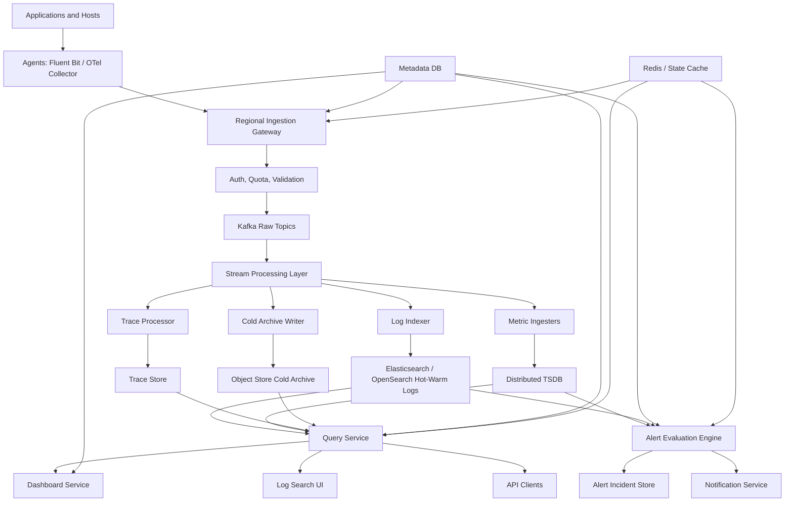
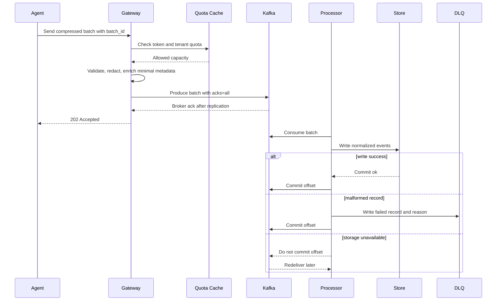
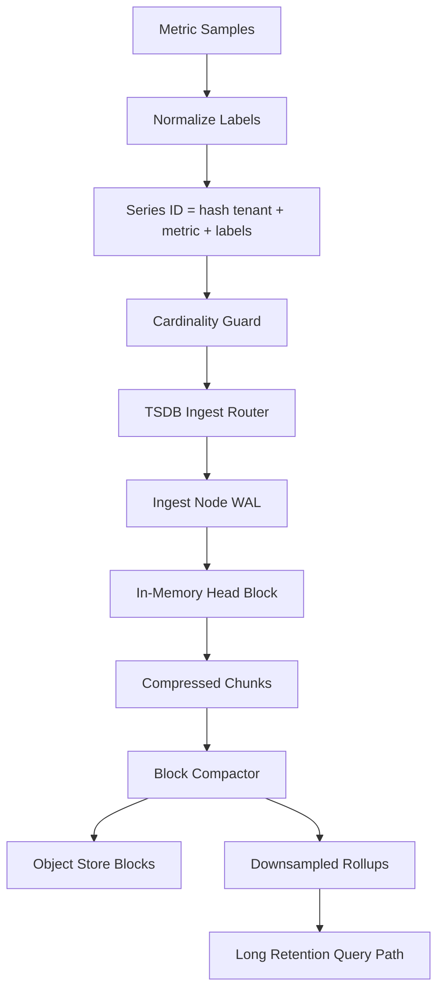
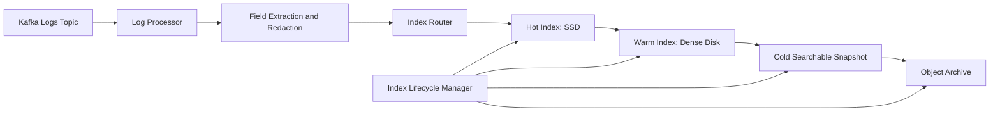
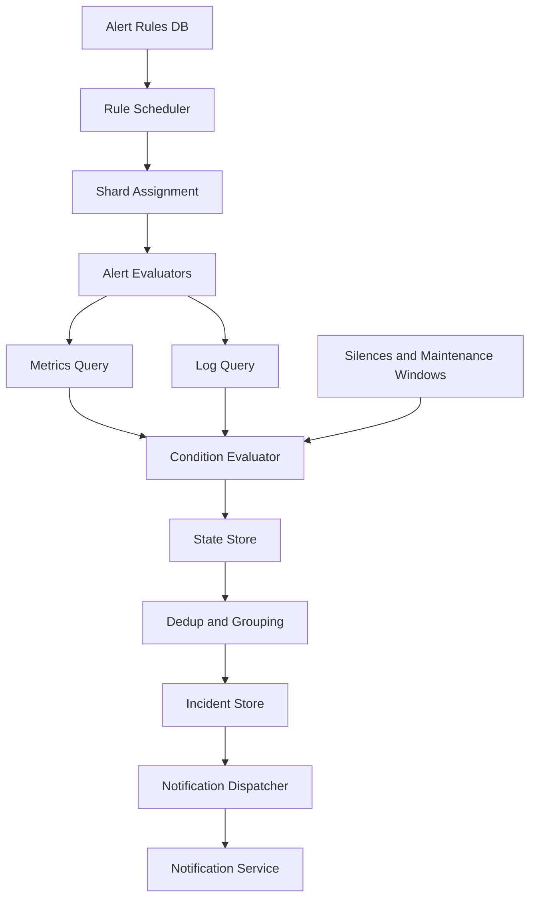
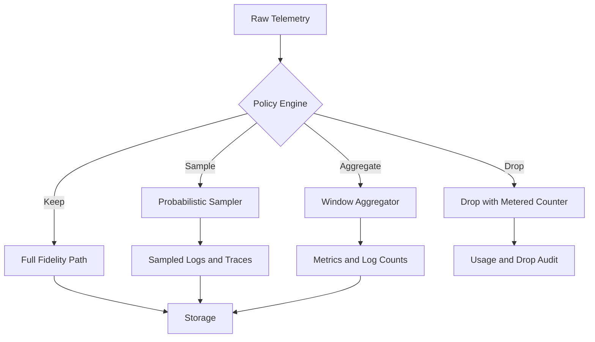

# Logging & Monitoring Platform — High-Level Design

## 1. Problem Statement & Scope

Design a multi-tenant observability platform similar to ELK, Datadog, and Prometheus.

The platform ingests logs, metrics, and traces from thousands of services and hosts.

It supports engineers during debugging, incident response, reliability reviews, and compliance investigations.

This is the HLD counterpart to an LLD logging framework.

The LLD framework focuses on log levels, appenders, formatters, async queues, and thread safety inside one process.

This HLD focuses on distributed collection, durable ingestion, storage engines, search, dashboards, alerting, retention, and multi-tenancy.

The key design goal is to accept high-volume telemetry without losing acknowledged data while still keeping query latency and storage cost reasonable.

### In scope

- Agents and collectors running on hosts, Kubernetes nodes, and sidecars.
- Collection of application logs, host logs, container logs, metrics, and traces.
- Push-based ingestion APIs using HTTP/2, gRPC, or OTLP-style protocols.
- Authentication of agents and users.
- Tenant-aware quotas and rate limits.
- Durable Kafka buffer between ingestion and storage.
- Stream processing for validation, enrichment, redaction, sampling, and aggregation.
- Elasticsearch or OpenSearch style inverted-index storage for logs.
- Distributed time-series database for metrics.
- Trace store for sampled spans and trace lookup.
- Object storage for cold and archive telemetry.
- Dashboard, query, alert, and administration services.
- Hot, warm, cold, and archive retention tiers.
- At-least-once ingest semantics with best-effort deduplication.

### Out of scope

- Implementing every language-specific telemetry SDK.
- Building a full incident-management product.
- Building a custom kernel profiler.
- Replacing billing systems, although metering hooks are included.
- Solving every data-science use case over telemetry.
- Guaranteeing globally exactly-once writes across all storage engines.

### Primary users

- Developers searching logs and traces during debugging.
- SREs monitoring SLOs, dashboards, and alerts.
- Platform engineers controlling observability cost and retention.
- Security teams searching audit trails.
- Engineering leaders reviewing service reliability trends.

### Success criteria

- Acknowledged telemetry survives node and AZ failures.
- Recent logs are searchable within seconds to tens of seconds.
- Metrics dashboards load with interactive latency.
- Alert evaluation is timely and avoids alert storms.
- Tenants are isolated for security, quota, retention, and noisy-neighbor control.
- Old data moves automatically to cheaper storage tiers.

## 2. Functional Requirements

### P0 requirements

- Collect logs from files, stdout, containers, hosts, applications, and managed runtimes.
- Collect metrics as counters, gauges, histograms, and summaries.
- Collect traces as spans with trace IDs, span IDs, parent IDs, tags, timing, and status.
- Support common collectors such as Fluent Bit, Fluentd, and OpenTelemetry Collector.
- Provide regional ingestion endpoints for direct agent push.
- Authenticate agents with ingestion tokens or mTLS certificates.
- Associate every telemetry record with exactly one tenant.
- Validate schemas, timestamps, field sizes, and payload sizes.
- Batch telemetry to reduce network, TLS, and broker overhead.
- Compress batches using gzip or zstd.
- Buffer accepted data durably before acknowledging ingestion.
- Search logs by tenant, time range, service, severity, trace ID, fields, and free text.
- Query metrics by metric name, labels, aggregation, and time range.
- Render dashboards with metric graphs, log tables, and trace panels.
- Configure threshold alerts over metrics.
- Configure log-count alerts over queries or error patterns.
- Group and deduplicate alert incidents.
- Send notifications through an external notification service.
- Support tenant-level retention policies.
- Support hot, warm, cold, and archive storage tiers.
- Expose admin APIs for quotas, retention, tenant settings, and ingestion tokens.

### P1 requirements

- Correlate logs, metrics, and traces using service, deployment, host, and trace context.
- Support saved searches and shared dashboards.
- Support silences and maintenance windows for alerts.
- Support anomaly alerts based on historical baselines.
- Support log redaction before indexing.
- Support active-series and label-cardinality controls for metrics.
- Support async export jobs for broad searches.
- Support tenant usage metering by bytes, series, retention, and query cost.
- Support trace lookup by trace ID, service, status, duration, and tags.
- Support role-based access control for dashboards, alerts, and admin actions.

### P2 requirements

- Synthetic monitoring integrations.
- Service dependency maps derived from traces.
- Root-cause suggestions based on correlated deploys and telemetry.
- Cross-region query federation.
- Dynamic sampling policies per service and signal.
- Tenant-facing cost optimization recommendations.

### Example user journeys

- A developer searches `level:ERROR service:checkout timeout` for the last 15 minutes.
- An SRE opens a dashboard showing request rate, error rate, latency percentiles, CPU, memory, and recent errors.
- A platform owner reduces debug log retention for a noisy tenant from 7 days to 1 day.
- An alert fires when checkout 5xx rate stays above 5 percent for 5 minutes.
- A user opens a slow trace and jumps to logs with the same trace ID.

## 3. Non-Functional Requirements

### Scale targets

- Initial footprint: 10,000 hosts.
- Growth target: 100,000 hosts.
- Initial active time series: 1 million to 10 million.
- Growth target: 50 million active time series with controls.
- Peak log ingestion: about 3 million log lines per second.
- Peak metric ingestion: about 15 million samples per second.
- Peak trace ingestion: about 600 thousand spans per second after sampling.
- Dashboard traffic: several thousand panel queries per second.
- Alerting: hundreds of thousands of rules.

### Latency targets

| Operation | p50 target | p99 target | Notes |
|---|---:|---:|---|
| Agent to durable Kafka append | 200 ms | 1 s | Excludes agent batch delay |
| Log indexed and searchable | 5 s | 30 s | Index refresh and backlog dependent |
| Metric sample queryable | 10 s | 60 s | TSDB ingest dependent |
| Dashboard panel, last 1 hour | 300 ms | 2 s | Cached metadata and rollups |
| Log search, last 15 minutes | 1 s | 5 s | Tenant and time filtered |
| Alert evaluation lag | 10 s | 60 s | Critical rules prioritized |
| Notification dispatch after firing | 5 s | 30 s | Provider dependent |

### Availability targets

- Ingestion API: 99.99 percent per region.
- Query API: 99.9 percent.
- Dashboard service: 99.9 percent.
- Alert evaluation: 99.95 percent.
- Metadata control plane: 99.95 percent.
- Archive retrieval: 99.5 percent is acceptable.

### Durability targets

- Do not lose acknowledged telemetry during a single broker, node, or AZ failure.
- Use Kafka replication factor 3 for raw buffer topics.
- Use storage replication factor 2 or 3 for hot stores.
- Use object storage for durable long-term archive.
- Prefer at-least-once delivery with deduplication over distributed exactly-once transactions.

### Consistency targets

- Telemetry search is eventually consistent.
- Dashboard metadata is read-after-write consistent for the author.
- Tenant quotas and RBAC changes are strongly consistent or bounded-stale.
- Alert state is eventually consistent but should avoid duplicate notifications through leases and fingerprints.

### Security requirements

- Encrypt telemetry in transit and at rest.
- Keep tenant ID in every message, index, shard key, object prefix, and metadata row.
- Enforce tenant filters server-side in query service.
- Use scoped ingestion tokens for agents.
- Audit tenant configuration, token creation, dashboard changes, and alert changes.
- Support redaction of secrets and PII-like patterns before indexing.
- Respect data residency policies.

### Cost requirements

- Separate hot, warm, cold, and archive retention costs.
- Let tenants tune retention by signal, severity, and service.
- Use rollups for older metrics.
- Use sampling and aggregation for high-volume low-value telemetry.
- Enforce tenant quotas to protect shared clusters.

## 4. Back-of-the-Envelope Estimation

Use the README convention: 1 day ≈ 100,000 seconds.

Assume peak is 3× average because incidents make services log more errors and emit more telemetry.

### Base assumptions

| Parameter | Assumption | Reason |
|---|---:|---|
| Hosts | 10,000 | Large enterprise starting scale |
| Log lines per host | 100 lines/s avg | Busy microservice estate |
| Average raw log line | 500 B | JSON log with fields |
| Metric samples per host | 500 samples/s avg | Infra plus application metrics |
| Average metric sample | 120 B | name, labels, timestamp, value |
| Trace spans per host | 20 spans/s avg | After sampling |
| Average span | 300 B | IDs, timing, tags |
| Kafka replication factor | 3 | Durable buffer |
| Hot log index expansion | 1.5× raw | Inverted index and doc values |
| Raw log archive compression | 4:1 | JSON compresses well |
| TSDB compression | 10:1 | Delta/XOR/chunk compression |
| Hot log retention | 7 days | Incident debugging |
| Warm log retention | 23 days | Recent investigations |
| Cold log retention | 365 days | Compliance and audit |
| Raw metric hot retention | 15 days | High-resolution debugging |
| Metric rollup retention | 365 days | Long-term trends |

### Ingestion rate

| Signal | Formula | Average | Peak |
|---|---|---:|---:|
| Logs | 10,000 hosts × 100 lines/s | 1,000,000 lines/s | 3,000,000 lines/s |
| Metrics | 10,000 hosts × 500 samples/s | 5,000,000 samples/s | 15,000,000 samples/s |
| Traces | 10,000 hosts × 20 spans/s | 200,000 spans/s | 600,000 spans/s |
| Total | logs + metrics + spans | 6,200,000 events/s | 18,600,000 events/s |

Average total events:

`1,000,000 + 5,000,000 + 200,000 = 6,200,000 events/s`

Peak total events:

`6,200,000 × 3 = 18,600,000 events/s`

### Ingest bandwidth

| Signal | Formula | Average bandwidth | Peak bandwidth |
|---|---|---:|---:|
| Logs | 1,000,000 × 500 B | 500 MB/s | 1.5 GB/s |
| Metrics | 5,000,000 × 120 B | 600 MB/s | 1.8 GB/s |
| Traces | 200,000 × 300 B | 60 MB/s | 180 MB/s |
| Raw total | 500 + 600 + 60 | 1.16 GB/s | 3.48 GB/s |
| With 30% network overhead | raw × 1.3 | 1.51 GB/s | 4.52 GB/s |

### Daily raw data

| Signal | Formula | Raw/day |
|---|---|---:|
| Logs | 500 MB/s × 100,000 s | 50 TB/day |
| Metrics | 600 MB/s × 100,000 s | 60 TB/day |
| Traces | 60 MB/s × 100,000 s | 6 TB/day |
| Total | 50 + 60 + 6 | 116 TB/day |

### Kafka buffer sizing

- Goal: absorb 6 hours of downstream storage degradation.
- Six hours = `6 × 3,600 = 21,600 s`.
- Average raw backlog = `1.16 GB/s × 21,600 s = 25,056 GB ≈ 25 TB`.
- With Kafka RF=3: `25 TB × 3 = 75 TB` broker disk.
- With 30 percent headroom: `75 TB × 1.3 = 97.5 TB ≈ 100 TB`.
- One-hour peak spike = `3.48 GB/s × 3,600 s = 12.5 TB raw`.
- Replicated one-hour peak = `12.5 TB × 3 = 37.5 TB`, covered by the 6-hour budget.

### Kafka partitions

- Assume one Kafka partition safely sustains 50 MB/s.
- Peak raw ingest is 3,480 MB/s.
- Minimum partitions = `3,480 / 50 = 69.6 ≈ 70`.
- Add 4× for tenant isolation, consumer parallelism, and growth.
- Recommended base = `70 × 4 ≈ 280 partitions` across topics.

| Topic | Partitions | Key |
|---|---:|---|
| telemetry.logs.raw | 256 | tenant_id + service + time_bucket |
| telemetry.metrics.raw | 512 | tenant_id + series_id |
| telemetry.traces.raw | 128 | tenant_id + trace_id |
| telemetry.logs.dlq | 64 | tenant_id |
| telemetry.metrics.dlq | 64 | tenant_id |

### Hot log storage

- Raw logs = 50 TB/day.
- Indexed primary logs = `50 TB/day × 1.5 = 75 TB/day`.
- Hot primary for 7 days = `75 TB/day × 7 = 525 TB`.
- Hot RF=2 = `525 TB × 2 = 1,050 TB = 1.05 PB`.
- Add 25 percent merge and disk-watermark headroom.
- Hot capacity = `1.05 PB × 1.25 = 1.31 PB`.
- With 8 TB usable SSD per node: `1,310 TB / 8 TB = 164 nodes`.
- Round to 180 hot log nodes for failures and shard relocation.

### Warm and cold log storage

- Warm primary = `75 TB/day × 23 days = 1,725 TB`.
- Warm effective RF=1.5 = `1,725 × 1.5 = 2,587.5 TB ≈ 2.6 PB`.
- Cold compressed raw logs = `50 TB/day / 4 = 12.5 TB/day`.
- Annual cold logs = `12.5 TB/day × 365 = 4,562.5 TB ≈ 4.6 PB`.

### Metrics storage

- Raw metrics = 60 TB/day.
- TSDB compressed primary = `60 / 10 = 6 TB/day`.
- Raw-resolution hot metrics = `6 TB/day × 15 = 90 TB primary`.
- With RF=3: `90 × 3 = 270 TB`.
- Rollups are assumed 100× smaller than raw compressed data.
- Rollup primary = `6 TB/day / 100 = 60 GB/day`.
- One year rollups with RF=3 = `60 GB/day × 365 × 3 = 65,700 GB ≈ 66 TB`.

### Query and alert traffic

- Active engineers: 5,000.
- Panels per dashboard: 20.
- Refresh interval: 30 seconds.
- Dashboard panel QPS = `5,000 × 20 / 30 = 3,333 panel queries/s`.
- Peak dashboard panel QPS = `3,333 × 2 = 6,666 panel queries/s`.
- Incident investigators: 1,000.
- One log search every 10 seconds = `1,000 / 10 = 100 searches/s`.
- Peak log search = `100 × 3 = 300 searches/s`.
- Alert rules = `200 tenants × 1,000 rules = 200,000 rules`.
- Critical 20 percent every 10 seconds = `40,000 / 10 = 4,000 eval/s`.
- Normal 80 percent every 60 seconds = `160,000 / 60 = 2,667 eval/s`.
- Total alert evaluation = `4,000 + 2,667 = 6,667 eval/s`.

### Initial service sizing

| Component | Unit assumption | Initial sizing |
|---|---:|---:|
| Ingestion gateways | 100 MB/s each | 60 gateways |
| Kafka brokers | 500 MB/s aggregate each | 30-50 brokers |
| Log processors | 50 MB/s each | 100 workers |
| Metric processors | 100k samples/s each | 200 workers |
| Hot ES/OpenSearch nodes | 8 TB usable SSD | 180 nodes |
| TSDB ingesters | 250k samples/s each | 80 ingesters |
| Query services | 200 panel QPS each | 50 services |
| Alert evaluators | 500 eval/s each | 20 evaluators |

## 5. API Design

### API principles

- Use REST for configuration, dashboards, saved searches, alerts, and tenant administration.
- Use gRPC or HTTP/2 for high-throughput ingestion from agents.
- Use WebSocket or Server-Sent Events for live tail and alert-state streaming.
- Require tenant context from auth claims for every request.
- Support idempotency keys for configuration mutations.
- Support batch IDs and event IDs for ingestion retries.
- Require time bounds and result limits for every query.
- Return query warnings when partial data, rollups, or sampling are used.

### Authentication model

- Agents authenticate with scoped ingestion tokens or mTLS certificates.
- Users authenticate with SSO and receive JWTs.
- Service-to-service calls use workload identity and mTLS.
- Auth claims include tenant_id, user_id, roles, scopes, and allowed regions.
- Gateway checks token status against a cache backed by the metadata DB.
- Query service injects tenant filters; clients cannot override them.

### Log ingestion API

`POST /v1/ingest/logs`

Headers:

| Header | Required | Description |
|---|---|---|
| Authorization | yes | Bearer ingestion token |
| X-Tenant-Id | yes | Tenant identifier validated against token |
| X-Batch-Id | yes | Agent-generated batch ID |
| Content-Encoding | no | gzip, zstd, or identity |

Request:

```json
{
  "source": {
    "host_id": "host-123",
    "agent_id": "agent-789",
    "service": "checkout",
    "environment": "prod",
    "region": "eastus"
  },
  "events": [
    {
      "event_id": "01JABC",
      "timestamp": "2026-08-05T00:00:00.123Z",
      "level": "ERROR",
      "message": "payment authorization failed",
      "trace_id": "4bf92f3577b34da6a3ce929d0e0e4736",
      "span_id": "00f067aa0ba902b7",
      "attributes": {
        "order_id": "o-123",
        "payment_provider": "stripe",
        "error_code": "timeout"
      }
    }
  ]
}
```

Response:

```json
{
  "accepted": 1000,
  "rejected": 2,
  "retry_after_ms": 0,
  "rejections": [
    {
      "event_id": "bad-1",
      "reason": "timestamp_too_old"
    }
  ]
}
```

Semantics:

- `202 Accepted` means the batch reached durable Kafka replication.
- `429 Too Many Requests` includes `retry_after_ms` for agent backoff.
- `413 Payload Too Large` asks the agent to reduce batch size.
- Duplicate `X-Batch-Id` within the dedup window returns the previous result.
- Malformed records can be partially rejected while valid records are accepted.

### Metric ingestion API

`POST /v1/ingest/metrics`

Request:

```json
{
  "resource": {
    "host_id": "host-123",
    "service": "checkout",
    "environment": "prod"
  },
  "samples": [
    {
      "metric": "http.server.duration_ms",
      "type": "histogram",
      "timestamp": "2026-08-05T00:00:00Z",
      "value": 128.4,
      "labels": {
        "route": "/checkout",
        "method": "POST",
        "status_code": "500"
      }
    }
  ]
}
```

Response:

```json
{
  "accepted": 5000,
  "dropped": 20,
  "drop_reason": "cardinality_limit_exceeded",
  "retry_after_ms": 0
}
```

Metric ingestion semantics:

- Counter resets are handled by query functions.
- Out-of-order samples are allowed within a small window, such as 2 minutes.
- Samples too far in the future or past are rejected or routed to DLQ.
- High-cardinality labels can be dropped, hashed, or rejected based on tenant policy.

### Trace ingestion API

`POST /v1/ingest/traces`

Request:

```json
{
  "resource": {
    "service": "checkout",
    "environment": "prod"
  },
  "spans": [
    {
      "trace_id": "4bf92f3577b34da6a3ce929d0e0e4736",
      "span_id": "00f067aa0ba902b7",
      "parent_span_id": "",
      "name": "POST /checkout",
      "start_time": "2026-08-05T00:00:00Z",
      "end_time": "2026-08-05T00:00:00.128Z",
      "status": "ERROR",
      "attributes": {
        "http.method": "POST",
        "http.status_code": "500"
      }
    }
  ]
}
```

### Log search API

`POST /v1/logs/search`

Request:

```json
{
  "query": "level:ERROR service:checkout timeout",
  "start_time": "2026-08-05T00:00:00Z",
  "end_time": "2026-08-05T01:00:00Z",
  "limit": 100,
  "cursor": "opaque-cursor",
  "sort": "timestamp_desc"
}
```

Response:

```json
{
  "results": [
    {
      "timestamp": "2026-08-05T00:59:59Z",
      "service": "checkout",
      "level": "ERROR",
      "message": "payment authorization failed",
      "attributes": {}
    }
  ],
  "next_cursor": "opaque-next-cursor",
  "scanned_bytes": 104857600,
  "took_ms": 824
}
```

### Metrics query API

`POST /v1/metrics/query_range`

Request:

```json
{
  "expression": "rate(http_requests_total{service=\"checkout\",status=~\"5..\"}[5m])",
  "start_time": "2026-08-05T00:00:00Z",
  "end_time": "2026-08-05T01:00:00Z",
  "step_seconds": 30
}
```

Response:

```json
{
  "series": [
    {
      "labels": {
        "service": "checkout",
        "region": "eastus"
      },
      "points": [
        ["2026-08-05T00:00:00Z", 12.4]
      ]
    }
  ],
  "warnings": [],
  "took_ms": 120
}
```

### Dashboard and alert APIs

| Method | Path | Description |
|---|---|---|
| POST | /v1/dashboards | Create dashboard |
| GET | /v1/dashboards/{dashboard_id} | Read dashboard |
| PUT | /v1/dashboards/{dashboard_id} | Update dashboard with version check |
| POST | /v1/dashboards/{dashboard_id}/render | Execute all panels |
| POST | /v1/alerts/rules | Create alert rule |
| GET | /v1/alerts/rules/{rule_id} | Read alert rule |
| PUT | /v1/alerts/rules/{rule_id} | Update alert rule |
| DELETE | /v1/alerts/rules/{rule_id} | Disable alert rule |
| GET | /v1/alerts/incidents | List incidents |
| POST | /v1/alerts/incidents/{incident_id}/silence | Silence incident |

Alert rule request:

```json
{
  "name": "Checkout 5xx rate high",
  "type": "metric_threshold",
  "expression": "sum(rate(http_requests_total{service=\"checkout\",status=~\"5..\"}[5m]))",
  "condition": {
    "operator": ">",
    "threshold": 100,
    "for_seconds": 300
  },
  "group_by": ["service", "region"],
  "severity": "critical",
  "notification_channels": ["pagerduty-primary", "teams-checkout"]
}
```

### Admin APIs

| Method | Path | Description |
|---|---|---|
| POST | /v1/admin/tenants | Create tenant |
| PUT | /v1/admin/tenants/{tenant_id}/quotas | Update quotas |
| PUT | /v1/admin/tenants/{tenant_id}/retention | Update retention |
| POST | /v1/admin/ingestion_tokens | Create ingestion token |
| DELETE | /v1/admin/ingestion_tokens/{token_id} | Revoke token |
| GET | /v1/admin/usage | Query usage and metering |

## 6. Data Model & Schema

### Storage engines

| Data | Store | Reason |
|---|---|---|
| Raw ingestion buffer | Kafka | Durable ordered partitions and replay |
| Hot logs | Elasticsearch/OpenSearch | Inverted index, text search, time filtering |
| Cold logs | Object storage | Cheap durable compressed storage |
| Metrics | Distributed TSDB | High write rate, compression, time-range queries |
| Traces | Span store or columnar store | Trace lookup and analytical scans |
| Metadata | PostgreSQL or distributed SQL | Strong consistency and transactions |
| Caches | Redis and local state | Quotas, auth, metadata, alert state |
| Usage metering | OLAP or columnar store | Tenant-level aggregations |

### Common telemetry envelope

| Field | Type | Notes |
|---|---|---|
| tenant_id | string | Required auth and partition boundary |
| event_id | string | ULID or UUID for deduplication |
| signal_type | enum | log, metric, trace |
| timestamp | timestamp | Event time |
| ingest_time | timestamp | Platform receipt time |
| service | string | Logical service name |
| environment | string | prod, staging, dev |
| region | string | Source region |
| host_id | string | Host or node ID |
| agent_id | string | Collector ID |
| schema_version | int | Evolution control |
| attributes | map | Bounded dynamic fields |

### Log document schema

Index pattern:

`logs-{tenant_hash}-{yyyy.MM.dd.HH}` for high-volume tenants.

`logs-shared-{bucket}-{yyyy.MM.dd}` for smaller tenants.

| Field | Type | Indexing | Notes |
|---|---|---|---|
| tenant_id | keyword | indexed | Mandatory filter |
| timestamp | date | indexed | Time range filter |
| ingest_time | date | indexed | Ingestion delay debugging |
| service | keyword | indexed | Common filter |
| environment | keyword | indexed | Common filter |
| region | keyword | indexed | Common filter |
| host_id | keyword | indexed | Host drilldown |
| level | keyword | indexed | INFO, WARN, ERROR |
| message | text | full-text | Analyzer tokenizes message |
| trace_id | keyword | indexed | Correlation |
| span_id | keyword | indexed | Correlation |
| attributes.* | flattened | selective | Avoid mapping explosion |
| raw | binary or disabled | not indexed | Optional original payload |

### Metric series schema

Series key:

`hash(tenant_id, metric_name, sorted_labels)`

| Field | Type | Notes |
|---|---|---|
| tenant_id | string | Tenant boundary |
| metric_name | string | e.g., http_requests_total |
| labels | map<string,string> | Bounded dimensions |
| series_id | uint64/hash | Routing and lookup |
| timestamp | int64 | Unix milliseconds |
| value | float64 | Sample value |
| type | enum | counter, gauge, histogram |

TSDB chunk schema:

| Chunk field | Type | Notes |
|---|---|---|
| series_id | uint64 | Primary key part |
| start_time | int64 | Chunk start |
| end_time | int64 | Chunk end |
| encoded_points | bytes | Delta/XOR compressed samples |
| min_value | float | Query pruning |
| max_value | float | Query pruning |
| sample_count | int | Aggregation metadata |

### Trace span schema

| Field | Type | Notes |
|---|---|---|
| tenant_id | string | Tenant boundary |
| trace_id | string | Trace lookup key |
| span_id | string | Unique within trace |
| parent_span_id | string | Tree relation |
| service | string | Service name |
| operation | string | Span name |
| start_time | timestamp | Time search |
| duration_ms | double | Latency filtering |
| status | string | OK or ERROR |
| attributes | map | Bounded tags |

### Metadata tables

| Table | Key | Purpose |
|---|---|---|
| tenants | tenant_id | Tenant lifecycle and plan |
| tenant_quotas | tenant_id | Ingest, query, retention, and cardinality quotas |
| retention_policies | policy_id | Hot, warm, cold, archive rules |
| dashboards | dashboard_id | Dashboard JSON, version, owner |
| alert_rules | rule_id | Rule expression, window, grouping, channels |
| alert_incidents | incident_id | Firing, resolved, silenced states |
| ingestion_tokens | token_id | Agent credentials and scopes |
| usage_daily | tenant_id + date | Daily metering rollups |

### Deduplication state

| Key | Value | TTL |
|---|---|---|
| tenant_id:batch_id | accepted or rejected summary | 24 h |
| tenant_id:event_id | seen marker | 24 h |
| tenant_id:series_id:last_ts | last accepted timestamp | 1 h |
| tenant_id:trace_id:span_id | seen span marker | 24 h |

Deduplication is best effort.

It removes common retry duplicates without requiring global exactly-once transactions.

## 7. High-Level Architecture



### Component responsibilities

Agents collect telemetry close to workloads.

They tail log files, scrape local metrics, receive OTLP signals, batch payloads, compress data, and retry with backoff.

Ingestion gateways terminate TLS, authenticate agents, enforce tenant quotas, validate schemas, and append accepted batches to Kafka.

Kafka is the durable shock absorber between producers and storage systems.

Stream processors parse, enrich, redact, sample, aggregate, and route telemetry.

Log indexers write normalized log documents into time-partitioned search indices.

Metric ingesters transform samples into series IDs and compressed TSDB chunks.

Trace processors group spans and write searchable span records.

Cold archive writers store compressed raw or normalized telemetry in object storage.

Query service provides a unified API over logs, metrics, traces, metadata, and archive retrieval.

Dashboard service stores dashboard definitions and calls query service for panels.

Alert engine evaluates rules using streaming windows and scheduled queries.

Notification service integration sends email, SMS, PagerDuty, Teams, Slack, or webhooks.

Metadata DB stores tenant configuration, dashboards, alert rules, retention policies, and auth metadata.

Redis or local state caches accelerate quotas, auth checks, rule state, query planning, and deduplication.

### Ingestion flow

- Agent batches records by signal type, tenant, size, and max delay.
- Agent sends compressed batch to regional ingestion gateway.
- Gateway authenticates token and loads tenant quota from cache.
- Gateway validates schema, timestamp, field count, and payload size.
- Gateway adds ingest metadata and appends the batch to Kafka.
- Gateway returns `202 Accepted` after broker acknowledgement.
- Stream processor consumes Kafka, transforms records, and writes to target stores.
- Processor commits offsets only after durable write or DLQ handoff.

### Query flow

- Client sends query with tenant-scoped credentials.
- Query service checks RBAC and injects tenant filter.
- Query planner selects log, metric, trace, or archive backend.
- Planner expands time range into shards, blocks, or object prefixes.
- Query service fans out to storage nodes.
- Partial results are merged, sorted, limited, and returned with warnings.

### Alert flow

- Rule scheduler shards alert rules across evaluator workers.
- Evaluator loads rule, silence state, and previous incident state.
- Evaluator runs a metric or log query for the evaluation window.
- Condition evaluator compares results to threshold or anomaly baseline.
- Incident store is updated by fingerprint.
- Notification request is emitted only on state transition or reminder interval.

## 8. Deep Dives

### A. Ingestion pipeline and backpressure

The ingestion pipeline is the most critical path.

A monitoring platform is trusted only if acknowledged data is not lost.

The design uses at-least-once delivery with durable buffering.

Exactly-once delivery across agents, Kafka, processors, and multiple storage systems is avoided because it adds large operational complexity.

Duplicates are controlled through stable IDs and idempotent writes where practical.



#### Agent batching

Agents maintain separate buffers for logs, metrics, and traces.

They batch by max records, max bytes, and max delay.

| Signal | Max records | Max bytes | Max delay |
|---|---:|---:|---:|
| Logs | 5,000 | 2 MB | 1 s |
| Metrics | 20,000 | 2 MB | 5 s |
| Traces | 2,000 spans | 1 MB | 2 s |

Batching improves compression and reduces TLS and HTTP overhead.

The trade-off is small additional ingestion latency.

This is acceptable for most logs and metrics.

Critical alert metrics can use smaller batches or a high-priority lane.

#### Backpressure layers

| Layer | Mechanism | Behavior |
|---|---|---|
| Agent | Disk-backed queue | Survives restarts and network loss |
| Gateway | Tenant token bucket | Returns 429 with retry-after |
| Kafka | Durable retention and quotas | Absorbs downstream outages |
| Processor | Consumer lag autoscaling | Adds workers before backlog grows too much |
| Storage | Bulk write queues | Slows processors when overloaded |
| Query service | Concurrency and cost limits | Protects stores from expensive reads |

If gateway returns 429, the agent retries with exponential backoff and jitter.

If the local disk buffer is full, tenant policy decides what to do.

The default policy is to drop or sample low-priority debug logs before blocking applications.

Audit logs and critical metrics are protected longer.

#### Durable acknowledgements

Gateway returns success only after Kafka acknowledges the write.

Kafka producers use idempotent producer mode.

Kafka topics use replication factor 3.

Kafka brokers require `min.insync.replicas=2`.

If fewer than two replicas are available, ingestion returns retryable errors.

This protects acknowledged batches from a single broker or AZ failure.

#### Ordering

Global ordering is not required.

Approximate per-source ordering is useful for log tailing.

Logs are keyed by tenant, service, host, and time bucket.

Metrics are keyed by series ID to preserve sample order.

Traces are keyed by trace ID so spans for a trace are processed together.

#### Handling spikes

Spikes happen during outages because services emit more errors.

The system handles spikes in this order:

- Absorb short spikes in agent memory and disk buffers.
- Absorb regional spikes in Kafka.
- Autoscale stateless gateways and processors.
- Degrade optional enrichment.
- Apply tenant quotas.
- Apply severity-aware sampling for tenants above contracted capacity.
- Return retryable errors for low-priority ingestion.

#### Dead-letter queue

Records go to DLQ when they cannot be processed due to data issues.

Examples include invalid timestamps, oversized fields, too many attributes, parser failures, and cardinality-limit violations.

DLQ records include tenant ID, error reason, processor version, first failure time, and a redacted copy of the payload if allowed.

DLQ retention can be 7 days.

Operators can replay DLQ after parser or schema fixes.

### B. Metrics storage, compression, and cardinality

Metrics are high-volume and latency-sensitive.

The TSDB optimizes for append-heavy writes and time-range reads.

A metric is identified by name plus labels.

Each unique label set creates a time series.

Cardinality explosion is the main risk.



#### Write path

Samples are routed by `tenant_id + series_id`.

The receiving ingester appends the sample to a write-ahead log.

The sample is then added to an in-memory head block.

Head blocks flush compressed chunks periodically.

Chunks are grouped into time blocks, such as two-hour blocks.

Compactors merge small blocks and create rollups.

Query nodes read recent data from ingesters and older data from block storage.

#### Compression

Time-series data compresses well because timestamps and values are correlated.

Common techniques include delta-of-delta timestamp encoding, XOR floating-point value encoding, run-length encoding for repeated values, and dictionary encoding for labels.

Example:

A CPU metric sampled every 10 seconds has predictable timestamps.

Only small timestamp deltas need storage.

If values change slowly, XOR encoding stores few bits per sample.

This is why 10:1 compression is realistic for many metrics.

#### Downsampling and rollups

| Raw resolution | Retention | Rollup resolution | Retention |
|---|---:|---|---:|
| 10 s | 15 days | 1 min | 90 days |
| 1 min | 90 days | 5 min | 1 year |
| 5 min | 1 year | 1 hour | 3 years |

For counters, rollups preserve count increase and rate-friendly aggregates.

For gauges, rollups store min, max, avg, last, and count.

For histograms, rollups merge buckets or use sketches.

Dashboards choose the coarsest resolution that preserves chart fidelity.

#### Cardinality explosion

If a metric has 10 regions, 100 services, 50 endpoints, 5 status codes, and 4 methods:

`10 × 100 × 50 × 5 × 4 = 1,000,000 series`

Adding user_id with 1 million users creates:

`1,000,000 × 1,000,000 = 10^12 series`

That is impossible to store or query cost-effectively.

Bad labels include user_id, request_id, session_id, full URL with IDs, email address, and highly churned container IDs.

#### Cardinality controls

- Enforce max active series per tenant.
- Enforce max label names per metric.
- Enforce max label value length.
- Drop, hash, or reject disallowed labels.
- Provide allowlists for indexed dimensions.
- Detect sudden new-series rate spikes.
- Show top cardinality contributors to tenants.
- Convert per-request detail into exemplars or traces instead of labels.

### C. Log storage and search

Logs require search over semi-structured text and fields.

Recent logs are stored in an inverted-index search store.

Older logs move to cheaper storage.



#### Inverted index basics

An inverted index maps terms to documents.

For message text, the analyzer tokenizes strings into searchable terms.

For keyword fields, the index maps exact values to document IDs.

Query example:

`tenant:t1 AND timestamp:[now-15m TO now] AND service:checkout AND level:ERROR AND "timeout"`

The search store intersects postings lists for tenant, service, level, and token `timeout`.

It filters by timestamp and returns top documents sorted by timestamp.

#### Sharding by time and tenant

Time-based sharding reduces query fan-out.

High-volume tenants get dedicated indices.

Low-volume tenants share multi-tenant indices with tenant routing.

| Tenant type | Index pattern | Rollover |
|---|---|---|
| Large tenant | logs-tenantA-yyyy.MM.dd.HH | hourly |
| Medium tenant | logs-tenantB-yyyy.MM.dd | daily |
| Small tenants | logs-shared-bucket17-yyyy.MM.dd | daily |

Rollover happens by size or age.

A common shard target is 30 to 50 GB.

Warm read-only indices are force-merged after rollover.

#### Mapping explosion prevention

Arbitrary JSON logs can create too many fields.

The system prevents mapping explosion with a fixed top-level schema, flattened dynamic attributes, indexed-field allowlists, per-tenant max indexed fields, and value truncation.

Raw payload can be stored separately or left unindexed.

#### Retention tiers

| Tier | Storage | Retention | Query latency | Use case |
|---|---|---:|---:|---|
| Hot | SSD search nodes | 7 days | seconds | Active incidents |
| Warm | Dense disks | 23 days | seconds to tens of seconds | Recent investigations |
| Cold | Searchable snapshots | 90 days | tens of seconds to minutes | Audits |
| Archive | Object storage | 365+ days | minutes to hours | Rare retrieval |

Retention can vary by severity.

ERROR logs might stay hot for 14 days and archived for 365 days.

DEBUG logs might stay hot for 1 day and have no archive retention.

#### Query fan-out

The query service converts a time range into an index list.

A 15-minute query may hit one hourly index.

A 7-day query may hit 168 hourly indices for a high-volume tenant.

The planner limits fan-out by requiring time ranges, injecting tenant filters, using index metadata, parallelizing shard queries, and moving huge exports to async jobs.

### D. Alerting engine

Alerting turns telemetry into actionable incidents.

The hard parts are evaluation lag, grouping, deduplication, and storm prevention.



#### Rule sharding

Rules are sharded by `tenant_id + rule_id`.

A scheduler assigns shards to evaluator workers using leases.

Leases are stored in a strongly consistent metadata store or coordination service.

If an evaluator dies, another evaluator takes over after lease expiry.

Critical rules can run every 10 seconds.

Normal rules can run every 60 seconds.

#### Streaming and scheduled evaluation

Metric alerts can be evaluated in streaming mode or scheduled-query mode.

Streaming mode consumes pre-aggregated windows from stream processors.

It has lower lag and lower query cost.

Scheduled mode queries the TSDB or log store on each interval.

It is more flexible and supports arbitrary expressions.

The design uses streaming for common thresholds and scheduled queries for complex rules.

#### Windowing

For a 5-minute rule evaluated every minute, use:

`[now - 5m - allowed_lateness, now - allowed_lateness]`

Allowed lateness is typically 30 to 60 seconds.

This avoids flapping when samples arrive late.

For logs, stream processors maintain count windows for common alerts.

For arbitrary log search alerts, evaluators query the log store.

#### Deduplication and grouping

Each alert instance gets a fingerprint:

`hash(tenant_id, rule_id, group_by label values)`

If the same fingerprint is already firing, update `last_seen` instead of creating a new incident.

Grouping examples:

- Group by service for service-wide error rate.
- Group by service and region for regional outages.
- Group by host for disk alerts.

Too much grouping creates alert storms.

The UI should warn if a rule can produce thousands of groups.

#### Avoiding alert storms

- Deduplicate by fingerprint.
- Group notifications by service and region.
- Suppress downstream alerts when an upstream dependency alert is firing.
- Rate-limit notifications per tenant and channel.
- Support silences and maintenance windows.
- Require a `for` duration before firing.
- Send resolved notifications only after stable recovery.
- Prefer burn-rate alerts over single-window noisy alerts.

#### Notification integration

The alert engine does not directly call every provider.

It sends normalized notification requests to a notification service.

The notification service owns provider-specific retries, templates, rate limits, and DLQs.

Alert payload includes severity, rule name, incident URL, dashboard URL, query snapshot, and grouping labels.

### E. Sampling and aggregation to control cost

Observability cost can grow faster than application traffic.

The platform needs explicit controls before storage systems are overwhelmed.



#### Sampling techniques

| Technique | Applies to | Description |
|---|---|---|
| Head sampling | Traces | Decide before full trace is known |
| Tail sampling | Traces | Decide after latency or status is known |
| Probabilistic sampling | Logs/traces | Keep N percent uniformly |
| Severity-aware sampling | Logs | Keep errors, sample debug and info |
| Rate-limited sampling | Logs | Keep up to N events/s per key |
| Dynamic sampling | Logs/traces | Increase fidelity during incidents |

Tail sampling is valuable for traces because it can keep slow or failed traces.

For logs, audit and security events should not be sampled unless policy explicitly permits it.

Debug logs are the first candidate for sampling.

#### Aggregation techniques

Log aggregation converts repeated events into counts.

Instead of indexing one million identical timeout messages, store message template hash, service, region, severity, count per minute, and a few example event IDs.

Metrics aggregation can happen at the agent and stream processor layers.

Agent-side aggregation reduces network cost.

Server-side aggregation is easier to control centrally.

The design supports both.

#### Policy hierarchy

Sampling policy is selected in this order:

- Legal or compliance policy.
- Tenant contract.
- Signal-specific retention policy.
- Service override.
- Dynamic overload policy.

Overload policy cannot override compliance retention.

Dropped or sampled records are counted as metrics so tenants understand fidelity loss.

## 9. Scaling/Caching/Bottlenecks

### Partitioning strategy

| Component | Partition key | Reason |
|---|---|---|
| Ingestion gateway quota | tenant_id | Isolation and fairness |
| Kafka logs | tenant_id + service + time_bucket | Parallelism and locality |
| Kafka metrics | tenant_id + series_id | Per-series ordering |
| Kafka traces | tenant_id + trace_id | Group spans |
| Log indices | tenant + time | Query pruning |
| TSDB shards | tenant + series_id | Even distribution |
| Alert rules | tenant + rule_id | Stable ownership |
| Metadata DB | tenant_id | RBAC and lookup locality |

### Horizontal scaling

- Ingestion gateways are stateless and scale behind regional load balancers.
- Kafka scales by adding brokers and partitions.
- Stream processors scale by consumer group parallelism.
- Log storage scales by adding data nodes and shards.
- TSDB scales by adding ingesters, store gateways, and compactors.
- Query services scale horizontally because they are mostly stateless.
- Alert evaluators scale by rule shard count.

### Query caching

| Cache | Key | TTL | Notes |
|---|---|---:|---|
| Dashboard metadata | tenant + dashboard_id + version | 5 min | Invalidate on update |
| Metric label names | tenant + metric | 10 min | Query builder speed |
| Metric query result | normalized expression + time + step | 30 s | Useful for dashboards |
| Log index metadata | tenant + time range | 5 min | Avoid cluster-state calls |
| Alert rule state | rule fingerprint | persistent | Redis or RocksDB |
| Auth token introspection | token hash | 1 min | Short TTL for revocation |

Metric dashboard caching is effective because panels refresh repeatedly.

Log result caching is less effective because searches are ad hoc.

### Bottleneck: Kafka hot partitions

A noisy tenant or service can create hot partitions.

Mitigations:

- Add hash salt for high-volume tenants.
- Split large tenants into dedicated topics.
- Enforce tenant quotas before Kafka.
- Monitor partition bytes/sec and consumer lag.
- Increase partitions carefully because repartitioning has operational cost.

### Bottleneck: Elasticsearch indexing pressure

Indexing pressure comes from high write rate, high-cardinality fields, and segment merges.

Mitigations:

- Bulk indexing with adaptive batch size.
- Dedicated ingest nodes.
- Disable indexing for unneeded fields.
- Use flattened fields for dynamic attributes.
- Rollover before shards become too large.
- Keep shard size around 30 to 50 GB.
- Force merge warm read-only indices.

### Bottleneck: expensive log queries

Broad time ranges and low-selectivity text queries are expensive.

Mitigations:

- Require time ranges.
- Always inject tenant filter.
- Limit concurrent queries per tenant.
- Estimate query cost before execution.
- Use async jobs for archive and large exports.
- Return partial results with warnings when needed.

### Bottleneck: metric cardinality

Cardinality affects memory, disk, compaction, and query fan-out.

Mitigations:

- Active-series quota.
- Label allowlists.
- High-cardinality label detection.
- Per-tenant cardinality dashboards.
- Drop or aggregate offending series.
- Use exemplars and traces for per-request details.

### Bottleneck: alert evaluation fan-out

Naive alerting can run hundreds of thousands of expensive queries.

Mitigations:

- Precompute common windows.
- Shard rules and evaluate near data.
- Reuse query results across rules with the same expression.
- Use streaming evaluation for common thresholds.
- Rate-limit rule creation and minimum evaluation interval.
- Prioritize critical alerts during overload.

### Bottleneck: object archive restores

Archive queries can consume large bandwidth and compute.

Mitigations:

- Require async query jobs.
- Require narrow time ranges and filters.
- Partition objects by tenant, signal, date, and hour.
- Store Parquet where column pruning is valuable.
- Cache recently restored archive segments.

## 10. Reliability & Consistency

### Failure handling

| Failure | Impact | Mitigation |
|---|---|---|
| Agent restart | Telemetry delayed | Disk buffer and checkpoints |
| Gateway crash | In-flight unacked batch retried | Agent retries with batch ID |
| Kafka broker loss | Reduced capacity | RF=3 and min ISR=2 |
| Processor crash | Duplicate processing possible | Offset commit after write and idempotence |
| Log store outage | Logs not searchable yet | Kafka backlog absorbs outage |
| TSDB ingester loss | Recent metrics risk | WAL and ingester replication |
| Metadata DB primary loss | Config writes paused briefly | Synchronous replica and failover |
| Alert evaluator crash | Missed interval possible | Lease takeover and state store |
| Notification provider outage | Delayed notifications | Notification service retries and DLQ |

### No-data-loss ingest path

Acknowledged ingestion is protected by Kafka durability.

Agents retry until gateway accepts or local retention expires.

Gateway does not acknowledge before Kafka replication.

Processors do not commit offsets before durable storage write.

Storage systems replicate hot data across nodes or zones.

Cold archive provides additional long-term durability.

This gives strong practical durability without global distributed transactions.

### At-least-once implications

At-least-once delivery means duplicates are possible.

Duplicate logs may appear if index write succeeds but offset commit fails.

Duplicate metrics can distort counters if not handled.

Duplicate spans can appear in traces.

Mitigations:

- Event IDs for logs.
- Batch IDs for gateway deduplication.
- Series timestamp conflict handling for metrics.
- Trace span ID uniqueness for spans.
- Query-time deduplication for recent windows when necessary.

### Consistency model

| Area | Model | Reason |
|---|---|---|
| Ingestion acceptance | Durable after Kafka ack | Protect acknowledged data |
| Log search | Eventually consistent | Index refresh and backlog |
| Metrics query | Eventually consistent | Ingest and compaction lag |
| Alert state | Eventually consistent with leases | Avoid double firing |
| Tenant quotas | Strong or bounded-staleness | Prevent abuse |
| RBAC | Strong | Security-sensitive |
| Dashboard metadata | Read-after-write for owner | User experience |

### Multi-region and disaster recovery

Initial design uses regional ingestion and regional storage.

Agents send to the nearest allowed region.

If a region is unavailable, agents can fail over to another region if tenant data-residency policy allows it.

Metadata is replicated globally with a primary write region.

Hot stores snapshot to object storage.

TSDB blocks are stored in replicated object storage after compaction.

Metadata DB has point-in-time recovery backups.

Dashboard and alert configuration are backed up continuously.

### Graceful degradation

The system degrades before failing hard.

Degradation order:

- Disable optional enrichment.
- Increase batch sizes.
- Delay low-priority indexing.
- Move debug logs directly to cold archive.
- Apply tenant quotas.
- Sample low-severity logs.
- Reject new low-priority ingestion with retryable errors.

Critical metrics, audit logs, and error logs are protected longer than debug logs.

### Security reliability

Tenant isolation is enforced in every layer.

Kafka messages include tenant ID and authenticated principal metadata.

Processors do not trust tenant ID from payload alone.

Query service injects tenant filter from auth claims.

Storage indices include tenant routing.

Admin actions are audited.

Secrets in logs are redacted before indexing where possible.

## 11. Trade-offs & Alternatives

| Decision | Option A | Option B | Choice | Rationale |
|---|---|---|---|---|
| Metric ingestion model | Pull/scrape Prometheus-style | Push via agents/gateways | Hybrid, push-first | Push works across private networks and SaaS boundaries; agents can scrape locally. |
| Delivery semantics | Exactly-once | At-least-once with dedup | At-least-once | Exactly-once across all stores is too complex; duplicates are manageable. |
| Buffer | Kafka | Direct writes to storage | Kafka | Durable backpressure and replay are essential. |
| Metrics store | TSDB | Generic columnar DB | TSDB for hot metrics | TSDB gives compression and time-range query efficiency. |
| Logs store | Elasticsearch/OpenSearch | Columnar DB | ES/OpenSearch for hot logs | Inverted index gives fast text search. |
| Cold logs format | Raw compressed JSON | Parquet | Both | Raw preserves fidelity; Parquet enables cheaper analytics. |
| Log partitioning | Tenant-only | Tenant + time | Tenant + time | Time filters are mandatory and reduce fan-out. |
| Index strategy | Index all fields | Allowlisted fields plus flattened attrs | Allowlisted | Prevents mapping explosion and cost spikes. |
| Sampling | Full retention | Sampling/aggregation | Policy-based sampling | Full fidelity is expensive; policies preserve critical data. |
| Alert evaluation | Scheduled queries only | Streaming windows | Hybrid | Scheduled is flexible; streaming is cheaper and faster for common rules. |
| Alert notifications | Direct provider calls | Notification service | Notification service | Separates provider retries, templates, rate limits, and DLQs. |
| Hot/cold tiering | Keep everything hot | Tier by age/severity | Tiered | Hot retention for all data is too expensive. |
| Multi-tenancy | Shared clusters | Dedicated clusters per tenant | Shared with dedicated option | Shared lowers cost; large regulated tenants may need dedicated capacity. |
| Query API | Store-specific APIs | Unified query service | Unified service | Centralizes auth, quotas, planning, and cross-signal correlation. |
| Trace storage | Store spans in ES | Dedicated span store | Dedicated span store | Trace lookup and analytical scans need different access patterns. |

### Push vs pull metrics

Prometheus-style pull is simple inside one cluster because the server controls scrape interval and target health.

Pull is harder across NAT, private networks, customer environments, and SaaS boundaries.

Push through agents is more natural for a hosted platform.

A hybrid system lets collectors scrape local targets and push aggregated samples upstream.

### TSDB vs columnar for metrics

A TSDB is optimized for recent time-series writes and range queries.

A columnar database is strong for ad hoc analytical aggregation over long history.

The design uses TSDB for hot and warm metrics, then can export rollups to columnar/object storage for long-term analytics.

### Elasticsearch vs columnar for logs

Elasticsearch is strong for full-text search and interactive debugging.

Columnar stores are cheaper for structured scans and aggregations.

The design uses Elasticsearch/OpenSearch for hot searchable logs and object storage or Parquet for archive analytics.

### Sampling vs full retention

Full retention maximizes debugging fidelity but is expensive at high volume.

Sampling reduces cost but can hide rare events.

The design keeps errors and compliance logs by default, samples noisy low-severity logs, and records sampling metadata.

### Hot/cold tiering

Hot storage gives fast queries but costs much more.

Cold storage reduces cost but increases query latency and operational complexity.

The design makes tiering configurable by tenant, signal, severity, and age.

## 12. Future Improvements

- Add adaptive anomaly detection using seasonal baselines.
- Add service dependency maps from traces and network telemetry.
- Add automatic incident correlation across metrics, logs, traces, deploys, and feature flags.
- Add query cost advisor that suggests narrower filters before expensive searches run.
- Add tenant-facing cardinality recommendations and automatic label normalization.
- Add eBPF-based host telemetry for low-overhead network and syscall insights.
- Add live tail with WebSocket streaming from Kafka or hot indices.
- Add cross-region query federation with data residency controls.
- Add dedicated compliance archive with WORM retention.
- Add customer-managed encryption keys per tenant.
- Add SLO management with burn-rate alerts and error budget dashboards.
- Add trace tail-sampling policies controlled by service owners.
- Add automatic index template tuning based on observed query patterns.
- Add replay tooling for DLQ and cold archive restore.
- Add synthetic checks and browser monitoring.
- Add richer RBAC for dashboard folders, queries, alerts, and ingestion tokens.
- Add per-team budgets and telemetry cost allocation dashboards.
- Add incident timeline generation from alert state changes and correlated deploys.
- Add support for OpenTelemetry semantic convention migration tooling.
- Add edge aggregation for disconnected environments.
