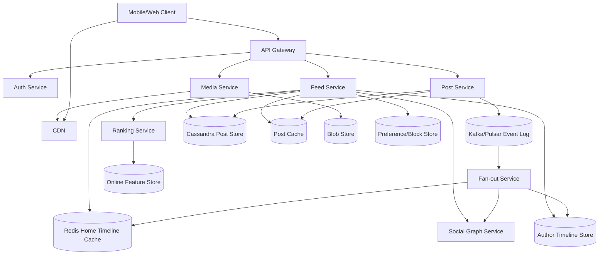
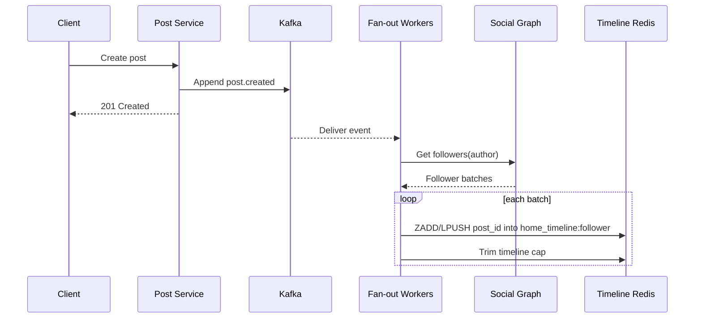
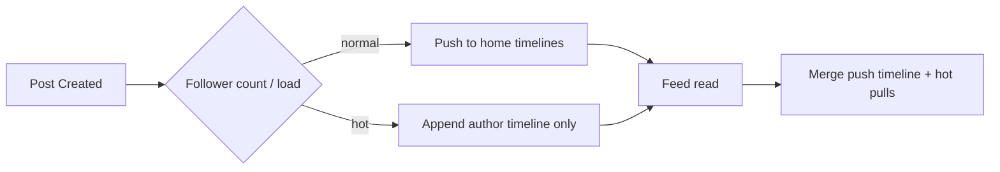
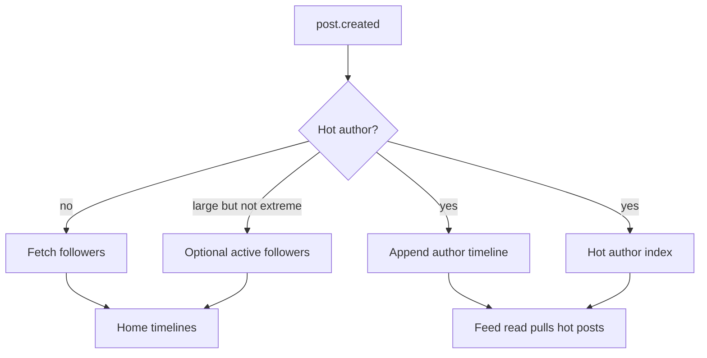
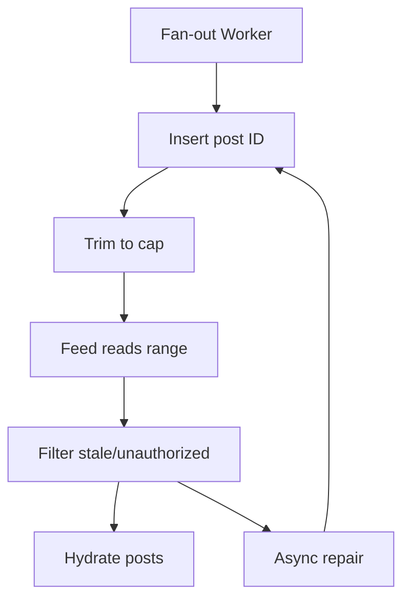
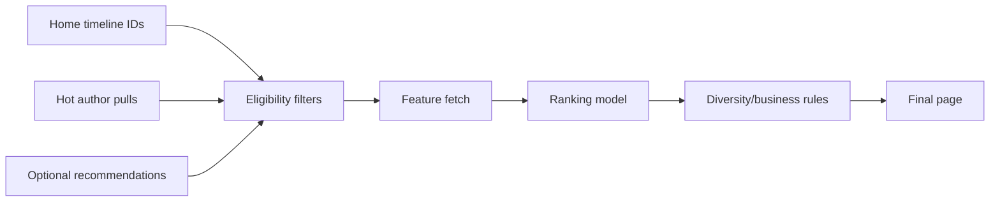
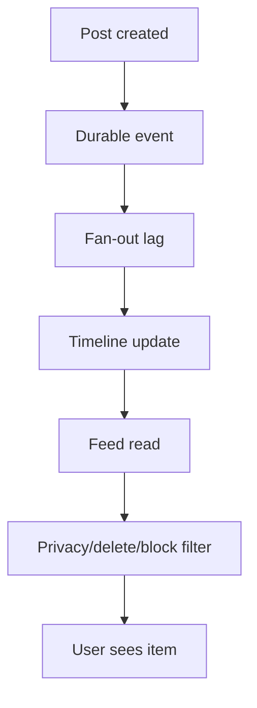
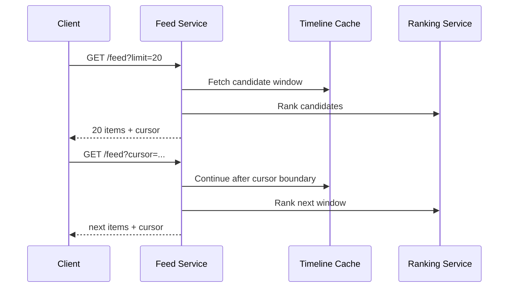

# News Feed System — High-Level Design

## 1. Problem Statement & Scope

Design a News Feed system similar to Facebook, Twitter/X, or Instagram.

Users publish posts, follow other users, and consume a personalized infinite-scroll home feed.

The system is read-heavy: feed opens happen far more often than post creation.

The central design challenge is serving low-latency personalized feeds while fan-out cost follows a power-law follower distribution.

The feed is a materialized and ranked view over canonical posts, social graph edges, user preferences, and media metadata.

In scope:
- Create text and media posts.
- Follow and unfollow users.
- Generate home feed from followed users.
- Rank candidates by relevance and freshness.
- Support cursor pagination and infinite scroll.
- Support near-real-time updates for active clients.
- Use CDN for media delivery.
- Handle celebrities/hot users without huge synchronous fan-out.
- Use eventual consistency where acceptable.
- Provide repair and replay paths for derived timelines.

Out of scope:
- Full ads auction.
- Full comments/reactions subsystem.
- Direct messaging.
- Advanced moderation ML internals.
- Search over all posts.
- Multi-hop recommendations, except as future work.
- Complex privacy groups beyond public/followers-only/private.

Success criteria:
- Feed first page p99 under 300 ms when timeline is cached.
- Post publish p99 under 200 ms excluding raw media upload.
- Normal-user posts appear in follower feeds within a few seconds.
- Celebrity posts do not create queue storms.
- Canonical posts are durable; timeline caches are rebuildable.

## 2. Functional Requirements

P0 requirements:
- A user can create a post with text and optional media IDs.
- A user can fetch a home feed containing posts from followed accounts.
- A user can follow and unfollow another user.
- Feed supports page size limits and opaque cursors.
- Feed filters deleted, blocked, muted, and unauthorized posts.
- Feed hydrates post IDs into post objects and media URLs.
- Feed supports normal users through fan-out-on-write.
- Feed supports celebrities through fan-out-on-read or hybrid handling.
- Post publish returns after durable post write and event append, not after full fan-out.

P1 requirements:
- Rank feed by freshness, affinity, engagement, quality, and diversity.
- Provide chronological fallback if Ranking Service fails.
- Support near-real-time feed update hints over WebSocket/SSE.
- Support deletion and asynchronous timeline cleanup.
- Support follow backfill for recent posts from a newly followed account.
- Support feed seen-state to suppress duplicates across pages.
- Support media upload/finalize flow and CDN delivery.
- Support idempotent post creation and fan-out retries.

P2 requirements:
- Non-followed recommendations.
- Trending topic insertion.
- Ads and sponsored content.
- Offline prefetch.
- A/B testing for ranking models.
- Regional/language-specific blending.
- Advanced privacy groups and close-friends feeds.

Core flow:
- Author creates post.
- Post Service writes canonical post and emits post.created event.
- Fan-out Service classifies author as normal or hot.
- Normal author: push post ID into follower home timelines.
- Hot author: append to author timeline and pull during feed reads.
- Viewer requests feed page.
- Feed Service reads pushed timeline, pulls hot-author candidates, filters, ranks, hydrates, and returns cursor.

## 3. Non-Functional Requirements

| Area | Requirement | Notes |
|---|---|---|
| Scale | 300M DAU, 1B MAU | Large social graph |
| Traffic | ~9B feed page reads/day | Read-heavy |
| Latency | Feed p99 <= 300 ms | Cached home timeline |
| Publish | Post p99 <= 200 ms | Metadata path |
| Freshness | Normal fan-out p99 <= 10 s | Eventually consistent |
| Availability | Feed 99.95%+ | Ranking fallback |
| Durability | Posts/media durable | Timelines rebuildable |
| Security | AuthN/AuthZ on every API | Read-time privacy filter |
| Observability | Lag, hit rate, p99, queue depth | SLO-driven operations |

Consistency expectations:
- Post creation is strongly persisted before success.
- Home timelines are eventually consistent materialized views.
- Deletes, blocks, and privacy changes are enforced at read time even before cache cleanup.
- Follow/unfollow effects may take seconds to fully backfill or clean.
- Engagement counters and ranking features may lag.

## 4. Back-of-the-Envelope Estimation

Conventions: 1 day ≈ 86,400 s ≈ 10^5 s; peak ≈ 3× average; durable stores use replication factor 3 unless stated.

| Input | Assumption | Reason |
|---|---|---|
| DAU | 300M | Large social network |
| MAU | 1B | Monthly population |
| Avg follows/user | 300 | Friends + creators |
| Posting users/day | 10% DAU = 30M | Most users consume |
| Posts/posting user/day | 2 | Text/media mix |
| Feed sessions/DAU/day | 10 | Frequent app opens |
| Pages/session | 3 | Infinite scroll |
| Page size | 20 posts | Mobile feed |
| Avg post metadata | 2 KB | Text + refs + counters |
| Timeline entry | 32 B | post_id + author/time/score |
| Timeline cache depth | 1,000 entries/user | Recent feed |
| RF | 3 | Durability convention |

Post writes:
| Calculation | Value |
|---|---|
| Posting users/day | 300M * 10% = 30M |
| Posts/day | 30M * 2 = 60M |
| Average post write QPS | 60M / 100K s = 600 QPS |
| Peak post write QPS | 600 * 3 = 1,800 QPS |

Feed reads:
| Calculation | Value |
|---|---|
| Feed sessions/day | 300M * 10 = 3B |
| Feed page reads/day | 3B * 3 = 9B |
| Average feed read QPS | 9B / 100K s = 90K QPS |
| Peak feed read QPS | 90K * 3 = 270K QPS |
| Returned items/day | 9B * 20 = 180B post items/day |
| Read:post-write QPS | 90K / 600 = 150:1 |

Social graph storage:
| Calculation | Value |
|---|---|
| Active follow edges | 300M * 300 = 90B |
| Rounded total edges | 200B including MAU/inactive |
| Bytes/edge | 8B follower + 8B followee + 16B metadata = 32B |
| Raw graph | 200B * 32B = 6.4 TB |
| Indexes/overhead | 6.4 TB * 3 = 19.2 TB |
| With RF=3 | 19.2 TB * 3 = 57.6 TB |

Post metadata storage:
| Calculation | Value |
|---|---|
| Raw/day | 60M * 2 KB = 120 GB/day |
| With index overhead | 120 GB * 2 = 240 GB/day |
| With RF=3 | 240 GB * 3 = 720 GB/day |
| Per year | 720 GB * 365 ≈ 263 TB/year |

Media storage example:
| Calculation | Value |
|---|---|
| Media posts/day | 60M * 50% = 30M |
| Average media | 500 KB compressed |
| Raw/day | 30M * 500 KB = 15 TB/day |
| With storage overhead | ~2x = 30 TB/day |
| Per year | 30 TB * 365 ≈ 10.95 PB/year |

Timeline cache sizing:
| Calculation | Value |
|---|---|
| Cached users | 300M DAU |
| Entries/user | 1,000 |
| Total entries | 300M * 1,000 = 300B |
| Raw memory | 300B * 32B = 9.6 TB |
| Redis overhead | 9.6 TB * 2.5 = 24 TB |
| Cache replica factor 2 | 24 TB * 2 = 48 TB |

Fan-out volume:
| Calculation | Value |
|---|---|
| Push posts/day | 60M * 95% = 57M |
| Avg followers pushed author | 200 |
| Timeline writes/day | 57M * 200 = 11.4B |
| Average fan-out QPS | 11.4B / 100K = 114K writes/s |
| Peak fan-out QPS | 114K * 3 = 342K writes/s |
| Raw timeline bytes/day | 11.4B * 32B = 365 GB/day |

Celebrity stress case:
| Calculation | Value |
|---|---|
| One celebrity post | 100M followers = 100M timeline writes |
| 10 posts/day | 1B timeline writes/day |
| Synchronous within 10 s | 100M / 10 = 10M writes/s |
| Conclusion | Pure push breaks for celebrities |

Bandwidth:
| Calculation | Value |
|---|---|
| Response/page | 20 * 2 KB = 40 KB metadata |
| Average metadata bandwidth | 90K * 40 KB = 3.6 GB/s |
| Peak metadata bandwidth | 3.6 GB/s * 3 = 10.8 GB/s |
| Media | Served by CDN, not Feed Service |

Rough service capacity:
| Component | Assumption | Peak | Nodes with headroom |
|---|---|---|---|
| Feed API | 1K req/s/node | 270K QPS | ~400 |
| Post API | 500 req/s/node | 1.8K QPS | ~20 |
| Fan-out workers | 5K writes/s/node | 342K writes/s | ~120 |
| Ranking | 2K pages/s/node | 270K QPS | ~200 |
| Redis | Memory + ops limited | 48 TB cache | 100s of shards |

## 5. API Design

Public APIs use REST; internal service calls use gRPC. Feed update hints use WebSocket or SSE. All public calls are authenticated.

```http
POST /v1/posts
Authorization: Bearer <token>
Idempotency-Key: <uuid>
Content-Type: application/json
```

```json
{
  "author_id": "u_123",
  "text": "hello",
  "media_ids": ["m_91"],
  "visibility": "FOLLOWERS",
  "client_created_at": "2026-08-05T00:50:00Z"
}
```

```json
{
  "post_id": "p_01J4NEWSFEED7T8Y9",
  "status": "CREATED",
  "created_at": "2026-08-05T00:54:23Z"
}
```

Create-post semantics:
- Idempotency key maps retries to the same post.
- Post Service validates author, media readiness, and visibility.
- Returns after durable post write and durable event append.
- Fan-out is asynchronous.

```http
POST /v1/media/uploads
```

```json
{
  "content_type": "image/jpeg",
  "size_bytes": 1834472,
  "checksum_sha256": "..."
}
```

```json
{
  "media_id": "m_91",
  "upload_url": "https://blob-upload.example.com/signed-url",
  "expires_at": "2026-08-05T01:04:23Z"
}
```

```http
POST /v1/media/uploads/{media_id}/finalize
```

```http
PUT /v1/users/{target_user_id}/followers/me
```

```http
DELETE /v1/users/{target_user_id}/followers/me
```

Follow semantics:
- Write graph edge in both directions.
- Emit graph.followed event.
- Optionally backfill recent followee posts asynchronously.
- Unfollow removes edge and read path filters stale entries immediately.

```http
GET /v1/feed/home?limit=20&cursor=<opaque-signed-cursor>
```

```json
{
  "items": [
    {
      "post_id": "p_01J4NEWSFEED7T8Y9",
      "author_id": "u_999",
      "text": "hello",
      "media": [{"media_id": "m_91", "url": "https://cdn.example.com/m_91"}],
      "created_at": "2026-08-05T00:54:23Z",
      "rank_score": 0.982
    }
  ],
  "next_cursor": "signed-base64-json",
  "has_more": true,
  "generated_at": "2026-08-05T00:54:24Z"
}
```

Cursor contains last score, last post ID, candidate offsets, generated_at, and model version. It is opaque and signed.

```http
GET /v1/feed/home/stream
Upgrade: websocket
```

```json
{ "type": "NEW_FEED_ITEMS_AVAILABLE", "count_hint": 4 }
```

## 6. Data Model & Schema

| Data | Store | Reason |
|---|---|---|
| Posts | Cassandra/DynamoDB-style wide-column | High write throughput and time-ordered author reads |
| Post lookup | Cassandra + cache | Batch hydration by post_id |
| Media bytes | Blob store + CDN | Cheap durable large objects |
| Social graph | Sharded adjacency behind Graph Service | Fast followers/followees queries |
| Timeline cache | Redis cluster | Low-latency ordered candidate IDs |
| Author timeline | Cassandra + Redis hot cache | Pull candidates and profile reads |
| Events | Kafka/Pulsar | Durable replayable fan-out |
| Ranking features | Online feature store | Low-latency ML features |
| Preferences | KV store | Blocks, mutes, language, region |

Posts table, partitioned by author and time bucket:
| Column | Type | Notes |
|---|---|---|
| author_id | bigint | Author |
| bucket | date | Daily/monthly bucket |
| created_at | timestamp | Clustering sort desc |
| post_id | uuid/snowflake | Unique ID |
| text | text | Body |
| media_ids | list | Refs |
| visibility | enum | PUBLIC/FOLLOWERS/PRIVATE |
| status | enum | ACTIVE/DELETED/HIDDEN |
| engagement_counts | map | Eventually consistent |
| version | bigint | Optimistic updates |

```sql
PRIMARY KEY ((author_id, bucket), created_at, post_id)
WITH CLUSTERING ORDER BY (created_at DESC);
```

Post lookup by ID:
| Column | Type | Notes |
|---|---|---|
| post_id | uuid | Primary key |
| author_id | bigint | Auth/routing |
| created_at | timestamp | Metadata |
| payload | json/blob | Denormalized summary |
| status | enum | Read-time filter |

Social graph adjacency:
| Table | Key | Purpose |
|---|---|---|
| followers_by_user | (followee_id, shard_id) -> follower_id | Fan-out enumerates followers |
| followees_by_user | follower_id -> followee_id | Feed read and privacy checks |
| blocks_by_user | user_id -> blocked_id | Read-time exclusion |
| mutes_by_user | user_id -> muted_id | Ranking/filtering |

Timeline cache key: `home_timeline:{user_id}`. Value is an ordered collection of compact post references.

| Field | Size | Notes |
|---|---|---|
| post_id | 8-16B | Canonical lookup key |
| author_id_hash | 4-8B | Quick filtering |
| created_at_delta | 4B | Compact recency |
| source_flags | 1B | Push/pull/reco |
| pre_score | 4B | Optional initial score |

Author timeline key: `author_timeline:{author_id}` stores recent post IDs for profile, pull fan-out, and follow backfill.

| Topic | Key | Purpose |
|---|---|---|
| post.created | author_id | Fan-out trigger |
| post.deleted | post_id | Timeline invalidation |
| graph.followed | follower_id | Backfill |
| graph.unfollowed | follower_id | Cleanup/filter |
| media.ready | media_id | Publish validation |
| engagement.updated | post_id | Ranking features |

## 7. High-Level Architecture



Write path:
- Client uploads media directly to Blob Store using signed URL.
- Post Service creates canonical post metadata.
- Post Service appends post.created to the event log.
- Fan-out workers consume the event asynchronously.
- Normal authors are pushed into follower home timelines.
- Hot authors are written to author timeline and pulled at feed read.

Read path:
- Feed Service reads viewer home timeline from Redis.
- It fetches followees or cached hot followees from Graph Service.
- It pulls recent posts for followed hot authors.
- It merges, filters, ranks, hydrates, and returns the page.
- Media bytes are loaded by the client from CDN.

## 8. Deep Dives

### 8.1 Fan-out on write vs fan-out on read vs hybrid

Fan-out-on-write precomputes follower timelines during post creation. Fan-out-on-read assembles the feed when the viewer opens the app. Hybrid pushes normal authors and pulls hot authors.



| Approach | Pros | Cons | Best when |
|---|---|---|---|
| Push | Fast reads; no graph traversal on read | Write amplification; celebrity problem | Normal authors, active followers |
| Pull | Cheap publish; graph is fresh | Expensive reads; high fan-in merge | Celebrities, small graphs, profile feeds |
| Hybrid | Balances read latency and fan-out cost | More complex classification/merge | Large social network |



Hybrid policy:
- Authors below 100K followers are pushed to all followers.
- Authors above threshold are pull-only or active-follower push.
- Threshold changes with queue lag, Redis latency, author velocity, and follower activity.
- Separate worker pools keep celebrity traffic from starving normal fan-out.

### 8.2 Celebrity / hot-user problem

Follower counts follow a power-law distribution. One celebrity post can require as many timeline writes as hundreds of thousands of normal-user posts.

| Author type | Followers | 10 posts/day push cost |
|---|---|---|
| Normal | 200 | 2K writes/day |
| Influencer | 1M | 10M writes/day |
| Celebrity | 100M | 1B writes/day |



Mitigations:
- Classify authors as NORMAL, LARGE, CELEBRITY, or PUSH_DISABLED.
- Use pull for celebrities and push only to active followers for large authors.
- Cache celebrity author timelines in multiple replicas.
- Rate-limit per-author fan-out.
- Use queue isolation and priority so normal posts remain fresh.
- Track fan-out cost budget per author.

### 8.3 Feed store: per-user timeline cache

The home timeline is a rebuildable materialized view containing candidate post IDs. It intentionally does not duplicate full post bodies.



| Structure | Pros | Cons | Use |
|---|---|---|---|
| Redis list | Simple LPUSH/LRANGE | Memory overhead; chronological only | MVP |
| Redis sorted set | Score ordering; idempotent member | More memory; rescore cost | Ranked candidates |
| Packed array | Low memory | Custom implementation | Large optimized scale |
| Cassandra timeline | Cheap durable deep history | Higher latency | Older pages/archive |

Why store IDs, not full posts:
- Full post duplication is huge: 11.4B entries/day * 2 KB = 22.8 TB/day raw.
- Deletes and edits are difficult if every timeline has a copy.
- Post cache gives high hydration hit rate without duplication.
- Timeline cache can be evicted and rebuilt.

### 8.4 Ranking: chronological vs ML-ranked



| Signal family | Examples |
|---|---|
| Freshness | post age, session recency |
| Affinity | past likes, profile visits, DMs, follow duration |
| Engagement | likes, comments, shares, dwell time |
| Quality/safety | spam score, media quality, language |
| Viewer context | region, device, network |
| Negative feedback | hides, reports, mutes |
| Diversity | author/topic caps |

Ranking stages:
- Generate 200-1,000 candidates.
- Apply eligibility filters.
- Fetch online features in batch.
- Score candidates with model.
- Blend for freshness, diversity, and policy.
- Hydrate and return top 20.

| Mode | Pros | Cons |
|---|---|---|
| Chronological | Simple, explainable, low latency | Less personalized |
| ML-ranked | Higher relevance and engagement | Latency, feature dependency, harder debugging |
| Blended | Freshness guardrails plus relevance | More tuning |

### 8.5 Consistency and freshness

Feed is eventually consistent. This is acceptable because users tolerate a few seconds of freshness lag, but deletes/blocks must be honored quickly.



Freshness techniques:
- Append event durably before publish success.
- Track fan-out lag by author class.
- Use idempotent timeline writes.
- Filter deletes, blocks, and unfollows at read time.
- Send lightweight real-time hints to active clients.
- Run repair jobs to remove stale IDs and backfill gaps.

### 8.6 Pagination and infinite scroll



Cursor design:
- Opaque and signed.
- Contains last score/timestamp and post ID tie-breaker.
- Contains model version and generated_at.
- May contain source offsets for pushed and pulled streams.
- Avoids offset scans and unstable inserts.
- Seen-state suppresses duplicates across pages.

## 9. Scaling/Caching/Bottlenecks

| Data | Partition key | Notes |
|---|---|---|
| Posts by author | author_id + time_bucket | Profile and pull reads |
| Post lookup | post_id hash | Hydration |
| Followers | followee_id + shard_id | Celebrity lists split |
| Followees | follower_id | Feed read |
| Timeline cache | user_id hash | Even Redis distribution |
| Author timeline | author_id + bucket | Hot author pulls |
| Fan-out events | author_id/post_id | Ordering and parallelism |

Fan-out scaling:
- Kafka consumer groups scale workers horizontally.
- Workers stream follower batches from Graph Service.
- Redis writes are batched and pipelined.
- Worker pools are separated by author class.
- Backpressure lowers push thresholds during overload.
- Failed batches retry with exponential backoff and DLQ.

| Cache | Key | Value | Cap/TTL |
|---|---|---|---|
| Timeline | home_timeline:user | post IDs | 1,000 entries or 30 days |
| Post | post:post_id | post summary | hours/days |
| Author timeline | author_timeline:author | recent post IDs | 1,000 entries |
| Graph | followees:user | followee IDs | minutes + invalidation |
| Feature | feature:user/post | ML features | seconds/minutes |
| Media URL | media:media_id | CDN URL | until expiry |

| Bottleneck | Symptom | Mitigation |
|---|---|---|
| Celebrity fan-out | Queue explosion | Hybrid pull |
| Redis memory | Eviction/latency | Compact entries, active-user cache |
| Hot keys | Celebrity author timeline reads | Replicate and local cache |
| Hydration | Many store reads | Batch get and Post Cache |
| Ranking | p99 spikes | Timeout fallback |
| Graph lookup | Slow adjacency reads | Shard and cache |
| Deletes | Stale IDs | Read filter + compaction |
| Pagination drift | Repeats/missing | Cursor + seen-state |

Timeline rebuild:
- Fetch followees.
- Pull recent author timelines for bounded window.
- Merge and filter candidates.
- Write first 1,000 entries to Redis.
- Return degraded feed once enough candidates are ready.
- Rate-limit rebuilds during cache failures.

## 10. Reliability & Consistency

| Component | Replication | Failure behavior |
|---|---|---|
| Cassandra posts | RF=3 | Local quorum reads/writes |
| Blob store | Multi-AZ/erasure | CDN and origin fallback |
| Kafka/Pulsar | Replicated partitions | Resume from offsets |
| Redis timeline | Primary-replica/cluster | Promote or rebuild |
| Graph store | Sharded replicas | Cached fallback |
| Ranking | Stateless replicas | Chronological fallback |

Idempotency:
- Post creation keyed by author_id + idempotency_key.
- Fan-out uses post ID as idempotent timeline member.
- Worker progress tracks event IDs and batch offsets.
- Media finalize is idempotent by media ID and checksum.

Backpressure:
- Queue depth controls worker concurrency.
- Redis latency slows fan-out pipelines.
- High lag moves large authors to pull-only mode.
- Ranking timeouts degrade to cached/pre-score order.
- Graph timeouts use short-lived cached followees.

| Operation | Consistency | Reason |
|---|---|---|
| Create post | Strong durable write | Do not lose content |
| Timeline update | Eventual | Derived cache |
| Delete post | Strong status + eventual cleanup | Read filter gives safety |
| Follow edge | Strong per user | User action should persist |
| Feed after follow | Eventual backfill | Async is acceptable |
| Unfollow/block | Read-time strong-ish | Must hide content quickly |
| Ranking features | Eventual | Counters can lag |

Repair and DR:
- Retain event log long enough for replay.
- Rebuild timelines from graph and author timelines.
- Run sampled audits for stale/deleted IDs.
- Snapshot derived state only if rebuild cost is too high.
- Use regional isolation to reduce blast radius.
- Redis loss affects latency/freshness, not data durability.

## 11. Trade-offs & Alternatives

| Decision | Option A | Option B | Option C | Choice | Rationale |
|---|---|---|---|---|---|
| Feed generation | Push | Pull | Hybrid | Hybrid | Fast reads plus celebrity safety |
| Celebrity handling | Push all | Pull | Active push + pull | Pull/hybrid | Avoid 100M writes/post |
| Timeline data | Full posts | IDs | IDs + pre-score | IDs + pre-score | Low duplication |
| Ordering | Chronological | Ranked | Blended | Blended | Relevance with freshness |
| Timeline store | Redis | Cassandra | Redis + archive | Redis hot | Low latency |
| Graph store | Graph DB | Adjacency | Hybrid service | Adjacency behind service | Predictable scale |
| Pagination | Offset | Cursor | Snapshot | Cursor | Stable and scalable |
| Fan-out | Synchronous | Async log | Direct writes | Async log | Replay and latency isolation |
| Deletes | Eager | Lazy filter | Both | Both | Immediate safety + cleanup |
| Ranking dependency | Hard | Fallback | Offline only | Fallback | Availability |
| Media | Feed proxy | CDN | Peer cache | CDN | Offload bytes |

| Dimension | Push | Pull | Hybrid |
|---|---|---|---|
| Read latency | Best | Worst | Good |
| Write cost | High | Low | Controlled |
| Celebrity support | Poor | Good | Good |
| Inactive waste | High | Low | Medium/low |
| Complexity | Medium | Medium | High |
| Best fit | Friend graphs | Profiles/small graphs | Large social feeds |

| Dimension | Chronological | Ranked |
|---|---|---|
| Simplicity | High | Lower |
| Explainability | High | Medium |
| Relevance | Medium | High |
| Latency | Low | Higher |
| Dependency risk | Low | Feature/model dependent |

## 12. Future Improvements

- Add recommendations from non-followed authors.
- Add ads insertion with auction and pacing.
- Add full content moderation and trust pipelines.
- Add per-topic and per-language controls.
- Add richer privacy groups and close-friends feeds.
- Add model experimentation and A/B testing.
- Add offline morning digest precomputation.
- Add regional ranking models.
- Add vector-based content understanding.
- Add packed binary timeline format to reduce Redis memory.
- Add active-active multi-region writes with conflict-free IDs.
- Add stronger feed-session snapshots for long scrolling.
- Add fairness constraints for creator exposure.
- Add per-author spam throttles.
- Add client prefetch using scroll velocity.
- Add automated push/pull threshold tuning from queue health.

