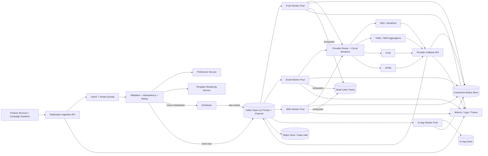
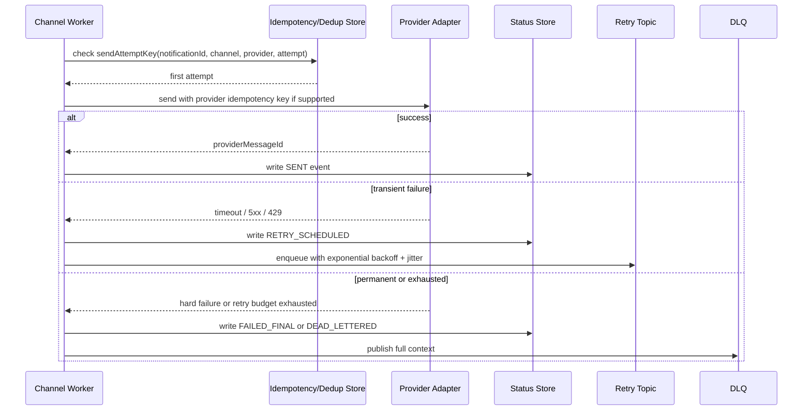
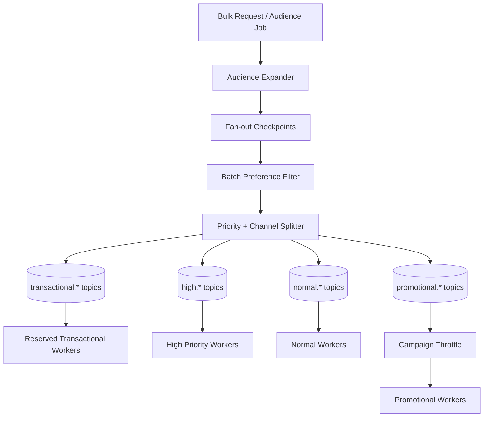
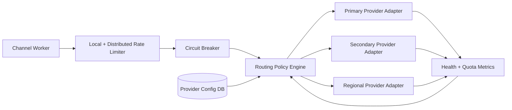
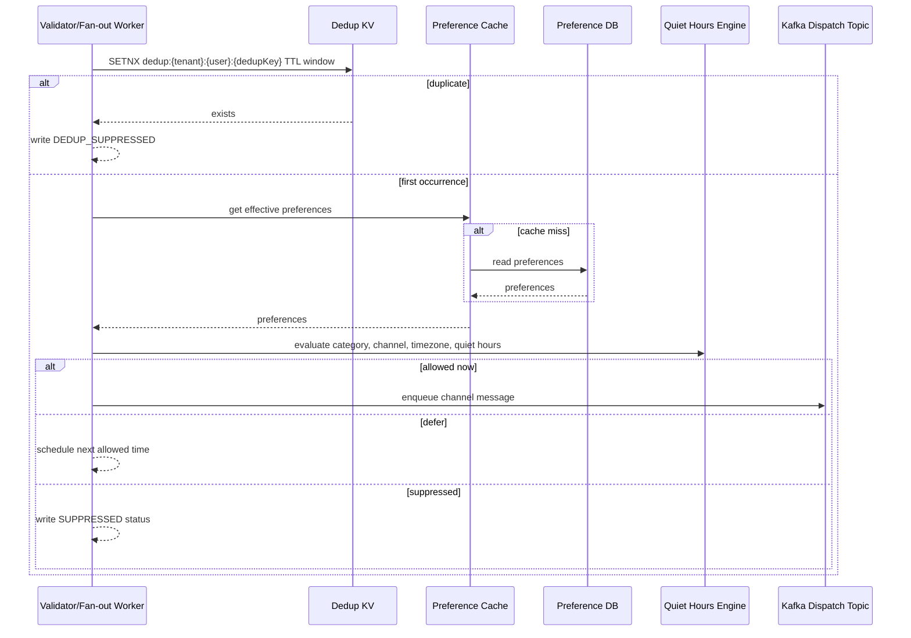
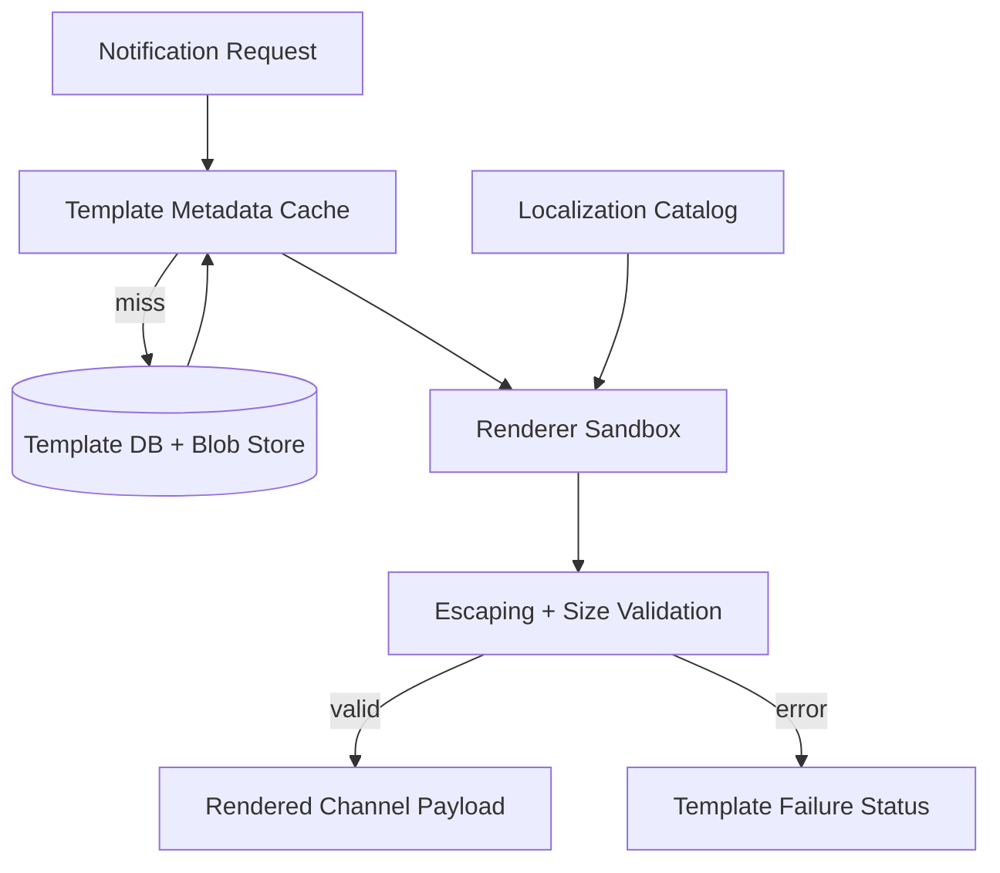

# Notification Service — High-Level Design

> Design a large-scale notification platform for email, SMS, push, and in-app fan-out with templating, preferences, scheduling, deduplication, idempotency, delivery tracking, retries, DLQ, and provider failover.

## 1. Problem Statement & Scope

We need a distributed Notification Service used by product teams to send transactional and promotional notifications to users across email, SMS, push, and in-app channels.

The service accepts requests, validates caller and payload, checks idempotency and deduplication, evaluates user preferences and quiet hours, renders templates, enqueues work, dispatches through third-party providers, and records lifecycle status.

This is the HLD counterpart to a lower-level notification-service implementation.

The LLD would model notification classes, provider adapters, retry policies, and renderers inside one process.

This HLD focuses on distributed fan-out, Kafka topics, worker pools, partitioning, high-write storage, retries, dead-letter queues, status reconciliation, provider abstraction, and operational controls.

The producer-facing API is asynchronous.

A caller receives `202 Accepted` after the request is validated, idempotency is recorded, and work is durably written to Kafka or to the scheduler store.

Actual delivery happens later in channel-specific workers.

We do not promise exactly-once external delivery because SES, Twilio, FCM, APNS, devices, and email inboxes are outside our transaction boundary.

We provide at-least-once processing with idempotency keys, deduplication windows, provider idempotency where available, status transition rules, and DLQ replay tooling.

### In scope

- Send notifications through email, SMS, push, and in-app channels.
- Support single-recipient requests and bulk/audience fan-out.
- Support transactional, high, normal, low, and promotional priorities.
- Render versioned templates with localization and channel-specific variants.
- Respect user preferences, opt-out, hard suppression lists, and quiet hours.
- Support scheduling for future delivery and cancellation before dispatch.
- Suppress duplicates using producer idempotency keys and business dedup keys.
- Track lifecycle status and channel attempts.
- Ingest provider callbacks and normalize delivery receipts.
- Retry transient failures with exponential backoff and jitter.
- Route exhausted or poison messages to dead-letter queues.
- Fail over between multiple providers where the channel supports it.
- Provide admin controls for template publishing, provider disablement, campaign pause, and DLQ replay.

### Out of scope

- Full CRM campaign authoring and segmentation UI.
- ML ranking of notification relevance.
- Billing and provider account procurement.
- Device registry source-of-truth.
- End-user in-app inbox UI beyond storing rows for it.
- Voice calls and postal mail.
- Human approval workflows, except future campaign governance.

## 2. Functional Requirements

| ID | Requirement | Notes |
|---|---|---|
| FR-1 | Ingest notification requests | REST/gRPC API accepts tenant, user, channels, template reference, payload, priority, schedule time, expiry, metadata, and idempotency key. |
| FR-2 | Validate requests | Authenticate producer, authorize tenant scope, validate schema, enforce size limits, verify template version, and reject invalid channels. |
| FR-3 | Multi-channel delivery | Email, SMS, push, and in-app are exposed through a common dispatch model with channel-specific metadata. |
| FR-4 | Template rendering | Render immutable template versions with variables, localization, escaping, preview validation, and channel variants. |
| FR-5 | Preferences and opt-out | Apply hard suppression, legal opt-out, tenant policy, category preference, channel preference, and quiet-hours logic. |
| FR-6 | Priority support | Transactional traffic must not wait behind promotional campaigns. |
| FR-7 | Scheduling | Requests can be scheduled for future delivery and cancelled while pending. |
| FR-8 | Deduplication | Business dedup keys suppress duplicate sends within a configurable TTL window. |
| FR-9 | Idempotency | Same idempotency key and request hash returns the same accepted response; different hash returns conflict. |
| FR-10 | Delivery tracking | Track accepted, rendered, queued, sent, delivered, bounced, failed, suppressed, expired, retrying, and dead-lettered states. |
| FR-11 | Provider callbacks | Receive, authenticate, parse, normalize, dedupe, and persist provider receipts. |
| FR-12 | Retries and DLQ | Retry transient failures with exponential backoff and jitter; DLQ poison or exhausted messages. |
| FR-13 | Provider failover | Route by channel, tenant, region, provider health, quota, cost, compliance, and circuit-breaker state. |
| FR-14 | Bulk fan-out | Expand audience jobs into per-user and per-channel work without blocking ingestion. |
| FR-15 | Admin operations | Pause campaigns, disable providers, replay DLQ, publish templates, and audit changes. |
| FR-16 | Observability | Emit metrics, logs, traces, status events, audits, and per-tenant dashboards. |

### Requirement priorities

- P0: durable ingestion, idempotency, preferences, template rendering, dispatch, status, retries, DLQ.
- P1: scheduling, bulk fan-out, provider failover, callbacks, cache invalidation, admin tooling.
- P2: campaign analytics, open/click tracking, adaptive routing, digesting, experimentation.

## 3. Non-Functional Requirements

| Category | Target |
|---|---|
| Scale | 500M physical notifications/day baseline; architecture should scale to 2B/day with more partitions and workers. |
| Availability | 99.99% ingestion availability for transactional traffic; 99.9% for promotional and admin flows. |
| Durability | No acknowledged request is lost; idempotency record and Kafka/scheduler write must be durable before 202. |
| Latency | API p50 < 50 ms and p99 < 250 ms; transactional dispatch start p99 < 5 s under healthy downstreams. |
| Throughput | Average physical send rate ≈ 5.8K/s; peak ≈ 17.4K/s. |
| Consistency | Strong idempotency; eventual status, analytics, and cache propagation. |
| Isolation | Tenant, priority, channel, and provider isolation via quotas, topics, and worker pools. |
| Security | TLS, mTLS/internal auth, RBAC, KMS-backed secrets, PII encryption, audit logging. |
| Compliance | Honor opt-out, quiet hours, deletion, retention, suppression, and regional data-routing rules. |
| Operability | Dashboards for QPS, lag, retries, DLQ, provider health, template failures, and cost. |
| Extensibility | New provider or channel should require an adapter, config, capability metadata, and status mapping. |

### Latency budget

| Stage | p50 target | p99 target | Notes |
|---|---:|---:|---|
| API authentication | 8 ms | 30 ms | Cache producer and tenant policy. |
| Quota/rate limit | 2 ms | 10 ms | Local token bucket plus distributed counters. |
| Idempotency write | 3 ms | 20 ms | Redis cluster or DynamoDB conditional write. |
| Template metadata check | 2 ms | 20 ms | Local/Redis cache first. |
| Preference check | 5 ms | 40 ms | Cache first; DB fallback only on misses. |
| Kafka produce | 8 ms | 100 ms | `acks=all` for durable topics. |
| Total acceptance | < 50 ms | < 250 ms | No provider call in API path. |
| Transactional queue wait | < 1 s | < 5 s | Dedicated workers and provider quota. |
| Promotional queue wait | Minutes | Hours | Allowed to throttle. |

## 4. Back-of-the-Envelope Estimation

Conventions from the repository contract:

- 1 day ≈ 86,400 s ≈ 10^5 s.
- Peak ≈ 3× average because notification traffic is bursty around local mornings, evenings, incidents, and campaigns.
- Replication factor = 3 unless otherwise stated.

### Traffic assumptions

| Input | Assumption |
|---|---:|
| Registered users | 1B |
| Daily active users | 250M |
| Physical notifications/day | 500M |
| Average channels per logical request | 1.25 |
| Logical requests/day | 500M / 1.25 = 400M |
| Transactional share | 40% = 200M/day |
| Promotional/social share | 60% = 300M/day |
| Average Kafka dispatch message | 2 KB |
| Average latest-status row | 1 KB |
| Average status events/notification | 3 |
| Peak multiplier | 3× |

### QPS arithmetic

- Average physical notifications/s = 500,000,000 / 86,400 ≈ 5,787/s.
- Interview-rounded average physical notifications/s = 500M / 10^5 ≈ 5,000/s.
- Peak physical notifications/s = 3 × 5,787 ≈ 17,361/s.
- Logical requests/day = 500M physical / 1.25 channels ≈ 400M.
- Average ingestion QPS = 400,000,000 / 86,400 ≈ 4,630/s.
- Peak ingestion QPS = 3 × 4,630 ≈ 13,890/s.
- Status writes/day = 500M notifications × 3 status events = 1.5B writes/day.
- Average status write QPS = 1,500,000,000 / 86,400 ≈ 17,361/s.
- Peak status write QPS = 3 × 17,361 ≈ 52,083/s.
- Provider final callbacks ≈ 500M/day / 86,400 ≈ 5,787/s average.
- Peak provider callback QPS ≈ 3 × 5,787 ≈ 17,361/s.
- A 100M-recipient campaign over 2 hours expands at 100,000,000 / 7,200 ≈ 13,889 recipients/s before channel fan-out.

### Per-channel split

| Channel | Share | Notifications/day | Avg sends/s | Peak sends/s | Notes |
|---|---:|---:|---:|---:|---|
| Push | 50% | 250M | 250M / 86,400 ≈ 2,894 | ≈ 8,681 | High volume, low unit cost, token churn. |
| Email | 25% | 125M | 125M / 86,400 ≈ 1,447 | ≈ 4,340 | Reputation, bounces, unsubscribe handling. |
| In-app | 15% | 75M | 75M / 86,400 ≈ 868 | ≈ 2,604 | Internal DB write-heavy path. |
| SMS | 10% | 50M | 50M / 86,400 ≈ 579 | ≈ 1,736 | Expensive, strict quotas, country routing. |

### Queue throughput

| Topic group | Peak msg/s | Avg message size | Peak ingress bandwidth | Initial partitions |
|---|---:|---:|---:|---:|
| transactional.push | ~3,500 | 2 KB | ~7 MB/s | 24 |
| transactional.email | ~1,750 | 2 KB | ~3.5 MB/s | 12 |
| transactional.sms | ~700 | 2 KB | ~1.4 MB/s | 12 |
| transactional.inapp | ~1,050 | 2 KB | ~2.1 MB/s | 12 |
| promotional.push | ~5,200 | 2 KB | ~10.4 MB/s | 36 |
| promotional.email | ~2,600 | 2 KB | ~5.2 MB/s | 24 |
| promotional.sms | ~1,000 | 2 KB | ~2 MB/s | 12 |
| promotional.inapp | ~1,550 | 2 KB | ~3.1 MB/s | 12 |

- Starting partition count ≈ 144.
- Provision 200+ partitions to leave room for tenant isolation and rebalancing.
- Kafka replicated daily storage = 500M × 2 KB × RF3 ≈ 3 TB/day.
- With 7-day Kafka retention, broker storage ≈ 21 TB plus index overhead.
- Long-term immutable history is archived to object storage rather than retained in Kafka forever.

### Storage estimates

| Data set | Formula | Raw/day | With RF=3 | One year physical |
|---|---|---:|---:|---:|
| Latest notification status | 500M × 1 KB | 500 GB/day | 1.5 TB/day | ~547 TB |
| Status event history | 1.5B × 0.5 KB | 750 GB/day | 2.25 TB/day | ~821 TB |
| Rendered payload archive | 500M × 1 KB × 30% retained | 150 GB/day | 450 GB/day | ~164 TB |
| Provider callbacks | 500M × 0.5 KB | 250 GB/day | 750 GB/day | ~274 TB |
| In-app inbox rows | 75M × 1 KB | 75 GB/day | 225 GB/day | ~82 TB |
| Idempotency active set | 400M/day × 150 B × 7 days | ~420 GB active | ~1.26 TB active | TTL only |

### Cache sizing

| Cache | Cardinality | Entry size | Working set | Notes |
|---|---:|---:|---:|---|
| Template cache | 100K active versions | 20 KB | ~2 GB raw, 6-10 GB replicated | Immutable versions make stale reads safe. |
| Preference cache | 50M hot users | 0.5 KB | ~25 GB raw, 75-100 GB replicated | Invalidate on preference update. |
| Suppression cache | 100M entries | 100 B | ~10 GB raw | Bloom filter plus exact KV check. |
| Provider config | 1K routes | 10 KB | < 100 MB | Local cache is sufficient. |
| Idempotency TTL cache | 400M/day × 7 days | 150 B | ~420 GB raw | Sharded KV with TTL. |

### Fleet estimate

| Component | Capacity assumption | Needed at peak | Starting fleet |
|---|---|---:|---:|
| API servers | 1K accepted requests/s/node | 14 | 30 across 3 AZs |
| Validation/render workers | 500 notifications/s/node | 35 | 60 |
| Push workers | 800 sends/s/node | 11 | 24 |
| Email workers | 300 sends/s/node | 15 | 30 |
| SMS workers | 100 sends/s/node | 18 | 40 |
| In-app writers | 1K writes/s/node | 3 | 12 |
| Status writers | 2K writes/s/node | 27 | 45 |
| Scheduler processors | 1K due jobs/s/node | 14 during bursts | 30 |

## 5. API Design

The API is asynchronous and durable.

Producers receive a platform notification ID and can query status, subscribe to Kafka events, or receive webhooks.

### Endpoints

| Method | Endpoint | Purpose |
|---|---|---|
| POST | `/v1/notifications` | Create one logical notification. |
| POST | `/v1/notifications:batch` | Create a batch or audience fan-out job. |
| GET | `/v1/notifications/{notificationId}` | Fetch latest state and channel attempts. |
| GET | `/v1/notifications?tenantId=&userId=&cursor=` | Paginated recent history. |
| POST | `/v1/notifications/{notificationId}:cancel` | Cancel scheduled or not-yet-dispatched work. |
| POST | `/v1/templates` | Create template draft. |
| PUT | `/v1/templates/{templateId}/versions/{version}` | Publish immutable template version. |
| GET | `/v1/users/{userId}/preferences` | Read effective preferences. |
| PUT | `/v1/users/{userId}/preferences` | Update preferences and invalidate caches. |
| POST | `/v1/provider-callbacks/{provider}` | Receive provider receipts. |
| POST | `/v1/dlq/{queueName}:replay` | Admin replay after repair. |
| GET | `/v1/health/provider-routes` | Admin view of provider health and circuit states. |

### Create notification request

```http
POST /v1/notifications HTTP/1.1
Authorization: Bearer <producer-token>
Idempotency-Key: payments:order-123:success:v1
Content-Type: application/json

{
  "tenantId": "payments",
  "requestId": "producer-generated-uuid",
  "userId": "user_123",
  "priority": "TRANSACTIONAL",
  "channels": ["PUSH", "EMAIL"],
  "templateRef": {
    "templateId": "payment_success",
    "version": 12,
    "locale": "en-US"
  },
  "templateData": {
    "amount": "$42.00",
    "merchant": "Contoso"
  },
  "dedupKey": "payment_success:order_123",
  "dedupWindowSeconds": 86400,
  "scheduleAt": null,
  "expiresAt": "2026-08-06T00:00:00Z",
  "callbackUrl": "https://payments.example.com/notification-callback",
  "metadata": {
    "orderId": "order_123"
  }
}
```

### Create notification response

```json
{
  "notificationId": "ntf_01JABCDEF",
  "status": "ACCEPTED",
  "acceptedChannels": ["PUSH", "EMAIL"],
  "rejectedChannels": [],
  "idempotencyReplay": false,
  "statusUrl": "/v1/notifications/ntf_01JABCDEF"
}
```

### API semantics

- `Idempotency-Key` is mandatory for transactional producers.
- Same idempotency key plus same request hash returns the original response.
- Same idempotency key plus different request hash returns `409 IdempotencyConflict`.
- `scheduleAt` in the future writes to the scheduled store.
- `expiresAt` prevents stale delivery after backlog or retries.
- Preference-suppressed requests still produce explainable status rows.
- Bulk APIs return a fan-out job ID.
- Provider callbacks are signed or mTLS-authenticated.
- Admin replay requires RBAC, audit logging, dry-run, and rate limits.

### Error model

| HTTP | Error | Retryable | Example |
|---:|---|---|---|
| 400 | InvalidRequest | No | Missing template variable. |
| 401 | Unauthorized | No | Bad producer token. |
| 403 | Forbidden | No | Tenant scope missing. |
| 404 | TemplateNotFound | No | Unpublished template version. |
| 409 | IdempotencyConflict | No | Same key, different request hash. |
| 422 | PreferenceRejected | No | All requested channels suppressed. |
| 429 | ProducerRateLimited | Yes | Tenant quota exceeded. |
| 503 | QueueUnavailable | Yes | Kafka acks unavailable; request not accepted. |

## 6. Data Model & Schema

Use purpose-built storage because access patterns differ.

Cassandra/ScyllaDB handles high-write notification status.

Redis or DynamoDB-style KV handles idempotency and dedup TTL.

PostgreSQL stores templates and provider configuration.

Kafka is the durable event log and work queue.

Object storage holds archives and large rendered payloads.

### Storage choices

| Data | Store | Reason |
|---|---|---|
| Notification status | Cassandra/ScyllaDB | High write throughput, TTL, partitioned reads. |
| Status events | Kafka + Cassandra + object storage | Append-only audit and replay. |
| User preferences | Cassandra/DynamoDB + Redis | Fast key-value reads by user. |
| Templates | PostgreSQL + blob store + cache | Transactional publish with immutable body assets. |
| Idempotency | Redis cluster or DynamoDB | Atomic conditional write with TTL. |
| Dedup windows | Redis/KV TTL | Fast suppression using business key. |
| Scheduled jobs | Cassandra time buckets | Query due work by time bucket and shard. |
| In-app notifications | Cassandra/DynamoDB | Read latest rows by user. |
| Provider config | PostgreSQL + local cache | Small relational audited metadata. |
| Analytics | Data lake/warehouse | Avoid serving-store scans. |

### Representative schema

```sql
CREATE TABLE templates (
  template_id TEXT,
  version INT,
  tenant_id TEXT,
  channel TEXT,
  locale TEXT,
  subject_template TEXT,
  body_template_uri TEXT,
  schema_json JSONB,
  status TEXT,
  created_at TIMESTAMP,
  published_at TIMESTAMP,
  PRIMARY KEY (template_id, version, channel, locale)
);

CREATE TABLE user_preferences_by_user (
  user_id TEXT,
  tenant_id TEXT,
  channel TEXT,
  category TEXT,
  enabled BOOLEAN,
  quiet_hours_start TEXT,
  quiet_hours_end TEXT,
  timezone TEXT,
  updated_at TIMESTAMP,
  PRIMARY KEY ((user_id), tenant_id, channel, category)
);

CREATE TABLE notification_status_by_id (
  notification_id TEXT PRIMARY KEY,
  tenant_id TEXT,
  user_id TEXT,
  priority TEXT,
  logical_request_id TEXT,
  dedup_key TEXT,
  status TEXT,
  created_at TIMESTAMP,
  updated_at TIMESTAMP,
  expires_at TIMESTAMP,
  channel_attempts MAP<TEXT,TEXT>,
  last_error_code TEXT,
  last_error_message TEXT
);

CREATE TABLE notification_status_by_user_day (
  user_id TEXT,
  day_bucket DATE,
  created_at TIMESTAMP,
  notification_id TEXT,
  tenant_id TEXT,
  priority TEXT,
  status TEXT,
  channels SET<TEXT>,
  preview_text TEXT,
  PRIMARY KEY ((user_id, day_bucket), created_at, notification_id)
) WITH CLUSTERING ORDER BY (created_at DESC);

CREATE TABLE notification_events_by_notification (
  notification_id TEXT,
  event_time TIMESTAMP,
  event_id TEXT,
  channel TEXT,
  provider TEXT,
  status TEXT,
  provider_message_id TEXT,
  error_code TEXT,
  PRIMARY KEY ((notification_id), event_time, event_id)
);

CREATE TABLE scheduled_notifications_by_bucket (
  due_bucket TIMESTAMP,
  shard_id INT,
  due_at TIMESTAMP,
  notification_id TEXT,
  tenant_id TEXT,
  serialized_request BLOB,
  status TEXT,
  PRIMARY KEY ((due_bucket, shard_id), due_at, notification_id)
);

CREATE TABLE inapp_notifications_by_user (
  user_id TEXT,
  created_at TIMESTAMP,
  notification_id TEXT,
  tenant_id TEXT,
  title TEXT,
  body TEXT,
  deep_link TEXT,
  read_at TIMESTAMP,
  expires_at TIMESTAMP,
  PRIMARY KEY ((user_id), created_at, notification_id)
) WITH CLUSTERING ORDER BY (created_at DESC);
```

### Kafka topic model

| Topic pattern | Key | Retention | Purpose |
|---|---|---:|---|
| `notifications.accepted.{priority}` | `tenantId:userId` | 7 days | Accepted logical requests. |
| `notifications.dispatch.{priority}.{channel}` | `userId` | 7 days | Per-channel work. |
| `notifications.retry.{priority}.{channel}.{attemptBucket}` | `userId` | 7-14 days | Delayed retries. |
| `notifications.dlq.{priority}.{channel}` | `notificationId` | 30 days | Poison/exhausted messages. |
| `notifications.status-events` | `notificationId` | 30 days | Normalized lifecycle stream. |
| `notifications.provider-callbacks` | `providerMessageId` | 7 days | Raw callback buffer. |
| `notifications.preference-updates` | `userId` | 7 days | Cache invalidation. |
| `notifications.template-updates` | `templateId` | 7 days | Template cache invalidation. |

### Partitioning keys

- Dispatch topics are partitioned by `userId` for per-user ordering.
- Status direct lookup uses `notificationId`.
- Recent history uses `userId + day_bucket`.
- Scheduled jobs use `due_bucket + shard_id`.
- Idempotency keys include tenant namespace and request hash.
- Provider callback lookup maps `providerMessageId` to `notificationId` with TTL.

## 7. High-Level Architecture



### Component responsibilities

- Ingestion API authenticates producers, validates requests, enforces tenant quota, and durably enqueues work.
- Idempotency service stores request hash and original response atomically.
- Dedup service suppresses repeated business notifications in a TTL window.
- Preference service computes effective channel/category permissions and quiet-hours decisions.
- Template service renders immutable localized channel payloads.
- Scheduler stores future jobs in sharded time buckets and emits due events.
- Kafka provides durable buffer, replay, partitioned ordering, and backpressure boundary.
- Channel workers isolate email, SMS, push, and in-app scaling/failure modes.
- Provider router selects vendors using route policy, health, region, quota, and cost.
- Callback API normalizes provider receipts into platform statuses.
- Status store supports latest-state reads and per-user history.
- DLQ stores poison or exhausted messages for repair and controlled replay.
- Observability stack powers SLOs, alerts, dashboards, traces, audits, and cost reports.

### Write path

1. Producer sends request with idempotency key.
2. API authenticates and checks tenant quota.
3. Validator checks schema, template metadata, idempotency, and dedup key.
4. Preference service filters channels and quiet-hours behavior.
5. Template renderer creates channel payloads or records rendering failure.
6. Request is scheduled or published to priority/channel Kafka topics.
7. Workers consume, enforce provider limits, call adapters, and write attempt status.
8. Provider callbacks update final status and emit events.
9. Producer queries status or receives webhook/event stream updates.

## 8. Deep Dives

### 8.1 Reliability, retries, DLQ, and idempotency

Reliability is built around a durable acceptance boundary and at-least-once worker processing.



- Retry schedule example: 1 min, 5 min, 15 min, 1 h, 6 h, then DLQ.
- Jitter prevents synchronized retry storms.
- Provider 429 responses reduce the local/distributed token-bucket refill rate.
- Permanent failures such as invalid device token, hard bounce, blocked address, or malformed phone number do not retry forever.
- Each attempt uses a deterministic `sendAttemptKey`.
- Provider idempotency keys are passed where vendors support them.
- Ambiguous timeout after provider acceptance can still duplicate external sends.
- SMS ambiguous retries are conservative because duplicates cost money and annoy users.
- DLQ entries include payload reference, rendered payload hash, tenant, channel, provider, error history, and replay eligibility.
- Replay tooling supports dry-run, single replay, batch replay, and shadow-topic replay.

### 8.2 Fan-out and prioritization

Fan-out converts one logical request or campaign into many per-recipient and per-channel tasks.

The key design goal is protecting transactional messages from low-priority bursts.



- Separate topics exist by priority and channel.
- Transactional workers have reserved compute and provider quota.
- Promotional fan-out is paced by tenant budget, campaign budget, provider quota, and backlog.
- Audience expansion checkpoints progress for restart after failure.
- Backpressure is applied at producer quota, fan-out pacing, worker token buckets, and provider routing.
- Promotional topics can be paused without affecting transactional topics.
- Per-user ordering is preserved within a channel when `userId` is the Kafka key.
- Large tenants can receive dedicated topics.
- For unordered promotional traffic, key salting can reduce hot partitions.
- Priority upgrades require entitlement; stale messages can downgrade or expire.

### 8.3 Provider abstraction, failover, and rate limits

Providers differ in APIs, quotas, callback formats, cost, regional support, idempotency support, and error models.



- Each adapter implements `send`, `normalizeError`, `parseCallback`, `capabilities`, and `rateLimitDimensions`.
- Circuit breakers open on timeout or error spikes.
- Half-open breakers probe with limited traffic.
- Routing considers tenant, channel, destination region, cost, quota, health, and compliance.
- SMS routes by country code because deliverability and cost vary.
- Email separates transactional and marketing IP pools.
- Push uses FCM/APNS; failover usually means retry later, not switching protocol.
- Provider configs are cached locally, invalidated through events, and audited.
- A kill switch can disable a provider route during incidents.
- Quota controllers prevent workers from hammering providers during outages.

### 8.4 Deduplication, preferences, opt-out, and quiet hours

Preferences are a compliance boundary.

Deduplication is a product-quality boundary.

Both must run before dispatch and must be fast enough for fan-out scale.



- Preference hierarchy: hard suppression, legal opt-out, tenant policy, category preference, channel preference, producer fallback.
- Transactional messages may bypass promotional opt-out but never hard suppression.
- Quiet hours use user timezone and category policy.
- Urgent security alerts can be exempt from quiet hours by policy.
- Preference updates publish invalidation events.
- Bulk fan-out batches preference reads.
- Dedup TTL is configurable by producer use case.
- Bloom filters speed global suppression checks with exact KV verification.
- Suppressed notifications still write explainable status.
- If preference service is unavailable, promotional traffic fails closed and transactional traffic retries briefly.

### 8.5 Template rendering service and caching

Template rendering must be safe, deterministic, localized, versioned, and fast.



- Templates are immutable after publish.
- Cache key includes tenant, templateId, version, channel, and locale.
- Renderer validates required variables.
- Renderer enforces channel max sizes.
- Escaping is channel-specific for HTML email, SMS text, push, and in-app rich text.
- Large rendered payloads can be stored in blob storage with URI in Kafka.
- Template update events invalidate caches.
- Rendering failures are non-retryable unless caused by temporary template-store unavailability.
- Preview and lint APIs prevent bad high-volume campaigns.
- Renderer sandbox prevents arbitrary code execution.

## 9. Scaling/Caching/Bottlenecks

### Scaling strategy

- Scale API servers statelessly behind load balancers.
- Partition Kafka dispatch topics by `userId`.
- Use dedicated topics for the largest tenants.
- Autoscale workers on Kafka lag, age of oldest message, CPU, error rate, and provider quota.
- Separate worker deployments by priority and channel.
- Shard status tables by `notificationId` and `userId + day`.
- Shard scheduler buckets by `due_bucket + shard_id`.
- Use payload pointers to keep Kafka messages small.
- Throttle at producer, fan-out, worker, and provider boundaries.
- Run regional active-active ingestion where data residency allows.

### Cache layers

| Cache | TTL/invalidation | Failure behavior |
|---|---|---|
| Producer auth and tenant config | Minutes plus config event | Fail closed for unknown tenant. |
| Template metadata/body | Immutable plus LRU | Fallback to DB/blob. |
| Effective preferences | 5-30 min plus invalidation | Fail closed for marketing; retry transactional. |
| Provider routes | Seconds plus invalidation | Use last-known-good briefly. |
| Dedup keys | Business TTL | Retry if unavailable for high-risk traffic. |
| Idempotency keys | 24 h to 7 days | Do not accept if unavailable. |
| Suppression lists | Minutes plus invalidation | Exact fallback; fail closed for marketing. |

### Bottlenecks and mitigations

| Bottleneck | Symptom | Mitigation |
|---|---|---|
| Provider quota | Queue lag grows while workers wait | Reserve transactional quota, throttle promotional, add providers. |
| Kafka partition skew | One partition has high lag | Dedicated tenant topics, key salting for unordered promo, partition rebalance. |
| Preference DB | High p99 reads | Redis/local cache, batch reads, precompute effective prefs. |
| Template cache misses | Renderer latency spike | Warm cache on publish and use immutable versions. |
| Cassandra writes | Status latency grows | Scale nodes, tune compaction/TTL, separate latest and events. |
| DLQ flood | Millions of poison messages | Pause bad template/provider, classify, repair, replay slowly. |
| Hot user | Massive fan-in | Collapse/digest low-priority messages and enforce per-user caps. |
| Callback burst | Receipts arrive in provider batches | Callback Kafka buffer and idempotent upsert. |
| SMS cost | Unexpected spend | Tenant budgets, approval gates, anomaly alerts. |
| Large payload | Broker pressure | Blob pointer, compression, strict size limits. |

### Hot users and tenants

- Celebrity-style fan-out can create hot partitions.
- Low-priority notifications can be collapsed into digests.
- Strict per-user ordering is preserved only where product semantics require it.
- Top tenants can get dedicated topic groups and quota budgets.
- Promotional traffic can salt keys if ordering is not required.
- Tenant-level fairness is enforced before Kafka and again at provider token buckets.

## 10. Reliability & Consistency

### Reliability mechanisms

- Kafka uses replication factor 3, `acks=all`, min in-sync replicas, and multi-AZ brokers.
- API returns 202 only after idempotency and Kafka/scheduler write succeed.
- Workers commit offsets only after durable attempt status write.
- External calls use bounded timeouts.
- Retries use exponential backoff, jitter, and retry budgets.
- DLQ prevents poison messages from blocking partitions forever.
- Provider callbacks are authenticated and idempotent by provider event ID.
- Cassandra uses RF3 and quorum settings for critical latest-state writes.
- Redis/KV clusters use persistence or managed durability for idempotency.
- Runbooks cover provider disablement, campaign pause, template rollback, DLQ replay, and lag mitigation.

### Consistency model

| Area | Consistency choice | Reason |
|---|---|---|
| Idempotency | Strong conditional write | Producer retries must collapse to one accepted request. |
| Dedup | Atomic SETNX within KV shard | Avoid duplicate user-facing sends. |
| Delivery | At-least-once | External providers cannot share our transaction. |
| Status | Eventual with transition precedence | Callbacks can arrive late or out of order. |
| Preferences | Cached eventual with invalidation | Read-heavy; opt-out invalidates quickly. |
| Templates | Strong publish, immutable reads | Cached versions remain safe. |
| Analytics | Eventually consistent | Warehouse lag is acceptable. |
| Scheduling | At-least-once due emission | Duplicate due events are suppressed downstream. |

### Exactly-once vs at-least-once

- Exactly-once Kafka processing does not guarantee exactly-once provider side effects.
- A timeout after provider acceptance but before status write can cause duplicate retry.
- Provider idempotency keys reduce but do not eliminate ambiguity.
- SMS ambiguous retries are conservative because duplicates are costly.
- In-app writes can use conditional insert by `notificationId + channel` for stronger dedup.
- At-least-once with deduplication is easier to reason about operationally.
- Producers should design templates to tolerate rare duplicate notifications.

### Delivery receipts and reconciliation

- Some providers send final delivery callbacks.
- Some providers only confirm accepted/sent.
- Some device-level push outcomes are never known.
- Callback ingestion normalizes provider-specific statuses.
- Provider event IDs dedupe repeated callbacks.
- Out-of-order transitions use precedence so old `SENT` does not overwrite `DELIVERED`.
- A reconciler polls providers for high-value stuck messages where APIs support it.
- Provider-message-ID mappings have TTL long enough for late callbacks.
- Producer webhooks are retried independently and do not affect delivery status.

### Disaster recovery

- Deploy core services across 3 AZs.
- Replicate Kafka, Cassandra, Redis/KV, and stateless services within the region.
- Use active-active regional ingestion where data residency allows.
- Region-independent idempotency keys help producers retry to a secondary region.
- Object storage archives Kafka/status events for rebuild and replay.
- RPO for accepted transactional requests is near zero within a region.
- Cross-region RPO depends on asynchronous replication lag.
- RTO target for regional failover is 15-30 minutes for transactional traffic.

## 11. Trade-offs & Alternatives

| Decision | Chosen option | Alternatives | Why chosen | Downside |
|---|---|---|---|---|
| API behavior | Async 202 | Synchronous provider send | Low latency and provider isolation. | Producer needs status API/events. |
| Queue | Kafka | RabbitMQ, SQS/SNS, Pulsar | Throughput, partitions, replay, consumer groups. | Operational complexity. |
| Guarantee | At-least-once + idempotency | Exactly-once | Matches external provider reality. | Rare duplicates possible. |
| Priority isolation | Separate topics/workers | Single topic with priority field | Strong isolation and simple autoscaling. | More topics and deployments. |
| Fan-out timing | Fan-out on write | Fan-out on read | External sends require per-recipient work. | High write volume. |
| Rendering | Worker-side cached rendering | API-side rendering | Keeps API light and supports bulk pacing. | Async render failures. |
| Status store | Cassandra/ScyllaDB | PostgreSQL, Elasticsearch only | High writes, TTL, partitioned reads. | Limited ad hoc queries. |
| Idempotency | Redis/DynamoDB TTL | SQL unique rows | Fast conditional writes and TTL. | Durability tuning required. |
| Preferences | Cache + NoSQL | Always SQL | Low latency at scale. | Staleness risk. |
| Provider routing | Multi-provider abstraction | One provider/channel | Availability and cost control. | Adapter complexity. |
| Scheduling | Time-bucketed store | Kafka delay only | Long delays and cancellation. | Scheduler complexity. |
| Callbacks | Provider push callbacks | Polling only | Lower latency and less load. | Secure public endpoint required. |
| Backpressure | Quotas + token buckets | Provider throttling only | Protects system early. | Rejects or delays traffic. |
| Large payloads | Blob pointer in Kafka | Full payload in message | Broker efficiency. | Extra fetch path. |
| Ordering | Per-user per-channel | Global ordering | Scalable and sufficient. | No cross-channel order. |

### Rejected alternatives

- A pure synchronous design is simpler but couples producer latency and availability to every provider.
- A single global queue is simpler but lets campaigns starve transactional messages.
- Relational-only status storage is convenient but weak for 50K+ peak writes/s and TTL-heavy history.
- Provider-native retry alone loses a unified DLQ, policy, and status layer.
- Promising exactly-once external delivery creates false confidence.
- Storing large rendered bodies directly in Kafka increases broker cost and rebalancing pain.

## 12. Future Improvements

- ML send-time optimization for promotional traffic.
- Adaptive provider routing by deliverability, latency, cost, and region.
- Notification digests and collapse keys to reduce fatigue.
- Cross-channel orchestration such as push first and email later if unopened.
- Experimentation framework for templates, channels, and provider routes.
- Self-service campaign approval with spend and compliance checks.
- Advanced preference center with snooze and per-device controls.
- End-to-end tracing from producer request to provider callback.
- Automated DLQ classification and replay recommendations.
- Regional data residency enforcement for storage and routing.
- Provider contract tests and sandbox replay.
- Template accessibility, localization, and phishing checks.
- Cost-aware SMS controls and anomaly detection.
- Real-time fatigue scoring and suppression.
- Search index for support investigation.
- Client-side push receipt instrumentation.
- Per-tenant SLO reports and noisy-neighbor isolation.
- Chaos testing for provider outage, Kafka lag, Redis failure, and callback storms.
- Formal policy engine for legal/compliance rules.
- Better reconciliation for providers with weak callback semantics.

---

This design favors durable asynchronous ingestion, priority-isolated fan-out, provider abstraction, and pragmatic at-least-once reliability with idempotency and deduplication around external side effects.
