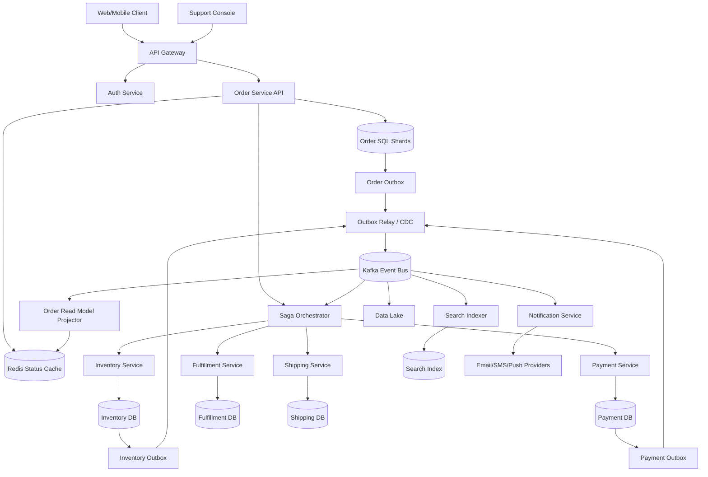
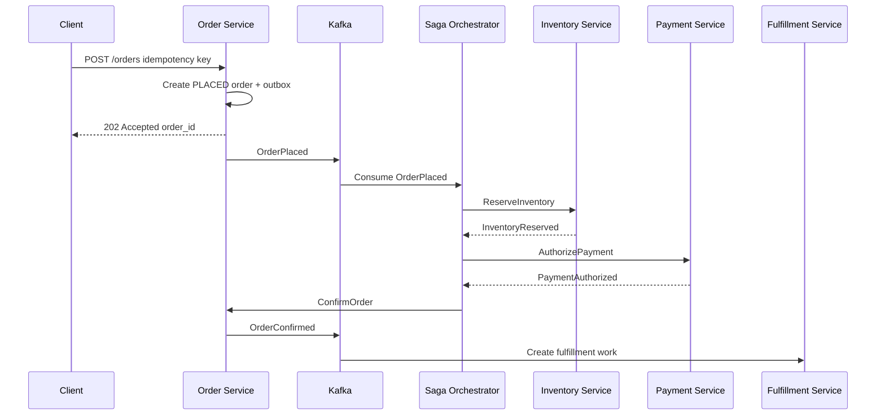
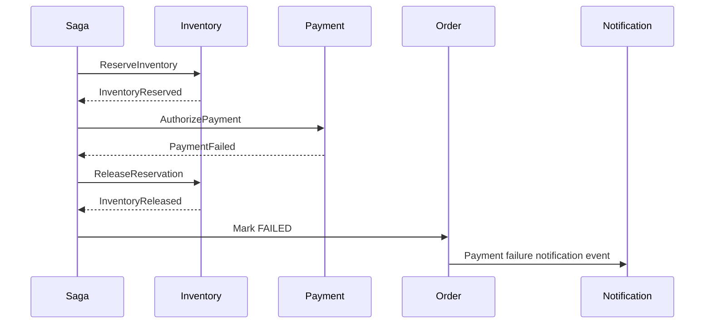
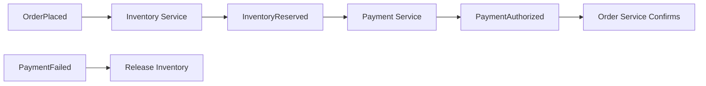
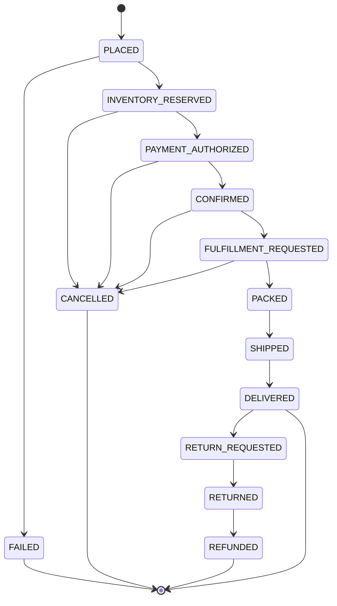
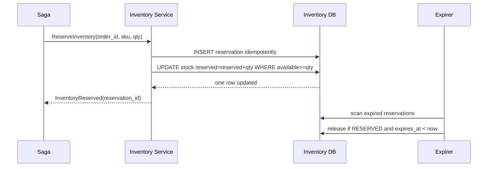
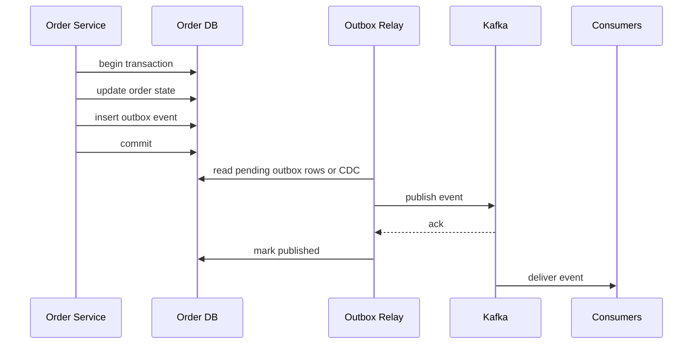
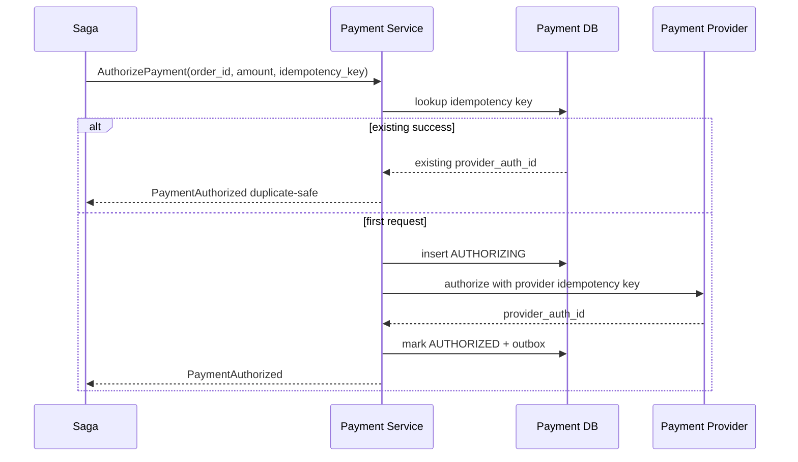
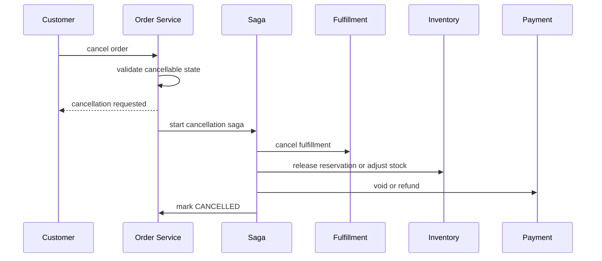

# Order Management System — High-Level Design

## 1. Problem Statement & Scope

Design an Order Management System (OMS) for an e-commerce marketplace similar to Amazon.

The system owns the lifecycle from checkout to delivery.

It coordinates order creation, inventory reservation, payment, fulfillment, shipping, cancellation, returns, refunds, and notifications.

The hard part is not storing an order row.

The hard part is coordinating multiple independently scalable services safely.

Inventory, payment, fulfillment, shipping, and notification services all have separate databases and failure modes.

The OMS must avoid overselling stock, double charging customers, losing events, and showing regressing order status.

The design uses local ACID transactions inside each service.

It uses a saga for cross-service consistency.

It uses Kafka for event-driven communication and read-model fan-out.

In scope:

- Place an order from cart checkout.
- Validate address, cart price, tax, discount, quantity, and purchasability.
- Reserve inventory before confirming an order.
- Authorize payment after inventory reservation succeeds.
- Confirm order after required saga steps succeed.
- Create fulfillment and shipping work.
- Track order status for customers and support agents.
- Cancel orders before irreversible fulfillment stages.
- Support returns and refunds after delivery.
- Notify customers on important lifecycle transitions.
- Publish events for search, analytics, reconciliation, and read models.

Out of scope:

- Product catalog management.
- Product search ranking.
- Cart service internals before checkout.
- Warehouse robotics and picker routing.
- Last-mile route optimization.
- Raw card storage or PCI vault internals.
- Fraud ML model training.
- Recommendation systems.

Primary actors:

- Customer.
- Web/mobile checkout client.
- Support agent.
- Order Service.
- Inventory Service.
- Payment Service.
- Fulfillment Service.
- Shipping Service.
- Notification Service.
- Search and analytics consumers.
- Reconciliation workers.

Core invariants:

- Never confirm an order without successful inventory reservation.
- Never confirm an order without successful payment authorization.
- Never double charge a customer for the same order operation.
- Never oversell a SKU-location under concurrent checkout.
- Never publish a business event without a committed local state change.
- Never let stale events regress customer-visible status.

## 2. Functional Requirements

### P0 requirements

- Customer can place an order from a cart at checkout.
- System creates a durable order with items, customer, address, price, tax, discount, and currency.
- System supports idempotent order creation for client retries.
- System reserves inventory for all order items.
- System handles reservation failure by failing the order or trying alternate warehouses.
- System authorizes payment through Payment Service.
- System confirms order only after inventory and payment succeed.
- System emits lifecycle events for downstream services.
- Customer can query order details by order ID.
- Customer can list order history with cursor pagination.
- Customer can track shipment status.
- Customer can cancel before packing or shipping when policy allows.
- System releases inventory on accepted cancellation.
- System voids payment authorization or issues refund on accepted cancellation.
- System supports return request after delivery.
- System supports refund after return approval or receipt.
- System sends confirmation, shipment, delivery, cancellation, return, and refund notifications.

### P1 requirements

- Support split shipments from multiple warehouses.
- Support partial fulfillment for multi-item orders.
- Support partial cancellation for unfulfilled items.
- Support partial returns and refunds.
- Support backordered item state.
- Support fraud-review hold before final confirmation.
- Support support-agent search by order ID, customer ID, tracking ID, and hashed email/phone.
- Support manual support adjustments with immutable audit logs.
- Support reconciliation for stuck sagas and payment mismatches.
- Support customer-visible estimated delivery date updates.

### P2 requirements

- Support marketplace sellers.
- Support seller-specific fulfillment.
- Support multi-currency orders.
- Support cross-border tax and customs metadata.
- Support subscription or scheduled orders.
- Support address amendment inside a short safety window.
- Support operational simulation for sale events.

## 3. Non-Functional Requirements

| Category | Target |
|---|---|
| Scale | 5M orders/day average |
| Burst | 10x sale-event traffic |
| Provisioned create TPS | 1,000 TPS |
| Status read scale | 20,000 QPS provisioned |
| Create latency | p50 < 300 ms accepted response, p99 < 1.5 s |
| Status latency | p50 < 80 ms, p99 < 300 ms |
| Create availability | 99.95% |
| Read availability | 99.99% |
| Event pipeline availability | 99.9% with replay |
| Consistency | ACID locally, eventual across services |
| Durability | Orders, payments, reservations, and outbox durable before ACK |
| Security | No raw card data, PII encrypted |
| Operability | Traces, metrics, DLQ, replay, repair tooling |

Additional NFR notes:

- Checkout should fail closed if inventory correctness cannot be guaranteed.
- Payment side effects must be idempotent.
- Customer-visible state must be monotonic.
- Every mutation API requires an idempotency key.
- Every event includes event_id, aggregate_id, version, timestamp, producer, and trace_id.
- Redis and search are rebuildable.
- SQL and archived events are durable sources of truth.
- Support tooling must be auditable.
- Order data retention must satisfy legal, tax, and support requirements.
- PII must be redacted in logs.

## 4. Back-of-the-Envelope Estimation

Conventions follow the repository README.

1 day ≈ 86,400 s ≈ 10^5 s.

Peak is usually 2–3x average unless a burstier pattern is justified.

Here, sale events justify 10x.

Storage assumes replication factor 3.

### Input assumptions

| Input | Value | Reason |
|---|---:|---|
| Orders/day | 5,000,000 | large marketplace |
| Seconds/day | 100,000 | interview arithmetic |
| Sale multiplier | 10x | flash-sale burst |
| Items/order | 3 | average basket |
| Status reads/order/day | 20 | customer refresh and tracking |
| History reads/order/day | 2 | lower than status |
| Events/order | 20 | lifecycle fan-out |
| Replication factor | 3 | durability |

### Order-create TPS

| Arithmetic | Result |
|---|---:|
| Average order-create TPS = 5,000,000 / 100,000 | 50 TPS |
| Normal peak = 3 × 50 | 150 TPS |
| Sale peak = 10 × 50 | 500 TPS |
| Provisioned with 2x safety = 2 × 500 | 1,000 TPS |

The average rate is modest.

The design still provisions for bursts, retries, and regional imbalance.

### Item and reservation writes

| Arithmetic | Result |
|---|---:|
| Items/day = 5,000,000 × 3 | 15,000,000 |
| Average item writes/sec = 15,000,000 / 100,000 | 150/s |
| Sale peak item writes/sec = 10 × 150 | 1,500/s |
| Provisioned item writes/sec = 2 × 1,500 | 3,000/s |

Inventory pressure is item-based rather than order-based.

A single order can touch multiple SKU-location counters.

### Status-read QPS

| Arithmetic | Result |
|---|---:|
| Status reads/day = 5,000,000 × 20 | 100,000,000 |
| Average status QPS = 100,000,000 / 100,000 | 1,000 QPS |
| Normal peak = 3 × 1,000 | 3,000 QPS |
| Sale peak = 10 × 1,000 | 10,000 QPS |
| Provisioned status QPS = 2 × 10,000 | 20,000 QPS |

Status reads should use Redis and read replicas.

The authoritative write path remains in SQL.

### History-read QPS

| Arithmetic | Result |
|---|---:|
| History reads/day = 5,000,000 × 2 | 10,000,000 |
| Average history QPS = 10,000,000 / 100,000 | 100 QPS |
| Normal peak = 3 × 100 | 300 QPS |
| Sale peak = 10 × 100 | 1,000 QPS |
| Provisioned history QPS = 2 × 1,000 | 2,000 QPS |

History reads are customer-scoped and cursor-paginated.

### Event throughput

| Arithmetic | Result |
|---|---:|
| Events/day = 5,000,000 × 20 | 100,000,000 |
| Average event rate = 100,000,000 / 100,000 | 1,000/s |
| Sale peak = 10 × 1,000 | 10,000/s |
| Provisioned event rate = 2 × 10,000 | 20,000/s |

Kafka topics should support 20k events/sec plus replay traffic.

### Hot relational storage

| Entity | Average size | Count/order | Size/order |
|---|---:|---:|---:|
| orders row | 2 KB | 1 | 2 KB |
| order_items | 1 KB | 3 | 3 KB |
| payment metadata | 1 KB | 1 | 1 KB |
| shipment rows | 1 KB | 1.5 | 1.5 KB |
| status history | 0.5 KB | 10 | 5 KB |
| saga/audit metadata | 2 KB | 1 | 2 KB |
| Total |  |  | ~14.5 KB ≈ 15 KB |

### Yearly storage

| Arithmetic | Result |
|---|---:|
| Orders/year = 5,000,000 × 365 | 1,825,000,000 |
| Raw/year = 1.825B × 15 KB | 27.4 TB |
| With RF=3 = 27.4 × 3 | 82.2 TB/year |
| Index overhead ≈ 40% | 32.9 TB/year |
| Total replicated relational footprint | ~115 TB/year |

Older orders can move from hot SQL partitions to cheaper historical storage after the active support window.

### Kafka storage

| Arithmetic | Result |
|---|---:|
| Events/day | 100M |
| Average event size | 1 KB |
| Raw/day = 100M × 1 KB | 100 GB/day |
| 14-day raw retention = 100 GB × 14 | 1.4 TB |
| With RF=3 | 4.2 TB |

Long-term events go to object storage.

### Cache sizing

| Arithmetic | Result |
|---|---:|
| Hot active orders = 5M new + 20M recent | 25M |
| Status object | 1 KB |
| Raw cache = 25M × 1 KB | 25 GB |
| Overhead/RF ≈ 2x | 50 GB |
| Regional budget | ~100 GB |

### Server sizing

| Component | Assumption | Estimate |
|---|---|---:|
| Order API | 250 checkout TPS or 2,000 read QPS/server | 8–12 servers/region |
| Saga workers | 200 saga steps/sec/worker | ~100 workers for burst headroom |
| Kafka brokers | 50 MB/s/broker practical budget | 6–9 brokers/region |
| Redis | 25 GB/node usable | 4–6 nodes/region |
| SQL shards | 2–5 TB hot data/shard | 16–32 logical shards to start |

## 5. API Design

Public APIs are REST for client simplicity.

Internal service APIs can use gRPC.

All mutations require idempotency keys.

### Create order

```http
POST /v1/orders
Idempotency-Key: checkout-uuid-123
Authorization: Bearer <token>
Content-Type: application/json
```

```json
{
  "cart_id": "cart_123",
  "customer_id": "cust_456",
  "shipping_address_id": "addr_789",
  "payment_method_id": "pm_abc",
  "currency": "USD",
  "client_price_version": "cartPriceVersion_17",
  "items": [
    {
      "sku_id": "sku_1",
      "quantity": 2,
      "unit_price_cents": 1299,
      "warehouse_hint": "us-east-1a"
    }
  ]
}
```

```json
{
  "order_id": "ord_01JABC",
  "status": "PLACED",
  "saga_id": "saga_01JABC",
  "confirmation_mode": "ASYNC",
  "estimated_confirmation_seconds": 5,
  "links": {
    "self": "/v1/orders/ord_01JABC"
  }
}
```

Behavior:

- Create durable order and start saga.
- Return before all downstream work completes when needed.
- Duplicate idempotency key with same request body returns original response.
- Duplicate key with different body returns 409 Conflict.

### Get order

```http
GET /v1/orders/{order_id}
Authorization: Bearer <token>
```

```json
{
  "order_id": "ord_01JABC",
  "customer_id": "cust_456",
  "status": "SHIPPED",
  "items": [
    {
      "sku_id": "sku_1",
      "quantity": 2,
      "fulfillment_status": "SHIPPED"
    }
  ],
  "payment": {
    "status": "CAPTURED",
    "amount_cents": 2598
  },
  "shipments": [
    {
      "shipment_id": "shp_123",
      "carrier": "UPS",
      "tracking_number": "1Z999",
      "status": "IN_TRANSIT"
    }
  ]
}
```

### List customer orders

```http
GET /v1/customers/{customer_id}/orders?status=OPEN&page_size=20&page_token=abc
```

- Uses opaque cursor based on customer_id, created_at, and order_id.
- Reads from customer-scoped read model or SQL replica.
- Supports filters such as OPEN, DELIVERED, CANCELLED, and RETURNED.

### Cancel order

```http
POST /v1/orders/{order_id}/cancel
Idempotency-Key: cancel-uuid-456
```

```json
{
  "reason": "CUSTOMER_REQUEST",
  "items": [
    {
      "order_item_id": "oi_1",
      "quantity": 1
    }
  ]
}
```

- Rejected if already shipped unless return flow applies.
- Accepted before packing depending on fulfillment state.
- Starts compensation saga.

### Return order items

```http
POST /v1/orders/{order_id}/returns
Idempotency-Key: return-uuid-789
```

- Validates return window and item eligibility.
- Creates return authorization.
- Creates label or pickup request.
- Refunds after receipt/inspection or instant-refund policy.

### Error model

| Status | Meaning |
|---|---|
| 400 | invalid request |
| 401/403 | authentication or authorization failure |
| 404 | unknown order |
| 409 | idempotency or state conflict |
| 422 | business rule failure |
| 429 | rate limited |
| 503 | dependency unavailable |

### Idempotency contract

- Scope keys by customer_id, endpoint, and idempotency_key.
- Store request hash, response status, response body, and expiry.
- Retain checkout keys for 24–72 hours.
- Payment Service forwards stable provider idempotency keys.
- Request hash prevents key reuse for a different amount or item set.

## 6. Data Model & Schema

| Data | Store | Why |
|---|---|---|
| Orders/order_items | Sharded relational SQL | ACID aggregate writes and constraints |
| Inventory counters | SQL or strongly consistent KV | atomic conditional reservation |
| Payments | Payment-owned SQL | audit and idempotency |
| Outbox | same local SQL DB | atomic state + event |
| Events | Kafka | fan-out and replay |
| Status cache | Redis | low-latency hot reads |
| Search | OpenSearch | support lookup |
| Archive | object storage | cheap long-term retention |

```sql
CREATE TABLE orders (
  order_id BIGINT PRIMARY KEY,
  customer_id BIGINT NOT NULL,
  cart_id BIGINT NOT NULL,
  status VARCHAR(40) NOT NULL,
  currency CHAR(3) NOT NULL,
  subtotal_cents BIGINT NOT NULL,
  tax_cents BIGINT NOT NULL,
  shipping_cents BIGINT NOT NULL,
  discount_cents BIGINT NOT NULL,
  total_cents BIGINT NOT NULL,
  shipping_address_id BIGINT NOT NULL,
  payment_intent_id VARCHAR(128),
  saga_id BIGINT NOT NULL,
  version BIGINT NOT NULL DEFAULT 0,
  idempotency_key VARCHAR(128) NOT NULL,
  request_hash CHAR(64) NOT NULL,
  created_at TIMESTAMP NOT NULL,
  updated_at TIMESTAMP NOT NULL,
  UNIQUE(customer_id, idempotency_key)
);
CREATE INDEX idx_orders_customer_created ON orders(customer_id, created_at DESC, order_id DESC);
CREATE INDEX idx_orders_status_updated ON orders(status, updated_at);
```

```sql
CREATE TABLE order_items (
  order_item_id BIGINT PRIMARY KEY,
  order_id BIGINT NOT NULL,
  sku_id BIGINT NOT NULL,
  seller_id BIGINT,
  warehouse_id BIGINT,
  quantity INT NOT NULL,
  unit_price_cents BIGINT NOT NULL,
  tax_cents BIGINT NOT NULL,
  discount_cents BIGINT NOT NULL,
  status VARCHAR(40) NOT NULL,
  reservation_id VARCHAR(128),
  created_at TIMESTAMP NOT NULL,
  updated_at TIMESTAMP NOT NULL,
  FOREIGN KEY(order_id) REFERENCES orders(order_id)
);
CREATE INDEX idx_order_items_order ON order_items(order_id);
```

```sql
CREATE TABLE inventory_stock (
  sku_id BIGINT NOT NULL,
  warehouse_id BIGINT NOT NULL,
  on_hand INT NOT NULL,
  reserved INT NOT NULL,
  sold INT NOT NULL,
  version BIGINT NOT NULL DEFAULT 0,
  updated_at TIMESTAMP NOT NULL,
  PRIMARY KEY(sku_id, warehouse_id),
  CHECK(on_hand >= reserved + sold)
);
```

```sql
CREATE TABLE inventory_reservations (
  reservation_id VARCHAR(128) PRIMARY KEY,
  order_id BIGINT NOT NULL,
  order_item_id BIGINT NOT NULL,
  sku_id BIGINT NOT NULL,
  warehouse_id BIGINT NOT NULL,
  quantity INT NOT NULL,
  status VARCHAR(40) NOT NULL,
  expires_at TIMESTAMP NOT NULL,
  idempotency_key VARCHAR(128) NOT NULL,
  created_at TIMESTAMP NOT NULL,
  updated_at TIMESTAMP NOT NULL,
  UNIQUE(order_item_id),
  UNIQUE(idempotency_key)
);
CREATE INDEX idx_reservation_expiry ON inventory_reservations(status, expires_at);
```

```sql
UPDATE inventory_stock
SET reserved = reserved + :qty,
    version = version + 1,
    updated_at = NOW()
WHERE sku_id = :sku_id
  AND warehouse_id = :warehouse_id
  AND on_hand - reserved - sold >= :qty;
```

```sql
CREATE TABLE payments (
  payment_id BIGINT PRIMARY KEY,
  order_id BIGINT NOT NULL,
  customer_id BIGINT NOT NULL,
  amount_cents BIGINT NOT NULL,
  currency CHAR(3) NOT NULL,
  status VARCHAR(40) NOT NULL,
  provider VARCHAR(40) NOT NULL,
  provider_auth_id VARCHAR(128),
  provider_capture_id VARCHAR(128),
  idempotency_key VARCHAR(128) NOT NULL,
  request_hash CHAR(64) NOT NULL,
  created_at TIMESTAMP NOT NULL,
  updated_at TIMESTAMP NOT NULL,
  UNIQUE(order_id),
  UNIQUE(customer_id, idempotency_key)
);
```

```sql
CREATE TABLE order_outbox (
  outbox_id BIGINT PRIMARY KEY,
  aggregate_type VARCHAR(40) NOT NULL,
  aggregate_id BIGINT NOT NULL,
  event_type VARCHAR(80) NOT NULL,
  event_version INT NOT NULL,
  payload_json JSON NOT NULL,
  status VARCHAR(20) NOT NULL DEFAULT 'PENDING',
  retry_count INT NOT NULL DEFAULT 0,
  created_at TIMESTAMP NOT NULL,
  published_at TIMESTAMP,
  UNIQUE(aggregate_id, event_type, event_version)
);
CREATE INDEX idx_order_outbox_status_created ON order_outbox(status, created_at);
```

Sharding and IDs:

- Use Snowflake/ULID-style sortable unique order IDs.
- Shard order writes by order_id hash.
- Maintain customer_id-created_at read model for history.
- Partition inventory by sku_id and warehouse_id.
- Partition order Kafka topic by order_id for per-order ordering.
- Partition inventory topic by sku_id or sku_id plus warehouse_id.
- Use aggregate version for read-model ordering.
- Use event_id for deduplication.

## 7. High-Level Architecture



Architecture summary:

- API Gateway authenticates and rate-limits client traffic.
- Order Service owns the order aggregate.
- Inventory Service owns stock and reservation counters.
- Payment Service owns payment provider integration.
- Fulfillment Service owns warehouse work.
- Shipping Service owns carrier/tracking integration.
- Saga Orchestrator coordinates the critical cross-service order flow.
- Each service owns its database.
- Each service publishes events through an outbox.
- Kafka fans out events to many consumers.
- Redis accelerates hot status reads.
- Search index supports support-agent lookup.
- Data lake stores historical events for analytics.

Write path:

- Client submits checkout with idempotency key.
- Order Service creates PLACED order and outbox row in one SQL transaction.
- Outbox relay publishes OrderPlaced.
- Saga reserves inventory.
- Saga authorizes payment.
- Saga confirms the order.
- OrderConfirmed triggers fulfillment and notifications.

Read path:

- Client requests order status.
- Order Service checks Redis read model.
- Cache miss falls back to SQL read replica.
- Support search uses search index and hydrates from Order Service.
- Read-model updates apply only increasing aggregate versions.

## 8. Deep Dives

### A. Distributed transaction via Saga

A checkout crosses inventory, payment, fulfillment, shipping, and notifications.

We avoid 2PC.

2PC couples service databases, hurts availability, and cannot include external payment providers.

We use a saga of local transactions plus compensating transactions.



Compensation when payment fails:



Saga rules:

- Every command carries saga_id, order_id, and command_id.
- Every command is idempotent.
- Every completed step is durably recorded.
- Timeouts trigger retries or compensation.
- Compensation commands are idempotent.
- Terminal saga state emits a final event.

Choreography alternative:



Orchestration is the baseline for the critical path.

Choreography remains useful for notifications, analytics, and search indexing.

### B. Order state machine



| From | To | Trigger |
|---|---|---|
| PLACED | INVENTORY_RESERVED | all reservations succeed |
| PLACED | FAILED | reservation or validation failure |
| INVENTORY_RESERVED | PAYMENT_AUTHORIZED | payment auth succeeds |
| PAYMENT_AUTHORIZED | CONFIRMED | saga confirms order |
| CONFIRMED | FULFILLMENT_REQUESTED | fulfillment requested |
| FULFILLMENT_REQUESTED | PACKED | warehouse packed |
| PACKED | SHIPPED | carrier pickup |
| SHIPPED | DELIVERED | carrier delivery |
| DELIVERED | RETURN_REQUESTED | customer return |
| RETURNED | REFUNDED | refund completed |

Transition handling:

- Transitions use optimistic concurrency on order version.
- Invalid transitions return conflict and are audited.
- Customer status can hide internal states as Processing.
- Read models update only if event version is newer.
- Terminal states are sticky unless a valid return/refund path applies.

```sql
UPDATE orders
SET status = :new_status,
    version = version + 1,
    updated_at = NOW()
WHERE order_id = :order_id
  AND status = :expected_old_status
  AND version = :expected_version;
```

### C. Inventory reservation and oversell prevention

Inventory correctness must be strong per SKU-location.

The baseline is reserve-on-checkout.

Reserve-on-add-to-cart is rejected because cart abandonment is high.



Inventory counters:

- on_hand is physical stock.
- reserved is temporarily held stock.
- sold is confirmed committed stock.
- available = on_hand - reserved - sold.

Concurrency strategy:

| Approach | Usage |
|---|---|
| Atomic conditional update | normal SKUs |
| Row-level lock | moderate contention |
| Optimistic version check | retryable conflicts |
| Per-SKU queue | extreme flash-sale SKU |
| Redis token pre-filter | hot read precheck; DB remains source of truth |

Reservation TTL:

- Reservations expire after a short window, for example 15 minutes.
- Expirer releases expired RESERVED rows idempotently.
- Saga must re-check reservation status before payment confirmation.
- Late payment success after expired reservation does not confirm order automatically.

### D. Event-driven architecture and outbox

Events decouple services.

The outbox pattern prevents committed state without a published event.



| Topic | Key | Consumers |
|---|---|---|
| order.events | order_id | saga, notification, search, read model, analytics |
| inventory.events | sku_id or order_id | saga, replenishment, analytics |
| payment.events | order_id | saga, reconciliation |
| fulfillment.events | order_id | order, notification |
| shipping.events | order_id | order, notification |
| return.events | order_id | payment, order, notification |

Consumer idempotency:

- Consumer stores processed event_id.
- Duplicate event is skipped.
- Local side effect and processed marker commit together.
- Kafka offset commits after local transaction.
- Schema registry enforces compatible event evolution.

### E. Exactly-once side effects

Exactly-once delivery is not realistic across networks and external providers.

The goal is exactly-once business effect.

Payment is the critical case.



Idempotency layers:

- OMS create idempotency prevents duplicate orders.
- Saga command idempotency prevents duplicate payment commands.
- Payment DB uniqueness prevents duplicate local rows.
- Provider idempotency prevents duplicate external authorization.
- Request hash prevents using the same key for a different amount.
- Reconciliation compares internal state with provider settlement data.

Unknown payment outcome handling:

- Mark payment AUTHORIZATION_UNKNOWN.
- Query provider by idempotency key or merchant reference.
- If provider says success, mark AUTHORIZED.
- If provider says failure, mark FAILED.
- If provider remains unavailable, retry status lookup with backoff.
- Never retry with a new external idempotency key.

### F. Cancellation, returns, and refunds

Cancellation is a reverse saga before the point of no return.



Return flow:

- Validate return window.
- Validate item eligibility.
- Create return authorization.
- Generate return label or pickup request.
- Wait for carrier pickup.
- Wait for warehouse receipt.
- Inspect item condition.
- Restock sellable inventory if allowed.
- Issue refund idempotently.
- Mark order item returned/refunded.

## 9. Scaling/Caching/Bottlenecks

| Area | Strategy |
|---|---|
| Order writes | hash shard by order_id; one aggregate per transaction |
| Customer history | derived read model partitioned by customer_id |
| Status reads | Redis hot cache then SQL replica |
| Support search | OpenSearch index hydrated from events |
| Inventory | partition by sku_id plus warehouse_id |
| Kafka | partition by aggregate key; scale consumer groups |
| Analytics | archive events to object storage |

| Bottleneck | Cause | Mitigation |
|---|---|---|
| Hot SKU row | flash sale | per-SKU queue, token preallocation, DB lock tuning |
| Payment latency | external provider | async confirmation, circuit breaker, provider failover |
| Order DB hotspot | bad shard key | hash order_id, avoid timestamp-only partitioning |
| Kafka lag | consumer outage | autoscale, DLQ, replay, backpressure |
| Search delay | bulk indexing lag | async indexer and stale-tolerant UI |
| Cache stampede | popular status/cache flush | TTL jitter and request coalescing |
| Saga overload | sale burst | worker autoscaling and queue backpressure |

Cache policy:

- Active order status TTL is 5–15 minutes.
- Delivered order TTL can be hours.
- Projector updates cache on lifecycle events.
- Cache entries include aggregate version.
- Stale entries never overwrite newer versions.
- Cache miss reads from SQL replica.
- Redis loss is survivable.

Kafka partition estimate:

| Topic | Peak events/sec | Target/partition | Partitions |
|---|---:|---:|---:|
| order.events | 20,000 | 1,000 | 20–48 |
| inventory.events | 10,000 | 1,000 | 12–24 |
| payment.events | 5,000 | 500 | 12–24 |
| shipping.events | 10,000 | 1,000 | 12–24 |

Backpressure:

- Return 202 after durable order creation for slow confirmation.
- Fail closed if inventory correctness cannot be guaranteed.
- Keep payment pending if provider is temporarily unavailable.
- Allow outbox to buffer events until Kafka recovers.
- Rate-limit non-critical reads before checkout writes.
- Use circuit breakers for external providers.
- Use bulkheads between checkout and support workloads.

Multi-region notes:

- Route order writes to a home region.
- Keep inventory regional by warehouse.
- Replicate order events asynchronously to analytics regions.
- Redis and search can be rebuilt after failover.
- During regional DR, fail over conservatively with reduced inventory promises.

## 10. Reliability & Consistency

| Failure | Handling |
|---|---|
| API crash after DB commit | client retry returns existing order by idempotency key |
| API crash before commit | retry creates order safely |
| Outbox relay crash | pending rows are republished |
| Kafka unavailable | outbox buffers; alert on age/size |
| Inventory reservation failure | try alternate warehouse or fail order |
| Payment failure | release inventory and notify customer |
| Payment timeout | mark unknown and query provider by stable key |
| Fulfillment failure | retry, alternate warehouse, or compensate |
| Duplicate event | processed_events dedup |
| Out-of-order event | aggregate version check |
| Saga worker crash | durable saga state and leases |

Consistency model:

- ACID inside each service database.
- Eventual consistency across services through saga events.
- Inventory has strong per-SKU-location atomicity.
- Payment has idempotent external side effects.
- Order state has optimistic concurrency.
- Read models are versioned projections.

Retries and DLQ:

- Use exponential backoff with jitter.
- Retry only idempotent commands.
- Cap retries.
- Move poison messages to DLQ.
- Store payload, consumer, error, retry count, first failure time, last failure time, and trace_id.
- Operators can replay, skip, or trigger compensation with audit trail.

Reconciliation jobs:

- Orders stuck in non-terminal states beyond SLA.
- Expired reservations not released.
- Payments authorized without confirmed orders.
- Confirmed orders without fulfillment requests.
- Shipped orders without delivery updates after carrier SLA.
- Refunds requested but not settled.
- Outbox rows pending too long.

Disaster recovery:

- SQL replicates across AZs.
- SQL asynchronously replicates cross-region.
- Kafka is multi-AZ.
- Critical topics mirror cross-region.
- Redis is disposable.
- Search is rebuildable.
- Object storage archives events.
- RPO for confirmed orders should be near zero inside a region.
- RTO for regional checkout recovery should be under one hour.

Observability:

- Track checkout rate, latency, and error rate.
- Track order-created to confirmed latency.
- Track saga step latency by dependency.
- Track compensation rate by reason.
- Track inventory reservation conflict rate.
- Track payment unknown-state count.
- Track Kafka consumer lag.
- Track outbox pending row age.
- Track DLQ size and age.
- Track stuck orders by state.
- Propagate trace_id, order_id, and saga_id.
- Redact PII in logs.

## 11. Trade-offs & Alternatives

| Decision | Option A | Option B | Choice | Rationale |
|---|---|---|---|---|
| Distributed transaction | 2PC | Saga | Saga | 2PC hurts availability and cannot include external PSP; saga models long business workflows |
| Saga style | Orchestration | Choreography | Orchestration core | better visibility, retries, timeouts, and compensation |
| Service calls | Sync RPC | Async events | Hybrid | commands need deadlines; fan-out needs async decoupling |
| Inventory timing | Reserve on cart | Reserve on checkout | Checkout | cart abandonment would lock stock |
| Inventory correctness | Cache only | Atomic DB reservation | Atomic DB | source-of-truth must prevent oversell |
| Order store | NoSQL | Relational SQL | SQL | ACID aggregate, constraints, indexes, audit |
| Event publish | after commit publish | Outbox/CDC | Outbox/CDC | prevents lost events |
| Payment retry | new key | stable idempotency key | stable key | prevents double charge |
| Reads | primary DB | cache/read model | cache/read model | scales status reads with version safety |
| Confirmation | fully sync | async after durable order | async | keeps checkout responsive and resilient |
| Hot SKU handling | normal DB only | adaptive queue/token | adaptive | avoids DB thrash during flash sales |
| Cross-service consistency | global strong | eventual with local strong | eventual | practical for microservices and availability |

Rejected alternatives:

- 2PC is rejected because external providers and long-running fulfillment cannot join a global transaction.
- Pure choreography is rejected for the core flow because compensation becomes hard to observe and repair.
- Reserve-on-cart is rejected because it amplifies abandonment and reservation churn.
- Fully synchronous checkout is rejected because dependency tail latency would dominate user experience.
- Cache-only inventory is rejected because it cannot be the final guard against oversell.
- Direct database sharing is rejected because it violates service ownership and independent scaling.

## 12. Future Improvements

- Event-source the order aggregate for full replay if audit needs dominate.
- Adopt a formal workflow engine for marketplace and international variants.
- Add active-active multi-region writes with deterministic customer routing.
- Pre-warm inventory reservation queues for major sale events.
- Integrate fraud scoring as an optional saga step.
- Offer WebSocket or server-sent event push updates for order status.
- Build guided support repair tooling for stuck sagas.
- Run chaos tests for payment, inventory, Kafka, and database failures.
- Add schema-registry compatibility gates in CI.
- Automate PII lifecycle and regional data residency controls.
- Add seller-facing marketplace APIs.
- Optimize shipment promises using warehouse capacity and carrier SLA.
- Add return-fraud detection and instant-refund risk scoring.
- Integrate financial ledger reporting for capture, refund, and settlement.
- Build traffic replay tools for sale-event capacity validation.
- Add formal verification for state-machine transitions.
- Add richer dashboards for stuck-order cohorts.
- Add automated customer messaging for processing delays.
- Add configurable business-policy engine for cancellations and returns.
- Add proactive reconciliation alerts before SLA breach.
