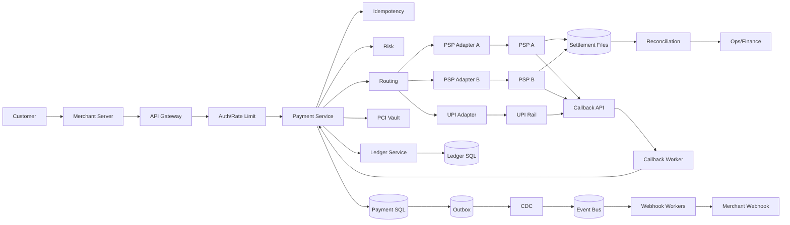
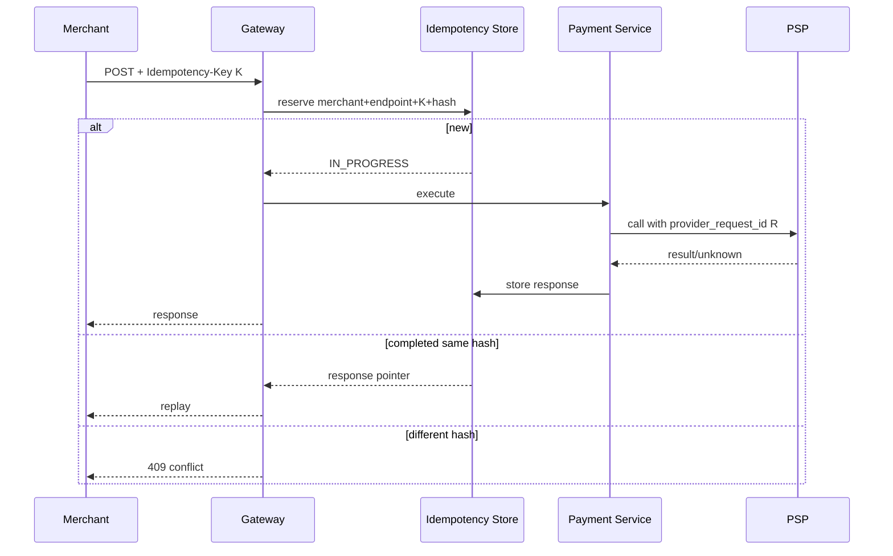
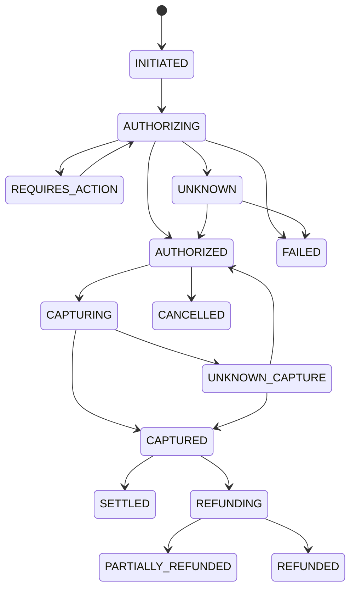
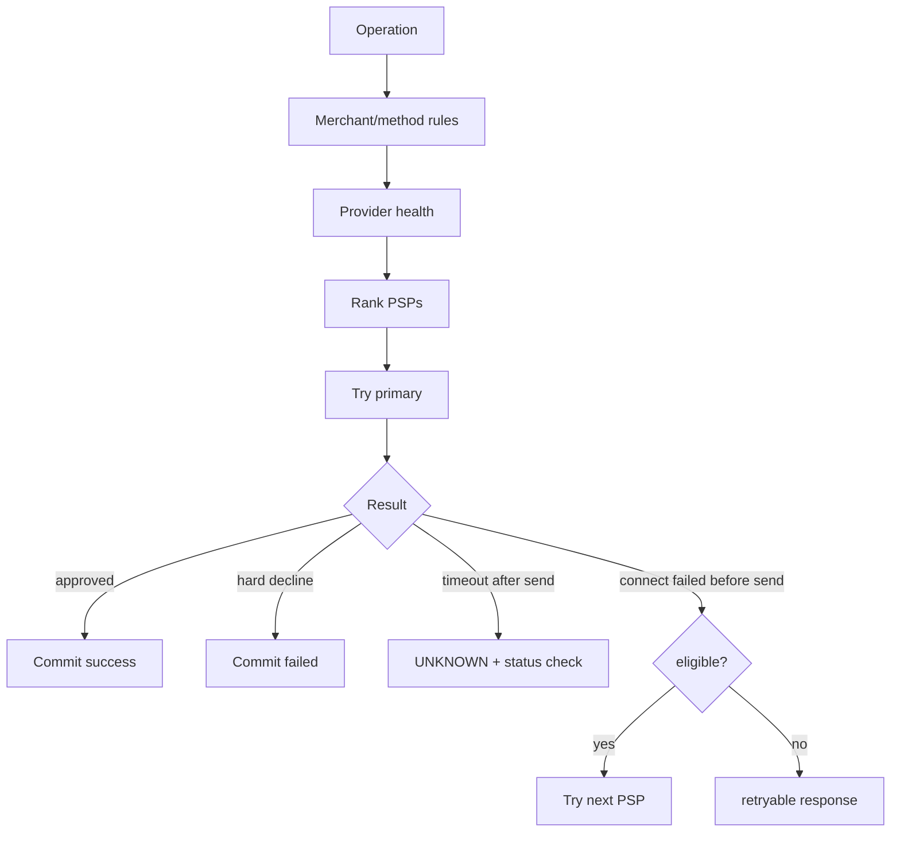
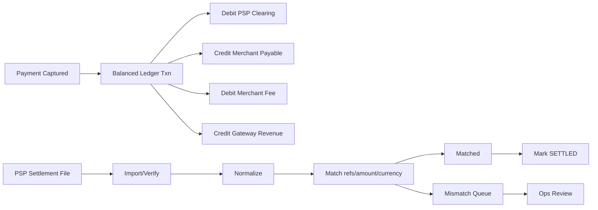
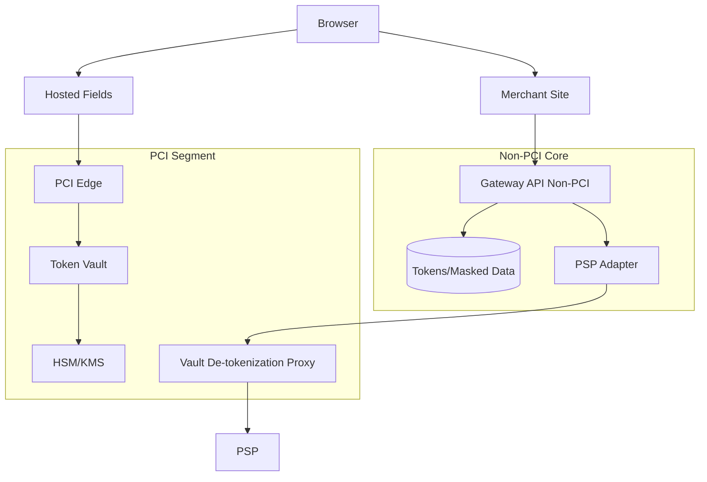
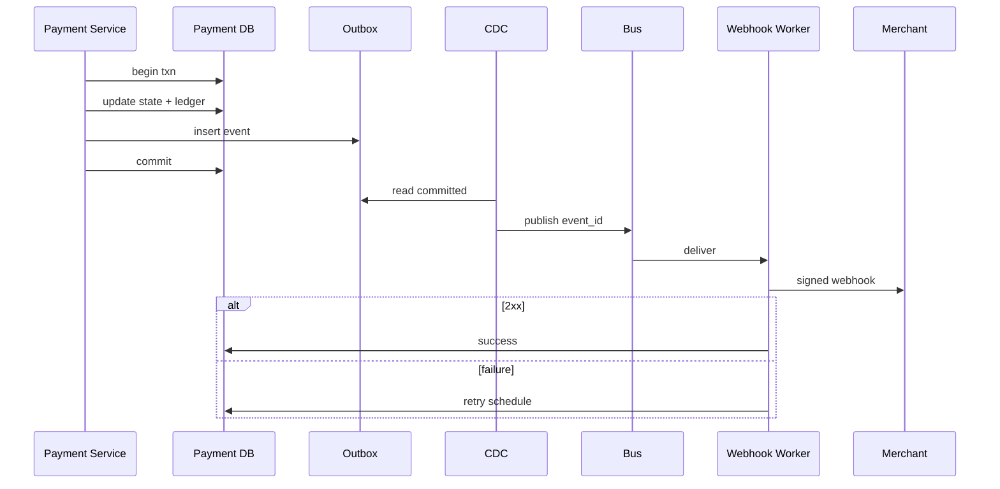

# Payment Gateway — High-Level Design

## 1. Problem Statement & Scope
Design a payment gateway that accepts merchant card/UPI payments, routes them to PSPs/acquiring banks, authorizes and captures funds, processes refunds, emits webhooks, reconciles settlement files, and remains PCI-DSS safe. The system is not a bank, card network, merchant KYC engine, or full payout platform. The primary goal is correctness: no duplicate charge, no lost capture, no over-refund, and every economic event auditable.
### Scope
- Payment create/authorize/capture/refund/status APIs.
- Card and UPI methods through provider adapters.
- Idempotency keys for every money-moving request.
- Durable state machine, transition log, and immutable ledger.
- Callbacks, webhooks, retries, DLQ, and reconciliation.
- Tokenization/vault integration; raw PAN never stored in core.
- Out of scope: issuer internals, disputes, KYC, FX pricing, tax invoices, wallet balances.
### Actors and success criteria
- Customer pays through merchant checkout.
- Merchant calls signed APIs and consumes signed webhooks.
- PSP/acquirer executes external payment operations.
- Vault owns raw card data and returns tokens.
- Finance/Ops investigate mismatches and approve adjustments.
- Same idempotency key plus same payload returns the same result.
- Known external money movement is posted exactly once internally.
- Unknown provider outcomes are resolved, not blindly retried.

## 2. Functional Requirements
### P0
- Authenticate merchants using API key ID, HMAC signature, timestamp, and replay window.
- Create payment intents with amount, currency, order reference, method token, and capture mode.
- Authorize card payments and UPI collect/intent requests.
- Capture immediately or manually after authorization.
- Refund fully or partially with over-refund prevention.
- Persist attempts, provider references, states, and redacted responses.
- Route to PSP/acquirer and handle PSP callbacks.
- Emit merchant webhooks for payment/refund state changes.
- Maintain append-only double-entry ledger entries.
- Run daily reconciliation against PSP settlement files.
- Expose status query and internal investigation APIs.
- Comply with PCI-DSS: no raw PAN/CVV in gateway core.
### P1/P2
- Smart routing by health, latency, success rate, cost, method, currency, BIN/VPA, and merchant preference.
- Retry only retryable failures; do not retry ambiguous money movement.
- Fail over only when a provider request definitely was not accepted.
- Use outbox and CDC for reliable webhook/event emission.
- Support 3DS/SCA, risk hooks, velocity limits, and fraud signals.
- Support chargeback integration, provider simulators, replay tools, and adaptive routing later.

## 3. Non-Functional Requirements
| Category | Requirement |
|---|---|
| Scale | 10M transactions/day, 30M attempts/day, 2M refunds/day, 100k merchants, 50M tokens. |
| Latency | Intent p99 <250 ms excluding PSP; authorize p99 <3 s; status p99 <150 ms. |
| Availability | Payment APIs 99.95%; status 99.99%; vault 99.99%; reconciliation daily after files. |
| Consistency | Strong for state, idempotency, ledger, refund limits; eventual for webhooks/analytics. |
| Durability | RF=3; ledger and audit retained 7+ years; immutable settlement artifacts. |
| Security | PCI segmentation, tokenization, KMS/HSM, mTLS, RBAC, MFA, redaction, signed callbacks. |
| Observability | Correlation IDs, provider request IDs, traces, provider metrics, DLQ and reconciliation alerts. |
- Correctness is preferred over availability during partitions.
- All money movement must be reconstructable from API request to provider response to ledger.
- Terminal reads may be cached; in-flight reads require primary/consistent replica.

## 4. Back-of-the-Envelope Estimation
### Traffic assumptions
| Item | Assumption | Notes |
|---|---|---|
| Transactions/day | 10M | merchant-visible terminal payments |
| Attempts/day | 30M | failures and retries included |
| Refunds/day | 2M | peak business target |
| Seconds/day | 100k | README convention |
| Peak | 3x average | burst estimate |
| Replication | 3x | durability |
### QPS arithmetic
| Flow | Daily | Average arithmetic | Avg QPS | Peak arithmetic | Peak QPS |
|---|---|---|---|---|---|
| Payment intents | 10M | 10,000,000/100,000 | 100 | 100x3 | 300 |
| Attempts | 30M | 30,000,000/100,000 | 300 | 300x3 | 900 |
| Captures | 8M | 8,000,000/100,000 | 80 | 80x3 | 240 |
| Refunds | 2M | 2,000,000/100,000 | 20 | 20x3 | 60 |
| Status reads | 100M | 100,000,000/100,000 | 1,000 | 1,000x3 | 3,000 |
| Callbacks | 30M | 30,000,000/100,000 | 300 | 300x3 | 900 |
| Webhooks | 40M | 40,000,000/100,000 | 400 | 400x3 | 1,200 |
### Storage arithmetic
| Record | Rows/day | Bytes | Arithmetic | Logical/day |
|---|---|---|---|---|
| payments | 10M | 2KB | 10M x 2KB | 20GB |
| attempts | 30M | 1.5KB | 30M x 1.5KB | 45GB |
| transitions | 50M | 500B | 50M x 500B | 25GB |
| ledger | 40M | 600B | 40M x 600B | 24GB |
| outbox | 40M | 800B | 40M x 800B | 32GB |
| webhook deliveries | 40M | 500B | 40M x 500B | 20GB |
| idempotency | 20M | 1KB | 20M x 1KB | 20GB |
| PSP metadata | 30M | 2KB | 30M x 2KB | 60GB |
| Total | - | - | sum | 246GB/day |
### Year and cache sizing
| Item | Arithmetic | Result |
|---|---|---|
| Core yearly logical | 246GB x 365 | 89.8TB |
| Core yearly RF=3 | 89.8TB x 3 | 269TB |
| Idempotency 7-day logical | 20GB x 7 | 140GB |
| Idempotency RF+index | 140GB x 3 x 1.5 | ~630GB |
| Ledger/day | 10M x 4 entries x 600B | 24GB/day |
| Ledger/year RF=3 | 24GB x 365 x 3 | 26.3TB |
| Peak bandwidth | ~16MB/s runtime payloads | not limiting |
| API nodes | 1,500 peak QPS / 150 QPS/node | ~15 payment API nodes |

## 5. API Design
- REST under /v1; internal calls may be gRPC.
- POST money movement endpoints require Idempotency-Key.
- Same merchant+endpoint+key+request-hash replays original response.
- Same key with different request hash returns 409.
- Amounts are integer minor units; responses expose opaque IDs and masked methods.
| Endpoint | Method | Idempotency | Purpose |
|---|---|---|---|
| /v1/payments | POST | required | create/confirm payment |
| /v1/payments/{id}/capture | POST | required | capture authorization |
| /v1/payments/{id}/refunds | POST | required | refund payment |
| /v1/payments/{id} | GET | no | payment status |
| /v1/refunds/{id} | GET | no | refund status |
| Create payment field | Required | Notes |
|---|---|---|
| merchant_order_id | yes | merchant reference |
| amount,currency | yes | minor units and ISO currency |
| payment_method_type | yes | CARD/UPI_COLLECT/UPI_INTENT |
| payment_method_token | conditional | vault token |
| capture_method | yes | AUTOMATIC/MANUAL |
| return_url | no | 3DS/UPI redirect |
| metadata | no | small redacted object |
| Error | Meaning | Retry |
|---|---|---|
| 400 ValidationError | bad request | change payload |
| 402 PaymentDeclined | issuer/customer decline | do not blindly retry |
| 409 IdempotencyConflict | same key different hash | fix client |
| 409 InvalidStateTransition | wrong state | query status |
| 422 AmountNotRefundable | over refund | lower amount |
| 429 RateLimited | too much traffic | retry after |
| 504 ProviderTimeoutUnknown | request may have reached PSP | same key/status-check only |
| Webhook header | Purpose |
|---|---|
| X-Gateway-Event-Id | merchant dedup |
| X-Gateway-Timestamp | replay window |
| X-Gateway-Signature | HMAC body signature |
| X-Gateway-Retry-Count | delivery attempt |

## 6. Data Model & Schema
| Data | Store | Why |
|---|---|---|
| Payments/refunds | Sharded SQL | ACID state machine |
| Ledger | Append-only SQL | double-entry invariants |
| Idempotency | SQL/consistent KV | conditional insert |
| Outbox | same SQL shard | atomic with state |
| Merchant config | SQL+Redis | read-heavy |
| Provider health | Redis/time-series | routing speed |
| Settlement files | Blob | immutable large files |
| Card data | PCI vault | scope isolation |
| Analytics | warehouse/lake | offline queries |
### payments
| Column group | Notes |
|---|---|
| payment_id PK, merchant_id, amount, currency, status, capture_method, authorized_amount, captured_amount, refunded_amount, method_token, masked_method, provider_ref, version, timestamps | Use implementation-specific types; index lookup keys and constraints. |
### payment_attempts
| Column group | Notes |
|---|---|
| attempt_id PK, payment_id, provider, provider_request_id, operation, amount, status, failure_code, retryable, started_at, completed_at | Use implementation-specific types; index lookup keys and constraints. |
### idempotency_keys
| Column group | Notes |
|---|---|
| merchant_id, endpoint, idempotency_key, request_hash, operation_id, status, response pointer, locked_until, expires_at | Use implementation-specific types; index lookup keys and constraints. |
### ledger_entries
| Column group | Notes |
|---|---|
| entry_id PK, ledger_txn_id, payment_id, refund_id, account_id, debit/credit, amount, currency, type, provider_ref, sequence, hashes | Use implementation-specific types; index lookup keys and constraints. |
### outbox_events
| Column group | Notes |
|---|---|
| event_id PK, aggregate_id, merchant_id, event_type, payload, status, dedup_key, created_at | Use implementation-specific types; index lookup keys and constraints. |
### webhook_deliveries
| Column group | Notes |
|---|---|
| delivery_id PK, event_id, merchant_id, url, status, attempt_count, next_attempt_at, last_error | Use implementation-specific types; index lookup keys and constraints. |
### provider_callbacks
| Column group | Notes |
|---|---|
| callback_id PK, provider, provider_event_id unique, provider_payment_ref, signature_valid, status, payload_ref | Use implementation-specific types; index lookup keys and constraints. |
### reconciliation_results
| Column group | Notes |
|---|---|
| result_id PK, provider, batch_id, provider_ref, payment_id, internal/provider amounts, category, status | Use implementation-specific types; index lookup keys and constraints. |
- Payment rows are sharded by merchant_id plus time; hot merchants can be sub-sharded.
- Idempotency primary key is merchant_id + endpoint + idempotency_key.
- Ledger transaction must balance debits and credits per currency.
- Refundable amount is enforced transactionally, not via cache.
- Corrections are adjustment rows; ledger entries are never updated.

## 7. High-Level Architecture

- Payment Service owns aggregate transitions and provider attempt lifecycle.
- Routing selects providers; adapters hide PSP-specific request/response semantics.
- Outbox guarantees event creation with the state commit; CDC publishes later.
- Callbacks and reconciliation both feed the same state machine.
- Vault is the only component allowed to handle raw card data.

## 8. Deep Dives
### A. Idempotency

- Reserve before side effects.
- Replay exact original status/body.
- In-progress retries return current operation, never start another PSP call.
- Expired locks are recovered by checking durable attempt state first.
- Payload-only dedup is rejected because legitimate payments may be identical.
### B. Exactly-once money movement

- Exactly-once external calls are impossible; exactly-once internal posting is achievable.
- Prepare-call-finalize records provider_request_id before the PSP call.
- Timeout after send becomes UNKNOWN, not FAILED.
- State transition, ledger rows, outbox event, and idempotency completion commit atomically.
- Over-capture and over-refund are rejected using version checks/row locks.
### C. PSP integration and failover

| PSP result | Action |
|---|---|
| Approved | commit authorized/captured |
| Hard decline | terminal failed; no retry |
| Validation error | no retry; fix config |
| Connect failed before send | safe failover |
| Read timeout after send | unknown and status-check |
| Rate limited | back off or route only if safe |
### D. Ledger and reconciliation

| Mismatch | Action |
|---|---|
| Gateway captured, PSP missing | status-check/escalate |
| PSP row, gateway missing | investigate callback gap/fraud |
| Amount mismatch | compare partials/fees/rounding |
| Duplicate settlement | claim or adjustment |
| Fee mismatch | config update or dispute |
### E. Security/PCI

- Raw PAN enters only hosted fields, PCI edge, vault, and proxy.
- CVV is never stored.
- Core stores token, brand, expiry, and last4 only.
- Logs are redacted and scanned for PAN patterns.
- mTLS, segmentation, KMS/HSM, MFA, RBAC, and immutable audit support PCI-DSS.

## 9. Scaling/Caching/Bottlenecks
- Stateless API scaling behind load balancers.
- Payment SQL sharded by merchant/time; hot merchants get sub-shards.
- Read replicas/cache only for terminal statuses.
- Queues decouple callbacks, webhooks, and reconciliation from payment APIs.
- Event bus partition by payment_id for ordering; webhook queues partition by merchant_id for fairness.
- Provider bulkheads prevent one PSP outage from exhausting all workers.
| Cache | TTL | Use |
|---|---|---|
| Merchant config | 5 min | auth/routing/webhook URL |
| Provider health | 10-60 s | routing decisions |
| Terminal status | 1-24 h | read-heavy final responses |
| Idempotency hot pointer | 1-2 h | faster replay backed by strong store |
| BIN metadata | 1 day | routing/risk |
| Verification keys | 5-30 min | signature validation |
| Bottleneck | Mitigation |
|---|---|
| PSP latency | timeouts, routing, circuit breakers |
| SQL contention | short transactions, optimistic locking, sub-shards |
| Webhook backlog | per-merchant concurrency, retry, DLQ |
| Callback storm | durable dedup and queue buffering |
| Ledger write amplification | batch insert and partition |
| Vault latency | pre-tokenize and strict timeout |
| Provider limits | token buckets and traffic shaping |

## 10. Reliability & Consistency
- PSP calls are at-least-once/unknown; gateway APIs become effectively-once with idempotency.
- Webhooks are at-least-once; merchants dedup by event ID.
- Provider callbacks are duplicated and out of order; state machine accepts only forward progress.
- Reconciliation is the final backstop for missed callbacks and unknown outcomes.
| Failure | Response |
|---|---|
| Crash before PSP call | resume from idempotency state |
| Crash after PSP call | status-check provider_request_id |
| PSP timeout | mark UNKNOWN |
| Hard decline | commit FAILED |
| Duplicate callback | unique key ignore |
| Outbox down | events remain in DB |
| Merchant webhook down | retry then DLQ/expire |
| Settlement file late | SLA alert and PSP escalation |

- Writes use primary region to avoid split-brain money movement.
- DR target: RPO <1 min, RTO <15 min with replicated idempotency and payment state.
- Connect failure before send may be retried/failover; timeout after send must be status-checked.
- Backpressure uses merchant limits, provider token buckets, circuit breakers, and queue depth controls.

## 11. Trade-offs & Alternatives
| Decision | Chosen | Alternative | Why | Cost |
|---|---|---|---|---|
| Money DB | SQL/ACID | NoSQL | constraints and transactions | sharding |
| Idempotency | client key+hash | dedup by content | explicit retry contract | merchant burden |
| Provider pattern | prepare-call-finalize | DB txn around PSP | recovery without long locks | more states |
| Webhooks | outbox+CDC | inline send | reliable decoupling | duplicates |
| Ledger | double-entry append-only | mutable balances | audit correctness | more writes |
| Routing | multi-PSP | single PSP | availability/success/cost | adapter complexity |
| Failover | conservative | aggressive | avoid double charge | lower ambiguous success |
| PCI | hosted fields+vault | merchant posts PAN | minimize scope | integration work |
| Capture | auth+capture and sale | sale only | merchant flexibility | state complexity |
| Region | active-passive writes | active-active | avoid split brain | failover time |
- SQL is selected for money because correctness beats raw write scale.
- Idempotency-key beats content dedup because identical legitimate payments exist.
- Naive retry is rejected because provider uncertainty can double charge.
- Outbox accepts duplicate delivery in exchange for no lost events.
- Two-phase capture is worth complexity for shipping-later and adjustable orders.

## 12. Future Improvements
- Adaptive routing with real-time approval predictions
- Provider scorecards and cost optimization
- Network token provisioning
- 3DS/SCA orchestration
- Chargeback/dispute workflow
- Merchant payout ledger
- Real-time settlement status
- Risk-based step-up
- Per-BIN circuit breakers
- ML reconciliation anomaly detection
- Automated low-risk adjustment approvals
- Active-active regional reads
- Formal state-machine verification
- Tamper-evident ledger hash verification
- Deterministic PSP sandbox
- Chaos tests for PSP timeout/callback duplicates
- Webhook replay UI
- Jurisdiction-aware retention
- Privacy-preserving analytics
- More local payment methods
- Marketplace split payments
- Risk-based payout holds
- Provider certification suites
- Settlement forecast dashboards
- Self-service merchant reconciliation
- Declarative routing canaries
- Callback schema evolution checks
- SDKs enforcing idempotency
- Synthetic PSP probes
- Manual adjustment dual approval
- Tenant-aware shard rebalancing
- Public incident annotations
- Runbook: classify provider error before retrying.
- Runbook: never mark timeout as failure if request may have been sent.
- Runbook: status-check unknown attempt before failover.
- Runbook: freeze settlement for duplicate-charge incident.
- Runbook: replay outbox from committed offset after publisher outage.
- Metric: unknown outcome rate by provider and method.
- Metric: authorization success rate by BIN/VPA and merchant.
- Metric: webhook backlog and oldest undelivered event.
- Metric: reconciliation mismatch count by category.
- Metric: ledger posting lag and imbalance alarms.
- Control: PAN redaction tests in CI and log pipeline.
- Control: provider callback signature and replay validation.
- Control: KMS rotation and vault access review.
- Control: per-merchant rate limits and anomaly alerts.
- Control: immutable audit trail for admin actions.
- Runbook: classify provider error before retrying.
- Runbook: never mark timeout as failure if request may have been sent.
- Runbook: status-check unknown attempt before failover.
- Runbook: freeze settlement for duplicate-charge incident.
- Runbook: replay outbox from committed offset after publisher outage.
- Metric: unknown outcome rate by provider and method.
- Metric: authorization success rate by BIN/VPA and merchant.
- Metric: webhook backlog and oldest undelivered event.
- Metric: reconciliation mismatch count by category.
- Metric: ledger posting lag and imbalance alarms.
- Control: PAN redaction tests in CI and log pipeline.
- Control: provider callback signature and replay validation.
- Control: KMS rotation and vault access review.
- Control: per-merchant rate limits and anomaly alerts.
- Control: immutable audit trail for admin actions.
- Runbook: classify provider error before retrying.
- Runbook: never mark timeout as failure if request may have been sent.
- Runbook: status-check unknown attempt before failover.
- Runbook: freeze settlement for duplicate-charge incident.
- Runbook: replay outbox from committed offset after publisher outage.
- Metric: unknown outcome rate by provider and method.
- Metric: authorization success rate by BIN/VPA and merchant.
- Metric: webhook backlog and oldest undelivered event.
- Metric: reconciliation mismatch count by category.
- Metric: ledger posting lag and imbalance alarms.
- Control: PAN redaction tests in CI and log pipeline.
- Control: provider callback signature and replay validation.
- Control: KMS rotation and vault access review.
- Control: per-merchant rate limits and anomaly alerts.
- Control: immutable audit trail for admin actions.
- Runbook: classify provider error before retrying.
- Runbook: never mark timeout as failure if request may have been sent.
- Runbook: status-check unknown attempt before failover.
- Runbook: freeze settlement for duplicate-charge incident.
- Runbook: replay outbox from committed offset after publisher outage.
- Metric: unknown outcome rate by provider and method.
- Metric: authorization success rate by BIN/VPA and merchant.
- Metric: webhook backlog and oldest undelivered event.
- Metric: reconciliation mismatch count by category.
