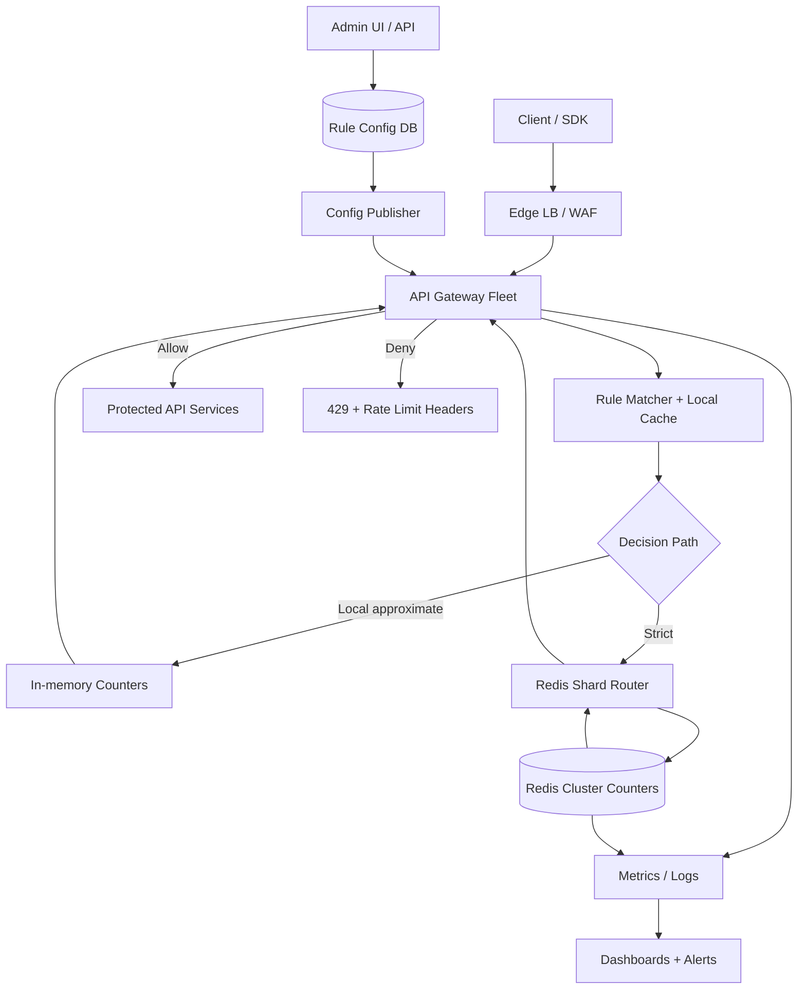
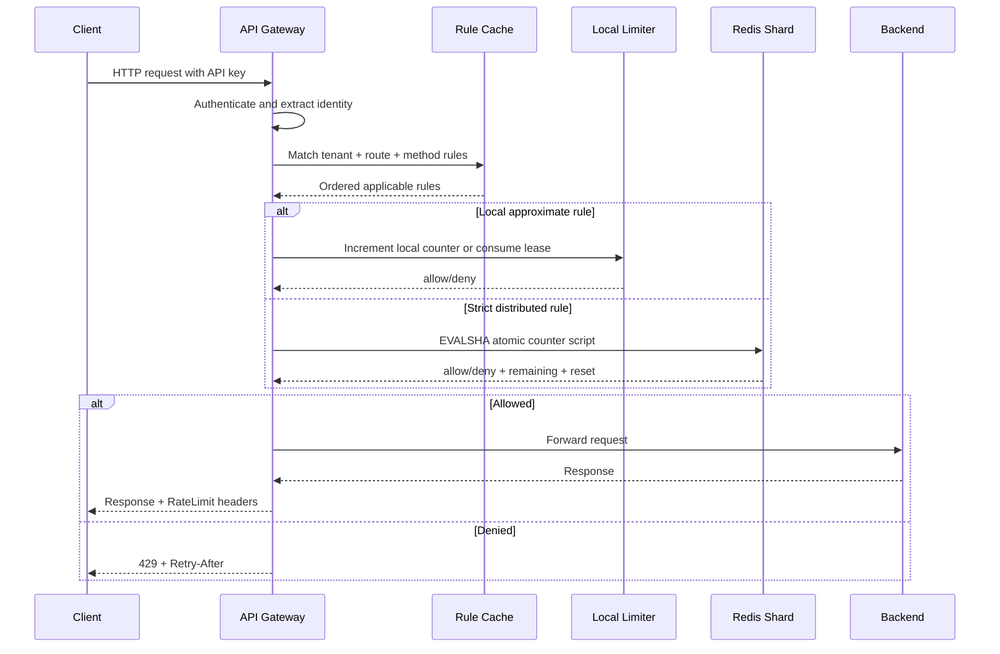
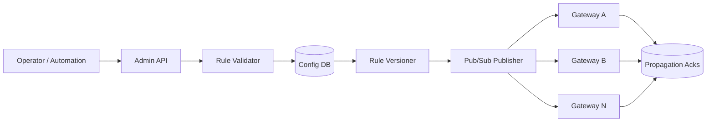
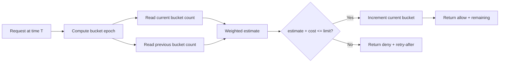
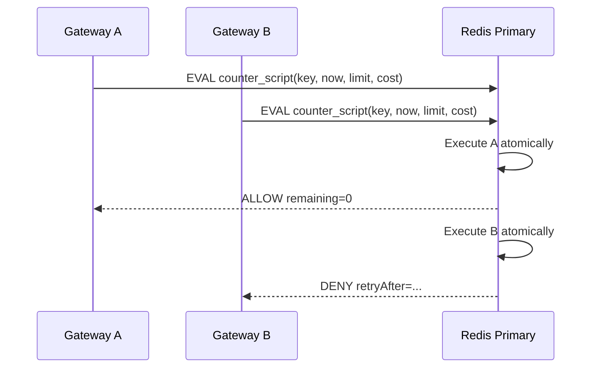
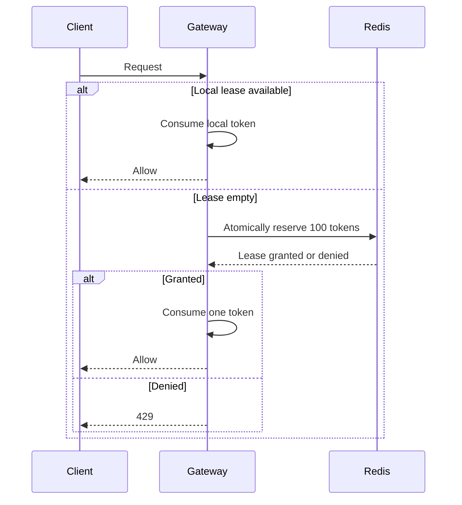
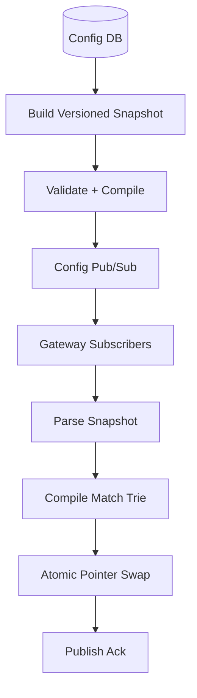

# Distributed Rate Limiter — High-Level Design
## 1. Problem Statement & Scope
Design a distributed API-level rate limiter that throttles requests per client identity.
Client identity can be API key, user ID, tenant ID, source IP, endpoint, method, or a composite key.
The limiter runs across a fleet of API gateways, sidecars, or middleware instances.
The system must decide whether to allow or reject a request before protected backend services are called.
The basic contract is `N` requests per configured time window per key.
When quota is exhausted, the client receives HTTP `429 Too Many Requests`.
The response includes `Retry-After` and standard rate-limit headers where possible.
The main design challenge is coordinating counters across many stateless nodes with very low added latency.
Centralized counting is accurate but adds network latency and creates a counter-store dependency.
Local counting is fast and available but approximate unless traffic is sticky or quota is leased.
This design uses a hybrid model.
Strict rules use Redis Cluster with atomic Lua scripts.
Soft rules use local in-memory counters or leased tokens.
Gateways keep a versioned in-memory rule cache.
Rules are managed by a separate durable control plane.
In scope:
- Per-key API rate limiting.
- Multiple rules and pricing tiers.
- Hierarchical limits such as API-key plus tenant aggregate.
- HTTP `429`, `Retry-After`, and rate-limit headers.
- Centralized Redis counters.
- Local approximate counters.
- Quota leasing for hot keys.
- Redis sharding and TTL strategy.
- Fail-open, fail-closed, and degraded local mode.
- Configuration distribution to gateways.
- Observability and operator controls.
Out of scope:
- API-key issuance and authentication.
- Full API gateway routing.
- Network-layer DDoS scrubbing.
- CAPTCHA and fraud investigation systems.
- Billing-grade durable metering.
- Long-term request analytics beyond sampled logs and metrics.
Assumptions:
- Peak fleet traffic is 1M RPS.
- Average traffic is roughly 400K RPS.
- There are 100M active client keys per day.
- There are 5M active client keys per minute.
- Most short-window counters can be ephemeral.
- Redis-compatible storage is acceptable for hot counters.
- Config propagation in seconds is acceptable.
- Cross-region exactness is not required for every tenant.
## 2. Functional Requirements
### Core requirements
- Evaluate every incoming request before backend execution.
- Identify the client by API key, user ID, tenant ID, IP, or composite key.
- Support route and method specific policies.
- Support multiple rules per request.
- Support per-second, per-minute, per-hour, and per-day windows.
- Support weighted requests where expensive APIs consume more units.
- Support product tiers such as free, standard, enterprise, and internal.
- Support custom tenant-specific limits.
- Support tenant aggregate limits.
- Support endpoint-specific stricter limits.
- Support allowlist overrides.
- Support blocklist overrides.
- Support shadow mode.
- Support dry-run rule evaluation.
- Support dynamic rule updates without gateway restart.
- Support rule rollback.
- Support staged rollout by region, tenant, or percentage.
- Return `429 Too Many Requests` when a rule denies traffic.
- Return `Retry-After` on rejected requests.
- Return `RateLimit-Limit`.
- Return `RateLimit-Remaining`.
- Return `RateLimit-Reset`.
- Return `RateLimit-Policy`.
- Emit metrics for allowed decisions.
- Emit metrics for denied decisions.
- Emit metrics for shadow denials.
- Emit metrics for degraded decisions.
- Emit metrics for Redis errors.
- Provide diagnostics for a client key and rule.
### Priority table
| Priority | Requirement |
|---|---|
| P0 | Enforce `N/window/key` limits. |
| P0 | Return correct HTTP status and retry metadata. |
| P0 | Keep request-path latency low. |
| P0 | Support multiple rules per key. |
| P0 | Handle Redis failures according to policy. |
| P1 | Support shadow rules and staged rollout. |
| P1 | Support local fallback and quota leasing. |
| P1 | Provide admin rule APIs. |
| P2 | Support global quota partitioning. |
| P2 | Support adaptive limits based on backend health. |
### Non-goals
- The limiter is not a source of billing truth.
- The limiter does not authenticate users.
- The limiter does not inspect request bodies.
- The limiter does not decide authorization.
- The limiter does not replace a WAF.
## 3. Non-Functional Requirements
| Category | Target |
|---|---|
| Scale | 1M peak RPS across the fleet. |
| Average load | 400K RPS using a 2.5x peak factor. |
| Active keys | 100M active keys/day, 5M active keys/minute. |
| Local latency | p50 < 100µs, p99 < 500µs. |
| Redis latency | p50 < 1ms same AZ, p99 < 5ms normal operation. |
| Added API latency | p99 < 10ms. |
| Availability | 99.99% data-plane availability. |
| Config propagation | Seconds, with last-known-good fallback. |
| Consistency | Atomic per-key strict counters. |
| Durability | Durable rules; ephemeral counters. |
| Security | Hash client identifiers in logs and metrics. |
| Operability | Dashboards, alerts, rule versioning, emergency overrides. |
Latency requirements:
- No durable database calls on the hot path.
- Rule lookup must be in memory.
- Redis calls must have tight timeout budgets.
- Local decisions should be allocation-light.
- Metrics must be asynchronous.
Availability requirements:
- Gateways continue with last-known-good rules when config service is down.
- Redis failover should not collapse all traffic.
- Fail-open is available for customer-facing APIs.
- Fail-closed is available for security-sensitive APIs.
- Degraded local mode is available for soft protection.
Consistency requirements:
- Strict Redis path is atomic per key on one primary.
- Approximate local path may over-admit within bounded limits.
- Config updates are eventually applied across gateways.
- Every decision includes the active rule version.
- Cross-region limits are regional by default unless explicitly strict.
## 4. Back-of-the-Envelope Estimation
README convention: 1 day ≈ 86,400 seconds ≈ `10^5` seconds.
Peak is assumed to be about 2.5x average.
### Traffic estimation
| Item | Assumption | Arithmetic | Result |
|---|---:|---:|---:|
| Peak RPS | Given | - | 1,000,000 RPS |
| Peak factor | Convention | 2.5x average | - |
| Average RPS | Peak / 2.5 | 1,000,000 / 2.5 | 400,000 RPS |
| Requests/day | Avg RPS * 10^5 | 400,000 * 100,000 | 40,000,000,000/day |
| Gateway nodes | 1,000 nodes | 1,000,000 / 1,000 | 1,000 RPS/node |
| Pods at 5K RPS | Peak / 5,000 | 1,000,000 / 5,000 | 200 pods |
| Pods with 2x headroom | 200 * 2 | - | 400 pods |
### Counter operations
Assume each request checks three rules.
The three rules are API-key per-second, API-key per-minute, and tenant per-minute aggregate.
| Strategy | Arithmetic | Counter-store load |
|---|---:|---:|
| Naive remote per rule | 1M RPS * 3 rules | 3M ops/s |
| Grouped Lua per request | 1M RPS * 1 script | 1M scripts/s |
| 20% strict remote | 1M RPS * 20% | 200K scripts/s |
| Lease 100 tokens | 1M RPS / 100 | 10K lease ops/s |
A single Redis primary may safely handle about 100K script executions per second depending on hardware and Lua complexity.
| Item | Arithmetic | Result |
|---|---:|---:|
| Safe primary capacity | Assumption | 100K scripts/s |
| Required strict scripts | Given | 1M scripts/s |
| Minimum primaries | 1M / 100K | 10 |
| Headroom factor | 10 * 2 | 20 primaries |
| Replicas | 20 * 2 | 40 replicas |
| Total Redis nodes | 20 + 40 | 60 nodes |
### Memory for sliding-window counters
Assume:
- 5M active keys per minute.
- 3 rules per active key.
- 2 buckets per rule.
- 150 bytes per bucket including Redis overhead.
| Item | Arithmetic | Result |
|---|---:|---:|
| Active rule counters | 5M * 3 | 15M |
| Buckets | 15M * 2 | 30M |
| Raw memory | 30M * 150 B | 4.5 GB |
| Replication factor 3 | 4.5 GB * 3 | 13.5 GB |
| 2x fragmentation/headroom | 13.5 GB * 2 | 27 GB |
Daily counters are larger.
| Item | Arithmetic | Result |
|---|---:|---:|
| Daily active keys | Given | 100M |
| Daily buckets | 100M * 1 rule * 2 | 200M |
| Raw memory | 200M * 150 B | 30 GB |
| Replicated | 30 GB * 3 | 90 GB |
| With headroom | 90 GB * 2 | 180 GB |
Daily limits should use compact counters, separate storage, or approximate regional accounting when exactness is not required.
### Network cost
Assume one Redis decision sends 300 B and receives 200 B.
Round-trip payload is about 500 B before protocol overhead.
| Path | Arithmetic | Result |
|---|---:|---:|
| Centralized raw bandwidth | 1M * 500 B | 500 MB/s |
| Centralized bits | 500 MB/s * 8 | 4 Gbps |
| With overhead | 4 Gbps * 2 | 8 Gbps |
| 20% strict raw | 200K * 500 B | 100 MB/s |
| 20% strict with overhead | 100 MB/s * 8 * 2 | 1.6 Gbps |
### Rule storage
| Item | Arithmetic | Result |
|---|---:|---:|
| Active rules | 100K * 2 KB | 200 MB |
| Historical versions | 200 MB * 100 | 20 GB |
| Replication factor 3 | 20 GB * 3 | 60 GB |
Rule storage is small compared with request traffic.
### Metrics cardinality
| Item | Arithmetic | Result |
|---|---:|---:|
| Gateways | Given | 1,000 |
| Hot rules/gateway | Assumption | 1,000 |
| Decision types | allow, deny, shadow, degraded | 4 |
| Series worst case | 1,000 * 1,000 * 4 | 4M |
Do not label metrics by raw client key.
Use sampled logs for client-level debugging.
## 5. API Design
The primary runtime API is internal between gateway and limiter logic.
The limiter may be an in-process library, local sidecar, or remote gRPC service.
### Internal gRPC API
```protobuf
service RateLimitService {
  rpc Check(CheckRequest) returns (CheckResponse);
  rpc BatchCheck(BatchCheckRequest) returns (BatchCheckResponse);
}

message CheckRequest {
  string request_id = 1;
  string tenant_id = 2;
  string api_key_hash = 3;
  string user_id = 4;
  string source_ip = 5;
  string method = 6;
  string route_template = 7;
  string region = 8;
  int64 now_epoch_ms = 9;
  int32 cost = 10;
  map<string, string> attributes = 11;
}

message CheckResponse {
  Decision decision = 1;
  string matched_rule_id = 2;
  string rule_version = 3;
  int64 limit = 4;
  int64 remaining = 5;
  int64 reset_epoch_ms = 6;
  int64 retry_after_ms = 7;
  bool degraded = 8;
  string reason = 9;
}

enum Decision {
  ALLOW = 0;
  DENY = 1;
  SHADOW_DENY = 2;
}
```
### HTTP success response
```http
HTTP/1.1 200 OK
RateLimit-Limit: 1000
RateLimit-Remaining: 431
RateLimit-Reset: 42
RateLimit-Policy: 1000;w=60
```
### HTTP rejected response
```http
HTTP/1.1 429 Too Many Requests
Content-Type: application/json
Retry-After: 17
RateLimit-Limit: 1000
RateLimit-Remaining: 0
RateLimit-Reset: 17
RateLimit-Policy: 1000;w=60

{"error":"rate_limited","message":"Too many requests","ruleId":"api-key-minute"}
```
### Admin APIs
| API | Purpose |
|---|---|
| `PUT /v1/tenants/{tenantId}/rate-limit-rules/{ruleId}` | Create or update a rule. |
| `GET /v1/tenants/{tenantId}/effective-rate-limits` | Inspect effective rules for a key and route. |
| `POST /v1/rule-sets/{version}/validate` | Validate a draft rule set. |
| `POST /v1/rule-sets/{version}/activate` | Activate a version. |
| `POST /v1/rule-sets/{version}/rollback` | Roll back to a previous version. |
| `POST /v1/rule-sets/{version}/canary` | Start staged rollout. |
### Rule example
```json
{
  "ruleId": "api-key-minute",
  "scope": "API_KEY",
  "routeTemplate": "/v1/payments/*",
  "method": "POST",
  "algorithm": "SLIDING_WINDOW_COUNTER",
  "limit": 1000,
  "windowSeconds": 60,
  "enforcement": "STRICT_REDIS",
  "failurePolicy": "FAIL_OPEN",
  "mode": "ENFORCE",
  "priority": 100
}
```
Admin writes use idempotency keys.
Activated rule versions are immutable.
Runtime allow decisions consume quota and should not be blindly retried.
## 6. Data Model & Schema
### Storage engines
| Data | Store | Why |
|---|---|---|
| Short-lived counters | Redis Cluster | Atomic increments, Lua scripts, TTLs, low latency. |
| Rule definitions | PostgreSQL or strongly consistent KV | Transactions, validation, auditability. |
| Rule cache | Gateway memory | Zero remote hot-path I/O. |
| Decision metrics | Time-series DB | Aggregations and alerts. |
| Decision logs | Kafka plus object storage | Sampled debugging and offline analytics. |
| Hot-key registry | Config DB plus Redis | Operational overrides and routing hints. |
### Rule table
```sql
CREATE TABLE rate_limit_rules (
  rule_id VARCHAR(128) PRIMARY KEY,
  tenant_id VARCHAR(128) NOT NULL,
  scope VARCHAR(32) NOT NULL,
  route_template VARCHAR(512),
  http_method VARCHAR(16),
  algorithm VARCHAR(64) NOT NULL,
  limit_count BIGINT NOT NULL,
  window_seconds INT NOT NULL,
  burst_capacity BIGINT,
  enforcement VARCHAR(64) NOT NULL,
  failure_policy VARCHAR(32) NOT NULL,
  mode VARCHAR(32) NOT NULL,
  priority INT NOT NULL,
  version BIGINT NOT NULL,
  effective_from TIMESTAMP NOT NULL,
  effective_to TIMESTAMP,
  created_by VARCHAR(128) NOT NULL,
  created_at TIMESTAMP NOT NULL,
  updated_at TIMESTAMP NOT NULL
);
```
Indexes:
- `(tenant_id, version)` for active rule loading.
- `(tenant_id, route_template, http_method)` for inspection.
- `(version)` for rollback.
- `(mode)` for finding shadow or disabled rules.
### Rule version table
```sql
CREATE TABLE rule_set_versions (
  version BIGINT PRIMARY KEY,
  status VARCHAR(32) NOT NULL,
  checksum VARCHAR(128) NOT NULL,
  created_by VARCHAR(128) NOT NULL,
  created_at TIMESTAMP NOT NULL,
  activated_at TIMESTAMP,
  rollout_policy JSONB NOT NULL
);
```
### Audit table
```sql
CREATE TABLE rule_audit_events (
  event_id VARCHAR(128) PRIMARY KEY,
  rule_id VARCHAR(128) NOT NULL,
  version BIGINT NOT NULL,
  actor VARCHAR(128) NOT NULL,
  action VARCHAR(64) NOT NULL,
  before_json JSONB,
  after_json JSONB,
  created_at TIMESTAMP NOT NULL
);
```
### Redis keyspace
Sliding-window counter key:
```text
rl:{slot}:{tenant_hash}:{rule_id}:{identity_hash}:{bucket_epoch}
```
Token-bucket key:
```text
tb:{slot}:{tenant_hash}:{rule_id}:{identity_hash}
```
Hot-key striped counter key:
```text
rl:{slot}:{tenant_hash}:{rule_id}:{identity_hash}:{bucket_epoch}:{stripe_id}
```
Key design rules:
- Use hashed identities, not raw API keys.
- Use Redis cluster hash tags so script keys share one slot.
- Include rule ID to avoid collisions between policies.
- Include bucket epoch for time-window expiration.
- Set TTL to `windowSeconds + bucketSeconds + clockSkewBuffer`.
- Use compact values because cardinality is high.
### Local gateway data
- Compiled rule trie by tenant, route, and method.
- Ordered rule list by priority.
- Bounded LRU local counter cache.
- Lease cache for granted token chunks.
- Redis shard health map.
- Last-known-good rule version.
- Rule checksum for diagnostics.
## 7. High-Level Architecture

The gateway extracts identity and route metadata after authentication.
The rule matcher uses an in-memory compiled snapshot.
The matcher returns all applicable rules in deterministic priority order.
Strict rules call Redis through a shard router.
Approximate rules use local counters or leased tokens.
Shadow rules are evaluated but do not deny traffic.
The first enforced denial stops request forwarding.
The gateway emits headers based on the most restrictive matched rule.
Configuration is distributed by the control plane.
Counters are ephemeral and live in Redis.
Metrics and logs are asynchronous.
### Request sequence

### Control plane

The control plane optimizes auditability.
The data plane optimizes latency and availability.
## 8. Deep Dives
### 8.1 Algorithm comparison
| Algorithm | Accuracy | Memory/key | Burst behavior | Distributed complexity | Decision |
|---|---|---:|---|---|---|
| Fixed window | Low near boundary | O(1) | Allows 2x boundary burst | Low | Not default |
| Sliding window log | Exact | O(requests in window) | Smooth | High | Too much memory |
| Sliding window counter | Bounded approximation | O(1) or O(buckets) | Smooth enough | Medium | Default |
| Token bucket | Accurate token accounting | O(1) | Allows configured burst | Medium | Supported |
| Leaky bucket | Smooth drain | O(1) or queue | Shapes output | Medium | Not default |
Fixed window example:
```text
Limit = 100 requests/minute
Client sends 100 requests at 00:59
Client sends 100 requests at 01:00
Observed 2-second burst = 200 requests
```
Sliding-window log is exact.
It stores every accepted request timestamp.
It removes timestamps older than the window.
It becomes expensive for hot keys.
Sliding-window counter is the default.
It uses the current bucket plus a weighted previous bucket.
It has bounded memory.
It smooths boundary bursts better than fixed windows.
Token bucket is supported when the product wants explicit burst capacity.
Leaky bucket is more natural for queue shaping than API admission.
### 8.2 Sliding-window counter mechanics

For a 60-second window:
- `current_bucket = floor(now / 60s)`.
- `previous_bucket = current_bucket - 1`.
- `fraction_elapsed = (now % 60s) / 60s`.
- `previous_weight = 1 - fraction_elapsed`.
- `estimated_count = current_count + previous_count * previous_weight`.
Example arithmetic:
```text
previous_count = 800
current_count = 100
elapsed = 15 seconds
previous_weight = (60 - 15) / 60 = 0.75
estimated_count = 100 + 800 * 0.75 = 700
```
If `limit = 1000` and `cost = 1`, the request is allowed.
If `estimated_count + cost > limit`, the request is rejected.
Using smaller sub-buckets improves accuracy.
For a 60-second window with 10-second buckets, the system stores about seven buckets.
That increases memory but reduces approximation error.
### 8.3 Atomic Redis enforcement
The dangerous race:
```text
Limit = 100
Current count = 99
Gateway A reads 99
Gateway B reads 99
Gateway A allows and writes 100
Gateway B allows and writes 101
Two requests were admitted when one slot remained
```
Redis Lua fixes this by making read, decision, increment, and TTL assignment atomic.

Pseudo Lua:
```lua
local current = tonumber(redis.call('GET', KEYS[1]) or '0')
local previous = tonumber(redis.call('GET', KEYS[2]) or '0')
local weight = tonumber(ARGV[1])
local limit = tonumber(ARGV[2])
local cost = tonumber(ARGV[3])
local ttl = tonumber(ARGV[4])
local estimated = current + previous * weight
if estimated + cost > limit then
  return {0, math.max(0, limit - estimated), ttl}
end
current = redis.call('INCRBY', KEYS[1], cost)
redis.call('PEXPIRE', KEYS[1], ttl)
redis.call('PEXPIRE', KEYS[2], ttl)
return {1, math.max(0, limit - current), ttl}
```
All keys touched by the script must be on the same Redis cluster slot.
The hash tag in the key provides this colocation.
Atomic scripts solve same-shard races.
They do not solve cross-region replication lag.
### 8.4 Distributed state placement
#### Centralized Redis counters
Advantages:
- Strong per-key atomicity within one Redis primary.
- Simple correctness model.
- Accurate remaining quota.
- Good fit for high-value quotas.
Disadvantages:
- Adds network latency to each strict request.
- Creates a counter-store dependency.
- Hot keys can overload one shard.
- Cross-region strictness is hard.
#### Local in-memory counters with async sync
Advantages:
- Extremely low latency.
- No remote hop.
- Survives Redis outages.
- Low infrastructure cost.
Disadvantages:
- Over-admission is possible.
- A client can spread traffic across gateways.
- Remaining quota is approximate.
- Sync lag creates inconsistent state.
Naive worst-case over-admission:
```text
Gateways = G
Limit = L per window
Worst admitted = G * L
If G = 1,000 and L = 100/minute, worst admitted = 100,000/minute
```
Mitigations:
- Sticky routing by client key.
- Quota leasing from Redis.
- Per-gateway quota partitioning.
- Conservative local budgets.
- Strict Redis for premium and sensitive APIs.
#### Sticky routing
Sticky routing sends all traffic for one key to the same gateway shard.
This makes local counters much more accurate.
It reduces Redis load.
It can create load imbalance for celebrity clients.
It loses local state when a gateway fails unless state is replicated.
It also requires identity to be known before load balancing.
### 8.5 Quota leasing
Quota leasing is a hybrid between centralized and local enforcement.

Example:
```text
Limit = 10,000 requests/minute
Lease size = 100 tokens
Redis calls = 10,000 / 100 = 100 lease calls/minute
```
If a gateway crashes with unused leased tokens, the system may under-admit.
Under-admission is safer than over-admission for strict quotas.
Lease TTLs should be short.
Lease size should be small relative to the window.
Hot keys benefit most from leasing.
### 8.6 Clock skew
Time-window algorithms depend on consistent time.
Gateways can have skewed clocks.
Redis server time can differ from gateway time.
Cross-region clocks can differ by milliseconds.
Mitigations:
- Use Redis `TIME` inside Lua for strict counters when practical.
- Use monotonic clocks for local elapsed time.
- Monitor NTP skew.
- Add TTL skew buffers.
- Avoid client-provided timestamps.
- Round bucket boundaries using server time for strict paths.
### 8.7 Configuration distribution

Gateways never partially apply rules.
They compile a full immutable snapshot first.
They validate checksum and version.
They atomically swap the active pointer.
If compilation fails, the old version remains active.
Every decision records the active version.
Rollout can be staged by region, tenant, gateway group, or percentage.
## 9. Scaling/Caching/Bottlenecks
### Gateway scaling
- Scale gateways horizontally behind load balancers.
- Keep rule matching in process.
- Compile route templates into tries.
- Reduce wildcard overlap.
- Avoid hot-path allocations.
- Emit metrics asynchronously.
- Use sidecar or plugin placement to avoid an extra remote hop.
### Redis scaling
- Shard by stable identity hash.
- Use Redis cluster hash tags for multi-key scripts.
- Keep current and previous bucket keys on the same shard.
- Use replicas for failover, not write scaling.
- Add primaries before script p99 latency rises.
- Use quota leasing for hot clients.
- Use dedicated shards for extreme celebrity clients.
### Cache layers
| Cache | Location | Contents | Invalidation |
|---|---|---|---|
| Rule cache | Gateway memory | Compiled active rules | Versioned atomic swap |
| Local counter cache | Gateway memory | Approximate counters | TTL and LRU |
| Lease cache | Gateway memory | Granted token chunks | TTL and consumption |
| Redis counters | Redis memory | Distributed counters | TTL |
| Admin read cache | Control plane | Rule views | Version-based |
### Hot-key handling
Hot keys can be:
- A celebrity tenant.
- A large enterprise customer.
- A NAT IP shared by many users.
- A compromised API key.
- A popular public integration.
Mitigations:
- Detect keys above a shard QPS threshold.
- Enable quota leasing.
- Move the key to a dedicated shard.
- Apply per-endpoint sub-limits.
- Use striped counters for approximate aggregate limits.
- Ask large clients to use client-side throttling.
- Add emergency operator throttles.
### Bottleneck table
| Bottleneck | Symptom | Mitigation |
|---|---|---|
| Redis CPU | Lua p99 latency rises | Add shards, optimize script, lease hot keys |
| Redis network | Drops or bandwidth saturation | Local precheck, batching, same-AZ placement |
| Hot key | One shard overloaded | Dedicated shard, leasing, striping |
| Rule matching | Gateway CPU high | Trie compilation, reduce wildcard rules |
| Metrics cardinality | TSDB overload | Avoid client labels, sample logs |
| Config fanout | Slow propagation | Pub/sub plus periodic snapshot pull |
| Cross-region strictness | Over-admission | Regional quota or home-region routing |
### Latency comparison
| Decision path | Network hop | p50 | p99 | Accuracy |
|---|---:|---:|---:|---|
| In-process local | 0 | <0.1 ms | <0.5 ms | Approximate |
| Sidecar local | localhost | 0.2 ms | 1 ms | Approximate or strict |
| Same-AZ Redis | 1 | 0.5-1 ms | 2-5 ms | Strong per shard |
| Cross-AZ Redis | 1 | 1-3 ms | 5-15 ms | Strong per shard |
| Cross-region counter | WAN | 30-150 ms | 100ms+ | Strong but impractical |
### Multi-region scaling
- Enforce regional quotas locally by default.
- Partition global quota across regions.
- Rebalance quota shares when traffic shifts.
- Keep rule versions globally consistent.
- Aggregate metrics globally.
- Route only rare strict global keys to a home region.
Example quota partition:
| Region | Traffic share | Share of 1M/min |
|---|---:|---:|
| US East | 50% | 500K/min |
| US West | 25% | 250K/min |
| Europe | 20% | 200K/min |
| Asia | 5% | 50K/min |
## 10. Reliability & Consistency
### Redis failover
Redis Cluster runs primaries and replicas across availability zones.
Each primary has at least two replicas.
Managed failover promotes a replica when a primary fails.
Gateways use cluster-aware clients.
Gateways retry once for `MOVED`, `ASK`, or transient topology errors.
Gateways do not retry indefinitely on the request path.
After timeout, gateways apply the rule failure policy.
### Fail-open vs fail-closed
| Policy | Use case | Risk |
|---|---|---|
| Fail-open | Public read APIs and customer availability | Abuse may pass during outage |
| Fail-closed | Login, fraud-sensitive, costly writes | Legitimate traffic may be blocked |
| Fail-soft local | Most customer-facing APIs | Approximate decisions |
Default recommendation:
- Public read APIs fail open or fail soft.
- Expensive write APIs fail soft or fail closed.
- Security-sensitive APIs fail closed.
- Operators can override policy during incidents.
### Degraded mode
Degraded mode can:
- Use local approximate counters.
- Use unexpired leased tokens.
- Apply coarse per-node caps.
- Enforce only blocklists.
- Allow all traffic for fail-open rules.
- Reject traffic for fail-closed rules.
- Emit prominent internal metrics.
### Consistency model
Strict Redis path:
- Atomic on one Redis primary.
- Linearizable per key within a shard.
- No read-write race for same-key counters.
- Not globally linearizable across regions.
Local path:
- Eventually synchronized if deltas are flushed.
- Can over-admit when traffic spreads.
- Can under-admit with conservative budgets.
- Suitable for soft limits.
Config path:
- Rule writes are strongly consistent.
- Gateway rule application is eventually consistent.
- Decisions include rule version.
- Old and new versions may coexist briefly during rollout.
### Race conditions
| Race | Example | Mitigation |
|---|---|---|
| Read-then-write counter | Two gateways both see remaining=1 | Atomic Lua script |
| Expire race | Counter incremented without TTL | Set TTL in same script |
| Config swap race | Request sees partial rules | Immutable snapshot and atomic pointer swap |
| Clock boundary race | Gateways choose different buckets | Redis server time for strict counters |
| Retry ambiguity | Gateway retries after unknown allow | Tight retry policy and failure policy |
| Local sync lag | Gateways overspend quota | Leasing, sticky routing, bounded local budgets |
### Backpressure
- Use per-shard timeout budgets.
- Use circuit breakers for unhealthy Redis shards.
- Use bulkheads so one shard does not block all requests.
- Use adaptive local fallback.
- Shed diagnostic traffic during incidents.
- Alert on Redis slow scripts.
- Alert on shard CPU and memory pressure.
- Isolate hot keys.
### Disaster recovery
Counters are ephemeral.
Rule configuration is durable.
Losing Redis counters may temporarily reset quotas.
That is acceptable for most API rate limiting.
Billing-grade quota requires a separate durable ledger.
### Observability
- `rate_limiter_decisions_total{decision,rule_id,version}`.
- `rate_limiter_degraded_total{reason,shard}`.
- `rate_limiter_redis_latency_ms{shard}`.
- `rate_limiter_redis_errors_total{error}`.
- `rate_limiter_rule_version{gateway}`.
- `rate_limiter_hot_keys_total`.
- `rate_limiter_config_lag_seconds`.
Avoid metric labels with raw API keys, raw user IDs, full IPs, or unbounded paths.
## 11. Trade-offs & Alternatives
### Architecture decision table
| Decision | Option A | Option B | Chosen | Why |
|---|---|---|---|---|
| Enforcement location | Gateway middleware | Standalone service | Gateway/sidecar | Reject early and avoid extra hop |
| Strict store | Redis Cluster | SQL/consensus DB | Redis Cluster | Low-latency atomic counters with TTL |
| Default algorithm | Fixed window | Sliding-window counter | Sliding-window counter | Better boundary behavior |
| Burst handling | No burst | Token bucket | Optional token bucket | Product-controlled burst |
| Config distribution | Pull per request | Versioned push | Versioned push | No hot-path config I/O |
| Failure policy | Global policy | Per-rule policy | Per-rule | API risk varies |
### Centralized vs local
| Approach | Pros | Cons | Best for |
|---|---|---|---|
| Centralized Redis | Accurate, simple, good headers | Latency and Redis dependency | Strict quotas |
| Local counters | Very fast and resilient | Over-admission possible | Soft limits |
| Sticky routing | Local accuracy | Load imbalance and failure state loss | Stable high-volume clients |
| Token leasing | Bounded global quota with fewer calls | Crash can waste tokens | Hot keys |
| Global consensus DB | Strong global correctness | Too slow and expensive | Rare billing-grade quotas |
### Algorithm trade-off table
| Algorithm | Decision | Rationale |
|---|---|---|
| Fixed window | Rejected as default | Allows large boundary bursts |
| Sliding window log | Rejected for high-QPS keys | Exact but memory grows with request count |
| Sliding window counter | Accepted as default | Good accuracy and memory trade-off |
| Token bucket | Accepted as optional | Best for explicit bursts |
| Leaky bucket | Rejected as default | More useful for traffic shaping than admission |
### Strong vs approximate counting
| Choice | Strength | Weakness | Use case |
|---|---|---|---|
| Strong Redis atomic | Prevents same-key races | Remote dependency | Paid quotas and costly APIs |
| Approximate local | Lowest latency | Can over-admit | Soft abuse protection |
| Regional partition | Scales globally | Quota fragmentation | Multi-region APIs |
| Home-region strict | Stronger global key limit | WAN latency or routing complexity | Rare premium strict keys |
### Fail-open vs fail-closed
| Policy | Advantages | Disadvantages | Recommended default |
|---|---|---|---|
| Fail-open | Preserves availability | Abuse and cost risk | Public read APIs |
| Fail-closed | Protects backends | Customer-visible outage | Login and costly writes |
| Fail-soft local | Balanced behavior | Approximate and complex | Most customer APIs |
### Middleware vs standalone service
| Placement | Pros | Cons |
|---|---|---|
| In gateway middleware | Lowest latency and early rejection | Gateway runtime coupling |
| Sidecar | Shared implementation per host | More deployment complexity |
| Standalone service | Centralized logic | Extra hop and dependency |
| Client SDK | Reduces traffic before network | Cannot be trusted for enforcement |
Recommended placement is gateway plugin or sidecar using a shared core library.
Standalone service remains useful for diagnostics and batch checks.
## 12. Future Improvements
- Adaptive limits based on backend saturation.
- ML-assisted abuse detection.
- Client SDK self-throttling using response headers.
- Automatic hot-key migration to dedicated Redis shards.
- Quota leasing for all high-volume enterprise clients.
- Customer-specific isolation tiers.
- eBPF or kernel-level enforcement for very high-throughput internal APIs.
- More precise multi-region quota rebalancing.
- Rule simulation using historical traffic.
- Canary analysis for shadow rules.
- Chaos tests for Redis failover.
- Chaos tests for configuration propagation delays.
- Formal SLOs for over-admission during degraded mode.
- Signed rule bundles for stronger supply-chain integrity.
- Per-route cost weights.
- Billing integration for purchased quota upgrades.
- Audit dashboards for rule changes.
- Automatic rollback on unexpected throttle spikes.
- Emergency tenant bypass with short TTL and audit trail.
- Better NAT IP fairness using secondary identities.
- Privacy-preserving analytics using hashed and sampled identities.
