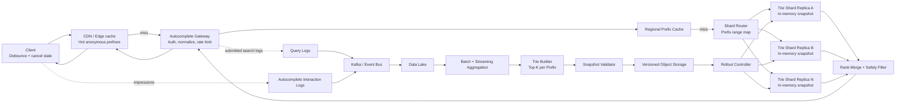
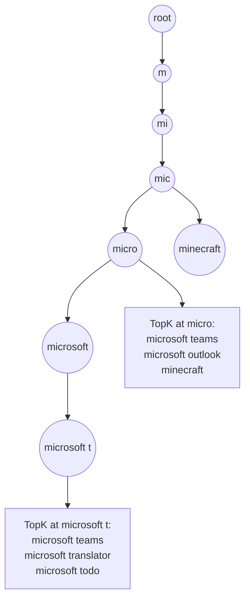
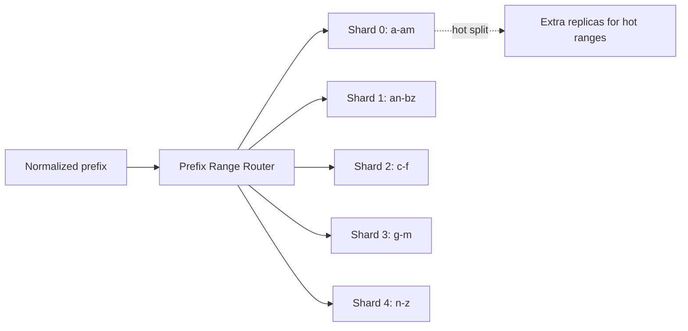
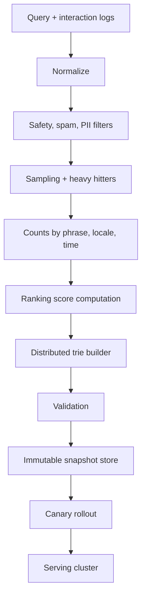
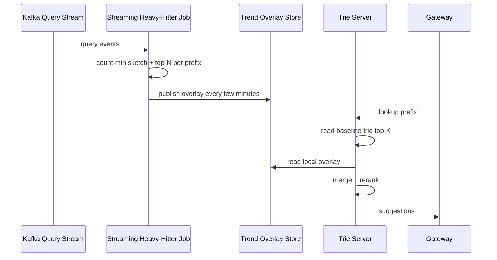
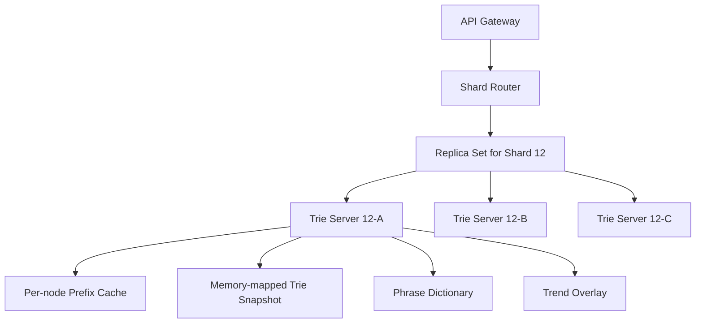
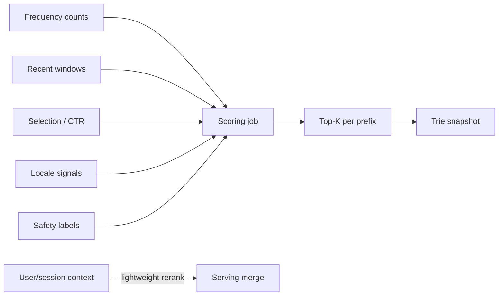
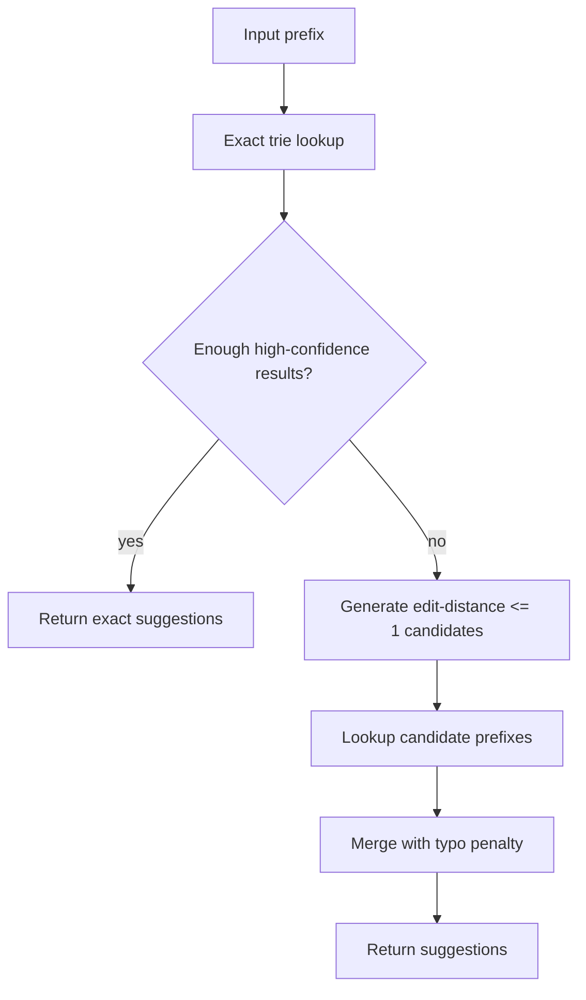

# Search Autocomplete / Typeahead System — High-Level Design

## 1. Problem Statement & Scope

Design a Google-like search autocomplete system that returns likely query completions while a user types a prefix.

The system must feel instantaneous, safe, globally available, and relevant across locales.

The central design choice is to precompute top-K completions at each trie node so online lookup is O(prefix length + K), not O(corpus size).

The online path is intentionally read-only and memory-resident.

The write path is an offline/nearline data pipeline that aggregates query logs, ranks phrases, builds immutable trie snapshots, and rolls them out safely.

### In scope

- Prefix autocomplete for web and mobile clients.
- Top-K suggestions for normalized query prefixes.
- Popularity, recency, locale, language, and safety-aware ranking.
- Optional personalization and typo tolerance as stretch features.
- Query-log ingestion, aggregation, sampling, trie building, validation, and rollout.
- Distributed in-memory trie serving cluster sharded by prefix ranges.
- Edge, gateway, and node-level caching for hot prefixes.
- Operational controls: canary, rollback, emergency blocklist, observability, throttling.

### Out of scope

- Full web search retrieval and ranking.
- Crawling, indexing documents, and result-page generation.
- Ads, sponsored suggestions, monetization, and bidding.
- Voice recognition or OS keyboard prediction.
- Rich UI rendering beyond suggestion payloads.
- Guaranteeing that a brand-new query appears globally immediately.

### Assumptions

- 5B submitted searches per day.
- Each search produces about 4 debounced autocomplete requests.
- Clients debounce keystrokes and cancel stale requests.
- Suggestions are short phrases, commonly 2–6 words and about 25 characters.
- The serving corpus is aggressively filtered to around 50M high-quality safe phrases.
- Batch snapshots may be hours old; trend overlays may be minutes old.
- Availability and p99 latency are more important than exact real-time counts.

### Goals

- p50 end-to-end latency under 20 ms inside a region.
- p99 end-to-end latency under 100 ms, ideally under 50 ms for hot prefixes.
- Scale to hundreds of thousands of average QPS and hundreds of thousands to millions at peak.
- Keep the serving tier horizontally scalable and stateless except for loaded snapshots.
- Allow safe immutable snapshot rollout and quick rollback.
- Support locale-specific corpora and ranking.

### Non-goals

- Strong consistency for query frequencies.
- Synchronous updates to the trie on every query.
- Full fuzzy search over all phrases on every request.
- Storing raw user query text in online serving nodes.

---

## 2. Functional Requirements

### Core requirements

1. Accept a text prefix and return top K ranked completions.

2. Support K values such as 5, 10, and 20 with a safe maximum.

3. Rank suggestions using frequency, recency, selection rate, locale, language, and safety.

4. Normalize prefixes consistently across ingestion and serving.

5. Return low-latency results for every debounced keystroke request.

6. Return empty results or fallback suggestions for unknown prefixes.

7. Log impressions, selected suggestions, submitted queries, cache status, and latency.

8. Support safety blocks and policy suppression.

9. Support per-locale and per-region suggestion corpora.

10. Support immutable snapshot versioning and rollback.

### Client behavior

- Debounce input for roughly 50–150 ms before sending a request.
- Avoid network calls for extremely short prefixes unless configured.
- Cancel in-flight requests or ignore responses for older prefixes.
- Cache recently requested prefixes within the session.
- Render suggestions only if the response prefix matches the latest typed prefix.
- Back off when the API returns 429 or 503.

### Administrative behavior

- Trust-and-safety can block exact phrases immediately.
- Ranking teams can update scoring weights through configuration.
- Data teams can replay logs and rebuild snapshots.
- Operators can canary, promote, or rollback snapshot versions.
- Experiments can compare ranking policies and cache behavior.

### Stretch requirements

- Personalize by boosting recent or interest-relevant suggestions.
- Use privacy-preserving user context rather than raw history where possible.
- Correct minor typos when exact-prefix results are weak.
- Support trending suggestions within minutes through a small overlay.

---
## 3. Non-Functional Requirements

### Latency targets

| Path | Target | Notes |
|---|---:|---|
| Edge cache hit | 5–15 ms | Best case for globally hot anonymous prefixes. |
| Gateway cache hit | 10–25 ms | Regional hot-prefix cache. |
| Trie server lookup | 2–10 ms | In-memory traversal and top-K decode. |
| End-to-end p50 | <20 ms | Regional request path. |
| End-to-end p99 | <100 ms | Includes network, retries, cache misses. |
| Hot-prefix p99 goal | <50 ms | Achieved with edge/gateway caching. |

### Availability and durability

| Component | Target | Notes |
|---|---:|---|
| Public autocomplete API | 99.99% | Search submission should still work if suggestions fail. |
| Regional serving cluster | 99.95% | Multi-AZ replicas. |
| Offline build pipeline | 99.5% | Can miss a run without user-facing outage. |
| Nearline overlay pipeline | 99.9% | Affects freshness only. |
| Snapshot store | 11 9s durability | Object storage with versioned artifacts. |

### Consistency and freshness

- Serving suggestions are eventually consistent with query logs.
- Batch snapshots can be hours old.
- Nearline trend overlays can be minutes old.
- A single serving node must not mix trie, dictionary, and score files from different snapshot versions.
- Different replicas may serve different versions briefly during rollout.
- Safety blocklists require much faster propagation than normal ranking updates.

### Security and privacy

- Encrypt traffic in transit and logs/snapshots at rest.
- Keep raw query logs in restricted data stores, not in serving memory.
- Use anonymized or aggregated signals for global popularity.
- Filter sensitive, unsafe, and low-diversity phrases before serving globally.
- Apply k-anonymity or minimum unique-user thresholds for new suggestions.
- Allow personalization to be disabled or done via privacy-preserving tokens.

### Operability

- Every snapshot has a version, checksum, input log range, ranking config, and safety config.
- Serving nodes expose loaded shard IDs, snapshot version, memory usage, and health.
- Dashboards track QPS, p50/p95/p99, cache hit rate, no-result rate, timeout rate, overlay age, and safety suppressions.
- Rollouts are canary-first with automatic rollback triggers.

---

## 4. Back-of-the-Envelope Estimation

The README convention is used: 1 day ≈ 86,400 s ≈ 10^5 s.

### Traffic and QPS

| Metric | Arithmetic | Result |
|---|---:|---:|
| Submitted searches/day | given | 5B/day |
| Autocomplete calls/search | debounced assumption | 4 |
| Autocomplete requests/day | 5B × 4 | 20B/day |
| Average QPS | 20B / 10^5 | 200K QPS |
| Peak QPS | 200K × 3 | 600K QPS |
| Trie QPS at 60% cache hit | 600K × 40% | 240K peak |
| Trie QPS at 80% cache hit | 600K × 20% | 120K peak |
| Trie QPS at 90% cache hit | 600K × 10% | 60K peak |

### Bandwidth

| Item | Arithmetic | Result |
|---|---:|---:|
| Average response size | headers + K=10 JSON | ~2 KB |
| Average response egress | 200K QPS × 2 KB | ~400 MB/s |
| Peak response egress | 600K QPS × 2 KB | ~1.2 GB/s |
| Average request body | prefix + context | ~100 B |
| Peak request body ingress | 600K × 100 B | ~60 MB/s |

### Corpus assumptions

| Metric | Assumption | Reasoning |
|---|---:|---|
| Raw unique historical queries | 1B | Large global long tail. |
| Safe useful phrases | 200M | After normalization, dedupe, spam, and safety filters. |
| Serving corpus | 50M | Keep high-quality phrases in memory. |
| Average phrase length | 25 chars | Short query phrases. |
| Logical trie nodes | 300M | Compact prefix sharing estimate. |
| Top-K per useful node | 10 | Typical UI size. |
| Shard count | 256–4096 | Depends on locale and traffic skew. |

### Trie memory arithmetic

| Component | Arithmetic | Estimate |
|---|---:|---:|
| Compact node structure | 300M nodes × 32 B | 9.6 GB naive |
| Radix/FST compression savings | 30–60% | 4–10 GB structural |
| Top-K entry | suggestion_id 4 B + score/flags 4 B | 8 B |
| Top-K list | 10 × 8 B | 80 B/node |
| Nodes storing top-K | 40% × 300M | 120M nodes |
| Top-K arrays | 120M × 80 B | 9.6 GB |
| Phrase text | 50M × 40 B rounded | 2 GB |
| Phrase metadata | 50M × 16 B | 0.8 GB |
| Full serving corpus | structure + top-K + dictionary + metadata | 20–30 GB |
| Double-buffer rollout | 2 × 20–30 GB | 40–60 GB |
| Three replicas | 3 × corpus memory | 120–180 GB cluster memory |

### Server sizing

| Step | Arithmetic | Result |
|---|---:|---:|
| Conservative peak trie QPS | from 60% cache hit | 240K QPS |
| Safe capacity/server | assumption | 20K QPS |
| Primary servers | 240K / 20K | 12 |
| Replication factor | 12 × 3 | 36 |
| Headroom | 36 × 2 | ~72 servers |

### Log and storage estimate

| Data | Arithmetic | Result |
|---|---:|---:|
| Submitted query logs | 5B × 500 B | 2.5 TB/day |
| Autocomplete interaction logs | 20B × 200 B | 4 TB/day |
| Raw daily logs | 2.5 + 4 | 6.5 TB/day |
| Compressed logs | 6.5 / 3 | ~2.2 TB/day |
| One year with RF=3 | 2.2 TB × 365 × 3 | ~2.4 PB |

### Estimation takeaways

- The service is massively read-heavy.
- Cache hit rate is the main QPS reduction lever.
- Top-K arrays dominate memory but buy predictable p99 latency.
- Build and aggregation costs are high but off the user-facing path.
- Immutable snapshots are feasible in memory when sharded and replicated.

---
## 5. API Design

Use REST for client-facing APIs and gRPC internally between gateway and trie servers.

Autocomplete is request/response, so WebSockets are unnecessary.

### Public endpoint

| Method | Path | Purpose |
|---|---|---|
| GET | `/v1/autocomplete` | Return ranked suggestions for a prefix. |

### Request parameters

| Parameter | Type | Required | Notes |
|---|---|---:|---|
| `prefix` | string | Yes | Raw typed prefix. |
| `k` | integer | No | Default 10, max 20. |
| `locale` | string | No | Example: `en-US`. |
| `lang` | string | No | Language hint. |
| `region` | string | No | Market/geo hint. |
| `session_id` | string | No | Anonymous telemetry and abuse control. |
| `user_context_token` | string | No | Optional personalization token. |
| `include_debug` | boolean | Internal | Requires privileged auth. |

### Example request

`GET /v1/autocomplete?prefix=micro&k=10&locale=en-US&region=US`

Headers:

- `Accept: application/json`
- `X-Request-Id: req-123`
- `X-Client-Version: web-2026.08`

### Response schema

| Field | Type | Description |
|---|---|---|
| `request_id` | string | Trace identifier. |
| `normalized_prefix` | string | Prefix used for lookup. |
| `suggestions` | array | Ranked suggestion objects. |
| `snapshot_version` | string | Trie/overlay version served. |
| `cache_status` | string | `edge_hit`, `gateway_hit`, `node_hit`, or `miss`. |
| `ttl_ms` | integer | Client cache hint. |

### Suggestion object

| Field | Type | Description |
|---|---|---|
| `text` | string | Display suggestion. |
| `type` | string | `query`, `entity`, or `navigation`. |
| `score` | float | Optional normalized score. |
| `highlight_ranges` | array | Optional UI highlighting metadata. |
| `source` | string | `global`, `trending`, `personalized`, or `editorial`. |

### Example response

```json
{
  "request_id": "req-123",
  "normalized_prefix": "micro",
  "suggestions": [
    {"text": "microsoft teams", "type": "query", "score": 0.98, "source": "global"},
    {"text": "microsoft outlook", "type": "query", "score": 0.93, "source": "global"},
    {"text": "microsoft word online", "type": "query", "score": 0.89, "source": "global"}
  ],
  "snapshot_version": "en-us-2026-08-05-00",
  "cache_status": "gateway_hit",
  "ttl_ms": 30000
}
```

### Error handling

| Status | Meaning | Client behavior |
|---|---|---|
| 400 | Invalid prefix or K too large | Do not retry. |
| 401/403 | Unauthorized debug/personalization | Retry without privileged fields. |
| 429 | Rate limited | Back off and debounce harder. |
| 500 | Server error | Retry once if prefix still current. |
| 503 | Serving unavailable | Use stale/local fallback or hide suggestions. |

### API rules

- Maximum raw prefix length: 100 characters.
- Maximum normalized lookup prefix length: 50 characters.
- Minimum prefix length: usually 1 or 2 characters by market.
- K must be between 1 and 20.
- Prefix normalization includes Unicode normalization, case folding, whitespace collapse, and control-character removal.
- Cache keys include normalized prefix, locale, region bucket, K, and personalization segment if used.
- Pagination is unnecessary because K is bounded.
- Reads are idempotent, although results can change across snapshot versions.

### Internal gRPC methods

| RPC | Purpose |
|---|---|
| `Lookup(prefix, k, context)` | Return top suggestions and serving version. |
| `Health()` | Return readiness, shard IDs, and loaded snapshot versions. |
| `WarmPrefix(prefixes)` | Pre-warm node or gateway caches. |
| `LoadSnapshot(version)` | Asynchronously load a new artifact. |

---

## 6. Data Model & Schema

### Storage overview

| Data | Storage engine | Why |
|---|---|---|
| Raw query logs | Append-only object storage/data lake | Cheap, durable, replayable. |
| Streaming events | Kafka/Pulsar | High-throughput ordered ingestion. |
| Aggregated counts | Columnar lake tables | Efficient group-by analytics. |
| Heavy hitters | Analytical table/KV | Builder input and trend overlay. |
| Trie snapshots | Versioned object storage | Immutable artifacts and rollback. |
| Serving trie | In-memory compact arrays/FST/radix trie | Ultra-low latency. |
| Gateway cache | Redis or in-process cache | Hot-prefix absorption. |
| Safety blocklist | Strong config KV | Fast emergency suppression. |

### Raw query log event

| Field | Type | Notes |
|---|---|---|
| `event_id` | UUID | Deduplication. |
| `event_time` | timestamp | User action time. |
| `ingest_time` | timestamp | Pipeline arrival time. |
| `query_text` | string | Restricted raw value. |
| `normalized_query` | string | Aggregation key. |
| `locale` | string | Market. |
| `region` | string | Coarse geography. |
| `language` | string | Detected or declared language. |
| `device_type` | string | Web, mobile, tablet. |
| `session_id_hash` | string | Privacy-preserving session. |
| `clicked_result` | boolean | Quality signal. |
| `safe_search_mode` | string | Policy context. |

### Autocomplete interaction event

| Field | Type | Notes |
|---|---|---|
| `request_id` | string | Joins request and response telemetry. |
| `prefix` | string | Raw typed prefix. |
| `normalized_prefix` | string | Serving key. |
| `suggestions_shown` | array<int> | Suggestion IDs. |
| `selected_suggestion_id` | int nullable | Acceptance signal. |
| `position_selected` | int nullable | Ranking feedback. |
| `latency_ms` | integer | Client-observed latency. |
| `cache_status` | string | Edge/gateway/node/miss. |
| `snapshot_version` | string | Served version. |

### Aggregated phrase count table

| Field | Key/index | Notes |
|---|---|---|
| `normalized_phrase` | hash key | Phrase identity. |
| `locale` | partition | Locale-specific counts. |
| `region` | partition | Regional relevance. |
| `time_bucket` | partition | Hourly/daily windows. |
| `count` | metric | Frequency. |
| `selected_count` | metric | Autocomplete acceptances. |
| `unique_users_estimate` | HLL sketch | Abuse-resistant popularity. |
| `last_seen_at` | index | Recency. |
| `safety_status` | filter | Allowed, blocked, review. |

### Phrase dictionary

| Field | Type | Notes |
|---|---|---|
| `suggestion_id` | integer | Dense ID stored in trie. |
| `display_text` | string | Returned to clients. |
| `normalized_text` | string | Canonical text. |
| `locale` | string | Primary locale. |
| `language` | string | Primary language. |
| `category` | string | Query/entity/navigation. |
| `global_score` | float | Offline base score. |
| `recency_score` | float | Decayed recent score. |
| `safety_flags` | bitset | Serving-time suppression. |
| `version` | string | Snapshot version. |

### Trie node logical schema

| Field | Type | Notes |
|---|---|---|
| `node_id` | integer | Dense array index. |
| `edge_label` | bytes/string | Radix-compressed segment. |
| `children_start` | integer | Offset into child array. |
| `children_count` | short | Number of children. |
| `topk_start` | integer | Offset into top-K array. |
| `topk_count` | byte | Usually K, sometimes fewer. |
| `terminal_suggestion_id` | int nullable | If prefix is a full phrase. |
| `flags` | bitset | Terminal, language, safety metadata. |

### Snapshot manifest

| Field | Purpose |
|---|---|
| `snapshot_version` | Immutable artifact ID. |
| `created_at` | Build completion time. |
| `source_log_range` | Input log interval. |
| `locale` | Market/language. |
| `shard_count` | Routing metadata. |
| `builder_version` | Code lineage. |
| `ranking_config_version` | Score lineage. |
| `safety_config_version` | Policy lineage. |
| `checksum` | Integrity validation. |
| `validation_status` | Promotion gate. |

### Schema decisions

- Serving trie stores suggestion IDs rather than strings.
- Phrase text and metadata are stored in a dictionary bound to the same snapshot.
- Raw logs are not required by online serving.
- Safety is applied before build and again at serving time.
- All artifacts are versioned for traceability and rollback.

---

## 7. High-Level Architecture



### Online path

1. Client sends the latest debounced prefix.

2. Edge cache serves very hot anonymous prefixes if possible.

3. Gateway normalizes, validates, rate-limits, and checks regional cache.

4. Router maps prefix range and locale to a shard replica set.

5. Trie server traverses memory-resident structures and returns top-K IDs.

6. Rank merge applies safety, trend overlay, and lightweight context.

7. Gateway returns JSON and logs telemetry asynchronously.

### Offline path

1. Submitted queries and autocomplete interactions flow to Kafka.

2. Logs are written to a data lake partitioned by time, region, and product.

3. Batch jobs normalize, filter, sample, dedupe, and aggregate counts.

4. Ranking jobs compute base scores and select the serving corpus.

5. Trie builders construct shard artifacts with top-K lists at each prefix node.

6. Validators run golden-query, safety, size, checksum, and latency checks.

7. Rollout controller canaries, promotes, or rolls back immutable snapshots.

### Why this architecture works

- The read path is memory-only and short.
- The build path is decoupled from serving traffic.
- Immutable snapshots reduce corruption risk.
- Cache layers absorb hot-prefix skew.
- Prefix sharding provides predictable routing.
- Trend overlays improve freshness without mutable core tries.

---
## 8. Deep Dives

### A. Trie data structure with precomputed top-K

The trie is the crux of the design.

Each node represents a normalized prefix.

Each node stores a precomputed top-K list for that prefix.

Lookup traverses characters or radix-compressed edge labels and returns the list at the reached node.

The request does not scan descendants.

This makes latency proportional to prefix length, not to the number of phrases under the prefix.



### Lookup complexity

| Operation | Complexity | Notes |
|---|---:|---|
| Prefix traversal | O(P) | P is normalized prefix length. |
| Return candidates | O(K) | K is small and bounded. |
| Full lookup | O(P + K) | Independent of corpus size. |
| Descendant scan alternative | O(number of descendants) | Rejected for hot prefixes. |

### Why top-K at every useful node?

For a prefix such as `a`, `how`, or `weather`, the descendant set can contain millions of phrases.

Computing top suggestions at query time would require scanning or querying a large candidate set.

Precomputation shifts this cost to offline builders.

Online servers only decode a compact array of suggestion IDs.

This is the memory-for-latency trade-off that makes the design viable.

### Building top-K lists

For every candidate phrase:

1. Normalize the phrase.

2. Compute the phrase score.

3. Insert the phrase path into the trie.

4. Visit each prefix node on the path.

5. Merge the phrase into that node's bounded top-K list.

6. Keep only K highest-scoring suggestions.

If 50M phrases average 25 characters, a naive build performs about 50M × 25 = 1.25B prefix visits.

That is too heavy for one machine but reasonable for distributed shard builders.

### Memory optimizations

- Store dense integer suggestion IDs instead of strings.
- Store display strings once in a phrase dictionary.
- Use radix-compressed edges instead of one object per character.
- Store top-K only for prefixes with traffic or enough completions.
- Use smaller K for deep or cold prefixes.
- Deduplicate identical top-K arrays across adjacent nodes.
- Quantize scores to 8 or 16 bits.
- Use memory-mapped immutable arrays for fast loading.

### Prefix sharding



Single-letter sharding is simple but imbalanced.

Observed-QPS range sharding is better.

A hot range can be split into smaller ranges or replicated more heavily.

Locale-specific tries avoid mixing alphabets, normalization rules, and ranking preferences.

The shard map is versioned and distributed through a config service.

### Unicode and language handling

- Apply Unicode normalization consistently.
- Case-fold where language-appropriate.
- Collapse repeated whitespace.
- Remove invisible control characters.
- Preserve accents where they change meaning.
- Build separate corpora for major locales.
- Avoid assuming an ASCII alphabet.

### B. Building and updating the trie

The trie should not be mutated on every query.

Per-query mutation would create write hot spots at short prefixes, require locks or copy-on-write, and let spam enter suggestions too quickly.

Instead, logs are aggregated and used to build immutable snapshots.



### Batch baseline

A daily or weekly batch job computes stable popularity from large log windows.

It groups by normalized phrase, locale, region, and time bucket.

It filters unsafe phrases and applies minimum diversity thresholds.

It outputs a high-quality serving corpus with stable base scores.

### Streaming trend overlay

Trending queries need faster freshness than weekly snapshots.

A streaming job computes recent heavy hitters over sliding windows.

It publishes a compact overlay keyed by prefix and locale.

Serving nodes merge overlay candidates with baseline trie candidates.



### Rebuild versus patch trade-off

| Method | Freshness | Cost | Risk | Use case |
|---|---:|---:|---:|---|
| Weekly full rebuild | Low | Low/medium | Low | Stable global corpus. |
| Daily full rebuild | Medium | Medium | Low | Large markets. |
| Hourly partial rebuild | Medium/high | High | Medium | Selected hot locales. |
| Streaming overlay | Minutes | Medium | Medium | Trends and breaking events. |
| Per-query mutation | Instant | Very high | Very high | Rejected. |

### Snapshot validation

A snapshot must pass before production promotion.

Validation includes:

- Artifact checksum verification.
- Size and memory bounds.
- Golden-prefix quality checks.
- Safety blocklist checks.
- No-result-rate comparisons.
- Latency benchmarks.
- Shard skew checks.
- Locale coverage checks.
- Canary health checks.

### Rollout mechanics

Serving nodes double-buffer snapshots.

They load the new snapshot while the old snapshot remains active.

After load and warmup, they atomically swap the active pointer.

If error rate, latency, or quality metrics regress, the rollout controller switches back to the previous version.

### C. Serving layer

Trie serving nodes are stateless processes with local immutable shard snapshots.

The source of truth is versioned object storage.

A node can be replaced by downloading its assigned shard and loading it into memory.



### Serving request steps

1. Receive normalized prefix, locale, K, and context.

2. Check node-local hot-prefix cache.

3. Traverse compact trie edges.

4. Read top-K suggestion IDs at the prefix node.

5. Resolve IDs to display text and metadata.

6. Merge trend overlay candidates.

7. Apply emergency safety blocklist.

8. Apply lightweight contextual boosts.

9. Return suggestions with snapshot and overlay version.

### Caching hierarchy

| Layer | Key | TTL | Purpose |
|---|---|---:|---|
| Client memory | prefix + locale | 10–60 s | Avoid duplicate active-session calls. |
| CDN edge | short prefix + locale | 10–60 s | Absorb global hot prefixes. |
| Gateway cache | prefix + locale + K + segment | 5–30 s | Regional cache and personalization buckets. |
| Trie node cache | prefix + rank bucket | 1–10 s | Avoid repeated traversal/serialization. |
| Snapshot memory | immutable version | rollout lifetime | Core data structure. |

### Hot shard mitigation

- Replicate hot shards more than cold shards.
- Split hot prefix ranges dynamically.
- Cache hot short prefixes at edge.
- Pre-warm top prefixes after snapshot rollout.
- Suppress one-character prefixes during overload.
- Use adaptive load shedding for abusive clients.

### D. Ranking

Ranking blends stable popularity, recency, locale, acceptance rate, and safety.

A baseline formula is:

`score = w1*log(freq_30d) + w2*log(freq_24h) + w3*recency_decay + w4*selection_rate + w5*locale_boost - penalties`



### Ranking notes

- Frequency captures stable intent.
- Recency captures changing public interest.
- Exponential decay can weight recent counts using `exp(-age / half_life)`.
- Selection rate measures whether users actually accept the suggestion.
- Locale boosts prevent global phrases from overwhelming local needs.
- Safety blocks override all popularity signals.
- Personalization should rerank or inject a small candidate set, not build per-user tries.

### E. Typo tolerance

Typo tolerance is a stretch feature and must not slow the common path.



The system first attempts exact lookup.

Only if results are weak does it generate bounded edit-distance candidates.

Candidate generation can use keyboard adjacency, language models, or a spelling-correction service.

Corrected candidates receive a penalty so they do not dominate exact matches unexpectedly.

### F. Sampling query logs

At 5B searches/day plus 20B autocomplete interactions/day, exact processing of every signal for every job is costly.

Sampling keeps aggregation tractable while preserving heavy hitters.

| Sampling method | Pros | Cons | Use |
|---|---|---|---|
| Uniform random | Simple and unbiased for common queries | Weak for rare regional queries | Baseline estimates. |
| Stratified by locale | Preserves market coverage | More weighting complexity | Global product. |
| Heavy-hitter sketches | Cheap top-N tracking | Approximate errors | Trend and corpus selection. |
| Session sampling | Preserves behavior sequence | Can miss bursts | UX analysis. |
| Adaptive sampling | Focuses on new spikes | Operationally complex | Breaking trends. |

Practical plan:

- Keep exact counts for phrases already in the serving corpus.
- Use sketches to discover new heavy hitters.
- Apply bot filtering before sampling where possible.
- Record sampling rate with aggregates.
- Require minimum unique-user thresholds before a new suggestion is globally served.

---
## 9. Scaling/Caching/Bottlenecks

### Scaling dimensions

| Dimension | Scaling strategy |
|---|---|
| Huge read QPS | CDN, gateway cache, horizontal trie replicas. |
| Hot short prefixes | Edge TTL, prewarming, hot-shard replication. |
| Large corpus | Prefix sharding, compact trie, separate locale corpora. |
| Memory footprint | Top-K dedupe, score quantization, dense IDs. |
| Build cost | Distributed builders and early long-tail pruning. |
| Freshness | Small streaming overlay instead of full real-time mutation. |
| Regional relevance | Locale-specific ranking and fallback to global corpus. |
| Abuse/spam | Unique-user thresholds, spam classifiers, delayed promotion. |

### Read path scaling

Read traffic scales by adding replicas for each shard.

Replica count does not need to be uniform.

A hot `a*` or `how*` shard may need many more replicas than a cold prefix range.

If one replica safely handles 20K QPS and a shard receives 100K QPS at peak, run at least 5 replicas plus headroom.

### Cacheability by prefix length

| Prefix length | Traffic share | Cacheability | Notes |
|---|---:|---:|---|
| 0–1 chars | Very high | Very high | Often edge cached or suppressed. |
| 2 chars | High | High | Great CDN/gateway candidates. |
| 3–5 chars | Medium/high | Medium | Popular prefixes repeat often. |
| 6–10 chars | Medium | Low/medium | Regional cache can help. |
| 10+ chars | Low | Low | Usually direct trie lookup. |

### Client debounce impact

| Scenario | Arithmetic | Result |
|---|---:|---:|
| Physical keystrokes/search | assumption | 12 |
| Debounced calls/search | assumption | 4 |
| Traffic reduction | 12 / 4 | 3× lower QPS |
| Requests/day without debounce | 5B × 12 | 60B/day |
| Requests/day with debounce | 5B × 4 | 20B/day |

### Key bottlenecks

- Hot prefixes dominate QPS and can overload specific shards.
- Top-K arrays can dominate memory.
- Full rebuilds can be CPU and memory intensive.
- Personalized cache keys can explode cardinality.
- Cache invalidation can be expensive if actively purging every prefix.
- Spam campaigns can attempt to manipulate popularity.
- Regional phrases can be drowned out by global queries.

### Mitigations

- Cache short anonymous prefixes at CDN edge.
- Replicate and split hot shards independently.
- Store IDs, not strings, in trie nodes.
- Deduplicate top-K lists and compress edge labels.
- Use TTL and versioned cache values instead of broad active invalidation.
- Apply unique-user and source-diversity thresholds before ranking.
- Build locale-specific corpora with fallback to global suggestions.
- Disable typo correction and personalization first during overload.

---

## 10. Reliability & Consistency

### Failure scenarios

| Failure | Impact | Mitigation |
|---|---|---|
| Trie replica crash | Reduced capacity | Route to another replica. |
| Hot shard overload | High p99 or 5xx | Replicate, cache, or split hot range. |
| Bad snapshot | Wrong or unsafe results | Validation, canary, rollback. |
| Kafka lag | Freshness delay | Continue serving old snapshot. |
| Builder failure | No new artifact | Last good snapshot remains active. |
| Object store outage | Cannot load new version | Loaded snapshots keep serving. |
| Safety incident | Bad suggestion visible | Emergency blocklist pushed to serving. |
| Region outage | Users lose local service | Fail over to nearest healthy region. |

### Consistency model

The service is AP-oriented for suggestions.

Availability and latency beat immediate consistency of popularity counts.

Each server serves one internally consistent snapshot at a time.

Snapshot manifests bind trie structure, phrase dictionary, score arrays, and checksums.

Rollouts are eventually consistent across replicas and regions.

Responses include snapshot version for debugging and experiment analysis.

### Replication

| Layer | Replication strategy |
|---|---|
| Kafka | Replicated partitions across brokers. |
| Data lake | Object storage durability and cross-zone replication. |
| Snapshot store | Versioned artifacts with high durability. |
| Trie serving | Multiple replicas per shard across zones. |
| Gateway cache | Redis cluster or local fallback. |
| Edge cache | CDN multi-POP replication. |

### Timeout and fallback policy

| Operation | Timeout | Fallback |
|---|---:|---|
| Gateway to trie | 20–40 ms | Retry another replica if budget remains. |
| Overlay read | 5–10 ms | Return baseline trie only. |
| Gateway cache | 1–5 ms | Go to trie. |
| Personalization | 5–10 ms | Return global ranking. |
| Overall request | 100 ms | Return stale cache or empty list. |

### Backpressure

- Rate limit abusive clients by IP, session, and API key.
- Drop typo tolerance first.
- Drop personalization next.
- Reduce K from 10 to 5 during severe overload.
- Suppress extremely short prefixes if needed.
- Prefer stale cached responses over slow fresh responses.

### Data correctness

- Deduplicate logs by event ID where possible.
- Make aggregation jobs idempotent with deterministic output paths.
- Version ranking and safety configurations.
- Record input log ranges in snapshot manifests.
- Keep old snapshots for rollback.
- Use DLQs for malformed events.

### Privacy and compliance reliability

- Restrict access to raw query logs.
- Enforce retention limits.
- Remove PII and sensitive phrases before trie build.
- Require k-anonymity before global serving.
- Support deletion workflows in raw logs and future aggregates.
- Use emergency serving-time suppression for urgent policy issues.

---

## 11. Trade-offs & Alternatives

| Decision | Option A | Option B | Chosen | Rationale |
|---|---|---|---|---|
| Core structure | Trie with top-K per node | Prefix-indexed DB | Trie | Predictable O(prefix length) lookup. |
| Search backend | Custom trie | Elasticsearch/OpenSearch suggester | Custom trie | Better p99 and memory control at huge scale. |
| Top-K computation | Precompute per node | Compute by scanning descendants | Precompute | Avoids hot-prefix descendant scans. |
| Update strategy | Batch snapshots + overlay | Per-query mutation | Batch + overlay | Safer, cheaper, spam-resistant. |
| Freshness | Streaming overlay | Constant full rebuilds | Overlay | Small and fast trend path. |
| Sharding | Prefix ranges | Hash phrases | Prefix ranges | A prefix maps naturally to one shard. |
| Caching | Edge + gateway + node | Serving replicas only | Both | Caches absorb hot prefixes cheaply. |
| Personalization | Rerank candidates | Per-user trie | Rerank | Per-user tries are infeasible. |
| Typo tolerance | Fallback fuzzy | Always fuzzy | Fallback | Protects common-path latency. |
| Consistency | Eventual | Strong global | Eventual | Suggestions tolerate staleness. |
| Rollout | Immutable snapshots | In-place mutation | Immutable | Atomic swap and rollback. |
| Sampling | Stratified + sketches | Exact full logs always | Hybrid | Controls compute while preserving heavy hitters. |

### Rejected alternatives

- Relational database with `LIKE prefix%`: simple but poor for hot-prefix p99 and huge QPS.
- Prefix-indexed KV table: viable at medium scale but duplicates rows and still has hot-key pressure.
- General search engine only: good built-in fuzzy support but harder to control memory, routing, and tail latency at this scale.
- Per-query trie mutation: freshest but creates lock contention, hot writes, and spam exposure.
- Per-user tries: impossible memory footprint and risky privacy behavior.

---

## 12. Future Improvements

### Ranking and quality

- Train learning-to-rank models from impressions, selections, reformulations, and search success.
- Add diversity constraints so one brand or entity does not dominate all top positions.
- Tune recency half-life by category such as news, sports, evergreen, and shopping.
- Use semantic clustering to merge near-duplicate phrases.
- Add explainability tools for ranking and safety reviewers.

### Personalization and privacy

- Move more personalization to on-device reranking.
- Use differential privacy for aggregate signals.
- Support explicit user controls for recent-search suggestions.
- Use coarse interest clusters rather than raw query history.
- Apply k-anonymity thresholds before any phrase becomes globally suggestible.

### Language and typo support

- Add locale-specific keyboard adjacency and transliteration models.
- Improve tokenization for languages without whitespace boundaries.
- Support phonetic matching for selected languages.
- Use a dedicated spelling-correction service after exact lookup misses.
- Build separate evaluation sets for each major locale.

### Serving and cost

- Use FST or DAWG representations for stronger compression.
- Incrementally rebuild unchanged prefix subtrees.
- Tier cold prefixes into a slower fallback index while keeping hot prefixes in memory.
- Automate hot-shard splitting from observed QPS and p99 metrics.
- Dynamically tune cache TTL by prefix volatility.
- Add active-active multi-region traffic steering with synthetic golden-prefix probes.

### Pipeline and operations

- Add stronger data quality gates before snapshot publication.
- Track aggregate lineage for every suggestion.
- Improve bot detection before counts enter ranking.
- Support faster emergency snapshot rebuilds.
- Add chaos tests for bad snapshots, shard failures, and regional failover.
