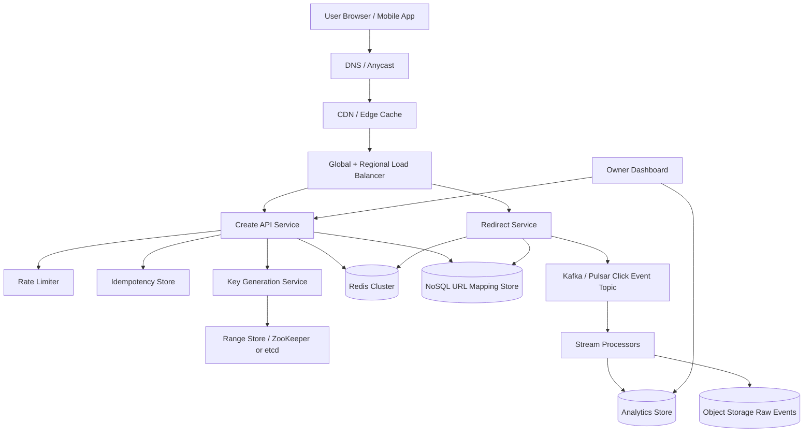
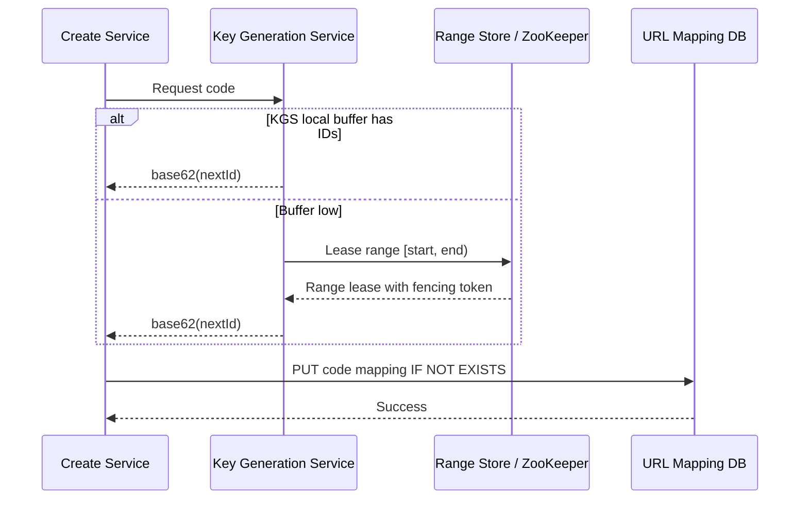
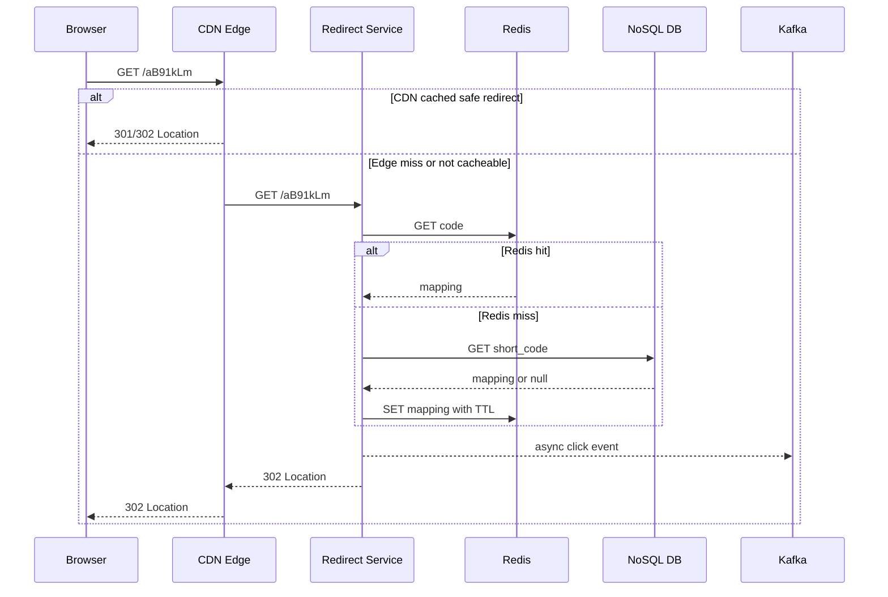
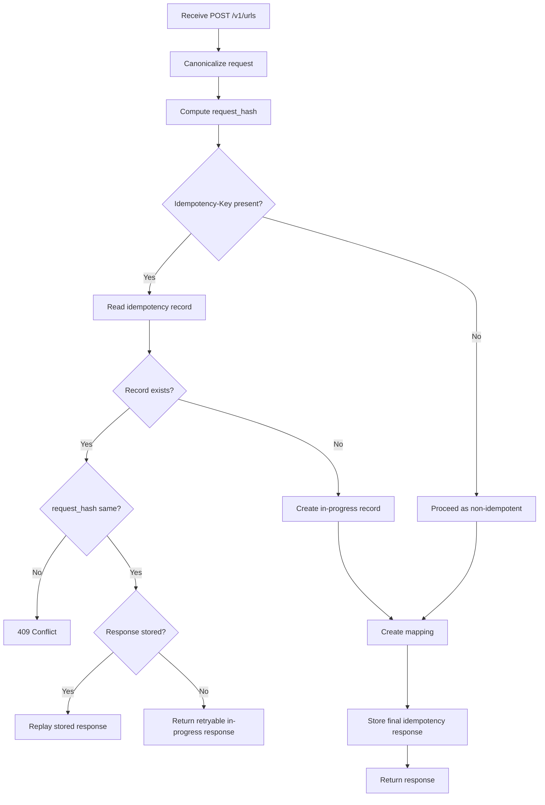
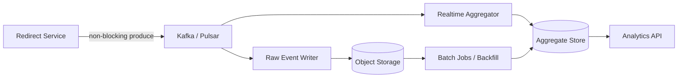

# URL Shortener HLD

## 1. Problem Statement & Scope

Design a URL shortener like TinyURL or bit.ly.

The system accepts a long URL and returns a compact short URL.

When a user opens the short URL, the system redirects to the original URL.

I will optimize for a very read-heavy workload.

I will assume public internet traffic, global users, and links that can become viral.

I will keep the write path simple and durable.

I will keep the read path extremely fast and cache-friendly.

I will design analytics as an asynchronous stretch feature so redirects are not slowed down.

Primary entities are users, short links, redirects, and click events.

The core lookup is `short_code -> long_url`.

The most important API is redirect, not creation.

The design supports custom aliases and optional expiration.

Out of scope for the first version:

- Full campaign management.
- Deep dashboard filtering across arbitrary dimensions.
- Branded domains for enterprises.
- Bulk import/export.
- Link preview rendering.
- Malware scanning implementation details.
- Billing and subscription management.

In scope for the first version:

- Create a short URL.
- Redirect a short URL.
- Support custom aliases.
- Support expiration/TTL.
- Support idempotent create requests.
- Store minimal creator metadata.
- Collect click-count analytics asynchronously.
- Scale reads using cache and CDN.
- Scale storage using a sharded KV/NoSQL store.

Key assumptions:

- 100M new short URLs per day.
- At least a 100:1 read:write ratio.
- 5-year mapping retention.
- Base62 short codes.
- Default redirects are 302.
- 301 is allowed only for immutable cache-friendly links.

Success criteria:

- Redirect p50 below 20 ms from edge/cache.
- Redirect p99 below 100 ms within a region.
- Create p99 below 300 ms.
- Redirect availability target of 99.99%.
- Successful creates are durable.

## 2. Functional Requirements

P0 requirements:

- A client can submit a long URL and receive a short URL.
- A client can optionally request a custom alias.
- A client can optionally set an expiration timestamp or TTL.
- A user opening `https://sho.rt/{code}` is redirected to the long URL.
- The redirect endpoint returns a correct status and `Location` header.
- The system rejects invalid URLs.
- The system rejects duplicate custom aliases.
- The system rejects expired short codes.
- The system supports idempotent creation retries.
- The system records creation time and owner where available.

P1 requirements:

- The system tracks total click count per short code.
- The system emits click events for analytics.
- The system supports basic metadata lookup for owners.
- The system supports soft deletion or deactivation.
- The system supports destination update for authenticated owners.
- The system supports rate limits for create requests.

P2 requirements:

- The system supports country/referrer/device analytics.
- The system supports abuse reporting.
- The system supports branded domains.
- The system supports QR code generation.
- The system supports bulk link creation.

Create flow requirements:

- Input includes long URL.
- Input may include custom alias.
- Input may include TTL or expiration time.
- Input may include idempotency key.
- Output includes short URL, code, expiration, and metadata.
- Repeated requests with the same idempotency key return the same result.

Redirect flow requirements:

- Input is short code from the URL path.
- Output is HTTP redirect when code is valid.
- Output is 404 when code does not exist.
- Output is 410 when code existed but expired or was deleted.
- Redirect must not block on analytics writes.
- Redirect should work even if analytics is degraded.

Custom alias requirements:

- Alias length has a bounded minimum and maximum.
- Alias can include base62 characters plus `-` and `_`.
- Alias is globally unique per domain.
- Alias is checked for reserved words such as `api`, `admin`, and `health`.
- Alias creation must be atomic under concurrency.

Expiration requirements:

- Expired links stop redirecting.
- Expiration is checked in cache and database.
- Expired rows may be purged asynchronously.
- Long-lived links can be retained for the configured retention period.

Analytics requirements:

- Count clicks approximately in near real time.
- Preserve raw events for a limited retention window.
- Aggregate by short code, time bucket, country, device, and referrer.
- Analytics must not affect redirect availability.

## 3. Non-Functional Requirements

Scale:

- 100M new URLs per day.
- 10B redirects per day at 100:1 read:write.
- Peak traffic around 3x average.
- 5-year mapping retention.
- Global read traffic.

Latency:

- Create p50 target: 80 ms.
- Create p99 target: 300 ms.
- Redirect p50 at CDN/cache: 10-20 ms.
- Redirect p99 after regional cache miss: under 100 ms.
- Analytics ingestion can be eventually consistent within seconds to minutes.

Availability:

- Redirect path target: 99.99% or higher.
- Create path target: 99.9% or higher.
- Analytics path target: best effort with graceful degradation.
- Redirect should continue during partial DB outages if cache has the mapping.

Durability:

- Once create succeeds, the mapping must not be lost.
- Mapping store uses replication factor 3.
- Write acknowledgement requires quorum or equivalent durable majority.
- Key-generation state must survive failures.

Consistency:

- Short code uniqueness must be strongly enforced.
- Custom alias uniqueness must be strongly enforced.
- Successful create should make the code readable immediately in the same region.
- Cross-region reads can be eventually consistent.
- Analytics is eventually consistent.

Security and abuse:

- Validate URL scheme as `http` or `https`.
- Normalize URLs before deduplication.
- Prevent internal/private destinations if policy requires.
- Rate-limit unauthenticated creators.
- Detect spam/malware asynchronously.
- Avoid leaking private creator information.

Operability:

- Track QPS, latency, errors, cache hit rate, queue lag, and DB saturation.
- Include tracing from create and redirect services.
- Provide dashboards for hot links and hot partitions.
- Alert on key-pool exhaustion.
- Alert on analytics queue lag.

## 4. Back-of-the-Envelope Estimation

I will use the repository convention that 1 day is approximately `10^5` seconds.

### Traffic and QPS

| Item | Assumption | Arithmetic | Result |
|---|---:|---:|---:|
| New URLs/day | Given | `100M/day` | `1e8 writes/day` |
| Seconds/day | Rounded | `~1e5 s/day` | `100,000 s` |
| Average write QPS | New URLs/day / seconds/day | `1e8 / 1e5` | `1,000 writes/s` |
| Read:write ratio | Given | `100:1` | `100 reads/write` |
| Redirects/day | Writes/day * 100 | `1e8 * 100` | `1e10 reads/day` |
| Average read QPS | Redirects/day / seconds/day | `1e10 / 1e5` | `100,000 reads/s` |
| Peak multiplier | Convention | `3x average` | `3x` |
| Peak write QPS | Avg write QPS * 3 | `1,000 * 3` | `3,000 writes/s` |
| Peak read QPS | Avg read QPS * 3 | `100,000 * 3` | `300,000 reads/s` |

### DAU

| Item | Assumption | Arithmetic | Result |
|---|---:|---:|---:|
| Redirects/day | From above | `10B/day` | `10,000M/day` |
| Avg redirects/user/day | Assumption | `20` | `20` |
| Redirect DAU | Redirects/day / redirects/user | `10B / 20` | `500M DAU` |
| Creator actions/day | New URLs/day | `100M/day` | `100M creates/day` |
| Avg creates/creator/day | Assumption | `5` | `5` |
| Creator DAU | Creates/day / creates/creator | `100M / 5` | `20M creator DAU` |

### Short-code capacity

Base62 uses `0-9`, `a-z`, and `A-Z`.

| Code length | Capacity arithmetic | Approx capacity | Fit for 5 years? |
|---:|---:|---:|---|
| 6 | `62^6 = 56,800,235,584` | `56.8B` | No |
| 7 | `62^7 = 3,521,614,606,208` | `3.5T` | Yes |
| 8 | `62^8 = 218,340,105,584,896` | `218T` | Yes, but longer |

| Item | Arithmetic | Result |
|---|---:|---:|
| URLs/year | `100M/day * 365` | `36.5B/year` |
| URLs/5 years | `36.5B * 5` | `182.5B` |
| 7-char utilization | `182.5B / 3.52T` | `~5.2%` |

I choose 7-character base62 codes for generated links.

### Mapping storage

| Field | Approx bytes | Notes |
|---|---:|---|
| short_code | 16 B | code plus encoding overhead |
| long_url | 500 B | average normalized URL |
| url_hash | 32 B | normalized URL hash |
| owner_id | 16 B | nullable UUID |
| created_at | 8 B | timestamp |
| expires_at | 8 B | nullable timestamp |
| status/flags | 20 B | state and metadata |
| storage overhead | 400 B | indexes, SSTable, row overhead |
| Total per row | `~1 KB` | rounded |

| Item | Arithmetic | Result |
|---|---:|---:|
| Raw storage/year | `36.5B rows * 1 KB` | `36.5 TB/year` |
| Raw storage/5 years | `36.5 TB * 5` | `182.5 TB` |
| RF=3 storage/year | `36.5 TB * 3` | `109.5 TB/year` |
| RF=3 storage/5 years | `182.5 TB * 3` | `547.5 TB` |
| Compaction/index overhead | `~30% * 547.5 TB` | `~164 TB` |
| Total provisioned storage | `547.5 + 164` | `~712 TB` |

### Analytics storage

| Item | Arithmetic | Result |
|---|---:|---:|
| Raw event size | assumption | `~500 B/event` |
| Raw click events/day | `10B * 500 B` | `5 TB/day` |
| Raw click events/year | `5 TB/day * 365` | `1.825 PB/year` |
| Raw 30-day retention | `5 TB/day * 30` | `150 TB` |
| Aggregates/day | `~1% * 5 TB` | `50 GB/day` |
| Aggregates/year | `50 GB * 365` | `18.25 TB/year` |

I keep raw events in cheap object storage for limited retention and keep aggregates longer.

### Bandwidth

| Path | Assumption | Arithmetic | Result |
|---|---:|---:|---:|
| Redirect response | headers + small body | `~1 KB` | `1 KB/read` |
| Read bandwidth avg | `100k reads/s * 1 KB` | `100 MB/s` | `~800 Mbps` |
| Read bandwidth peak | `300k reads/s * 1 KB` | `300 MB/s` | `~2.4 Gbps` |
| Create request+response | `~2 KB` | `1k writes/s * 2 KB` | `2 MB/s avg` |
| Analytics ingest avg | `100k reads/s * 500 B` | `50 MB/s` | `~400 Mbps` |
| Analytics ingest peak | `300k * 500 B` | `150 MB/s` | `~1.2 Gbps` |

### Cache sizing

I use an 80/20 rule: 20% of active links receive about 80% of redirects.

| Item | Assumption | Arithmetic | Result |
|---|---:|---:|---:|
| Active 7-day URLs | `100M * 7` | `700M` | `700M` |
| Hot 20% | `700M * 0.2` | `140M` | `140M entries` |
| Cache entry size | mapping + metadata | `~1 KB` | `1 KB` |
| Hot raw cache | `140M * 1 KB` | `140 GB` | `140 GB` |
| Redis overhead | `2x` | `140 GB * 2` | `280 GB` |
| Primary + replica | `2x` | `280 GB * 2` | `560 GB` |
| Provisioned per region | rounded | `~600 GB` | `600 GB/region` |

For 5 major regions, Redis memory is roughly `5 * 600 GB = 3 TB`.

### Server estimate

| Service | Peak QPS | Per-server capacity | Arithmetic | Needed | With headroom |
|---|---:|---:|---:|---:|---:|
| Redirect service | `300k/s` | `10k/s` | `300k / 10k` | `30` | `45-60` |
| Create service | `3k/s` | `1k/s` | `3k / 1k` | `3` | `6-10` |
| Analytics collectors | `300k/s` | `25k/s` | `300k / 25k` | `12` | `20-25` |
| KGS | `3k/s` | `5k/s` | `3k / 5k` | `1` | `3-5` |
| API gateway/LB | `303k/s` | `50k/s` | `303k / 50k` | `7` | `12-15` |

| DB sizing item | Assumption | Arithmetic | Result |
|---|---:|---:|---:|
| Peak DB reads after 95% cache hit | `300k * 5%` | `15k/s` | `15k reads/s` |
| Peak DB writes | create writes | `3k/s` | `3k writes/s` |
| Nodes for storage | `~712 TB / 8 TB usable` | `89` | `~90` |
| Provisioned NoSQL nodes | storage + headroom | rounded | `120+ globally` |

## 5. API Design

I will expose REST APIs because the public contract is simple.

Internal services can use gRPC.

### Create short URL

```http
POST /v1/urls
Idempotency-Key: 4cf5c4c8-75b3-4a91-9cfd-996ce5c0bb16
Content-Type: application/json
Authorization: Bearer <token>
```

Request:

```json
{
  "longUrl": "https://example.com/products/123?campaign=spring",
  "customAlias": "spring-sale",
  "expiresAt": "2026-12-31T23:59:59Z",
  "redirectType": 302
}
```

Response `201 Created`:

```json
{
  "code": "aB91kLm",
  "shortUrl": "https://sho.rt/aB91kLm",
  "longUrl": "https://example.com/products/123?campaign=spring",
  "expiresAt": "2026-12-31T23:59:59Z",
  "createdAt": "2026-08-05T00:52:07Z",
  "redirectType": 302
}
```

Idempotent replay response `200 OK`:

```json
{
  "code": "aB91kLm",
  "shortUrl": "https://sho.rt/aB91kLm",
  "longUrl": "https://example.com/products/123?campaign=spring",
  "expiresAt": "2026-12-31T23:59:59Z",
  "createdAt": "2026-08-05T00:52:07Z",
  "idempotentReplay": true
}
```

Failure status codes:

| Status | Meaning | Example |
|---:|---|---|
| 400 | Invalid URL or TTL | malformed URL |
| 401 | Missing/invalid auth | private account link |
| 409 | Conflict | alias already taken or idempotency key reused differently |
| 422 | Blocked by policy | malware domain |
| 429 | Rate limited | anonymous abuse |
| 500 | Internal error | dependency failure |
| 503 | Temporarily unavailable | key pool empty or DB unavailable |

Idempotency rules:

- Key is scoped to authenticated principal or anonymous client scope.
- Store canonical request hash and final response.
- Same key and same payload replays the same response.
- Same key and different payload returns `409 Conflict`.
- Records expire after 24-48 hours.

### Redirect short URL

```http
GET /{code}
```

Default successful response:

```http
HTTP/1.1 302 Found
Location: https://example.com/products/123?campaign=spring
Cache-Control: no-store
```

Permanent immutable response:

```http
HTTP/1.1 301 Moved Permanently
Location: https://example.com/products/123?campaign=spring
Cache-Control: public, max-age=3600
```

I default to `302 Found`.

Reasons:

- Many short links need analytics per click.
- Destination can be changed by the owner.
- Browsers and intermediaries cache `301` aggressively.
- A permanent redirect can bypass the service later and lose click events.

Redirect failure status codes:

| Status | Meaning |
|---:|---|
| 404 | Code never existed |
| 410 | Code expired, deleted, or disabled |
| 451 | Blocked due to legal/safety policy |
| 500 | Internal error |
| 503 | Temporary dependency issue |

### Get URL metadata

```http
GET /v1/urls/{code}
Authorization: Bearer <token>
```

Response `200 OK`:

```json
{
  "code": "aB91kLm",
  "longUrl": "https://example.com/products/123?campaign=spring",
  "status": "ACTIVE",
  "createdAt": "2026-08-05T00:52:07Z",
  "expiresAt": "2026-12-31T23:59:59Z",
  "redirectType": 302,
  "totalClicks": 123456
}
```

### Update URL

```http
PATCH /v1/urls/{code}
Content-Type: application/json
Authorization: Bearer <token>
```

Request:

```json
{
  "longUrl": "https://example.com/products/123?campaign=summer",
  "expiresAt": "2027-01-31T23:59:59Z",
  "status": "ACTIVE",
  "expectedVersion": 12
}
```

Response `200 OK`:

```json
{
  "code": "aB91kLm",
  "longUrl": "https://example.com/products/123?campaign=summer",
  "expiresAt": "2027-01-31T23:59:59Z",
  "version": 13,
  "updatedAt": "2026-08-05T01:05:00Z"
}
```

Update behavior:

- Owner authentication is required.
- Cache entry is invalidated or versioned after update.
- If using `301`, updates are dangerous because clients may cache the old destination.
- Updates use optimistic concurrency with a version field.

### Delete URL

```http
DELETE /v1/urls/{code}
Authorization: Bearer <token>
```

Response:

```http
HTTP/1.1 204 No Content
```

Delete behavior:

- Prefer soft delete by setting status `DELETED`.
- Redirect returns `410 Gone` after deletion.
- Hard deletion happens after retention windows.
- Cache invalidation is required.

### Analytics API

```http
GET /v1/urls/{code}/analytics?from=2026-08-01T00:00:00Z&to=2026-08-05T00:00:00Z&granularity=hour
Authorization: Bearer <token>
```

Response `200 OK`:

```json
{
  "code": "aB91kLm",
  "from": "2026-08-01T00:00:00Z",
  "to": "2026-08-05T00:00:00Z",
  "granularity": "hour",
  "totalClicks": 123456,
  "series": [
    { "bucketStart": "2026-08-01T00:00:00Z", "clicks": 1200 },
    { "bucketStart": "2026-08-01T01:00:00Z", "clicks": 1350 }
  ],
  "topCountries": [
    { "country": "IN", "clicks": 40000 },
    { "country": "US", "clicks": 32000 }
  ]
}
```

Pagination:

- Metadata list APIs use cursor pagination.
- Analytics APIs use time range and granularity.
- Large exports are asynchronous jobs.

## 6. Data Model & Schema

The primary access pattern is point lookup by short code.

Therefore I choose a distributed KV/NoSQL database such as DynamoDB, Cassandra, or ScyllaDB.

I will describe it using Cassandra-style terms.

### Storage engine choice

Chosen engine:

- Distributed NoSQL/KV store keyed by short code.
- LSM-tree storage is suitable for high write throughput.
- Replication across nodes and availability zones is built in.
- Horizontal sharding by partition key hash is natural.
- Point reads are fast and predictable.

Why not a single RDBMS:

- 100M writes/day and 10B reads/day are too large for a single primary.
- Vertical scaling would be expensive and fragile.
- Cross-region reads would add latency.
- The core access pattern does not need joins.
- Strong relational transactions are only needed for small metadata/idempotency areas.

### Table: url_mapping

| Column | Type | Notes |
|---|---|---|
| short_code | text | partition key |
| long_url | text | normalized destination |
| long_url_hash | bytes | hash of normalized URL |
| owner_id | uuid | nullable for anonymous links |
| domain | text | supports branded domains later |
| status | text | ACTIVE, DELETED, BLOCKED |
| redirect_type | int | 301 or 302 |
| created_at | timestamp | creation time |
| updated_at | timestamp | update time |
| expires_at | timestamp | nullable TTL/expiration |
| is_custom_alias | boolean | generated vs custom |
| version | bigint | optimistic concurrency |

Key:

```text
PRIMARY KEY ((short_code))
```

Indexes:

- Primary key index on `short_code`.
- Owner listing uses a separate table.
- TTL can use database TTL plus async cleanup.
- Avoid high-cardinality secondary indexes on the hot table.

Read pattern:

```text
GET url_mapping[short_code]
```

Write pattern:

```text
PUT url_mapping[short_code] IF NOT EXISTS
```

### Table: owner_url_by_created_at

| Column | Type | Notes |
|---|---|---|
| owner_id | uuid | partition key part |
| created_at_bucket | date | partition bucketing |
| created_at | timestamp | clustering key |
| short_code | text | clustering key |
| long_url_preview | text | truncated URL for UI |
| status | text | current status |

Key:

```text
PRIMARY KEY ((owner_id, created_at_bucket), created_at, short_code)
```

This table is denormalized and updated on create/status changes.

### Table: long_url_dedup

| Column | Type | Notes |
|---|---|---|
| owner_or_scope | text | partition key |
| long_url_hash | bytes | clustering key |
| short_code | text | canonical generated code |
| created_at | timestamp | first seen |
| expires_at | timestamp | expiration if any |
| request_policy_hash | bytes | captures TTL/custom options |

Key:

```text
PRIMARY KEY ((owner_or_scope), long_url_hash)
```

Dedup policy:

- For generated links, return existing code for same owner, normalized URL, and options.
- For custom aliases, dedup does not apply.
- Global dedup is avoided because it can leak that a private URL was shortened before.

### Table: idempotency_record

| Column | Type | Notes |
|---|---|---|
| principal_id | text | authenticated user or anonymous client scope |
| idempotency_key | text | client supplied |
| request_hash | bytes | canonical request hash |
| response_json | text | stored response |
| status_code | int | original status |
| created_at | timestamp | record creation |
| expires_at | timestamp | 24-48 hour TTL |

Key:

```text
PRIMARY KEY ((principal_id), idempotency_key)
```

### Table: key_pool

| Column | Type | Notes |
|---|---|---|
| range_id | bigint | partition key |
| start_id | bigint | inclusive numeric ID |
| end_id | bigint | exclusive numeric ID |
| assigned_to | text | KGS/app worker ID |
| state | text | FREE, ASSIGNED, EXHAUSTED |
| lease_expires_at | timestamp | recovery |
| fencing_token | bigint | stale-writer protection |

This can live in ZooKeeper, etcd, or a strongly consistent SQL table.

### Topic: click_event_log

Event schema:

```json
{
  "eventId": "01J4XYZ...",
  "shortCode": "aB91kLm",
  "timestamp": "2026-08-05T00:52:07Z",
  "country": "IN",
  "referrerHost": "social.example",
  "userAgentHash": "d5b1...",
  "ipPrefixHash": "7a9c...",
  "redirectStatus": 302
}
```

Partition key:

```text
hash(shortCode)
```

### Table: click_aggregate_by_code_hour

| Column | Type | Notes |
|---|---|---|
| short_code | text | partition key |
| bucket_start_hour | timestamp | clustering key |
| total_clicks | bigint | aggregate count |
| country_counts | map | optional top-N |
| referrer_counts | map | optional top-N |
| updated_at | timestamp | freshness |

Key:

```text
PRIMARY KEY ((short_code), bucket_start_hour)
```

### Sharding strategy

```text
partition = hash(short_code) % N
```

Why:

- Redirect lookup always has the short code.
- Hashing distributes generated codes and custom aliases.
- The short code is immutable.
- No range scans are needed on the main mapping table.

Replication:

- Replication factor 3 within a region or across availability zones.
- Optional multi-region active-active for redirect reads.
- Mutable destination updates use versions to control conflicts.

## 7. High-Level Architecture



### Component responsibilities

DNS and CDN:

- Route users to the closest healthy edge.
- Cache selected redirect responses for safe cases.
- Absorb traffic spikes for hot links.
- Provide DDoS protection and TLS termination.

Load balancer:

- Performs regional traffic routing.
- Health-checks app instances.
- Separates redirect and API traffic if needed.

Redirect service:

- Handles `GET /{code}`.
- Performs cache lookup.
- Falls back to NoSQL store on miss.
- Checks status and expiration.
- Returns `301` or `302` with `Location` header.
- Emits click event asynchronously.

Create API service:

- Handles `POST /v1/urls` and management APIs.
- Validates and normalizes long URLs.
- Enforces rate limits.
- Handles idempotency.
- Requests a code from KGS or validates custom alias.
- Writes mapping to NoSQL store.
- Warms cache after successful create.

Key Generation Service:

- Owns unique generated key allocation.
- Leases numeric ID ranges from a strongly consistent range store.
- Converts numeric IDs to base62 codes.
- Keeps a local buffer of available codes.
- Refills before exhaustion.

Redis cache:

- Stores hot `short_code -> mapping` entries.
- Uses cache-aside read pattern.
- Uses TTL based on link expiration and operational policy.
- Can store negative-cache entries for missing codes briefly.

NoSQL mapping store:

- Source of truth for URL mappings.
- Sharded by short-code hash.
- Replicated for availability and durability.
- Supports conditional insert for aliases and collision safety.

Analytics pipeline:

- Receives click events from redirect service.
- Processes events asynchronously.
- Maintains near-real-time aggregates.
- Stores raw events outside the redirect path.

### Write path walkthrough

1. Client calls `POST /v1/urls`.
2. API gateway authenticates if a token is present.
3. Create service validates URL scheme, length, domain policy, and TTL.
4. Create service canonicalizes the URL.
5. Rate limiter checks per-user and per-IP limits.
6. Idempotency store checks whether the key was already used.
7. If custom alias is present, service validates alias and reserved words.
8. If no custom alias is present, service requests a generated code from KGS.
9. Create service writes `url_mapping` with conditional `IF NOT EXISTS`.
10. If generated-code conditional write fails, service requests another code.
11. If custom-alias conditional write fails, service returns `409 Conflict`.
12. Service writes owner listing and optional dedup records.
13. Service stores idempotency response.
14. Service warms Redis with the mapping.
15. Service returns short URL.

### Read path walkthrough

1. Browser requests `https://sho.rt/aB91kLm`.
2. DNS routes to nearest CDN/edge.
3. CDN may satisfy immutable cached redirects.
4. Otherwise CDN forwards to regional load balancer.
5. Redirect service parses and validates code.
6. Redirect service checks Redis.
7. On hit, service checks status and expiration from cached metadata.
8. On miss, service reads NoSQL by `short_code`.
9. If found and active, service writes mapping to Redis.
10. If not found, service optionally writes a short negative-cache entry.
11. Service emits a click event to Kafka asynchronously.
12. Service returns `302` or `301` with `Location` header.

## 8. Deep Dives

### Deep dive A: short-code generation

The hard requirement is uniqueness at high write throughput.

The code should be compact and should not need DB retries on every request.

| Approach | How it works | Pros | Cons |
|---|---|---|---|
| Counter + base62 | Increment global integer and encode | simple, no collisions, dense space | central bottleneck, predictable codes |
| Hash long URL | Hash normalized URL and truncate | deterministic, natural dedup | collisions, privacy concerns, hard with TTL/owner semantics |
| KGS / distributed ID | Lease unique ID ranges and base62 encode | scalable, low collision risk, controllable | extra service and pool management |

I choose KGS with range leasing.

It is a distributed counter with large leased ranges.

It avoids per-request consensus.

It avoids hash collision complexity for normal generated codes.

It lets service instances generate codes locally after obtaining a range.



Range leasing details:

- Store `next_range_start` in ZooKeeper/etcd/SQL with compare-and-swap.
- Allocate ranges such as 1M IDs at a time.
- A 1M-ID range supports `1M / 3k peak writes/s = 333 s` at peak.
- Larger ranges reduce coordination but increase wasted IDs on crash.
- Wasted IDs are acceptable because 7-char base62 has 3.5T capacity.
- KGS uses fencing tokens so stale instances cannot publish duplicate ranges.
- IDs are encoded to base62 and optionally shuffled to reduce predictability.

Predictability mitigation:

- Raw counters reveal creation volume and allow enumeration.
- Apply a reversible permutation before base62 encoding.
- A Feistel network or salted bijection preserves uniqueness.
- Adjacent creations then look unrelated.

Why not pure hash:

- Five-year volume is 182.5B URLs.
- 7-character space has 3.5T buckets, but birthday collisions still become likely at large scale.
- Collision handling would require retries and DB checks anyway.
- Same URL may need different owner, TTL, campaign, or alias semantics.
- Hashing is useful for dedup/idempotency, not primary code generation.

Why not one central counter:

- It adds write latency and a single bottleneck.
- It is hard to make globally available.
- It requires consensus for every code.
- Range leasing preserves no-collision behavior with much less coordination.

### Deep dive B: redirect read path with Redis and CDN

Redirect is the highest QPS path.

It should do minimum work and avoid synchronous noncritical dependencies.



Cache-aside behavior:

- Redirect service checks Redis first.
- Redis stores active mapping plus status, expiry, redirect type, and version.
- Redis TTL is the minimum of link expiration and operational cache TTL.
- On miss, redirect service reads NoSQL and populates Redis.
- On DB miss, redirect service can negative-cache for 30-60 seconds.
- Negative caching protects DB from random-code scans.

CDN behavior:

- For default `302`, I use conservative caching or no-store to preserve analytics.
- For immutable `301`, CDN can cache longer.
- For extremely hot links, edge workers can count approximate clicks and batch events.
- CDN shields origin from viral traffic.
- CDN enforces DDoS and bot mitigation rules.

Hot-key handling:

- CDN caching is the first line of defense.
- Redis replicas can serve reads.
- Local in-process cache can store the hottest codes for seconds.
- Request coalescing prevents many concurrent DB reads on the same cache miss.
- Analytics events for hot codes can be sub-partitioned.

| Step | Cache hit target | Cache miss target |
|---|---:|---:|
| CDN/LB routing | 2-5 ms | 2-5 ms |
| App parsing/policy | 1 ms | 1 ms |
| Redis lookup | 1-3 ms | 1-3 ms |
| NoSQL lookup | 0 ms | 10-30 ms |
| Kafka enqueue | non-blocking | non-blocking |
| Response write | 1 ms | 1 ms |
| Total | `~5-15 ms` | `~20-50 ms` |

### Deep dive C: collision and idempotency for the same long URL

There are two separate problems:

- Code collision: two requests try to use the same short code.
- Semantic duplicate: the same long URL is shortened multiple times.

Generated code handling:

- KGS should not generate duplicates.
- DB still uses conditional `IF NOT EXISTS` as a safety net.
- If generated collision happens, create service discards it and retries.
- Collision count is a critical alarm.

Custom alias handling:

- Alias is the short code.
- DB conditional insert is source of truth.
- First writer wins.
- Later writers receive `409 Conflict`.
- Reserved aliases are rejected before DB write.

Idempotent create flow:



URL normalization:

- Lowercase scheme and host.
- Remove default ports.
- Normalize percent encoding where safe.
- Preserve path case because some origins are case-sensitive.
- Sort query parameters only if business accepts semantic changes.

Same-long-URL policy:

- I do not globally deduplicate anonymous URLs by default.
- Global dedup can leak whether a private URL was shortened before.
- Per-owner dedup is safer.
- If owner sends same URL and same options, returning same generated code is acceptable.
- If TTL, alias, campaign metadata, or redirect type differs, create a new mapping.

| Case | Handling |
|---|---|
| Two clients request same custom alias | Conditional insert; one success, one `409` |
| Client retries after timeout | Idempotency key replays original result |
| KGS returns duplicate due to bug | Conditional insert fails; alarm; retry |
| Same URL without idempotency key | Product policy: create new code or per-owner dedup |
| Update races with redirect | Versioned cache entry and eventual invalidation |

### Deep dive D: analytics pipeline

Analytics must not be on the synchronous redirect critical path.

If the queue is unavailable, I prefer dropping/sampling analytics over failing redirects.



Event production:

- Use an in-memory bounded buffer in redirect service.
- Produce to Kafka asynchronously.
- If buffer is full, sample or drop low-priority analytics.
- Do not block redirect beyond a tiny budget.
- Include event ID for deduplication downstream.

Stream processing:

- Partition by short code for natural aggregation.
- Aggregate counts into minute/hour buckets.
- Use exactly-once processing if framework supports it.
- Otherwise use at-least-once with idempotent event IDs or accept small overcount.
- Store aggregates in OLAP or wide-column store.

Hot analytics mitigation:

- A viral short code can create a hot Kafka partition.
- Use composite key `shortCode + randomShard` for events.
- Aggregate per shard and then merge.
- Bucket hot aggregate rows.
- Dashboard queries sum across shards.

Privacy:

- Avoid storing raw IP addresses long term.
- Store coarse geo derived at ingest.
- Hash or truncate identifiers.
- Apply retention windows.

### Deep dive E: expiration, deletion, and cache invalidation

Expiration affects every layer.

Rules:

- If `expires_at <= now`, redirect returns `410 Gone`.
- Cache entries include `expires_at`.
- Redis TTL must not exceed time until expiration.
- CDN TTL must not exceed time until expiration.
- Soft-deleted links also return `410 Gone`.

| Option | Pros | Cons |
|---|---|---|
| Delete cache on update/delete | fast correctness | needs reliable invalidation |
| Versioned cache values | safe under races | slightly larger values and logic |
| Short TTL only | simple | stale redirects until TTL expires |
| Write-through cache | fresh after writes | adds write latency and coupling |

Chosen approach:

- Use cache-aside with explicit invalidation on updates/deletes.
- Include version in mapping and cache value.
- Use short TTL for mutable links.
- Use longer TTL for immutable links.
- On expiration, rely on TTL plus DB check on miss.

## 9. Scaling, Caching & Bottlenecks

### Scaling read traffic

Read traffic is the main scale driver.

Layers:

1. Browser cache where allowed.
2. CDN edge cache for immutable or hot links.
3. Regional load balancers.
4. In-process tiny hot cache.
5. Redis distributed cache.
6. NoSQL mapping store.

Cache policy:

- Default `302`: conservative CDN cache, Redis cache enabled.
- Immutable `301`: CDN cache can be longer.
- Expiring links: TTL is capped by expiration time.
- Deleted links: invalidate Redis and CDN where possible.
- Missing codes: negative cache briefly.

Expected cache hit rates:

| Layer | Target hit rate | Notes |
|---|---:|---|
| CDN | 30-70% for hot immutable links | depends on redirect policy |
| In-process cache | 5-20% | hottest links only |
| Redis | 90-98% after CDN miss | main origin cache |
| DB | remaining misses | should be low QPS |

### Scaling write traffic

Write traffic is lower but requires correctness.

Techniques:

- Stateless create service scales horizontally.
- KGS uses local buffers and range leasing.
- NoSQL writes are sharded by short-code hash.
- Conditional inserts enforce uniqueness.
- Idempotency store prevents duplicate work on retries.
- Owner listing writes are denormalized and can be async if needed.

### Database sharding

```text
shard = hash(short_code) % shard_count
```

Properties:

- Even distribution for generated codes after permutation.
- Even distribution for custom aliases through hashing.
- No cross-shard transaction for redirect.
- Easy resharding with consistent hashing or managed NoSQL partitions.

Replication:

- RF=3 across availability zones.
- Quorum write for successful create.
- Local quorum read for DB fallback.
- Async cross-region replication for global reads.

### Hot-key bottlenecks

Hot links are likely because one social post can make one short URL viral.

Potential bottlenecks:

- CDN origin shield miss storm.
- One Redis key receiving huge QPS.
- One Kafka partition for click events.
- One analytics aggregate row receiving huge writes.

Mitigations:

- CDN cache hot redirect responses.
- Use request coalescing on cache miss.
- Use Redis replicas for reads.
- Add local in-memory cache with very short TTL.
- Split analytics events by random shard.
- Aggregate hot counters in memory and flush periodically.

### Cache stampede protection

Mechanisms:

- Singleflight/request coalescing per short code.
- Jittered TTLs to avoid synchronized expiry.
- Early refresh for hot keys.
- Negative caching for missing codes.
- Circuit breaker when DB is degraded.

### KGS bottlenecks

KGS is not on the redirect path.

It can still block creates if key buffers empty.

Mitigations:

- Each KGS node prefetches ranges.
- Create service can cache a small local code batch if trusted.
- Alarms fire when available-key buffer drops below threshold.
- Multiple KGS nodes run active-active with disjoint ranges.
- Range store uses consensus only during refills.

### Capacity growth

Scaling plan:

- Start with managed DynamoDB/Scylla/Cassandra and autoscaling partitions.
- Add regions as read traffic grows geographically.
- Increase Redis cluster shards as working set grows.
- Move analytics raw events to object storage after processing.
- Compact or archive expired links after retention.

## 10. Reliability & Consistency

### Failure modes and handling

| Failure | Impact | Mitigation |
|---|---|---|
| Redis outage | More DB reads, higher latency | bypass cache, circuit breaker, DB headroom |
| DB read outage | Cache hits work, misses fail | multi-AZ replication, fallback region, stale cache serving |
| DB write outage | Create fails | return 503, retry with idempotency |
| KGS outage | Generated creates fail after buffers drain | large buffers, multiple KGS nodes |
| Kafka outage | Analytics delayed/dropped | non-blocking buffer, DLQ, sampling/drop policy |
| CDN outage | More origin traffic | multi-CDN or direct LB fallback |
| Region outage | Regional traffic unavailable | DNS failover to healthy region |

### Consistency model

Short-code uniqueness:

- Strong consistency is required.
- Enforced by KGS range allocation and DB conditional insert.
- Custom aliases rely on conditional insert.

Mapping reads:

- Read-after-write is preferred in the creation region.
- Cross-region reads can be eventually consistent.
- Cache warming after create improves immediate success.

Updates/deletes:

- Use versioned writes.
- Invalidate cache after successful DB update.
- Redirect may see stale data briefly if invalidation fails.
- For strict links, reduce cache TTL or use stronger invalidation.

Analytics:

- Eventually consistent.
- At-least-once events may overcount slightly unless deduped.
- Dashboards show freshness timestamp.

### Availability design

- Redirect service is stateless and horizontally scalable.
- App instances run across availability zones.
- Redis runs clustered with replicas.
- NoSQL store replicates data across nodes and zones.
- Load balancers remove unhealthy instances.
- CDN absorbs traffic spikes and regional latency.

### Durability design

- Create returns success only after mapping write is durable.
- NoSQL RF=3 protects against node loss.
- Backups/snapshots protect against accidental deletion.
- Change streams can rebuild cache and derived tables.
- KGS range store uses consensus and durable snapshots.

### Backpressure

Create path:

- Rate-limit by user/IP.
- Shed anonymous low-priority traffic first.
- Return `429` or `503` with `Retry-After`.
- Protect KGS and DB from overload.

Redirect path:

- Prefer serving cached mappings.
- Use circuit breakers for DB fallback.
- Apply bot mitigation at CDN.
- Do not block on analytics.

Analytics path:

- Queue absorbs bursts.
- Stream processors autoscale by lag.
- DLQ captures malformed events.
- Sampling can be enabled for extreme hot links.

### Disaster recovery

- Multi-AZ is required for baseline.
- Multi-region active-active is ideal for redirect.
- DNS/Anycast routes to nearest healthy region.
- Mapping data is asynchronously replicated across regions.
- RPO for mappings is near zero in primary region and seconds cross-region.
- RTO for regional failover is minutes.

### Monitoring

Key metrics:

- Redirect QPS, p50, p95, p99 latency.
- Create QPS and error rate.
- Cache hit ratio by layer.
- DB read/write latency and throttling.
- KGS available key buffer.
- Conditional insert collision count.
- Kafka publish failures and queue lag.
- Analytics freshness.
- 404/410/451 rates.
- Hot key distribution.

Alerts:

- Redirect p99 above SLO.
- Cache hit rate drops sharply.
- DB throttling or quorum failures.
- KGS key buffer below threshold.
- Generated-code collision count greater than zero.
- Kafka lag exceeds threshold.
- Region health-check failures.

## 11. Trade-offs & Alternatives

| Decision | Chosen | Alternatives | Why |
|---|---|---|---|
| Redirect status | Default `302` | `301`, `307`, `308` | `302` preserves analytics and allows destination changes; `301` is better for immutable cacheable links |
| Generated code strategy | KGS with range leasing + base62 | pure hash, central counter, random code | avoids collisions and per-request consensus while scaling writes |
| Code length | 7-char base62 | 6-char, 8-char | 6-char cannot hold 5-year volume; 7-char has 3.5T capacity; 8-char is longer than needed |
| Storage engine | Distributed NoSQL/KV | single RDBMS, sharded SQL, in-memory only | point lookups and high QPS fit NoSQL; single RDBMS is a bottleneck |
| Shard key | hash(short_code) | range by code, owner_id | redirect always has code and needs even distribution |
| Cache pattern | cache-aside Redis + CDN | write-through only, DB-only | cache-aside is simple and reduces DB load; CDN handles hot links |
| Analytics | async event pipeline | synchronous DB counter | async keeps redirect latency and availability independent |
| Click count accuracy | near-real-time eventual | fully synchronous exact count | exact sync counts are too expensive on hot redirects |
| Custom alias uniqueness | DB conditional insert | pre-reserve all aliases, eventual check | conditional insert is simple and correct under concurrency |
| Same long URL handling | per-owner/idempotency dedup | global dedup, always new code | avoids privacy leaks while supporting safe retries |
| Expiration handling | cache TTL + DB check + async cleanup | immediate hard delete only | avoids stale redirects and keeps cleanup decoupled |
| Multi-region writes | regional writes with async replication | global strongly consistent writes | lower latency and complexity; uniqueness is handled before write |
| Hot-key mitigation | CDN + local cache + Redis replicas | DB scaling only | serving viral redirects from DB is inefficient and costly |
| KGS range size | large leased ranges | one ID per consensus call, huge yearly ranges | balances coordination overhead and wasted IDs on crash |
| Raw analytics storage | object storage with retention | keep forever in OLAP | raw click volume is PB/year; object storage is cheaper |
| 301 cacheability | opt-in immutable links | default all links to 301 | default 301 would hurt analytics and update semantics |
| Negative caching | short TTL for misses | no negative cache | protects DB from random-code scans without long false negatives |

## 12. Future Improvements

- Add branded domains for enterprise customers.
- Add organization/team ownership and RBAC.
- Add malware scanning and interstitial warning pages.
- Add phishing detection using reputation signals.
- Add link preview and safety metadata.
- Add bulk short-link creation APIs.
- Add campaign tags and UTM management.
- Add QR code generation and tracking.
- Add A/B destination routing.
- Add geo-based destination routing.
- Add device-based destination routing.
- Add custom expiration policies by plan.
- Add permanent immutable links with stronger CDN caching.
- Add multi-CDN failover.
- Add edge analytics batching for extremely hot links.
- Add approximate unique visitor counts with HyperLogLog.
- Add bot filtering for analytics.
- Add customer-facing analytics export jobs.
- Add GDPR/CCPA deletion workflows.
- Add link ownership transfer.
- Add audit logs for link updates and deletes.
- Add admin tools for abuse response.
- Add per-domain rate limits.
- Add adaptive rate limiting using abuse scores.
- Add cost-aware tiering for old mappings.
- Add stronger active-active multi-region conflict handling.
- Add synthetic probes for popular links.
- Add chaos testing for Redis, DB, KGS, and Kafka outages.
- Add canary deployments for redirect service.
- Add schema evolution contracts for click events.
- Add API versioning and SDKs.
- Add domain allowlists for enterprise tenants.
- Add signed private short links.
- Add password-protected links.
- Add one-time-use links.
- Add compliance retention policies.
- Add richer dashboard segmentation.
- Add anomaly detection for viral/spam links.
- Add precomputed top-N reports for owners.
- Add background compaction of expired link metadata.
