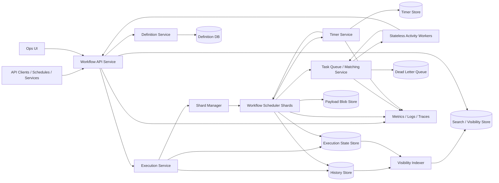
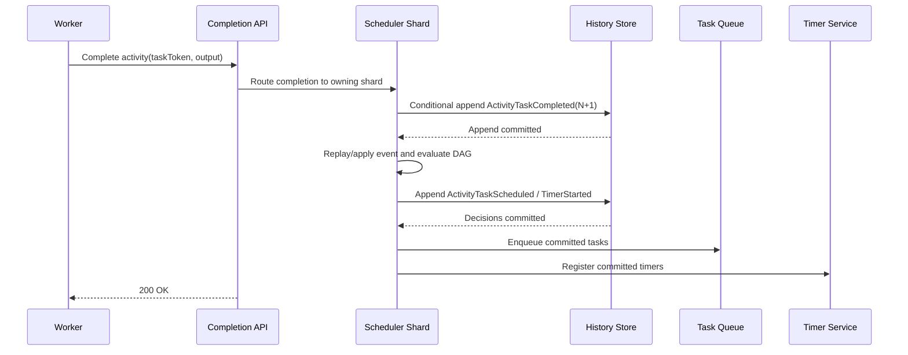
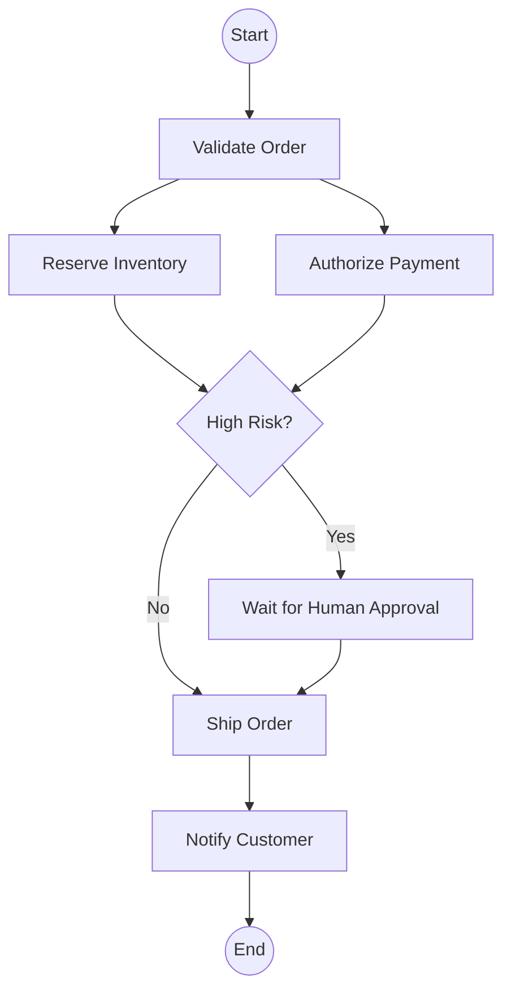
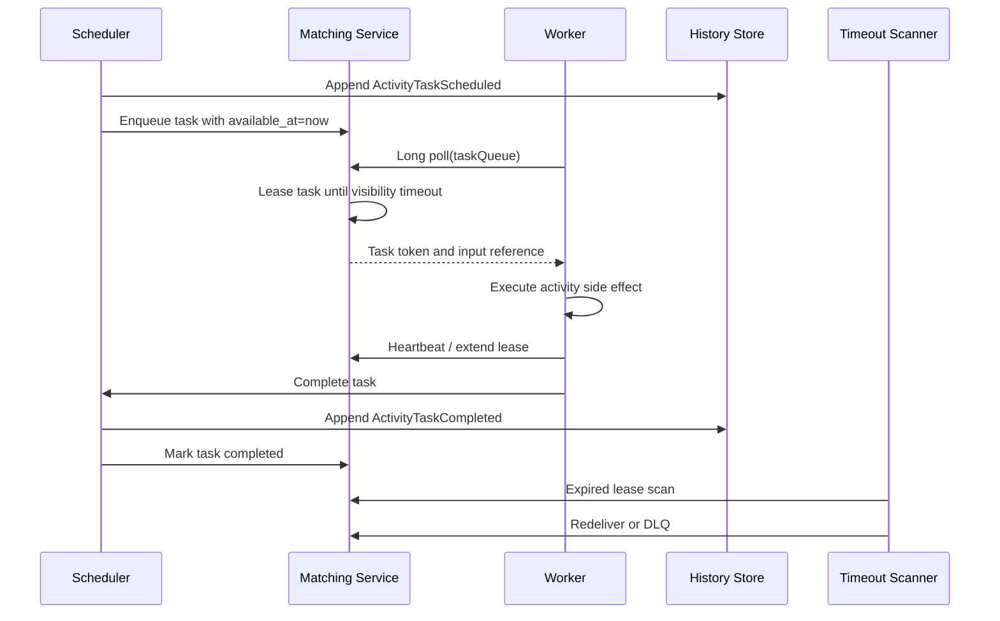
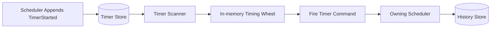
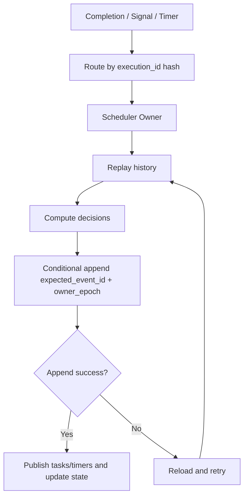

## 1. Problem Statement & Scope
Design a Workflow Engine that durably orchestrates multi-step business workflows.
The system is comparable to AWS Step Functions, Temporal, Cadence, and Airflow.
A workflow definition is a versioned DAG or state machine.
A workflow execution is one durable run of a specific definition version with input.
The engine must execute steps in dependency order and survive process, host, and worker crashes.
It must resume exactly where it left off by replaying persisted execution history.
It supports retries, timeouts, conditionals, fan-out/fan-in, human approvals, and waits lasting days.
The main challenge is durable orchestration, not merely queueing tasks.
**In scope**
- Register immutable workflow definitions and versions.
- Start workflow executions with idempotency keys.
- Execute DAG steps when dependencies are satisfied.
- Persist every workflow state transition in an append-only history log.
- Rebuild execution state by replaying history.
- Dispatch ready activities to durable task queues.
- Let stateless workers poll, heartbeat, complete, and fail tasks.
- Retry failed activities with backoff.
- Enforce step-level and workflow-level timeouts.
- Support durable timers, sleeps, and human approval waits.
- Support signals from external systems.
- Cancel, terminate, inspect, and manually retry executions.
- Query execution state and audit history.
**Out of scope**
- A full no-code visual workflow builder.
- Arbitrary untrusted code execution inside the engine.
- Complex BPMN compliance.
- Tenant billing internals.
- Data lake analytics over all historical events.
- External service implementation details.
**Core terminology**
| Term | Meaning |
|---|---|
| Workflow definition | Immutable versioned template containing steps, edges, retry policy, and timeout policy. |
| Workflow execution | Running or closed instance of one definition version. |
| Step | DAG node such as activity, branch, timer, wait, join, or child workflow. |
| Activity | Non-deterministic business work executed by workers. |
| Workflow task | Deterministic scheduler decision that advances workflow state. |
| Event history | Append-only ordered log for one execution. |
| Signal | External event delivered to a workflow, e.g., approval received. |
| Timer | Durable delayed event for sleeps, deadlines, and retry backoff. |
| Task queue | Durable queue from which workers poll activity tasks. |
**Design goals**
- Prefer correctness and debuggability over low-level micro-optimizations.
- Keep workflow progress explainable through a complete audit trail.
- Scale horizontally across independent workflow executions.
- Keep workers stateless and replaceable.
- Make duplicate task dispatch safe through idempotent activities.
- Avoid losing approvals, timers, or completed step outcomes.
**Assumptions**
- Workflow definitions are authored by trusted service teams.
- Activity workers run outside the orchestration process.
- Activity workers may call databases, payment systems, humans, or APIs.
- Large payloads are stored in blob storage and referenced from history.
- Running executions continue on the definition version they started with.
## 2. Functional Requirements
**P0 requirements**
- Users can create a workflow definition with name, version, schema, and DAG.
- Users can start an execution for a workflow name and version or alias.
- The engine validates the graph is acyclic for DAG workflows.
- The engine executes steps only when dependencies complete.
- The engine evaluates branch conditions deterministically from recorded state.
- The engine supports parallel fan-out and fan-in joins.
- The engine persists each state transition before acknowledging progress.
- The engine resumes after crash by replaying history.
- The engine dispatches activity tasks to named queues.
- Workers can poll for tasks.
- Workers can heartbeat long-running tasks.
- Workers can complete or fail tasks.
- Failed steps are retried according to per-step policy.
- Step timeouts and workflow timeouts are enforced durably.
- Timer and sleep steps survive process restarts.
- Human approval steps wait for external signals.
- Users can cancel or terminate executions.
- Users can inspect execution status and event history.
**P1 requirements**
- Definition aliases such as `payments-prod -> payment-flow:v17`.
- Pause and resume executions.
- Manual retry from failed steps where safe.
- Child workflows and reusable sub-DAGs.
- Compensation steps for saga-style rollback.
- Search by workflow name, business key, status, and time.
- Worker lease extension by heartbeat.
- Dead-letter queues for poison tasks.
- Snapshots to reduce replay latency.
- Batch backfill by starting many executions with rate control.
**P2 requirements**
- Cron and scheduled workflow starts.
- Tenant-level quotas and rate limits.
- Multi-region active-passive disaster recovery.
- Workflow definition linting in CI/CD.
- Replay testing before worker or definition rollout.
- Event export to analytics and observability systems.
**Workflow definition example**: an `order-fulfillment:v12` DAG validates the order, fans out to inventory reservation and payment authorization, joins before shipment, and conditionally waits for manual approval when risk is high.
**Important behavior**
- Starting twice with the same idempotency key returns the original execution.
- Registering an existing name and version is rejected unless content hash matches.
- Updating a workflow creates a new immutable version.
- A worker may receive the same activity task more than once.
- Activity completion is accepted only once per scheduled attempt.
- Late completion after timeout is recorded as stale or ignored.
- Workflow code must be deterministic with respect to history.
## 3. Non-Functional Requirements
**Scale targets**
| Metric | Target |
|---|---:|
| Workflow starts | 1,000,000/day |
| Average steps per workflow | 20 |
| Activity task attempts | 20,000,000+/day |
| Peak multiplier | 3x average |
| Active long-running executions | 10,000,000 |
| Average events per step attempt | 5 |
| Average event size | 1 KB |
| Workflow definition versions | 100,000 |
| Worker pollers | 100,000 |
| Hot history retention | 30 days |
| Archive retention | 1 year |
**Latency targets**
| Operation | p50 | p99 | Notes |
|---|---:|---:|---|
| Start execution | 50 ms | 250 ms | Validation plus initial append. |
| Schedule next step | 100 ms | 1 s | After dependency completion. |
| Worker poll with available task | 50 ms | 500 ms | Long-poll response. |
| Activity completion ack | 50 ms | 300 ms | Append plus wake scheduler. |
| Timer fire jitter | 1 s | 30 s | Long timers, not sub-second jobs. |
| Status query | 50 ms | 300 ms | From materialized state. |
**Availability and durability**
- Public APIs target 99.95% monthly availability.
- Worker polling targets 99.95% monthly availability.
- No acknowledged history event can be lost.
- History store uses replication factor 3.
- Task dispatch is at-least-once.
- Workflow decision transitions are exactly-once within history.
- Shard failover RTO is under 60 seconds.
- Committed history RPO is zero acknowledged events.
**Consistency**
- One workflow execution has a linear ordered history.
- Only one owner mutates a workflow execution at a time.
- Cross-workflow ordering is not guaranteed.
- Activity side effects are outside engine transactions.
- Query indexes may be eventually consistent.
- Definition versions are immutable after publish.
**Security and operations**
- Authenticate clients with OAuth/JWT or mTLS.
- Authorize definition management separately from execution operations.
- Encrypt history and payload references at rest.
- Avoid storing secrets directly in definitions.
- Emit metrics for latency, queue depth, retries, DLQ, and replay duration.
- Trace by execution id, step id, attempt id, and task queue.
## 4. Back-of-the-Envelope Estimation
**Input assumptions**
| Input | Value | Rationale |
|---|---:|---|
| Workflow starts/day | 1,000,000 | Large SaaS orchestration platform. |
| Seconds/day | 100,000 | README convention. |
| Average steps/workflow | 20 | Moderate workflow complexity. |
| Average attempts/step | 1.1 | 10% retry overhead. |
| Events/step attempt | 5 | Scheduled, started, completed/failed, timers, state updates. |
| Event size | 1 KB | Metadata plus payload references. |
| Materialized state size | 2 KB | Compact execution summary. |
| Peak multiplier | 3 | Standard burst assumption. |
**Workflow start QPS**
| Arithmetic | Result |
|---|---:|
| 1,000,000 starts/day / 100,000 s/day | 10 starts/s average |
| 10 starts/s * 3 peak | 30 starts/s peak |
Workflow starts are not the bottleneck.
The bottleneck is history appends, scheduler decisions, task polling, and timers.
**Activity execution rate**
| Arithmetic | Result |
|---|---:|
| 1,000,000 workflows/day * 20 steps/workflow | 20,000,000 logical steps/day |
| 20,000,000 steps/day / 100,000 s/day | 200 steps/s average |
| 200 steps/s * 1.1 attempts/step | 220 task attempts/s average |
| 220 attempts/s * 3 peak | 660 task attempts/s peak |
**History event write rate**
| Arithmetic | Result |
|---|---:|
| 20,000,000 steps/day * 1.1 attempts/step | 22,000,000 attempts/day |
| 22,000,000 attempts/day * 5 events/attempt | 110,000,000 events/day |
| 110,000,000 events/day / 100,000 s/day | 1,100 events/s average |
| Add 20% for signals, starts, cancellations, timers | 1,320 events/s average |
| 1,320 events/s * 3 peak | 3,960 events/s peak |
Provision the history path for about 5,000 writes/s before replication.
**History storage**
| Arithmetic | Result |
|---|---:|
| 132,000,000 events/day * 1 KB | 132 GB/day logical |
| 132 GB/day * 30 days hot retention | 3.96 TB hot logical |
| 3.96 TB * RF 3 | 11.88 TB hot physical |
| 132 GB/day * 365 days archive | 48.18 TB archive logical/year |
| 48.18 TB * RF 3 | 144.54 TB archive physical/year |
Large payloads must be stored in blob storage to avoid bloating history.
**Execution state storage**
| Arithmetic | Result |
|---|---:|
| 10,000,000 active executions * 2 KB | 20 GB logical |
| 20 GB * RF 3 | 60 GB physical |
Materialized state is small compared with history.
**Task queue and worker polling**
| Arithmetic | Result |
|---|---:|
| Task attempts average | 220 enqueue/s and 220 dequeue/s |
| Task attempts peak | 660 enqueue/s and 660 dequeue/s |
| 100,000 workers / 30 s long-poll | 3,333 polls/s |
| 3,333 polls/s * 5 reconnect storm | 16,665 polls/s |
Worker poll QPS can exceed task QPS.
Use long polling, jittered reconnects, and partitioned task queues.
**Timer volume**
| Arithmetic | Result |
|---|---:|
| 20,000,000 steps/day * 20% timeout timers | 4,000,000 timers/day |
| 20,000,000 steps/day * 10% retry timers | 2,000,000 timers/day |
| 1,000,000 workflows/day * 5% wait timers | 50,000 timers/day |
| Total timers/day | 6,050,000 timers/day |
| 6,050,000 / 100,000 s | 60.5 timers/s average |
| 60.5 * 3 peak | 181.5 timers/s peak |
Outstanding timers matter more than timer fire QPS.
If 20% of 10,000,000 active executions have timers, there are 2,000,000 open timers.
**Bandwidth**
| Flow | Arithmetic | Result |
|---|---|---:|
| History write average | 1,320 events/s * 1 KB | 1.32 MB/s |
| History write peak | 3,960 events/s * 1 KB | 3.96 MB/s |
| Replicated peak | 3.96 MB/s * RF 3 | 11.88 MB/s |
| Task descriptors peak | 660 tasks/s * 4 KB | 2.64 MB/s |
| Status reads peak | 1,000 reads/s * 2 KB | 2 MB/s |
Bandwidth is manageable; consistency and write amplification are harder.
**Shard and server sizing**
Assume one scheduler shard safely handles 100 history appends/s with headroom.
| Arithmetic | Result |
|---|---:|
| Peak history appends | 3,960 events/s |
| Shards by write throughput | 3,960 / 100 = 39.6 |
| Add 2x headroom | ~80 shards |
| Round to power of two | 128 logical shards |
| Active executions per shard | 10,000,000 / 128 = 78,125 |
| Component | Sizing assumption | Initial count |
|---|---|---:|
| API servers | 200 mixed QPS/server | 10 active + 5 spare |
| Scheduler hosts | 8 logical shards/host | 16 active + 4 spare |
| Matching hosts | 2,000 polls/s/host | 10 active + 5 spare |
| Timer hosts | 250k open timers/host | 10 active + 5 spare |
| History DB nodes | 5k writes/s and 12 TB hot RF3 | 9-15 nodes |
| Visibility nodes | Async indexing and search | 6-10 nodes |
## 5. API Design
External APIs can be REST; internal control-plane APIs can be gRPC.
All mutating APIs accept idempotency keys.
**Create workflow definition**
```http
POST /v1/workflow-definitions
Idempotency-Key: def-create-123
Content-Type: application/json
```
```json
{
  "name": "order-fulfillment",
  "version": "12",
  "definitionType": "DAG",
  "definition": { "steps": {}, "edges": [] },
  "metadata": { "owner": "orders-platform" }
}
```
**Start execution**
```http
POST /v1/workflow-executions
Idempotency-Key: tenantA:order-123:fulfillment
Content-Type: application/json
```
```json
{
  "workflowName": "order-fulfillment",
  "version": "12",
  "businessKey": "order-123",
  "input": { "orderId": "order-123" },
  "correlationId": "checkout-req-777"
}
```
**Get execution**
```http
GET /v1/workflow-executions/{executionId}
```
**List event history**
```http
GET /v1/workflow-executions/{executionId}/history?limit=100&cursor=500
```
```json
{
  "events": [
    {
      "eventId": 501,
      "type": "ActivityTaskScheduled",
      "stepId": "shipOrder",
      "timestamp": "2026-08-05T00:00:10Z"
    }
  ],
  "nextCursor": "601"
}
```
**Send signal**
```http
POST /v1/workflow-executions/{executionId}/signals
Idempotency-Key: approval:order-123:v1
```
```json
{
  "signalName": "approval",
  "payload": { "approved": true, "approvedBy": "manager-42" }
}
```
**Worker poll**
```http
POST /v1/task-queues/{taskQueue}/poll
```
```json
{
  "workerId": "worker-17",
  "capabilities": ["orders.v12"],
  "maxTasks": 1,
  "longPollSeconds": 30
}
```
Response:
```json
{
  "taskToken": "tasktok_01J",
  "executionId": "wfe_01J",
  "stepId": "reserveInventory",
  "attempt": 2,
  "inputRef": "blob://payloads/input-abc",
  "heartbeatTimeoutSeconds": 60
}
```
**Worker complete**
```http
POST /v1/activity-tasks/{taskToken}:complete
Idempotency-Key: worker-17:tasktok_01J:complete
```
```json
{
  "output": { "reservationId": "res-123" }
}
```
**Worker fail**
```http
POST /v1/activity-tasks/{taskToken}:fail
Idempotency-Key: worker-17:tasktok_01J:fail
```
```json
{
  "errorType": "InventoryUnavailable",
  "message": "Only 1 item left",
  "retryable": false
}
```
**Idempotency table**
| API | Key scope | Duplicate behavior |
|---|---|---|
| Create definition | tenant + name + version | Return existing if content hash matches. |
| Start execution | tenant + idempotency key | Return original execution id. |
| Send signal | execution + signal name + key | Append signal once. |
| Cancel execution | execution + key | Return current status. |
| Complete task | task token + attempt | Accept first valid completion only. |
| Fail task | task token + attempt | Accept first valid failure only. |
## 6. Data Model & Schema
The design separates immutable history from mutable query-optimized state.
History is the source of truth.
Execution state is a materialized view for fast reads and routing.
Large payloads are stored in blob storage.
**workflow_definitions**
| Column | Type | Notes |
|---|---|---|
| tenant_id | string | Partition boundary. |
| definition_id | string | Unique id. |
| name | string | Logical workflow name. |
| version | string | Immutable version. |
| status | enum | ACTIVE, DEPRECATED, DISABLED. |
| definition_type | enum | DAG or STATE_MACHINE. |
| definition_json | json/blob_ref | Full workflow spec. |
| content_hash | string | Duplicate detection. |
| created_by | string | Audit. |
| created_at | timestamp | Audit. |
Primary key: `(tenant_id, name, version)`.
Secondary index: `(tenant_id, definition_id)`.
**workflow_aliases**
| Column | Type | Notes |
|---|---|---|
| tenant_id | string | Partition boundary. |
| alias | string | Example: `payments-prod`. |
| name | string | Workflow name. |
| version | string | Target version. |
| updated_at | timestamp | Audit. |
Primary key: `(tenant_id, alias)`.
Alias changes affect new executions only.
**workflow_executions**
| Column | Type | Notes |
|---|---|---|
| tenant_id | string | Tenant boundary. |
| execution_id | string | Globally unique id. |
| workflow_name | string | Definition name. |
| workflow_version | string | Captured version. |
| definition_id | string | Immutable pointer. |
| business_key | string | External correlation. |
| idempotency_key | string | Start dedupe. |
| status | enum | RUNNING, WAITING, COMPLETED, FAILED, CANCELLED. |
| current_event_id | bigint | Last committed event. |
| shard_id | int | Scheduler owner shard. |
| started_at | timestamp | Start time. |
| updated_at | timestamp | Last update. |
| closed_at | timestamp | Terminal time. |
| input_ref | string | Blob or inline payload. |
| output_ref | string | Blob or inline payload. |
| state_summary | json | Materialized current state. |
Primary key: `(tenant_id, execution_id)`.
Unique index: `(tenant_id, idempotency_key)`.
Secondary index: `(tenant_id, workflow_name, status, updated_at)`.
Secondary index: `(tenant_id, business_key)`.
**workflow_history_events**
| Column | Type | Notes |
|---|---|---|
| tenant_id | string | Tenant boundary. |
| execution_id | string | Partition key. |
| event_id | bigint | Monotonic per execution. |
| event_type | string | Started, Scheduled, Completed, TimerFired, SignalReceived. |
| step_id | string | Optional step id. |
| attempt | int | Optional attempt number. |
| timestamp | timestamp | Commit time. |
| attributes | json/blob_ref | Event details. |
| request_id | string | Idempotency dedupe. |
| writer_epoch | bigint | Ownership fencing. |
Primary key: `(tenant_id, execution_id, event_id)`.
Conditional append requires `event_id = current_event_id + 1`.
**step_states**
| Column | Type | Notes |
|---|---|---|
| tenant_id | string | Tenant boundary. |
| execution_id | string | Parent execution. |
| step_id | string | DAG node id. |
| status | enum | PENDING, READY, SCHEDULED, RUNNING, WAITING, COMPLETED, FAILED, SKIPPED. |
| attempt | int | Current attempt. |
| dependencies_remaining | int | Fast readiness check. |
| input_ref | string | Payload reference. |
| output_ref | string | Payload reference. |
| error | json | Last error. |
Primary key: `(tenant_id, execution_id, step_id)`.
**activity_tasks**
| Column | Type | Notes |
|---|---|---|
| tenant_id | string | Tenant boundary. |
| task_id | string | Unique task. |
| task_queue | string | Queue partition. |
| execution_id | string | Parent execution. |
| step_id | string | Step to run. |
| attempt | int | Attempt number. |
| status | enum | AVAILABLE, LEASED, COMPLETED, EXPIRED, DLQ. |
| available_at | timestamp | Delay and retry scheduling. |
| lease_owner | string | Worker id. |
| lease_until | timestamp | Visibility timeout. |
| heartbeat_at | timestamp | Last heartbeat. |
| task_token_hash | string | Token validation. |
Primary key: `(tenant_id, task_queue, task_id)`.
Index: `(tenant_id, task_queue, status, available_at)`.
**timers**
| Column | Type | Notes |
|---|---|---|
| tenant_id | string | Tenant boundary. |
| timer_id | string | Unique timer. |
| execution_id | string | Workflow instance. |
| step_id | string | Optional step. |
| fire_at | timestamp | Durable deadline. |
| timer_type | enum | SLEEP, RETRY, ACTIVITY_TIMEOUT, WORKFLOW_TIMEOUT, SIGNAL_TIMEOUT. |
| status | enum | OPEN, FIRED, CANCELLED. |
| created_event_id | bigint | History event that created timer. |
| shard_id | int | Timer partition. |
Primary key: `(tenant_id, shard_id, fire_at, timer_id)`.
**Storage choices**
| Data | Store | Reason |
|---|---|---|
| Definitions | SQL/document DB | Small, versioned, strongly validated. |
| Execution state | Distributed SQL/strong KV | Conditional updates and fast reads. |
| History | Partitioned append-only table/log | Durable ordered replay. |
| Activity queue | Matching service or queue table | Lease and long-poll semantics. |
| Timers | Partitioned DB plus timing wheel | Durable deadlines. |
| Payloads | Blob store | Avoid large history rows. |
| Visibility | Search/OLAP index | Flexible queries, async updates. |
## 7. High-Level Architecture

**Component responsibilities**
| Component | Responsibility |
|---|---|
| Workflow API | Authentication, authorization, validation, idempotency, public endpoints. |
| Definition Service | Stores immutable versions and validates DAGs. |
| Execution Service | Starts executions and routes signals/cancellations. |
| Shard Manager | Assigns workflow ids to scheduler shards and epochs. |
| Scheduler | Replays history, computes ready steps, appends decisions. |
| History Store | Durable ordered event log per execution. |
| State Store | Materialized current state and ownership metadata. |
| Timer Service | Stores and fires durable timers. |
| Matching Service | Leases activity tasks to workers. |
| Workers | Execute business activities outside the engine. |
| Visibility Indexer | Builds async search and audit views. |
| DLQ | Holds poison tasks and workflows for operator action. |
**Start execution flow**
1. Client calls `StartWorkflowExecution` with idempotency key.
2. API authenticates and resolves workflow alias or version.
3. Definition Service returns immutable definition metadata.
4. Execution Service assigns execution id and scheduler shard.
5. Execution Service writes execution row and `WorkflowExecutionStarted`.
6. Scheduler shard is notified.
7. Scheduler replays initial history.
8. Scheduler appends schedule events for start-ready steps.
9. Matching Service exposes activity tasks to workers.
10. Workers execute tasks and report completions.
**Why this architecture works**
- Scheduler memory is disposable because history is authoritative.
- Execution state speeds reads but is not the source of truth.
- Shard ownership prevents conflicting decisions.
- Workers scale independently by task queue.
- Timer and task services are durable because workflows wait for days.
- Visibility indexing cannot block workflow progress.
## 8. Deep Dives
**A. Durable execution via event sourcing**
The event history is the source of truth for each workflow execution.
Every meaningful transition is appended before the engine acknowledges progress.
A scheduler can crash and later reconstruct state by replaying ordered events.

Common events:
- `WorkflowExecutionStarted`
- `ActivityTaskScheduled`
- `ActivityTaskStarted`
- `ActivityTaskHeartbeatRecorded`
- `ActivityTaskCompleted`
- `ActivityTaskFailed`
- `ActivityTaskTimedOut`
- `TimerStarted`
- `TimerFired`
- `SignalReceived`
- `StepSkipped`
- `WorkflowExecutionCompleted`
- `WorkflowExecutionFailed`
- `WorkflowExecutionCancelled`
Replay process:
1. Load the definition version captured at start.
2. Load events ordered by event id.
3. Initialize deterministic in-memory workflow state.
4. Apply every event to update steps, attempts, timers, and outputs.
5. Recompute which steps are ready.
6. Append only missing decisions with optimistic concurrency.
Exactly-once workflow logic comes from conditional appends.
If two schedulers race to append event `N+1`, only one succeeds.
The loser reloads history and recomputes.
Activity execution remains at-least-once because workers and queues can fail after side effects.
The platform guarantees exactly-once orchestration decisions, not exactly-once external side effects.
Activities must therefore be idempotent.
A payment activity should call the payment service with `execution_id + step_id` as idempotency key.
Workflow code must avoid nondeterminism during replay.
Current time, random values, network calls, and database reads must be represented as recorded events or activity outputs.
Snapshots reduce replay latency for long histories.
A snapshot stores last event id, step map, open timers, outputs, and deterministic variables.
Replay loads the latest snapshot and applies only the suffix.
**B. DAG scheduling and dependency resolution**
Each step has a status and dependency counter.
A step becomes ready when required upstream steps complete and its guard is true.

Scheduling loop:
```text
load history
state = replay(history)
for each pending step:
  if dependencies complete:
    if guard is true:
      append schedule/timer/wait decision
    else:
      append StepSkipped
if terminal conditions met:
  append WorkflowExecutionCompleted or WorkflowExecutionFailed
```
Fan-out happens when multiple children become ready in one decision batch.
Fan-in happens when a join waits for all required parents.
Conditional branches mark unchosen downstream-only steps as skipped.
Skipping prevents joins from waiting forever on branches that cannot run.
Step failure policy can be retry, fail workflow, ignore, error branch, compensation, or manual intervention.
**C. Task queue and workers**
Workers are stateless processes owned by service teams.
They poll named queues and execute activities matching their capabilities.

Queue semantics:
- Tasks are partitioned by tenant, task queue, and queue partition.
- Polling is long-polling to reduce empty responses.
- Leases implement visibility timeouts.
- Heartbeats extend leases for long tasks.
- Expired leases make tasks available again.
- Max-attempt exhaustion moves tasks to DLQ or fails the workflow.
The task token is opaque and includes execution id, step id, attempt, scheduled event id, lease id, expiry, and signature.
Completion is valid only for the current open attempt.
Duplicate completions return the first accepted result or a safe stale response.
**D. Timers and waits**
Timers are durable rows, not only in-memory heap entries.
The in-memory timing wheel accelerates near-term deadlines.

Timer lifecycle:
1. Scheduler appends `TimerStarted`.
2. Timer service stores an `OPEN` timer row.
3. Scanner loads near-term timers into the timing wheel.
4. At `fire_at`, timer service routes a command to the owning scheduler.
5. Scheduler conditionally appends `TimerFired`.
6. Replay advances the workflow or ignores stale timers.
Timer types include sleep, retry backoff, activity timeout, heartbeat timeout, signal timeout, and workflow timeout.
Human approval is implemented as a wait-for-signal step plus optional timeout timer.
The workflow consumes no CPU while waiting.
When approval arrives, `SignalReceived` is appended and replay completes the wait step.
If timeout wins first, the timeout branch runs.
**E. Consistency and concurrency**
The design uses one logical writer per workflow execution.
The shard manager assigns workflow ids to scheduler shards.
Each owner has a monotonically increasing epoch used for fencing.

Optimistic concurrency handles races between completions, signals, and timers.
If expected event id is stale, the append fails.
The scheduler reloads and recomputes decisions from the new history.
Fencing prevents an old scheduler from writing after failover.
An outbox pattern handles atomicity between history append and queue/timer publication.
If the scheduler crashes after appending `ActivityTaskScheduled`, a dispatcher scans unapplied events and idempotently creates queue rows.
The scheduled event id is the queue dedupe key.
## 9. Scaling/Caching/Bottlenecks
**Scaling strategy**
| Layer | Scaling method |
|---|---|
| API | Stateless horizontal scaling. |
| Scheduler | Shard by workflow execution id. |
| History | Partition by tenant and execution id. |
| Task queue | Partition by tenant, queue, and subqueue. |
| Timer service | Partition by timer shard and time bucket. |
| Visibility | Async consumers per history partition. |
| Blob store | Object storage scaling. |
**Shard key**
Use `hash(tenant_id, execution_id)` for scheduler ownership.
This evenly spreads executions and keeps one execution on one shard.
Large tenants can receive dedicated shard ranges.
**Hot workflows**
- Batch decision events where supported.
- Store large fan-out state in separate rows.
- Use child workflows for massive DAGs.
- Cap max parallelism per workflow.
- Use hierarchical joins for huge fan-in.
- Emit summaries asynchronously.
**Hot task queues**
- Split queues into multiple subqueues.
- Let workers poll multiple partitions.
- Use weighted fair scheduling by tenant.
- Apply per-queue rate limits.
- Separate latency-sensitive and batch queues.
- Auto-scale matching hosts from queue depth and poll latency.
**Caching**
| Cache | Contents | Invalidation |
|---|---|---|
| Definition cache | Immutable definitions by id/hash. | None for versions; short TTL for aliases. |
| Routing cache | execution id to shard owner. | Epoch changes. |
| Timer wheel | Near-term timers. | Durable store remains source of truth. |
| Status cache | Recent execution summaries. | Event invalidation or short TTL. |
Definitions are highly cacheable because versions are immutable.
Execution state is less cacheable because correctness depends on event history.
**Bottlenecks**
- History write throughput and per-execution append contention.
- Replay latency for very long histories.
- Worker reconnect storms.
- Timer buckets with millions of same-time deadlines.
- Visibility index lag.
- Large payload serialization in the scheduler path.
- Poison workflows repeatedly failing replay.
**Backpressure**
- Throttle workflow starts by tenant when history latency rises.
- Slow dispatch when task queues exceed depth limits.
- Enforce max open executions per tenant.
- Enforce max events per workflow or require continue-as-new.
- Apply retry budgets to avoid retry storms.
- Pause unhealthy task queues with circuit breakers.
## 10. Reliability & Consistency
**Crash recovery**
If a scheduler crashes, another scheduler obtains the shard lease.
The new owner scans active executions for the shard.
It loads snapshots and history suffixes.
It replays events and reconstructs pending tasks, timers, and waits.
Missing task rows are recreated from schedule events through the outbox dispatcher.
Open timers are recovered from the timer store.
No acknowledged transition is lost because committed history is authoritative.
**Failure scenarios**
| Failure | Impact | Recovery |
|---|---|---|
| API crash before append | Request may fail. | Client retries with same idempotency key. |
| API crash after append | Client may miss response. | Idempotency lookup returns committed result. |
| Scheduler crash after schedule event | Queue row may be missing. | Outbox recreates task. |
| Worker crash after lease | Task may be incomplete. | Lease expires and task redelivers. |
| Worker crash after side effect | Duplicate side effect possible. | Activity idempotency prevents duplication. |
| Timer service crash | Timers may fire late. | Scanner reloads durable timer rows. |
| History DB failover | Appends pause. | Retry with same expected event id. |
| Visibility outage | Search is stale. | Workflow continues; index catches up. |
**Retry policy**
Retry policy includes maximum attempts, initial interval, backoff coefficient, maximum interval, retryable errors, non-retryable errors, and schedule-to-close timeout.
| Attempt | Delay |
|---:|---:|
| 1 | 0 s |
| 2 | 10 s |
| 3 | 20 s |
| 4 | 40 s |
| 5 | 80 s |
Every retry decision is recorded in history.
This makes retries auditable and replayable.
**DLQ and poison handling**
A task becomes poison after repeated deterministic failures or non-retryable errors.
The engine can fail the workflow, pause for manual intervention, route to DLQ, execute compensation, or follow an error branch.
Operators can inspect DLQ records and choose replay, skip, patch input, or terminate.
A workflow is poison if deterministic replay itself fails.
Poison workflows are isolated from shard progress and require operator repair.
**Consistency model**
| Scope | Consistency |
|---|---|
| Single workflow history | Strong ordered append. |
| Scheduler decisions | Exactly once in history. |
| Activity execution | At least once. |
| External side effects | Exactly once only with downstream idempotency. |
| Visibility search | Eventually consistent. |
| Definition versions | Immutable and strongly consistent. |
| Cross-workflow actions | No global transaction by default. |
**Disaster recovery**
- History is synchronously replicated within a region.
- Definitions and history are asynchronously replicated cross-region.
- Active-passive DR is preferred initially.
- Failover bumps shard epochs to fence old owners.
- Timers are reconstructed from durable rows and history.
- Workers reconnect to the new region and resume polling.
- Timers may fire late but committed events remain preserved.
**Observability**
- Workflow starts/s.
- History appends/s and p99 latency.
- Scheduler replay latency.
- Activity schedule-to-start latency.
- Activity start-to-close latency.
- Queue depth by task queue.
- Worker poll success and empty poll rate.
- Timer fire lag.
- Retry rate by error type.
- DLQ size.
- Visibility index lag.
- Shard ownership changes.
## 11. Trade-offs & Alternatives
| Decision | Option A | Option B | Chosen | Reason |
|---|---|---|---|---|
| Durable state | Event sourcing and replay | Mutable snapshot only | Event sourcing + snapshots | Gives auditability, crash replay, and deterministic recovery. |
| Coordination style | Orchestration | Choreography | Orchestration | Easier retries, joins, waits, and visibility. |
| Workflow model | DAG | State machine | DAG first, support state machine | DAG is natural for dependency scheduling; state machine helps loops. |
| Dispatch | Polling workers | Push tasks | Polling | Handles worker capacity, firewalls, and backpressure. |
| Activity guarantee | At-most-once | At-least-once | At-least-once + idempotency | Avoids lost work; exactly-once side effects are unrealistic. |
| Ownership | Multi-writer | Single owner per workflow | Single owner + CAS | Simpler correctness and fewer races. |
| Timers | In-memory only | Durable table + wheel | Durable table + wheel | Survives crashes and long waits. |
| History retention | Store hot forever | Snapshot and truncate | Hot retention + archive | Balances audit, cost, and replay speed. |
| Queue backend | Kafka-like log | Matching service with leases | Matching service | Visibility timeout and polling are first-class. |
| Payload storage | Inline events | Blob references | Hybrid threshold | Keeps replay fast while supporting small payload convenience. |
| Definition updates | Mutable in-place | Immutable versions | Immutable versions | Running executions replay consistently. |
| Region mode | Active-active | Active-passive | Active-passive first | Avoids conflict resolution for workflow ownership. |
## 12. Future Improvements
- Visual designer with validation, simulation, and version diffing.
- SDKs that enforce deterministic workflow authoring and replay-safe APIs.
- CI replay tests for workflow definition and worker changes.
- Tenant-level cost attribution, quotas, and rate limits.
- Reusable child workflows and saga compensation templates.
- Cron, webhook, and event-triggered starts.
- Adaptive retry policies based on downstream health.
- Autoscaling signals for worker fleets based on queue latency.
- Rich visibility queries with custom indexed fields.
- OpenTelemetry-native traces across workflow steps and activities.
- Active-active multi-region for selected workflows after ownership routing matures.
