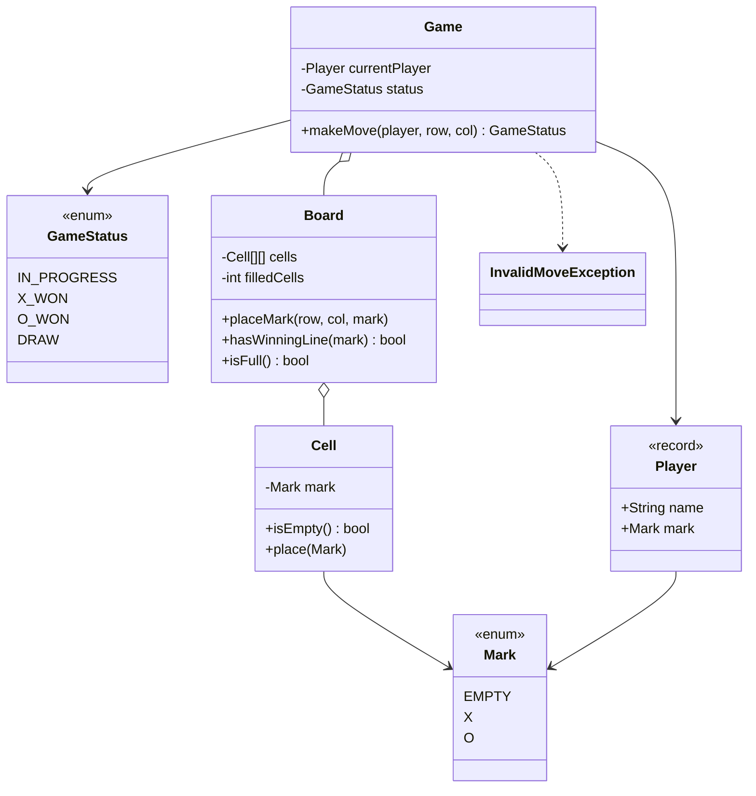
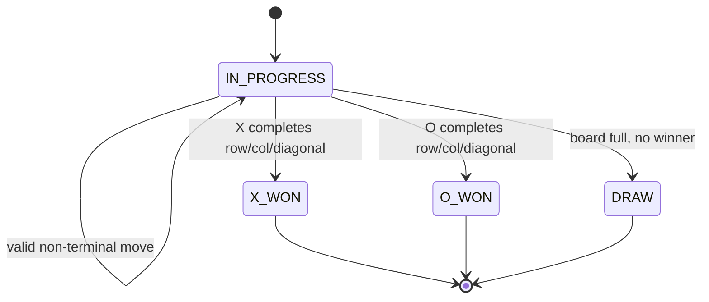

# Tic Tac Toe — LLD Machine Coding (Java)

An end-to-end MVP of a configurable NxN Tic Tac Toe game, built for an SDE2 machine-coding round.
It demonstrates clean OOP modelling, deterministic turn validation, and a small game-state engine.

> A parallel Python implementation lives in `../python` with its own README. Both produce identical
> demo output.

---

## 1. Why this MVP?

A machine-coding interviewer looks for: clean OOP, clear separation of responsibilities, correct
edge-case handling, and working tests — delivered in ~45 minutes. So the MVP is the **smallest
system that still exercises all of those**:

**In scope**
- Configurable NxN board (default 3x3)
- Two players, each owning one `Mark` (`X` or `O`)
- `makeMove(player, row, col)` validates bounds, occupancy, turn order, and terminal state
- Win detection for any full row, full column, or full diagonal
- Draw detection when the board fills with no winner
- Clear `InvalidMoveException` for rejected moves

**Deliberately out of scope** (extension points, not core learning value):
AI/minimax opponent, larger win-length variants (for example 4-in-a-row on 5x5), undo/redo, replay
storage, networked play, and UI/REST layers. Each is noted below under *Extending*.

**Thread-safety decision**
No locking is needed because this game is single-threaded and turn-based: one move is submitted,
validated, applied, and scored before the next move is accepted. Adding locks would obscure the
LLD without improving correctness for the MVP.

---

## 2. UML

### Class diagram


### Game state diagram


---

## 3. Design decisions

| Decision | Reasoning |
| --- | --- |
| **`Board` owns cells** | Keeps grid validation and winner scans in one cohesive class. |
| **`Game` owns turns/status** | Separates orchestration from board storage (Single Responsibility). |
| **Explicit `Mark.EMPTY`** | Avoids null checks and makes rendering/tests deterministic. |
| **Immutable `Player` record** | Player identity is stable and safe to compare during turn validation. |
| **Enum `GameStatus`** | Terminal states are explicit and easy to assert in tests. |
| **No locks** | A single game accepts one turn at a time; thread-safety is unnecessary for turn-based play. |
| **NxN board, same N to win** | Simple MVP rule: any complete row/column/diagonal wins. |

---

## 4. Code flow

```
Main → new Game(x, o) → Game.makeMove(player, row, col)
        → validate game still IN_PROGRESS and player is currentPlayer
        → Board.placeMark validates bounds + empty cell
        → Board.hasWinningLine / Board.isFull
        → update GameStatus or flip currentPlayer
```

Package layout:
```
com.example.tictactoe
├── model/      Mark, GameStatus, Player, Cell
├── game/       Board, Game
├── exception/  InvalidMoveException
└── Main.java   runnable demo
```

---

## 5. How to run

Prerequisites: JDK 17+ and Maven.

```powershell
cd java

# run the test suite (5 tests covering wins, draw, and invalid moves)
mvn test

# run the demo
mvn -q compile exec:java "-Dexec.mainClass=com.example.tictactoe.Main"
```

Expected demo output:
```
Starting Tic Tac Toe (3x3)
Alice places X at (0, 0)
Bob places O at (1, 0)
Alice places X at (0, 1)
Bob places O at (1, 1)
Alice places X at (0, 2)
Final status: X_WON
X X X
O O .
. . .
```

---

## 6. Tests

`TicTacToeTest` covers:
- X winning on a row
- X winning on a diagonal
- O winning on a column
- draw detection after the board fills with no winner
- invalid moves: out of bounds, occupied cell, wrong turn, and move after game over

---

## 7. Extending (what a follow-up would add)
- **AI/minimax opponent**: a strategy that chooses the next move for one player.
- **Variable win length**: allow K-in-a-row on an NxN board.
- **Undo/replay**: store a move history and rebuild board state.
- **Networked play**: put a serialized command/API layer in front of `Game.makeMove`.
