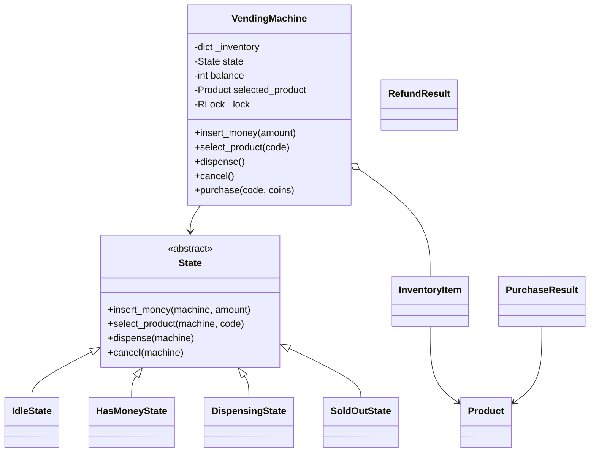
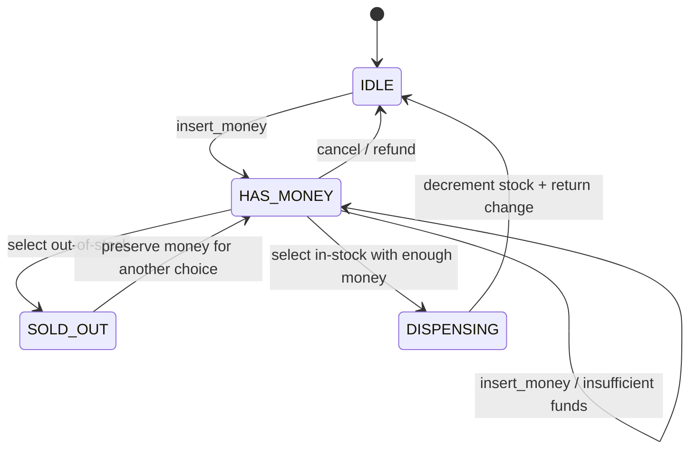

# Vending Machine — LLD Machine Coding (Python)

An end-to-end MVP of a vending machine, built for an SDE2 machine-coding round. It demonstrates
OOP modelling, the **State** pattern as the centerpiece, inventory management, greedy change-making,
and **thread-safe** purchase flow with no oversell.

> A parallel Java implementation lives in `../java` with its own README. Both produce identical
> demo output. The module structure is intentionally 1:1 between the two languages.

---

## 1. Why this MVP?

A machine-coding interviewer looks for clean OOP, one meaningful pattern, correct concurrency, and
working tests in limited time. The MVP is the **smallest vending system that still proves those**:

**In scope**
- Products with code/name/price and mutable stock.
- Accepted denominations: 1, 5, 10, 25.
- `insert_money` → `select_product` → `dispense` → greedy change → back to IDLE.
- `cancel` returns the full inserted amount.
- **State pattern**: IDLE, HAS_MONEY, DISPENSING, SOLD_OUT.
- One physical machine serves one transaction at a time using `threading.RLock`.

**Deliberately out of scope** (extension points): card payments, exact-change-only edge cases beyond
greedy change, telemetry, persistence, REST/UI, and multi-select carts.

---

## 2. UML

### Class diagram


### State transition diagram


---

## 3. Design decisions

| Decision | Reasoning |
| --- | --- |
| **State ABC + concrete states** | Removes large conditionals; each state rejects invalid operations clearly. |
| **Transient SOLD_OUT state** | Models the rejection branch without losing inserted money; customer can choose again or cancel. |
| **Product frozen dataclass, stock mutable** | Catalog data is stable; only inventory count changes. |
| **Greedy change from accepted denominations** | Keeps MVP focused and easy to reason about. |
| **`threading.RLock` around public methods** | One machine services one transaction at a time; state/balance/stock mutate atomically. |
| **Atomic `purchase` helper** | Concurrency tests model a complete customer transaction under one lock. |

### Concurrency model (the key part)
`VendingMachine` is the aggregate root and lock boundary. Every public operation acquires the
machine `RLock`, and `purchase(code, coins)` keeps it for a full customer transaction. When 50
threads race to buy the final `WATER`, exactly one reaches `complete_dispense`, stock is decremented
once, and the final stock is `0` — asserted in `test_concurrent_buyers_cannot_oversell_last_unit`.

---

## 4. Code flow

```
main → VendingMachine.insert_money → current State.insert_money
     → VendingMachine.select_product → HasMoneyState validates stock/funds
     → DispensingState.dispense → decrement stock → greedy change → IDLE
cancel → HasMoneyState.cancel → greedy refund → IDLE
```

Module layout:
```
vending/
├── models.py       Product, InventoryItem, MachineStateName, result DTOs
├── states.py       State ABC + IDLE/HAS_MONEY/DISPENSING/SOLD_OUT implementations
├── machine.py      VendingMachine aggregate root and transaction lock
├── exceptions.py   domain-specific failure types
└── main.py         runnable demo
tests/
└── test_vending.py
```

---

## 5. How to run

Prerequisites: Python 3.10+.

```powershell
cd python

# run the suite (6 tests incl. the concurrency race test)
python -m pytest -q

# run the demo
python -m vending.main
```

Expected demo output:
```
Stock at open: WATER=2, CHIPS=3, SODA=1
Dispensed WATER, change = []
WATER stock now: 1
Dispensed CHIPS, change = [10]
Transaction cancelled, refund = [10, 5]
State now: IDLE
```

---

## 6. Tests

`tests/test_vending.py` covers:
- exact-change purchase → product dispensed, stock decremented, IDLE
- overpayment → greedy change
- insufficient funds → rejected, stays HAS_MONEY
- out-of-stock selection → rejected, money preserved
- cancel → full refund and IDLE
- **concurrency**: 50 buyers race for 1 item → exactly 1 success, stock never negative

---

## 7. Extending
- **Card payments**: add a payment strategy before DISPENSING.
- **Exact-change-only mode**: track coin inventory counts, not just denominations.
- **Telemetry**: publish events on state transitions and dispenses.
- **Multi-select**: replace selected product with a cart and checkout state.
